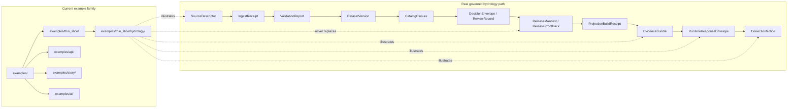

# hydrology

Public-safe, non-authoritative hydrology thin-slice examples for Kansas Frontier Matrix.

> **Status:** Experimental  
> **Owners:** `@bartytime4life` *(current public `CODEOWNERS` fallback for `/examples/`; re-check the working branch before merge if narrower ownership lands)*  
>        
> **Quick jumps:** [Scope](#scope) · [Repo fit](#repo-fit) · [Accepted inputs](#accepted-inputs) · [Exclusions](#exclusions) · [Directory tree](#directory-tree) · [Quickstart](#quickstart) · [Usage](#usage) · [Diagram](#diagram) · [Tables](#tables) · [Task list / definition of done](#task-list--definition-of-done) · [FAQ](#faq) · [Appendix](#appendix)  
> **Repo fit:** path `examples/thin_slice/hydrology/README.md` · parent [../README.md](../README.md) · examples root [../../README.md](../../README.md) · repo root [../../../README.md](../../../README.md) · gatehouse [../../../.github/README.md](../../../.github/README.md) · sibling example lanes [../../api/README.md](../../api/README.md) · [../../story/README.md](../../story/README.md) · [../../ui/README.md](../../ui/README.md) · stronger owner surfaces [../../../contracts/README.md](../../../contracts/README.md) · [../../../schemas/README.md](../../../schemas/README.md) · [../../../tests/README.md](../../../tests/README.md) · [../../../policy/README.md](../../../policy/README.md) · [../../../docs/standards/README.md](../../../docs/standards/README.md)

> [!IMPORTANT]
> This directory is **example space**, not canonical truth space.
>
> Use it to explain the hydrology-first thin slice with **public-safe**, **redacted**, and **illustrative** material. Do **not** let this folder become the only home of contracts, proof objects, policy fixtures, release artifacts, or live hydrology data.

> [!NOTE]
> Read statements in this file with KFM truth labels:
>
> - **CONFIRMED** — visible in the current repository branch or repeated clearly in attached KFM doctrine
> - **INFERRED** — strongly implied by adjacent repo structure or repeated doctrine, but not directly proven as mounted implementation here
> - **PROPOSED** — recommended shape for this directory if it grows beyond the current scaffold
> - **UNKNOWN** — cannot be verified from the current visible repo and attached evidence
> - **NEEDS VERIFICATION** — worth checking at merge time because repo state may have moved

> [!NOTE]
> This README is grounded in the current public example tree plus March–April 2026 KFM doctrine. The working branch you are changing still outranks public `main` for exact inventory, ownership, and neighboring links.

---

## Scope

`examples/thin_slice/hydrology/` is the **illustrative lane** for the KFM hydrology-first thin slice.

In doctrine, hydrology is not a decorative topic bucket. It is a Kansas operating lane covering **surface water, groundwater, stream gages, reservoirs, flood stages, water-quality measurements, watersheds, and water governance**. In the example tree, this folder has a narrower job: help contributors, reviewers, and maintainers inspect what a real hydrology slice should prove end to end without pretending that this folder is the runtime, the publication lane, or the proof-object registry.

In practice, that means this directory is a good place for:

- small, redacted example payloads
- screenshot or mock payload packs for trust-visible surfaces
- narrow walkthrough assets that explain how hydrology moves from source admission to evidence-backed surface behavior
- reviewer-oriented examples of honest negative outcomes such as **ABSTAIN**, **DENY**, **ERROR**, or **stale-visible**

This directory is **not** where authoritative hydrology state should live.

[Back to top](#hydrology)

---

## Repo fit

### Path and role

| Field | Value |
|---|---|
| Path | `examples/thin_slice/hydrology/README.md` |
| Role | Domain-anchored thin-slice example README |
| Parent lane | [`examples/thin_slice/`](../README.md) |
| Examples root | [`examples/`](../../README.md) |
| Repo root doctrine anchor | [`../../../README.md`](../../../README.md) |
| Gatehouse context | [`../../../.github/README.md`](../../../.github/README.md) · [`../../../.github/CODEOWNERS`](../../../.github/CODEOWNERS) |
| Stronger owner surfaces | [`../../../contracts/`](../../../contracts/README.md) · [`../../../schemas/`](../../../schemas/README.md) · [`../../../policy/`](../../../policy/README.md) · [`../../../tests/`](../../../tests/README.md) · [`../../../docs/standards/`](../../../docs/standards/README.md) |
| Sibling example lanes | [`../../api/`](../../api/README.md) · [`../../story/`](../../story/README.md) · [`../../ui/`](../../ui/README.md) |

### Current public context

| Surface | Current public state | Why it matters here |
|---|---|---|
| `examples/` | `README.md`, `api/`, `story/`, `thin_slice/`, and `ui/` are visible | Hydrology sits inside a broader example family, not a one-off docs island |
| `examples/thin_slice/` | `README.md` plus nested `hydrology/` are visible | Hydrology is currently the only confirmed thin-slice sublane on public `main` |
| `examples/thin_slice/hydrology/` | `README.md` only | Example assets beyond this README are still **PROPOSED** |
| `/.github/CODEOWNERS` | Current public fallback covers `/examples/` with `@bartytime4life` | The owner label here is grounded, but still worth re-checking on the branch you merge |

### What this directory is

A compact, repo-local place to document and demonstrate the **hydrology-first** example lane inside `examples/thin_slice/`.

### What this directory is not

Not a replacement for:

- contract ownership in [`../../../contracts/`](../../../contracts/README.md)
- schema governance in [`../../../schemas/`](../../../schemas/README.md)
- merge-blocking fixtures in [`../../../tests/`](../../../tests/README.md)
- policy bundle ownership in [`../../../policy/`](../../../policy/README.md)
- release-bearing docs and standards in [`../../../docs/standards/`](../../../docs/standards/README.md)
- runtime behavior owned by apps, services, or governed APIs

### Why hydrology lives here at all

Hydrology is the preferred first thin slice because it is usually public-safe enough to demonstrate outwardly, but still demanding enough to exercise:

- source admission
- time semantics
- validation and quarantine behavior
- release linkage
- evidence drill-through
- bounded runtime outcomes
- correction and rollback lineage

That makes it the right **teaching lane** for `examples/thin_slice/`, even when the real implementation remains elsewhere.

[Back to top](#hydrology)

---

## Accepted inputs

This directory accepts **illustrative** material that helps explain the hydrology-first slice without claiming to be the slice itself.

Examples that belong here:

- redacted example objects showing the doctrinal artifact chain
- sample `EvidenceBundle` and `RuntimeResponseEnvelope` payloads labeled as examples
- screenshots of map, dossier, Evidence Drawer, or stale/correction states
- miniature walkthrough docs for one bounded hydrology scenario
- public-safe mock query/response pairs for Focus outcomes
- diagrams showing how hydrology passes through the governed path

Keep inputs:

- small
- reviewable in Git
- explicit about example status
- public-safe
- easy to delete or replace without destabilizing the real system

[Back to top](#hydrology)

---

## Exclusions

The following do **not** belong here.

| Do not place here | Why | Put it here instead |
|---|---|---|
| Canonical `SourceDescriptor`, `DatasetVersion`, `ReleaseManifest`, or `CorrectionNotice` objects | These are trust-bearing objects, not tutorial props | Authoritative contract/data/release owner surface |
| Merge-blocking valid/invalid fixture inventories | They should be exercised by CI, not just explained by docs | [`../../../tests/`](../../../tests/README.md) and schema/contract owner lanes |
| Real raw captures, processed hydrology datasets, or release artifacts | This folder is not a truth-path storage zone | Governed data and publication lanes |
| Policy bundles, reason/obligation registries, or review-required mappings | Policy must remain machine-readable and centralized | [`../../../policy/`](../../../policy/README.md) |
| Runtime-only DTOs or route contracts treated as source of truth | Prevents example drift from becoming API drift | [`../../../contracts/`](../../../contracts/README.md) |
| Rights-unclear, steward-only, or sensitive hydrology geometry | Example space must stay public-safe | Restricted or steward-only governed lanes |
| Duplicate schema-home material with no ownership decision | The repo already distinguishes `contracts/` and `schemas/` as stronger surfaces | Resolve ownership first, then link from here |

[Back to top](#hydrology)

---

## Directory tree

### Current public example topology

```text
examples/
├── README.md
├── api/
│   └── README.md
├── story/
│   └── README.md
├── thin_slice/
│   ├── README.md
│   └── hydrology/
│       └── README.md
└── ui/
    └── README.md
```

### PROPOSED growth shape for this folder

The structure below is illustrative only. It is a **starter pattern**, not a claim that these files already exist.

```text
examples/
└── thin_slice/
    └── hydrology/
        ├── README.md
        ├── source_descriptor.example.json
        ├── ingest_receipt.example.json
        ├── validation_report.example.json
        ├── dataset_version.example.json
        ├── catalog_closure.example.json
        ├── release_manifest.example.json
        ├── projection_build_receipt.example.json
        ├── evidence_bundle.example.json
        ├── runtime_response_envelope.answer.example.json
        ├── runtime_response_envelope.abstain.example.json
        ├── runtime_response_envelope.deny.example.json
        ├── correction_notice.example.json
        ├── query_examples.md
        └── views/
            ├── overview.md
            ├── detail.md
            └── stale_visible.md
```

### Naming rule

Prefer `*.example.json` or similarly explicit sample labels for anything illustrative in this folder.

That keeps example assets from being mistaken for authoritative artifacts with canonical filenames.

[Back to top](#hydrology)

---

## Quickstart

Use these commands when reviewing or extending this lane.

```bash
# Inspect the current public example family shape in a checkout
ls -la examples
ls -la examples/thin_slice
ls -la examples/thin_slice/hydrology

# Inspect the nearest example README surfaces for tone, ownership, and routing
sed -n '1,240p' examples/README.md
sed -n '1,240p' examples/thin_slice/README.md
sed -n '1,280p' examples/thin_slice/hydrology/README.md

# Inspect current owner and gatehouse context
sed -n '1,120p' .github/CODEOWNERS
sed -n '1,220p' .github/README.md

# Inspect stronger owner surfaces before adding example files
sed -n '1,240p' contracts/README.md
sed -n '1,240p' schemas/README.md
sed -n '1,240p' tests/README.md
sed -n '1,240p' policy/README.md
sed -n '1,240p' docs/standards/README.md
```

When adding new material, review the owner surface first. If the file should become merge-blocking, release-bearing, or policy-enforced, this directory is probably the wrong destination.

[Back to top](#hydrology)

---

## Usage

### 1. Pick the right example lane before you add anything

Hydrology belongs here when the point of the example is the **hydrology-first slice** itself.

Use a sibling lane instead when the example is primarily about:

| Example need | Best lane | Why |
|---|---|---|
| Governed request/response examples | [`../../api/`](../../api/README.md) | API boundary examples already have their own example lane |
| Story Node sidecars, citation behavior, or narrative example packs | [`../../story/`](../../story/README.md) | Story-shaped examples belong in the story lane |
| Trust-visible shell walkthroughs, mock UI states, or view logic demos | [`../../ui/`](../../ui/README.md) | UI-specific illustrative assets belong in the UI lane |
| Domain-anchored, end-to-end hydrology slice explanation | `./` | This folder exists to explain that thin slice specifically |

### 2. Start from the governed chain, not the screenshot

Any example here should point back to the hydrology-first chain, not just to a polished map.

The minimum story this directory should help a reader understand is:

1. a source is admitted
2. a fetch is receipted
3. validation can pass or quarantine
4. a stable dataset version exists before release
5. release and projection are linked
6. a visible surface drills through to evidence
7. runtime answers stay finite and honest
8. correction and rollback remain visible

### 3. Pair happy-path and negative-path examples

A trustworthy example pack should never show only the green path.

For every outward-facing example, prefer a paired negative example:

- **ANSWER** paired with **ABSTAIN**
- **released** paired with **stale-visible**
- **normal detail** paired with **generalized**
- **current** paired with **superseded** or **correction-pending**

### 4. Keep examples public-safe

Hydrology may be comparatively public-safe, but that does not erase KFM review burdens.

Keep example material:

- generalized when exact detail is unnecessary
- redacted when rights or sensitivity could be ambiguous
- explicit about observed vs modeled status
- explicit about freshness basis
- explicit about correction state

### 5. Route examples back to stronger owner surfaces

If you add an example file here, add a short note naming the stronger owner surface.

For example:

- schema-facing example → `contracts/` or the settled schema-home
- CI-facing fixture example → `tests/`
- reason/obligation example → `policy/`
- runbook or merge guidance → `docs/`
- runtime payload owned by actual service code → app/service package plus contract surface

### 6. Prefer reviewable text first

Before adding images or binaries, consider whether a compact Markdown table, JSON sample, or Mermaid flow explains the point more clearly.

If visuals are needed, pair them with text explaining:

- what is being shown
- whether it is illustrative or emitted
- what release/freshness/correction state it represents

[Back to top](#hydrology)

---

## Diagram



The key distinction is deliberate:

- the **real governed path** emits trust-bearing objects
- this **examples family** documents and demonstrates those objects
- this **hydrology lane** is only one sublane inside that broader example surface

[Back to top](#hydrology)

---

## Tables

### Recommended illustrative pack

| Illustrative artifact | What it demonstrates | Status in this directory | Stronger owner if hardened |
|---|---|---|---|
| `source_descriptor.example.json` | Source admission for one bounded hydrology source family | PROPOSED | Contract/schema owner |
| `ingest_receipt.example.json` | Replayable fetch receipt shape | PROPOSED | Contract/schema owner |
| `validation_report.example.json` | Pass/quarantine reasons, spatial + temporal checks | PROPOSED | Contract/schema owner |
| `dataset_version.example.json` | Stable authoritative version shape | PROPOSED | Contract/schema owner |
| `catalog_closure.example.json` | Outward metadata closure and lineage linkage | PROPOSED | Contract/schema/catalog owner |
| `release_manifest.example.json` | Release linkage and public-safe inventory concept | PROPOSED | Release/proof owner |
| `projection_build_receipt.example.json` | Derived delivery linkage back to release | PROPOSED | Derived-delivery owner |
| `evidence_bundle.example.json` | Evidence Drawer and dossier drill-through concept | PROPOSED | Evidence resolver / contract owner |
| `runtime_response_envelope.answer.example.json` | Honest ANSWER outcome | PROPOSED | Runtime contract owner |
| `runtime_response_envelope.abstain.example.json` | Honest insufficiency path | PROPOSED | Runtime contract owner |
| `runtime_response_envelope.deny.example.json` | Rights/sensitivity refusal path | PROPOSED | Runtime contract owner |
| `correction_notice.example.json` | Visible correction/supersession lineage | PROPOSED | Correction/release owner |
| `views/overview.md` | High-level map state and release/freshness explanation | PROPOSED | Example lane |
| `views/detail.md` | Evidence Drawer drill-through example | PROPOSED | Example lane |
| `views/stale_visible.md` | Stale/superseded/correction-pending visibility | PROPOSED | Example lane |

### What a genuine slice proves vs what this folder should show

| Question | Genuine governed slice | This example folder |
|---|---|---|
| Does it emit proof objects? | Yes | It may only mirror or explain them |
| Can it publish? | Potentially, if release-bearing | No |
| Can it own policy? | No, policy should be centralized | No |
| Can it host public-safe examples? | Yes | Yes |
| Can it prove correction lineage behavior? | Yes, through drills or emitted objects | It can only demonstrate what that behavior should look like |
| Can it bypass governed APIs? | No | No |

[Back to top](#hydrology)

---

## Task list / definition of done

A healthy README for this directory should make the following true.

- [ ] The file is no longer a one-line scaffold.
- [ ] The current verified tree is stated plainly before any proposed growth shape.
- [ ] The current public sibling lanes are visible enough that contributors do not dump API, story, or UI examples into hydrology by default.
- [ ] Every future sample file in this directory is labeled **illustrative**, **redacted**, or **example**.
- [ ] No file here is treated as the sole authoritative source for contracts, policy, releases, or runtime behavior.
- [ ] Any added runtime examples include at least one honest negative outcome.
- [ ] Any visual examples show trust-visible state, not just the happy path.
- [ ] Any added material points to the stronger owner surface that should carry the hardened version.
- [ ] Merge-time review re-checks whether the live repo tree has changed since this README was written.

### Practical done criteria for future additions

If this folder grows beyond `README.md`, the addition should satisfy all of the following:

1. it helps explain the hydrology-first slice more clearly than a nearby README already does
2. it stays public-safe
3. it does not create a parallel schema or policy universe
4. it is obvious whether it is **CONFIRMED**, **PROPOSED**, or **illustrative only**
5. deleting it would not break the real trust path

[Back to top](#hydrology)

---

## FAQ

### Is this the real hydrology slice?

No. This is the **examples lane around the slice**, not the release-bearing slice itself.

### Why is hydrology the first thin slice?

Because it is map-native, time-aware, comparatively public-safe, and strong enough to exercise the hard seams of KFM: admission, validation, release linkage, evidence drill-through, finite runtime outcomes, and correction lineage.

### Should valid/invalid schema fixtures live here?

Only when they are clearly **instructional examples**. Merge-blocking or authoritative fixtures belong in the proper contract/schema/test owner surfaces.

### Should hydrology API examples live here?

Only when the point is the **hydrology slice story** rather than the governed API boundary itself. Generic request/response envelopes, auth examples, or route-shape examples belong in [`../../api/`](../../api/README.md).

### Should I use canonical artifact filenames here?

Prefer explicit example names such as `*.example.json` until the owning surface is settled and the files are meant to become authoritative.

### Can I add screenshots here?

Yes, but only if they teach something concrete: release state, freshness state, Evidence Drawer drill-through, or negative-path behavior. Decorative screenshots do not earn their keep.

[Back to top](#hydrology)

---

## Appendix

<details>
<summary><strong>Doctrinal artifact chain this lane may illustrate</strong></summary>

A future example pack in this directory should stay aligned to the hydrology-first artifact chain commonly described across the attached KFM March 2026 manuals:

1. `SourceDescriptor`
2. `IngestReceipt`
3. `ValidationReport`
4. `DatasetVersion`
5. `CatalogClosure`
6. `DecisionEnvelope`
7. `ReviewRecord` *(when required)*
8. `ReleaseManifest / ReleaseProofPack`
9. `ProjectionBuildReceipt`
10. `EvidenceBundle`
11. `RuntimeResponseEnvelope`
12. `CorrectionNotice`

A good example pack does not need to implement every owner surface, but it should not contradict this order.

</details>

<details>
<summary><strong>Merge-time review prompts</strong></summary>

Before approving changes under `examples/thin_slice/hydrology/`, ask:

- Is this file teaching the hydrology-first slice, or duplicating stronger owner material?
- Could a reviewer mistake this for an authoritative emitted artifact?
- Does the example stay public-safe?
- Does it preserve KFM’s negative-outcome honesty?
- Does this example really belong in hydrology, or did it drift into `examples/api/`, `examples/story/`, or `examples/ui/` territory?
- If repo structure changed, do the upstream, sibling, and stronger-owner links in this README still resolve?

</details>

<details>
<summary><strong>Suggested next small addition</strong></summary>

If this folder remains example-only, the highest-value next file is probably one compact, redacted `EvidenceBundle` example paired with one `RuntimeResponseEnvelope` **ABSTAIN** example and one short `stale_visible.md` walkthrough.

That combination would explain:

- evidence drill-through
- finite runtime outcomes
- visible trust state

without pretending the full hydrology lane is already mounted here.

</details>

[Back to top](#hydrology)
