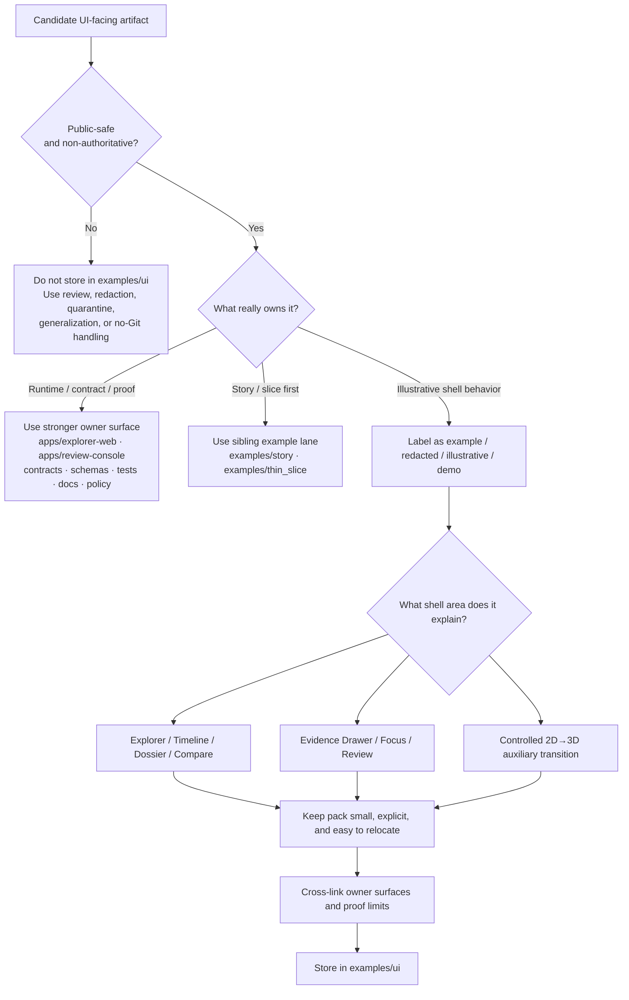

# ui

Public-safe, non-authoritative UI example packs and walkthrough assets for Kansas Frontier Matrix.

> **Status:** `experimental` · current public `main` shows `README.md` only in this directory  
> **Owners:** `@bartytime4life` *(current public example-lane owner marker via `../README.md`; a sublane-specific override is not evident on public `main`)*  
>          
> **Quick jumps:** [Scope](#scope) · [Repo fit](#repo-fit) · [Accepted inputs](#accepted-inputs) · [Exclusions](#exclusions) · [Directory tree](#directory-tree) · [Quickstart](#quickstart) · [Usage](#usage) · [Diagram](#diagram) · [Tables](#tables) · [Task list / definition of done](#task-list--definition-of-done) · [FAQ](#faq) · [Appendix](#appendix)  
> **Repo fit:** `examples/ui/README.md` · parent [../README.md](../README.md) · shell owners [../../apps/explorer-web/README.md](../../apps/explorer-web/README.md), [../../apps/review-console/README.md](../../apps/review-console/README.md) · parallel UI doctrine [../../web/README.md](../../web/README.md) · apps boundary [../../apps/README.md](../../apps/README.md) · repo root [../../README.md](../../README.md)

> [!IMPORTANT]
> This README is intentionally **public-tree-grounded** and **example-lane-scoped**.
>
> Current public `main` proves that `examples/ui/` exists beneath a scaffolded `examples/` surface and currently exposes `README.md` only. It does **not** by itself prove a mounted payload inventory here or deeper runtime code beneath the linked app surfaces.

> [!NOTE]
> Use these labels consistently:
>
> - **CONFIRMED** — directly supported by the current public repo tree or stable KFM doctrine
> - **INFERRED** — conservative completion of confirmed repo/doctrine signals
> - **PROPOSED** — repo-native guidance not yet proven as current checked-in behavior
> - **UNKNOWN** — not verified strongly enough to present as current branch reality
> - **NEEDS VERIFICATION** — explicit review placeholder for the checked-out branch

---

## Scope

`examples/ui/` is KFM’s **public-safe UI example lane**.

Its job is to help contributors, reviewers, and maintainers inspect how KFM’s trust-visible shell is supposed to behave across surfaces such as **Explore**, **Timeline**, **Dossier**, **Story**, **Evidence Drawer**, **Focus**, **Compare**, **Export**, and **Review**—without confusing sample material with runtime truth, policy truth, release evidence, or executable proof.

That scope stays intentionally narrow:

- keep UI example material **small, redacted, and easy to review**
- keep **runtime-owned shell behavior** with the app boundaries that own it
- keep **authoritative payloads, schemas, and fixtures** with their stronger owner surfaces
- keep **release-bearing**, **rights-unclear**, or **sensitivity-bearing** material out
- keep examples obviously **illustrative**, not canonical

A good mental model is:

**source → delivery → style → renderer → UX**

`examples/ui/` can explain the **UX end** of that chain. It must not silently replace the upstream owner surfaces that govern source intake, contract truth, policy decisions, evidence resolution, or release state.

Small 2D→3D auxiliary-view sketches may live here when they explain a burden-bearing transition or story beat. They do **not** make 3D the default shell.

[Back to top](#ui)

## Repo fit

`examples/ui/README.md` is the directory README for KFM’s **UI example lane**.

### Current public snapshot

| Signal | Current public `main` | Posture |
| --- | --- | --- |
| Directory path | `examples/ui/` exists | **CONFIRMED** |
| Current file inventory in this directory | `README.md` only | **CONFIRMED** |
| Parent example tree | `api/`, `story/`, `thin_slice/`, `thin_slice/hydrology/`, `ui/`, and `README.md` | **CONFIRMED** |
| Explorer-facing shell boundary doc | [`../../apps/explorer-web/README.md`](../../apps/explorer-web/README.md) | **CONFIRMED path / INFERRED role** |
| Review-facing shell boundary doc | [`../../apps/review-console/README.md`](../../apps/review-console/README.md) | **CONFIRMED path / INFERRED role** |
| Parallel UI-root doctrine | [`../../web/README.md`](../../web/README.md) | **CONFIRMED** |
| Parent runtime boundary | [`../../apps/README.md`](../../apps/README.md) | **CONFIRMED** |
| Deeper runtime code, routes, tests, fixtures, manifests | not proven from this README surface alone | **NEEDS VERIFICATION** |

> [!NOTE]
> Current public `main` uses `apps/explorer-web/` and `apps/review-console/` for app-facing UI boundaries and still exposes `web/README.md` as parallel UI doctrine.
>
> If the checked-out branch reconciles those names differently, branch reality wins. Update this README in the same PR rather than preserving stale aliases.

### Current sibling example lanes

| Lane | Current visible contents | Best use |
| --- | --- | --- |
| [`../api/`](../api/README.md) | `README.md` | governed request/response examples at the API boundary |
| [`../story/`](../story/README.md) | `README.md` | Story Node examples, sidecars, and citation-behavior illustrations |
| [`../thin_slice/`](../thin_slice/README.md) | `README.md` plus [`hydrology/README.md`](../thin_slice/hydrology/README.md) | end-to-end slice walkthroughs and hydrology-first instructional artifacts |
| [`./ui/`](./README.md) | `README.md` | trust-visible shell examples and UI walkthrough assets |

### Why this lane exists

KFM’s UI doctrine treats the interface as part of the evidence chain, part of the trust model, and part of governed publication. That makes example UI material useful—but only when it stays visibly subordinate to the shell boundaries, the governed API, the Evidence Drawer, and the stronger owner surfaces.

A good artifact here makes four things legible quickly:

1. **shell behavior**
2. **place/time anchoring**
3. **trust-visible state**
4. **clear proof limits**

A weak artifact here becomes a shadow truth surface.

### Stronger owner surfaces

Use `examples/ui/` only after checking whether one of these is the better home:

| Stronger owner | What belongs there | Why it should not default to `examples/ui/` |
| --- | --- | --- |
| [`../../apps/explorer-web/`](../../apps/explorer-web/README.md) | explorer-facing shell composition, map/timeline state choreography, Evidence Drawer consumers, Focus presentation, compare/export UI | shell truth should stay with the shell boundary that renders it |
| [`../../apps/review-console/`](../../apps/review-console/README.md) | reviewer/steward states, approval/denial/hold UI, rollback visibility, correction workflows | review remains a shell variation, not a demo-lane afterthought |
| [`../../contracts/`](../../contracts/README.md) | stable payload shapes, route examples tied to a contract, outward envelopes | contract truth should stay where versioned review happens |
| [`../../schemas/`](../../schemas/README.md) | schema-owned examples, compatibility rules, valid/invalid payloads | schema drift is harder to catch when examples live elsewhere |
| [`../../tests/`](../../tests/README.md) | screenshot baselines, negative-path harnesses, Playwright assets, executable UI proof | executable proof belongs with the enforcing harness |
| [`../../docs/`](../../docs/README.md) | long-form walkthroughs, standards, runbooks, architecture explanations | narrative authority belongs in docs |
| [`../../policy/`](../../policy/README.md) | deny-by-default logic, reason codes, obligation codes, decision tests | governance should not hide in a demo lane |

> [!TIP]
> `examples/ui/` is the place for **illustrative UI packs** that help people understand the shell, not the place where the shell’s truth is defined.

[Back to top](#ui)

## Accepted inputs

Content that belongs here includes:

- small, redacted, public-safe shell-state sketches for **Explore**, **Timeline**, **Dossier**, **Compare**, and **Export**
- screenshot-safe **Evidence Drawer**, **Focus**, and **Review** state examples
- tiny deep-link or view-state examples that echo place, time, layer, and trust context without embedding secrets or privileged state
- instructional packs for keyboard paths, reduced-motion states, calm failure states, stale/generalized states, and evidence-visible UI behavior
- demo sidecars that say what a UI example proves and what it does **not** prove
- shell-choreography fragments for Story or Review when the main value is UI transition behavior rather than story doctrine or slice walkthrough logic
- small 2D→3D auxiliary transition sketches when they explain a controlled, burden-bearing route without reframing 3D as the default shell
- onboarding assets used by docs, diagrams, or review notes when they stay clearly illustrative

A useful heuristic:

- **illustrative**
- **redacted or public-safe**
- **small enough to inspect quickly**
- **shell- or trust-state-first**
- **easy to move later if a stronger owner appears**

> [!TIP]
> Prefer [`../story/`](../story/README.md) when **narrative/citation behavior** is the main point.
>
> Prefer [`../thin_slice/`](../thin_slice/README.md) or [`../thin_slice/hydrology/`](../thin_slice/hydrology/README.md) when the artifact is really an **end-to-end slice walkthrough** wearing UI clothes.

## Exclusions

The following do **not** belong here:

| Do not store here | Why | Put it instead in… |
| --- | --- | --- |
| runtime components, real route handlers, production view logic, local state stores | runtime truth belongs with the app boundary | `../../apps/explorer-web/` or `../../apps/review-console/` |
| authoritative contracts, stable route payloads, schema truth | these are authority-bearing, not illustrative | `../../contracts/` and `../../schemas/` |
| screenshot baselines that block merges, negative-path fixtures, e2e captures | executable proof belongs with the harness | `../../tests/` |
| story-first examples where narrative/citation behavior is the main point | `examples/ui/` should not swallow the story lane | `../story/` |
| slice-first walkthrough assets, especially hydrology-first instructional packs | slice routing is already split out in the repo | `../thin_slice/` or `../thin_slice/hydrology/` |
| release-bearing style JSON, sprite sheets, glyphs, icon inventories, or other governed portrayal assets | portrayal changes affect interpretation, rollback, and release truth | runtime owner surface or governed asset owner after verification |
| review receipts, run receipts, AI receipts, audit bundles, release proof packs | those are trust-bearing artifacts, not illustrative walkthroughs | release / review / data / workflow owner surfaces |
| secrets, tokens, environment files, private URLs, reviewer-only state | never commit secret-bearing example material | environment provisioning / secret manager |
| rights-unclear, restricted, or precise sensitive-location captures | KFM must fail closed under ambiguity | intake, review, quarantine, redaction, generalized release, or no-Git handling |
| large binaries, convenience dumps, or model outputs with no instructional value | high weight, low review value | owner-specific artifact surface |
| narrative claims presented as fact without evidence, limits, or provenance context | violates KFM’s cite-or-abstain posture | draft docs or review notes until evidence is attached |

> [!WARNING]
> If a file is needed to make CI fail, a policy decision execute, a citation resolve, or runtime truth stabilize, it almost certainly has a stronger owner than `examples/ui/`.

[Back to top](#ui)

## Directory tree

### Current public-main snapshot (**CONFIRMED**)

```text
examples/
├── api/
│   └── README.md
├── story/
│   └── README.md
├── thin_slice/
│   ├── hydrology/
│   │   └── README.md
│   └── README.md
├── ui/
│   └── README.md
└── README.md
```

Current public `main` proves that this lane is still **README-only**. It does not yet prove a checked-in payload inventory under `examples/ui/`.

### Proposed growth rule (**PROPOSED**)

Grow inside the current routing shape first.

- add API-boundary examples under [`../api/`](../api/README.md)
- add story-facing examples under [`../story/`](../story/README.md)
- add slice walkthroughs under [`../thin_slice/`](../thin_slice/README.md)
- add hydrology-first instructional slice assets under [`../thin_slice/hydrology/`](../thin_slice/hydrology/README.md)
- add trust-visible shell walkthrough assets under `./`

Only split `examples/ui/` further when repeated use proves that this lane needs real checked-in packs rather than a single routing README.

### Compatible future shapes (**PROPOSED / NEEDS VERIFICATION**)

```text
# General UI example growth shape — illustrative only
examples/
└── ui/
    ├── explorer/
    ├── timeline/
    ├── dossier/
    ├── evidence-drawer/
    ├── focus/
    ├── compare/
    ├── export/
    ├── review/
    └── README.md
```

```text
# Shell-state pair shape — illustrative only
examples/
└── ui/
    └── focus/
        ├── happy-path/
        ├── constrained/
        ├── deny/
        └── README.md
```

```text
# Evidence Drawer pack shape — illustrative only
examples/
└── ui/
    └── evidence-drawer/
        ├── place-dossier/
        ├── layer-inspection/
        ├── stale-visible/
        └── README.md
```

If this directory grows, keep it **surface-first**, **scenario-first**, and **small**. Avoid giant mixed bundles.

[Back to top](#ui)

## Quickstart

Inspect the lane first. Do not assume more exists than the checked-out branch proves.

```bash
# 1) Confirm what the checked-out branch actually exposes
git rev-parse HEAD
find examples -maxdepth 3 -type f -name 'README.md' | sort

# 2) Inspect this lane and its immediate routing context
sed -n '1,220p' examples/README.md
sed -n '1,260p' examples/ui/README.md

# 3) Inspect runtime-adjacent UI boundaries before adding files here
sed -n '1,220p' apps/README.md
sed -n '1,260p' apps/explorer-web/README.md
sed -n '1,220p' apps/review-console/README.md
sed -n '1,260p' web/README.md

# 4) Inspect likely stronger owner surfaces
find . -maxdepth 2 \
  \( -path './contracts/README.md' -o -path './schemas/README.md' -o -path './tests/README.md' -o -path './docs/README.md' -o -path './policy/README.md' \) \
  -print | sort
```

Before adding a new artifact, answer these questions:

1. Is it public-safe and rights-clear?
2. Is it obviously illustrative rather than authoritative?
3. Is the dominant owner really `examples/ui/`, or is it `apps/explorer-web`, `apps/review-console`, `contracts`, `schemas`, `tests`, `docs`, or `policy`?
4. Is the example actually story-first or slice-first, and therefore better routed to a sibling example lane?
5. What shell behavior does it explain?
6. What does it **not** prove?
7. Can it be deleted or moved later without breaking KFM’s source-of-truth boundaries?

## Usage

### 1. Route by dominant responsibility

Pick the **source of truth** before you pick the example lane.

- Explorer / Timeline / Dossier / Focus / Evidence Drawer shell behavior belongs with [`../../apps/explorer-web/`](../../apps/explorer-web/README.md).
- Review / steward states belong with [`../../apps/review-console/`](../../apps/review-console/README.md).
- Story-first narrative and citation behavior belongs with [`../story/`](../story/README.md).
- End-to-end slice walkthroughs belong with [`../thin_slice/`](../thin_slice/README.md) or [`../thin_slice/hydrology/`](../thin_slice/hydrology/README.md).
- Contract truth belongs with [`../../contracts/`](../../contracts/README.md) or [`../../schemas/`](../../schemas/README.md).
- Executable UI proof belongs with [`../../tests/`](../../tests/README.md).
- Long-form explanation belongs with [`../../docs/`](../../docs/README.md).

Use `examples/ui/` only when the material is **instructional**, **cross-surface**, and **safe to expose**.

### 2. Keep example packs scenario-first

Prefer scenario folders or filenames that make review easy:

- `explorer.selection.redacted.json`
- `focus.deny.restricted.md`
- `evidence-drawer.stale-visible.png`
- `review.hold.public-safe.yaml`

A reviewer should understand the example from the filename alone.

### 3. Pair happy-path and constrained-path states

If the pack exists to demonstrate behavior-heavy UI work, prefer a pair:

- one **happy-path** example
- one **constrained**, **stale**, **generalized**, **hold**, **deny**, or **error** example

That keeps the lane aligned with KFM’s fail-closed posture instead of documenting only the polished path.

### 4. Cross-link owner surfaces and proof limits

Each example pack should point back to:

- the owning runtime or contract surface
- the related test lane, if one exists
- the relevant standards or runbook, if one exists
- the rule or shell behavior it is meant to illuminate
- the specific thing it does **not** prove

`examples/ui/` should make the repo easier to navigate, not create a second unofficial truth system.

### 5. Keep place and time visible

KFM’s shell law keeps geography and chronology coequal. A good UI example therefore exposes, directly or via sidecar:

- what place or scope it is about
- what time basis it speaks for
- which layers or panels matter
- whether the state is supported, partial, stale-visible, generalized, held, denied, or withdrawn

### 6. Move packs out when they harden

Move material out of `examples/ui/` once it becomes:

- merge-blocking
- contract-governing
- release-bearing
- tightly app-owned rather than cross-surface
- the only place where an important rule is described

[Back to top](#ui)

## Diagram



## Tables

### Placement matrix

| Artifact class | Keep in `examples/ui/`? | Stronger owner when authoritative | Why |
| --- | --- | --- | --- |
| Tiny redacted Explorer payload | Yes | `../../apps/explorer-web/` or `../../contracts/` | useful for walkthroughs; weak as source of truth |
| Timeline compare state sketch | Yes | `../../apps/explorer-web/` plus `../../tests/` | good for onboarding and review |
| Review-state screenshot or hold-state sketch | Yes | `../../apps/review-console/` or `../../tests/` | useful for reviewer UX explanation, not review truth |
| Dossier or Story shell-state pack | Sometimes | `../story/`, `../../apps/explorer-web/`, or `../../docs/` | keep it here only when shell choreography is the point |
| Evidence Drawer illustrative bundle sketch | Yes, if clearly redacted | `../../apps/explorer-web/`, `../../contracts/`, or `../../tests/` | helps explain drill-through behavior |
| Focus example outcome | Yes, if clearly illustrative | `../../apps/explorer-web/`, `../../contracts/`, or `../../tests/` | should preserve scope echo and finite outcome |
| Hydrology-first slice walkthrough asset | Usually no | `../thin_slice/hydrology/` | slice-specific instructional material already has a lane |
| Screenshot baseline used to block regressions | No | `../../tests/` | executable proof belongs with the harness |
| Contract-owned payload sample | Sometimes | `../../contracts/` or `../../schemas/` | canonical validation ownership should stay close to the contract |
| Style registry JSON or governed asset manifest | No | runtime owner or governed asset owner | portrayal changes are release-bearing |
| Secret-bearing or rights-unclear screen capture | No | nowhere in Git until resolved | violates KFM trust posture |

### Minimum sidecar fields for a UI example pack

| Field | Why it helps |
| --- | --- |
| `surface` | binds the artifact to Explore, Timeline, Dossier, Story, Evidence Drawer, Focus, Compare, Export, or Review |
| `scenario` | states the precise behavior under review |
| `scope_echo` | keeps place and time visible in the example |
| `redaction_note` | makes public-safety handling explicit |
| `owner_surface` | points reviewers back to the stronger owner |
| `proof_limit` | states what the example does **not** prove |
| `truth_posture` | keeps the artifact visibly illustrative rather than canonical |

### Truth-label guide for this directory

| Label | Use here when… |
| --- | --- |
| **CONFIRMED** | the current repo or stable KFM doctrine directly proves the statement |
| **INFERRED** | repo shape plus doctrine strongly suggests the statement, but the exact branch-local detail was not fully rechecked |
| **PROPOSED** | the directory shape or practice is a sensible next step, not present branch fact |
| **UNKNOWN** | ownership, implementation depth, or content presence is not verified strongly enough |
| **NEEDS VERIFICATION** | a placeholder owner, path detail, or branch-local fact should be checked before merge |

[Back to top](#ui)

## Task list / Definition of done

A contribution to `examples/ui/` is ready when all relevant checks below are true:

- [ ] It is public-safe, rights-clear, and small enough to review quickly.
- [ ] It is explicitly labeled as `example`, `demo`, `illustrative`, `sample`, or `redacted`.
- [ ] It does not pretend to be canonical truth, runtime truth, release evidence, or executable proof.
- [ ] The stronger owner surface was checked first.
- [ ] If the example is really story-first or slice-first, the sibling example lane was checked first.
- [ ] The owning runtime, contract, test, or doc surface is linked when one exists.
- [ ] If the pack demonstrates behavior, it says what it proves and what it does **not** prove.
- [ ] If a negative or constrained state matters, a paired example exists here or a linked test exists elsewhere.
- [ ] Place, time, and trust state remain visible.
- [ ] No secret-bearing, reviewer-only, or rights-unclear data was committed.
- [ ] The artifact can be moved later without breaking KFM’s source-of-truth boundaries.

## FAQ

### Why not put Playwright screenshots or merge-blocking image baselines here?

Because once the artifact is **test-enforcing**, it belongs with the harness that enforces it. This lane is for explanation, not blocking proof.

### Where should story-first examples go?

Use [`../story/`](../story/README.md) when the main point is **Story Node structure, citation behavior, or narrative drill-through**, rather than shell choreography.

### Where should slice or hydrology walkthroughs go?

Use [`../thin_slice/`](../thin_slice/README.md) or [`../thin_slice/hydrology/`](../thin_slice/hydrology/README.md) when the value is an **end-to-end slice walkthrough** rather than a UI-state illustration.

### Can `examples/ui/` contain Focus or Review outputs?

Yes—when they are clearly **illustrative**, **redacted**, and linked back to their stronger owner surfaces. They should not be the only place those behaviors are described.

### Can this directory hold 3D example states?

Yes, but only as **controlled auxiliary transitions** or burden-bearing examples. `examples/ui/` should not teach 3D as the default authoritative shell.

### Can this directory become a mini design system?

No. It can explain shell behavior and example states, but it should not become a detached UI truth layer competing with the runtime owner, the docs, or the contract surfaces.

### When should a file move out of `examples/ui/`?

When it becomes authoritative, executable, release-bearing, tightly app-owned, or too important to live only as an example.

[Back to top](#ui)

## Appendix

<details>
<summary>Suggested naming and sidecar pattern</summary>

Prefer small, scenario-first names:

```text
surface.scenario.visibility.format
```

Examples:

```text
explorer.selection.redacted.json
focus.deny.restricted.md
evidence-drawer.stale-visible.png
review.hold.public-safe.yaml
```

A tiny sidecar can help preserve context:

```yaml
surface: focus
scenario: deny_due_to_scope
truth_posture: illustrative
scope_echo:
  place: selected_county
  time_basis: as_of
  active_layers:
    - streams
    - parcels
redaction_note: public-safe generalization applied
owner_surface: ../../apps/explorer-web/README.md
proof_limit: not executable test proof
```

Keep sidecars short. If the sidecar becomes the main documentation surface, move the pack into `../../docs/` or its stronger owner.

</details>

<details>
<summary>Suggested future subfolder map (PROPOSED)</summary>

```text
examples/ui/
├── explorer/
├── timeline/
├── dossier/
├── evidence-drawer/
├── focus/
├── compare/
├── export/
├── review/
└── README.md
```

Use this only when the checked-out branch actually accumulates enough material to justify the split.

</details>
