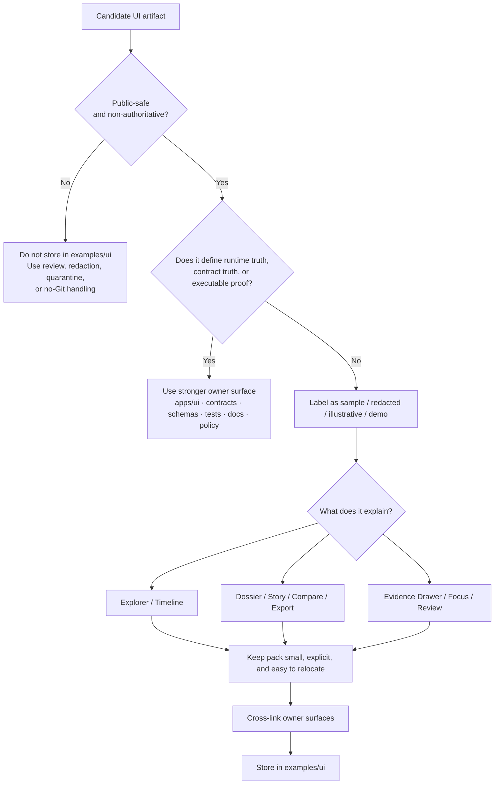

# ui

Public-safe, non-authoritative UI example packs and walkthrough assets for Kansas Frontier Matrix.

> **Status:** Experimental  
> **Owners:** `@bartytime4life` *(inherited from `../README.md`; recheck before merge if subdirectory ownership has diverged)*  
>        
> **Quick jumps:** [Scope](#scope) · [Repo fit](#repo-fit) · [Accepted inputs](#accepted-inputs) · [Exclusions](#exclusions) · [Directory tree](#directory-tree) · [Quickstart](#quickstart) · [Usage](#usage) · [Diagram](#diagram) · [Tables](#tables) · [Task list / definition of done](#task-list--definition-of-done) · [FAQ](#faq) · [Appendix](#appendix)  
> **Repo fit:** `examples/ui/README.md` · parent [../README.md](../README.md) · runtime owner [../../apps/ui/README.md](../../apps/ui/README.md) · apps boundary [../../apps/README.md](../../apps/README.md) · repo root [../../README.md](../../README.md)

> [!IMPORTANT]
> `examples/ui/` is the **illustrative UI lane**, not the runtime truth surface.
>
> Use it to explain trust-visible shell behavior for KFM’s UI without turning demos into contracts, executable proof, release evidence, or app-owned implementation.

> [!NOTE]
> Read statements here as:
>
> - **CONFIRMED** — directly supported by current repo-visible evidence or stable KFM doctrine
> - **INFERRED** — strongly suggested by adjacent repo structure or doctrine, but not fully rechecked here
> - **PROPOSED** — recommended next shape for this lane
> - **UNKNOWN** — not established strongly enough to state as fact
> - **NEEDS VERIFICATION** — branch-local detail to confirm before merge

---

## Scope

`examples/ui/` is the public-safe example lane for **UI-specific** KFM material.

Its job is to help contributors, reviewers, and maintainers inspect how KFM’s trust-visible shell is supposed to behave across surfaces such as **Explorer**, **Timeline**, **Dossier**, **Story**, **Evidence Drawer**, **Focus**, **Compare**, **Export**, and **Review**—without confusing sample material with runtime truth, policy truth, or release-bearing artifacts.

That scope stays intentionally narrow:

- keep UI example material **small, redacted, and easy to review**
- keep **runtime-owned behavior** with the runtime owner
- keep **authoritative payloads, schemas, and fixtures** with their owning surface
- keep **release-bearing** or **rights-unclear** material out
- keep examples obviously **illustrative**, not canonical

A good mental model is:

**source → delivery → style → renderer → UX**

`examples/ui/` may explain the **UX end** of that chain, but it must not silently replace the upstream owner surfaces that govern the earlier steps.

[Back to top](#ui)

## Repo fit

`examples/ui/README.md` is the directory README for KFM’s UI example lane.

| Field | Value |
| --- | --- |
| Path | `examples/ui/README.md` |
| Parent lane | [`../README.md`](../README.md) |
| Runtime owner surface | [`../../apps/ui/README.md`](../../apps/ui/README.md) |
| Stronger owner surfaces | [`../../contracts/`](../../contracts/) · [`../../schemas/`](../../schemas/) · [`../../tests/`](../../tests/) · [`../../docs/`](../../docs/) · [`../../policy/`](../../policy/) |
| Current verified minimum | `README.md` is present in this directory |
| Branch-local child inventory beyond `README.md` | `NEEDS VERIFICATION` |
| Primary role | cross-surface UI examples, walkthrough payloads, screenshot-safe state sketches, and instructional packs |
| Non-goal | acting as the authority for app logic, contracts, policy, fixtures, or release artifacts |

### Why this lane exists

KFM’s UI doctrine treats the interface as part of the evidence chain, part of the trust model, and part of governed publication. That means example UI material is useful—but only when it stays visibly subordinate to the shell, the governed APIs, the Evidence Drawer, and the stronger owner surfaces.

### Stronger owner surfaces

Use `examples/ui/` only after checking whether one of these is the better home:

| Stronger owner | What belongs there | Why it should not default to `examples/ui/` |
| --- | --- | --- |
| `../../apps/ui/` | runtime code, routes, components, app-owned state behavior | app truth should stay with the app that renders it |
| `../../contracts/` | stable payload shapes, route examples tied to a contract, outward envelopes | contract truth should stay where versioned review happens |
| `../../schemas/` | schema-owned examples, compatibility rules, valid/invalid payloads | schema drift is harder to catch when examples live elsewhere |
| `../../tests/` | screenshot baselines, negative-path harnesses, Playwright artifacts, executable UI proof | executable proof belongs with the enforcing harness |
| `../../docs/` | long-form walkthroughs, screenshots with narrative context, standards, runbooks | narrative authority belongs in docs |
| `../../policy/` | deny-by-default logic, reason codes, obligation codes, decision tests | governance should not hide in a demo lane |

> [!TIP]
> `examples/ui/` is the place for **illustrative UI packs** that help people understand the shell, not the place where the shell’s truth is defined.

## Accepted inputs

Content that belongs here includes:

- small, redacted, public-safe example payloads for **Explorer**, **Timeline**, **Dossier**, **Story**, **Evidence Drawer**, **Focus**, **Compare**, **Export**, or **Review**
- screenshot-safe state sketches that show trust cues, scope chips, stale/generalized states, or evidence drill-through behavior
- tiny deep-link examples that illustrate scope, time, or surface transitions without embedding secrets or privileged state
- instructional packs for keyboard paths, reduced-motion states, calm failure states, and evidence-visible UI behavior
- demo sidecars that explain what a UI example proves and what it does **not** prove
- onboarding assets used by docs, diagrams, or review notes when they stay clearly illustrative
- thin-slice UI walkthrough assets when they are explicitly labeled as examples and are easy to relocate later

A useful heuristic:

- **illustrative**
- **redacted or public-safe**
- **small enough to inspect quickly**
- **cross-surface or onboarding-friendly**
- **easy to move later if a stronger owner appears**

## Exclusions

The following do **not** belong here:

| Do not store here | Why | Put it instead in… |
| --- | --- | --- |
| runtime components, real route handlers, production view logic, local state stores | runtime truth belongs with the app | `../../apps/ui/` |
| authoritative contracts, stable route payloads, schema truth | these are authority-bearing, not illustrative | `../../contracts/` and `../../schemas/` |
| screenshot baselines that block merges, negative-path fixtures, e2e captures | executable proof belongs with the harness | `../../tests/` |
| release-bearing style JSON, sprite sheets, glyphs, icon inventories, or other governed map assets | portrayal changes affect interpretation and rollback | runtime owner surface or the governed asset owner after verification |
| secrets, tokens, environment files, private URLs, reviewer-only state | never commit secret-bearing example material | environment provisioning / secret manager |
| rights-unclear, restricted, or precise sensitive-location captures | KFM must fail closed under ambiguity | intake, review, quarantine, redaction, or no-Git placement |
| large binaries, convenience dumps, or model outputs with no instructional value | high weight, low review value | owner-specific artifact surface |
| narrative claims presented as fact without evidence, limits, or provenance context | violates KFM’s cite-or-abstain posture | draft docs or review notes until evidence is attached |

> [!WARNING]
> If a file is needed to make CI fail, policy decide, correction propagate, or runtime truth resolve, it almost certainly has a stronger owner than `examples/ui/`.

## Directory tree

### Current verified minimum

```text
examples/
└── ui/
    └── README.md
```

This is the minimum branch-visible shape this README can safely rely on.

### PROPOSED growth shapes

Use a richer tree only when actual example packs accumulate enough value to justify it.

```text
# General UI example growth shape — illustrative only
examples/
└── ui/
    ├── explorer/
    ├── timeline/
    ├── dossier/
    ├── story/
    ├── evidence-drawer/
    ├── focus/
    ├── compare/
    ├── export/
    ├── review/
    └── README.md
```

```text
# Behavior-heavy pack shape — illustrative only
examples/
└── ui/
    └── focus/
        ├── happy-path/
        ├── constrained/
        ├── deny/
        └── README.md
```

```text
# Evidence Drawer pack shape — illustrative only
examples/
└── ui/
    └── evidence-drawer/
        ├── place-dossier/
        ├── layer-inspection/
        ├── stale-visible/
        └── README.md
```

If this directory grows, keep it **surface-first**, **scenario-first**, and **small**. Avoid giant mixed bundles.

[Back to top](#ui)

## Quickstart

Inspect the lane first. Do not assume more exists than the checked-out branch proves.

```bash
# inspect the example lane
ls -la examples/ui
find examples/ui -maxdepth 3 -type f | sort

# inspect the runtime owner surface
ls -la apps/ui
find apps/ui -maxdepth 3 -type f | sort | sed -n '1,120p'

# inspect likely stronger owner surfaces
find contracts schemas tests docs policy -maxdepth 3 -type f | sort | sed -n '1,220p'
```

Before adding a new artifact, answer these questions:

1. Is it public-safe and rights-clear?
2. Is it obviously non-authoritative?
3. Would `../../apps/ui/`, `../../contracts/`, `../../schemas/`, `../../tests/`, `../../docs/`, or `../../policy/` be the better owner?
4. What specific shell behavior does it explain?
5. What does it **not** prove?
6. Can it be deleted or moved later without breaking the repo’s source of truth?

## Usage

### 1. Choose the owner surface first

Pick the **source of truth** before you pick the example lane.

- Runtime behavior belongs with `../../apps/ui/`.
- Contract truth belongs with `../../contracts/` or `../../schemas/`.
- Executable UI proof belongs with `../../tests/`.
- Long-form explanation belongs with `../../docs/`.

Use `examples/ui/` only when the material is **instructional**, **cross-surface**, and **safe to expose**.

### 2. Keep example packs scenario-first

Prefer scenario folders or filenames that make review easy:

- `county-selection.redacted.json`
- `focus-deny.restricted.md`
- `evidence-drawer-stale-visible.png`
- `timeline-compare.happy-path.yaml`

A reviewer should understand the example from the filename alone.

### 3. Pair happy-path and constrained-path examples

If the pack exists to demonstrate behavior-heavy UI work, prefer a pair:

- one **happy-path** example
- one **constrained**, **stale**, **generalized**, or **deny-path** example

That keeps the lane aligned with KFM’s fail-closed posture instead of documenting only the polished path.

### 4. Cross-link the owner surfaces

Each example pack should point back to:

- the owning runtime or contract surface
- the related test lane, if one exists
- the relevant standards or runbook, if one exists
- the rule, surface, or shell behavior it is meant to illuminate

`examples/ui/` should make the repo easier to navigate, not create a second unofficial truth system.

### 5. Move packs out when they harden

Move material out of `examples/ui/` once it becomes:

- merge-blocking
- contract-governing
- release-bearing
- app-owned rather than cross-surface
- the only place where an important behavior is described

## Diagram



## Tables

### Placement matrix

| Artifact class | Keep in `examples/ui/`? | Stronger owner when authoritative | Why |
| --- | --- | --- | --- |
| Tiny redacted Explorer payload | Yes | `../../apps/ui/` or `../../contracts/` | useful for walkthroughs; weak as source of truth |
| Timeline compare state sketch | Yes | `../../apps/ui/` plus `../../tests/` | good for onboarding and review |
| Dossier or Story screenshot-safe pack | Yes | `../../docs/` or `../../apps/ui/` | valuable for explanation, not for runtime authority |
| Evidence Drawer illustrative bundle sketch | Yes, if clearly redacted | `../../contracts/`, `../../tests/`, or runtime docs | helps explain drill-through behavior |
| Focus example outcome | Yes, if clearly illustrative | `../../contracts/`, `../../tests/`, or `../../apps/ui/` | should preserve scope echo and finite outcome |
| Screenshot baseline used to block regressions | No | `../../tests/` | executable proof belongs with the harness |
| Contract-owned payload sample | Sometimes | `../../contracts/` or `../../schemas/` | canonical validation ownership should stay close to the contract |
| Style registry JSON or governed asset manifest | No | runtime owner or asset owner | portrayal changes are release-bearing |
| Secret-bearing or rights-unclear screen capture | No | nowhere in Git until resolved | violates KFM trust posture |

### Minimum sidecar fields for a UI example pack

| Field | Why it helps |
| --- | --- |
| `surface` | binds the artifact to Explorer, Timeline, Dossier, Story, Evidence Drawer, Focus, Compare, Export, or Review |
| `scenario` | states the precise behavior under review |
| `scope_echo` | keeps place and time visible in the example |
| `redaction_note` | makes public-safety handling explicit |
| `owner_surface` | points reviewers back to the stronger owner |
| `proof_limit` | states what the example does **not** prove |
| `truth_posture` | keeps the artifact visibly illustrative rather than canonical |

### Truth-label guide for this directory

| Label | Use here when… |
| --- | --- |
| **CONFIRMED** | the current repo or stable KFM doctrine directly proves the statement |
| **INFERRED** | repo shape plus doctrine strongly suggest the statement, but the exact branch-local detail was not fully rechecked |
| **PROPOSED** | the directory shape or practice is a sensible next step, not present branch fact |
| **UNKNOWN** | ownership, implementation depth, or content presence is not verified strongly enough |
| **NEEDS VERIFICATION** | a placeholder owner, path detail, or branch-local fact should be checked before merge |

[Back to top](#ui)

## Task list / Definition of done

A contribution to `examples/ui/` is ready when all relevant checks below are true:

- [ ] It is public-safe, rights-clear, and small enough to review quickly.
- [ ] It is labeled as `example`, `demo`, `illustrative`, `sample`, or `redacted`.
- [ ] It does not pretend to be canonical truth, runtime truth, release evidence, or executable proof.
- [ ] The stronger owner surface was checked first.
- [ ] The owning runtime, contract, test, or doc surface is linked when one exists.
- [ ] If the pack demonstrates behavior, it says what it proves and what it does **not** prove.
- [ ] If a negative or constrained state matters, a paired example exists here or a linked test exists elsewhere.
- [ ] No secret-bearing, reviewer-only, or rights-unclear data was committed.
- [ ] The artifact can be moved later without breaking KFM’s source-of-truth boundaries.

## FAQ

### Why not put Playwright screenshots or merge-blocking image baselines here?

Because once the artifact is **test-enforcing**, it belongs with the harness that enforces it. This lane is for explanation, not blocking proof.

### Can `examples/ui/` contain Focus outputs?

Yes—when they are clearly **illustrative**, **redacted**, and linked back to their stronger owner surfaces. They should not be the only place where Focus behavior is described.

### Can this directory hold style or legend examples?

Small legend or portrayal sketches are fine. **Release-bearing** style JSON, sprite ownership, glyph inventories, or governed asset manifests are not.

### Can this directory become a mini design system?

No. It can explain shell behavior and example states, but it should not become a detached UI truth layer competing with the runtime owner or the docs.

### When should a file move out of `examples/ui/`?

When it becomes authoritative, executable, release-bearing, app-owned, or too important to live only as an example.

[Back to top](#ui)

## Appendix

<details>
<summary>Suggested naming and pack pattern</summary>

Prefer small, scenario-first names:

```text
surface.scenario.visibility.format
```

Examples:

```text
focus.answer.public-safe.json
focus.deny.restricted.md
evidence-drawer.stale-visible.png
timeline.compare.redacted.yaml
```

A tiny sidecar can help preserve context:

```yaml
surface: focus
scenario: deny_due_to_scope
truth_posture: illustrative
scope_echo:
  place: county
  time_basis: as_of
redaction_note: public-safe generalization applied
owner_surface: ../../apps/ui/README.md
proof_limit: not executable test proof
```

Keep sidecars short. If the sidecar becomes the main documentation surface, move the pack into `../../docs/` or its stronger owner.

</details>

<details>
<summary>Suggested future subfolder map (PROPOSED)</summary>

```text
examples/ui/
├── explorer/
├── timeline/
├── dossier/
├── story/
├── evidence-drawer/
├── focus/
├── compare/
├── export/
├── review/
└── README.md
```

Use this only when the branch actually accumulates enough material to justify the split.

</details>
