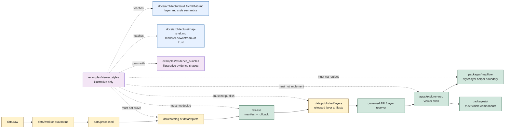

<!-- [KFM_META_BLOCK_V2]
doc_id: kfm://doc/examples/viewer-styles/readme
title: Viewer Style Examples README
type: standard
version: v0.1.0
status: draft
owners: TODO(owner): examples steward; TODO(owner): UI steward; TODO(owner): map steward; TODO(owner): MapLibre steward; TODO(owner): design-system steward; TODO(owner): evidence steward; TODO(owner): policy steward; TODO(owner): release steward; TODO(owner): docs steward
created: NEEDS VERIFICATION - greenfield stub existed before 2026-06-30 expansion
updated: 2026-06-30
policy_label: public-review
related: [../README.md, ../evidence_bundles/README.md, ../focus_flows/README.md, ../story_decks/README.md, ../../docs/architecture/map-shell.md, ../../docs/architecture/ui/README.md, ../../docs/architecture/ui/LAYERING.md, ../../apps/explorer-web/README.md, ../../packages/maplibre/README.md, ../../packages/ui/README.md, ../../data/published/layers/README.md, ../../docs/doctrine/directory-rules.md]
tags: [kfm, examples, viewer-styles, maplibre, style-json, style-fragments, layer-style, legend, color-ramp, feature-state, trust-badge, accessibility, evidence-drawer, stylemanifest, layermanifest, non-authoritative, cite-or-abstain]
notes: ["This README replaces a greenfield stub at `examples/viewer_styles/README.md`.", "Viewer style examples are illustrative review aids only; operational style helper logic belongs under `packages/maplibre/`, shared UI tokens/components belong under `packages/ui/`, deployable viewer behavior belongs under `apps/explorer-web/`, and released map/layer artifacts belong under `data/published/layers/` after release gates close.", "Examples must not become StyleManifest authority, LayerManifest authority, MapLibre runtime code, UI component code, design-system token authority, published layer artifacts, screenshots, proofs, receipts, policy decisions, release decisions, governed API responses, or public style truth by placement.", "Directory Rules classifies `styles/` and `viewer_templates/` as compatibility roots, not canonical homes. This examples path does not create or legitimize those roots.", "README presence does not prove example style inventory, style schemas, validators, fixtures, CI checks, style route behavior, MapLibre runtime behavior, public layer payloads, release-manifest approval, or hosting readiness."]
[/KFM_META_BLOCK_V2] -->

<a id="top"></a>

# Viewer Style Examples

Illustrative viewer-style examples for teaching how KFM map and UI presentation should handle MapLibre style fragments, layer paint/layout examples, legends, color ramps, trust badges, negative states, accessibility labels, Evidence Drawer handoffs, and release-gated style behavior without becoming operational style authority.

<p>
  
  
  
  
  
</p>

**Status:** draft / example-lane guidance  
**Owners:** `TODO(owner): examples steward` · `TODO(owner): UI steward` · `TODO(owner): map steward` · `TODO(owner): MapLibre steward` · `TODO(owner): design-system steward` · `TODO(owner): evidence steward` · `TODO(owner): policy steward` · `TODO(owner): release steward` · `TODO(owner): docs steward`  
**Path:** `examples/viewer_styles/README.md`  
**Quick links:** [Scope](#scope) · [Path posture](#path-posture) · [Repo fit](#repo-fit) · [Accepted material](#accepted-material) · [Exclusions](#exclusions) · [Example contract](#example-contract) · [Viewer style guardrails](#viewer-style-guardrails) · [Lifecycle relationship](#lifecycle-relationship) · [Suggested layout](#suggested-layout) · [Validation checklist](#validation-checklist) · [Status notes](#status-notes) · [Evidence ledger](#evidence-ledger)

> [!IMPORTANT]
> Files under `examples/viewer_styles/` are examples. They are not governed `StyleManifest` files, `LayerManifest` files, MapLibre style JSON for production, viewer runtime code, UI component code, design-token authority, released layer artifacts, EvidenceBundles, ProofPacks, receipts, policy decisions, release decisions, public API responses, tests, fixtures, validators, or public style truth.

> [!CAUTION]
> Styling is not governance. A color ramp, filter, opacity, zoom threshold, sprite, glyph, label, symbol, legend, or feature-state rule cannot hide sensitive detail, prove a claim, authorize a layer, approve a release, or turn rendered features into evidence.

---

## Scope

`examples/viewer_styles/` is a documentation and review aid for viewer style examples.

Use this lane to demonstrate:

- how a style fragment should remain downstream of `LayerManifest`, `StyleManifest`, `TileArtifactManifest`, `MapReleaseManifest`, `PolicyDecision`, EvidenceRef, citation-validation, rollback, and correction refs;
- how MapLibre-style source/layer fragments can be shown synthetically without becoming runtime style JSON;
- how legends, color ramps, class breaks, line weights, opacity, labels, hover/selected feature-state styles, and trust badges should carry caveats and finite outcomes;
- how sensitive, restricted, stale, unreleased, unsigned, rollback-mismatched, or citation-failed layer states should render `ABSTAIN`, `DENY`, `ERROR`, `HOLD`, or a safe disabled style rather than a misleading normal style;
- how accessibility requirements should be visible: non-color labels, sufficient contrast review, keyboard/focus state, reduced-motion alternatives, and screen-reader text where UI behavior is illustrated;
- how examples should avoid direct public reads from RAW, WORK, QUARANTINE, PROCESSED, unpublished CATALOG/TRIPLET, proof stores, receipt stores, source registries, model runtimes, graph/vector stores, or canonical/internal stores.

This folder should make reviewers faster. It should not become a shortcut around operational style manifests, MapLibre adapter code, shared UI components, schemas, validators, published layer artifacts, policy review, release gates, EvidenceBundle support, or governed API behavior.

---

## Path posture

The target file existed as a greenfield stub:

```text
examples/viewer_styles/README.md
```

Current placement evidence:

- `examples/README.md` describes `examples/` as walkthroughs and example assemblies.
- `docs/architecture/map-shell.md` says style JSON is a downstream carrier and MapLibre is not the canonical truth store, source registry, policy engine, citation authority, review authority, publication authority, or AI authority.
- `docs/architecture/ui/README.md` defines the UI subsystem as map-first and evidence-bounded, with MapLibre behind adapter boundaries and released, policy-checked state.
- `docs/architecture/ui/LAYERING.md` defines KFM layers as derived surfaces and identifies `StyleManifest`, `LegendDescriptor`, `LayerManifest`, `PolicyDecision`, EvidenceBundle, release, proof, receipt, and rollback relationships.
- `packages/maplibre/README.md` defines MapLibre helper code as the correct package boundary for renderer source/layer/style descriptor helpers, not source truth or release authority.
- `packages/ui/README.md` defines shared UI components and design tokens as component-ready rendering helpers, not deployable app, renderer, policy, release, or truth authority.
- `apps/explorer-web/README.md` defines the deployable map-first shell and marks `ui/`, `web/`, `styles/`, and `viewer_templates/` as compatibility or migration roots, not parallel shell authorities.
- `data/published/layers/README.md` defines released public-safe map/API layer artifacts as downstream carriers after release gates close.
- Directory Rules list `examples/` as a canonical root for examples and classify `styles/` and `viewer_templates/` as compatibility roots.

Therefore this README treats `examples/viewer_styles/` as **CONFIRMED path presence / DRAFT example-lane guidance / NON-AUTHORITATIVE by placement**.

---

## Repo fit

| Responsibility | Correct home | Boundary |
|---|---|---|
| Viewer style example snippets, walkthroughs, negative-state demonstrations, and review notes | `examples/viewer_styles/` | This lane. Illustrative only. |
| Example EvidenceBundle snippets used beside viewer-style examples | [`../evidence_bundles/`](../evidence_bundles/README.md) | Example lane only; not proof authority. |
| Focus/story examples that consume style examples | [`../focus_flows/`](../focus_flows/README.md), [`../story_decks/`](../story_decks/README.md) | Example lane only; not runtime Focus/Story behavior. |
| Map shell doctrine | [`../../docs/architecture/map-shell.md`](../../docs/architecture/map-shell.md) | Architecture doctrine for renderer downstream-of-trust posture. |
| UI subsystem doctrine | [`../../docs/architecture/ui/`](../../docs/architecture/ui/README.md) | UI architecture and trust-display doctrine. |
| Layer/style semantics | [`../../docs/architecture/ui/LAYERING.md`](../../docs/architecture/ui/LAYERING.md) | Layer, style, manifest, legend, and trust-state meaning. |
| Deployable viewer app | [`../../apps/explorer-web/`](../../apps/explorer-web/README.md) | Public/semi-public shell; examples are not app behavior. |
| MapLibre helper logic | [`../../packages/maplibre/`](../../packages/maplibre/README.md) | Source/layer/style descriptor helper code; examples are not package code. |
| Shared UI components and design tokens | [`../../packages/ui/`](../../packages/ui/README.md) | Component rendering and trust labels; examples are not design-system authority. |
| Released public-safe map/layer artifacts | [`../../data/published/layers/`](../../data/published/layers/README.md) | Published artifacts after gates close; not examples. |
| Style schemas and contracts | `schemas/contracts/v1/layers/`, `contracts/`, or ADR-resolved homes | Machine shape and meaning; examples must not define them. |
| Policy for renderer/style admission and sensitivity | `policy/` | Admissibility authority; examples must not decide policy. |
| Receipts, proofs, release decisions | `data/receipts/`, `data/proofs/`, `release/` | Auditable trust objects; examples cannot emit or approve them. |
| Compatibility roots | `styles/`, `viewer_templates/`, `ui/`, `web/` | Directory Rules marks these as compatibility/migration roots, not canonical authority. |
| Tests, fixtures, validators | `tests/`, `fixtures/`, `tools/validators/` | Operational enforcement; examples are not tests by placement. |

---

## Accepted material

Accepted files should be small, synthetic, reviewable, and clearly marked as examples.

| Accepted item | Use | Required markings |
|---|---|---|
| Minimal MapLibre style fragment | Show a synthetic paint/layout fragment with release/evidence/policy refs nearby. | `example: true`, `authority: non_authoritative_example`, `do_not_publish: true`. |
| Legend/color-ramp example | Teach how classes, units, caveats, and non-color labels should appear. | Synthetic classes and no unsupported claim. |
| Trust-badge example | Show released, stale, denied, restricted, citation-failed, or rollback-mismatch badges. | Text label required; not color alone. |
| Negative style state | Show disabled/withheld/error style for unreleased, unsigned, sensitive, or policy-denied layers. | Explicit reason code. |
| Feature-state example | Show hover/selected/highlight styling without treating selected features as proof. | Must state feature is a candidate until evidence resolves. |
| Accessibility note | Show reduced-motion, keyboard focus, contrast review, and screen-reader labels. | Example only; no UI implementation claim. |
| Reality-boundary style | Show synthetic/reconstructed/generalized visual caveats for story/scene surfaces. | Must not imply visual realism equals evidence. |
| Viewer style checklist | Teach what real style payloads need before publication. | Must state this folder does not release. |

Examples may use Markdown, JSON, YAML, or small tables. Keep examples deterministic and easy to diff.

---

## Exclusions

| Do not place here | Correct home or action |
|---|---|
| Production MapLibre style JSON, sprite/glyph bundles, map themes, tile URLs, live basemap configs, layer manifests, style manifests, tile artifact manifests, or released style payloads | `data/published/layers/` and release-resolved artifact homes after gates close |
| MapLibre helper code, runtime adapters, descriptor builders, validation helpers, or package fixtures | `packages/maplibre/`, `tests/`, or `fixtures/` as appropriate |
| Shared UI components, design-system token source, app CSS, theme providers, component stories, or UI package fixtures | `packages/ui/`, `apps/explorer-web/`, `tests/`, or `fixtures/` as appropriate |
| Deployable viewer routes, app-level settings, runtime config, public API client code, Story Player code, or Evidence Drawer code | `apps/explorer-web/`, `apps/governed-api/`, `packages/ui/`, or accepted implementation roots |
| RAW, WORK, QUARANTINE, PROCESSED, CATALOG, TRIPLET, PUBLISHED lifecycle payloads | `data/<phase>/...` under lifecycle rules |
| EvidenceBundles, ProofPacks, citation-validation reports, proof indexes, validation reports, or integrity bundles | `data/proofs/` |
| Run, transform, validation, representation, style-build, AI, telemetry, release, correction, or rollback receipts | `data/receipts/` |
| ReleaseManifest, PromotionDecision, CorrectionNotice, WithdrawalNotice, RollbackCard, signatures, or release changelog | `release/` |
| Contracts, schemas, policy bundles, validators, tests, fixtures, apps, packages, pipelines, connectors, or workflows | Their canonical responsibility roots |
| Exact sensitive locations, living-person data, DNA/genomic records, archaeology site locations, rare species locations, critical infrastructure detail, private land/parcel joins, credentials, secrets, proprietary terms, or reconstructive redaction clues | Quarantine, restrict, redact, generalize, synthesize, or deny |
| Generated labels, legends, or summaries presented as evidence | Governed UI surfaces may cite evidence; generated text is not evidence |

---

## Example contract

Every viewer-style example should answer eight questions without claiming operational maturity:

| Question | Expected answer |
|---|---|
| What visual scenario is illustrated? | A bounded synthetic style, legend, feature-state, trust-badge, or negative-state scenario. |
| What style object is sketched? | A synthetic style fragment, legend descriptor, trust badge, or viewer-state note, not an operational manifest. |
| What released layer or manifest would it depend on? | Synthetic or clearly marked `NEEDS VERIFICATION` references to layer/style/tile/release artifacts. |
| What evidence support is implied? | Synthetic EvidenceRef/EvidenceBundle-like refs when a visual carries consequential claims. |
| What policy/sensitivity posture applies? | `allow`, `restrict`, `hold`, `deny`, `abstain`, `error`, or `not_applicable` as illustrative posture only. |
| What accessibility state is required? | Non-color label, screen-reader text, keyboard/focus state, contrast/reduced-motion note where applicable. |
| What finite outcome should render? | `ANSWER`, `ABSTAIN`, `DENY`, `ERROR`, `HOLD`, or disabled/withheld viewer state when public behavior is illustrated. |
| What must not happen? | No truth, geoprivacy, release, proof, receipt, policy, runtime, package, or public-payload authority by example placement. |

Illustrative JSON should include a visible marker like this:

```json
{
  "example": true,
  "authority": "non_authoritative_example",
  "do_not_publish": true,
  "not_a_style_manifest": true,
  "style_example_id": "kfm://example/viewer-style/NEEDS-VERIFICATION",
  "surface": "viewer_style_example",
  "expected_state": "ABSTAIN",
  "reason": "illustrative example only; style schema, validator, release, policy, and EvidenceBundle behavior NEEDS VERIFICATION",
  "forbidden_use": [
    "style_manifest",
    "layer_manifest",
    "maplibre_runtime_style",
    "published_layer_artifact",
    "proof_record",
    "receipt_record",
    "policy_decision",
    "release_decision",
    "public_api_response",
    "ui_runtime_fixture"
  ]
}
```

> [!WARNING]
> Do not copy example style IDs, colors, class breaks, symbol names, filters, layer refs, tile refs, evidence refs, release refs, policy refs, sprites, glyphs, or legends into operational style payloads. Examples teach shape and failure behavior; they do not publish or validate styles.

---

## Viewer style guardrails

| Risk | Guardrail |
|---|---|
| Style becomes truth | A style can encode presentation, not fact. Claims still require EvidenceBundle support and citation validation. |
| Style becomes geoprivacy | Filters, opacity, zoom thresholds, class breaks, and label hiding cannot substitute for redaction, generalization, aggregation, restricted access, or denial before publication. |
| Color becomes policy | Color may support recognition, but finite outcomes and policy reasons must be text/semantic labels, not color-only signals. |
| Legend becomes evidence | Legends explain released styles and caveats; they are not proof authority. |
| Feature selection becomes proof | Hover/selected/highlight states identify candidates; Evidence Drawer and governed API resolution carry support. |
| Style bypasses release | Style fragments require release/state/digest/rollback context before public use; examples cannot approve a release. |
| Style hides stale or failed state | Stale, unreleased, unsigned, rollback-mismatched, denied, or citation-failed layers render disabled/withheld/negative states. |
| Viewer reads internal data | Viewer style examples must not imply direct reads from lifecycle/internal/proof/receipt stores. |
| Generated labels overclaim | Generated labels, layer names, and summaries are downstream carriers and must not stand in for source/evidence authority. |
| Accessibility is optional | Trust-bearing styles require non-color labels, contrast review, keyboard/focus states, and screen-reader affordances where UI behavior is illustrated. |

---

## Lifecycle relationship



The examples lane is outside the lifecycle spine and outside the renderer/runtime implementation path. It can illustrate viewer style behavior, but it cannot become a style manifest, app runtime, package helper, released artifact, proof, receipt, policy, or release authority.

---

## Suggested layout

This tree is **PROPOSED**. Confirm actual example needs, schema paths, fixture strategy, validator expectations, style contract names, and viewer runtime behavior before adding files.

```text
examples/viewer_styles/
├── README.md
├── maplibre-fragments/
│   ├── minimal-layer-style.example.json
│   ├── withheld-layer-style.example.json
│   └── feature-state-selection-not-proof.example.json
├── legends/
│   ├── drought-color-ramp-with-caveats.example.json
│   ├── hydrology-units-and-time.example.json
│   └── non-color-trust-labels.example.md
├── trust-badges/
│   ├── released.example.json
│   ├── stale-abstain.example.json
│   ├── denied-sensitive.example.json
│   └── rollback-mismatch-error.example.json
├── accessibility/
│   ├── focus-state.example.md
│   ├── screen-reader-labels.example.md
│   └── reduced-motion-style.example.md
└── walkthroughs/
    ├── style-fragment-to-layer-manifest.walkthrough.md
    └── style-filter-not-geoprivacy.walkthrough.md
```

Recommended file naming:

| Pattern | Use |
|---|---|
| `*.example.json` | Non-authoritative JSON example. |
| `*.example.yaml` | Non-authoritative YAML example. |
| `*.example.md` | Short non-authoritative style/accessibility note. |
| `*.walkthrough.md` | Narrative walkthrough, not operational style proof. |
| `README.md` | Local explanation and boundaries. |

---

## Validation checklist

Before adding or changing examples here, verify:

- [ ] The file is marked as an example and non-authoritative.
- [ ] The file contains no real sensitive coordinates, living-person data, DNA/genomic data, archaeology site locations, rare species locations, critical infrastructure detail, private parcel joins, secrets, credentials, proprietary terms, or reconstruction clues.
- [ ] The example does not create StyleManifest, LayerManifest, TileArtifactManifest, MapReleaseManifest, schema, contract, policy, proof, receipt, release, source-registry, route, package, UI component, fixture, validator, or test authority.
- [ ] Any style IDs, colors, class breaks, label text, layer refs, tile refs, evidence refs, release refs, policy refs, sprites, glyphs, and legends are synthetic or clearly marked `NEEDS VERIFICATION`.
- [ ] Any consequential style, legend, badge, or label demonstrates evidence support, policy posture, release/review posture, limitations, correction path, and rollback posture, or renders `ABSTAIN`/disabled.
- [ ] Any sensitive, rights-unclear, role-forbidden, unreleased, stale, unsigned, rollback-mismatched, or restricted example renders `DENY`, `HOLD`, `ABSTAIN`, `ERROR`, or a safely withheld state.
- [ ] Style filters are not used as geoprivacy or access control.
- [ ] Trust state is not represented by color alone.
- [ ] Relative links from this README still resolve.
- [ ] Operational fixtures, if needed, are placed under the accepted test/fixture strategy rather than silently becoming examples.

---

## Status notes

| Item | Status | Notes |
|---|---:|---|
| Target path presence | CONFIRMED | `examples/viewer_styles/README.md` existed as a greenfield stub before this update. |
| Examples root | CONFIRMED README | `examples/README.md` describes walkthroughs and example assemblies. |
| EvidenceBundle examples pattern | CONFIRMED README | `examples/evidence_bundles/README.md` defines example-lane non-authority and proof separation. |
| Map shell doctrine | CONFIRMED README | `docs/architecture/map-shell.md` defines MapLibre/style artifacts as downstream carriers and states renderer is downstream of trust. |
| UI subsystem doctrine | CONFIRMED README | `docs/architecture/ui/README.md` defines map-first evidence-bounded UI, adapter boundaries, trust badges, layer catalog, and Story/Focus/Evidence Drawer surfaces. |
| Layering doctrine | CONFIRMED README | `docs/architecture/ui/LAYERING.md` defines layers as derived surfaces and references StyleManifest and LegendDescriptor semantics. |
| Explorer Web app boundary | CONFIRMED README | `apps/explorer-web/README.md` defines public/semi-public shell posture and identifies `styles/` / `viewer_templates/` as compatibility or migration roots. |
| MapLibre package boundary | CONFIRMED README | `packages/maplibre/README.md` defines style helper code as package scope, not truth/release/policy authority. |
| UI package boundary | CONFIRMED README | `packages/ui/README.md` defines shared UI components/tokens as component rendering helpers, not deployable app, renderer, or truth authority. |
| Published layer lane | CONFIRMED README | `data/published/layers/README.md` defines released public-safe layer artifacts as downstream carriers after release gates close. |
| Compatibility-root status for `styles/` and `viewer_templates/` | CONFIRMED doctrine | Directory Rules classifies those roots as compatibility/migration roots, not canonical homes. |
| Example style inventory | UNKNOWN | This edit did not verify child files beyond this README. |
| Style schemas, validators, fixtures, CI checks, style route behavior, MapLibre runtime behavior, public layer payloads, release-manifest approval, hosting readiness | NEEDS VERIFICATION | No runtime or validation enforcement was proven by this README. |
| Public release readiness | DENY | Examples cannot publish, prove, release, style operational layers, or answer claims. |

---

## Evidence ledger

| Source | Status | Supports | Limits |
|---|---|---|---|
| Previous target file | CONFIRMED | Target existed as a greenfield stub. | Did not define boundaries, accepted material, or exclusions. |
| [`../README.md`](../README.md) | CONFIRMED README | `examples/` is for walkthroughs and example assemblies. | It is short and status `PROPOSED`; it does not define viewer-style specifics. |
| [`../evidence_bundles/README.md`](../evidence_bundles/README.md) | CONFIRMED README | Establishes non-authoritative example-lane behavior and proof separation. | Covers EvidenceBundle examples, not viewer styles directly. |
| [`../../docs/architecture/map-shell.md`](../../docs/architecture/map-shell.md) | CONFIRMED architecture doc | MapLibre is downstream of trust; style JSON is a downstream carrier; no public RAW path, no direct model client, no unreleased tile load, no sensitive geometry hidden only by style. | Many implementation paths and components are marked PROPOSED / NEEDS VERIFICATION in that doc. |
| [`../../docs/architecture/ui/README.md`](../../docs/architecture/ui/README.md) | CONFIRMED architecture doc | UI is map-first, evidence-bounded, uses MapLibre through adapter boundaries, and surfaces layer catalog, trust badges, Evidence Drawer, Focus Mode, Story Node player, settings, and diagnostics. | Many paths and runtime claims are PROPOSED / NEEDS VERIFICATION in that doc. |
| [`../../docs/architecture/ui/LAYERING.md`](../../docs/architecture/ui/LAYERING.md) | CONFIRMED architecture doc | Layers are derived surfaces; StyleManifest, LegendDescriptor, LayerManifest, EvidenceBundle, PolicyDecision, release, proof, receipt, and rollback roles stay separate. | Path placement of the UI subtree is marked PROPOSED in that doc; schema homes are PROPOSED. |
| [`../../apps/explorer-web/README.md`](../../apps/explorer-web/README.md) | CONFIRMED README | Explorer Web is the map-first shell and must use governed APIs; `styles/` and `viewer_templates/` are compatibility/migration roots. | Implementation files, routes, tests, and deployment state remain UNKNOWN / NEEDS VERIFICATION. |
| [`../../packages/maplibre/README.md`](../../packages/maplibre/README.md) | CONFIRMED README | MapLibre helper package may prepare source/layer/style candidates and preserve manifest/evidence/policy/release refs without owning truth. | Package metadata, imports, tests, CI, and runtime bindings remain NEEDS VERIFICATION. |
| [`../../packages/ui/README.md`](../../packages/ui/README.md) | CONFIRMED README | Shared UI components should render governed evidence/policy/release states and design tokens without becoming truth/runtime authority. | Implementation depth is UNKNOWN until source, build config, tests, exports, and consumers are inspected. |
| [`../../data/published/layers/README.md`](../../data/published/layers/README.md) | CONFIRMED README | Published layers are downstream delivery carriers, release-gated, and not proof/release/policy/truth authority. | Actual payload presence, validator wiring, release-manifest approval, and CI remain UNKNOWN unless verified per child lane. |
| [`../../docs/doctrine/directory-rules.md`](../../docs/doctrine/directory-rules.md) | CONFIRMED doctrine | Responsibility-root placement, examples root, lifecycle separation, and compatibility status for `styles/` and `viewer_templates/`. | Some path claims remain PROPOSED / NEEDS VERIFICATION per the doctrine's own notes. |

[Back to top](#top)
