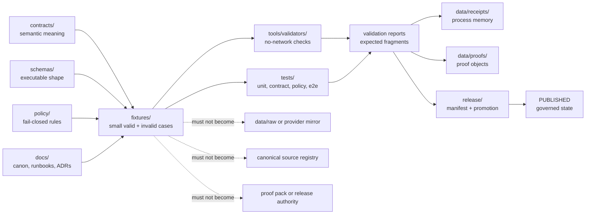

<!-- [KFM_META_BLOCK_V2]
doc_id: kfm://doc/NEEDS_VERIFICATION__fixtures_readme
title: Fixtures
type: standard
version: v1
status: draft
owners: NEEDS_VERIFICATION__fixtures_owner
created: NEEDS_VERIFICATION__YYYY-MM-DD
updated: NEEDS_VERIFICATION__YYYY-MM-DD
policy_label: NEEDS_VERIFICATION__public_or_restricted
related: [../README.md, ../docs/README.md, ../contracts/README.md, ../schemas/README.md, ../policy/README.md, ../tests/README.md, ../data/README.md, ../tools/README.md]
tags: [kfm, fixtures, verification, contracts, schemas, policy, tests]
notes: [Active-branch fixture home, owner, dates, policy label, validator wiring, workflow wiring, and exact child inventory remain NEEDS_VERIFICATION. This README defines the fixture boundary and does not claim runtime automation, branch protection, emitted receipts, proof packs, or publication readiness.]
[/KFM_META_BLOCK_V2] -->

# Fixtures

Deterministic, public-safe fixture boundary for small valid/invalid examples that prove KFM contracts, schemas, policies, validators, and runtime envelopes without becoming source data or proof objects.

<p>
  
  
  
  
  
</p>

| Field | Value |
| --- | --- |
| **Status** | `experimental` |
| **Owners** | `NEEDS_VERIFICATION__fixtures_owner` |
| **Path** | `fixtures/README.md` |
| **Authority class** | Supporting verification surface |
| **Truth posture** | `CONFIRMED` doctrine / `PROPOSED` directory contract / `NEEDS VERIFICATION` active-branch inventory |
| **Repo fit** | Cross-cutting fixture boundary for tiny, deterministic examples used by contracts, schemas, policy, validators, and tests |
| **Quick jumps** | [Scope](#scope) · [Repo fit](#repo-fit) · [Accepted inputs](#accepted-inputs) · [Exclusions](#exclusions) · [Directory tree](#directory-tree) · [Quickstart](#quickstart) · [Usage](#usage) · [Diagram](#diagram) · [Fixture tables](#fixture-tables) · [Task list](#task-list--definition-of-done) · [FAQ](#faq) · [Appendix](#appendix) |

> [!IMPORTANT]
> Fixtures are **verification support**, not canonical truth. A fixture can prove that a validator, schema, policy, or runtime envelope behaves as expected. It must not become a source registry, provider mirror, receipt archive, proof pack, catalog, release manifest, or public evidence authority.

---

## Scope

`fixtures/` is the repo-level fixture boundary for **small, reviewable, deterministic examples** that support KFM’s governed verification model.

This directory may hold cross-cutting fixtures, shared examples, and expected-output fragments when a more specific home is not yet verified. Once a fixture clearly belongs to `tests/fixtures/`, `schemas/tests/fixtures/`, `policy/fixtures/`, or a domain-specific test lane, move or link it there through a documented change.

### Authority statement

| This directory is authoritative for | This directory is **not** authoritative for |
| --- | --- |
| Naming and review expectations for checked-in fixtures | Canonical source data |
| Valid/invalid fixture split and negative-path examples | Source registries or source-admission decisions |
| Small expected-output fragments for validator tests | Runtime receipts, proof packs, release manifests, or catalog records |
| No-network fixture discipline | Workflow YAML, branch protections, deployment state, or live automation |
| Public-safe sample posture | Rights clearance, steward approval, or publication readiness |

### Current evidence boundary

| Claim | Label | Review note |
| --- | --- | --- |
| KFM uses a governed truth path and keeps public claims evidence-bound | `CONFIRMED` doctrine | Preserve `RAW → WORK/QUARANTINE → PROCESSED → CATALOG/TRIPLET → PUBLISHED` in fixture design |
| KFM documentation expects README-like docs to state repo fit, inputs, exclusions, links, diagrams, tables, and definition of done | `CONFIRMED` doctrine | This README follows that pattern |
| Fixture-home ambiguity exists across possible homes such as `tests/fixtures/`, schema-side fixtures, and contract tests | `CONFIRMED` doctrine / `NEEDS VERIFICATION` repo state | This README narrows behavior without pretending active-branch placement is settled |
| A top-level `fixtures/` subtree exists in the active checkout | `NEEDS VERIFICATION` | Verify before merge with `find fixtures -maxdepth 4 -type f` |
| Validators, CI workflows, and branch protections consume this directory | `UNKNOWN` | Do not imply enforcement until workflow YAML and CI output are inspected |

[Back to top](#fixtures)

---

## Repo fit

**Path:** `fixtures/README.md`  
**Role:** shared fixture boundary and orientation page for deterministic examples that pressure-test KFM object families without owning source, policy, proof, or publication authority.

| Direction | Surface | Relationship |
| --- | --- | --- |
| Root posture | [`../README.md`](../README.md) | Keeps this README subordinate to the project’s verification-first operating index |
| Documentation control plane | [`../docs/README.md`](../docs/README.md) | Fixture rules should align with canon, lineage, intake, ADR, and runbook documentation |
| Semantic contracts | [`../contracts/README.md`](../contracts/README.md) | Contracts define meaning; fixtures demonstrate cases |
| Executable schemas | [`../schemas/README.md`](../schemas/README.md) | Schemas define machine shape; fixtures prove valid and invalid shapes |
| Policy gates | [`../policy/README.md`](../policy/README.md) | Policy owns allow/deny/quarantine logic; fixtures exercise it |
| Verification lane | [`../tests/README.md`](../tests/README.md) | Tests consume fixtures and decide pass/fail behavior |
| Emitted artifacts | [`../data/README.md`](../data/README.md) | Receipts, proof objects, catalog records, and release objects belong in data/release lanes, not here |
| Validators and tools | [`../tools/README.md`](../tools/README.md) | Tools may consume fixtures, but tool behavior must be proven separately |

> [!TIP]
> Keep the split visible: **contract meaning upstream, schema shape upstream, fixture cases here, validator behavior in tools/tests, emitted evidence downstream, publication only after promotion gates**.

[Back to top](#fixtures)

---

## Accepted inputs

Content here should stay **small**, **deterministic**, **public-safe**, and **easy to review in Git**.

| Input class | Typical file patterns | Why it belongs |
| --- | --- | --- |
| Valid contract fixture | `source_descriptor.public.valid.json`, `run_receipt.complete.valid.json` | Proves a positive shape against an upstream contract/schema |
| Invalid contract fixture | `evidence_bundle.missing-citation.invalid.json`, `runtime_response.raw-leak.invalid.json` | Keeps negative states first-class and fail-closed |
| Policy fixture | `publish_gate.unresolved-rights.deny.json`, `source_role.misused-authority.deny.yaml` | Exercises policy outcomes without pretending the fixture owns policy |
| Runtime envelope fixture | `focus.answer.valid.json`, `focus.abstain.valid.json`, `drawer_payload.missing-evidence.invalid.json` | Proves finite runtime outcomes and evidence boundaries |
| Domain fixture | `hydrology.huc12.valid.json`, `soil_moisture.unordered_timestamps.invalid.csv` | Supports a domain-specific validator while staying tiny and no-network |
| Expected-output fragment | `run_receipt.complete.expected.json`, `validation_report.deny.expected.json` | Lets tests compare deterministic results without storing emitted proof objects |
| Fixture README | `fixtures/<family>/README.md` | Explains local purpose, links upstream schema/policy, and names exclusions |

### Minimum fixture qualities

A fixture should have:

1. a clear object family or domain lane,
2. a readable filename that names the case or failure reason,
3. explicit valid/invalid/expected intent,
4. no live network dependency,
5. no hidden provider mirror behavior,
6. no unresolved sensitive exact-location exposure,
7. no claim that generated language, map tiles, graph edges, summaries, or examples are root truth.

[Back to top](#fixtures)

---

## Exclusions

| Do **not** put here | Put it here instead | Reason |
| --- | --- | --- |
| Full source downloads, provider mirrors, scraped pages, or bulk source extracts | `../data/raw/`, `../data/work/`, or `../data/quarantine/` after source-intake rules are satisfied | Fixtures should not become data custody |
| Canonical source descriptors or source registry instances | `../data/registry/` or the repo-confirmed source registry home | Registry entries are source governance, not fixture examples |
| Human semantic contract pages | `../contracts/` | Contract meaning must stay upstream |
| Machine schemas | `../schemas/` | Executable shape must stay upstream |
| Policy rules or reason-code registries | `../policy/` | Policy owns decision logic |
| Validator implementations | `../tools/` or repo-confirmed validator home | Tools own executable checks |
| Unit, integration, e2e, or policy tests | `../tests/` | Tests own pass/fail execution |
| Generated run receipts | `../data/receipts/` or repo-confirmed receipts home | Receipts are process memory |
| Proof packs, EvidenceBundle emissions, or release proof objects | `../data/proofs/`, `../release/`, or repo-confirmed proof/release homes | Proof and release objects are downstream trust artifacts |
| Public map tiles, PMTiles, COGs, exports, or published layer bundles | `../data/published/`, `../artifacts/`, or repo-confirmed publication home | Published artifacts require promotion gates |
| Secrets, credentials, API keys, tokens, private data, or precise sensitive locations | Nowhere in the repo; use secure secret stores or governed restricted access | Fixtures must be safe to clone and review |

[Back to top](#fixtures)

---

## Directory tree

> [!WARNING]
> `NEEDS VERIFICATION`: the active-branch child inventory was not available when this README was drafted. Treat the tree below as a **target shape to verify**, not as proof that these directories already exist.

```text
fixtures/
├── README.md
├── common/
│   └── README.md
├── source/
│   └── <source-or-source-family>/
│       ├── <object>.<case>.valid.json
│       ├── <object>.<failure-reason>.invalid.json
│       └── README.md
├── evidence/
│   └── <object-family>/
│       ├── <object>.<case>.valid.json
│       ├── <object>.<failure-reason>.invalid.json
│       └── README.md
├── runtime/
│   └── <surface>/
│       ├── <envelope>.<case>.valid.json
│       ├── <envelope>.<failure-reason>.invalid.json
│       └── README.md
├── policy/
│   └── <gate-or-reason-family>/
│       ├── <decision>.<case>.allow.json
│       ├── <decision>.<failure-reason>.deny.json
│       └── README.md
└── domains/
    └── <domain-lane>/
        ├── <object>.<case>.valid.json
        ├── <object>.<failure-reason>.invalid.json
        ├── <validator-output>.<case>.expected.json
        └── README.md
```

### Placement rule

Use the most specific truthful home.

| Case | Preferred placement |
| --- | --- |
| Shared fixture used by multiple contracts, schemas, or validators | `fixtures/<family>/` |
| Test-only fixture with a confirmed test consumer | `tests/fixtures/` or repo-confirmed test fixture home |
| Schema conformance fixture owned by schema tests | `schemas/tests/fixtures/` or repo-confirmed schema fixture home |
| Policy-only fixture | `policy/fixtures/` or repo-confirmed policy fixture home |
| Domain-specific fixture | `fixtures/domains/<lane>/` until the domain’s test fixture home is confirmed |
| Fixture expected to become emitted evidence | Do not store here as evidence; store only expected fragments and link to the emitted object home |

[Back to top](#fixtures)

---

## Quickstart

### 1. Inspect the fixture inventory

```bash
find fixtures -maxdepth 4 -type f | sort
```

### 2. Check for oversized or suspicious fixture files

```bash
find fixtures -type f -size +250k -print
```

Large fixtures are not automatically wrong, but they require a review note explaining why a smaller deterministic slice is not enough.

### 3. Run repo-native fixture validation

```bash
# NEEDS VERIFICATION:
# Replace this with the repo-confirmed validator command once the active branch is inspected.
python tools/validators/run_all.py --fixtures fixtures --no-network
```

### 4. Run repo-native tests that consume fixtures

```bash
# NEEDS VERIFICATION:
# Replace this with the repo-confirmed test runner and selector.
python -m pytest tests -k fixture
```

> [!CAUTION]
> Fixture validation must remain **no-network by default**. Live source probes, scheduled refreshes, source-rights checks, and publication gates belong in governed pipeline or release workflows, not in ordinary fixture validation.

[Back to top](#fixtures)

---

## Usage

### Naming convention

Prefer filenames that make review possible without opening the file first.

```text
<object-family>.<case>.valid.json
<object-family>.<failure-reason>.invalid.json
<object-family>.<case>.expected.json
<gate>.<case>.allow.json
<gate>.<failure-reason>.deny.json
<lane>.<case>.fixture.yaml
```

Good examples:

```text
source_descriptor.public-rest.valid.json
source_descriptor.missing-rights.invalid.json
evidence_bundle.missing-citation.invalid.json
runtime_response.raw-work-reference.invalid.json
publish_gate.unresolved-rights.deny.json
soil_moisture.unordered_timestamps.invalid.csv
```

Avoid vague names:

```text
sample.json
test.json
new_fixture.json
data.csv
good.json
bad.json
```

### Fixture headers and metadata

Small JSON/YAML fixtures should include enough metadata to explain their test burden.

```json
{
  "fixture_meta": {
    "fixture_id": "NEEDS_VERIFICATION__stable_id",
    "object_family": "SourceDescriptor",
    "case": "public REST source with explicit rights posture",
    "expected_result": "valid",
    "network": "none",
    "sensitivity": "public_safe",
    "upstream_contract": "../contracts/source/README.md",
    "upstream_schema": "../schemas/contracts/v1/source/README.md",
    "notes": [
      "Illustrative fixture only unless active branch links this to a validator."
    ]
  }
}
```

### Invalid fixtures are first-class

Invalid fixtures should be kept when they protect a KFM invariant.

| Invariant protected | Useful invalid fixture pattern |
| --- | --- |
| Cite-or-abstain | `evidence_bundle.missing-citation.invalid.json` |
| RAW/WORK/QUARANTINE boundary | `runtime_response.raw-work-reference.invalid.json` |
| Rights fail-closed posture | `publish_gate.unresolved-rights.deny.json` |
| Sensitive-location safety | `public_layer.exact-sensitive-location.invalid.json` |
| Source-role discipline | `source_role.context-source-as-authority.invalid.json` |
| Receipt/proof separation | `run_receipt.claims-proof-status.invalid.json` |
| Deterministic identity | `content_hash.timestamp-only-change.invalid.json` |

[Back to top](#fixtures)

---

## Diagram



The fixture lane sits between **contract/schema/policy meaning** and **validator/test execution**. It supports trust checks; it does not own the trust system.

[Back to top](#fixtures)

---

## Fixture tables

### Fixture class matrix

| Fixture class | Primary burden | Required adjacency | Must not claim |
| --- | --- | --- | --- |
| `SourceDescriptor` fixture | Source identity, source role, access mode, rights posture | Contract, schema, source policy, validator | That the source is approved or live |
| `EvidenceBundle` fixture | Evidence resolution shape and citation closure | Evidence contract/schema, policy, runtime tests | That proof has been emitted |
| `RuntimeResponseEnvelope` fixture | `ANSWER`, `ABSTAIN`, `DENY`, `ERROR` behavior | Runtime contract/schema, Focus/Evidence Drawer tests | That AI output is authoritative |
| `DecisionEnvelope` fixture | Policy decision and reason-code behavior | Governance contract/schema, policy tests | That promotion occurred |
| `run_receipt` fixture | Deterministic run-record shape | Receipt contract/schema, validator | That a real run executed |
| Domain fixture | Domain-specific object and edge-case behavior | Domain README, domain schema, validator | That live data is ingested |
| Expected-output fragment | Deterministic comparison target | Test or validator reference | That emitted artifacts exist |

### Review gates

| Gate | Pass condition |
| --- | --- |
| **Size** | Fixture is the smallest meaningful case |
| **Safety** | No secrets, private data, exact sensitive locations, or unauthorized provider mirrors |
| **Determinism** | Same input produces same expected output without network access |
| **Traceability** | Fixture links or names upstream contract/schema/policy where possible |
| **Negative coverage** | At least one invalid fixture exists for material failure modes |
| **Naming** | Filename names the behavior or failure reason |
| **No overclaim** | README and fixture metadata do not imply live automation, source approval, or publication |
| **Rollback** | Removal or replacement has a successor or documented reason |

### Truth labels used here

| Label | Use in this README |
| --- | --- |
| `CONFIRMED` | Supported by KFM doctrine or directly visible project-source material |
| `PROPOSED` | Recommended directory contract or placement rule not verified against the active branch |
| `UNKNOWN` | Not enough evidence to state as fact |
| `NEEDS VERIFICATION` | Concrete check required before merge or maturity claim |
| `CONFLICTED` | Fixture-home or authority ambiguity exists and needs an ADR or README reconciliation |
| `LINEAGE` | Prior examples or reports are useful history but not current authority |
| `EXPLORATORY` | Idea or sample that must pass intake before becoming a fixture rule |

[Back to top](#fixtures)

---

## Task list / definition of done

Treat this README as healthy only while it remains readable, truthful, and branch-verified.

- [ ] Verify that `fixtures/` exists on the active branch and this README is located at `fixtures/README.md`.
- [ ] Verify the owner through `.github/CODEOWNERS` or repo-native ownership documentation.
- [ ] Replace `NEEDS_VERIFICATION` metadata values with repo-backed values.
- [ ] Confirm whether `fixtures/`, `tests/fixtures/`, `schemas/tests/fixtures/`, and `policy/fixtures/` all exist and document their split.
- [ ] Add or link one valid and one invalid fixture for each object family this directory claims to support.
- [ ] Keep fixture slices small enough for pull-request review.
- [ ] Confirm the repo-native validator command and update [Quickstart](#quickstart).
- [ ] Confirm the repo-native test command and update [Quickstart](#quickstart).
- [ ] Verify that fixture validation is no-network by default.
- [ ] Link each fixture family to its upstream contract, schema, policy, and validator when those homes are confirmed.
- [ ] Ensure no fixture is a provider mirror, hidden source registry, emitted receipt, proof pack, release manifest, or catalog record.
- [ ] Run link checks after any path or README reorganization.
- [ ] Preserve non-regression fixtures unless a successor fixture and migration note are added.

### Definition of done

This directory is ready to move from `draft` toward `review` when:

1. active-branch inventory proves the subtree,
2. owner and policy label are branch-backed,
3. upstream/downstream links resolve,
4. valid and invalid fixtures exist for each claimed family,
5. at least one validator or test consumes the fixtures,
6. invalid fixtures fail closed,
7. no fixture requires live network access,
8. no sensitive or rights-unclear content is exposed,
9. receipt/proof/catalog/release boundaries are still visible,
10. rollback or replacement guidance exists for fixture changes.

[Back to top](#fixtures)

---

## FAQ

### Is `fixtures/` the canonical fixture home?

`NEEDS VERIFICATION`. This README treats `fixtures/` as the top-level fixture boundary requested for this file. KFM doctrine also surfaces fixture-home ambiguity across schema-side fixtures, test fixtures, and contract tests. If the active repo designates another canonical home, this README should become a redirecting boundary note or be reconciled through an ADR.

### Why not put all fixtures under `tests/fixtures/`?

Some fixtures may be shared across contracts, schemas, policy, validators, runtime examples, and domain lanes. A top-level fixture boundary can help prevent duplication. Test-specific fixtures should still live under the repo-confirmed test fixture home.

### Why not put full source samples here?

Full source pulls blur the line between a fixture and a provider mirror. KFM source intake must preserve source identity, rights, cadence, sensitivity, review state, and lifecycle position. Tiny public-safe slices are easier to govern and review.

### Does this directory own `run_receipt`, `EvidenceBundle`, or `ReleaseManifest` objects?

No. It may contain small valid/invalid examples or expected-output fragments for those object families. Emitted receipts, proof objects, catalogs, and release manifests belong in their downstream artifact homes.

### Can a fixture include real provider-derived rows?

Only when the slice is tiny, public-safe, rights-reviewed, attribution-aware, deterministic, and clearly not a provider mirror. If rights or sensitivity are unclear, use a synthetic fixture or quarantine the candidate outside this directory.

### Can fixtures include AI output?

Only as bounded runtime-envelope examples that prove `ANSWER`, `ABSTAIN`, `DENY`, or `ERROR` behavior. A fixture must not present generated language as truth or bypass EvidenceBundle resolution.

### Does this README prove CI is enforcing these rules?

No. CI, branch protection, workflow YAML, and validator execution remain `NEEDS VERIFICATION` until direct active-branch evidence is inspected.

[Back to top](#fixtures)

---

## Appendix

<details>
<summary><strong>Fixture admission checklist</strong></summary>

Use this checklist before adding or changing a fixture.

| Question | Acceptable answer |
| --- | --- |
| What object family or lane does it support? | Named explicitly |
| What upstream contract/schema/policy does it exercise? | Linked or marked `NEEDS VERIFICATION` |
| Is it valid, invalid, expected, allow, deny, or quarantine? | Clear from filename |
| Does the filename name the case or failure reason? | Yes |
| Does it need the network? | No |
| Could it expose sensitive location, private data, or rights-unclear material? | No |
| Is it the smallest useful slice? | Yes |
| Does a validator or test consume it? | Confirmed or marked `NEEDS VERIFICATION` |
| Could a reader mistake it for proof, receipt, catalog, release, source registry, or canonical data? | No |
| Is rollback or successor handling clear? | Yes |

</details>

<details>
<summary><strong>Illustrative valid/invalid fixture pair</strong></summary>

These examples are illustrative only. Replace object names, paths, and fields with repo-confirmed schema requirements before use.

### Valid fixture sketch

```json
{
  "fixture_meta": {
    "object_family": "RuntimeResponseEnvelope",
    "case": "abstain when evidence is unresolved",
    "expected_result": "valid",
    "network": "none",
    "sensitivity": "public_safe"
  },
  "outcome": "ABSTAIN",
  "reason_codes": ["EVIDENCE_NOT_RESOLVED"],
  "evidence_refs": [],
  "policy": {
    "decision": "deny_release",
    "basis": "No EvidenceBundle resolved for requested claim."
  }
}
```

### Invalid fixture sketch

```json
{
  "fixture_meta": {
    "object_family": "RuntimeResponseEnvelope",
    "case": "raw work reference leaks into public response",
    "expected_result": "invalid",
    "network": "none",
    "sensitivity": "blocked"
  },
  "outcome": "ANSWER",
  "answer": "The claim is true based on an unpublished work record.",
  "evidence_refs": ["work://unpublished/example"],
  "policy": {
    "decision": "allow_release"
  }
}
```

Why the second sketch should fail:

- it answers instead of abstaining,
- it cites unpublished `WORK` material,
- it lacks a resolved `EvidenceBundle`,
- it lets policy allow a public response that should fail closed.

</details>

<details>
<summary><strong>Open verification backlog</strong></summary>

| Verification item | Why it matters | Blocking level |
| --- | --- | --- |
| Active `fixtures/` subtree inventory | Confirms this README’s real placement and child paths | High |
| `.github/CODEOWNERS` owner for `fixtures/` | Confirms review routing | High |
| Existing `tests/fixtures/` and `schemas/tests/fixtures/` contents | Resolves fixture-home split | High |
| Validator command and consuming tests | Confirms fixtures are executable, not decorative | High |
| Workflow YAML and branch protections | Confirms enforcement depth | Medium |
| Existing emitted receipts/proofs/release artifacts | Prevents confusing fixtures with emitted truth objects | Medium |
| Link check from `fixtures/README.md` | Confirms relative links are valid from this path | Medium |
| Domain fixture inventory | Prevents cross-domain fixture flattening | Medium |
| Sensitive-source fixture review | Prevents public leakage or rights drift | High |

</details>

[Back to top](#fixtures)
