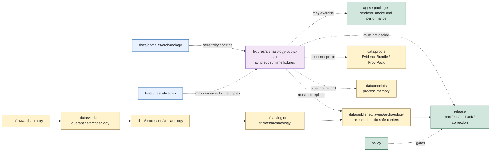

<!-- [KFM_META_BLOCK_V2]
doc_id: kfm://doc/fixtures/archaeology-public-safe/readme
title: Archaeology Public-Safe Fixture README
type: directory-readme
version: v0.1.0
status: draft
owners: TODO(owner): fixtures steward; TODO(owner): archaeology steward; TODO(owner): cultural-review reviewer; TODO(owner): sensitivity reviewer; TODO(owner): renderer steward; TODO(owner): evidence steward; TODO(owner): release steward; TODO(owner): docs steward
created: NEEDS VERIFICATION - blank file existed before 2026-06-30 expansion
updated: 2026-06-30
policy_label: restricted-review
related: [../README.md, ../../docs/doctrine/directory-rules.md, ../../docs/domains/archaeology/README.md, ../../data/published/layers/archaeology/README.md, ../../tests/, ../../data/proofs/, ../../data/receipts/, ../../release/]
tags: [kfm, fixtures, archaeology, public-safe, generalized, renderer-fixtures, runtime-fixtures, smoke-tests, performance-governance, exact-location-denial, t4-default, cultural-review, steward-review, sensitivity-transform, evidence-bundle, release-gated, no-public-truth]
notes: ["This README replaces a blank file at `fixtures/archaeology-public-safe/README.md`.", "The parent `fixtures/README.md` describes `fixtures/` as runtime/benchmark fixture corpora and lists `archaeology-public-safe/` in its suggested layout.", "Directory Rules treats `fixtures/` as a canonical root adjacent to `tests/`, but fixture placement does not make fixture content source truth, proof authority, release authority, policy authority, or published public payload authority.", "Archaeology exact locations, burial sites, sacred sites, human-remains records, unresolved cultural sensitivity, collection-security details, private landowner detail, and looting-risk exposure fail closed. They must never be present in this fixture lane.", "This lane may contain only synthetic, generalized, redacted, public-safe, reproducible fixture corpora for renderer/runtime smoke and performance governance unless a future ADR or fixture strategy narrows or supersedes it."]
[/KFM_META_BLOCK_V2] -->

<a id="top"></a>

# Archaeology Public-Safe Fixtures

Runtime fixture lane for **synthetic, generalized, public-safe Archaeology map/viewer corpora** used by renderer smoke tests, performance governance, and review demonstrations.

<p>
  
  
  
  
  
</p>

**Status:** draft / fixture-lane contract  
**Path:** `fixtures/archaeology-public-safe/README.md`  
**Fixture posture:** public-safe, synthetic/generalized, non-truth, non-release  
**Quick links:** [Scope](#scope) · [Path posture](#path-posture) · [Repo fit](#repo-fit) · [Accepted material](#accepted-material) · [Exclusions](#exclusions) · [Fixture contract](#fixture-contract) · [Archaeology guardrails](#archaeology-guardrails) · [Lifecycle relationship](#lifecycle-relationship) · [Suggested layout](#suggested-layout) · [Validation checklist](#validation-checklist) · [Review burden](#review-burden) · [Status notes](#status-notes) · [Evidence ledger](#evidence-ledger)

> [!IMPORTANT]
> Files under `fixtures/archaeology-public-safe/` are fixtures. They are not source data, RAW captures, WORK candidates, QUARANTINE holds, PROCESSED records, catalog records, triplets, EvidenceBundles, ProofPacks, receipts, policy decisions, release decisions, published Archaeology layers, governed API responses, public map payloads, or archaeological truth.

> [!CAUTION]
> No exact archaeological site geometry, burial/sacred-site geometry, human-remains records, unresolved cultural sensitivity, collection-security detail, private landowner detail, looting-risk exposure, or reconstructive redaction clues may be stored here. Use synthetic, generalized, clipped, aggregated, or withheld content only.

---

## Scope

This lane is for small, reproducible, public-safe Archaeology fixture corpora used to exercise renderer/runtime behavior without exposing sensitive or authoritative archaeological data.

Use this lane to demonstrate or test:

- public-safe generalized-site layer rendering;
- public-safe survey-coverage layer rendering;
- candidate-feature styling that clearly says candidate is not confirmed site;
- chronology-view legends and labels without exact site exposure;
- remote-sensing anomaly display after synthetic/generalized transformation;
- 2D/3D representation warnings and Reality Boundary Notes where applicable;
- no-leak viewer states for exact-location requests;
- disabled/withheld states for denied, stale, unsigned, unreleased, rollback-mismatched, or policy-blocked fixture layers;
- performance and smoke-test scenarios that do not require real Archaeology content.

This lane must stay boring, small, inspectable, and safe.

---

## Path posture

The target file existed as a blank file:

```text
fixtures/archaeology-public-safe/README.md
```

Current placement evidence:

- `fixtures/README.md` describes `fixtures/` as runtime/benchmark fixture corpora used by renderer smoke tests and performance governance.
- `fixtures/README.md` lists `archaeology-public-safe/` in its suggested layout.
- Directory Rules lists `fixtures/` as a canonical root adjacent to `tests/` and says root placement encodes responsibility.
- Archaeology domain doctrine sets exact-location denial as the default and makes sensitive Archaeology content fail closed at every gate.
- `data/published/layers/archaeology/README.md` is the lane for released public-safe Archaeology map carriers; fixtures must not replace that lane.

Therefore this README treats `fixtures/archaeology-public-safe/` as **CONFIRMED path presence / DRAFT fixture-lane guidance / NON-AUTHORITATIVE by placement**.

### Fixture-root nuance

The current parent fixture README emphasizes runtime and benchmark fixture corpora. Directory Rules describes `fixtures/` as a canonical root for enforceability inputs adjacent to `tests/`. This README follows the live parent contract for this lane: **runtime renderer fixture corpus**, not validator-only test data.

If future test strategy creates `tests/fixtures/archaeology/` or `fixtures/domains/archaeology/`, that test fixture lane must define its own authority and must not inherit authority from this public-safe renderer fixture lane.

---

## Repo fit

| Responsibility | Correct home | Boundary |
|---|---|---|
| Public-safe synthetic Archaeology runtime fixture corpora | `fixtures/archaeology-public-safe/` | This lane. Fixture only. |
| Parent fixture guidance | [`../README.md`](../README.md) | Runtime/benchmark fixture corpus contract. |
| Archaeology domain doctrine | [`../../docs/domains/archaeology/`](../../docs/domains/archaeology/README.md) | Human-facing doctrine and sensitivity posture. |
| Published public-safe Archaeology layers | [`../../data/published/layers/archaeology/`](../../data/published/layers/archaeology/README.md) | Released public-safe carriers after release gates close. |
| RAW/WORK/QUARANTINE/PROCESSED Archaeology data | `data/<phase>/archaeology/` | Lifecycle data. Never copied here. |
| EvidenceBundle / ProofPack / citation validation | `data/proofs/` | Proof support. Fixtures do not prove claims. |
| Receipts, including redaction/generalization/build receipts | `data/receipts/` | Process memory. Fixtures do not record process. |
| Release decisions, rollback, correction, withdrawal | `release/` | Release authority. Fixtures do not publish. |
| Policy rules | `policy/` | Admissibility authority. Fixtures do not decide policy. |
| Schemas and contracts | `schemas/`, `contracts/` | Machine shape and semantic meaning. Fixtures do not define either. |
| Validator-only fixtures and tests | `tests/`, `tests/fixtures/`, or accepted fixture strategy | Enforcement proof, when implemented. |
| Renderer/app/package code | `apps/`, `packages/`, `tools/`, `pipelines/` | Implementation logic. Fixtures are inputs only. |

---

## Accepted material

Accepted material must be synthetic or demonstrably public-safe, generalized, reproducible, and small enough for repo use.

| Accepted item | Use | Required markings |
|---|---|---|
| Synthetic point/area fixtures | Exercise symbols, labels, legends, hover states, and selection states. | Coordinates must be fake or coarse generalized cells; no real site locations. |
| Generalized-grid fixtures | Exercise public-safe generalized map layers. | Declare grid/cell size and synthetic origin. |
| Survey-coverage fixtures | Exercise area coverage styling without revealing exact sites. | Use synthetic/generalized survey areas and no site confirmation. |
| Candidate-feature fixtures | Exercise candidate-not-confirmed styling. | Must label `CandidateFeature` as not `ArchaeologicalSite`. |
| Chronology-view fixtures | Exercise cultural/temporal labels. | No exact site joins; labels must not imply site confirmation. |
| Withheld/denied fixtures | Exercise `DENY`, disabled, redacted, or withheld viewer states. | Include reason code and no sensitive payload. |
| Fixture manifest | Document synthetic source, generation method, rights posture, digest placeholders, and intended tests. | Must state non-authoritative and not release-approved. |
| Small benchmark corpus | Renderer/performance smoke fixture with safe synthetic geometries. | Size, feature count, and generation method visible. |

---

## Exclusions

| Do not place here | Correct home or action |
|---|---|
| Real SHPO/site inventory records, survey forms, excavation/provenience records, artifact repository records, collection security details, oral-history restricted material, or steward-held sensitive knowledge | `data/raw/archaeology/`, restricted storage, or quarantine after admission review |
| Exact archaeological site coordinates, burial/sacred-site geometry, human-remains records, exact collection provenience, looting-risk detail, private landowner detail, or reconstructive redaction clues | Deny, quarantine, restrict, or remove from repo |
| RAW, WORK, QUARANTINE, PROCESSED, CATALOG, TRIPLET, or PUBLISHED lifecycle artifacts | `data/<phase>/archaeology/` under lifecycle rules |
| EvidenceBundles, ProofPacks, citation-validation reports, integrity bundles, or proof indexes | `data/proofs/` |
| Redaction, generalization, transform, validation, build, release, correction, or rollback receipts | `data/receipts/` |
| ReleaseManifest, PromotionDecision, CorrectionNotice, WithdrawalNotice, RollbackCard, signatures, or release changelog | `release/` |
| Policy rules, schema definitions, semantic contracts, validators, tests, application code, package code, pipeline logic | Their canonical roots |
| Published PMTiles, GeoParquet, GeoJSON, story payloads, screenshots, public downloads, or API payloads | `data/published/` after release gates close |
| Generated summaries presented as evidence | Governed AI may cite evidence; generated text is not evidence |

---

## Fixture contract

Every file in this lane should answer these questions:

| Question | Required answer |
|---|---|
| Is it a fixture? | `fixture: true` and `authority: non_authoritative_fixture`. |
| Is it public-safe? | `public_safe: true`, with a reason and generation/generalization method. |
| Is it synthetic? | Prefer `synthetic: true`; otherwise document public-source and release basis. |
| Does it contain exact archaeology locations? | Must be `false`. |
| Does it contain sacred/burial/human-remains detail? | Must be `false`. |
| What is it used for? | Renderer smoke, performance, style, UI state, or no-leak behavior. |
| What operational artifact would it approximate? | Layer family or viewer behavior, without becoming that artifact. |
| What must happen on sensitivity failure? | `DENY`, `WITHHOLD`, `ERROR`, or fixture rejection. |

Suggested manifest marker:

```json
{
  "fixture": true,
  "authority": "non_authoritative_fixture",
  "do_not_publish": true,
  "public_safe": true,
  "synthetic": true,
  "fixture_id": "kfm://fixture/archaeology-public-safe/NEEDS-VERIFICATION",
  "contains_exact_archaeology_geometry": false,
  "contains_burial_or_sacred_detail": false,
  "contains_human_remains_detail": false,
  "intended_use": ["renderer_smoke", "performance_governance", "no_leak_state"],
  "forbidden_use": [
    "source_truth",
    "raw_payload",
    "proof_record",
    "receipt_record",
    "policy_decision",
    "release_decision",
    "published_layer",
    "public_api_payload"
  ]
}
```

---

## Archaeology guardrails

| Risk | Guardrail |
|---|---|
| Fixture leaks exact site location | Reject the fixture. No exact archaeology geometry belongs here. |
| Candidate becomes confirmed site | `CandidateFeature`, `RemoteSensingAnomaly`, and `LiDARCandidate` fixtures must not be labeled as `ArchaeologicalSite`. |
| Generalization is too fine | Use coarse synthetic/generalized geometry. Where geography is tied to archaeology, preserve at-least-5 km style generalization posture unless stronger policy allows. |
| Sacred/burial/human-remains detail appears | Reject or remove. No T0 public-safe transform exists for those details. |
| Fixture becomes published layer | Published layers belong in `data/published/layers/archaeology/` after evidence, policy, review, release, correction, and rollback gates close. |
| Fixture becomes proof | Fixtures can support tests. They do not prove claims. |
| Fixture becomes receipt | Generation notes are helpful; emitted receipts belong in `data/receipts/`. |
| Fixture hides sensitivity with styling | Styling, opacity, symbol choice, zoom threshold, or label suppression is not geoprivacy. Sensitive content must be absent, generalized, denied, or withheld before rendering. |
| Fixture normalizes public direct reads | Public UI examples must use governed interfaces or released artifacts, not internal lifecycle or proof stores. |

---

## Lifecycle relationship



---

## Suggested layout

This layout is **PROPOSED** and should stay small until fixture strategy, validators, and renderer smoke tests are verified.

```text
fixtures/archaeology-public-safe/
├── README.md
├── manifests/
│   └── public-safe-fixture.manifest.example.json
├── geojson/
│   ├── generalized-candidate-features.example.geojson
│   ├── generalized-survey-coverage.example.geojson
│   └── withheld-sensitive-layer.example.geojson
├── legends/
│   ├── candidate-not-site.legend.example.json
│   └── chronology-view.legend.example.json
├── pmtiles/
│   └── README.md
└── expected-states/
    ├── deny-exact-location.example.json
    ├── abstain-missing-evidence.example.json
    └── error-invalid-fixture.example.json
```

Do not add large binary corpora without an explicit repo decision, storage strategy, digest plan, and rights/sensitivity review.

---

## Validation checklist

Before adding or changing fixtures here, verify:

- [ ] The fixture is marked non-authoritative.
- [ ] The fixture contains no exact archaeology site coordinates or reconstruction clues.
- [ ] The fixture contains no sacred, burial, human-remains, collection-security, private landowner, or looting-risk detail.
- [ ] The fixture is synthetic or has a documented public-safe source and rights posture.
- [ ] Geometry is generalized, synthetic, or withheld; styling is not used as geoprivacy.
- [ ] Candidate features are not labeled as confirmed sites.
- [ ] The fixture does not create proof, receipt, policy, release, source, schema, contract, published layer, public API, or runtime authority.
- [ ] The intended smoke/performance/test use is stated.
- [ ] Any expected finite outcome is explicit: `ANSWER`, `ABSTAIN`, `DENY`, `ERROR`, `HOLD`, `WITHHELD`, or `DISABLED`.
- [ ] Source note, rights note, generation method, and digest placeholders are present or marked `NEEDS VERIFICATION`.
- [ ] Large files use an approved storage/Git LFS decision before landing.

---

## Review burden

| Change type | Required review |
|---|---|
| README-only boundary update | Fixtures steward and docs steward. |
| New synthetic fixture file | Fixtures steward and renderer/map steward. |
| Any Archaeology-themed geometry | Archaeology steward and sensitivity reviewer. |
| Any culture/sovereignty-adjacent fixture concept | Cultural-review reviewer before merge. |
| Any real-source-derived fixture | Source steward, archaeology steward, rights reviewer, sensitivity reviewer, and fixture steward. |
| Any fixture proposed for public demo or release | Release steward and policy steward; do not publish from this lane. |
| Any fixture with exact/sensitive detail | Reject, quarantine, or remove before merge. |

---

## Status notes

| Item | Status | Notes |
|---|---:|---|
| Target path presence | CONFIRMED | `fixtures/archaeology-public-safe/README.md` existed as a blank file before this update. |
| Parent fixture root | CONFIRMED README | `fixtures/README.md` defines runtime/benchmark fixture corpora and lists `archaeology-public-safe/` in the suggested layout. |
| Directory Rules root status | CONFIRMED doctrine | `fixtures/` is a canonical root adjacent to `tests/`; root placement encodes responsibility. |
| Archaeology sensitivity doctrine | CONFIRMED README | Exact-location denial and T4 defaults are documented in `docs/domains/archaeology/README.md`. |
| Published Archaeology layer lane | CONFIRMED README | `data/published/layers/archaeology/README.md` defines released public-safe map carriers and release checks. |
| Fixture payload inventory | UNKNOWN | This edit did not verify child fixture files beyond this README. |
| Fixture schemas, validators, tests, CI checks, renderer smoke tests, performance harnesses, digest tooling, generation receipts | NEEDS VERIFICATION | No runtime or validation enforcement was proven by this README. |
| Public release readiness | DENY | Fixtures cannot publish, prove, release, or answer archaeological claims. |

---

## Evidence ledger

| Source | Status | Supports | Limits |
|---|---|---|---|
| Previous target file | CONFIRMED | Target existed as a blank file. | Did not define fixture boundaries. |
| [`../README.md`](../README.md) | CONFIRMED README | Parent fixture purpose, boundary against `data/`, `tests/fixtures/`, and `artifacts/`, no sensitive exact geometry rule, and suggested `archaeology-public-safe/` lane. | Parent fixture README is short and does not define Archaeology-specific sensitivity. |
| [`../../docs/doctrine/directory-rules.md`](../../docs/doctrine/directory-rules.md) | CONFIRMED doctrine | Responsibility-root placement, canonical `fixtures/` root, canonical `tests/` adjacency, and lifecycle separation. | Directory Rules notes that specific path presence must be verified against live repo evidence. |
| [`../../docs/domains/archaeology/README.md`](../../docs/domains/archaeology/README.md) | CONFIRMED doctrine / PROPOSED implementation | Exact-location denial, T4 defaults, candidate-not-confirmed rule, sensitivity/generalization posture, tests/fixtures proposal, governed AI denial, and publication gate requirements. | Many implementation paths, schemas, validators, and runtime behaviors remain PROPOSED / NEEDS VERIFICATION. |
| [`../../data/published/layers/archaeology/README.md`](../../data/published/layers/archaeology/README.md) | CONFIRMED README | Released public-safe Archaeology map-carrier lane, child layer families, and release checks. | Does not prove emitted layer files, release manifests, schemas, validators, or governed routes. |
| GitHub search for archaeology fixture terms | CONFIRMED SEARCH RESULT | No stronger existing `archaeology-public-safe` child README or fixture inventory was found by the searched terms. | Search is not a complete recursive inventory. |

[Back to top](#top)
