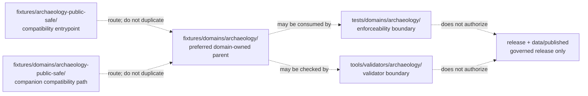

<!-- [KFM_META_BLOCK_V2]
doc_id: kfm://doc/fixtures/archaeology-public-safe/readme
title: Archaeology Public-Safe Fixture Compatibility Lane
type: readme; directory-readme; compatibility-fixture-lane; archaeology; sensitive-domain; non-authoritative
version: v0.2
status: draft; repository-grounded; compatibility-lane; README-only-at-inspected-snapshot; no-new-payload-default; migration-decision-pending; fail-closed
owners: OWNER_TBD — Fixtures steward · Archaeology steward · Test/QA steward · Sensitivity reviewer · Cultural-review steward · Rights-holder representative · Policy steward · Release steward · Docs steward
created: NEEDS VERIFICATION — file predates the 2026-06-30 v0.1 expansion
updated: 2026-07-19
supersedes: v0.1 runtime-fixture-lane README
policy_label: restricted-review; archaeology; synthetic-only; public-safe; exact-location-deny; non-authoritative
owning_root: fixtures/
current_path: fixtures/archaeology-public-safe/README.md
path_posture: existing top-level compatibility lane; canonical domain-owned fixture root is fixtures/domains/archaeology/; no payload migration performed
truth_posture: >
  CONFIRMED target README and prior blob; canonical fixtures responsibility root; parent fixture
  preference for domain-owned lanes; current reusable Archaeology fixture parent under
  fixtures/domains/archaeology/; separate fixtures/domains/archaeology-public-safe/ companion;
  Archaeology canonical-path guidance; domain test and validator maturity documentation; domain
  workflow requirement for fixtures/domains/archaeology/; bounded code-search result surfacing no
  payload or executable consumer under this top-level lane / PROPOSED freeze on new payloads here,
  steward-approved consolidation into the canonical domain root, migration manifest, checksum-backed
  reference repair, deprecation, and eventual removal / CONFLICTED three Archaeology public-safe
  fixture path forms and stale v0.1 treatment of this path as the primary runtime lane / UNKNOWN
  ignored, generated, Git LFS, branch-local, historical, or externally stored payloads and consumers;
  branch-protection significance; production use; cultural or rights-holder approval / NEEDS
  VERIFICATION complete tree inventory, accepted migration owner, canonical public-safe child name,
  consumer backlinks, fixture schemas, executable tests, validator bindings, CI requirements, and
  rollback-tested consolidation
evidence_snapshot:
  repository: bartytime4life/Kansas-Frontier-Matrix
  repository_id: "1059091169"
  visibility: public
  base_ref: main
  base_commit: f73caa6dece3a4459b1298dc9b105256fb1f67d5
  prior_blob: 1611242b09ec089b4c9312846f49a7fdfb2b2b5f
  fixtures_root_blob: b096b0ed49c8e7d95ddb0d4c813d06ef40f1528d
  canonical_archaeology_fixture_parent_blob: ab348d4a5345d52cb0999072138e7c0feb63e8f1
  companion_public_safe_blob: 621b85912ceba3e1e6169318788ad130da7baac5
  directory_rules_blob: 2affb080e6f0043867c64c7f06c1ca52030fbd55
  archaeology_canonical_paths_blob: e2443077fc363df91a4f020f55b306a15f196b76
  archaeology_tests_blob: 229113afacc6acc0839e92318082ccce9e2ceab3
  archaeology_validator_blob: bae2eabb5d29bf7099ed74a66a17c0071ae98557
  archaeology_workflow_blob: 41e377f50ca310eccdc4b716ba8374c4fa8181db
  drift_register_blob: 97a775522dcd058299f752ac7862d0fc56c13280
  bounded_inventory_note: >
    Exact file reads and repository code search establish only the inspected snapshot. They do not
    prove permanent absence from history, forks, ignored files, generated workspaces, Git LFS,
    external stores, unindexed binaries, differently named files, or later commits.
related:
  - ../README.md
  - ../domains/archaeology/README.md
  - ../domains/archaeology-public-safe/README.md
  - ../../docs/doctrine/directory-rules.md
  - ../../docs/registers/DRIFT_REGISTER.md
  - ../../docs/domains/archaeology/CANONICAL_PATHS.md
  - ../../docs/domains/archaeology/SENSITIVITY.md
  - ../../docs/domains/archaeology/CULTURAL_REVIEW.md
  - ../../policy/domains/archaeology/README.md
  - ../../contracts/domains/archaeology/README.md
  - ../../schemas/contracts/v1/domains/archaeology/README.md
  - ../../tests/domains/archaeology/README.md
  - ../../tools/validators/archaeology/README.md
  - ../../.github/workflows/domain-archaeology.yml
  - ../../data/published/layers/archaeology/README.md
  - ../../release/candidates/archaeology/README.md
  - ../../data/receipts/generated/README.md
tags: [kfm, fixtures, archaeology, public-safe, compatibility, domain-placement, synthetic-only, exact-location-deny, cultural-review, sensitivity, no-new-payload, migration, fail-closed, non-authoritative]
notes:
  - "v0.2 replaces the stale primary-runtime-lane posture with a repository-grounded compatibility boundary."
  - "The preferred reusable domain fixture home is fixtures/domains/archaeology/; this change does not create a child lane, move payloads, edit consumers, or delete either compatibility README."
  - "No exact archaeological geometry, protected cultural information, real source record, lifecycle artifact, proof, receipt, policy decision, release record, or published payload is introduced."
  - "The drift register was inspected but not modified because this task is bounded to the requested README plus required generated-work provenance. The three-path conflict remains visible here and in the pull-request notes for steward disposition."
[/KFM_META_BLOCK_V2] -->

<a id="top"></a>

# Archaeology Public-Safe Fixture Compatibility Lane

`fixtures/archaeology-public-safe/`

> **One-line purpose.** Preserve a safe, reviewable compatibility entrypoint for the legacy top-level Archaeology public-safe fixture path while directing new domain-owned fixture work to `fixtures/domains/archaeology/` and preventing this lane from becoming a second fixture authority, protected-data store, or publication path.

<p>
  
  
  
  
  
  
</p>

> [!IMPORTANT]
> **Do not add new fixture payloads to this top-level lane by default.** The current parent fixture contract prefers domain-owned examples under [`fixtures/domains/`](../domains/README.md), the Archaeology domain has an existing reusable parent at [`fixtures/domains/archaeology/`](../domains/archaeology/README.md), and the Archaeology readiness workflow checks that domain parent—not this compatibility path.

> [!CAUTION]
> Archaeology is a sensitive-domain lane. Exact or reverse-engineerable site geometry, burial or human-remains information, sacred or culturally restricted locations, collection-security detail, looting-risk information, restricted oral history, sovereignty-bearing knowledge, private-owner detail, and unresolved rights or cultural-review material must not be stored here or copied into a migration fixture.

> [!WARNING]
> A fixture, README, passing test, green workflow, generalized rendering, or synthetic example is not archaeology truth, evidence closure, cultural approval, rights clearance, policy permission, release approval, or publication authority.

**Quick links:** [Purpose](#purpose-and-scope) · [Status](#current-status-and-evidence-boundary) · [Placement](#directory-rules-and-placement-decision) · [Path conflict](#three-path-compatibility-conflict) · [Inputs](#accepted-inputs-during-the-compatibility-freeze) · [Exclusions](#exclusions) · [Safety](#public-safe-and-sensitive-domain-guardrails) · [Outcomes](#fixture-case-and-finite-outcome-posture) · [Consumers](#consumer-test-validator-and-ci-posture) · [Migration](#proposed-consolidation-and-deprecation-sequence) · [Maintenance](#maintenance-checklist) · [Done](#definition-of-done) · [Open](#open-verification-register) · [Evidence](#evidence-ledger) · [Rollback](#changelog-correction-and-rollback)

---

<a id="purpose-and-scope"></a>

## Purpose and scope

This directory is an **existing compatibility surface**, not the preferred home for new Archaeology fixture families.

It now serves four bounded purposes:

1. keep inbound links to the historical top-level path understandable;
2. state the fail-closed Archaeology safety boundary at the point of entry;
3. direct contributors to the domain-owned fixture parent;
4. preserve a reversible place for migration or deprecation notes while maintainers resolve the duplicate path topology.

### In scope

- compatibility and routing guidance;
- safe non-authority language;
- bounded evidence about current fixture, test, validator, and workflow maturity;
- migration preconditions and rollback guidance;
- public-safe fixture expectations that apply when evaluating legacy content found here.

### Out of scope

- creating or moving fixture payloads;
- choosing a new child-lane name inside the canonical Archaeology fixture root;
- defining JSON Schema, semantic contracts, policy, sensitivity thresholds, or cultural-review rules;
- asserting that any Archaeology payload is valid, culturally approved, rights-cleared, released, or safe for public use;
- changing tests, validators, workflows, applications, lifecycle data, release records, or public surfaces;
- deleting this path or its sibling compatibility path.

[Back to top](#top)

---

<a id="current-status-and-evidence-boundary"></a>

## Current status and evidence boundary

| Surface | Inspected status | Safe conclusion |
|---|---|---|
| This README | **CONFIRMED existing v0.1** | The prior file treated this as the primary public-safe runtime fixture lane; that posture is stale relative to newer parent and domain evidence. |
| [`fixtures/README.md`](../README.md) | **CONFIRMED** | The fixture root prefers `fixtures/domains/<domain>/` when ownership or sensitivity context is clear. |
| [`fixtures/domains/archaeology/`](../domains/archaeology/README.md) | **CONFIRMED existing reusable domain fixture parent** | This is the repository-grounded domain-owned parent used by current Archaeology documentation and workflow checks. |
| [`fixtures/domains/archaeology-public-safe/`](../domains/archaeology-public-safe/README.md) | **CONFIRMED second compatibility/companion README** | A second public-safe path exists, but it must not become parallel authority. |
| Archaeology canonical-path guidance | **CONFIRMED draft document / placement rule grounded in Directory Rules** | It identifies `fixtures/domains/archaeology/` as the domain fixture form and proposes child families such as generalized public-safe cases. |
| Direct payloads under this top-level lane | **NOT SURFACED in bounded code search** | Do not claim the directory is empty; ignored, binary, LFS, historical, branch-local, or unindexed content remains possible. |
| Direct executable consumers of this top-level lane | **NOT SURFACED in bounded code search** | No test, validator, renderer, API, or workflow binding was established for this path. |
| Archaeology tests | **CONFIRMED named topology / sampled placeholder maturity** | File names and READMEs exist, but current executable enforcement is not established by inspected evidence. |
| Archaeology validators | **CONFIRMED README-rich / broad lane implementation unestablished** | Documentation names intended checks; broad executable validation remains verification-bound. |
| `domain-archaeology` workflow | **CONFIRMED command-bearing readiness workflow** | It requires `fixtures/domains/archaeology/README.md` and reports explicit holds; it does not require this compatibility README. |
| Public release readiness | **DENY / UNKNOWN** | Nothing in this lane authorizes release or public exposure. |

### Truth vocabulary

- **CONFIRMED** — verified from the pinned repository snapshot or supplied doctrine.
- **PROPOSED** — a future migration, child lane, check, or convention not yet implemented and verified.
- **UNKNOWN** — evidence is insufficient or unavailable.
- **NEEDS VERIFICATION** — one or more concrete checks are still required.
- **CONFLICTED** — relevant paths or descriptions overlap and do not yet have one accepted migration disposition.

[Back to top](#top)

---

<a id="directory-rules-and-placement-decision"></a>

## Directory Rules and placement decision

Directory Rules assigns:

```text
fixtures/                         deterministic fixture and checking inputs
fixtures/domains/<domain>/        domain-specific fixture lane
```

The primary responsibility is **fixture input**, so the `fixtures/` root is correct. The domain is **archaeology**, so the domain segment belongs beneath `fixtures/domains/archaeology/` when ownership and sensitivity context are clear.

### Working placement decision

| Question | Decision for this README |
|---|---|
| Is `fixtures/` the correct responsibility root? | **Yes — CONFIRMED.** |
| Is this top-level path the preferred domain-owned home? | **No — CONFLICTED / compatibility only.** |
| Where should new stable Archaeology fixtures be evaluated first? | [`fixtures/domains/archaeology/`](../domains/archaeology/README.md). |
| Is a specific `generalized_public_safe/` child accepted and present? | **NEEDS VERIFICATION.** Canonical-path guidance proposes it, but this task does not create or certify it. |
| Does the sibling `fixtures/domains/archaeology-public-safe/` settle the conflict? | **No.** It is another companion path and explicitly defers consolidation. |
| Does this documentation update move or delete files? | **No.** Migration remains a separately reviewed operation. |

The current repository topology therefore remains **CONFIRMED presence / CONFLICTED placement relationship / PROPOSED consolidation**.

[Back to top](#top)

---

<a id="three-path-compatibility-conflict"></a>

## Three-path compatibility conflict

Three path forms now describe overlapping Archaeology public-safe fixture concerns:

| Path | Repository-grounded posture | New-content rule |
|---|---|---|
| `fixtures/archaeology-public-safe/` | This legacy top-level compatibility entrypoint. | **Freeze new payloads by default.** Keep routing and migration notes only until disposition. |
| `fixtures/domains/archaeology-public-safe/` | Existing domain-facing companion README. | Do not duplicate payloads or treat it as canonical without a migration decision. |
| `fixtures/domains/archaeology/` | Existing reusable Archaeology domain fixture parent; preferred by the fixture root, test docs, canonical-path guidance, and domain workflow. | Evaluate new stable domain-owned fixture families here. |



> [!IMPORTANT]
> This diagram records responsibility and compatibility. It does not prove payload presence, consumer wiring, successful validation, or release closure.

### Anti-collapse rule

Do not infer any of the following:

```text
fixture present      = test collected
fixture valid        = semantic claim true
fixture public-safe  = cultural approval complete
fixture generalized  = release approved
fixture rendered     = evidence resolved
README documented    = validator implemented
workflow green       = publication permitted
```

[Back to top](#top)

---

<a id="accepted-inputs-during-the-compatibility-freeze"></a>

## Accepted inputs during the compatibility freeze

Until maintainers accept a migration disposition, this top-level lane should contain only:

- this compatibility README;
- a concise migration or deprecation note approved in the same change that performs the migration;
- an inventory manifest that lists pre-existing payload paths and hashes **without copying protected payload content**, if a future verified inventory finds files here;
- redirect-oriented documentation that points to the accepted canonical fixture family.

### Legacy payload handling

If a payload is discovered here:

1. stop new additions;
2. classify it as synthetic, public-source-derived, restricted, sensitive, unknown, or unsafe;
3. inspect rights, cultural-review, sensitivity, and exact-location posture without exposing protected content in logs or PR text;
4. identify its consuming test, validator, renderer, helper, or documentation example;
5. hash the exact bytes and record the path;
6. quarantine or remove unsafe material through the governed correction path;
7. migrate safe content only through a reviewed, checksum-backed change with reference repair and rollback.

No payload becomes valid or public-safe merely because it already exists under `fixtures/`.

[Back to top](#top)

---

<a id="exclusions"></a>

## Exclusions

Do not place or preserve the following in this lane:

| Excluded material | Required disposition or owning root |
|---|---|
| Exact or reverse-engineerable Archaeology site geometry | Deny, remove from public repository, or quarantine under governed restricted handling. |
| Burial, human-remains, sacred-site, culturally restricted, oral-history-restricted, collection-security, looting-risk, sovereignty-bearing, or private-owner detail | Deny or restrict; require the applicable cultural, rights-holder, sensitivity, and policy review. |
| Real source exports, SHPO/site inventory records, survey forms, excavation records, provenience records, or collection records | Governed source admission and `data/<phase>/archaeology/`; not fixtures. |
| RAW, WORK, QUARANTINE, PROCESSED, CATALOG, TRIPLET, or PUBLISHED artifacts | `data/` lifecycle roots. |
| Actual EvidenceBundles, proofs, receipts, policy decisions, review records, release manifests, correction notices, withdrawal notices, or rollback cards | Their accepted governed roots. |
| Contracts, schemas, policy rules, validators, tests, application code, package code, or pipeline logic | Their responsibility roots. |
| Public API payloads, map layers, tiles, downloads, screenshots, stories, or exports | Governed published-data and application roots after release closure. |
| Ad hoc manifest fields presented as a normative fixture schema | Define meaning under `contracts/`, shape under `schemas/`, and enforce with tests before relying on them. |
| Styling-only concealment of protected detail | Reject. Opacity, zoom limits, label suppression, or symbol choice is not geoprivacy. |

[Back to top](#top)

---

<a id="public-safe-and-sensitive-domain-guardrails"></a>

## Public-safe and sensitive-domain guardrails

A fixture proposed as public-safe must be safe **in its stored bytes**, not merely in its default rendering.

| Risk | Required posture |
|---|---|
| Real or reconstructable location | Use wholly synthetic geometry or a reviewed generalization transform; otherwise `DENY`. Do not invent a distance, grid, or resolution threshold in this README. |
| Candidate represented as confirmed site | Preserve candidate identity. An anomaly, model output, remote-sensing feature, or candidate fixture is not an `ArchaeologicalSite`. |
| Restricted cultural meaning retained after coordinate removal | Redact, restrict, quarantine, or deny. Location removal alone may not resolve cultural or sovereignty risk. |
| Fixture includes real-source-derived attributes | Require source identity, rights, permitted-use, attribution, sensitivity, transform, and reviewer evidence before repository inclusion. |
| Safe payload paired with unsafe filename, ID, log text, or expected output | Reject or rewrite. Protected clues must not leak through metadata, diagnostics, snapshots, assertions, or artifacts. |
| Synthetic example is reused publicly | Require the normal governed-interface and release path; fixture status does not authorize serving. |
| AI or Focus Mode consumes fixture prose as truth | Deny authoritative use. AI remains evidence-subordinate and fixtures are non-evidence. |

### Minimum safe assertions

Any future fixture manifest or consumer contract must establish, through an accepted schema or test rather than this README alone, that:

- fixture authority is non-authoritative;
- exact or reverse-engineerable protected geometry is absent;
- candidate and confirmed-site identities remain distinct;
- source and rights posture are visible when material is not wholly synthetic;
- intended consumer and expected outcome are explicit;
- no public, proof, policy, cultural-review, release, or lifecycle authority is implied;
- correction and deletion paths exist if the fixture is later found unsafe.

[Back to top](#top)

---

<a id="fixture-case-and-finite-outcome-posture"></a>

## Fixture case and finite-outcome posture

The canonical Archaeology fixture root may eventually hold bounded cases such as:

| Case family | Expected behavior | Boundary |
|---|---|---|
| Valid synthetic object | Shape or bounded consumer check passes. | Does not prove a real site or evidence closure. |
| Invalid object | Validator rejects with a stable, non-sensitive reason. | A validator crash is not an expected rejection. |
| Candidate-not-site | Consumer preserves candidate status. | Must not silently upgrade to confirmed site. |
| Missing evidence | `ABSTAIN` or fail the relevant gate. | Do not fabricate or infer support. |
| Exact-location request | `DENY`. | Do not echo protected geometry in the reason. |
| Unresolved rights or cultural review | `DENY`, `ABSTAIN`, or explicit review hold according to accepted policy. | README text cannot supply approval. |
| Malformed input or system failure | `ERROR`. | Must not become a permissive result. |
| Withdrawn or rollback-mismatched release simulation | Block or withhold the public response. | Fixture outcome is not an actual withdrawal record. |

`ANSWER`, `ABSTAIN`, `DENY`, and `ERROR` are the core runtime outcomes used here. Review holds, withheld displays, disabled layers, and readiness states are operational qualifiers unless an accepted contract defines them as machine outcomes.

[Back to top](#top)

---

<a id="consumer-test-validator-and-ci-posture"></a>

## Consumer, test, validator, and CI posture

### Confirmed repository signals

- [`tests/domains/archaeology/README.md`](../../tests/domains/archaeology/README.md) identifies [`fixtures/domains/archaeology/`](../domains/archaeology/README.md) as the reusable fixture root.
- [`tools/validators/archaeology/README.md`](../../tools/validators/archaeology/README.md) also references the domain-owned fixture root and marks broad executable validation unestablished.
- [`.github/workflows/domain-archaeology.yml`](../../.github/workflows/domain-archaeology.yml) requires `fixtures/domains/archaeology/README.md`, checks placeholder maturity, and emits explicit hold states rather than claiming executable Archaeology validation, proof, or release closure.
- The root [`Makefile`](../../Makefile) does not establish a dedicated Archaeology fixture command in the inspected documentation evidence.

### Not established

- a payload in this compatibility directory;
- a direct consumer path referencing this directory;
- a fixture schema or manifest contract specific to this directory;
- an executable public-no-leak test consuming this directory;
- an accepted sensitivity or cultural-review evaluator bound to this directory;
- branch-protection or release dependence on this README;
- any production or public runtime use.

### Validation language

A future fixture or migration PR must report separately:

```text
Validation performed:
Validation not performed:
Expected command:
Expected result:
Actual result:
Failure handling:
```

Do not convert `NOT RUN`, `PENDING`, `HOLD`, `UNKNOWN`, or an empty test collection into `PASS`.

[Back to top](#top)

---

<a id="proposed-consolidation-and-deprecation-sequence"></a>

## Proposed consolidation and deprecation sequence

No migration is performed by this README update. The smallest sound future sequence is:

1. **Inventory all three paths.** Use a complete tree read, including file modes, Git LFS pointers, binary files, ignored/generated boundaries, and inbound references.
2. **Classify every payload and consumer.** Record purpose, source posture, rights, sensitivity, cultural-review need, exact-location risk, content hash, and consuming check.
3. **Select one canonical destination.** Default to `fixtures/domains/archaeology/` under Directory Rules unless an accepted ADR changes domain fixture placement. Select a child family only after current fixture strategy and consumer shape are verified.
4. **Quarantine unsafe or unknown content.** Do not migrate protected or rights-uncertain bytes as ordinary fixtures.
5. **Prepare a migration map.** For each safe file, record old path, new path, SHA-256, consumer changes, compatibility period, and rollback target.
6. **Move atomically where tooling permits.** Update payloads, tests, validators, docs, indexes, and expected-output references in one reviewable migration or an explicitly ordered PR series.
7. **Retain compatibility notices.** Keep a short redirect README during the approved compatibility window; do not duplicate payloads.
8. **Validate no-leak and reference closure.** Run the accepted no-network suite, link checks, schema/validator checks, and any domain readiness workflow.
9. **Deprecate or delete only with authority.** Record the correction, review outcome, and rollback path. Do not silently remove historical paths.

### ADR boundary

A routine consolidation into the existing canonical responsibility/domain pattern may use a migration note and reviewed PR. An ADR is required if maintainers choose to retain parallel authoritative fixture homes, change the canonical fixture root or domain-placement rule, or otherwise bend Directory Rules.

[Back to top](#top)

---

<a id="maintenance-checklist"></a>

## Maintenance checklist

Before changing this compatibility lane:

- [ ] Re-read Directory Rules, the fixture-root README, the canonical Archaeology fixture parent, and the Archaeology canonical-path document at the current base commit.
- [ ] Search for an existing migration PR, task branch, payload, consumer, mirror, generated output, or compatibility copy.
- [ ] Keep this path classified as compatibility unless an accepted migration decision says otherwise.
- [ ] Add no exact or reverse-engineerable protected information.
- [ ] Add no real source record, lifecycle artifact, proof, receipt, policy decision, review approval, release record, or public payload.
- [ ] Do not define ad hoc fixture schema fields in prose.
- [ ] Route new stable domain-owned cases to the accepted child family beneath `fixtures/domains/archaeology/`.
- [ ] Tie every payload to a concrete consumer and explicit expected outcome.
- [ ] Keep test, validator, policy, evidence, review, release, and publication authority separate.
- [ ] Update inbound links and sibling compatibility notes if a migration changes routing.
- [ ] Record exact changed paths, hashes, validation, human review, correction, and rollback.
- [ ] Emit the required generated-work receipt for AI-authored changes.

[Back to top](#top)

---

<a id="definition-of-done"></a>

## Definition of done

### For this compatibility README

- [x] The target path and prior content were read at a pinned commit.
- [x] Directory Rules, the parent fixture contract, the domain fixture parent, the companion public-safe README, the Archaeology canonical-path document, tests, validators, workflow, and drift register were inspected.
- [x] The three-path conflict is visible and not silently normalized.
- [x] New payloads are frozen here by default.
- [x] Protected Archaeology material remains denied.
- [x] Fixture, evidence, policy, review, release, and publication roles remain separate.
- [x] No payload, consumer, test, validator, workflow, policy, schema, contract, lifecycle artifact, release record, or public surface is changed.

### Before this lane can be retired

- [ ] Complete byte-level inventory of all compatibility and canonical paths.
- [ ] Accepted owner and migration disposition.
- [ ] Safe payload classification and cultural/rights/sensitivity review where applicable.
- [ ] Checksum-backed move map and consumer update plan.
- [ ] Executable no-network validation and no-leak coverage.
- [ ] Compatibility-window and inbound-link plan.
- [ ] Correction and rollback record.
- [ ] Human approval separate from generation.

[Back to top](#top)

---

<a id="open-verification-register"></a>

## Open verification register

| ID | Item | Status | Resolution evidence |
|---|---|---|---|
| `APSF-01` | Complete direct-child and recursive inventory for all three fixture paths | **NEEDS VERIFICATION** | Non-truncated tree or checkout inventory with hashes and file modes. |
| `APSF-02` | Whether any test, validator, renderer, API, docs example, or build consumes this top-level path | **NEEDS VERIFICATION** | Complete reference search plus runtime/build configuration inspection. |
| `APSF-03` | Accepted canonical child family for generalized public-safe Archaeology cases | **NEEDS VERIFICATION** | Fixture steward and Archaeology steward decision aligned with Directory Rules. |
| `APSF-04` | Disposition of `fixtures/domains/archaeology-public-safe/` | **CONFLICTED / NEEDS VERIFICATION** | Migration note, ADR if required, and reference-repair plan. |
| `APSF-05` | Executable Archaeology fixture validation and no-leak coverage | **UNKNOWN** | Collected tests, validator implementation, deterministic fixtures, and CI logs. |
| `APSF-06` | Exact cultural-review, sovereignty, rights-holder, and sensitivity reviewers | **NEEDS VERIFICATION** | Accepted CODEOWNERS or governance record. |
| `APSF-07` | Required-check or branch-protection significance | **UNKNOWN** | Repository ruleset or branch-protection evidence. |
| `APSF-08` | Whether this conflict should be added to the central drift register | **NEEDS VERIFICATION** | Docs steward decision; this bounded README task does not edit the register. |
| `APSF-09` | Public or production use of any compatibility fixture | **UNKNOWN** | Governed consumer manifests, release records, and runtime evidence. |

[Back to top](#top)

---

<a id="evidence-ledger"></a>

## Evidence ledger

| Source | Status | Supports | Does not prove |
|---|---|---|---|
| Prior `fixtures/archaeology-public-safe/README.md` | **CONFIRMED** | Existing compatibility path, strong safety language, accepted/excluded fixture concepts, and stale primary-lane posture. | Payload presence, consumers, validation, or continued canonical status. |
| [`fixtures/README.md`](../README.md) | **CONFIRMED** | Fixture authority boundary and preference for domain-owned lanes when ownership is clear. | Exhaustive payload or consumer inventory. |
| [`fixtures/domains/archaeology/README.md`](../domains/archaeology/README.md) | **CONFIRMED** | Existing reusable Archaeology fixture parent and child-lane index. | Payload validity or executable consumption. |
| [`fixtures/domains/archaeology-public-safe/README.md`](../domains/archaeology-public-safe/README.md) | **CONFIRMED** | Existing companion path and its own warning against parallel authority. | Accepted canonical status or migration completion. |
| [`Directory Rules`](../../docs/doctrine/directory-rules.md) | **CONFIRMED doctrine** | Responsibility-root and domain-segment placement law; migration and parallel-authority boundaries. | Specific current path presence without repository reads. |
| [`Archaeology canonical paths`](../../docs/domains/archaeology/CANONICAL_PATHS.md) | **CONFIRMED draft document / rule-grounded guidance** | `fixtures/domains/archaeology/` domain form and proposed generalized-public-safe family. | Acceptance or existence of every proposed child. |
| [`Archaeology tests`](../../tests/domains/archaeology/README.md) | **CONFIRMED repository-grounded README** | Canonical reusable fixture root, named test topology, sampled placeholder maturity, and no-network/fail-closed intent. | Complete executable coverage or pass state. |
| [`Archaeology validators`](../../tools/validators/archaeology/README.md) | **CONFIRMED repository-grounded README** | Validator responsibility and unestablished broad executable maturity. | A working validator bound to this path. |
| [`domain-archaeology` workflow](../../.github/workflows/domain-archaeology.yml) | **CONFIRMED executable readiness workflow** | Required canonical fixture parent and explicit hold behavior. | Archaeology truth, proof, cultural approval, release, or publication. |
| [`DRIFT_REGISTER.md`](../../docs/registers/DRIFT_REGISTER.md) | **CONFIRMED inspected** | Central drift-recording surface exists. | That this three-path conflict is already registered. |
| Repository code search for `archaeology-public-safe` | **CONFIRMED bounded search** | Surfaced the two public-safe READMEs and related documentation references. | Complete recursive absence of payloads, binaries, LFS content, or consumers. |

[Back to top](#top)

---

<a id="changelog-correction-and-rollback"></a>

## Changelog, correction, and rollback

| Date | Version | Change | Status |
|---|---|---|---|
| 2026-06-30 | v0.1 | Expanded a prior blank target into a public-safe runtime fixture-lane guide. | **LINEAGE** — useful safety content retained, primary-lane placement posture superseded. |
| 2026-07-19 | v0.2 | Reclassified the path as a compatibility entrypoint; surfaced the three-path conflict; froze new payloads; routed new domain-owned work to `fixtures/domains/archaeology/`; removed unsupported generalization precision and ad hoc manifest-shape guidance; added migration, evidence, validation, and rollback boundaries. | **PROPOSED pending human review** |

### No-loss assessment

Retained from v0.1:

- fixture-only, non-truth, non-release posture;
- exact-location and protected-content denial;
- candidate-not-confirmed separation;
- styling-is-not-geoprivacy rule;
- lifecycle, proof, receipt, policy, release, and public-surface separation;
- accepted public-safe fixture concepts, exclusions, review burden, and maintenance expectations.

Corrected or narrowed:

- removed the stale claim that the parent fixture README selects this top-level lane;
- replaced primary-runtime-lane status with compatibility classification;
- replaced speculative child layout under this path with a no-new-payload freeze;
- removed an unsupported fixed generalization-distance posture;
- removed an illustrative ad hoc manifest object that could be mistaken for schema authority;
- corrected lifecycle/release wording so fixtures cannot appear to flow into publication;
- distinguished core runtime outcomes from review and display qualifiers.

### Rollback

Before merge, close or abandon the draft pull request and leave the branch unmerged. After merge, create a transparent revert of the implementation commit and re-run documentation/link checks. Do not restore v0.1 language that presents this path as primary without first resolving the newer parent, canonical-path, test, validator, and workflow evidence.

[Back to top](#top)
