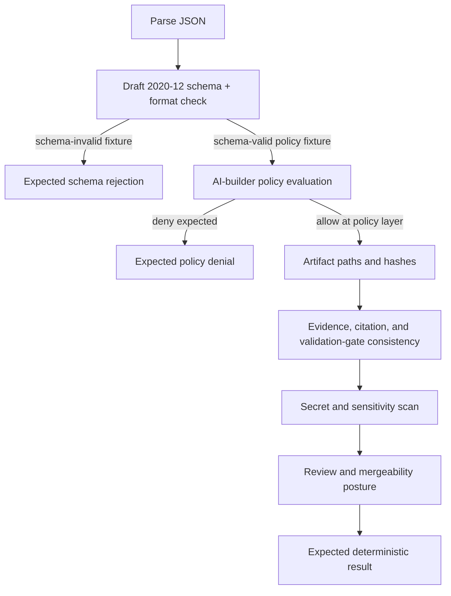

<!-- [KFM_META_BLOCK_V2]
doc_id: kfm://fixture/generated-receipt/invalid/readme
title: GENERATED_RECEIPT Invalid Fixture Lane
type: readme; directory-readme; invalid-fixture-lane; generated-receipt; ai-builder; provenance; non-authoritative
version: v0.2
status: draft; repository-grounded; schema-aligned; policy-aware; readme-only-direct-inventory; executable-harness-unverified; receipt-family-drift-corrected
owners:
  - OWNER_TBD — generated-receipt / provenance steward
  - OWNER_TBD — AI-builder policy steward
  - OWNER_TBD — schema steward
  - OWNER_TBD — fixture and validation steward
  - OWNER_TBD — security and sensitive-data reviewer
  - OWNER_TBD — docs steward
created: NEEDS VERIFICATION — target README existed before this repository-grounded rewrite
updated: 2026-07-21
policy_label: public-review; synthetic-only; invalid-fixtures; no-secrets; no-hidden-reasoning; no-publication
current_path: fixtures/generated_receipt/invalid/README.md
governing_schema: schemas/contracts/v1/receipts/generated_receipt.schema.json
governing_policy: policy/ai_builder/operating_contract.rego
emitted_instance_home: data/receipts/generated/
truth_posture:
  CONFIRMED:
    - the target README exists at the recorded base
    - the GENERATED_RECEIPT Draft 2020-12 schema exists and has a concrete closed shape
    - the AI-builder Rego policy stub exists and pins contract_version 3.0.0
    - data/receipts/generated/ is the emitted generated-work receipt lane
    - runtime AIReceipt has a separate contract, schema, and fixture family
    - bounded code search returned this README as the only indexed direct file under the invalid lane
  PROPOSED:
    - the negative-case naming and expected-result sidecar conventions in this README
    - the staged validation order and failure-class vocabulary until a canonical harness adopts them
  NEEDS_VERIFICATION:
    - exhaustive filesystem inventory beneath this lane
    - a canonical generated-receipt fixture harness and executable validator
    - CI invocation of AI-builder policy and generated-receipt schema validation
    - generated-receipt semantic-contract ownership
    - accepted owners, reviewers, and branch-protection requirements
evidence_snapshot:
  repository: bartytime4life/Kansas-Frontier-Matrix
  base_ref: main
  base_commit: 124d0d2129f7e82d78df6d3eaa3b0b28d18882f0
  target_prior_blob: c1cae99c27a6013c19f5c8565005b78a6251f63c
  parent_blob: 80d6c4ca69adfbbeb29993cf0d49aa5b610cb70e
  valid_sibling_blob: 047ee8e682ffaa4ad2e123a3892a4b3ebe6eb984
  generated_receipt_schema_blob: fba21ed27ebccf1362fe397fe0c3ebd85e072685
  ai_builder_policy_blob: 3a54cd3b8dce254853c76934e3e4d501b3e54a1c
  generated_receipts_readme_blob: fe6bde02885c63b31897b5129019829d490bf777
  runtime_ai_receipt_invalid_readme_blob: bb241dcb14845c0a7cd09eb9cc7d4bb2086f1330
notes:
  - "This revision corrects a material receipt-family collapse: GENERATED_RECEIPT records provenance for AI-authored repository artifacts; AIReceipt records an AI-mediated runtime event."
  - "No invalid JSON payload, validator, test, policy, schema, emitted receipt, workflow, release object, or public artifact is created or changed by this README-only revision."
  - "The parent and valid-sibling READMEs retain AIReceipt-centric wording and should be reconciled separately rather than silently treated as authority here."
[/KFM_META_BLOCK_V2] -->

<a id="top"></a>

# `GENERATED_RECEIPT` invalid fixtures

> **One-line purpose.** `fixtures/generated_receipt/invalid/` is the negative-fixture lane for malformed, policy-denied, unmergeable, integrity-failing, or unsafe **`GENERATED_RECEIPT`** candidates used to govern AI-authored repository work.

<p>
  
  
  
  
  
  
  
</p>

> [!IMPORTANT]
> **`GENERATED_RECEIPT` is not `AIReceipt`.**
>
> - `GENERATED_RECEIPT` records provenance for AI-authored **repository artifacts**: paths, hashes, model identity, prompt/contract hash, evidence inputs, truth labels, validation gates, citations, policy references, and human-review state.
> - `AIReceipt` records accountability for an AI-mediated **runtime event** and has a separate contract, schema, and fixture family.
>
> Mixing the two receipt families is an invalid case, not a compatibility shortcut.

| Field | Repository-grounded value |
|---|---|
| **Path** | `fixtures/generated_receipt/invalid/` |
| **Owning root** | `fixtures/` — reusable synthetic and negative checking inputs |
| **Object family exercised** | `GENERATED_RECEIPT` |
| **Machine-shape authority** | `schemas/contracts/v1/receipts/generated_receipt.schema.json` |
| **AI-builder policy surface** | `policy/ai_builder/operating_contract.rego` |
| **Emitted instance home** | `data/receipts/generated/` |
| **Direct indexed inventory** | This README only at the recorded evidence snapshot |
| **Network posture** | No network required for fixture validation |
| **Public-surface posture** | Denied; invalid fixtures and generated receipts are not public truth |
| **Last reviewed** | 2026-07-21 |

## Quick navigation

[Purpose](#purpose) · [Authority level](#authority-level) · [Status](#status) · [What belongs here](#what-belongs-here) · [What does NOT belong here](#what-does-not-belong-here) · [Inputs](#inputs) · [Outputs](#outputs) · [Validation](#validation) · [Review burden](#review-burden) · [Related folders](#related-folders) · [ADRs](#adrs) · [Last reviewed](#last-reviewed) · [Receipt-family boundary](#receipt-family-boundary) · [Failure model](#failure-model) · [Schema-negative matrix](#schema-negative-matrix) · [Policy and mergeability matrix](#policy-and-mergeability-matrix) · [Integrity and security matrix](#integrity-and-security-matrix) · [Fixture design contract](#fixture-design-contract) · [Current inventory](#current-inventory) · [Maintenance](#maintenance-correction-and-rollback) · [Open verification](#open-verification-register) · [Evidence ledger](#evidence-ledger)

---

## Purpose

This lane defines how KFM should represent **intentionally rejected examples** for the `GENERATED_RECEIPT` object family.

Its job is to make negative behavior inspectable across four distinct layers:

1. **Schema rejection** — malformed JSON or a payload that violates the Draft 2020-12 schema.
2. **Policy denial or unmergeability** — a schema-valid receipt that the AI-builder policy rejects.
3. **Integrity or semantic failure** — a schema-valid payload whose artifact paths, hashes, evidence references, validation claims, or review assertions are false, stale, incomplete, or inconsistent.
4. **Security or sensitivity rejection** — a receipt that leaks prompts, hidden reasoning, secrets, private data, restricted material, or other content forbidden from process-memory records.

An invalid fixture must make its primary failure explicit. It must not pass accidentally because a validator stopped at the wrong layer, because format checking was disabled, or because a semantic failure was mistaken for schema success.

## Authority level

**Fixture-only, synthetic, and non-authoritative.**

This lane may show what KFM expects a validator or policy gate to reject. It does not define the object, make a policy decision, store an emitted receipt, prove a repository change, approve human review, authorize merge, or publish anything.

| Responsibility | Owning surface | This lane's role |
|---|---|---|
| Generated-receipt semantic meaning | **NEEDS VERIFICATION** — no dedicated semantic contract was confirmed | Expose the gap; do not invent contract authority. |
| Machine-checkable shape | `schemas/contracts/v1/receipts/generated_receipt.schema.json` | Supply negative examples only. |
| AI-builder admissibility and mergeability | `policy/ai_builder/operating_contract.rego` and governing doctrine | Supply schema-valid denied examples only. |
| Emitted generated-work receipts | `data/receipts/generated/` | Never store actual receipts here. |
| Runtime AI accountability | `contracts/runtime/ai_receipt.md`, its schema, and its fixture family | Keep separate; do not reuse AIReceipt fields here. |
| Tests and validation harnesses | `tests/`, `tools/validators/`, workflows | Consume fixtures; do not place executable logic here. |
| Proof, catalog, release, or publication | `data/proofs/`, `data/catalog/`, `release/`, `data/published/` | No authority and no substitute behavior. |

## Status

| Surface | Status | Evidence-bounded interpretation |
|---|---|---|
| Target README | **CONFIRMED** | Existing file fetched at the recorded base. |
| Direct indexed payload inventory | **README only** | Bounded code search found no invalid JSON payload under this lane. Exhaustive filesystem inventory remains NEEDS VERIFICATION. |
| Generated-receipt schema | **CONFIRMED file / PROPOSED schema** | Concrete closed schema with required fields and nested constraints. |
| AI-builder Rego policy | **CONFIRMED stub / PROPOSED enforcement** | Selected deny rules exist; CI invocation and complete input assembly remain unverified. |
| Emitted generated-receipt instances | **CONFIRMED lane** | `data/receipts/generated/` contains repository-committed process-memory records; this fixture lane is not that store. |
| Runtime AIReceipt fixture family | **CONFIRMED separate family** | Negative runtime AIReceipt fixtures live elsewhere under `fixtures/contracts/v1/runtime/ai_receipt/invalid/`. |
| Canonical generated-receipt validator or fixture harness | **NOT CONFIRMED** | No dedicated executable consumer was established in this pass. |
| Parent and valid-sibling wording | **CONFLICTED / stale** | Both currently describe runtime AIReceipt concepts rather than the live GENERATED_RECEIPT schema. |
| CI, branch protection, and merge enforcement | **UNKNOWN / NEEDS VERIFICATION** | Repository artifacts exist, but end-to-end enforcement was not established. |

## What belongs here

Once an executable harness and naming contract are accepted, this lane may contain:

- intentionally schema-invalid `GENERATED_RECEIPT` JSON objects;
- schema-valid receipts that are expected to be denied by AI-builder policy;
- schema-valid receipts that fail artifact-path, artifact-hash, evidence-reference, or validation-claim integrity checks;
- fixtures that expose secret, hidden-reasoning, sensitive-data, or prohibited-content leakage;
- receipt-family-collapse cases that use runtime `AIReceipt` fields in a `GENERATED_RECEIPT` candidate;
- duplicate-artifact, orphan-hash, stale-evidence, false-validation, or inconsistent-review cases;
- paired expected-result sidecars that name the failing layer, reason code, and expected disposition;
- a child README only when a bounded failure family needs its own routing and maintenance contract.

Accepted file types should remain small and reviewable: `*.json`, `*.expected.json`, `*.expected.txt`, `*.yaml`, `*.yml`, or `*.md`.

## What does NOT belong here

Do not place any of the following in this lane:

- actual generated-work receipts from `data/receipts/generated/`;
- runtime `AIReceipt` fixtures or runtime response envelopes;
- prompts, prompt bodies, hidden reasoning, chain-of-thought, private review notes, or raw tool transcripts;
- credentials, API keys, tokens, private keys, connection strings, secret endpoints, or restricted operational details;
- real RAW, WORK, QUARANTINE, PROCESSED, CATALOG, TRIPLET, or PUBLISHED data;
- exact sensitive locations, living-person private data, DNA/genomic material, restricted source payloads, or confidential evidence;
- schema files, semantic contracts, Rego policy, validator code, tests, workflows, source registries, or release tooling;
- actual `EvidenceBundle`, `PolicyDecision`, `ValidationReport`, proof pack, release manifest, rollback card, correction notice, or published artifact;
- an invalid fixture mislabeled as valid, approved, mergeable, released, public-safe, final, official, or authoritative;
- duplicate fixture authority that competes with a contract-aligned fixture lane without a migration or profile decision.

> [!WARNING]
> **Never use a real receipt as a negative fixture by corrupting it in place.** Build a synthetic case that preserves the failure class without copying real evidence, private metadata, reviewer identity, or operational secrets.

## Inputs

Inputs to this lane may come from:

- required fields and constraints in the live generated-receipt schema;
- deny conditions in AI-builder policy and governing doctrine;
- integrity checks over artifact paths, hashes, evidence references, citations, and validation gates;
- security and sensitive-data threat models;
- defects discovered in review, CI, incident analysis, or replay;
- migration findings when receipt families or fixture homes have drifted;
- synthetic minimal examples authored specifically to exercise one failure condition.

Every fixture must record or document:

1. the schema and policy versions it targets;
2. the primary invalid condition;
3. the validation layer expected to detect it;
4. the expected outcome and reason;
5. whether secondary failures are intentional;
6. the exact consumer or harness once one exists;
7. its synthetic and public-safe posture.

## Outputs

This lane supports downstream negative-test evidence such as:

- JSON Schema validation failures;
- AI-builder policy deny messages;
- mergeability or review-readiness denials;
- artifact-path/hash integrity failures;
- citation, evidence-reference, or validation-gate consistency failures;
- secret/sensitive-content scanning failures;
- orphan, duplicate, stale, or replay-integrity failures;
- deterministic expected-result comparisons.

The output of a check is a **test result or validation report**, not a receipt, proof, policy decision, merge approval, release state, or public artifact.

## Validation

### Required validation order

Use a staged order so each fixture proves the intended layer:



Do not run a policy-denial fixture through policy if it cannot first pass the schema. Do not claim an integrity test passed merely because the payload is schema-valid.

### Minimum checks

For each future fixture:

- parse the JSON or YAML successfully unless malformed syntax is the named case;
- validate against the pinned generated-receipt schema using Draft 2020-12 **with format checking**;
- confirm the expected failing property, keyword, or JSON Pointer;
- evaluate AI-builder policy for schema-valid policy fixtures;
- verify every `artifact_paths` entry has exactly one matching `artifact_hashes` key unless mismatch is the named case;
- recompute hashes when referenced artifacts are present in the harness;
- verify evidence references and citation records resolve when resolution is expected;
- compare reported validation gates with observed results;
- scan fixture content for secrets, prompt bodies, hidden reasoning, PII, and restricted material;
- verify `human_review.state` and `override_record` combinations according to the policy version;
- verify expected-result sidecars are deterministic and specific enough to prevent false positives;
- run the relevant repository workflow and record its exact run result before claiming CI coverage.

### Bounded manual schema check

Until a repository-native harness is confirmed, a maintainer can perform a bounded schema check with an installed `jsonschema` package:

```bash
python - <<'PY'
import json
from pathlib import Path

from jsonschema import Draft202012Validator, FormatChecker

schema = json.loads(
    Path("schemas/contracts/v1/receipts/generated_receipt.schema.json").read_text()
)
validator = Draft202012Validator(schema, format_checker=FormatChecker())

for path in sorted(Path("fixtures/generated_receipt/invalid").glob("*.json")):
    instance = json.loads(path.read_text())
    errors = sorted(validator.iter_errors(instance), key=lambda e: list(e.absolute_path))
    print(path)
    for error in errors:
        location = "/" + "/".join(map(str, error.absolute_path))
        print(f"  {location or '/'}: {error.message}")
PY
```

This command tests **schema validity only**. It does not evaluate Rego policy, artifact hashes, evidence references, secrets, human approval, or mergeability.

## Review burden

`.github/CODEOWNERS` routes `/fixtures/` changes to the verified repository owner at the recorded base. CODEOWNERS is routing, not proof of review.

Review should include:

- generated-receipt or provenance stewardship for object-family correctness;
- schema review for schema-negative cases;
- AI-builder policy review for policy-denial cases;
- fixture/test review for harness and expected-result behavior;
- security/privacy review for leakage cases;
- domain or rights review when a fixture models sensitive or policy-significant content;
- docs review for the directory contract and truth posture.

A fixture must not be marked accepted merely because its author also wrote the validator. Policy-significant negative cases should preserve meaningful reviewer independence as KFM matures.

## Related folders

- [`../README.md`](../README.md) — parent generated-receipt fixture index; **currently contains AIReceipt-centric drift**.
- [`../valid/README.md`](../valid/README.md) — positive sibling; **currently contains AIReceipt-centric drift**.
- [`../../README.md`](../../README.md) — root runtime and synthetic fixture boundary.
- [`../../../schemas/contracts/v1/receipts/generated_receipt.schema.json`](../../../schemas/contracts/v1/receipts/generated_receipt.schema.json) — machine shape for `GENERATED_RECEIPT`.
- [`../../../schemas/contracts/v1/receipts/README.md`](../../../schemas/contracts/v1/receipts/README.md) — receipt schema-family maturity and promotion obligations.
- [`../../../docs/doctrine/ai-build-operating-contract.md`](../../../docs/doctrine/ai-build-operating-contract.md) — AI-authored Markdown and generated-receipt discipline.
- [`../../../policy/ai_builder/README.md`](../../../policy/ai_builder/README.md) — repository-grounded AI-builder policy boundary.
- [`../../../policy/ai_builder/operating_contract.rego`](../../../policy/ai_builder/operating_contract.rego) — selected executable deny/warn rules; currently a policy stub.
- [`../../../data/receipts/generated/README.md`](../../../data/receipts/generated/README.md) — emitted generated-work process-memory lane.
- [`../../contracts/v1/runtime/ai_receipt/invalid/README.md`](../../contracts/v1/runtime/ai_receipt/invalid/README.md) — separate runtime `AIReceipt` negative-fixture family.
- [`../../../docs/doctrine/directory-rules.md`](../../../docs/doctrine/directory-rules.md) — placement, README contract, fixture-home, and authority boundaries.
- [`../../../.github/PULL_REQUEST_TEMPLATE.md`](../../../.github/PULL_REQUEST_TEMPLATE.md) — pull-request surface that distinguishes `AIReceipt` and `GENERATED_RECEIPT`.
- [`../../../.github/CODEOWNERS`](../../../.github/CODEOWNERS) — current review-routing evidence.

## ADRs

[`ADR-0011`](../../../docs/adr/ADR-0011-receipts-vs-proofs-vs-manifests-vs-catalog-separation.md) states the proposed four-way separation `receipt ≠ proof ≠ catalog ≠ publication` and places process-memory receipt instances under `data/receipts/`. Its status is **proposed**, not accepted.

No accepted target-specific ADR was verified for this invalid fixture lane. This README does not accept ADR-0011, define GeneratedReceipt semantics, or settle fixture-harness architecture.

A future ADR or reviewed migration decision is required before:

- moving this lane to another fixture family;
- creating a competing generated-receipt fixture home;
- merging `GENERATED_RECEIPT` and runtime `AIReceipt` families;
- changing the canonical schema home;
- treating fixture output as proof, release, catalog, or publication authority.

## Last reviewed

**2026-07-21**

- **Evidence snapshot:** `main@124d0d2129f7e82d78df6d3eaa3b0b28d18882f0`
- **Target prior blob:** `c1cae99c27a6013c19f5c8565005b78a6251f63c`
- **Direct indexed inventory:** README only
- **Invalid payloads:** NOT FOUND in bounded search
- **Executable harness:** NEEDS VERIFICATION
- **AI-builder policy enforcement:** NEEDS VERIFICATION
- **Generated-receipt semantic contract:** NEEDS VERIFICATION

Re-review this README when:

- the generated-receipt schema changes;
- the pinned AI build contract version changes;
- a semantic contract is established;
- a validator or fixture harness is added;
- AI-builder policy input or mergeability rules change;
- the parent or valid-sibling drift is corrected;
- invalid payloads are added;
- CI or branch-protection enforcement is verified;
- six months have elapsed.

---

## Receipt-family boundary

| Family | Purpose | Schema / fixture authority | Must not become |
|---|---|---|---|
| `GENERATED_RECEIPT` | Provenance for AI-authored repository artifacts and the checks/review surrounding them. | `schemas/contracts/v1/receipts/generated_receipt.schema.json`; this fixture parent pending reconciliation. | Runtime answer, EvidenceBundle, proof, policy decision, merge approval, release authority. |
| `AIReceipt` | Accountability for an AI-mediated runtime event, adapter/model, input/output digests, policy/citation refs, and finite runtime outcome. | `schemas/contracts/v1/runtime/ai_receipt.schema.json`; `fixtures/contracts/v1/runtime/ai_receipt/`. | Repository-artifact provenance receipt or generated-work review record. |
| `RunReceipt` and other process receipts | Process memory for pipeline, ingest, validation, transform, model, render, or release-time actions. | Their own contracts, schemas, and receipt lanes. | Evidence proof, catalog closure, or publication authority. |

### Receipt-family-collapse examples

These should be invalid once fixtures and consumers are implemented:

- a `GENERATED_RECEIPT` candidate containing only `id`, `run_id`, `adapter`, `model_ref`, digests, and runtime `outcome`;
- an `AIReceipt` carrying `artifact_paths`, repository file hashes, PR links, and human code-review state as though it were a generated-work receipt;
- a generated-work receipt stored under runtime AI receipt persistence;
- a fixture that labels either receipt family an `EvidenceBundle`, proof pack, `ReleaseManifest`, or public truth record.

## Failure model

| Failure class | Payload can pass schema? | Detecting surface | Expected disposition |
|---|---:|---|---|
| Malformed JSON | No parse | JSON parser | `ERROR` / invalid fixture accepted as negative case |
| Required field missing | No | Draft 2020-12 schema | Schema failure |
| Wrong type, enum, pattern, bounds, format, or extra property | No | Schema + format checker | Schema failure |
| Human review pending without override | Yes | AI-builder policy | Deny / unmergeable |
| Contract version does not equal `3.0.0` | May pass schema | AI-builder policy | Deny |
| Policy-significant artifact with no policy decision | Yes | AI-builder policy | Deny |
| Model identity version omitted | No in schema; also policy-denied | Schema / policy | Schema failure first |
| Artifact path lacks matching hash | Yes | Integrity validator | Fail |
| Hash does not match final bytes | Yes | Integrity validator | Fail |
| Evidence or citation ref is unresolved or falsely marked validated | Yes | Resolver / citation validator | Fail or review-required |
| Validation gate claims PASS when check failed or did not run | Yes | Validation consistency check | Fail; possible incident/correction |
| Secret, prompt body, hidden reasoning, PII, or restricted material present | Yes | Security/sensitivity scan | Deny, quarantine, incident handling |
| Runtime AIReceipt shape used as GeneratedReceipt | No against closed GeneratedReceipt schema | Schema / family validator | Schema failure |
| Raw receipt projected as public truth | Yes | Trust-membrane / public-projection policy | Deny |

## Schema-negative matrix

The live schema is a closed object with required top-level fields and tightly constrained nested fields. Invalid coverage should be additive, minimal, and one-defect-first.

### Root and required-field failures

| Proposed case | Invalid condition | Expected schema signal |
|---|---|---|
| `missing-receipt-id.invalid.json` | Omits `receipt_id`. | `required` at root |
| `short-receipt-id.invalid.json` | `receipt_id` shorter than 8 characters. | `minLength` / pattern as applicable |
| `bad-contract-version.invalid.json` | Non-semver `contract_version`. | `pattern` |
| `empty-artifact-paths.invalid.json` | Empty `artifact_paths`. | `minItems` |
| `duplicate-artifact-path.invalid.json` | Duplicate path entries. | `uniqueItems` |
| `empty-artifact-hashes.invalid.json` | No artifact hash entries. | `minProperties` |
| `bad-artifact-hash.invalid.json` | Digest lacks `sha256:`/`blake3:` prefix or hex length. | `pattern` |
| `bad-prompt-contract-hash.invalid.json` | Invalid prompt/contract digest. | `pattern` |
| `invalid-created-at.invalid.json` | Non-date-time value. | `format` when format checking is enabled |
| `empty-emitter.invalid.json` | Empty emitter. | `minLength` |
| `extra-root-property.invalid.json` | Adds an unknown top-level property. | `additionalProperties` |

### Nested-object failures

| Area | Proposed invalid case | Expected schema signal |
|---|---|---|
| `model_identity` | missing `provider`, `model`, or `version` | nested `required` |
| `model_identity` | extra provider-specific secret field | nested `additionalProperties` |
| `parameters` | temperature below 0 or above 2 | `minimum` / `maximum` |
| `parameters` | top_p outside 0..1 | `minimum` / `maximum` |
| `parameters` | max_tokens is zero | `minimum` |
| `inputs` | unknown input property | nested `additionalProperties` |
| `inputs.evidence_hashes` | malformed digest | `pattern` |
| `truth_labels` | empty object | `minProperties` |
| `truth_labels` | value outside core four | `enum` |
| `validation_gates` | gate object missing `gate` or `outcome` | nested `required` |
| `validation_gates` | outcome outside PASS/FAIL/SKIPPED | `enum` |
| `validation_gates` | unknown gate property | nested `additionalProperties` |
| `citations` | citation missing `id` or `validated` | nested `required` |
| `citations` | `validated` is a string | `type` |
| `human_review` | missing `state` | nested `required` |
| `human_review` | state outside pending/approved/changes_requested/rejected | `enum` |
| `human_review.timestamp` | malformed date-time | `format` |
| `override_record` | missing reason, approver, or scope | `oneOf` / nested `required` |
| `links.pr_number` | zero or negative | `minimum` |
| `notes` | more than 4096 characters | `maxLength` |

## Policy and mergeability matrix

These cases should be **schema-valid first** and then denied or warned by the selected AI-builder policy version.

| Proposed case | Policy condition | Expected policy result |
|---|---|---|
| `wrong-contract-version.policy-deny.json` | `contract_version != "3.0.0"` but remains schema-valid semver. | Deny with contract-version mismatch. |
| `pending-review-no-override.policy-deny.json` | `human_review.state = pending`, `override_record = null`. | Deny as unmergeable. |
| `changes-requested-no-override.policy-deny.json` | Review state is `changes_requested`. | Deny as unmergeable. |
| `rejected-no-override.policy-deny.json` | Review state is `rejected`. | Deny as unmergeable. |
| `policy-path-without-decision.policy-deny.json` | Artifact path begins `policy/` and `policy_decisions` is empty. | Deny. |
| `schema-path-without-decision.policy-deny.json` | Artifact path begins `schemas/contracts/v1/` and no policy decision is listed. | Deny. |
| `registry-path-without-decision.policy-deny.json` | Artifact path begins `data/registry/` and no policy decision is listed. | Deny. |
| `release-path-without-decision.policy-deny.json` | Artifact path begins `release/` and no policy decision is listed. | Deny. |

> [!NOTE]
> The current schema deliberately accepts pending, changes-requested, or rejected review states as well-formed records. **Schema-valid does not mean mergeable.** The Rego policy is the observed surface that currently denies unapproved review state without an override.

## Integrity and security matrix

These examples may remain schema-valid and require checks outside JSON Schema.

| Proposed case | Failure | Expected result |
|---|---|---|
| `artifact-path-hash-key-mismatch.integrity-fail.json` | Artifact path missing from `artifact_hashes` or extra hash key exists. | Integrity failure. |
| `artifact-hash-mismatch.integrity-fail.json` | Declared hash differs from final bytes. | Integrity failure. |
| `missing-evidence-ref.integrity-fail.json` | Behavior claim has no resolvable evidence reference. | Fail or review-required. |
| `false-citation-validation.integrity-fail.json` | Citation says validated but reference cannot resolve. | Citation/integrity failure. |
| `false-gate-pass.integrity-fail.json` | Gate reports PASS while observed result failed, skipped, or did not run. | Fail; correction required. |
| `stale-base-reference.integrity-fail.json` | Evidence ref or artifact hash points to pre-rebase state. | Replay/base-drift failure. |
| `duplicate-receipt-id.integrity-fail.json` | Receipt ID collides with unrelated artifact set. | Identity failure. |
| `prompt-body-leak.security-deny.json` | Stores prompt text instead of only a digest/reference. | Deny / quarantine. |
| `hidden-reasoning-leak.security-deny.json` | Stores private chain-of-thought or hidden reasoning. | Deny / incident handling. |
| `credential-leak.security-deny.json` | Contains token, key, secret, or connection string. | Deny / rotate / incident handling. |
| `sensitive-data-leak.security-deny.json` | Contains living-person, DNA, exact sensitive location, or restricted material. | Deny / quarantine / steward review. |
| `raw-receipt-public-projection.security-deny.json` | Treats internal process memory as public truth. | Trust-membrane denial. |

## Fixture design contract

### One primary defect

Prefer one primary defect per fixture. Secondary failures should be absent or documented. This keeps negative coverage diagnostic rather than merely broken.

Required fixture metadata or README mapping should include:

```text
fixture_id
object_family: GENERATED_RECEIPT
schema_ref
policy_ref (when applicable)
invalid_layer: parse | schema | policy | integrity | security
primary_defect
expected_outcome
expected_reason_code_or_keyword
consumer
synthetic: true
public_safe: true
```

### Suggested names

Use names that expose the expected failure layer:

```text
missing-receipt-id.schema-invalid.json
missing-receipt-id.expected.json
pending-review-no-override.policy-deny.json
pending-review-no-override.expected.json
artifact-hash-mismatch.integrity-fail.json
artifact-hash-mismatch.expected.json
hidden-reasoning-leak.security-deny.json
hidden-reasoning-leak.expected.json
```

Avoid generic names such as `invalid_1.json`, `bad.json`, or `broken.json` once the lane has more than one case. Existing files do not need renaming unless a migration and consumer update are reviewed together.

### Proposed expected-result sidecar

Until a harness contract is accepted, this shape is **PROPOSED**:

```json
{
  "fixture_id": "missing-receipt-id",
  "invalid_layer": "schema",
  "expected_outcome": "FAIL",
  "expected_keyword": "required",
  "expected_instance_path": "/",
  "expected_schema_path": "/required",
  "notes": "Synthetic one-defect negative case."
}
```

The sidecar must not hard-code unstable full error prose unless the validator's message contract is intentionally versioned.

### Safety rules

- Use only toy repository paths, model identities, evidence refs, reviewer IDs, and timestamps.
- Never include an actual secret, prompt, hidden reasoning sample, private record, or sensitive location even in a negative case.
- Represent prohibited content with markers such as `<REDACTED_SYNTHETIC_TOKEN>` rather than realistic credential formats when a scanner does not require one.
- Keep fixtures deterministic, no-network, side-effect free, and small enough for ordinary review.
- Do not let tests write emitted receipts, release artifacts, catalogs, or public outputs.
- Make invalid fixtures fail closed when validators or policy dependencies are unavailable.

## Current inventory

| Item | Status | Evidence or limit |
|---|---|---|
| `README.md` | **CONFIRMED** | Existing target revised in place. |
| Direct invalid JSON fixtures | **NOT FOUND in bounded index search** | Exhaustive filesystem inventory remains NEEDS VERIFICATION. |
| Expected-result sidecars | **NOT FOUND in bounded index search** | Convention remains PROPOSED. |
| Parent `fixtures/generated_receipt/README.md` | **CONFIRMED / receipt-family drift** | Exists and currently describes AIReceipt-style fields and outcomes. |
| Valid sibling README | **CONFIRMED / receipt-family drift** | Exists and currently describes AIReceipt-style fields and outcomes. |
| GeneratedReceipt schema | **CONFIRMED file / concrete PROPOSED shape** | Closed Draft 2020-12 schema. |
| GeneratedReceipt policy | **CONFIRMED Rego stub / enforcement NEEDS VERIFICATION** | Selected deny rules exist. |
| GeneratedReceipt emitted examples | **CONFIRMED under `data/receipts/generated/`** | This lane does not validate or approve them. |
| Canonical negative harness | **NOT CONFIRMED** | Do not claim executable negative coverage yet. |

## Maintenance, correction, and rollback

- Update this README whenever the generated-receipt schema, AI-builder policy, contract version, fixture inventory, harness, expected-result format, or CI binding changes.
- Reconcile the parent and valid sibling in separate scoped changes; do not silently edit them as part of this target-only task.
- Link every fixture to an exact validator/test and every validator/test back to its fixture family.
- Keep schema-invalid, policy-denied, integrity-failing, and security-denied cases distinct.
- Preserve invalid cases that protect load-bearing invariants even when field names evolve; migrate them with schema-version notes.
- Remove or quarantine any accidental real receipt, sensitive material, secret, or lifecycle artifact and record the correction path.
- If a fixture becomes misleading, supersede or correct it visibly rather than changing the expected meaning silently.

**Rollback for this README:** revert the documentation commit and restore the prior blob. Because this change adds no fixture payload or implementation, no data, policy, schema, test, workflow, release, or public-state rollback is required.

## Open verification register

| Item | Status | Required evidence |
|---|---|---|
| Exhaustive direct-child inventory | NEEDS VERIFICATION | Mounted checkout or complete tree listing. |
| GeneratedReceipt semantic contract | UNKNOWN / NEEDS VERIFICATION | Accepted contract path and object-family owner. |
| Canonical fixture harness | NEEDS VERIFICATION | Executable validator/test path and deterministic output contract. |
| AI-builder Rego CI invocation | NEEDS VERIFICATION | Workflow, assembled input, test suite, and run evidence. |
| GeneratedReceipt schema validation in CI | NEEDS VERIFICATION | Workflow/job and passing/failing fixture run. |
| Artifact path/hash recomputation | NEEDS VERIFICATION | Implementation and negative tests. |
| Evidence/citation reference resolution | NEEDS VERIFICATION | Resolver and invalid-reference cases. |
| Secret and sensitive-data scanning | NEEDS VERIFICATION | Scanner configuration and synthetic canaries. |
| Review-state synchronization after rebase | NEEDS VERIFICATION | End-to-end PR/receipt update evidence. |
| Branch-protection significance | UNKNOWN | Repository settings or ruleset evidence. |
| Accepted owners and separation of duties | NEEDS VERIFICATION | Approved assignments and enforced review path. |
| Parent and valid-sibling correction | READY follow-up | Separate target-scoped revisions. |

## Evidence ledger

| Evidence | Status | Supports | Does not prove |
|---|---|---|---|
| Prior target README | CONFIRMED | Existing scope and receipt-family drift. | Correct current semantics or executable coverage. |
| Parent and valid sibling READMEs | CONFIRMED | Existing parent/child topology and shared drift. | Canonical GeneratedReceipt field vocabulary. |
| `generated_receipt.schema.json` | CONFIRMED file / PROPOSED schema | Exact machine shape and constraints. | Event truth, integrity, policy approval, or mergeability. |
| AI-builder Rego policy | CONFIRMED stub / PROPOSED enforcement | Selected deny and warning rules. | CI invocation or complete policy coverage. |
| AI-builder policy README | CONFIRMED | Partial implementation and explicit unknowns. | End-to-end enforcement. |
| Generated receipt instance README and sample | CONFIRMED | Actual emitted-record lane and current record shape. | That every existing receipt is valid or approved. |
| Runtime AIReceipt contract/schema/invalid fixture README | CONFIRMED | Receipt-family separation. | GeneratedReceipt semantics or fixtures. |
| Directory Rules | CONFIRMED doctrine | Fixture placement, README contract, and authority separation. | Complete current filesystem or CI state. |
| Proposed ADR-0011 | CONFIRMED file / proposed decision | Receipt/proof/catalog/publication separation rationale. | Accepted authority. |

[Back to top](#top)
