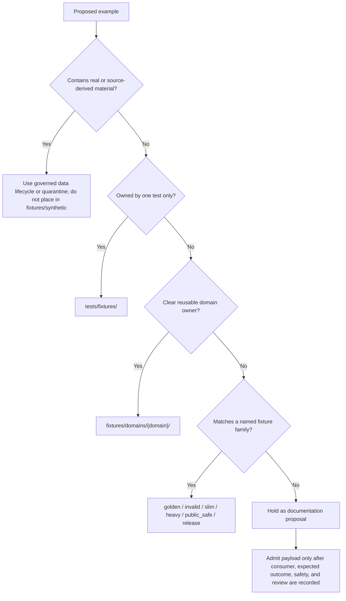

<!-- [KFM_META_BLOCK_V2]
doc_id: kfm://doc/fixtures-synthetic-readme
title: fixtures/synthetic/ — Synthetic Fixture Parent Lane
type: README
version: v0.1
status: draft; repository-grounded; nested-fixture-support-lane; inventory-partial; payload-admission-guarded; no-network-default; non-authoritative
owners:
  - "@bartytime4life — CONFIRMED GitHub CODEOWNERS review route for /fixtures/"
  - "OWNER_TBD — synthetic fixture maintainer and cross-domain fixture reviewer"
created: NEEDS VERIFICATION — the file predates this first versioned documentation contract
updated: 2026-07-24
supersedes: prior documentation at the same path; no fixture payload, schema, contract, policy, validator, test, workflow, source record, receipt, proof, release object, or publication state is superseded
policy_label: repository-facing; fixtures; synthetic; deterministic; public-safe; no-network-default; fail-closed; correction-aware; rollback-aware; non-publisher
owning_root: fixtures/
responsibility: index and govern compact cross-cutting synthetic examples that do not yet have a narrower domain, test-local, or scenario-family home, while preventing this path from becoming a catch-all or parallel fixture authority
truth_posture: cite-or-abstain; a synthetic fixture supports only its declared consumer and expected condition and never proves source authority, claim truth, EvidenceBundle closure, policy approval, review approval, release state, public safety, production behavior, or KFM publication
evidence_snapshot:
  repository: bartytime4life/Kansas-Frontier-Matrix
  base_ref: main
  base_commit: a31e2f84bed7300c3f8adb8a9640ad1591597144
  prior_blob: aef53253c29073b054542c944ecb3b34cf53d149
  directory_rules_blob: 18653c00ba193a4afaa3e07a0924452807fb98ef
  fixtures_root_readme_blob: 911c20c86d9322f38b1f59db66b922a94fd027eb
  people_dna_land_child_readme_blob: 177dc539d7557ad054082f2dbfec1d49a159d9f0
  makefile_blob: 51537af34ee065c2de571134688415042b83b22a
  codeowners_blob: dd2a84aa514d8ecd9208bc347f90f9a2ed37dd61
related:
  - ../README.md
  - people-dna-land/README.md
  - ../domains/people-dna-land/README.md
  - ../../tests/fixtures/README.md
  - ../../docs/architecture/directory-rules.md
  - ../../.github/CODEOWNERS
  - ../../Makefile
notes:
  - "This is a same-path Markdown modernization. It creates no payload, schema, contract, policy, validator, test, workflow, receipt, proof, release object, root, authority surface, or public endpoint."
  - "The lane inherits authority from fixtures/ and does not become an independent fixture registry."
  - "Bounded inspection confirmed the People/DNA/Land child README but did not establish an exhaustive child or payload inventory."
  - "No direct payload consumer for fixtures/synthetic/ was established in the bounded evidence set."
  - "make fixtures is a readiness marker that prints TODO output; it is not fixture generation or validation evidence."
[/KFM_META_BLOCK_V2] -->

# `fixtures/synthetic/` — Synthetic Fixture Parent Lane

> **One-line purpose.** `fixtures/synthetic/` indexes and governs compact, deterministic, public-safe synthetic examples that lack a narrower accepted home, while routing stable work to the correct domain, test-local, or scenario-family lane before this directory can become a catch-all or parallel fixture authority.

**Quick navigation:** [Purpose](#purpose) · [Authority](#authority-level) · [Status](#status) · [Belongs](#what-belongs-here) · [Does not belong](#what-does-not-belong-here) · [Routing](#routing-decision) · [Admission](#fixture-admission-contract) · [Children](#child-lane-inventory) · [Inputs](#inputs) · [Outputs](#outputs) · [Validation](#validation) · [Failures](#failure-interpretation) · [Review](#review-burden) · [Related](#related-folders) · [ADRs](#adrs) · [Last reviewed](#last-reviewed)

> [!IMPORTANT]
> A synthetic fixture is a **controlled example for a bounded consumer and expected condition**. It may imitate a governed object shape or negative state. It does **not** establish source authority, identity, evidence closure, policy approval, review approval, release readiness, public safety, production parity, or KFM publication.

> [!CAUTION]
> This directory is not a default landing zone for every toy file. Prefer the narrowest accepted owner: `tests/fixtures/` for test-local material, `fixtures/domains/<domain>/` for reusable domain-owned examples, or a named sibling lane such as `golden/`, `invalid/`, `slim/`, `heavy/`, `public_safe/`, or `release/`.

> [!WARNING]
> “Synthetic” does not automatically mean harmless or public-safe. Realistic combinations can identify people, expose private land relationships, reveal protected locations, reproduce licensed source material, or encode operationally sensitive infrastructure. When rights or sensitivity are unclear, do not add a payload; narrow, generalize, quarantine through the governed lifecycle, or deny the example.

---

## Purpose

This nested lane supports the canonical [`fixtures/`](../README.md) root by providing a bounded place to document and, only after admission, hold **small cross-cutting synthetic examples** whose final owner is not yet established.

It exists to:

- keep synthetic examples compact, deterministic, reviewable, no-network by default, and visibly non-authoritative;
- require a declared consumer, expected outcome, and review boundary before a payload is accepted;
- route stable examples to the narrowest domain, test-local, golden, invalid, slim, heavy, public-safe, or release-governance fixture lane;
- prevent fixture payloads from becoming accidental contracts, schemas, policies, evidence records, release objects, or public artifacts;
- preserve negative states such as `ABSTAIN`, `DENY`, `ERROR`, hold, stale, correction-required, rollback-required, and blocked render;
- keep correction and migration paths visible when an example is misplaced or gains a better owner.

This directory is a support and routing surface. It is not a synthetic-data platform, benchmark registry, generated-data warehouse, or autonomous test oracle.

[Back to top](#top)

---

## Authority level

| Field | Authority |
|---|---|
| **Directory class** | Existing nested implementation-support lane under the canonical `fixtures/` root |
| **Primary responsibility** | Cross-cutting synthetic fixture indexing, bounded admission, and routing |
| **Authority inherited from** | [`fixtures/README.md`](../README.md) |
| **May own** | This README, child-lane READMEs, admitted compact synthetic inputs, paired expected outputs, and deterministic authoring or generation notes |
| **Must not own** | Semantic contracts, canonical schemas, executable policy, source registries, lifecycle data, real evidence, canonical receipts or proofs, review approvals, release decisions, public artifacts, application code, model output, or runtime authority |
| **Network posture** | Denied by default |
| **Public-path posture** | DENY direct public serving; clients use governed APIs and released artifacts |
| **Promotion posture** | A fixture may support a validation prerequisite; it is never a `PromotionDecision`, release manifest, review approval, or publication event |
| **Truth posture** | A passing fixture check is bounded evidence about the declared consumer and condition only |

Directory Rules place files by primary responsibility. This path is correctly nested under `fixtures/` because it owns reusable synthetic checking material, not lifecycle data or authority objects. The same-path documentation update creates no root, moves no file, changes no lifecycle phase, and requires no placement ADR.

### Responsibility boundary

| Responsibility | Authority home | Role of `fixtures/synthetic/` |
|---|---|---|
| Object meaning and invariants | `contracts/` | Exercise toy examples; never redefine meaning |
| Machine-checkable shape | `schemas/` | Supply valid or invalid synthetic inputs; never become schema authority |
| Rights, sensitivity, access, and release policy | `policy/` | Exercise reviewed rules or explicit mocks; never approve exposure |
| Reusable validator implementation | `tools/validators/` | Supply deterministic inputs and expected diagnostics |
| Test assertions and test-local data | `tests/` and `tests/fixtures/` | Route one-test-only examples there |
| Reusable domain fixtures | `fixtures/domains/<domain>/` | Route examples when a domain owner is known |
| Lifecycle material and source records | `data/<phase>/` | Never store real or promoted data here |
| Receipts and proofs | `data/receipts/` and `data/proofs/` | Imitate shapes only when clearly synthetic; never store canonical trust objects |
| Release, correction, withdrawal, and rollback decisions | `release/` | Exercise dry-run shapes or negative paths only |
| Generated QA output | `artifacts/qa/` or another approved artifact lane | Never convert generated output into fixture authority |

[Back to top](#top)

---

## Status

Snapshot: `main@a31e2f84bed7300c3f8adb8a9640ad1591597144`, inspected on 2026-07-24.

| Surface | Current evidence | Safe conclusion |
|---|---|---|
| Target README | **CONFIRMED** at prior blob `aef53253c29073b054542c944ecb3b34cf53d149` | Existing documentation is modernized in place |
| Canonical fixture root | **CONFIRMED** at [`../README.md`](../README.md) | `fixtures/` owns reusable cross-cutting fixtures and remains non-authoritative |
| Directory placement doctrine | **CONFIRMED** at [`../../docs/architecture/directory-rules.md`](../../docs/architecture/directory-rules.md) | This nested path remains inside the correct responsibility root |
| CODEOWNERS route | **CONFIRMED** in [`../../.github/CODEOWNERS`](../../.github/CODEOWNERS) | `/fixtures/` routes review to `@bartytime4life`; enforcement and independent approval remain unverified |
| Confirmed child README | **CONFIRMED** at [`people-dna-land/README.md`](people-dna-land/README.md) | The child is a README-only compatibility boundary with payload admission held |
| Exact child-lane inventory | **PARTIALLY VERIFIED** | No exhaustive recursive tree listing was performed |
| Exact payload inventory | **UNKNOWN / not established** | This README does not claim that payloads are present or absent |
| Direct consumer of this parent path | **NOT ESTABLISHED IN BOUNDED EVIDENCE** | Treat payload admission as held until a consumer is linked |
| Aggregate fixture-backed validators | **CONFIRMED configured at root scope** | `make schemas` invokes the configured aggregate validators, but target-specific coverage is not established |
| Aggregate validation command | **CONFIRMED implemented** | `make validate` runs `make schemas` and schema/contract tests; it is not a full repository suite |
| Fixture regeneration target | **CONFIRMED readiness marker only** | `make fixtures` prints `TODO: regenerate deterministic fixtures`; zero exit is not validation or regeneration proof |
| Required checks and branch protection | **NEEDS VERIFICATION** | Workflow or file presence does not prove enforcement |
| Release, publication, or production parity | **DENIED as inference** | Synthetic fixture documentation and checks cannot establish public state |

### Material corrections in this revision

- Reorganizes the README around a clear folder contract and repository-grounded evidence snapshot.
- Reclassifies the path from an open-ended parent lane to a bounded synthetic support, admission, and routing surface.
- Adds an explicit routing decision so test-local, domain-owned, and scenario-family examples do not accumulate here.
- Adds a fixture admission contract requiring consumer, expected outcome, rights, sensitivity, and deterministic-generation notes.
- Records the confirmed People/DNA/Land child as a compatibility-only lane with payload admission held.
- Replaces generic validation language with the actual `make schemas`, `make validate`, and readiness-only `make fixtures` behavior.
- Adds evidence-backed badges, navigation, alerts, tables, a routing diagram, failure interpretation, review burden, and rollback guidance without claiming CI, release, or implementation maturity.

[Back to top](#top)

---

## What belongs here

Material belongs here only when it is **synthetic, compact, deterministic, reviewable, public-safe, no-network by default, and not yet better owned elsewhere**.

Admissible examples may include:

- small `*.json`, `*.jsonl`, `*.geojson`, `*.yaml`, `*.yml`, `*.svg`, or `*.md` inputs;
- toy governed-object shapes such as runtime envelopes, drawer payloads, Focus Mode contexts, evidence references, policy references, release references, correction references, or rollback references;
- paired input and expected-output examples for a declared validator, smoke check, documentation example, or bounded dry-run;
- explicit positive and negative states such as valid, invalid, `ANSWER`, `ABSTAIN`, `DENY`, `ERROR`, held, stale, citation-missing, correction-required, rollback-required, or blocked render;
- deterministic generation notes or a small generator reference when the output can be reproduced and reviewed;
- child-lane README files that define authority, routing, safety, consumer, validation, and migration posture.

### Shared design rules

- Use toy names, IDs, dates, places, references, hashes, and timestamps that cannot be mistaken for real records.
- Keep schema validity, semantic validity, evidence resolution, citation validation, source-role validity, rights posture, sensitivity posture, release posture, UI behavior, correction posture, rollback posture, and expected-output state distinct.
- State the finite expected outcome and the exact condition being exercised.
- State what a passing check proves and what it does **not** prove.
- Link every stable payload to its consumer, expected output, and governing contract, schema, or policy surface when one exists.
- Move stable material to the narrowest accepted owner rather than allowing this parent lane to become permanent storage.
- Keep examples small enough for ordinary review; stress-sized corpora belong in an approved heavy or benchmark lane.

### Child lane inventory

The bounded evidence set confirmed the following child README. This table is navigation, not an exhaustive tree or payload inventory.

| Child lane | Current role | Payload posture | Canonical routing |
|---|---|---|---|
| [`people-dna-land/`](people-dna-land/README.md) | Compatibility pointer and migration boundary for People / Genealogy / DNA / Land synthetic work | **HELD** — README-only unless a reviewed compatibility decision admits a payload | [`fixtures/domains/people-dna-land/`](../domains/people-dna-land/README.md) |

[Back to top](#top)

---

## What does NOT belong here

Do not place any of the following in `fixtures/synthetic/`:

- real source records, copied source responses, scraped material, archival records, or source packages;
- RAW, WORK, QUARANTINE, PROCESSED, CATALOG, TRIPLET, PUBLISHED, rollback, registry, receipt, or proof material;
- actual `SourceDescriptor`, `EvidenceBundle`, `RunReceipt`, proof pack, `PolicyDecision`, review approval, `PromotionDecision`, release manifest, correction notice, or rollback card;
- canonical contracts, schemas, policy bundles, validator implementation, application code, pipeline code, or runtime adapters;
- direct model output or hidden reasoning presented as a fixture oracle;
- public API payloads, public map layers, public tiles, or release artifacts served directly from the fixture tree;
- credentials, secrets, tokens, private data, restricted data, or sensitive exact geometry;
- realistic living-person, DNA/genomic, archaeology, rare-species, infrastructure, private-land, cultural, or sovereignty-sensitive combinations without explicit policy and review support;
- a duplicate of a fixture that already has a domain, test-local, golden, invalid, slim, heavy, public-safe, or release-governance owner;
- large synthetic corpora whose size, generation, licensing, review cost, or storage posture has not been approved;
- unlabeled examples with no declared consumer, expected outcome, or failure interpretation.

> [!NOTE]
> A file does not become admissible merely because its values are fabricated. Admission depends on purpose, consumer, determinism, rights, sensitivity, expected behavior, and correct placement.

[Back to top](#top)

---

## Routing decision

Use the narrowest responsibility-bearing lane before adding a payload.

### Routing matrix

| Scenario | Preferred home | Reason |
|---|---|---|
| One test owns the example | `tests/fixtures/` or the test's local fixture lane | Test-local responsibility |
| A domain owns reusable meaning or policy context | `fixtures/domains/<domain>/` | Preserve domain responsibility and sensitivity context |
| Stable expected output | `fixtures/golden/` or a domain-specific golden lane | Keep expected outputs discoverable and deterministic |
| Broad invalid or fail-closed example | `fixtures/invalid/` or a domain invalid lane | Make rejection and failure interpretation explicit |
| Small runtime smoke example | `fixtures/slim/` unless domain-owned | Keep lightweight runtime fixtures out of a broad staging lane |
| Stress-sized synthetic corpus | `fixtures/heavy/` after storage and review approval | Make review and performance intent explicit |
| Public-safe documentation or runtime example | `fixtures/public_safe/` | Preserve public-safety posture |
| Synthetic release-governance dry-run | `fixtures/release/` | Keep release-shaped examples separate from real release decisions |
| Generated QA result | `artifacts/qa/` or an approved artifact lane | Generated output is not fixture authority |
| Real or source-derived material | `data/raw/`, `data/work/`, or `data/quarantine/` as governed | Fixtures are not lifecycle data |
| Ownership or consumer remains unclear | README proposal only; no payload | Avoid unowned and unvalidated fixture accumulation |

[Back to top](#top)

---

## Fixture admission contract

A new payload is admitted only when the pull request or nearest lane README records all applicable fields below. The exact machine-readable metadata schema is **NEEDS VERIFICATION**; do not invent one in this directory.

| Admission field | Required evidence |
|---|---|
| **Scenario identity** | Stable, unambiguous toy scenario name or ID |
| **Purpose** | The bounded behavior or failure state being exercised |
| **Consumer** | Exact validator, test, pipeline dry-run, governed-API smoke check, UI check, or documentation example |
| **Object family** | Contract, schema, policy, runtime envelope, drawer payload, Focus context, correction, rollback, or other declared family |
| **Fixture posture** | Valid, invalid, positive, negative, held, stale, public-safe, correction-bearing, rollback-bearing, or another explicit state |
| **Expected outcome** | `ANSWER`, `ABSTAIN`, `DENY`, `ERROR`, pass, fail, review-required, blocked render, or another deterministic result |
| **Determinism** | Manual authoring rule, seed, generator command, or reproducible transformation note |
| **Rights and provenance** | Confirmation that content is wholly synthetic or a documented public-safe derivative that may be redistributed |
| **Sensitivity** | Explicit statement that no protected or reverse-engineerable combination is exposed; required reviewer when material |
| **Governing surfaces** | Exact contract, schema, policy, or ADR links when they exist |
| **Destination** | Why this lane is currently correct and the narrower destination if ownership stabilizes |
| **Maintenance** | Owner or review route, last-reviewed date, and paired expected-output update rule |
| **Failure meaning** | What a failed check means and what it does not establish |
| **Removal or rollback** | How to remove, migrate, or revert the example without losing correction history |

### Admission outcomes

| Outcome | Meaning |
|---|---|
| **ADMIT** | All applicable fields are grounded, the path is correct, the example is safe, and a consumer is linked |
| **ROUTE** | The example is valid synthetic material but belongs in a narrower fixture lane |
| **HOLD** | Consumer, expected outcome, rights, sensitivity, owner, or validation is unresolved |
| **DENY** | The material contains real/restricted data, unsafe precision, secrets, unreviewable content, or would create parallel authority |
| **REMOVE / QUARANTINE** | A committed fixture is discovered to contain source or sensitive material and must leave the fixture tree through a governed correction |

[Back to top](#top)

---

## Inputs

Accepted input paths are intentionally narrow:

- manually authored toy data that is clearly fictional and reviewable;
- deterministic generator output whose seed, tool, input, and expected digest or comparison method are documented;
- paired expected outputs derived from an admitted synthetic input;
- documentation examples copied from an accepted contract or schema only when they remain synthetic, current, and explicitly non-authoritative;
- reviewed migration or compatibility notes for child lanes.

Default input posture is **no network**. Live source, API, tile, model, vendor, or public-service calls belong in separately governed integration, connector, watcher, or runtime workflows. A captured live response does not become synthetic by being copied into this directory.

### Required input labels

Each payload or lane must state the labels that materially apply:

- synthetic or public-safe;
- valid, invalid, positive, negative, golden, expected output, held, stale, correction-bearing, rollback-bearing, or blocked;
- rights-visible or rights-unresolved;
- sensitivity-reviewed or sensitivity-unresolved;
- source-role-preserved or source-role-conflicted;
- evidence-resolved or evidence-missing;
- citation-ready or citation-missing;
- release-ready-shape or release-missing-shape, without implying real release.

[Back to top](#top)

---

## Outputs

This lane may support downstream:

- validator inputs and expected diagnostics;
- test inputs and golden outputs;
- pipeline dry-runs and negative-state checks;
- governed-API smoke requests and finite response envelopes;
- Evidence Drawer and Focus Mode documentation examples;
- source-role, evidence-resolution, citation-validation, rights, sensitivity, correction, rollback, and release-readiness exercises;
- documentation screenshots or examples generated from admitted public-safe fixtures.

It does **not** emit or authorize:

- canonical data;
- actual evidence or source admission;
- policy decisions or review approvals;
- receipts, proofs, promotion decisions, release manifests, or published artifacts;
- public API, map, tile, AI, or UI truth;
- production parity or operational readiness.

Every downstream consumer must preserve the fixture's synthetic label and bounded expected outcome. Exporting or rendering a fixture does not upgrade its authority.

[Back to top](#top)

---

## Validation

Validation is layered. No single passing check proves the fixture is safe, correct, released, or production-equivalent.

### Repository-grounded commands

| Command | Confirmed behavior | Limitation |
|---|---|---|
| `make schemas` | Runs `python tools/validators/_common/run_all.py` against configured aggregate fixture-backed validators | Target-specific coverage for `fixtures/synthetic/` is not established |
| `make test` | Runs `python -m pytest tests/schemas tests/contracts -q` | Narrow schema and contract test scope; not a synthetic-lane suite |
| `make validate` | Runs `make schemas` and `make test` | Partial aggregate validation, not a full repository or release suite |
| `make fixtures` | Prints `TODO: regenerate deterministic fixtures` | Readiness marker only; zero exit is not generation or validation evidence |

### Required check classes

Apply every relevant class to an admitted fixture:

1. **Markdown and link checks** — headings, anchors, relative links, tables, code fences, Mermaid, and final newline.
2. **Shape validation** — schema validation when an accepted schema exists.
3. **Semantic validation** — contract invariants remain distinct from shape checks.
4. **Policy and sensitivity checks** — rights, geoprivacy, consent, living-person, archaeology, rare-species, infrastructure, private-land, and cultural rules where relevant.
5. **Consumer check** — the named test, validator, dry-run, UI example, or documentation build actually reads the fixture.
6. **Expected-output check** — actual output is compared deterministically with the declared expectation.
7. **Negative-state check** — invalid, deny, abstain, hold, error, correction, and rollback paths are exercised when material.
8. **Trust-boundary check** — no fixture path is served as canonical or public data.
9. **Migration check** — links and consumers are updated when the fixture moves to a narrower owner.

> [!IMPORTANT]
> A fixture that is not consumed is documentation or dormant sample material, not enforceability proof. A fixture that passes only shape validation does not prove semantic validity, evidence closure, policy safety, release readiness, UI correctness, or production behavior.

### Validation record

For each material update, record:

- commands run and their exact scope;
- pass, fail, skipped, and not-applicable results;
- inherited failures versus failures introduced by the change;
- fixture paths and expected outputs exercised;
- unresolved consumer, schema, policy, rights, or sensitivity gaps;
- why the result is sufficient for the bounded change.

[Back to top](#top)

---

## Failure interpretation

| Observation | Correct interpretation | Incorrect inference |
|---|---|---|
| Shape validator passes | The fixture matches the checked machine shape | The object is true, admissible, released, or production-ready |
| Contract test passes | The declared semantic invariant held for this example | All domain semantics are covered |
| Policy mock allows | The reviewed mock produced the expected result | Real policy approved public exposure |
| UI renders | The consumer displayed the synthetic example | The layer or claim is evidence-backed or published |
| Focus Mode returns `ANSWER` | The synthetic envelope exercised an answer path | A real model or evidence bundle supports the statement |
| Negative fixture returns `DENY` | The declared denial path is exercised | All sensitive cases fail closed |
| `make fixtures` exits zero | The readiness marker executed | Fixtures were regenerated or validated |
| No consumer is found | Consumer coverage is not established | The fixture is safe to keep indefinitely |
| Real or sensitive content is discovered | Stop use, remove or quarantine, record correction and repair consumers | Rename it “synthetic” and continue |

### Correction path

When a fixture is misplaced or unsafe:

1. stop downstream use;
2. preserve evidence of the mistake without redistributing restricted content;
3. move real or sensitive material into the governed lifecycle or quarantine path;
4. remove secrets or protected content from history through an authorized security workflow when necessary;
5. repair consumers, expected outputs, links, and documentation;
6. record the correction, migration, or rollback rationale;
7. rerun the bounded validation set.

[Back to top](#top)

---

## Review burden

| Change type | Minimum review burden |
|---|---|
| README-only clarification | `/fixtures/` CODEOWNERS route plus documentation review |
| New compact cross-cutting payload | Fixture owner or consumer maintainer plus CODEOWNERS review |
| Domain-specific payload | Owning domain fixture reviewer; route to `fixtures/domains/<domain>/` |
| Policy-shaped or sensitivity-bearing payload | Policy or sensitivity reviewer appropriate to the domain |
| Living-person, DNA/genomic, archaeology, rare-species, infrastructure, private-land, or cultural example | Deny-first review; use the domain-owned lane and require explicit rights/sensitivity support |
| Generator or broad corpus change | Consumer maintainer, storage/performance review, determinism review, and rollback plan |
| Move or retirement | Owners of all consumers, links, expected outputs, and compatibility surfaces |

[`CODEOWNERS`](../../.github/CODEOWNERS) routes `/fixtures/` to `@bartytime4life`. That route is review metadata, not proof that review occurred or that independent approval, branch protection, required checks, or separation of duties is enforced.

Reviewers should verify:

- the example has a declared consumer and expected outcome;
- this is the narrowest correct path;
- no real or sensitive material is present;
- rights and redistribution are clear;
- generation is deterministic and reviewable;
- negative states are not hidden;
- a passing fixture cannot be mistaken for truth, policy, release, or publication;
- migration and rollback are practical.

[Back to top](#top)

---

## Related folders

| Path | Relationship |
|---|---|
| [`fixtures/`](../README.md) | Canonical reusable fixture root and controlling fixture contract |
| [`people-dna-land/`](people-dna-land/README.md) | Confirmed compatibility child with payload admission held |
| [`fixtures/domains/people-dna-land/`](../domains/people-dna-land/README.md) | Domain-owned destination for People/DNA/Land synthetic fixtures |
| `fixtures/slim/` | Preferred small runtime-smoke lane when the example is not domain-owned |
| `fixtures/heavy/` | Stress-sized fixture lane after storage and review approval |
| `fixtures/golden/` | Stable expected-output lane |
| `fixtures/invalid/` | Broad invalid and fail-closed lane |
| `fixtures/public_safe/` | Public-safe documentation and runtime examples |
| `fixtures/release/` | Synthetic release-governance fixture lane |
| [`tests/fixtures/`](../../tests/fixtures/README.md) | Test-local fixture home |
| `tools/validators/` | Reusable validator implementations that may consume admitted fixtures |
| `contracts/` | Semantic meaning and invariants |
| `schemas/` | Machine-checkable shape |
| `policy/` | Rights, sensitivity, access, and release admissibility |
| `data/` | Governed lifecycle material; real data belongs here, not in fixtures |
| `release/` | Real release, correction, withdrawal, and rollback decisions |
| `artifacts/` | Generated QA/build output, not fixture authority |
| [`Directory Rules`](../../docs/architecture/directory-rules.md) | Placement and README governance |
| [`Makefile`](../../Makefile) | Repository-grounded validation commands and readiness markers |

[Back to top](#top)

---

## ADRs

No accepted ADR specific to `fixtures/synthetic/` was verified in the bounded evidence set.

This same-path README modernization:

- creates no root or parallel authority;
- moves no fixture or consumer;
- changes no schema, contract, policy, lifecycle phase, release object, or public surface;
- therefore does not require a placement ADR.

An ADR or migration record becomes necessary when a change would:

- create a new canonical or compatibility root;
- establish a parallel fixture home for an existing responsibility;
- change the fixture-home split between `fixtures/` and `tests/fixtures/`;
- create a machine-readable fixture metadata standard used across roots;
- change lifecycle placement;
- retire a path with broad consumers or compatibility obligations.

Until such a decision is accepted, this lane remains subordinate to [`fixtures/README.md`](../README.md) and Directory Rules.

[Back to top](#top)

---

## Maintenance and migration

- Update this README when child lanes, payloads, consumers, validators, tests, helper scripts, generators, expected-output names, storage decisions, or routing rules change.
- Keep the child inventory evidence-bounded; do not call it exhaustive without a recursive tree inspection.
- Link each stable payload to the exact consumer and expected result.
- Update paired inputs and outputs together.
- Move domain-owned examples into `fixtures/domains/<domain>/` through a reviewed change rather than copying them into two homes.
- Repair links, tests, validators, docs, and expected-output references during a move.
- Preserve a compatibility note only as long as a verified consumer needs it.
- Remove dormant payloads that have no consumer, owner, or maintained expected outcome unless they serve a clearly documented teaching purpose.
- Re-review examples when contracts, schemas, policy, rights, sensitivity, renderer behavior, API envelopes, or finite outcomes change.
- Keep payloads small enough for normal review and repository health.

### Rollback

This documentation-only update is reversible by restoring prior blob `aef53253c29073b054542c944ecb3b34cf53d149`.

A payload or lane migration must have a broader rollback plan that restores:

- the prior path or compatibility pointer;
- all consumer references;
- paired expected outputs;
- generator and seed metadata;
- validation commands;
- correction notes when public or reviewed material referenced the fixture.

Rollback does not erase the reason a fixture was corrected, denied, or moved.

[Back to top](#top)

---

## Last reviewed

| Field | Value |
|---|---|
| **Last reviewed** | 2026-07-24 |
| **Evidence snapshot** | `main@a31e2f84bed7300c3f8adb8a9640ad1591597144` |
| **Prior target blob** | `aef53253c29073b054542c944ecb3b34cf53d149` |
| **Directory Rules blob** | `18653c00ba193a4afaa3e07a0924452807fb98ef` |
| **Fixture root README blob** | `911c20c86d9322f38b1f59db66b922a94fd027eb` |
| **Confirmed child README blob** | `177dc539d7557ad054082f2dbfec1d49a159d9f0` |
| **Makefile blob** | `51537af34ee065c2de571134688415042b83b22a` |
| **CODEOWNERS blob** | `dd2a84aa514d8ecd9208bc347f90f9a2ed37dd61` |
| **Child inventory** | PARTIALLY VERIFIED |
| **Payload inventory** | UNKNOWN / not established |
| **Direct consumer coverage** | NOT ESTABLISHED IN BOUNDED EVIDENCE |
| **Target-specific tests and validators** | NOT RUN / coverage not established |
| **Required checks and branch protection** | NEEDS VERIFICATION |
| **Release or publication state** | DENIED as inference |

Re-review when a payload is admitted, a child lane is added or retired, a consumer begins reading this path, the fixture-root contract changes, or six months have elapsed.

[Back to top](#top)
