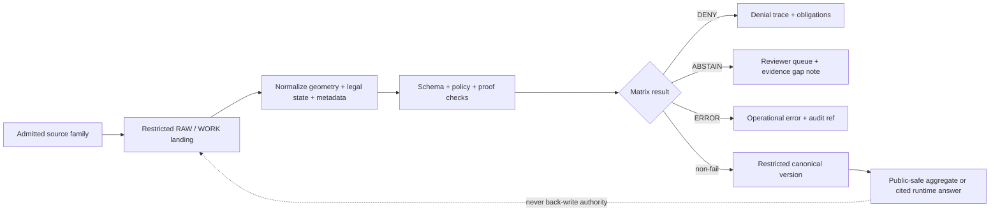

<!-- [KFM_META_BLOCK_V2]
doc_id: kfm://doc/NEEDS-VERIFICATION
title: Critical Habitat Fail Matrix
type: standard
version: v1
status: draft
owners: @bartytime4life
created: NEEDS-VERIFICATION
updated: 2026-04-14
policy_label: restricted
related: [
  ../../policy/README.md,
  ../../schemas/habitat_metadata.schema.json,
  ../../policy/habitat/metadata.rego,
  ../../data/receipts/README.md,
  ../../data/catalog/stac/README.md,
  ../../data/catalog/dcat/README.md,
  ../../data/catalog/prov/README.md,
  ../../tools/validators/README.md,
  ../../tests/README.md
]
tags: [kfm, habitat, critical-habitat, fail-closed, governance, sensitive-data]
notes: [
  Evidence-bounded update of the older fail matrix draft.
  Exact neighboring habitat-lane files and executable validator inventory remain NEEDS VERIFICATION in the current session.
  This document assumes finite governed outcomes ANSWER | ABSTAIN | DENY | ERROR and receipt/proof separation per KFM doctrine.
]
[/KFM_META_BLOCK_V2] -->

# Critical Habitat Fail Matrix

Fail-closed decision matrix for **intake, validation, review, release, and runtime use** of critical-habitat data and adjacent habitat-sensitive evidence.

> [!NOTE]
> **Status:** draft  
> **Owners:** `@bartytime4life`  
> **Path:** `habitat/critical_habitat/FAIL_MATRIX.md`  
>      
> **Quick jumps:** [Scope](#scope) · [Repo fit](#repo-fit) · [Accepted inputs](#accepted-inputs) · [Exclusions](#exclusions) · [Outcome grammar](#outcome-grammar) · [Primary fail matrix](#primary-fail-matrix) · [Publication classes](#publication-classes) · [Execution flow](#execution-flow) · [Definition of done](#definition-of-done) · [Appendix](#appendix)

> [!IMPORTANT]
> In KFM, **critical habitat is not a generic ecology layer**. It is a burden-bearing lane where **authority, legal state, rights, precision, freshness, review state, and provenance** must remain visible.

> [!WARNING]
> This file is intentionally conservative. If the system cannot prove source role, rights posture, generalization safety, geometry integrity, and release closure, it should **ABSTAIN**, **DENY**, or **ERROR** rather than publish a confident claim.

---

## Scope

This file defines the default **negative-path control surface** for `habitat/critical_habitat/`.

Use it when the system is deciding whether critical-habitat material may:

- enter `RAW` / `WORK` from an admitted source,
- be normalized into a canonical dataset version,
- be joined to occurrences, AOIs, or review surfaces,
- be exposed to public-safe delivery layers,
- be promoted into catalog / release artifacts, or
- be cited in a governed runtime response.

The matrix is designed to align with:

- **fail-closed evaluation**,
- **finite outward outcomes**,
- **receipt / proof separation**,
- **policy-owned denial logic**, and
- **public-safe precision controls**.

[Back to top](#critical-habitat-fail-matrix)

---

## Repo fit

**Target path:** `habitat/critical_habitat/FAIL_MATRIX.md`

### Repo role

This file is the **lane-level failure contract** for critical-habitat handling.

It does **not** replace:

- source descriptors,
- machine schemas,
- policy bundles,
- release manifests,
- receipts,
- proof packs, or
- reviewer decisions.

Instead, it tells maintainers, validators, and runtime surfaces what must happen when those supporting controls are absent, ambiguous, or unsafe.

### Likely upstream surfaces

- `policy/README.md`
- `policy/habitat/metadata.rego`
- `schemas/habitat_metadata.schema.json`
- source onboarding / registry materials
- review-state and reason / obligation registries
- catalog closure docs across STAC / DCAT / PROV

### Likely downstream surfaces

- validator outputs
- CI summaries
- reviewer handoff bundles
- runtime `DecisionEnvelope` / outward trust cues
- public-safe aggregate habitat overlays
- correction and supersession notices

[Back to top](#critical-habitat-fail-matrix)

---

## Accepted inputs

This matrix is written for the following input families.

| Input family | Role in this lane | Default trust posture |
|---|---|---|
| USFWS critical-habitat boundaries | Authoritative federal critical-habitat geometry and metadata | **Authoritative source family** |
| USFWS AOI / review results | Federal consultation-oriented context scoped to a place or project area | **Authoritative review context** |
| KDWP / Kansas ecological review outputs | Kansas state review context and routing indicators | **Review-bearing context, not automatic legal closure** |
| Kansas Natural Heritage / NatureServe precise records | Sensitive occurrence and status context; often access- or license-constrained | **Precision-sensitive support family** |
| GBIF / iNaturalist occurrences | Supplemental occurrence context only | **Supplemental, not authoritative for critical habitat** |
| Internal KFM trust artifacts | `spec_hash`, receipts, proof refs, audit refs, attestations where required | **Required for publishable or review-bearing surfaces** |

### Metadata minimums

Any publishable or review-bearing derivative in this lane is expected to carry, at minimum:

- `dataset_id`
- `dataset_license`
- `dataset_attribution`
- `source_uri`
- `source_version`
- `policy_label`
- `owners`

Sensitive records additionally require:

- `sensitivity_reason`
- `generalization_method`
- `generalization_seed`
- `precision_original`
- `precision_published`

[Back to top](#critical-habitat-fail-matrix)

---

## Exclusions

This file does **not** authorize any of the following:

- treating modeled habitat suitability as designated critical habitat,
- treating broad species range maps as precise habitat boundaries,
- publishing exact sensitive occurrence points by default,
- using public occurrence portals as regulatory authority for critical habitat,
- making permit or consultation claims without governing review context,
- promoting a dataset with missing license or source provenance,
- bypassing release closure because geometry “looks right,” or
- hiding known correction / supersession state from outward surfaces.

[Back to top](#critical-habitat-fail-matrix)

---

## Outcome grammar

KFM outward responses should remain finite and accountable:

- **ANSWER**
- **ABSTAIN**
- **DENY**
- **ERROR**

This document focuses on the **negative-path** cases.

| Outcome | Use it when | Public-surface consequence |
|---|---|---|
| **ABSTAIN** | Evidence is insufficient for a public-safe or review-safe claim, but no hard policy violation or broken validator path is proven. | No claim; surface gaps and review requirements. |
| **DENY** | A hard rule is violated: wrong authority family, unsafe precision, missing rights, restricted publication, missing required proof objects, or blocked policy posture. | No release; emit denial reason and obligations. |
| **ERROR** | The evaluator, artifact, geometry, schema, or validation path is broken or internally inconsistent. | No claim; emit operational failure with audit linkage. |

> [!TIP]
> CI may still report `pass/fail`, but outward governed surfaces should map those conditions to **ANSWER / ABSTAIN / DENY / ERROR**.

### Canonical fail mapping

| Condition | Outcome |
|---|---|
| Missing or unresolved rights / license | **DENY** |
| Sensitive data without required generalization | **DENY** |
| Restricted dataset proposed for public release | **DENY** |
| Missing or stale support for a current-state claim | **ABSTAIN** |
| Invalid geometry / JSON / schema / validator crash | **ERROR** |

[Back to top](#critical-habitat-fail-matrix)

---

## Diagram



[Back to top](#critical-habitat-fail-matrix)

---

## Primary fail matrix

| ID | Failure condition | Detection point | Default outcome | Public-surface action | Minimum evidence for clearance | Required obligation / next step |
|---|---|---|---|---|---|---|
| **CH-01** | Source identity is unresolved or not admitted by descriptor. | intake | **DENY** | Block ingest beyond quarantine or restricted staging. | Registered source descriptor, endpoint identity, source role. | Register or verify the source before retry. |
| **CH-02** | Critical-habitat geometry is taken from a supplemental occurrence source instead of an authoritative habitat source. | intake / normalization | **DENY** | Do not publish or answer as critical habitat. | Federal or state authoritative habitat basis. | Reclassify as occurrence context or replace the source. |
| **CH-03** | Final, proposed, historical, or otherwise distinct legal states are merged or unlabeled. | normalization | **DENY** | No public overlay or summary. | Explicit legal-state field, dates, source citation. | Split by legal state and restage. |
| **CH-04** | Rights, license, redistribution, or access terms are missing, empty, or contradictory. | schema / policy / review | **DENY** | No public publication. | Closed rights metadata and policy label. | Resolve rights classification and rerun validation. |
| **CH-05** | Sensitive geometry or derived intersections would expose unsafe precision. | publication | **DENY** | Replace with aggregate, generalized, or restricted-only view. | Declared publication class plus generalization metadata. | Generalize, aggregate, or keep internal. |
| **CH-06** | Public-facing habitat × occurrence × AOI joins would enable reverse engineering of sensitive sites. | publication design | **DENY** | Suppress or coarsen outward outputs. | Join-risk review and approved public-safe derivative. | Redesign the outward layer. |
| **CH-07** | Geometry, CRS, bbox, or topology is malformed or internally inconsistent. | validation | **ERROR** | No publication or runtime synthesis. | Valid geometry and deterministic repair trace. | Repair in `WORK`, emit new receipt, revalidate. |
| **CH-08** | Taxonomy / entity crosswalk is ambiguous enough that habitat cannot be reliably tied to the intended species. | normalization / synthesis | **ABSTAIN** | No confident species-habitat claim. | Stable identifier and authoritative source mapping. | Record ambiguity and require analyst review. |
| **CH-09** | State or federal review context indicates further review is required, incomplete, or conditional. | review surface | **ABSTAIN** | Do not represent the project as cleared. | Review-state artifact, jurisdictional context, AOI. | Route to reviewer workflow; do not overstate review state. |
| **CH-10** | A Kansas review-layer polygon is treated as a hard legal boundary when the layer is only review-bearing or indicative. | review / runtime | **ABSTAIN** | No exact-boundary or completed-clearance claim from that layer alone. | Layer role metadata and completed review basis. | Keep wording provisional or move to steward review. |
| **CH-11** | Runtime or narrative text claims “critical habitat” where the evidence only supports range, suitability, hotspot, or occurrence context. | runtime / export | **DENY** | Replace with narrower wording or suppress claim. | Evidence bundle proving authoritative habitat basis. | Narrow wording and rerun evidence checks. |
| **CH-12** | Freshness is unknown, stale, or not comparable across source families for a consequential present-tense claim. | runtime / release | **ABSTAIN** | No current-state claim; only clearly dated historical framing if safe. | Fetch time, source version, effective date, release linkage. | Re-fetch or downgrade to dated historical context. |
| **CH-13** | Required metadata sidecar fields are missing for a publishable derivative. | schema / validator | **DENY** | No promotion or outward release. | Valid sidecar shape and required field presence. | Complete metadata and rerun schema validation. |
| **CH-14** | Sensitive publication candidate lacks `sensitivity_reason`, `generalization_method`, `generalization_seed`, or safe `precision_published`. | schema / policy | **DENY** | No public output. | Full sensitive-data sidecar plus non-exact published precision. | Apply deterministic generalization and rerun. |
| **CH-15** | Restricted datasets are proposed for public publication. | policy / promotion | **DENY** | No public release. | Explicit steward-only authorization path, if any. | Keep restricted or derive public-safe aggregate. |
| **CH-16** | `spec_hash`, receipt refs, or required release / attestation objects are missing for a release-bearing artifact. | validator / promotion | **DENY** | No promotion, no outward release. | Required trust-object closure for the lane. | Emit missing trust artifacts and rerun. |
| **CH-17** | Model mediation occurred for an outward artifact but there is no bounded AI receipt or evidence linkage. | runtime / export | **DENY** | No AI-assisted outward statement. | `ai_receipt` plus evidence and audit references where required. | Emit bounded AI audit objects or remove model mediation from the outward path. |
| **CH-18** | Catalog closure is incomplete across STAC / DCAT / PROV or equivalent release surfaces. | release assembly | **DENY** | No public publication. | Closed catalog refs, release manifest, audit linkage. | Complete release closure before promotion. |
| **CH-19** | Correction, supersession, or withdrawal state is known but hidden from the outward surface. | runtime / publication | **DENY** | No silent replacement. | Correction notice and replacement linkage. | Publish visible correction or supersession state first. |
| **CH-20** | Public answer path bypasses governed evidence resolution or policy evaluation. | runtime architecture | **ERROR** | Treat response as invalid even if prose appears correct. | Governed runtime path and audit trace. | Route through governed runtime and rerun. |

> [!CAUTION]
> **CH-05**, **CH-06**, and **CH-14** are the most likely accidental-harm rows. A dataset can be legally open yet still be operationally unsafe to publish at exact precision.

[Back to top](#critical-habitat-fail-matrix)

---

## Source-role matrix

Use this table to stop source-family drift before it becomes a public claim problem.

| Source family | What it is allowed to mean here | What it must not silently become |
|---|---|---|
| USFWS critical-habitat services / snapshots | Federal critical-habitat boundary authority and legal-state metadata | Generic species range, suitability, or occurrence authority |
| USFWS AOI / consultation-oriented outputs | Area-scoped review context for a specific place or project | Permanent substitute for canonical storage or release closure |
| KDWP / Kansas ecological review tooling | State review context, routing indicators, warning surfaces | Proof that consultation is complete or that a viewed polygon is automatically a hard legal boundary |
| NatureServe / Kansas Natural Heritage precision data | Sensitive status and occurrence context for stewardship or restricted analysis | Public-safe exact geometry by default |
| GBIF / iNaturalist occurrences | Corroborative occurrence context only | Regulatory authority for critical habitat |
| Modeled habitat / hotspot surfaces | Derived analytic surfaces | Statutory or authoritative critical habitat |

[Back to top](#critical-habitat-fail-matrix)

---

## Publication classes

| Publication class | Typical content | Default rule |
|---|---|---|
| **Restricted raw** | Exact designated polygons, precise occurrence intersections, licensed records, project-area overlays under review | Steward / reviewer access only |
| **Restricted canonical** | Validated authoritative habitat versions with complete metadata and trust objects | Not directly public; may feed release assembly |
| **Public aggregate** | County / HUC / grid / dossier-safe summaries, generalized footprints, cited status summaries | Allowed only after precision, rights, and closure checks pass |
| **Public narrative** | Story, dossier, or runtime text with authoritative citations and visible review / freshness limits | Allowed only if wording does not overstate authority or clearance |

### Precision rules by publication class

| Class | Exact precision allowed? | Generalization required? |
|---|---|---|
| Restricted raw | Yes, where rights and stewardship controls allow | No |
| Restricted canonical | Usually yes internally | Not necessarily |
| Public aggregate | No for sensitive content | Yes, where applicable |
| Public narrative | Never expose exact sensitive location detail | Narrative-safe only |

[Back to top](#critical-habitat-fail-matrix)

---

## Execution flow

1. **Register the source family first.**  
   Do not begin with a raw download and decide authority later.

2. **Land raw material in a restricted zone.**  
   Critical-habitat geometry and occurrence joins begin in `RAW` / `WORK`, not in a public tile lane.

3. **Normalize without widening authority.**  
   Preserve legal state, dates, IDs, source role, and rights posture explicitly.

4. **Attach the metadata sidecar.**  
   Publishable or review-bearing artifacts require the habitat metadata fields expected by schema and policy.

5. **Emit process memory separately from release proof.**  
   Receipts document what happened during the run; proofs and release objects document what is being promoted or published.

6. **Run schema and policy before release assembly.**  
   Invalid shape and blocked policy are first-class fail states, not incidental warnings.

7. **Publish only public-safe derivatives.**  
   Restricted canonical material may exist without implying a public layer.

8. **Carry correction state forward.**  
   If habitat status, wording, or geometry changes, correction must remain visible in outward surfaces.

[Back to top](#critical-habitat-fail-matrix)

---

## Definition of done

Treat this file as operationally healthy only when the lane can prove the following.

- [ ] admitted source families are explicitly registered and role-labeled
- [ ] final vs proposed or otherwise distinct legal states are stored distinctly
- [ ] precise occurrence joins do not leak to public-safe surfaces
- [ ] reason and obligation codes exist for every row in the primary matrix
- [ ] schema validation exists for habitat metadata sidecars
- [ ] policy validation exists for rights, sensitivity, and restricted-publication denial
- [ ] required trust objects are present for release-bearing surfaces
- [ ] public-safe aggregates declare a deterministic generalization method
- [ ] state review signals cannot be misread as completed consultation
- [ ] modeled habitat products cannot be labeled as critical habitat by default
- [ ] correction and supersession states are visible in runtime surfaces
- [ ] positive and negative fixtures exist for validator testing

[Back to top](#critical-habitat-fail-matrix)

---

## Appendix

<details>
<summary><strong>Starter reason-code registry</strong></summary>

| Reason code | When to use it |
|---|---|
| `source_unregistered` | Incoming dataset or endpoint is not backed by an admitted descriptor |
| `wrong_authority_family` | A supplemental source is being treated as authoritative habitat |
| `legal_state_unlabeled` | Final / proposed / historical state is missing or collapsed |
| `rights_unresolved` | Rights / redistribution / access terms are not closed |
| `precision_unsafe_publication` | Exact geometry exceeds public precision allowance |
| `join_reverse_engineering_risk` | Combined outward layers could reconstruct sensitive locations |
| `geometry_invalid` | Geometry / CRS / bbox checks failed |
| `taxonomy_ambiguous` | Species identity is not stable enough for a public claim |
| `review_incomplete` | Review context indicates further review is required |
| `authority_overstatement` | Narrative or export language exceeds the evidence |
| `freshness_unresolved` | No safe basis for a current-state claim |
| `metadata_sidecar_incomplete` | Required metadata fields are missing |
| `sensitive_generalization_missing` | Sensitive dataset lacks required generalization controls |
| `restricted_publication_blocked` | Restricted dataset was proposed for outward release |
| `proof_closure_incomplete` | Required trust objects are missing |
| `catalog_closure_incomplete` | STAC / DCAT / PROV release closure is incomplete |
| `correction_hidden` | Known correction or supersession is not surfaced outwardly |
| `trust_membrane_bypass` | Response path bypassed governed evidence / policy flow |

</details>

<details>
<summary><strong>Illustrative validator payload shape (pseudocode)</strong></summary>

```json
{
  "subject": "critical_habitat_release_candidate",
  "dataset_id": "kfm://dataset/habitat/usfws-critical-habitat-kansas/v1",
  "spec_hash": "sha256:...",
  "receipts_ref": "kfm://receipts/...",
  "proof_ref": "kfm://release/...",
  "ai_receipt": null,
  "policy_label": "caution",
  "source_family": "usfws_critical_habitat",
  "legal_state": "final",
  "publication_class": "public_aggregate",
  "precision_original": "polygon",
  "precision_published": "generalized_polygon",
  "matrix_checks": [
    {
      "id": "CH-05",
      "result": "DENY",
      "reason_codes": ["precision_unsafe_publication"],
      "obligations": ["generalize_geometry", "rerun_validator"]
    }
  ]
}
```

</details>

<details>
<summary><strong>Suggested fixture coverage</strong></summary>

| Fixture | Expected result | Why |
|---|---|---|
| `pass/public_usfws.json` | non-fail | authoritative source family with complete metadata |
| `pass/sensitive_generalized.json` | non-fail | sensitive content is generalized and reproducible |
| `fail/missing_license.json` | **DENY** | license missing |
| `fail/sensitive_not_generalized.json` | **DENY** | exact sensitive publication blocked |
| `fail/restricted_publishable.json` | **DENY** | restricted dataset cannot publish publicly |
| malformed geometry or invalid JSON case | **ERROR** | broken validator or artifact path |
| stale / ambiguous review context case | **ABSTAIN** | insufficient basis for current-state claim |

</details>

<details>
<summary><strong>Open verification items</strong></summary>

- Exact lane owner for `habitat/critical_habitat/`
- Whether adjacent docs already define habitat-specific obligation codes
- Whether active public main already contains a dedicated habitat validator surface
- Whether this file should sit under a broader `habitat/` or `biodiversity/` contract family
- Exact relative links for registry / review / validator neighbors

</details>

[Back to top](#critical-habitat-fail-matrix)
