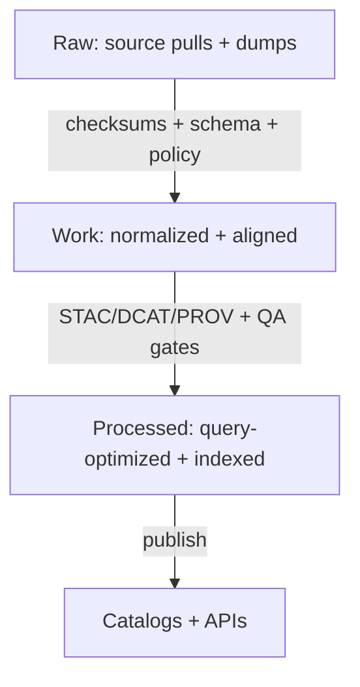

# KFM Infrastructure (infra/) 🧱🔐🌾


> **Purpose:** This folder is the **single source of truth** for KFM’s infrastructure configuration, GitOps state, policy-as-code, and operational runbooks.  
> **Goal:** Make it impossible (by default) to violate KFM governance invariants—even accidentally.

---

## Table of Contents 📚

- [Non-Negotiables](#non-negotiables)
- [What Lives in `infra/`](#what-lives-in-infra)
- [Quickstart](#quickstart)
- [Architecture Overview](#architecture-overview)
- [Repository & Directory Layout](#repository--directory-layout)
- [Environments](#environments)
- [GitOps Delivery Model](#gitops-delivery-model)
- [Platform Foundations](#platform-foundations)
- [Security & Compliance](#security--compliance)
- [Observability & SLOs](#observability--slos)
- [Backups & Disaster Recovery](#backups--disaster-recovery)
- [Operations Runbooks](#operations-runbooks)
- [Change Management](#change-management)
- [Glossary](#glossary)
- [References](#references)

---

## Non-Negotiables ✅

> [!IMPORTANT]
> **Trust membrane:** **UI and external clients never access databases directly.** All access is through the governed API + policy boundary.

> [!IMPORTANT]
> **Fail-closed policies:** Every request (data, Story Nodes, AI/Focus Mode) is evaluated by policy. **Deny-by-default** unless explicitly allowed.

> [!IMPORTANT]
> **Dataset promotion gates:** Promotion is **Raw → Work → Processed** and requires **checksums** + **STAC/DCAT/PROV catalogs**.

> [!IMPORTANT]
> **Evidence-first UX:** Focus Mode must **cite or abstain**, and every answer produces an **audit reference**.

> [!WARNING]
> Any infrastructure change that can weaken these invariants **must** be flagged for governance review (see [Change Management](#change-management)).

---

## What Lives in `infra/` 🧰

This folder covers **everything** needed to operate KFM safely in dev/stage/prod:

- 🧱 **Cluster bootstrap** (namespaces, base operators, ingress, storage class defaults)
- 🧭 **GitOps** (Argo CD / OpenShift GitOps Applications + ApplicationSets)
- 🔐 **Security** (RBAC, network policies, admission policies, image policy, secrets patterns)
- 🧾 **Policy-as-code** (OPA/Gatekeeper/Kyverno + Conftest CI gates)
- 📦 **Deployments** (KFM API, UI, pipelines, catalogs, search, graph, etc.)
- 📈 **Observability** (metrics/logging/tracing, dashboards, alerts, SLOs)
- 🧯 **Backups/DR** (object store backups, DB backups, restore procedures)
- 🧪 **Infra CI** (linting, drift checks, policy regression suite)
- 📓 **Runbooks** (incident response, common failures, upgrades)

---

## Quickstart 🚀

> [!NOTE]
> This repo is designed so **humans propose**, **CI validates**, and **GitOps reconciles**.

### 1) Prereqs (Local Workstation)

- `git`
- `kubectl` and/or `oc`
- `kustomize` (or `kubectl -k`)
- `helm` (if used)
- `conftest` (OPA-based policy tests)
- `cosign` / `syft` / `grype` (if you enforce SBOM + signing)
- Access to:
  - a cluster (dev/stage/prod), or a local sandbox (Kind / OpenShift Local / CRC)

### 2) Typical Day-1 Bootstrap (High-Level)

1. Install cluster prerequisites (ingress, storage, cert-manager, etc.)
2. Install GitOps controller (OpenShift GitOps / Argo CD)
3. Apply `infra/bootstrap/...` (cluster baseline)
4. Apply `infra/gitops/...` (AppProjects, ApplicationSets, repo credentials)
5. GitOps begins reconciling `infra/apps/...`

### 3) Validate Locally Before PR

```bash
# Examples — adapt to your repo’s tooling
conftest test infra/ -p infra/policy/conftest/
kustomize build infra/clusters/dev | kubeconform -strict
```

---

## Architecture Overview 🗺️

### The Trust Membrane (Must-Hold)

```mermaid
flowchart LR
  U[Users / Analysts] --> UI[Web UI]
  UI -->|HTTPS| API[Governed API Gateway / Backend]
  API -->|Policy Check| OPA[Policy Engine (OPA)]
  API -->|Allowed Query| DB[(Databases: PostGIS / Graph / Search)]
  API -->|Evidence + Audit Ref| AUD[Audit Ledger / Provenance Store]
  PIPE[Data Pipelines] -->|Ingest + Validate| RAW[(Raw Zone)]
  RAW -->|Promotion Gates| WORK[(Work Zone)]
  WORK -->|Promotion Gates| PROC[(Processed Zone)]
  PROC --> DB
  API --> FM[Focus Mode Answer Service]
  FM -->|Must cite or abstain| AUD
```

### Data Promotion Gates (Raw → Work → Processed)



---

## Repository & Directory Layout 🗂️

> [!TIP]
> If the repo already has a different `infra/` structure, **map these sections to the current reality**.  
> The goal is completeness + discoverability, not churn.

### Canonical Layout (Recommended)

```text
infra/
├── README.md                              # You are here (infra control-plane docs)
│
├── bootstrap/                             # Cluster bootstrap (minimal baseline)
│   ├── base/                              # Base manifests (cluster-wide)
│   └── overlays/                          # Per-cluster overlays (dev/stage/prod)
│
├── clusters/                              # Cluster desired state roots (GitOps entrypoints)
│   ├── dev/
│   ├── stage/
│   └── prod/
│
├── gitops/                                # GitOps controller config (Argo CD / OpenShift GitOps)
│   ├── argocd/                            # Argo CD install/config (if self-managed)
│   ├── projects/                          # AppProjects (tenancy boundaries)
│   └── applicationsets/                   # AppSets for apps + core components
│
├── platform/                              # Shared platform capabilities (cluster services)
│   ├── namespaces/
│   ├── rbac/
│   ├── network/
│   ├── storage/
│   ├── ingress/
│   ├── observability/
│   └── policy/                            # Gatekeeper/Kyverno policies, constraints, templates
│
├── apps/                                  # KFM workloads (declarative)
│   ├── kfm-api/
│   ├── kfm-ui/
│   ├── kfm-pipelines/
│   ├── kfm-catalog/
│   └── dependencies/                      # (e.g., Postgres, Neo4j, MinIO, search)
│
├── secrets/                               # Secret patterns (NEVER plaintext secrets)
│   ├── sealed-secrets/
│   ├── sops/
│   └── external-secrets/
│
├── policy/                                # CI policy tests + rego (fail-closed checks)
│   ├── conftest/
│   ├── rego/
│   └── fixtures/
│
└── runbooks/                              # Operational docs + incident playbooks
    ├── oncall/
    ├── incident-response/
    ├── backups/
    └── upgrades/
```

### Directory Responsibilities (At a Glance)

| Path | Owner | Purpose | “Done When” |
|---|---|---|---|
| `infra/bootstrap/` | Platform | Minimal cluster baseline | Cluster is ready for GitOps install |
| `infra/gitops/` | Platform | GitOps reconciliation config | Apps reconcile automatically |
| `infra/platform/` | Platform + Security | Shared controls | Policy + RBAC + networking enforced |
| `infra/apps/` | App teams | Workloads and dependencies | Apps deploy via GitOps only |
| `infra/policy/` | Security + Platform | CI policy + regressions | PRs fail if invariants break |
| `infra/runbooks/` | On-call | How to operate + recover | A new on-call can follow it |

---

## Environments 🌎

> [!NOTE]
> Prefer **directories/overlays**, not long-lived branches.

| Environment | Purpose | Allowed Data | Risk Posture |
|---|---|---|---|
| `dev` | fast iteration | synthetic / limited | looser SLOs, strict policy still |
| `stage` | pre-prod validation | scrubbed subset | production-like gating |
| `prod` | real users | governed + audited | highest restrictions + approvals |

---

## GitOps Delivery Model 🔁

GitOps is the **delivery and drift-correction** mechanism: desired state lives in Git; controllers reconcile continuously.  [oai_citation:3‡Docker-GitOps-OpenShift.pdf](sediment://file_00000000004c71f8a55fb8ae2e980ace)

### Core Rules

- ✅ All infra changes happen via PR
- ✅ CI runs policy + validation gates
- ✅ Merge triggers reconciliation
- ❌ No “click-ops” in prod (except break-glass; see runbooks)

### Promotion Pattern (Recommended)

- `apps/.../overlays/dev`
- `apps/.../overlays/stage`
- `apps/.../overlays/prod`

Promotion is a **PR-based** change (version bump, values update, image tag update), not a manual redeploy.

---

## Platform Foundations 🏗️

### Networking & Ingress/Egress 🌐

- Ingress is via platform-managed routes/ingress controllers
- Egress is **deny-by-default** where feasible
- Sensitive services (databases, catalogs) are **not exposed** externally

**Trust-membrane enforcement examples:**
- Network policies deny UI → DB
- Only governed API namespaces may talk to DB namespaces
- Pipeline workers have scoped DB rights (write to staging, not directly to prod DB)

### Identity & Access 🪪

- Use centralized auth (OIDC/SAML) (implementation-specific)
- RBAC is least-privilege
- Break-glass access is time-limited and audited (see runbooks)

### Storage 💾

- Use dynamic provisioning where possible
- Separate:
  - transactional storage (DB)
  - object storage (raw/work/processed artifacts)
  - search/graph indexes

> [!WARNING]
> Storage choices can become irreversible. Any storage class change needs a rollback/restore plan.

---

## Security & Compliance 🛡️

### Secrets (No Plaintext) 🔑

Choose **one** primary approach (document it here):

- **External Secrets** (preferred when you have a real secret manager)
- **SOPS** (encrypted files in Git, decrypted in-cluster)
- **Sealed Secrets** (encrypted secrets committed to Git)

✅ Requirements:
- No secrets in plaintext YAML
- Rotation plan
- Audit trail

### Policy-as-Code (Admission + Runtime) 📜

Two layers:

1) **CI policy gates** (fail PR if violating invariants)
2) **Runtime admission policy** (deny unsafe manifests)
   - Pod Security / restricted defaults
   - Block hostPath, privileged, wildcard RBAC, etc.
   - Enforce network policy presence for sensitive namespaces

> [!IMPORTANT]
> Policies are not optional. If policy blocks a deployment, the fix is to adjust the workload—not bypass policy.

### Supply Chain Security 📦

Recommended controls (adopt incrementally):

- SBOM generation (Syft)
- Vulnerability scanning (Grype/Trivy)
- Image signing (Cosign)
- Provenance attestations
- Base image allowlist

---

## Observability & SLOs 📈

### What We Measure

| Signal | Minimum | Why |
|---|---|---|
| Logs | centralized + searchable | incidents + audits |
| Metrics | platform + app | SLOs + capacity |
| Traces | key APIs | latency + root-cause |
| Audit Logs | cluster + API | governance accountability |

### Minimum SLO Set (Template)

| Service | SLI | Target | Window |
|---|---|---:|---|
| API Gateway | availability | 99.9% | 30d |
| Focus Mode | citation coverage | 100% cite-or-abstain | per response |
| Catalog | query success | 99.5% | 30d |
| Pipelines | on-time runs | 95% | 30d |

---

## Backups & Disaster Recovery 🧯

> [!IMPORTANT]
> If it isn’t restorable, it isn’t backed up.

### Backups Must Cover

- Object storage (Raw/Work/Processed artifacts + catalogs)
- Databases (PostGIS, graph DB, search snapshots)
- GitOps state (Git is part of DR)
- Secrets (via secret manager / sealed strategy)
- Audit ledger / provenance store

### DR Checklist (Template)

- [ ] Restore to empty cluster from GitOps
- [ ] Restore object storage
- [ ] Restore DB snapshots
- [ ] Validate policy gates still enforce invariants
- [ ] Validate Focus Mode cite-or-abstain behavior

---

## Operations Runbooks 📓

<details>
  <summary><strong>Common Runbooks (Click to Expand)</strong></summary>

- 🔥 Incident response (SEV triage, comms, rollback)
- 🔁 GitOps stuck / drift remediation
- 🔐 Secret rotation
- 🧱 Cluster upgrade process
- 💾 Storage expansion/migration
- 🗃️ DB restore + point-in-time recovery
- 🧪 Pipeline backfill & reprocessing
- 🧾 Audit log queries for governance review

</details>

---

## Change Management 🔀

### When You Need Governance Review 🧑‍⚖️

- Any change that could enable UI → DB access
- Any reduction in policy enforcement (CI or runtime)
- Any new dataset class or sensitivity handling changes
- Any change affecting cite-or-abstain behavior / audit refs
- Any new external egress route from restricted namespaces

### PR “Definition of Done” ✅

- [ ] Policy tests pass (CI)
- [ ] Kustomize/Helm renders valid YAML
- [ ] No plaintext secrets
- [ ] Network policies present for sensitive namespaces
- [ ] Rollback plan included (or explicit “not needed”)
- [ ] Runbook updated if operational behavior changed

---

## Glossary 🧠

| Term | Meaning |
|---|---|
| Trust Membrane | Boundary enforcing that clients never talk to DBs directly |
| Fail-Closed | Default deny unless explicitly allowed |
| Promotion Gate | Required checks before moving data between zones |
| STAC/DCAT/PROV | Machine-readable catalogs + provenance metadata |
| GitOps | Desired state in Git; controllers reconcile continuously |

---

## References 🔗

- **KFM Next-Gen Blueprint & Primary Guide** (governance invariants, architecture boundaries)  
- **KFM Comprehensive Data Source Integration Blueprint** (Raw→Work→Processed, promotion gates, Focus Mode requirements)  
- **Markdown style guidance** (badges/emojis/callouts consistency)

> [!TIP]
> Keep this file updated as infra evolves. Treat documentation changes that affect system behavior as production changes.