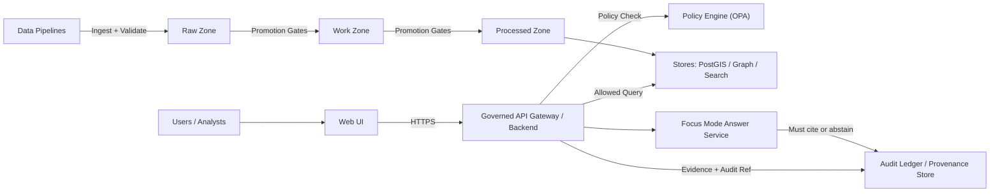
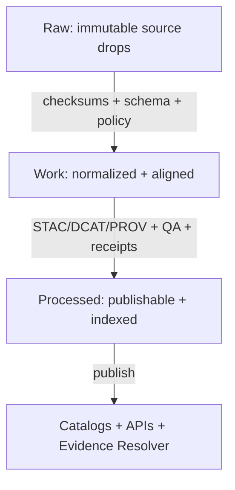

# KFM Infrastructure 🧱🔐🌾


> **Purpose:** `infra/` is the **single source of truth** for KFM’s platform configuration, GitOps state, policy-as-code, and operational runbooks.
>
> **Primary goal:** Make it impossible (by default) to violate KFM governance invariants—even accidentally.
>
> **Secondary goal:** Make “evidence-first” operational: promotion gates, receipts, catalogs, signatures, and audit references are produced and verified continuously.

---

## Table of Contents 📚

- [Non-Negotiables](#non-negotiables)
- [What Lives in infra](#what-lives-in-infra)
- [Quickstart](#quickstart)
- [Architecture Overview](#architecture-overview)
- [Governed Infra Artifacts](#governed-infra-artifacts)
- [Repository and Directory Layout](#repository-and-directory-layout)
- [Environments](#environments)
- [GitOps Delivery Model](#gitops-delivery-model)
- [CI and Acceptance Harness](#ci-and-acceptance-harness)
- [Evidence Bundles and Addressing](#evidence-bundles-and-addressing)
- [Platform Foundations](#platform-foundations)
- [Security and Compliance](#security-and-compliance)
- [Observability and SLOs](#observability-and-slos)
- [Backups and Disaster Recovery](#backups-and-disaster-recovery)
- [Emergency Controls](#emergency-controls)
- [Operations Runbooks](#operations-runbooks)
- [Change Management](#change-management)
- [Glossary](#glossary)
- [References](#references)

---

## Non-Negotiables ✅

> [!IMPORTANT]
> **Trust membrane:** UI and external clients never access databases directly. All access is through the governed API + policy boundary.

> [!IMPORTANT]
> **Fail-closed policies:** Every request (data, Story Nodes, Focus Mode) is evaluated by policy. **Deny-by-default** unless explicitly allowed.

> [!IMPORTANT]
> **Dataset promotion gates:** Promotion is **Raw → Work → Processed**, and requires **checksums** plus **STAC/DCAT/PROV** catalogs and link-check validation.

> [!IMPORTANT]
> **Evidence-first UX:** Focus Mode must **cite or abstain** and every response must produce an **audit reference**.

> [!IMPORTANT]
> **Deterministic identity:** Any “build spec” / ingest spec / receipt is **hashable deterministically**. KFM uses `spec_hash` computed as **sha256(JCS(spec))** over a schema-defined object, with explicit `spec_schema_id` and `spec_recipe_version`. *(Implementation must use RFC 8785 JSON canonicalization when hashing JSON.)*

> [!IMPORTANT]
> **Canonical addressing:** “Where is the data?” must be deterministic. Evidence is addressed by **content digest** (OCI digest for evidence bundles), with stable gateway URLs derived from the digest; raw storage URLs remain an implementation detail.

> [!WARNING]
> Any change that could weaken these invariants **must** be flagged for governance review (see [Change Management](#change-management)).

---

## What Lives in infra 🧰

This folder covers **everything** needed to operate KFM safely in dev/stage/prod:

- 🧱 **Cluster bootstrap** (namespaces, base operators, ingress, storage class defaults)
- 🧭 **GitOps** (Argo CD / OpenShift GitOps Applications + ApplicationSets)
- 🔐 **Security** (RBAC, network policies, admission policies, image policy, secrets patterns)
- 🧾 **Policy-as-code** (OPA/Gatekeeper/Kyverno + Conftest CI gates)
- 📦 **Deployments** (KFM API, UI, pipelines, catalogs, search, graph, etc.)
- 🧪 **Acceptance harness** (catalog validators + policy regression + signature/receipt verification)
- 🧾 **Contracts & schemas** (promotion contract, run manifest schema, policy pack interfaces)
- 📈 **Observability** (metrics/logging/tracing, dashboards, alerts, SLOs)
- 🧯 **Backups/DR** (object store backups, DB backups, restore procedures)
- 🧪 **Infra CI** (linting, drift checks, policy regression suite)
- 📓 **Runbooks** (incident response, common failures, upgrades, emergency deny switch)

---

## Quickstart 🚀

> [!NOTE]
> This repo is designed so **humans propose**, **CI validates**, and **GitOps reconciles**.

### 1) Prereqs

- `git`
- `kubectl` and/or `oc`
- `kustomize` (or `kubectl -k`)
- `helm` (if used)
- `conftest` (OPA-based policy tests)
- `cosign` (signature and attestation verification) *(if enabled by policy)*
- Validation tools (examples): `kubeconform`, JSON schema validator(s) for STAC/DCAT/PROV
- Access to:
  - a cluster (dev/stage/prod), or a local sandbox (Kind / OpenShift Local / CRC)

### 2) Day-1 Bootstrap (High-Level)

1. Install cluster prerequisites (ingress, storage, cert-manager, etc.)
2. Install GitOps controller (OpenShift GitOps / Argo CD)
3. Apply `infra/bootstrap/...` (cluster baseline)
4. Apply `infra/gitops/...` (AppProjects, ApplicationSets, repo credentials)
5. GitOps begins reconciling `infra/apps/...` + `infra/platform/...`

### 3) Validate Locally Before PR

```bash
# Examples — adapt to your repo’s tooling
conftest test infra/ -p infra/policy/conftest/
kustomize build infra/clusters/dev | kubeconform -strict
make -C infra/ci verify   # recommended thin wrapper around all checks
```

---

## Architecture Overview 🗺️

### The Trust Membrane Must Hold



### Data Truth Path



---

## Governed Infra Artifacts 🧾

> [!IMPORTANT]
> In KFM, **infrastructure is governed content** when it influences policy, data promotion, story publishing, or Focus Mode behavior.

### Artifact Types We Treat as Governed

| Artifact | Where | Validated by | Why |
|---|---|---|---|
| **Policy packs** (OPA/Rego, Gatekeeper/Kyverno) | `infra/policy/` | Conftest + admission tests | Fail-closed enforcement |
| **Schemas** (run manifests, watcher registry, etc.) | `infra/contracts/` | JSON schema tests | Deterministic receipts + interoperability |
| **Promotion contract** | `infra/contracts/standards/` | acceptance harness | Prevent “publish without evidence” |
| **Catalog validators** (STAC/DCAT/PROV) | `infra/ci/acceptance-harness/` | CI + golden fixtures | Promotion gates + link-checks |
| **Runbooks** (incl. emergency deny switch) | `infra/runbooks/` | doc lint + table-top drills | Operability under pressure |

---

## Repository and Directory Layout 🗂️

> [!TIP]
> If the repo already has a different `infra/` structure, **map these sections to the current reality**.
> The goal is completeness + discoverability, not churn.

### Canonical Layout Recommended

```text
infra/
├── README.md                              # You are here (infra control-plane docs)
│
├── bootstrap/                             # Cluster bootstrap (minimal baseline)
│   ├── base/
│   └── overlays/                          # per-cluster overlays (dev/stage/prod)
│
├── clusters/                              # GitOps entrypoints (desired state roots)
│   ├── dev/
│   ├── stage/
│   └── prod/
│
├── gitops/                                # OpenShift GitOps / Argo CD config
│   ├── projects/                          # AppProjects (tenancy boundaries)
│   ├── applicationsets/                   # AppSets for platform + apps
│   └── argocd/                            # (optional) self-managed Argo CD config
│
├── platform/                              # Shared platform controls
│   ├── namespaces/
│   ├── rbac/
│   ├── network/
│   ├── storage/
│   ├── ingress/
│   ├── observability/
│   └── policy/                            # Admission policies (Gatekeeper/Kyverno)
│
├── apps/                                  # KFM workloads (declarative)
│   ├── kfm-api/
│   ├── kfm-ui/
│   ├── kfm-pipelines/
│   ├── kfm-catalog/
│   └── dependencies/                      # Postgres, Neo4j, object store, search, etc.
│
├── contracts/                             # Governed contracts used by CI + runtimes
│   ├── schemas/                           # run_manifest, watcher registry, etc.
│   └── standards/                         # promotion contract, minimum catalog versions, etc.
│
├── policy/                                # CI policy tests + rego (fail-closed checks)
│   ├── packs/                             # provenance_guard, materiality_rules, etc.
│   ├── conftest/
│   ├── rego/
│   └── fixtures/
│
├── ci/                                    # CI glue that must be reproducible locally
│   ├── acceptance-harness/                # catalog + policy + signature verification
│   ├── tools.lock/                        # pinned tool versions (recommended)
│   └── Makefile                           # `make verify` entrypoint (recommended)
│
├── secrets/                               # Secret patterns (NEVER plaintext secrets)
│   ├── sealed-secrets/
│   ├── sops/
│   └── external-secrets/
│
└── runbooks/
    ├── oncall/
    ├── incident-response/
    ├── backups/
    └── upgrades/
```

### Directory Responsibilities

| Path | Owner | Purpose | Done When |
|---|---|---|---|
| `infra/bootstrap/` | Platform | Minimal cluster baseline | Cluster ready for GitOps |
| `infra/gitops/` | Platform | Reconciliation config | Apps reconcile automatically |
| `infra/platform/` | Platform + Security | Shared controls | Policy + RBAC + networking enforced |
| `infra/apps/` | App teams | Workloads + dependencies | Apps deploy via GitOps only |
| `infra/contracts/` | Platform + Data Gov | Schemas + standards | CI validates receipts/catalogs |
| `infra/policy/` | Security + Platform | Fail-closed rules | PRs fail if invariants break |
| `infra/ci/` | Platform + Security | Acceptance harness | Reproducible verification locally + in CI |
| `infra/runbooks/` | On-call | How to operate + recover | New on-call can follow it |

---

## Environments 🌎

> [!NOTE]
> Prefer **directories/overlays**, not long-lived branches.

| Environment | Purpose | Allowed Data | Risk Posture |
|---|---|---|---|
| `dev` | fast iteration | synthetic / limited | looser SLOs, strict policy still |
| `stage` | pre-prod validation | scrubbed subset | production-like gating |
| `prod` | real users | governed + audited | highest restrictions + approvals |

---

## GitOps Delivery Model 🔁

GitOps is the **delivery and drift-correction** mechanism: desired state lives in Git; controllers reconcile continuously.

### Core Rules

- ✅ All infra changes happen via PR
- ✅ CI runs policy + validation gates
- ✅ Merge triggers reconciliation
- ❌ No “click-ops” in prod (except break-glass; see runbooks)

### Promotion Pattern

- `apps/.../overlays/dev`
- `apps/.../overlays/stage`
- `apps/.../overlays/prod`

Promotion is a **PR-based** change (version bump, values update, image tag/digest update), not a manual redeploy.

---

## CI and Acceptance Harness 🧪

> [!IMPORTANT]
> Governance is enforced by **validators + CI gates**. Human review is **trigger-based** (sensitivity, policy changes, high-risk infra changes).

### Minimum CI Gates

- ✅ Render manifests (Kustomize/Helm) and validate schema (`kubeconform`)
- ✅ Conftest policy tests (default deny, trust membrane rules)
- ✅ Admission policy tests (Gatekeeper/Kyverno)
- ✅ Validate STAC/DCAT/PROV artifacts for changed datasets and link-check cross-refs
- ✅ Verify run manifests / receipts exist for promotions (when applicable)
- ✅ Verify signatures / attestations for promoted artifacts (when enabled)
- ✅ Regression suite: “golden queries” that must never leak sensitive fields

### “Acceptance Harness” Concept

`infra/ci/acceptance-harness/` is the standard, pinned toolchain invoked by:
- CI pipelines
- `make verify`
- release/promotion workflows

Recommended: pin tool versions in `infra/ci/tools.lock/` to prevent silent breakage from default behavior changes.

---

## Evidence Bundles and Addressing 📦

> [!IMPORTANT]
> KFM must be able to answer: **“What evidence produced this?”** and **“Where do I fetch it?”** deterministically.

### Canonical Address Scheme

1. **Evidence bundle digest** (OCI digest, immutable)
2. **Stable gateway URL derived from digest**
3. **Storage location** (implementation detail)

### Evidence Resolver Expectations

- Every citation reference should be resolvable via an evidence resolver endpoint (e.g., `prov://`, `stac://`, `dcat://`, `doc://`, `graph://`).
- Add a bundle resolver endpoint (example): `/bundles/{digest}`

> [!TIP]
> Treat evidence bundles like “release artifacts”:
> - immutable
> - digest pinned
> - verified
> - discoverable via referrers/attachments (where supported)

---

## Platform Foundations 🏗️

### Networking and Ingress Egress 🌐

- Ingress is via platform-managed routes/ingress controllers
- Egress is **deny-by-default** where feasible
- Sensitive services (databases, catalogs) are **not exposed** externally

**Trust-membrane enforcement examples:**
- Network policies deny UI → DB
- Only governed API namespaces may talk to DB namespaces
- Pipeline workers have scoped DB rights (write to staging, not directly to prod DB)

### Identity and Access 🪪

- Centralized auth (OIDC/SAML) (implementation-specific)
- RBAC is least-privilege
- Break-glass access is time-limited and audited (see runbooks)

### Storage 💾

Separate:
- transactional (DB)
- object storage (raw/work/processed artifacts + catalogs + audit checkpoints)
- search/graph indexes

> [!WARNING]
> Storage choices can become irreversible. Any storage class change needs a rollback/restore plan.

---

## Security and Compliance 🛡️

### Secrets No Plaintext 🔑

Choose **one** primary approach (document it here):

- **External Secrets** (preferred when you have a real secret manager)
- **SOPS** (encrypted files in Git, decrypted in-cluster)
- **Sealed Secrets** (encrypted secrets committed to Git)

✅ Requirements:
- No secrets in plaintext YAML
- Rotation plan
- Audit trail

### Policy-as-Code Admission and Runtime 📜

Two layers:

1) **CI policy gates** (fail PR if violating invariants)  
2) **Runtime admission policy** (deny unsafe manifests)
   - Pod Security / restricted defaults
   - Block hostPath, privileged, wildcard RBAC, etc.
   - Enforce network policy presence for sensitive namespaces

> [!IMPORTANT]
> Policies are not optional. If policy blocks a deployment, fix the workload—not the policy.

### Supply Chain and Provenance Verification 📦

Adopt incrementally, but design “hooks” now:

- SBOM generation
- Vulnerability scanning
- Image signing and verification
- Provenance attestations
- Tool version pinning for verifiers (avoid “silent failure”)

---

## Observability and SLOs 📈

### What We Measure

| Signal | Minimum | Why |
|---|---|---|
| Logs | centralized + searchable | incidents + audits |
| Metrics | platform + app | SLOs + capacity |
| Traces | key APIs | latency + root-cause |
| Audit Logs | cluster + API | governance accountability |
| Evidence resolution failures | tracked | “cite” must be resolvable |

### Minimum SLO Set Template

| Service | SLI | Target | Window |
|---|---|---:|---|
| API Gateway | availability | 99.9% | 30d |
| Focus Mode | cite-or-abstain compliance | 100% | per response |
| Catalog | query success | 99.5% | 30d |
| Pipelines | on-time runs | 95% | 30d |
| Evidence resolver | citation resolvability | ≥99% | 30d |

---

## Backups and Disaster Recovery 🧯

> [!IMPORTANT]
> If it isn’t restorable, it isn’t backed up.

### Backups Must Cover

- Object storage (Raw/Work/Processed artifacts + catalogs)
- Databases (PostGIS, graph DB, search snapshots)
- GitOps state (Git is part of DR)
- Secrets (via secret manager / sealed strategy)
- Audit ledger / provenance store (including checkpoints)

### DR Checklist Template

- [ ] Restore to empty cluster from GitOps
- [ ] Restore object storage (with versioning/immutability as configured)
- [ ] Restore DB snapshots
- [ ] Validate policy gates still enforce invariants
- [ ] Validate Focus Mode cite-or-abstain behavior
- [ ] Validate audit references and evidence bundle hashes still resolve

---

## Emergency Controls 🧯🛑

> [!IMPORTANT]
> Maintain an **emergency deny switch** that can disable public endpoints and Focus Mode **without deploying code**.

Examples of what the switch may control (implementation-specific):
- Disable `/api/v1/ai/query`
- Disable public dataset download endpoints
- Force “maintenance mode” on UI routes
- Increase policy strictness temporarily (deny-by-default for broader classes)

Runbook: see `infra/runbooks/incident-response/emergency-deny-switch.md` *(create if missing)*.

---

## Operations Runbooks 📓

<details>
  <summary><strong>Common Runbooks Click to Expand</strong></summary>

- 🔥 Incident response (SEV triage, comms, rollback)
- 🔁 GitOps stuck / drift remediation
- 🔐 Secret rotation
- 🧱 Cluster upgrade process
- 💾 Storage expansion/migration
- 🗃️ DB restore + point-in-time recovery
- 🧪 Pipeline backfill & reprocessing
- 🧾 Audit log queries for governance review
- 🛑 Emergency deny switch for AI and public endpoints

</details>

---

## Change Management 🔀

### When You Need Governance Review 🧑‍⚖️

- Any change that could enable UI → DB access
- Any reduction in policy enforcement (CI or runtime)
- Any new dataset class or sensitivity handling changes
- Any change affecting cite-or-abstain behavior / audit refs
- Any new external egress route from restricted namespaces
- Any change to promotion contract / run manifest schema / signature verification

### PR Definition of Done ✅

- [ ] Policy tests pass (CI)
- [ ] Kustomize/Helm renders valid YAML
- [ ] No plaintext secrets
- [ ] Network policies present for sensitive namespaces
- [ ] Rollback plan included (or explicit “not needed”)
- [ ] Runbook updated if operational behavior changed
- [ ] If promotion-related: receipts/manifests + catalogs + signatures verified in CI

---

## Glossary 🧠

| Term | Meaning |
|---|---|
| Trust Membrane | Boundary enforcing that clients never talk to DBs directly |
| Fail-Closed | Default deny unless explicitly allowed |
| Promotion Gate | Required checks before moving data between zones |
| STAC DCAT PROV | Machine-readable catalogs + provenance metadata |
| Run Manifest / Receipt | Canonical machine-readable record describing a run (inputs, outputs, hashes, toolchain) |
| spec_hash | Deterministic hash of a schema-defined spec (sha256 over canonical JSON form) |
| Evidence Bundle | Immutable, digest-addressed package of evidence + metadata + receipts |

---

## References 🔗

- KFM Next-Gen Blueprint & Primary Guide (invariants, truth path, audit/evidence requirements)
- KFM Comprehensive Data Source Integration Blueprint (promotion gates, sensitivity handling, CI regression)
- KFM Integration Report for Feb-2026 “New Ideas” (spec_hash, canonical addressing, watcher and supply-chain gaps)
- GitOps references (OpenShift GitOps / Argo CD repository structures and ApplicationSets)
- Standards: RFC 8785 (JSON Canonicalization), STAC, DCAT, PROV

> [!TIP]
> Treat documentation changes that affect system behavior as production changes.
