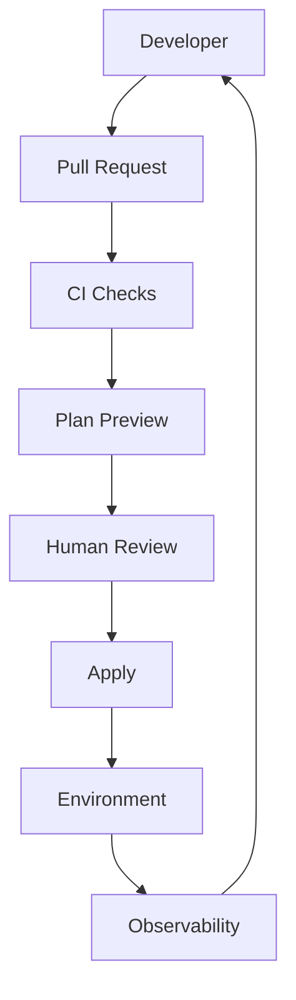
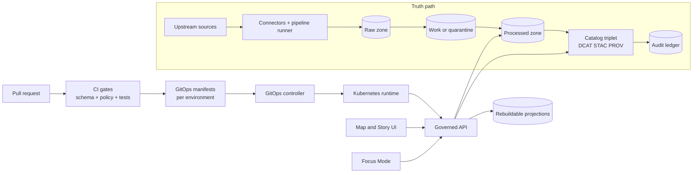

<!-- [KFM_META_BLOCK_V2]
doc_id: kfm://doc/5d0d8d5a-6b3a-4a6e-bde4-7b8d7b8f9d0a
title: infra/README
type: standard
version: v1
status: draft
owners: platform-infra
created: 2026-02-25
updated: 2026-02-25
policy_label: restricted
related:
  - ../README.md
  - ../docs/
tags: [kfm, infra, iac, ops]
notes:
  - Template README. Replace TODOs with repo-specific details.
  - Do not commit secrets. Prefer references to secret managers.
[/KFM_META_BLOCK_V2] -->

# infra/
> Infrastructure-as-Code (IaC), deployment assets, and operational controls for this repo’s environments.

 <!-- TODO: set to review/published -->
 <!-- TODO: confirm label -->


**Owners:** `platform-infra` (TODO: update)  
**Support:** open an issue with label `area/infra` (TODO: confirm labels)  

---

## Quick navigation
- [Purpose](#purpose)
- [Where this fits in the repo](#where-this-fits-in-the-repo)
- [What belongs here](#what-belongs-here)
- [What does not belong here](#what-does-not-belong-here)
- [Architecture overview](#architecture-overview)
- [Environments and promotion](#environments-and-promotion)
- [Change workflow and gates](#change-workflow-and-gates)
- [Security and secrets](#security-and-secrets)
- [Observability](#observability)
- [Directory layout](#directory-layout)
- [Runbooks](#runbooks)

---

## Purpose

This directory exists to store **buildable, reviewable, reversible** infrastructure and deployment artifacts that support the system.

Design goals:
- **Reproducible**: infra changes are codified (no “click-ops” as the source of truth).
- **Governed**: changes go through review and policy gates.
- **Auditable**: changes can be traced to commits, PRs, and environment promotions.
- **Safe by default**: no secrets committed; least privilege; controlled rollout.

> NOTE: This README is a **template**. Replace TODOs with the actual toolchain used in this repository (Terraform/Pulumi, Helm/Kustomize, Argo/Flux, etc.).

[Back to top](#infra)

---

## Where this fits in the repo

This directory is part of the project’s “trust membrane”:
- Application and data layers should **not** reach directly into cloud accounts/clusters.
- All provisioning and platform-level changes must cross a **policy boundary** (PR review + checks).
- Any environment promotion should be **explicit**, **recorded**, and **reversible**.

Typical relationships (update to match reality):
- `infra/` provisions or configures runtime substrates (clusters, networks, storage, identity).
- `services/` (or similar) contains deployable workloads that reference infra outputs.
- `docs/` contains architecture decisions, runbooks, and operational policies.

[Back to top](#infra)

---

## What belongs here

**Acceptable inputs (examples):**
- IaC modules/stacks (e.g., Terraform modules, Pulumi stacks) for:
  - network, IAM/RBAC, compute, storage, secrets plumbing (not secrets themselves)
  - managed services provisioning (databases, queues, object stores)
- Kubernetes manifests / Helm charts / Kustomize overlays (if applicable)
- GitOps configuration (if applicable)
- Platform-level policy and guardrails:
  - admission policies (OPA/Gatekeeper, Kyverno, etc.)
  - baseline security configs
- Environment configuration (dev/stage/prod) that is safe to commit:
  - non-secret config
  - references/IDs to secret managers
- Scripts that are **deterministic** and **documented**:
  - `./scripts/plan.sh`, `./scripts/apply.sh`, `./scripts/drift.sh` (examples)

**Outputs produced by this directory (examples):**
- “Plan” artifacts (CI output)
- “Apply” audit records (who/what/when/why)
- Rendered manifests (if using templating), as CI artifacts (not committed)

[Back to top](#infra)

---

## What does not belong here

**Exclusions (fail closed):**
- ❌ Plaintext secrets, tokens, kubeconfigs, `.env` files with credentials
- ❌ Private keys / certificates / database dumps
- ❌ One-off, undocumented “fix scripts”
- ❌ Screenshots of cloud consoles as the only “documentation of record”
- ❌ Large binaries or vendor blobs (unless explicitly governed and necessary)

If you need to store sensitive material, store **only references** (ARNs, secret paths, IDs), not the secret values.

[Back to top](#infra)

---

## Architecture overview



Key principle: **No direct production mutation** without passing through PR + gates.

[Back to top](#infra)

---

## Environments and promotion

> TODO: Replace with the actual environments and rules.

| Environment | Purpose | Promotion in | Promotion out | Notes |
|---|---|---|---|---|
| `dev` | fast iteration | PR merge to `main` (or `dev`) | manual promote to `stage` | allow feature flags |
| `stage` | release rehearsal | signed tag / release branch | manual promote to `prod` | mirrors prod where possible |
| `prod` | user-facing | controlled change window | n/a | rollback required |

**Minimum promotion artifacts (recommended):**
- Plan output (linked to commit SHA)
- Policy checks result
- Drift status (optional but recommended)
- Apply receipt (timestamp, actor, tool versions)

[Back to top](#infra)

---

## Change workflow and gates

> IMPORTANT: If any step is missing, treat it as **not approved**.

### Standard workflow
1. Create branch
2. Make infra change
3. Run local checks (fmt/validate)
4. Open PR
5. CI produces a plan/diff artifact
6. Human review approves
7. Apply via CI runner or controlled operator workflow
8. Verify + record outcome

### Recommended gates (CI-enforced)
- [ ] Formatting (`fmt`)
- [ ] Static validation (`validate`)
- [ ] “Plan” must succeed and be attached to PR
- [ ] Secrets scan (block known credential patterns)
- [ ] Policy-as-code checks (org guardrails)
- [ ] Drift detection (scheduled; alerts on drift)
- [ ] Change log / release note entry (for `stage`/`prod`)

[Back to top](#infra)

---

## Security and secrets

### Secrets handling rules
- **Never commit secrets.**
- Store secrets in a secret manager (cloud secret manager, Vault, etc.).
- Commit only:
  - secret *names*
  - secret *paths*
  - secret *version references* (if appropriate)

### Identity and access
- Prefer least privilege and scoped roles per environment.
- Separate “plan” permissions from “apply” permissions.
- Use short-lived credentials for CI where possible.

### Container and cluster hygiene (if applicable)
- Scan images pre-deploy
- Constrain workloads (security contexts, restricted capabilities)
- Enable audit logs and review them

> TODO: Document where to find:
> - security policies
> - RBAC manifests
> - audit log destinations
> - incident response contacts

[Back to top](#infra)

---

## Observability

At minimum, infra changes should be observable at three levels:
- **Change visibility**: what changed (diff), where, and by whom
- **Runtime health**: did the change degrade SLOs (latency/errors), did pods/services churn
- **Security signals**: auth failures, policy denials, unusual network flows

> TODO: Link dashboards and alerts:
> - `docs/runbooks/observability.md`
> - `docs/runbooks/alerts.md`

[Back to top](#infra)

---

## Directory layout

> This section is intentionally written as a **pattern**. Update it to match actual folders present in `infra/`.

```text
infra/
  README.md
  env/                 # per-environment configuration (no secrets)
    dev/
    stage/
    prod/
  iac/                 # infra-as-code root (terraform/pulumi/etc.)
    modules/
    stacks/
  k8s/                 # kubernetes manifests or rendered outputs
    base/
    overlays/
  policies/            # policy-as-code guardrails (admission, scanning config)
  scripts/             # deterministic helper scripts used by CI + operators
  docs/                # infra-specific ADRs + runbooks (optional)
```

**If your structure differs**, keep this README updated—this is the “front door” to infra.

[Back to top](#infra)

---

## Runbooks

> TODO: Create these files (or update links to where they already live).

- `infra/docs/runbooks/apply.md` — how to apply changes safely
- `infra/docs/runbooks/rollback.md` — rollback / restore procedure
- `infra/docs/runbooks/drift.md` — drift detection + remediation
- `infra/docs/runbooks/incident.md` — infra incident escalation

[Back to top](#infra)# Infrastructure (infra/)

Infrastructure-as-code, GitOps environment manifests, and operational runbooks for **KFM’s governed perimeter** (deploy → observe → recover) while enforcing the **trust membrane** and **fail-closed promotion**.

**Status:** Draft (vNext)  
**Owners:** Platform Engineering + Governance (fill in)  
**Last updated:** 2026-02-22


---

## Navigation

- [Scope](#scope)
- [Non-negotiable invariants](#non-negotiable-invariants)
- [System view](#system-view)
- [Repository layout](#repository-layout)
- [Environments](#environments)
- [GitOps workflow](#gitops-workflow)
- [Storage and truth path zones](#storage-and-truth-path-zones)
- [Policy and promotion gates](#policy-and-promotion-gates)
- [Observability](#observability)
- [Disaster recovery](#disaster-recovery)
- [How to change infra](#how-to-change-infra)
- [Definition of Done](#definition-of-done)
- [Appendix: Terms](#appendix-terms)

---

## Scope

This folder is the **operational perimeter** for running KFM in a way that keeps the system:

- **Map-first** (low-latency tile + query paths, cached safely)
- **Time-aware** (freshness and versioning are visible + measurable)
- **Governed** (policy is enforced consistently)
- **Evidence-first** (every user-facing surface can resolve citations)

**What belongs in `infra/`**
- GitOps manifests and environment overlays
- Infrastructure modules (cluster add-ons, ingress, DNS, certs, storage classes, network policies)
- Observability (metrics/logs/traces) wiring and dashboards-as-code
- Backup/restore configuration and disaster-recovery playbooks
- Runbooks and “break-glass” procedures (access-controlled)

**What does *not* belong in `infra/`**
- Secrets committed to git (ever)
- Raw datasets, processed artifacts, or catalog payloads
- Ad-hoc “kubectl apply” changes to production without a PR trail

> **WARNING:** If you can “fix it in prod” without a pull request, the system is not operating as governed infrastructure.

---

## Non-negotiable invariants

These are not “best practices”; they are **system invariants**. Infra changes must preserve them.

### Trust membrane

- Frontend/external clients **never** read from databases or object storage directly.
- Backend domain logic **never** bypasses repository interfaces to reach storage.
- All access flows through governed APIs that apply policy, redaction/generalization, and logging consistently.

### Promotion is fail-closed

- A dataset version only becomes visible through runtime surfaces **after** promotion gates pass.
- If a gate cannot be evaluated (missing artifact, missing license, missing policy label), the correct behavior is **deny/block**.

### Canonical vs rebuildable stores

- **Canonical**: object storage + catalogs + audit ledger
- **Rebuildable projections**: PostGIS projections, search index, graph edges, tile bundles/caches

This keeps migrations and re-indexing safe: projections can be rederived from canonical artifacts.

---

## System view



---

## Repository layout

> **NOTE:** The exact repo structure may differ. The goal is to keep infra artifacts discoverable and PR-reviewable.

**Recommended baseline (adjust to repo reality):**
```text
infra/
  gitops/                 # environment manifests (base + overlays)
    base/
    env/
      dev/
      stage/
      prod/
  modules/                # IaC modules (terraform/pulumi/helm charts/etc)
  addons/                 # cluster add-ons (ingress, cert-manager, observability, policy)
  runbooks/               # operational procedures (incident + DR + access)
  scripts/                # helper scripts (lint/validate/bootstrap)
  docs/                   # infra-specific docs (architecture, ADR links, diagrams)
```

If your repository already uses `ops/` rather than `infra/`, keep **one source of truth** and link the other to it (avoid duplicate “two realities”).

---

## Environments

A typical posture is:

- **dev**: fastest iteration, safest defaults still enforced
- **stage**: release candidate, production-like policies and sizing
- **prod**: strict change control, least privilege, highest auditability

Environment separation should include (at minimum):
- distinct namespaces/projects
- distinct credentials
- distinct object storage buckets/prefixes (or separate accounts)
- separate external endpoints and TLS material
- policy bundles/version pins aligned to each environment

---

## GitOps workflow

**Principle:** all running state is the result of **declared state in git**, applied by a controller.

### Change flow

1. Make infra change in `infra/` as a PR.
2. CI runs:
   - formatting + lint
   - policy tests
   - environment manifest validation
3. Merge triggers GitOps reconciliation into the target environment.
4. Observe rollout + confirm policy/metrics remain healthy.

### Rollback

Rollback should be “git revert” + GitOps reconciliation, not manual drift.

> **TIP:** Prefer “rollback-first” mindset: if you can’t roll it back quickly, it isn’t safe to ship.

---

## Storage and truth path zones

Infra must support KFM’s truth path lifecycle by making **zones explicit** and enforcing controls accordingly.

### Zones

| Zone | Purpose | Infra posture |
|---|---|---|
| raw | immutable acquisition artifacts + checksums | append-only, strict access |
| work | intermediate transforms | restricted, short-lived |
| quarantine | suspected failures / redaction candidates | restricted, review workflow |
| processed | publishable artifacts by version | immutable by digest, policy-labeled |
| catalog | DCAT/STAC/PROV + run receipts | schema-valid, cross-linked |
| audit | append-only ledger | access-controlled, retained |

### Storage rules to encode in infra

- encryption at rest + in transit
- lifecycle policies (especially raw/audit retention)
- least-privilege IAM by zone
- prevent “public by accident” (deny-by-default bucket policies)

> **WARNING:** Never treat tiles/caches as canonical. They are rebuildable projections.

---

## Policy and promotion gates

Promotion gates are how governance becomes enforceable behavior. Infra supports this by ensuring policy tooling is available in CI and runtime, and by making “unsafe promotion” operationally difficult.

### PR-based catalog/promotion loop (target behavior)

- Dataset discovery should create a **draft PR** containing deterministic catalog changes.
- Merges are blocked until:
  - schema validation passes
  - policy gates pass
  - provenance/attestation checks pass where required

### CI/CD gates (minimum expectation)

When promoting anything that affects runtime surfaces, CI should be able to answer:
- **What changed?**
- **Why did it change?**
- **Is it allowed to ship?**

At minimum, expect gates like:
- catalog schema validation (DCAT/STAC/PROV)
- link checking (citations must resolve)
- policy tests (default deny + fixtures)
- spec-hash drift detection
- evidence resolver contract tests

> **NOTE:** If Focus Mode or evidence resolution can’t verify citations, the safe behavior is to abstain/deny.

---

## Observability

Operational reliability is part of trust: users must know when layers are stale or failing.

Minimum signals to wire up:
- pipeline run success/latency and per-dataset freshness
- evidence resolver latency/failure rates
- API latency/error rates (including allow/deny decision classes)
- structured logs with correlation IDs (`run_id`, `audit_ref`, `dataset_version_id`)
- traces for evidence resolution + Focus Mode paths

---

## Disaster recovery

DR should follow the canonical vs rebuildable distinction:

1. Restore **canonical** stores first (object storage + catalogs + audit ledger).
2. Replay rebuild pipelines to reconstruct projections (PostGIS/search/graph/tiles).

Document and rehearse:
- RPO/RTO targets per environment
- restore order and verification steps
- access controls during incident response

---

## How to change infra

### Before you open a PR

- Confirm whether the change touches:
  - trust membrane surfaces (ingress/API routing, direct storage access)
  - promotion gates / policy bundles
  - audit/observability wiring
  - data zone controls
- If yes, include:
  - risk analysis (what could break, how to roll back)
  - verification plan (what you’ll check post-merge)

### PR checklist (infra)

- [ ] No secrets committed
- [ ] Least privilege preserved
- [ ] Default-deny posture preserved
- [ ] Rollback path documented
- [ ] Observability impact assessed
- [ ] Runbook updated if operational behavior changes

---

## Definition of Done

An infra change is “done” when:

- It is fully expressed in git (GitOps-ready).
- It does not violate invariants (trust membrane, fail-closed promotion, canonical vs rebuildable).
- CI validation exists (or is extended) to prevent regressions.
- Operational verification steps are documented (and repeatable).
- If it changes runtime policy behavior, the policy pack is versioned and tested.

---

## Appendix: Terms

- **Trust membrane:** the boundary that prevents bypassing governed APIs.
- **Promotion Contract:** fail-closed gate set that controls what becomes runtime-visible.
- **EvidenceRef / EvidenceBundle:** stable references and resolved bundles used for evidence-first UX.
- **Zones:** raw/work/quarantine/processed/catalog/audit; encoded as operational controls, not just vocabulary.

---

<sub><a href="#infrastructure-infra">Back to top</a></sub>
