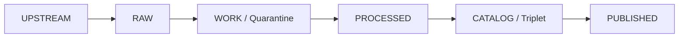
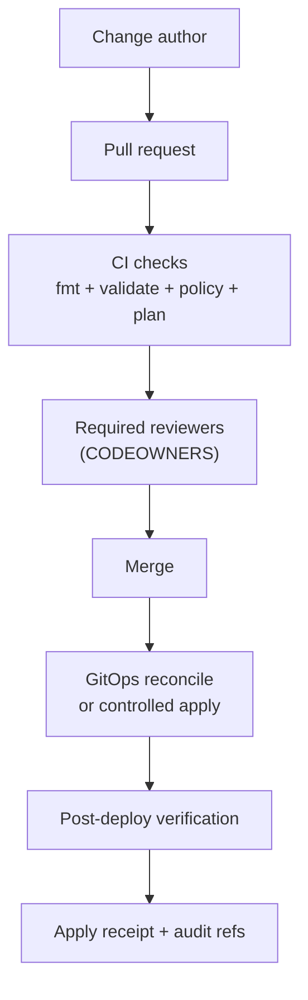

<!-- [KFM_META_BLOCK_V2]
doc_id: kfm://doc/5d0d8d5a-6b3a-4a6e-bde4-7b8d7b8f9d0a
title: infra/README
type: standard
version: v2
status: draft
owners: platform-infra
created: 2026-02-25
updated: 2026-03-01
policy_label: restricted
related:
  - ../README.md
  - ../.github/README.md
  - ../SECURITY.md
  - ../docs/
  - ../configs/
  - ../contracts/
  - ../data/
tags: [kfm, infra, iac, ops, gitops, kubernetes, terraform, security, observability, trust-membrane, truth-path, promotion-contract, audit-ledger, receipts, parity]
notes:
  - KFM-aligned infra contract: trust membrane + truth path zone controls + fail-closed promotion + auditability.
  - TODO (repo): add cross-links to `../policy/` and `../tools/` once confirmed on this branch.
  - Intentionally stack-agnostic until repo reality is confirmed (Terraform/Pulumi, Helm/Kustomize, Argo/Flux).
  - Never commit secrets. Store only references to secret managers.
[/KFM_META_BLOCK_V2] -->

<a id="top"></a>

# infra/

Infrastructure-as-Code (IaC), deployment assets, and operational controls for Kansas Frontier Matrix (KFM) environments.

**Core posture:** default-deny • fail-closed promotion • audit-by-design • least privilege  
**Owners:** `platform-infra` (source of truth: `CODEOWNERS`)  
**Policy label:** `restricted` (may include environment topology and operational details)


---

## Navigation

- [Truth status legend](#truth-status-legend)
- [Purpose](#purpose)
- [Directory contract](#directory-contract)
- [Where this fits in the repo](#where-this-fits-in-the-repo)
- [Truth path and promotion contract](#truth-path-and-promotion-contract)
- [Infra responsibilities for KFM invariants](#infra-responsibilities-for-kfm-invariants)
- [First follow-up checklist](#first-follow-up-checklist)
- [Non-negotiable invariants](#non-negotiable-invariants)
- [Environments and promotion](#environments-and-promotion)
- [Change workflow and gates](#change-workflow-and-gates)
- [Receipts and auditability](#receipts-and-auditability)
- [Storage and zone controls](#storage-and-zone-controls)
- [Policy parity and enforcement points](#policy-parity-and-enforcement-points)
- [Security and secrets](#security-and-secrets)
- [Observability](#observability)
- [Risk register](#risk-register)
- [Disaster recovery](#disaster-recovery)
- [Directory layout](#directory-layout)
- [Runbooks](#runbooks)
- [Definition of Done](#definition-of-done)

---

## Truth status legend

### Evidence tags (truth discipline)

- **CONFIRMED (design):** required KFM invariants (non-negotiable)
- **UNKNOWN (repo):** toolchain/details not verified on this branch yet
- **PROPOSED:** recommended patterns to adopt once verified

### Normative language (how to read requirements)

- **MUST** = required for KFM (non-negotiable; enforce by tests/gates)
- **SHOULD** = strongly recommended; justify deviations in the PR
- **MAY** = optional; use when it reduces risk or complexity

> [!IMPORTANT]
> If this README contradicts repo reality (paths, tools, emitted CI checks), treat the repo as the source of truth and update this README in the same PR.

[↑ Back to top](#top)

---

## Purpose

`infra/` exists to store **buildable, reviewable, reversible** infrastructure and deployment artifacts that support KFM while preserving the **trust membrane** and **fail-closed promotion**.

Design goals:

- **Reproducible:** infra derives from git + deterministic tooling (no click-ops as the source of truth)
- **Governed:** changes cross a policy boundary (PR review + required checks)
- **Auditable:** plan/apply receipts trace environment mutations to commit SHAs
- **Safe by default:** no secrets committed; least privilege; controlled rollout

> [!NOTE]
> The goal is governed operations that preserve KFM’s credibility, not “move fast and hope.”

[↑ Back to top](#top)

---

## Directory contract

### What belongs here

✅ IaC modules/stacks (Terraform/Pulumi/etc.) for:
- network, IAM/RBAC, compute, storage, identity plumbing (**no secret values**)
- managed services provisioning (DBs, queues, object stores)

✅ Kubernetes manifests / Helm charts / Kustomize overlays (if applicable)

✅ GitOps controller configuration (Argo CD/Flux/etc.), environment overlays, and reconciliation policy

✅ Platform guardrails:
- admission policies (OPA Gatekeeper/Kyverno/etc.)
- baseline security configs (Pod Security Admission posture, network policies)

✅ Observability wiring:
- dashboards-as-code, alert rules (policy-safe)

✅ Deterministic helper scripts:
- `fmt`, `validate`, `plan`, `apply`, `drift`, `smoke` (documented, no hidden mutations)

✅ Receipt *schemas/templates* (optional):
- JSON Schema for infra apply receipts (but **not** real receipts)

### What must not go here (fail closed)

- ❌ Plaintext secrets, tokens, kubeconfigs, `.env` files with real values  
- ❌ Private keys/certificates, database dumps  
- ❌ Raw/work/processed artifacts, catalogs, or *runtime* receipts (those belong under `data/` and/or canonical stores)  
- ❌ One-off “fix prod” scripts without PR trail + audit  
- ❌ Anything that creates a bypass around governed APIs (public buckets, direct DB access from clients)

> [!WARNING]
> If it would be unsafe to paste into a public issue, it should not be committed here unless strictly necessary and access-controlled—and even then, prefer references.

[↑ Back to top](#top)

---

## Where this fits in the repo

`infra/` is the **operational perimeter** around the governed system:

> [!NOTE]
> **UNKNOWN (repo):** the paths below reflect the documented target topology; confirm on this branch (see [First follow-up checklist](#first-follow-up-checklist)) and update links if different.

- Canonical data lifecycle (truth path): `UPSTREAM → RAW → WORK/Quarantine → PROCESSED → CATALOG/TRIPLET → PUBLISHED`
- Enforceable interfaces: `contracts/` (OpenAPI + JSON schemas)
- Governed configuration wiring: `configs/`
- Policy-as-code source: `policy/`
- Validators and link checkers (recommended): `tools/`
- Runtime surfaces: `apps/` (UI/CLI) and `apps/api/` (governed API / PEP)

> [!IMPORTANT]
> Infra must never become a bypass around governance:
> - no direct public access to storage zones
> - no public tile/export hosting that bypasses policy and obligations
> - no “admin tokens embedded in UI” patterns

[↑ Back to top](#top)

---

## Truth path and promotion contract

KFM’s truth path is not a metaphor — infra must make it **mechanically enforceable**.



### Zone vocabulary (recommended)

> [!NOTE]
> **PROPOSED** until confirmed in repo: treat `policy_label` and `artifact.zone` as controlled vocabularies,
> validated in CI, and used in storage/IAM rules.

- `policy_label` (starter): `public`, `public_generalized`, `restricted`, `restricted_sensitive_location`, `internal`, `embargoed`, `quarantine`
- `artifact.zone` (starter): `raw`, `work`, `processed`, `catalog`, `published`

### Promotion Contract gates (minimum, fail-closed)

Infra must enable the system to **block promotion** when any gate is missing or cannot be evaluated.

| Gate | What must be present | Infra support (what we enforce/provide) |
|---|---|---|
| **A — Identity & versioning** | dataset IDs + deterministic hashes + content digests | immutable object paths; digest capture in receipts; runtime surfaces pinned to dataset_version_id |
| **B — Licensing & rights** | license/rights metadata and terms snapshot | block “unknown license” artifacts from export surfaces; ensure attribution is deliverable at runtime |
| **C — Sensitivity & redaction plan** | policy_label + obligations/generalization recorded | default-deny routing; prevent leaks via 403/404; enforce separate `public_generalized` outputs when needed |
| **D — Catalog triplet validation** | DCAT + STAC + PROV validate and cross-link | validators in CI; catalogs accessible only via governed services; prevent direct public catalog hosting if restricted |
| **E — QA thresholds** | dataset-specific QA checks and pass/fail thresholds | compute + storage for QA reports; quarantine routing; prevent “failed QA” from reaching PUBLISHED |
| **F — Run receipt & audit record** | receipts include inputs, tooling, hashes, policy decisions | durable, access-controlled receipt store; time sync; retention rules; structured logs |
| **G — Release manifest** | promotion recorded as a manifest that references artifact digests | release manifest storage; immutability; signature/attestation hooks (optional) |

[↑ Back to top](#top)

---

## Infra responsibilities for KFM invariants

This section is an **alignment matrix**: the KFM invariants are system-level; infra’s job is to **make them mechanically hard to violate**.

| KFM invariant (CONFIRMED design) | Infra controls (what we enforce) | Evidence (what we emit) |
|---|---|---|
| Trust membrane (no direct DB/storage from clients) | network policies / security groups; private endpoints; deny public buckets; egress allowlists; UI has no store credentials | network policy manifests; IaC plan diff; “no-public” checks; runtime connectivity smoke test results |
| Fail-closed promotion | branch protection + required checks; promotion pipeline cannot “skip” gates; enforce environment pinning | CI gate summary; promotion manifest; plan/apply receipts; release artifact list |
| Canonical vs rebuildable stores | stronger protection on canonical stores; rebuildables can be recreated from receipts | infra state outputs; backup/retention config; restore verification checklist |
| Policy parity (CI == runtime semantics) | pin policy bundle versions per env; surface versions in deployment metadata; block mismatches | environment manifest includes policy bundle digest; parity check output |
| Auditability + rollback | PR trail required; apply restricted; drift detection; rollback procedures documented | apply receipt; drift report; rollback runbook link + test |

> [!NOTE]
> If any row above is **UNKNOWN (repo)** right now, treat this as a **PROPOSED** enforcement target and add the missing verification steps to the next infra PR.

[↑ Back to top](#top)

---

## First follow-up checklist

These steps convert **UNKNOWN (repo)** assumptions into repo-confirmed facts.

### Repo facts to confirm (fill in once)

- [ ] IaC tool: Terraform / Pulumi / other
- [ ] Deployment model: GitOps / CI-driven apply / both
- [ ] Kubernetes usage: yes/no; where add-ons live
- [ ] Where overlays live: `infra/k8s/overlays/*`, `infra/gitops/env/*`, or elsewhere
- [ ] Secrets manager: Secret Manager / Vault / ExternalSecrets / SealedSecrets / other
- [ ] Required checks: actual emitted check names from PR checks UI
- [ ] Environments: actual environment identifiers (`dev/stage/prod` or equivalent)
- [ ] Runbooks: `docs/runbooks/` vs `infra/**`

### Minimum verification commands (read-only)

```bash
# Capture commit + tree (attach to PR)
git rev-parse HEAD
tree -L 3

# Confirm infra subtrees
find infra -maxdepth 2 -type d -print

# Confirm workflows + CODEOWNERS routing
ls -la .github/workflows .github/CODEOWNERS 2>/dev/null || true

# Look for IaC/tools (examples)
find infra -maxdepth 3 \
  \( -name '*.tf' -o -name 'Pulumi.yaml' -o -name 'Chart.yaml' -o -name 'kustomization.yaml' \) \
  | head
```

> [!TIP]
> Once confirmed, update:
> 1) [Directory layout](#directory-layout)  
> 2) [Change workflow and gates](#change-workflow-and-gates) with real check names  
> 3) [Runbooks](#runbooks) with real paths

[↑ Back to top](#top)

---

## Non-negotiable invariants

These are **CONFIRMED (design)**. Infra changes must preserve them.

### 1) Trust membrane

- Public clients MUST NOT read from object storage, databases, or internal indexes directly.
- Static hosting MUST NOT become an exfiltration path (tiles, exports, documents).
- All reads/writes MUST flow through governed services that apply:
  - policy decisions (deny/allow + obligations)
  - redaction/generalization where required
  - audit logging and receipts

### 2) Fail-closed promotion

Promotion gates MUST block any RAW → served jump.

If a required gate cannot be evaluated (missing catalogs, unclear license, missing policy label), the correct behavior is to **block promotion** and **deny serving**.

### 3) Canonical vs rebuildable

- **Canonical:** object storage zones + catalog triplet + audit ledger
- **Rebuildable:** PostGIS/search/graph/tiles/caches

Infra MUST protect canonical stores and MUST enable projections to be rebuilt safely.

### 4) Policy parity

Policy semantics MUST match between:
- CI gates (merge-time validation)
- runtime enforcement (API, evidence resolver, exports, tile serving)

### 5) Auditability and rollback

Every production mutation MUST have:
- PR trail
- plan/diff artifact
- apply receipt (who/what/when/tool versions)
- rollback path (git revert + reconcile, or documented alternative)

[↑ Back to top](#top)

---

## Environments and promotion

> [!NOTE]
> **UNKNOWN (repo):** exact environment names and promotion rules.  
> This is a **PROPOSED** baseline until verified.

| Environment | Purpose | Change velocity | Promotion in | Promotion out |
|---|---|---:|---|---|
| `dev` | iteration + feature work | high | merge to `main` (or `dev`) | manual promote to `stage` |
| `stage` | release rehearsal | medium | release candidate/tag | manual promote to `prod` |
| `prod` | user-facing | low | controlled window + approvals | rollback only |

### Promotion artifacts (minimum expectation)

For any stage/prod promotion, capture:
- commit SHA (and tag if used)
- plan/diff artifact
- policy gate results (promotion contract)
- apply receipt (tool versions, actor principal, timestamps)
- post-deploy verification (health + key policy flows)

[↑ Back to top](#top)

---

## Change workflow and gates

### Standard workflow (PROPOSED)



### Minimum required gates (CI-enforced)

- Formatting/lint (IaC + YAML)
- Static validation (terraform validate / helm template / kustomize build)
- Secrets scan (block credential patterns)
- Policy pack tests (default-deny; fixtures for allow/deny + obligations)
- Plan/render diff attached to PR
- Drift detection (scheduled; alerts on drift) — recommended
- **Anti-skip:** required gates must not be bypassable via path filters or `if:` conditions

> [!IMPORTANT]
> Prefer a single always-runs **gate-summary** job as the required status check for branch protection.

[↑ Back to top](#top)

---

## Receipts and auditability

Infra changes are part of KFM’s evidence chain. Treat them as governed runs.

### Receipt types (PROPOSED)

| Receipt | When | What it must include (minimum) | Stored where |
|---|---|---|---|
| **Plan diff** | every PR touching infra | commit SHA; tool versions; rendered diff/plan output; target env(s) | PR artifacts (CI) + durable store (optional) |
| **Apply receipt** | every stage/prod apply | commit SHA; actor principal; timestamps; tool versions; change summary; output hash/digest | audit ledger / restricted store |
| **Drift report** | scheduled | drift summary; affected resources; timestamp; last known good commit | alert channel + restricted store |

> [!WARNING]
> If apply receipts are missing or not durable, treat it as a **release blocker** for any environment that serves users.

### Receipt schema sketch (PROPOSED)

This is a suggested shape to standardize receipts across IaC tools (Terraform/Pulumi/K8s/GitOps):

```json
{
  "kind": "kfm.infra.ApplyReceipt",
  "env": "prod",
  "repo": { "commit": "SHA", "branch": "main" },
  "actor": { "principal": "…", "method": "gitops|ci|manual" },
  "tooling": [{ "name": "terraform|pulumi|kubectl|argocd", "version": "…" }],
  "inputs": [{ "ref": "plan-artifact", "digest": "…" }],
  "outputs": [{ "ref": "resource-state-summary", "digest": "…" }],
  "timestamps": { "started": "…", "finished": "…" }
}
```

[↑ Back to top](#top)

---

## Storage and zone controls

Infra must encode truth path zones as **real controls**, not just folder names.

### Zones (conceptual)

- `raw/` — immutable acquisitions (append-only, strict access)
- `work/` — intermediates and QA (restricted; may be rewritten)
- `processed/` — publishable artifacts (immutable per version, policy-labeled)
- `catalog/` — DCAT/STAC/PROV + run receipts (validated, cross-linked)
- `published/` — governed runtime surfaces (served via PEP/API; policy enforced)
- `audit/` — append-only ledger segments (restricted)

> [!NOTE]
> The KFM docs treat **WORK and Quarantine** as the same lifecycle zone; Quarantine is where failed gates live
> until remediated.

### Controls to encode (PROPOSED)

- encryption at rest + TLS in transit
- deny-by-default bucket policies
- least-privilege IAM by zone and workload
- lifecycle retention rules (especially RAW and AUDIT)
- prevent direct public distribution bypassing governed APIs (tiles/exports)

> [!WARNING]
> Do not make tile hosting a loophole. Policy must apply to tiles/exports as strictly as to feature queries.

[↑ Back to top](#top)

---

## Policy parity and enforcement points

Infra MUST support the same policy semantics in CI and runtime (parity).

### Policy decision architecture (shared semantics)

- **PDP (Policy Decision Point):** evaluates policy and returns allow/deny + obligations
- **PEPs (Policy Enforcement Points):**
  - CI gates (schema validation + policy tests block merges)
  - Runtime API (policy checks before serving data)
  - Evidence resolver (policy checks before resolving evidence and rendering bundles)
  - UI (shows policy badges/notices; UI does not decide policy)

### Sensitivity default rules (PROPOSED)

- default deny for sensitive-location and restricted datasets
- if any public representation is allowed, produce a separate `public_generalized` dataset version
- never leak restricted metadata in 403/404 responses
- do not embed precise coordinates in Stories or Focus Mode outputs unless policy explicitly allows
- treat redaction/generalization as a first-class transform recorded in PROV

### Licensing and rights (operational guardrails)

- promotion gate requires license + rights holder for every distribution
- “metadata-only reference” mode is allowed (catalog without mirroring content if rights do not allow)
- export functions MUST include attribution and license text automatically
- story publishing SHOULD block if rights are unclear for included media

[↑ Back to top](#top)

---

## Security and secrets

### Secrets handling rules

- Never commit secrets.
- Store secret values in a secret manager.
- Store only references in git (names/paths/IDs).

### Identity and access

- least privilege per workload and environment
- separate plan permissions from apply permissions
- prefer short-lived credentials for CI runners
- define explicit break-glass procedures (documented; access-controlled)

### Cluster/runtime hygiene (if applicable)

- image provenance/scanning before deploy (or documented substitute)
- baseline pod security posture (restricted by default)
- network policies (deny by default, explicit egress)
- audit logging enabled and routed to a controlled sink

> [!NOTE]
> A default-deny network posture helps ensure new workloads cannot “accidentally work” without explicit allow rules, which supports the trust membrane.

[↑ Back to top](#top)

---

## Observability

Infra changes must be observable across:

1) **Change visibility** — what changed, where, and why (plan/diff + apply receipt)  
2) **Runtime health** — latency, errors, capacity, SLOs, pod churn, pipeline throughput  
3) **Governance signals (policy-safe)** — allow/deny counts by class, resolver success rates, export denials, promotion gate summaries

> [!NOTE]
> Observability must be policy-safe: do not log restricted coordinates, PII, or sensitive dataset identifiers into public dashboards.

[↑ Back to top](#top)

---

## Risk register

This README is not a full risk register, but infra work should explicitly track at least these risks (starter list).

| Risk | Likelihood | Impact | Minimum infra mitigation |
|---|---:|---:|---|
| Policy bypass via direct DB/storage access | Medium | High | enforce trust membrane with private endpoints + default-deny network policies + CI checks |
| Licensing violation (unlicensed media mirrored) | Medium | High | promotion gates require rights metadata; support metadata-only reference mode |
| Sensitive location leakage (archaeology/species) | Medium | High | default deny; `public_generalized` derivatives; redaction obligations tested and logged |
| Audit logs contain PII or restricted identifiers | Medium | High | classify and redact logs; restrict access; retention policies |

> [!NOTE]
> Treat the risk register as a governed artifact linked to ADRs and mitigation work items.

[↑ Back to top](#top)

---

## Disaster recovery

DR follows canonical vs rebuildable:

1. Restore canonical stores (object storage zones + catalogs + audit ledger).  
2. Rebuild projections (PostGIS/search/graph/tiles) from canonical artifacts and receipts.  
3. Verify policy parity and evidence resolution before reopening public surfaces.

Minimum DR documentation (PROPOSED):
- RPO/RTO targets per environment
- backup schedule and restore steps
- restore order + verification checklist
- incident escalation contacts

[↑ Back to top](#top)

---

## Directory layout

> [!NOTE]
> **UNKNOWN (repo):** the exact infra tree may differ.  
> The structure below is a **PROPOSED** pattern intended to keep apply paths boring, centralized, and governable.

<details>
<summary><strong>Proposed infra tree (expand)</strong></summary>

```text
infra/
├─ README.md
│
├─ k8s/                                          # K8s manifests (base + overlays) or rendered outputs
│  ├─ README.md                                  # K8s conventions: kustomize/helm usage, policy posture, verify steps
│  │
│  ├─ base/                                      # Shared, environment-agnostic primitives (default-deny by design)
│  │  ├─ kustomization.yaml                      # Base composition entrypoint
│  │  │
│  │  ├─ namespaces/                             # Namespaces (separate trust domains)
│  │  ├─ rbac/                                   # Service accounts + least-privilege roles (no cluster-admin by default)
│  │  ├─ network/                                # Trust membrane enforcement at the network layer
│  │  ├─ config/                                 # Non-secret runtime wiring (ConfigMaps; secret refs elsewhere)
│  │  ├─ platform/                               # Cluster add-ons (optional; depends on platform choices)
│  │  ├─ apps/                                   # Workloads (governed services only; UI must call governed API only)
│  │  ├─ jobs/                                   # One-shot jobs (manual or CI-triggered)
│  │  └─ observability/                          # Observability wiring (policy-safe)
│  │
│  ├─ overlays/                                  # Environment overlays (dev/stage/prod deltas only)
│  ├─ policies/                                  # Admission + baseline security policies (optional)
│  └─ scripts/                                   # Render/validate helpers (optional)
│
├─ helm/                                         # Helm charts and values (optional)
├─ terraform/                                    # Terraform (optional)
├─ gitops/                                       # GitOps controller configs + env apps (optional)
├─ dashboards/                                   # dashboards-as-code + alert rules (policy-safe)
│
└─ scripts/                                      # deterministic helpers (plan/validate/drift/smoke)
```

</details>

> [!TIP]
> Keep apply paths boring and centralized. The fewer ways there are to mutate prod, the more governable the system is.

[↑ Back to top](#top)

---

## Runbooks

Runbooks may live under `docs/runbooks/` or under `infra/` depending on repo convention.

Minimum runbooks expected (create/link as appropriate):
- Apply
- Rollback
- Drift
- Incident
- Restore/DR

> [!NOTE]
> If a runbook is operationally sensitive, keep it restricted and link to it from a public-safe index.

[↑ Back to top](#top)

---

## Definition of Done

Use this checklist for PRs that touch `infra/`.

### Safety + governance
- [ ] No secrets committed (scan passes)
- [ ] Default-deny posture preserved (no accidental public access paths)
- [ ] Trust membrane preserved (no direct storage/DB access from public clients)
- [ ] Change is reversible (rollback steps documented)

### Validation + evidence
- [ ] Formatting/lint passes
- [ ] Static validation passes
- [ ] Policy pack tests pass (fixtures cover allow/deny + obligations)
- [ ] Plan/diff artifact attached to PR (or render diff for manifests)
- [ ] Required reviewers satisfied (CODEOWNERS)
- [ ] Apply receipt/audit record produced for stage/prod changes (where applicable)
- [ ] Post-deploy verification steps documented (and run for stage/prod)

### Operability
- [ ] Observability impact assessed (dashboards/alerts updated if needed)
- [ ] Runbooks updated if operational behavior changes
- [ ] DR implications assessed if storage/identity/network changes

[↑ Back to top](#top)
