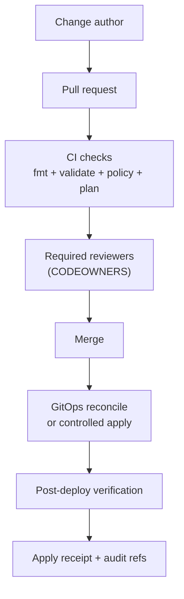

<!-- [KFM_META_BLOCK_V2]
doc_id: kfm://doc/5d0d8d5a-6b3a-4a6e-bde4-7b8d7b8f9d0a
title: infra/README
type: standard
version: v2
status: draft
owners: platform-infra
created: 2026-02-25
updated: 2026-02-27
policy_label: restricted
related:
  - ../README.md
  - ../.github/README.md
  - ../SECURITY.md
  - ../docs/
  - ../configs/
  - ../contracts/
  - ../data/
tags: [kfm, infra, iac, ops, gitops, kubernetes, terraform, security, observability, promotion-contract]
notes:
  - KFM-aligned infra contract: trust membrane + truth path zone controls + fail-closed promotion + auditability.
  - Intentionally stack-agnostic until repo reality is confirmed (Terraform/Pulumi, Helm/Kustomize, Argo/Flux).
  - Never commit secrets. Store only references to secret managers.
[/KFM_META_BLOCK_V2] -->

<a id="top"></a>

# infra/

Infrastructure-as-Code (IaC), deployment assets, and operational controls for Kansas Frontier Matrix (KFM) environments.

**Core posture:** default-deny • fail-closed promotion • audit-by-design • least privilege  
**Owners:** `platform-infra` (source of truth: `CODEOWNERS`)  
**Policy label:** `restricted` (may include environment topology and operational details)


---

## Navigation

- [Truth status legend](#truth-status-legend)
- [Purpose](#purpose)
- [Directory contract](#directory-contract)
- [Where this fits in the repo](#where-this-fits-in-the-repo)
- [First follow-up checklist](#first-follow-up-checklist)
- [Non-negotiable invariants](#non-negotiable-invariants)
- [Environments and promotion](#environments-and-promotion)
- [Change workflow and gates](#change-workflow-and-gates)
- [Storage and truth path zones](#storage-and-truth-path-zones)
- [Policy, promotion gates, and runtime parity](#policy-promotion-gates-and-runtime-parity)
- [Security and secrets](#security-and-secrets)
- [Observability](#observability)
- [Disaster recovery](#disaster-recovery)
- [Directory layout](#directory-layout)
- [Runbooks](#runbooks)
- [Definition of Done](#definition-of-done)

---

## Truth status legend

- **CONFIRMED (design):** required KFM invariants (non-negotiable)
- **UNKNOWN (repo):** toolchain/details not verified on this branch yet
- **PROPOSED:** recommended patterns to adopt once verified

> [!IMPORTANT]
> If this README contradicts repo reality (paths, tools, emitted CI checks), treat the repo as the source of truth and update this README in the same PR.

[↑ Back to top](#top)

---

## Purpose

`infra/` exists to store **buildable, reviewable, reversible** infrastructure and deployment artifacts that support KFM while preserving the **trust membrane** and **fail-closed promotion**.

Design goals:

- **Reproducible:** infra derives from git + deterministic tooling (no click-ops as the source of truth)
- **Governed:** changes cross a policy boundary (PR review + required checks)
- **Auditable:** plan/apply receipts trace environment mutations to commit SHAs
- **Safe by default:** no secrets committed; least privilege; controlled rollout

> [!NOTE]
> The goal is governed operations that preserve KFM’s credibility, not “move fast and hope.”

[↑ Back to top](#top)

---

## Directory contract

### What belongs here

✅ IaC modules/stacks (Terraform/Pulumi/etc.) for:
- network, IAM/RBAC, compute, storage, identity plumbing (**no secret values**)
- managed services provisioning (DBs, queues, object stores)

✅ Kubernetes manifests / Helm charts / Kustomize overlays (if applicable)

✅ GitOps controller configuration (Argo CD/Flux/etc.), environment overlays, and reconciliation policy

✅ Platform guardrails:
- admission policies (OPA Gatekeeper/Kyverno/etc.)
- baseline security configs (Pod Security Admission posture, network policies)

✅ Observability wiring:
- dashboards-as-code, alert rules (policy-safe)

✅ Deterministic helper scripts:
- `fmt`, `validate`, `plan`, `apply`, `drift`, `smoke` (documented, no hidden mutations)

### What must not go here (fail closed)

- ❌ Plaintext secrets, tokens, kubeconfigs, `.env` files with real values  
- ❌ Private keys/certificates, database dumps  
- ❌ Raw or processed datasets, catalogs, or receipts (those belong under `data/` / canonical stores)  
- ❌ One-off “fix prod” scripts without PR trail + audit  
- ❌ Anything that creates a bypass around governed APIs (public buckets, direct DB access from clients)

> [!WARNING]
> If it would be unsafe to paste into a public issue, it should not be committed here unless strictly necessary and access-controlled—and even then, prefer references.

[↑ Back to top](#top)

---

## Where this fits in the repo

`infra/` is the **operational perimeter** around the governed system:

- Canonical data lifecycle: `data/` (RAW → WORK/QUARANTINE → PROCESSED → CATALOG → PUBLISHED + AUDIT)
- Enforceable interfaces: `contracts/`
- Governed configuration wiring: `configs/`
- Policy-as-code source: `policy/`
- Runtime surfaces: `apps/` (UI/CLI) and `apps/api/` (governed API)

> [!IMPORTANT]
> Infra must never become a bypass around governance:
> - no direct public access to object storage zones
> - no public tile/export hosting that bypasses policy and obligations
> - no “admin tokens embedded in UI” patterns

[↑ Back to top](#top)

---

## First follow-up checklist

These steps convert **UNKNOWN (repo)** assumptions into repo-confirmed facts.

### Repo facts to confirm (fill in once)

- [ ] IaC tool: Terraform / Pulumi / other
- [ ] Deployment model: GitOps / CI-driven apply / both
- [ ] Kubernetes usage: yes/no; where add-ons live
- [ ] Where overlays live: `infra/k8s/overlays/*`, `infra/gitops/env/*`, or elsewhere
- [ ] Secrets manager: Secret Manager / Vault / ExternalSecrets / SealedSecrets / other
- [ ] Required checks: actual emitted check names from PR checks UI
- [ ] Runbooks: `docs/runbooks/` vs `infra/**`

### Minimum verification commands (read-only)

```bash
# Confirm infra subtrees
find infra -maxdepth 2 -type d -print

# Confirm workflows + CODEOWNERS routing
ls -la .github/workflows .github/CODEOWNERS 2>/dev/null || true

# Look for IaC/tools (examples)
find infra -maxdepth 3 \
  \( -name '*.tf' -o -name 'Pulumi.yaml' -o -name 'Chart.yaml' -o -name 'kustomization.yaml' \) \
  | head
```

> [!TIP]
> Once confirmed, update:
> 1) [Directory layout](#directory-layout)  
> 2) [Change workflow and gates](#change-workflow-and-gates) with real check names  
> 3) [Runbooks](#runbooks) with real paths

[↑ Back to top](#top)

---

## Non-negotiable invariants

These are **CONFIRMED (design)**. Infra changes must preserve them.

### 1) Trust membrane

- Public clients must not read from object storage, databases, or internal indexes directly.
- Static hosting must not become an exfiltration path (tiles, exports, documents).
- All reads/writes flow through governed services that apply:
  - policy decisions (deny/allow + obligations)
  - redaction/generalization where required
  - audit logging and receipts

### 2) Fail-closed promotion

Promotion gates block any RAW → served jump.

If a required gate cannot be evaluated (missing catalogs, unclear license, missing policy label), the correct behavior is to **block promotion** and **deny serving**.

### 3) Canonical vs rebuildable

- **Canonical:** object storage zones + catalog triplet + audit ledger
- **Rebuildable:** PostGIS/search/graph/tiles/caches

Infra protects canonical stores and enables projections to be rebuilt safely.

### 4) Policy parity

Policy semantics must match between:
- CI gates (merge-time validation)
- runtime enforcement (API, evidence resolver, exports, tile serving)

### 5) Auditability and rollback

Every production mutation must have:
- PR trail
- plan/diff artifact
- apply receipt (who/what/when/tool versions)
- rollback path (git revert + reconcile, or documented alternative)

[↑ Back to top](#top)

---

## Environments and promotion

> [!NOTE]
> **UNKNOWN (repo):** exact environment names and promotion rules.  
> This is a **PROPOSED** baseline until verified.

| Environment | Purpose | Change velocity | Promotion in | Promotion out |
|---|---|---:|---|---|
| `dev` | iteration + feature work | high | merge to `main` (or `dev`) | manual promote to `stage` |
| `stage` | release rehearsal | medium | release candidate/tag | manual promote to `prod` |
| `prod` | user-facing | low | controlled window + approvals | rollback only |

### Promotion artifacts (minimum expectation)

For any stage/prod promotion, capture:
- commit SHA (and tag if used)
- plan/diff artifact
- policy gate results
- apply receipt (tool versions, actor principal, timestamps)
- post-deploy verification (health + key policy flows)

[↑ Back to top](#top)

---

## Change workflow and gates

### Standard workflow (PROPOSED)



### Minimum required gates (CI-enforced)

- Formatting/lint (IaC + YAML)
- Static validation (terraform validate / helm template / kustomize build)
- Secrets scan (block credential patterns)
- Policy guardrails (admission policies, deny-by-default assertions)
- Plan/render diff attached to PR
- Drift detection (scheduled; alerts on drift) — recommended
- **Anti-skip:** required gates must not be bypassable via path filters or `if:` conditions

> [!IMPORTANT]
> Prefer a single always-runs **gate-summary** job as the required status check for branch protection.

[↑ Back to top](#top)

---

## Storage and truth path zones

Infra must encode truth path zones as **real controls**, not just folder names.

### Zones (conceptual)

- `raw/` — immutable acquisitions (append-only, strict access)
- `work/` — intermediates (restricted, often short-lived)
- `quarantine/` — failed gates (restricted + remediation required)
- `processed/` — publishable artifacts (immutable per version, policy-labeled)
- `catalog/` — DCAT/STAC/PROV + receipts (validated, cross-linked)
- `audit/` — append-only ledger segments (restricted)

### Controls to encode (PROPOSED)

- encryption at rest + TLS in transit
- deny-by-default bucket policies
- least-privilege IAM by zone and workload
- lifecycle retention rules (especially raw and audit)
- prevent direct public distribution bypassing governed APIs (tiles/exports)

> [!WARNING]
> Do not make tile hosting a loophole. Policy must apply to tiles/exports as strictly as to feature queries.

[↑ Back to top](#top)

---

## Policy, promotion gates, and runtime parity

Infra must ensure policy is enforceable and consistent (parity).

### Promotion Contract alignment (A–F)

Infra should support:
- **A Identity/versioning:** immutable artifact paths and version pins
- **B Rights:** export paths enforce license/attribution requirements
- **C Sensitivity:** deny-by-default routing; no leakage via caches/errors
- **D Catalogs:** schema validation reachable in CI; catalogs accessible to API
- **E Receipts/digests:** receipts stored reliably and access-controlled
- **F Policy/contract tests:** CI and runtime share policy bundle versions (or prove parity)

### Parity expectations (PROPOSED)

- Policy bundle versions are pinned per environment and recorded in deployment manifests and apply receipts.
- CI runs policy fixtures against pinned versions.
- Any mismatch blocks release.

[↑ Back to top](#top)

---

## Security and secrets

### Secrets handling rules

- Never commit secrets.
- Store secret values in a secret manager.
- Store only references in git (names/paths/IDs).

### Identity and access

- least privilege per workload and environment
- separate plan permissions from apply permissions
- prefer short-lived credentials for CI runners
- define explicit break-glass procedures (documented; access-controlled)

### Cluster/runtime hygiene (if applicable)

- image provenance/scanning before deploy (or documented substitute)
- baseline pod security posture (restricted by default)
- network policies (deny by default, explicit egress)
- audit logging enabled and routed to a controlled sink

[↑ Back to top](#top)

---

## Observability

Infra changes must be observable across:

1) **Change visibility** — what changed, where, and why (plan/diff + apply receipt)  
2) **Runtime health** — latency, errors, capacity, SLOs, pod churn, pipeline throughput  
3) **Governance signals (policy-safe)** — allow/deny counts by class, resolver success rates, export denials, promotion gate summaries

> [!NOTE]
> Observability must be policy-safe: do not log restricted coordinates, PII, or sensitive dataset identifiers into public dashboards.

[↑ Back to top](#top)

---

## Disaster recovery

DR follows canonical vs rebuildable:

1. Restore canonical stores (object storage zones + catalogs + audit ledger).  
2. Rebuild projections (PostGIS/search/graph/tiles) from canonical artifacts and receipts.  
3. Verify policy parity and evidence resolution before reopening public surfaces.

Minimum DR documentation (PROPOSED):
- RPO/RTO targets per environment
- backup schedule and restore steps
- restore order + verification checklist
- incident escalation contacts

[↑ Back to top](#top)

---

## Directory layout

> [!NOTE]
> **UNKNOWN (repo):** the exact infra tree may differ.  
> The block below matches the repo layout pattern you’ve been using: `k8s/`, `helm/`, `terraform/`, `gitops/`, `dashboards/`.

```text
infra/
├─ README.md
│
├─ k8s/                                          # K8s manifests (base + overlays) or rendered outputs
│  ├─ README.md                                  # K8s conventions: kustomize/helm usage, policy posture, verify steps
│  │
│  ├─ base/                                      # Shared, environment-agnostic primitives (default-deny by design)
│  │  ├─ kustomization.yaml                      # Base composition entrypoint
│  │  │
│  │  ├─ namespaces/                             # Namespaces (separate trust domains)
│  │  │  ├─ kfm-system.namespace.yaml            # Controllers/add-ons (restricted)
│  │  │  ├─ kfm-apps.namespace.yaml              # KFM runtime workloads (api/workers)
│  │  │  └─ kfm-observability.namespace.yaml     # Metrics/logs/traces tooling
│  │  │
│  │  ├─ rbac/                                   # Service accounts + least-privilege roles (no cluster-admin by default)
│  │  │  ├─ serviceaccounts/
│  │  │  │  ├─ kfm-api.sa.yaml
│  │  │  │  ├─ kfm-workers.sa.yaml
│  │  │  │  └─ kfm-ops.sa.yaml
│  │  │  ├─ roles/
│  │  │  ├─ rolebindings/
│  │  │  └─ clusterroles/                        # Only when unavoidable; document why
│  │  │
│  │  ├─ network/                                # Trust membrane enforcement at the network layer
│  │  │  ├─ networkpolicies/
│  │  │  │  ├─ default-deny.ingress.yaml         # Deny by default (ingress)
│  │  │  │  ├─ default-deny.egress.yaml          # Deny by default (egress)
│  │  │  │  ├─ allow-dns.egress.yaml             # Allow DNS egress
│  │  │  │  ├─ allow-api-to-stores.egress.yaml   # Only governed API can reach DB/object store
│  │  │  │  └─ allow-observability.egress.yaml   # Allow OTLP/metrics/log sinks as needed
│  │  │  └─ ingress/                             # Ingress primitives (no app-specific hosts here)
│  │  │     ├─ ingressclass.yaml
│  │  │     └─ tls/                              # Issuer refs only (no private keys)
│  │  │
│  │  ├─ config/                                 # Non-secret runtime wiring (ConfigMaps; secret refs elsewhere)
│  │  │  ├─ configmaps/
│  │  │  │  ├─ kfm-runtime.configmap.yaml        # Safe defaults; env overlays patch specifics
│  │  │  │  ├─ kfm-feature-flags.configmap.yaml  # Non-secret feature flags (also mirrored in configs/runtime/)
│  │  │  │  └─ kfm-otel.configmap.yaml           # OTEL endpoints + sampling (policy-safe)
│  │  │  └─ externalsecrets/                     # Secret references (ExternalSecrets/CSI/etc.) — NO secret values
│  │  │     ├─ kfm-api.externalsecret.yaml
│  │  │     └─ kfm-workers.externalsecret.yaml
│  │  │
│  │  ├─ platform/                               # Cluster add-ons (optional; depends on your platform choices)
│  │  │  ├─ ingress-nginx/                       # Or other ingress controller
│  │  │  ├─ cert-manager/                        # Or platform TLS automation
│  │  │  ├─ external-dns/                        # If managing DNS records
│  │  │  ├─ external-secrets/                    # If pulling secrets from a secret manager
│  │  │  └─ policy/                              # Admission policy controller install (Kyverno/Gatekeeper/etc.)
│  │  │
│  │  ├─ apps/                                   # Workloads (governed services only; UI should not bypass APIs)
│  │  │  ├─ api/                                 # Governed API (policy enforcement point)
│  │  │  │  ├─ deployment.yaml
│  │  │  │  ├─ service.yaml
│  │  │  │  ├─ hpa.yaml
│  │  │  │  ├─ pdb.yaml
│  │  │  │  ├─ networkpolicy.yaml                # Explicit allow rules (do not rely on implicit)
│  │  │  │  └─ kustomization.yaml
│  │  │  ├─ workers/                             # Pipelines/indexers/background jobs (no direct UI access)
│  │  │  │  ├─ deployment.yaml
│  │  │  │  ├─ service.yaml                      # Optional; many workers are headless
│  │  │  │  ├─ cronjobs/                         # Scheduled maintenance/indexing runs (if used)
│  │  │  │  └─ kustomization.yaml
│  │  │  ├─ ui-map/                              # Optional: UI deployments (must call governed API only)
│  │  │  ├─ ui-story/
│  │  │  ├─ ui-catalog/
│  │  │  ├─ focus/                               # Focus surface (must be cite-or-abstain + audited)
│  │  │  └─ admin/                               # Restricted steward/admin surface (stronger controls)
│  │  │
│  │  ├─ jobs/                                   # One-shot jobs (manual or CI-triggered)
│  │  │  ├─ migrations/                          # DB/search migrations (idempotent; gated)
│  │  │  ├─ projection-rebuild/                  # Rebuild rebuildable projections (safe by design)
│  │  │  └─ smoke/                               # Smoke tests (policy-safe; no restricted leakage)
│  │  │
│  │  └─ observability/                           # Observability wiring (policy-safe)
│  │     ├─ otel-collector/                       # OTLP ingest + export config (no secrets)
│  │     ├─ metrics/                              # Prometheus/agent configs (optional)
│  │     ├─ logs/                                 # Log pipeline configs (optional)
│  │     ├─ traces/                               # Tracing configs (optional)
│  │     └─ grafana/                              # Grafana sidecars/provisioning (optional)
│  │
│  ├─ overlays/                                   # Environment overlays (dev/stage/prod deltas only)
│  │  ├─ dev/
│  │  │  ├─ kustomization.yaml                    # Includes base + dev patches
│  │  │  ├─ patches/
│  │  │  │  ├─ api.resources.patch.yaml           # Lower limits/replicas in dev
│  │  │  │  ├─ ui.ingress.patch.yaml              # Dev hosts
│  │  │  │  └─ observability.patch.yaml           # Dev sampling / retention tweaks
│  │  │  └─ config/
│  │  │     └─ env.configmap.yaml                 # Dev-only non-secret wiring
│  │  ├─ stage/
│  │  │  ├─ kustomization.yaml
│  │  │  ├─ patches/
│  │  │  └─ config/
│  │  └─ prod/
│  │     ├─ kustomization.yaml
│  │     ├─ patches/
│  │     │  ├─ api.hpa.patch.yaml                 # Prod autoscaling posture
│  │     │  ├─ network.strict.patch.yaml          # Tighten egress/ingress
│  │     │  └─ observability.retention.patch.yaml # Prod retention/SLO posture
│  │     └─ config/
│  │
│  ├─ policies/                                   # Admission + baseline security policies (optional)
│  │  ├─ README.md                                # Policy controller choice + test strategy + parity notes
│  │  ├─ kyverno/                                 # If Kyverno is used
│  │  ├─ gatekeeper/                              # If Gatekeeper/OPA is used
│  │  ├─ conftest/                                # Policy-as-code tests for manifests (lint/deny rules)
│  │  └─ network/                                 # Additional network guardrails, if separated
│  │
│  └─ scripts/                                    # Render/validate helpers (optional)
│     ├─ render.sh                                # Render kustomize/helm outputs deterministically
│     ├─ diff.sh                                  # Diff rendered output vs cluster (read-only)
│     ├─ validate.sh                              # kubeconform/kubeval + policy checks
│     ├─ kind-up.sh                               # Optional local cluster bootstrap
│     └─ kind-down.sh
│
├─ helm/                                         # Helm charts and values (optional)
│  ├─ README.md                                  # How charts map to k8s base/overlays (single source-of-truth rules)
│  ├─ charts/
│  │  ├─ kfm/                                    # Umbrella chart (optional)
│  │  │  ├─ Chart.yaml
│  │  │  ├─ values.yaml
│  │  │  └─ templates/
│  │  ├─ kfm-api/
│  │  │  ├─ Chart.yaml
│  │  │  ├─ values.yaml
│  │  │  └─ templates/
│  │  ├─ kfm-workers/
│  │  └─ kfm-ui/
│  └─ values/
│     ├─ common.values.yaml                      # Shared knobs (safe defaults)
│     ├─ dev.values.yaml
│     ├─ stage.values.yaml
│     └─ prod.values.yaml
│
├─ terraform/                                    # Terraform (optional)
│  ├─ README.md                                  # Backends/state, workspaces, apply controls, receipts, rollback
│  ├─ modules/
│  │  ├─ iam/                                    # Least-privilege roles for workloads/CI
│  │  ├─ network/                                # VPC/VNet, subnets, routing, firewall rules
│  │  ├─ kubernetes-cluster/                     # Cluster provisioning (managed k8s or self-managed)
│  │  ├─ object-store-zones/                     # Buckets/prefixes for truth path zones (raw/work/processed/catalog/audit)
│  │  ├─ kms/                                    # Key management for encryption at rest
│  │  ├─ dns/                                    # DNS zones/records (if managed here)
│  │  └─ observability/                          # Managed metrics/logs/traces wiring (if applicable)
│  ├─ stacks/
│  │  ├─ dev/
│  │  │  ├─ main.tf
│  │  │  ├─ providers.tf
│  │  │  ├─ versions.tf
│  │  │  ├─ backend.tf
│  │  │  ├─ variables.tf
│  │  │  ├─ outputs.tf
│  │  │  └─ terraform.tfvars.example             # Keys only; no secrets
│  │  ├─ stage/
│  │  │  └─ (same file set as dev)
│  │  └─ prod/
│  │     └─ (same file set as dev; stricter defaults)
│  └─ policies/                                  # Optional: IaC policy checks (OPA/Sentinel/etc.)
│     ├─ conftest/
│     └─ sentinel/
│
├─ gitops/                                       # GitOps controller configs + env apps (optional)
│  ├─ README.md                                  # Controller choice + promotion flow + rollback rules
│  ├─ controllers/
│  │  ├─ argocd/                                 # If Argo CD is used
│  │  │  ├─ install/
│  │  │  ├─ projects/
│  │  │  └─ rbac/
│  │  └─ flux/                                   # If Flux is used
│  │     ├─ install/
│  │     └─ rbac/
│  ├─ bootstrap/                                 # Bootstrap manifests per env (first install)
│  │  ├─ dev/
│  │  ├─ stage/
│  │  └─ prod/
│  └─ env/                                       # Per-environment “apps of apps” / kustomizations
│     ├─ dev/
│     │  ├─ apps/                                # Application/Kustomization objects (pin versions by digest)
│     │  ├─ policies/                            # Env policy pins (controller config, guardrails)
│     │  └─ README.md
│     ├─ stage/
│     └─ prod/
│
├─ dashboards/                                   # dashboards-as-code + alert rules (policy-safe)
│  ├─ README.md                                  # What is tracked; policy-safe logging rules; SLOs
│  ├─ grafana/
│  │  ├─ dashboards/                             # JSON dashboards (exported/provisioned)
│  │  │  ├─ kfm-api.json
│  │  │  ├─ kfm-policy-decisions.json
│  │  │  ├─ kfm-evidence-resolver.json
│  │  │  ├─ kfm-pipeline-runs.json
│  │  │  └─ kfm-promotion-gates.json
│  │  ├─ datasources/                            # Datasource provisioning (no creds)
│  │  └─ provisioning/                           # Folder structure, providers, etc.
│  └─ alerts/
│     ├─ prometheus/                             # PrometheusRule / alerting rules (optional)
│     │  ├─ slo.rules.yaml
│     │  ├─ api.rules.yaml
│     │  ├─ evidence.rules.yaml
│     │  └─ pipeline.rules.yaml
│     ├─ loki/                                   # Log-based alerts (optional)
│     └─ README.md
│
└─ scripts/                                      # deterministic helpers (plan/validate/drift/smoke)
   ├─ README.md                                  # One entrypoint per action; no hidden mutations
   ├─ lib/
   │  ├─ common.sh                               # Shared helpers (safe defaults)
   │  ├─ env.sh                                  # Env selection + guardrails (dev/stage/prod)
   │  └─ ci.sh                                   # CI-safe wrappers (non-interactive)
   ├─ fmt.sh                                     # Format IaC/manifests
   ├─ validate.sh                                # Validate manifests/IaC + policy checks
   ├─ plan.sh                                    # Produce plan/diff artifact (PR attachment)
   ├─ apply.sh                                   # Controlled apply (CI runner or authorized operator)
   ├─ drift.sh                                   # Detect drift (scheduled; read-only)
   ├─ smoke.sh                                   # Smoke checks (policy-safe)
   ├─ render-k8s.sh                              # Render kustomize (deterministic)
   ├─ render-helm.sh                             # Render helm templates (deterministic)
   ├─ terraform-init.sh                          # Init with backend safety rails
   └─ terraform-select-workspace.sh              # Workspace/env selection guardrails
```

> [!TIP]
> Keep apply paths boring and centralized. The fewer ways there are to mutate prod, the more governable the system is.

[↑ Back to top](#top)

---

## Runbooks

Runbooks may live under `docs/runbooks/` or under `infra/` depending on repo convention.

Minimum runbooks expected (create/link as appropriate):
- Apply
- Rollback
- Drift
- Incident
- Restore/DR

> [!NOTE]
> If a runbook is operationally sensitive, keep it restricted and link to it from a public-safe index.

[↑ Back to top](#top)

---

## Definition of Done

Use this checklist for PRs that touch `infra/`.

### Safety + governance
- [ ] No secrets committed (scan passes)
- [ ] Default-deny posture preserved (no accidental public access paths)
- [ ] Trust membrane preserved (no direct storage/DB access from public clients)
- [ ] Change is reversible (rollback steps documented)

### Validation + evidence
- [ ] Formatting/lint passes
- [ ] Static validation passes
- [ ] Plan/diff artifact attached to PR (or render diff for manifests)
- [ ] Required reviewers satisfied (CODEOWNERS)
- [ ] Apply receipt/audit record produced for stage/prod changes (where applicable)
- [ ] Post-deploy verification steps documented (and run for stage/prod)

### Operability
- [ ] Observability impact assessed (dashboards/alerts updated if needed)
- [ ] Runbooks updated if operational behavior changes
- [ ] DR implications assessed if storage/identity/network changes

[↑ Back to top](#top)
```
