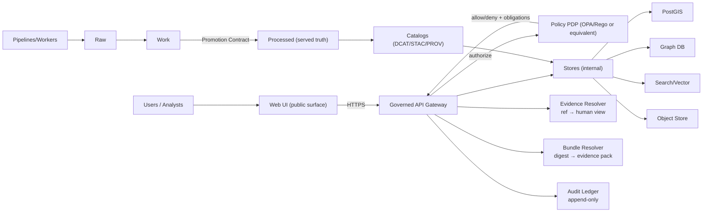
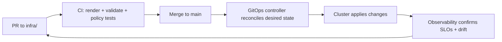

<!--
GOVERNED ARTIFACT NOTICE
This README is part of the KFM trust boundary (runtime + GitOps control plane).
If you change meaning (not just phrasing), route through the governance review path (CODEOWNERS + CI gates).
-->

# KFM Infrastructure (`infra/`) 🧱🔐🌾


> **Purpose:** `infra/` is the single source of truth for KFM’s **runtime platform configuration**, **GitOps desired state**, **policy enforcement surfaces**, and **ops runbooks**.  
> **Primary goal:** make it impossible (by default) to violate KFM governance invariants—even accidentally.  
> **Secondary goal:** make evidence-first operational: promotion gates, receipts, catalogs, signatures/attestations (when enabled), and audit references are produced and verified continuously.

---

## Governance header

| Field | Value |
|---|---|
| Document | `infra/README.md` |
| Status | **Governed draft** |
| Applies to | cluster + GitOps + policy enforcement + promotion surfaces + evidence/audit operability |
| Version | `v1.1.0-draft` |
| Effective date | 2026-02-14 |
| Owners | `.github/CODEOWNERS` *(required; if missing, treat as governance gap)* |
| Review cadence | quarterly + out-of-band for security/toolchain changes |
| Review triggers | any change touching trust membrane, policy defaults, promotion rules, evidence resolution, secrets, egress, or storage |

> [!WARNING]
> **Fail-closed rule:** if a required enforcement surface is missing (policy, receipts, catalogs, contract tests), promotion/serve must **deny** by default.

---

## Table of contents 📚

- [Non-negotiables](#non-negotiables)
- [What lives in `infra/`](#what-lives-in-infra)
- [Authority ladder](#authority-ladder)
- [Architecture overview](#architecture-overview)
- [Repository and directory layout](#repository-and-directory-layout)
- [Environments](#environments)
- [GitOps delivery model](#gitops-delivery-model)
- [CI and acceptance harness](#ci-and-acceptance-harness)
- [Evidence bundles and canonical addressing](#evidence-bundles-and-canonical-addressing)
- [Platform foundations](#platform-foundations)
- [Security and compliance](#security-and-compliance)
- [Observability and SLOs](#observability-and-slos)
- [Backups and disaster recovery](#backups-and-disaster-recovery)
- [Emergency controls](#emergency-controls)
- [Operations runbooks](#operations-runbooks)
- [Change management](#change-management)
- [Glossary](#glossary)
- [References](#references)

---

## Non-negotiables ✅

> [!IMPORTANT]
> These invariants are **release barriers**. If any one is weakened, the change requires governance review and typically triggers MAJOR version implications (contract behavior change).

### 1) Trust membrane
- UI and external clients never access databases directly.
- All access flows through the governed API + policy boundary.
- Network policy and routing must prevent accidental bypass (UI → DB denied).

### 2) Fail-closed policy everywhere
- Default deny at policy boundaries.
- Missing policy inputs / missing receipts / missing catalogs / missing citations → **deny**.
- Policy must be evaluated for:
  - data queries and downloads
  - Story Nodes
  - Focus Mode answers
  - evidence resolution endpoints

### 3) Promotion Contract is mandatory (Raw → Work → Processed)
Promotion requires proofs:
- deterministic checksums
- run receipts (run manifest/run record)
- validation report(s)
- catalogs: **DCAT always; STAC conditional; PROV required**
- policy labels + redaction provenance (if sensitive)

### 4) Deterministic identity (`spec_hash`)
KFM uses deterministic spec hashing for governed specs:
- `spec_hash = sha256(JCS(spec))` (RFC 8785 canonical JSON)
- include `spec_schema_id` and `spec_recipe_version` where possible for comparability

### 5) Canonical addressing and immutability
- Evidence and promotion artifacts should be addressable by immutable digests.
- Prefer digest-addressed evidence bundles; storage URLs are implementation details.

### 6) Focus Mode: cite or abstain
- Every answer must contain resolvable citations or abstain.
- Every response must include an `audit_ref`.
- UI must be able to resolve evidence references quickly and safely (no leaks).

### 7) Emergency deny switch
- Must be possible to disable risky surfaces (public endpoints, Focus Mode, promotion/publish steps) **without redeploying code** (policy-controlled kill switch).

---

## What lives in `infra/` 🧰

This folder covers everything needed to operate KFM safely in dev/stage/prod:

- 🧱 cluster bootstrap (namespaces, operators, ingress, storage defaults)
- 🔁 GitOps desired state (Argo CD / OpenShift GitOps Applications, AppProjects, ApplicationSets)
- 🔐 security primitives (RBAC, network policies, admission policies, image policy, secrets patterns)
- 🧾 policy-as-code (CI gates + admission/runtime enforcement hooks)
- 📦 deployments (KFM API, UI, pipelines, evidence resolver, audit ledger, and dependencies)
- 🧪 acceptance harness (catalog validators + policy regression + receipt checks + optional signature verification)
- 🧾 contracts and schema pinning (promotion contract, run manifest schema, policy input schemas)
- 📈 observability (metrics/logging/tracing dashboards, alerts, SLOs)
- 🧯 backups/DR (DB and object store backups, restore procedures)
- 📓 runbooks (incident response, upgrades, emergency deny switch, leak response)

---

## Authority ladder

If documents or implementation disagree, use this ordering:

1) **Non-negotiables** in this README + `.github/README.md`
2) Policy remains **default deny** (fail closed)
3) Promotion Contract / receipt schemas (contracts/schemas)
4) Runtime policy enforcement + admission controls
5) Convenience tooling and local-dev scripts

> [!NOTE]
> If a conflict requires a behavior change, file an ADR and update contracts + tests before relaxing enforcement.

---

## Architecture overview 🗺️

### The trust membrane must hold



### GitOps delivery loop (humans propose, CI validates, GitOps reconciles)



---

## Repository and directory layout 🗂️

> [!TIP]
> If the repo already has a different `infra/` structure, map these sections to current reality.
> The goal is completeness and discoverability, not churn.

### Canonical layout (recommended)

```text
infra/                                               # GitOps + platform + app deploy (cluster-ready, repeatable, auditable)
├─ README.md                                         # You are here: how infra is organized + day-1 → day-2 workflows
│
├─ bootstrap/                                        # Day-1 cluster baseline (minimal, repeatable)
│  ├─ base/                                          # Common baseline manifests (CRDs, core namespaces, baseline policies)
│  └─ overlays/                                      # Per-cluster overlays (dev/stage/prod) for small deltas only
│
├─ clusters/                                         # GitOps entrypoints (desired-state roots)
│  ├─ dev/                                           # Dev desired state (apps + platform refs)
│  ├─ stage/                                         # Stage desired state
│  └─ prod/                                          # Prod desired state (strictest controls)
│
├─ gitops/                                           # Argo CD / OpenShift GitOps configuration
│  ├─ projects/                                      # AppProjects (tenancy boundaries + repo/namespace allowlists)
│  ├─ applications/                                  # Apps-of-apps (optional aggregation layer)
│  ├─ applicationsets/                               # AppSets (generate apps per cluster/env)
│  └─ argocd/                                        # Argo CD config (optional/self-managed installation)
│
├─ platform/                                         # Shared platform controls (security + ops guardrails)
│  ├─ namespaces/                                    # Namespace definitions + labels/quotas (if used)
│  ├─ rbac/                                          # Roles/RoleBindings/ServiceAccounts (least privilege)
│  ├─ network/                                       # NetworkPolicies (trust membrane enforcement + segmentation)
│  ├─ ingress/                                       # Ingress controllers/routes + TLS policy
│  ├─ egress/                                        # Egress allowlists (block unknown destinations by default)
│  ├─ storage/                                       # StorageClasses/PVC patterns + backup hooks
│  ├─ observability/                                 # Logging/metrics/tracing (OTel collectors, dashboards, alerts)
│  └─ admission/                                     # Optional admission policy (Gatekeeper/Kyverno runtime controls)
│
├─ apps/                                             # KFM workloads (declarative; environment overlays live nearby)
│  ├─ kfm-api/                                       # Governed API service (policy-enforced boundary)
│  ├─ kfm-web/                                       # Web UI deployment (static + edge config)
│  ├─ kfm-pipelines/                                 # Pipeline runners/cronjobs/workflows
│  ├─ kfm-evidence/                                  # Evidence resolver + bundle resolver (if split out)
│  ├─ kfm-audit/                                     # Audit ledger/append-only store (if split out)
│  └─ dependencies/                                  # Managed deps deployed alongside KFM (or references to external)
│     ├─ postgis/                                    # PostGIS database
│     ├─ neo4j/                                      # Neo4j graph database
│     ├─ object-store/                               # S3/MinIO/etc. (catalogs, artifacts, media)
│     ├─ search/                                     # Search service (e.g., OpenSearch/Elasticsearch)
│     ├─ vector/                                     # Vector DB/service (if separate)
│     └─ opa/                                        # OPA policy PDP (runtime decisions/redaction)
│
├─ contracts/                                        # Governed standards used by CI + runtime (infra-owned references)
│  ├─ promotion/                                     # Promotion Contract (requirements + policy interfaces)
│  ├─ schemas/                                       # run_manifest, audit_record, registry schemas, etc.
│  └─ catalog-minimums/                              # Minimum STAC/DCAT/PROV versions/requirements
│
├─ policy/                                           # Infra CI gates + runtime policy packaging (fail-closed)
│  ├─ rego/                                          # Rego packs used by conftest/opa test
│  ├─ conftest/                                      # Conftest harness/config (what to check + how to fail)
│  ├─ fixtures/                                      # Golden inputs/expected denies (incident regression)
│  └─ bundles/                                       # Built policy bundles (if generated)
│
├─ ci/                                               # Reproducible verification (local parity with CI)
│  ├─ acceptance-harness/                            # Validate catalogs + receipts (+ optional cosign verify)
│  ├─ tools.lock/                                    # Pinned tool versions (recommended for deterministic CI)
│  ├─ Makefile                                       # Common entrypoints (make verify/lint/render)
│  └─ scripts/                                       # CI helper scripts (thin wrappers, consistent flags)
│
├─ secrets/                                          # Secret patterns ONLY (NEVER plaintext secrets committed)
│  ├─ external-secrets/                              # ExternalSecrets operator patterns (preferred in many setups)
│  ├─ sops/                                          # SOPS-encrypted manifests (if used)
│  └─ sealed-secrets/                                # SealedSecrets patterns (if used)
│
└─ runbooks/                                         # Ops runbooks (day-2 operations + incident handling)
   ├─ oncall/                                        # Oncall checklists, alerts, dashboards, escalation paths
   ├─ incident-response/                             # Incident workflow, comms templates, postmortem format
   ├─ backups/                                       # Backup/restore procedures + verification drills
   ├─ upgrades/                                      # Upgrade runbooks (cluster, dependencies, KFM services)
   └─ governance/                                    # Governance ops (policy changes, approvals, emergency switches)
```

### Directory responsibilities

| Path | Typical owner | Purpose | “Done” means |
|---|---|---|---|
| `infra/bootstrap/` | platform | minimal baseline | cluster ready for GitOps |
| `infra/gitops/` | platform | reconciliation config | apps reconcile automatically |
| `infra/platform/` | platform + security | shared controls | RBAC + network + admission enforced |
| `infra/apps/` | app teams | workloads + deps | deployable via GitOps only |
| `infra/contracts/` | governance + platform | schemas + standards | CI validates receipts/catalogs |
| `infra/policy/` | security + governance | fail-closed rules | PRs fail if invariants break |
| `infra/ci/` | platform | acceptance harness | reproducible verify locally + CI |
| `infra/runbooks/` | on-call | operate + recover | drills completed; new on-call can follow |

---

## Environments 🌎

> [!NOTE]
> Prefer **directories/overlays**, not long-lived branches.

| Environment | Purpose | Allowed data | Risk posture |
|---|---|---|---|
| `dev` | fast iteration | synthetic / limited | looser SLOs, strict policy still |
| `stage` | pre-prod validation | scrubbed subset | production-like gates |
| `prod` | real users | governed + audited | highest restrictions + approvals |

---

## GitOps delivery model 🔁

GitOps is KFM’s delivery and drift-correction mechanism: desired state lives in Git; controllers reconcile continuously.

### Core rules
- ✅ all infra changes happen via PR
- ✅ CI runs render + schema validation + policy gates + harness checks
- ✅ merge triggers reconciliation
- ❌ no “click-ops” in prod (except break-glass; audited; time-limited)

### Promotion pattern (apps)
Promote by changing overlays (or values) via PR:
- `apps/<svc>/overlays/dev`
- `apps/<svc>/overlays/stage`
- `apps/<svc>/overlays/prod`

**Prefer digest pinning** for images and governance-critical artifacts where supported.

---

## CI and acceptance harness 🧪

> [!IMPORTANT]
> Governance is enforced by validators + CI gates. Human review is trigger-based (sensitivity, policy changes, high-risk infra changes).

### Minimum CI gates (infra)
- Render manifests (Kustomize/Helm) → validate schema (`kubeconform`/`kubeval` equivalent)
- Conftest policy gates (default deny, trust membrane rules, required labels)
- Admission policy lint/tests (Gatekeeper/Kyverno), if used
- Receipt schema validation for promotions (run manifests, checksums)
- Catalog validation (DCAT always; STAC/PROV as applicable) + cross-link checks
- Secret hygiene checks (no plaintext secrets committed)
- Workflow hardening checks (pinned actions, least-privilege permissions), where enforced

### Acceptance harness concept
`infra/ci/acceptance-harness/` is the pinned toolchain invoked by:
- GitHub Actions CI
- local `make verify`
- release/promotion workflows

Recommended: pin tool versions in `infra/ci/tools.lock` to prevent silent behavior drift.

---

## Evidence bundles and canonical addressing 📦

> [!IMPORTANT]
> KFM must be able to answer: **“What evidence produced this?”** and **“Where do I fetch it?”** deterministically.

### Canonical address hierarchy (required)

1) **Digest-addressed evidence bundle** (immutable provenance root)  
   - Example: `oci://registry.example.org/kfm/bundles/<dataset>@sha256:<digest>` *(example only)*

2) **Stable gateway URL derived from digest** (UI fetch path)  
   - Example: `/api/v1/bundles/sha256:<digest>`

3) **Storage URL** (implementation detail)  
   - object store paths, bucket URLs, etc.

### Evidence resolver expectations
- Citation schemes must resolve to human-readable evidence views:
  - `prov://`, `stac://`, `dcat://`, `doc://`, `graph://` (+ `oci://` when bundles exist)
- Resolver must be fail-closed:
  - missing target → 404
  - unauthorized → 403
  - policy denial → 403 (non-leaky reason codes)

> [!TIP]
> Treat evidence bundles like release artifacts:
> immutable, digest pinned, verifiable, discoverable via attached referrers/metadata where supported.

---

## Platform foundations 🏗️

### Networking / ingress / egress 🌐
- Ingress via platform-managed controllers/routes
- Egress deny-by-default where feasible (allowlists per service)
- Sensitive services (databases, internal catalogs) are not exposed externally

**Trust membrane enforcement examples**
- Network policies deny UI → DB
- Only API namespace can reach DB namespaces
- Pipeline workers have scoped DB rights (write to staging; promotion through governed steps)

### Identity and access 🪪
- Centralized auth (OIDC/SAML) *(implementation-specific)*
- Least-privilege RBAC (no wildcard cluster-admin in workloads)
- Break-glass access is time-limited and audited (runbook required)

### Storage 💾
Separate:
- transactional DB (PostGIS)
- graph DB (Neo4j or equivalent)
- object store (raw/work/processed artifacts, catalogs, audit checkpoints)
- search/vector indexes (rebuildable from catalogs where possible)

> [!WARNING]
> Storage changes can be hard to reverse. Any storage class migration requires a rollback and restore plan.

---

## Security and compliance 🛡️

### Secrets: no plaintext 🔑
Choose one primary approach and document it:
- external secrets (preferred with a real secret manager)
- SOPS (encrypted files in Git)
- sealed secrets (encrypted secrets committed)

**Requirements**
- no plaintext secrets in YAML
- rotation plan
- audit trail

### Policy-as-code (two layers) 📜
1) **CI policy gates** (fail PRs violating invariants)  
2) **Runtime admission policy** (deny unsafe manifests)
   - Pod Security “restricted” defaults where possible
   - block privileged/hostPath
   - enforce network policy presence for sensitive namespaces
   - enforce image provenance policy where enabled

> [!IMPORTANT]
> If policy blocks a deployment, fix the workload—not the policy.

### Supply chain verification (incremental) 📦
Adopt incrementally, but design hooks now:
- SBOM generation
- vulnerability scanning
- image signing + verification
- provenance attestations
- toolchain pinning for verifiers (avoid silent failure)

---

## Observability and SLOs 📈

### What we measure (minimum)

| Signal | Minimum | Why |
|---|---|---|
| Logs | centralized + searchable | incidents + audits |
| Metrics | platform + app | SLOs + capacity |
| Traces | key APIs | latency + root cause |
| Policy denials | counted + reason codes | detect breaks and attempted misuse |
| Evidence resolution failures | tracked | citations must be resolvable |
| Promotion outcomes | pass/fail + reasons | governance visibility |

### Minimum SLO template

| Service | SLI | Target | Window |
|---|---|---:|---|
| API gateway | availability | 99.9% | 30d |
| Focus Mode | cite-or-abstain compliance | 100% | per response |
| Evidence resolver | citation resolvability | ≥99% | 30d |
| Pipelines | on-time runs | 95% | 30d |
| Promotion | fail-closed correctness | 100% | per promotion |

---

## Backups and disaster recovery 🧯

> [!IMPORTANT]
> If it isn’t restorable, it isn’t backed up.

### Backups must cover
- object store (raw/work/processed artifacts + catalogs + audit checkpoints)
- databases (PostGIS, graph DB, search snapshots)
- GitOps state (Git is part of DR)
- secrets (via chosen secret strategy)
- audit ledger/provenance store (including checkpoints)

### DR checklist (template)
- [ ] restore empty cluster from GitOps
- [ ] restore object storage (with versioning/immutability as configured)
- [ ] restore DB snapshots
- [ ] validate policy gates still enforce invariants
- [ ] validate Focus Mode cite-or-abstain behavior
- [ ] validate audit refs and evidence bundles still resolve

---

## Emergency controls 🧯🛑

> [!IMPORTANT]
> Maintain an emergency deny switch that can disable public endpoints and Focus Mode without deploying code.

Common controls (implementation-specific):
- disable `/api/v1/ai/query`
- deny promotion/publish jobs
- disable public dataset download endpoints
- force maintenance mode on UI routes
- temporarily tighten policy classes (broader denies)

Runbook path (recommended): `infra/runbooks/incident-response/emergency-deny-switch.md`

---

## Operations runbooks 📓

<details>
  <summary><strong>Runbooks (recommended minimum)</strong></summary>

- Incident response (SEV triage, comms, rollback)
- GitOps stuck / drift remediation
- Secret rotation
- Cluster upgrade process
- Storage expansion/migration
- DB restore + point-in-time recovery
- Pipeline backfill & reprocessing
- Audit log queries for governance review
- Emergency deny switch (AI + public endpoints)
- Data leak response (deny → withdraw → reissue redacted derivative → regression test)

</details>

---

## Change management 🔀

### When you need governance review 🧑‍⚖️
- any change that could enable UI → DB access
- any reduction in policy enforcement (CI or runtime)
- any change affecting promotion contract / receipt schema / catalog minimums
- any change impacting cite-or-abstain behavior or audit reference semantics
- any new external egress route from restricted namespaces
- any change to secrets strategy or storage classes

### PR Definition of Done ✅
- [ ] policy tests pass (CI)
- [ ] manifests render valid YAML (kustomize/helm) and validate schema
- [ ] no plaintext secrets
- [ ] network policies present for sensitive namespaces
- [ ] rollback plan included (or explicit “not needed”)
- [ ] runbook updated if operational behavior changed
- [ ] if promotion-related: receipts + catalogs validate; fail-closed verified
- [ ] toolchain versions pinned/updated intentionally when relevant

---

## Glossary 🧠

| Term | Meaning |
|---|---|
| Trust membrane | boundary enforcing clients never talk to DBs directly |
| Fail-closed | default deny unless explicitly allowed |
| Promotion Contract | required checks/proofs before moving artifacts to processed/served truth |
| Receipts | run record + run manifest + validation report + checksums proving reproducibility |
| `spec_hash` | deterministic hash of a schema-defined spec (`sha256(JCS(spec))`) |
| Canonical addressing | digest as provenance root; gateway URLs derived from digest |
| Evidence bundle | immutable, digest-addressed pack of evidence + catalogs + receipts (where used) |
| Evidence resolver | service that resolves `ref` schemes to human-readable evidence views |
| GitOps | reconcile desired state from Git; drift correction |

---

## References 🔗

- `.github/README.md` — repo governance + required CI gates
- KFM Next-Gen Blueprint & Primary Guide (internal draft) — trust membrane, truth path, evidence/audit expectations
- KFM Comprehensive Data Source Integration Blueprint — promotion gates, catalogs/receipts, sensitivity handling
- KFM Feb-2026 integration patterns — spec_hash semantics, canonical addressing, evidence bundles, kill switch expectations
- Standards: RFC 8785 (JSON canonicalization), STAC, DCAT, W3C PROV
