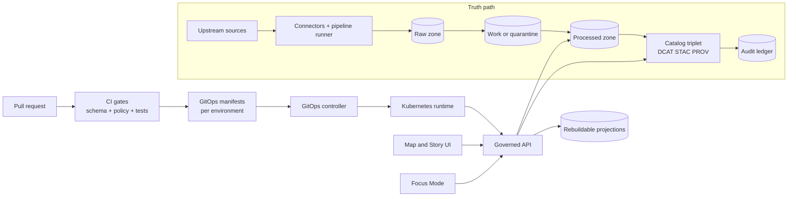

# Infrastructure (infra/)

Infrastructure-as-code, GitOps environment manifests, and operational runbooks for **KFM’s governed perimeter** (deploy → observe → recover) while enforcing the **trust membrane** and **fail-closed promotion**.

**Status:** Draft (vNext)  
**Owners:** Platform Engineering + Governance (fill in)  
**Last updated:** 2026-02-22


---

## Navigation

- [Scope](#scope)
- [Non-negotiable invariants](#non-negotiable-invariants)
- [System view](#system-view)
- [Repository layout](#repository-layout)
- [Environments](#environments)
- [GitOps workflow](#gitops-workflow)
- [Storage and truth path zones](#storage-and-truth-path-zones)
- [Policy and promotion gates](#policy-and-promotion-gates)
- [Observability](#observability)
- [Disaster recovery](#disaster-recovery)
- [How to change infra](#how-to-change-infra)
- [Definition of Done](#definition-of-done)
- [Appendix: Terms](#appendix-terms)

---

## Scope

This folder is the **operational perimeter** for running KFM in a way that keeps the system:

- **Map-first** (low-latency tile + query paths, cached safely)
- **Time-aware** (freshness and versioning are visible + measurable)
- **Governed** (policy is enforced consistently)
- **Evidence-first** (every user-facing surface can resolve citations)

**What belongs in `infra/`**
- GitOps manifests and environment overlays
- Infrastructure modules (cluster add-ons, ingress, DNS, certs, storage classes, network policies)
- Observability (metrics/logs/traces) wiring and dashboards-as-code
- Backup/restore configuration and disaster-recovery playbooks
- Runbooks and “break-glass” procedures (access-controlled)

**What does *not* belong in `infra/`**
- Secrets committed to git (ever)
- Raw datasets, processed artifacts, or catalog payloads
- Ad-hoc “kubectl apply” changes to production without a PR trail

> **WARNING:** If you can “fix it in prod” without a pull request, the system is not operating as governed infrastructure.

---

## Non-negotiable invariants

These are not “best practices”; they are **system invariants**. Infra changes must preserve them.

### Trust membrane

- Frontend/external clients **never** read from databases or object storage directly.
- Backend domain logic **never** bypasses repository interfaces to reach storage.
- All access flows through governed APIs that apply policy, redaction/generalization, and logging consistently.

### Promotion is fail-closed

- A dataset version only becomes visible through runtime surfaces **after** promotion gates pass.
- If a gate cannot be evaluated (missing artifact, missing license, missing policy label), the correct behavior is **deny/block**.

### Canonical vs rebuildable stores

- **Canonical**: object storage + catalogs + audit ledger
- **Rebuildable projections**: PostGIS projections, search index, graph edges, tile bundles/caches

This keeps migrations and re-indexing safe: projections can be rederived from canonical artifacts.

---

## System view



---

## Repository layout

> **NOTE:** The exact repo structure may differ. The goal is to keep infra artifacts discoverable and PR-reviewable.

**Recommended baseline (adjust to repo reality):**
```text
infra/
  gitops/                 # environment manifests (base + overlays)
    base/
    env/
      dev/
      stage/
      prod/
  modules/                # IaC modules (terraform/pulumi/helm charts/etc)
  addons/                 # cluster add-ons (ingress, cert-manager, observability, policy)
  runbooks/               # operational procedures (incident + DR + access)
  scripts/                # helper scripts (lint/validate/bootstrap)
  docs/                   # infra-specific docs (architecture, ADR links, diagrams)
```

If your repository already uses `ops/` rather than `infra/`, keep **one source of truth** and link the other to it (avoid duplicate “two realities”).

---

## Environments

A typical posture is:

- **dev**: fastest iteration, safest defaults still enforced
- **stage**: release candidate, production-like policies and sizing
- **prod**: strict change control, least privilege, highest auditability

Environment separation should include (at minimum):
- distinct namespaces/projects
- distinct credentials
- distinct object storage buckets/prefixes (or separate accounts)
- separate external endpoints and TLS material
- policy bundles/version pins aligned to each environment

---

## GitOps workflow

**Principle:** all running state is the result of **declared state in git**, applied by a controller.

### Change flow

1. Make infra change in `infra/` as a PR.
2. CI runs:
   - formatting + lint
   - policy tests
   - environment manifest validation
3. Merge triggers GitOps reconciliation into the target environment.
4. Observe rollout + confirm policy/metrics remain healthy.

### Rollback

Rollback should be “git revert” + GitOps reconciliation, not manual drift.

> **TIP:** Prefer “rollback-first” mindset: if you can’t roll it back quickly, it isn’t safe to ship.

---

## Storage and truth path zones

Infra must support KFM’s truth path lifecycle by making **zones explicit** and enforcing controls accordingly.

### Zones

| Zone | Purpose | Infra posture |
|---|---|---|
| raw | immutable acquisition artifacts + checksums | append-only, strict access |
| work | intermediate transforms | restricted, short-lived |
| quarantine | suspected failures / redaction candidates | restricted, review workflow |
| processed | publishable artifacts by version | immutable by digest, policy-labeled |
| catalog | DCAT/STAC/PROV + run receipts | schema-valid, cross-linked |
| audit | append-only ledger | access-controlled, retained |

### Storage rules to encode in infra

- encryption at rest + in transit
- lifecycle policies (especially raw/audit retention)
- least-privilege IAM by zone
- prevent “public by accident” (deny-by-default bucket policies)

> **WARNING:** Never treat tiles/caches as canonical. They are rebuildable projections.

---

## Policy and promotion gates

Promotion gates are how governance becomes enforceable behavior. Infra supports this by ensuring policy tooling is available in CI and runtime, and by making “unsafe promotion” operationally difficult.

### PR-based catalog/promotion loop (target behavior)

- Dataset discovery should create a **draft PR** containing deterministic catalog changes.
- Merges are blocked until:
  - schema validation passes
  - policy gates pass
  - provenance/attestation checks pass where required

### CI/CD gates (minimum expectation)

When promoting anything that affects runtime surfaces, CI should be able to answer:
- **What changed?**
- **Why did it change?**
- **Is it allowed to ship?**

At minimum, expect gates like:
- catalog schema validation (DCAT/STAC/PROV)
- link checking (citations must resolve)
- policy tests (default deny + fixtures)
- spec-hash drift detection
- evidence resolver contract tests

> **NOTE:** If Focus Mode or evidence resolution can’t verify citations, the safe behavior is to abstain/deny.

---

## Observability

Operational reliability is part of trust: users must know when layers are stale or failing.

Minimum signals to wire up:
- pipeline run success/latency and per-dataset freshness
- evidence resolver latency/failure rates
- API latency/error rates (including allow/deny decision classes)
- structured logs with correlation IDs (`run_id`, `audit_ref`, `dataset_version_id`)
- traces for evidence resolution + Focus Mode paths

---

## Disaster recovery

DR should follow the canonical vs rebuildable distinction:

1. Restore **canonical** stores first (object storage + catalogs + audit ledger).
2. Replay rebuild pipelines to reconstruct projections (PostGIS/search/graph/tiles).

Document and rehearse:
- RPO/RTO targets per environment
- restore order and verification steps
- access controls during incident response

---

## How to change infra

### Before you open a PR

- Confirm whether the change touches:
  - trust membrane surfaces (ingress/API routing, direct storage access)
  - promotion gates / policy bundles
  - audit/observability wiring
  - data zone controls
- If yes, include:
  - risk analysis (what could break, how to roll back)
  - verification plan (what you’ll check post-merge)

### PR checklist (infra)

- [ ] No secrets committed
- [ ] Least privilege preserved
- [ ] Default-deny posture preserved
- [ ] Rollback path documented
- [ ] Observability impact assessed
- [ ] Runbook updated if operational behavior changes

---

## Definition of Done

An infra change is “done” when:

- It is fully expressed in git (GitOps-ready).
- It does not violate invariants (trust membrane, fail-closed promotion, canonical vs rebuildable).
- CI validation exists (or is extended) to prevent regressions.
- Operational verification steps are documented (and repeatable).
- If it changes runtime policy behavior, the policy pack is versioned and tested.

---

## Appendix: Terms

- **Trust membrane:** the boundary that prevents bypassing governed APIs.
- **Promotion Contract:** fail-closed gate set that controls what becomes runtime-visible.
- **EvidenceRef / EvidenceBundle:** stable references and resolved bundles used for evidence-first UX.
- **Zones:** raw/work/quarantine/processed/catalog/audit; encoded as operational controls, not just vocabulary.

---

<sub><a href="#infrastructure-infra">Back to top</a></sub>
