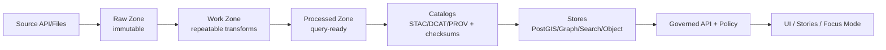

# `/infra` — KFM Infrastructure (Governed, GitOps-ready)

## Why this folder exists

This directory contains the **deployable infrastructure** for Kansas Frontier Matrix (KFM): local runtime orchestration, Kubernetes/OpenShift deployment manifests, GitOps structures, operational runbooks, and environment configuration patterns.

KFM is not “just an app.” It is a **governed knowledge system**. Infrastructure is therefore a **governed artifact**: infra must uphold the system invariants below or CI must fail (fail-closed).

---

## Non‑negotiable system invariants (must be true in every environment)

> These are not preferences—these are build invariants.

### 🧱 Trust membrane (enforced boundary)
- **Frontend never talks to databases directly.**
- **All requests** (data, stories, Focus Mode) cross the **API Gateway → Policy (OPA)** boundary.
- Backend logic must not bypass repository interfaces/ports to reach storage.

### 🧑‍⚖️ Policy-as-code (fail-closed)
- **Default deny** policy posture.
- Policy is evaluated:
  - **on request** (access control, shaping/redaction)
  - **on response** (Focus Mode “cite-or-abstain” output validation)

### 📦 Dataset promotion gates (truth path)
- Data must flow **Raw → Work → Processed**.
- **Processed** is the **only publishable source of truth**.
- Promotion requires **checksums + STAC/DCAT/PROV** catalogs (machine-checkable).

### 🧾 Evidence-first UX + auditability
- Every user-visible claim must be traceable to evidence.
- Focus Mode must **cite or abstain** and produce an **audit reference** for every answer.
- Audit/provenance is produced as part of the normal request path.

---

## Table of contents

- [What lives in `/infra`](#what-lives-in-infra)
- [Architecture (runtime components)](#architecture-runtime-components)
- [Local development (Docker Compose)](#local-development-docker-compose)
- [Kubernetes/OpenShift deployment](#kubernetesopenshift-deployment)
- [GitOps structure (Argo CD pattern)](#gitops-structure-argo-cd-pattern)
- [Environments & promotion](#environments--promotion)
- [Secrets management](#secrets-management)
- [Storage & stateful services](#storage--stateful-services)
- [Observability (logs/metrics/traces)](#observability-logsmetricstraces)
- [Security baseline](#security-baseline)
- [CI/CD & governance gates](#cicd--governance-gates)
- [Operations (runbooks, DR, backups)](#operations-runbooks-dr-backups)
- [Change management (ADRs)](#change-management-adrs)
- [Troubleshooting](#troubleshooting)
- [Appendix: Glossary](#appendix-glossary)

---

## What lives in `/infra`

> ⚠️ If a listed path is missing in the repo, treat this README as the **desired contract** and create the missing path as part of the next infra PR.

### Directory layout (canonical)

```text
infra/
├── README.md                       # you are here
├── compose/                        # local dev + smoke-test orchestration
│   ├── docker-compose.yml
│   ├── .env.example
│   └── volumes/                    # optional bind mounts for local persistence
├── gitops/                         # GitOps "desired state" repo subtree
│   ├── bootstrap/
│   │   ├── base/
│   │   └── overlays/
│   │       └── default/
│   ├── components/
│   │   ├── applicationsets/
│   │   └── argocdproj/
│   ├── core/                       # cluster-level capabilities
│   │   ├── gitops-controller/
│   │   ├── policy-pdp-opa/
│   │   ├── ingress-or-routes/
│   │   ├── observability-stack/
│   │   └── storage-classes/
│   └── apps/                       # KFM workloads (dev/stage/prod overlays)
│       ├── kfm-api/
│       ├── kfm-web/
│       ├── kfm-pipeline/
│       ├── kfm-data-services/      # postgis/neo4j/search/object-store (if in-cluster)
│       └── kfm-jobs/               # backfills/reindex/nightly maintenance
├── k8s/                            # optional: non-GitOps "raw" k8s manifests (escape hatch)
│   ├── base/
│   └── overlays/
│       ├── dev/
│       ├── stage/
│       └── prod/
├── openshift/                      # OpenShift-specific objects (Routes, SCC notes, etc.)
│   ├── routes/
│   ├── quotas/
│   └── rbac/
├── iac/                            # optional: IaC for cloud/cluster provisioning
│   ├── terraform/
│   └── ansible/
├── scripts/                        # bootstrap utilities (cluster, registry, validation helpers)
└── runbooks/                       # operational checklists and incident playbooks
    ├── BACKUPS.md
    ├── RESTORE.md
    ├── INCIDENT_RESPONSE.md
    └── TROUBLESHOOTING.md
```

### Responsibilities by area

| Area | Owns | Must NOT do |
|---|---|---|
| `compose/` | Local runtime orchestration | Become “production truth”; prod uses GitOps |
| `gitops/` | Declarative desired state for clusters | Contain plaintext secrets |
| `core/` | Cluster capabilities (policy, observability, ingress, storage defaults) | Embed app-specific config |
| `apps/` | Deploy KFM workloads with env overlays | Bypass the trust membrane |
| `runbooks/` | Operational steps (human-executable, auditable) | Require tribal knowledge |

---

## Architecture (runtime components)

### Container view (trust membrane enforced)

```mermaid
flowchart LR
  UI[Web UI\nReact/TS + Map] -->|HTTPS| API[API Gateway\n(FastAPI REST + optional GraphQL)]
  API -->|authorize| OPA[Policy PDP\nOPA/Rego]
  API -->|query via ports| PGIS[(PostGIS)]
  API -->|query via ports| NEO[(Neo4j)]
  API -->|search| SEARCH[(Search/Vector)]
  API -->|assets| OBJ[(Object Store)]
  API -->|append| AUD[(Audit Ledger\nappend-only)]
  PIPE[Pipeline/Orchestrator] -->|promote| PGIS
  PIPE -->|index| SEARCH
  PIPE -->|catalogs| OBJ
```

### “Truth path” (data governance pipeline)



---

## Local development (Docker Compose)

> Local development is standardized around Docker Compose: copy `.env.example` to `.env` and run `docker compose up --build`. UI is expected on `:3000`, API docs on `:8000/docs`.

### Prerequisites
- Docker + Docker Compose (v2)
- A `.env` file (from `.env.example`)
- Enough RAM for search + graph services (Neo4j + OpenSearch are not lightweight)

### Quickstart

```bash
cd infra/compose
cp .env.example .env
docker compose up --build
```

### Services (baseline)

The documented baseline includes:
- `api` (KFM API gateway)
- `web` (React UI)
- `postgis` (geospatial store)
- `neo4j` (knowledge graph)
- `opensearch` (search/vector)
- `opa` (policy decision point)

#### Default ports (recommended)
| Service | Port(s) | Notes |
|---|---:|---|
| web | 3000 | UI dev server |
| api | 8000 | API + OpenAPI docs at `/docs` |
| postgis | 5432 | local only |
| neo4j | 7474 / 7687 | local only |
| opensearch | 9200 | local only |
| opa | 8181 | local only |

### Local data persistence
- Prefer **named volumes** for PostGIS/Neo4j/OpenSearch.
- Use `infra/compose/volumes/` only if you intentionally want bind mounts.

### Resetting local state
```bash
cd infra/compose
docker compose down -v
```

> 🔥 This deletes local volumes. Do not do this if you care about persisted local datasets.

---

## Kubernetes/OpenShift deployment

KFM supports Kubernetes-style deployment (OpenShift is Kubernetes with additional primitives). KFM productionization expects:
- versioned container images
- declarative manifests
- GitOps reconciliation
- observability
- runbooks, backups, and incident drills

### Deployment primitives (recommended)
- **Deployments** for `kfm-api` and `kfm-web`
- **Jobs/CronJobs** for:
  - pipeline ingest runs
  - catalog validation
  - index rebuilds
  - periodic integrity checks (checksums)
- OpenShift-specific:
  - **Routes** (instead of Ingress) where appropriate

### Scaling expectations (baseline)
- `kfm-api`: 2–3 replicas (stateless)
- `kfm-web`: 2 replicas (stateless)
- stateful services: scale carefully; use appropriate storage classes and backups

---

## GitOps structure (Argo CD pattern)

KFM GitOps adopts the common “bootstrap/components/core/apps” model.

### Why GitOps here
- Desired state is **in Git** (auditable).
- Cluster drift is detected and corrected by reconciliation.
- Promotion is achieved via pull requests / merges.

### Repo structure (pattern)
```text
gitops/
├── bootstrap/     # installs Argo + creates baseline projects
├── components/    # ApplicationSets, Argo projects, RBAC
├── core/          # cluster capabilities (policy/ingress/observability)
└── apps/          # app workloads with env overlays (dev/stage/prod)
```

### How KFM maps to `core/` vs `apps/`
- `core/` contains shared platform services and guardrails:
  - OPA deployment + configuration (PDP)
  - ingress/routes + TLS termination
  - observability stack
  - storage defaults
  - cluster RBAC, quotas, namespaces/projects
- `apps/` contains KFM workloads:
  - `kfm-api`, `kfm-web`
  - pipeline runner (jobs, schedules)
  - optional: in-cluster PostGIS/Neo4j/OpenSearch (or external managed services)

---

## Environments & promotion

### Environments (recommended)
- `dev`: fastest iteration, lowest restrictions
- `stage`: pre-prod integration + governance verification
- `prod`: strict gates, immutable releases, auditable changes only

### Promotion rules (infrastructure)
- Promote by **merging** changes to the desired-state manifests (or updating image tags) in Git.
- The GitOps controller reconciles to clusters.

### Promotion rules (data)
- Treat data versions as promotable artifacts:
  - Raw/Work are not served to users.
  - Processed is served only after STAC/DCAT/PROV + checksums validate.
- If you represent “desired data state” declaratively, promotions should be PR-based (audit trail).

---

## Secrets management

### Hard rules
- **Never commit plaintext secrets**.
- Local dev uses `.env` only (ignored by git).
- Cluster secrets use one of:
  - sealed/encrypted secrets committed to Git, **or**
  - external secret references (Vault/External Secrets)

### What counts as a secret here
- DB passwords, Neo4j credentials
- OIDC client secrets
- API keys for upstream data sources
- signing keys (JWT, cookies)
- object store keys

### Rotation
- Document rotation steps in `infra/runbooks/`.
- Rotation must not break GitOps reconciliation (avoid manual “click ops”).

---

## Storage & stateful services

### Services and what they store
| Component | Stores | Notes |
|---|---|---|
| PostGIS | processed geospatial datasets, tiles metadata, audit ledger table | must not be reachable from UI |
| Neo4j | knowledge graph edges/nodes, concept relationships | policy-controlled access via API |
| Search/Vector | retrieval index for Focus Mode and discovery | rebuildable from catalogs + processed |
| Object store | large assets (COGs/media), catalog files, audit checkpoints | preferred for big blobs |

### Backups (must exist before “prod”)
- PostGIS: logical + snapshot strategy
- Object store: versioning + lifecycle policies
- Search index: rebuild strategy (nightly rebuild job + diff checks recommended)
- Neo4j: snapshot/backup procedure if used in prod

> ✅ Definition of “ready for production”: backups tested + restore drill completed + runbook exists.

---

## Observability (logs/metrics/traces)

### Minimum observability contract
- **OpenTelemetry traces**: correlate UI → API → OPA → stores → model/tooling
- Structured logs include:
  - `request_id`
  - `audit_ref`
  - decision results (allow/deny) without leaking secrets
- Dashboards should cover:
  - tile latency
  - Focus Mode latency
  - policy denials
  - pipeline success rate
  - index rebuild duration

### Alerts (baseline)
- elevated 5xx rate on API
- increased OPA deny rate (may indicate policy regressions)
- ingestion/promotion failures
- storage utilization thresholds

---

## Security baseline

### Identity & access control
- AuthN: OIDC provider issues JWTs; API gateway verifies tokens.
- AuthZ: OPA evaluates role/attributes; dataset/layer/story access enforced centrally.
- Rate limiting: stricter on Focus Mode endpoints.

### Network hardening
- Only the API gateway (and UI) are exposed externally.
- Databases/search/graph are cluster-internal only.
- Enforce TLS end-to-end in stage/prod.

### Supply chain
- Build produces:
  - SBOM (SPDX)
  - build provenance attestation (SLSA/in-toto)
- Publish versioned container images only if all gates pass.

---

## CI/CD & governance gates

Infra changes are not “just YAML.” They must uphold governance.

### Required CI checks (minimum hardening set)
- Docs: lint + link-check + template validator
- Stories: v3 validator + citation resolution
- Data: STAC/DCAT/PROV validation + checksums
- Policy: `opa test` (default deny + cite-or-abstain)
- Supply chain: SBOM + provenance attestation
- Build: container images published only after gates pass

### Where CI lives
- `.github/workflows/*` (repo root)
- Scripts in `scripts/` should be called by CI and runnable locally.

---

## Operations (runbooks, DR, backups)

### Runbook expectations
Runbooks must be:
- deterministic (inputs → commands → expected outputs → next step)
- safe-by-default (avoid destructive commands without explicit warnings)
- usable by someone who is not the original author

### Required runbooks (minimum)
- `BACKUPS.md` — how backups are taken and validated
- `RESTORE.md` — how to restore PostGIS + object store + policy bundles
- `INCIDENT_RESPONSE.md` — triage steps; who to page; what to capture
- `TROUBLESHOOTING.md` — common failures and how to interpret them

### Disaster recovery (DR) checklist (minimum)
- [ ] secrets recreation documented
- [ ] fresh install steps documented
- [ ] object store “bucket info” documented (names, regions, lifecycle)
- [ ] restore steps for all stateful services
- [ ] restore drill completed and signed off

---

## Change management (ADRs)

Any infrastructure decision that affects:
- trust membrane enforcement
- policy evaluation
- data promotion gates
- storage engines
- observability stack
- CI gates

…must be recorded in an ADR.

Recommended path:
- `docs/adr/ADR-000X-<title>.md`

ADR must include:
- context
- decision
- alternatives
- consequences
- verification (tests/metrics + rollback plan)

---

## Troubleshooting

### “OPA denies everything”
1. Confirm OPA is reachable from the API service.
2. Confirm policy bundles loaded and `default deny` rules are expected.
3. Verify policy input schema is being passed correctly (missing keys should fail-closed).

### “UI loads but no data”
- Check API is reachable from UI (CORS + route/ingress)
- Check API logs for policy denials
- Confirm datasets are served only from **Processed** and catalogs exist

### “Search results empty”
- Confirm indexing job ran successfully
- Rebuild search index from canonical catalogs (do not hand-edit indices)

### “Pipeline produced files but nothing is visible”
- Promotion gate likely blocked:
  - missing checksums
  - invalid STAC/DCAT/PROV
  - missing run record / validation report

---

## Appendix: Glossary

| Term | Meaning |
|---|---|
| Trust membrane | The API + policy boundary where governance is enforced |
| OPA | Open Policy Agent (policy-as-code engine) |
| PDP | Policy Decision Point (OPA service) |
| GitOps | Desired state in Git; reconciler applies it continuously |
| STAC | SpatioTemporal Asset Catalog (geospatial assets) |
| DCAT | Data Catalog Vocabulary (dataset discovery/interoperability) |
| PROV | Provenance model for lineage/auditability |
| Processed zone | Only publishable truth source (query-ready) |
| Audit ledger | Append-only event stream for actions + policy decisions + AI outputs |

---