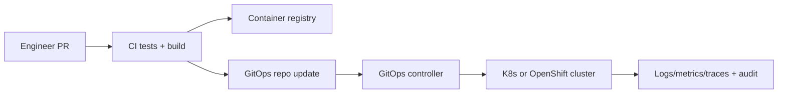

# Infrastructure

This directory defines **how KFM runs** (local dev + CI + cluster deploy) without violating the **trust membrane**.

> [!IMPORTANT]
> **Trust membrane invariant**
> - The frontend never talks to databases directly.
> - Every request is policy-evaluated and audited.
> - Backend logic must not bypass repository interfaces.

If anything in this directory conflicts with those invariants, it is a **bug**.

---

## What this directory is for

Infrastructure is the “runtime truth” of KFM:

- **Local dev**: reproducible service bring-up for engineers (containers + dependencies)
- **Cluster deploy**: GitOps-managed Kubernetes/OpenShift manifests and environment overlays
- **Policy enforcement**: OPA policies and deployment wiring
- **Secrets**: patterns and guardrails for secret material
- **Observability**: logs, metrics, tracing, and audit hooks
- **CI gates**: checks that prevent regressions in governance or security

---

## Non-negotiable invariants

These are enforced by design and should be enforced by CI.

### Trust membrane and governance

- UI/external clients **never access databases directly**; all access goes through the governed API + policy boundary.
- Policy checks **fail-closed** (default deny).
- Runtime serves from the **processed zone** only (no “raw/work” reads from the API).
- Dataset promotion requires machine-checkable **STAC/DCAT/PROV** artifacts.
- Focus Mode must **cite or abstain**, and produce an audit reference.

### Clean layers and boundary hygiene

- Domain and use cases depend only on **ports/contracts**
- Infrastructure implements ports (DB clients, OPA adapter, API handlers, queues, object storage)
- No “shortcut” direct DB calls from UI or use cases

> [!NOTE]
> This README describes the intended infrastructure model and directory layout. If your current repo differs, treat mismatches as **implementation drift** and update either the code or this doc.

---

## Directory layout

> [!TIP]
> This is the **recommended** structure for `infra/` in the monorepo. Some folders may not exist yet (scaffold as needed).

```text
infra/
  README.md

  local/
    docker-compose.yml            # local stack (not confirmed in repo)
    .env.example                  # local env defaults (never secrets)
    volumes/                      # optional local bind mounts (avoid committing data)

  gitops/
    bootstrap/                    # Argo CD app-of-apps entrypoint (or equivalent)
    components/
      core/                       # infra primitives: namespaces, operators, CRDs
      apps/                       # application manifests: api, ui, policy, pipeline
    base/                         # shared kustomize/helm base
    overlays/
      dev/
      stage/
      prod/

  policy/
    opa/
      bundles/                    # policy bundles to deploy
      tests/                      # policy unit tests

  ci/
    workflows/                    # CI templates (GitHub Actions, Tekton, etc.)
    checks/                       # scripts for lint/validate

  openshift/
    notes.md                      # OpenShift-specific runbooks/snippets
    templates/                    # optional OpenShift templates (use sparingly)

  observability/
    dashboards/
    alerts/
    logging/
    tracing/

  runbooks/
    incident-response.md
    restore.md
    rotate-secrets.md
```

---

## Local development

### Prerequisites

- Container runtime: Docker or Podman
- Compose runner: `docker compose` or `podman-compose`
- Optional: `oc` (OpenShift), `kubectl`, `kustomize`, `helm` depending on your workflow

> [!IMPORTANT]
> Local dev should mirror production boundaries: **no UI → DB direct connections**. Even locally, go through the API gateway.

### Bring up the stack

If this repo includes a compose file at `infra/local/docker-compose.yml` (not confirmed in repo):

```bash
docker compose -f infra/local/docker-compose.yml up -d --build
```

Common follow-ups:

```bash
docker compose -f infra/local/docker-compose.yml ps
docker compose -f infra/local/docker-compose.yml logs -f
```

### Default ports

These defaults are common in KFM’s reference setup. If your compose differs, update this table.

| Service | Default port(s) | Purpose |
|---|---:|---|
| PostGIS (PostgreSQL) | 5432 | Geospatial storage, tiles, query-ready datasets |
| Neo4j | 7474, 7687 | Knowledge graph |
| API gateway | 8000 | Governed REST gateway (optionally GraphQL) |
| Web UI | 3000 | React/TypeScript UI |

If a port is already in use, stop the conflicting service or adjust the compose bindings.

### API docs in local dev

If the API is FastAPI-based (as in the KFM reference architecture), the docs are typically:

- Swagger UI: `http://localhost:8000/docs`
- OpenAPI JSON: `http://localhost:8000/openapi.json`

If GraphQL is enabled, it is commonly exposed at:

- `http://localhost:8000/graphql`

> [!NOTE]
> Endpoints are implementation-dependent. If they differ, update this doc and add a CI check that enforces the canonical endpoints.

### Tear down and cleanup

```bash
docker compose -f infra/local/docker-compose.yml down
```

To drop volumes too:

```bash
docker compose -f infra/local/docker-compose.yml down -v
```

If you need a full local reset (use with care):

```bash
docker system prune -af
```

---

## Cluster deployment

KFM is designed to run on Kubernetes, with an OpenShift-friendly posture.

### GitOps workflow

**Principle**: the cluster converges to the desired state declared in Git. Runtime changes happen via pull requests, not `kubectl apply` from a laptop.

Typical lifecycle:

1. CI builds and tests application images
2. Images are pushed to a registry
3. GitOps repo is updated (tags/digests + config)
4. GitOps controller syncs the cluster



### Environments

Use overlays for environment-specific concerns:

- `dev`: fast iteration, lower resource requests, test identities
- `stage`: production-like configuration and policy, pre-prod data
- `prod`: locked-down policy, restricted secrets, audited changes only

> [!IMPORTANT]
> Environment differences must **not** weaken governance invariants. Policy should remain fail-closed everywhere.

### OpenShift notes

OpenShift often uses:
- Projects (namespaces) for isolation
- Routes for ingress
- Operator-managed components

Keep OpenShift specifics isolated in `infra/openshift/` and prefer portable Kubernetes patterns in `infra/gitops/` unless there’s a strong reason.

---

## Secrets management

Rules:

- **No plaintext secrets in Git**, including “temporary” ones.
- Prefer **cluster-native secret stores** (or sealed/encrypted secret workflows).
- CI should block secrets with scanning and pre-commit hooks where possible.

Recommended patterns:

- External Secrets operator (secrets referenced from a vault/provider)
- Sealed Secrets (encrypted secrets stored in Git; decrypted in cluster)
- GitOps-friendly secret templates where only non-sensitive values are in Git

> [!WARNING]
> Never “solve” secret rotation by committing new secrets. Rotation must happen in the secret source of truth, with Git holding references/metadata only.

---

## Policy enforcement

Policy-as-code is a first-class runtime dependency.

### OPA policy model

- Policy is evaluated on **every request** crossing the trust membrane
- Default deny for unsafe/unknown cases
- Policy decisions can shape/redact results, not just allow/deny

Suggested directory:

```text
infra/policy/opa/
  bundles/
    kfm/           # rego + data files packaged for deployment
  tests/
    *.rego         # opa test suite
```

### Policy testing and CI

At minimum, CI should:

- run `opa test` for policy bundles
- ensure “fail-closed” behavior for missing/invalid input
- enforce that “cited answers” are required where applicable

---

## Observability and audit

KFM needs observability for reliability **and** governance.

### Required signals

- **Application logs**: structured JSON, request IDs, audit IDs
- **Metrics**: latency, error rates, DB saturation, queue depth, tile generation
- **Tracing**: cross-service tracing for “why did this answer happen”
- **Audit ledger**: append-only, queryable by audit reference

### OpenShift metrics

If you rely on autoscaling or objective pod scaling, ensure a metrics stack exists (Prometheus or the OpenShift metrics stack). Treat it as foundational infrastructure, not an optional add-on.

---

## CI gates for infra changes

Any PR touching `infra/` should pass:

- [ ] YAML/JSON lint, schema validation where applicable
- [ ] Kustomize/Helm render checks for all overlays
- [ ] Policy tests pass (OPA)
- [ ] Secrets scanning passes
- [ ] Governance checks: Story Nodes and governed docs remain valid if impacted
- [ ] A minimal “smoke deploy” plan exists (dev overlay) or a dry-run render is captured

> [!TIP]
> Add a `Definition of Done` checklist to every infra PR description to keep reviews consistent.

---

## Troubleshooting

| Symptom | Likely cause | Fix |
|---|---|---|
| `port already allocated` on 5432 | Local Postgres already running | Stop local Postgres or change compose port mapping |
| Neo4j won’t start | Port conflict or volume permissions | Stop conflicting service; wipe local volume if safe |
| API runs but UI shows no data | UI bypassing gateway or wrong API base URL | Ensure UI calls the API gateway; check env config |
| GitOps sync drift | Manual kubectl changes | Revert manual changes; re-sync from Git; lock RBAC |
| Policy denies unexpectedly | Missing inputs or wrong actor context | Inspect audit logs; run policy tests locally |

---

## References

These documents informed the conventions in this README:

- KFM Next-Gen Blueprint and Primary Guide (draft)
- KFM Comprehensive Data Source Integration Blueprint
- KFM Comprehensive Technical Blueprint
- Docker, GitOps, and OpenShift training/reference notes
- Data pipelines with OpenShift/Podman/Kubernetes reference notes
- Software Security Guide for Developers (2026 Edition)

Update this list as governed artifacts evolve.

