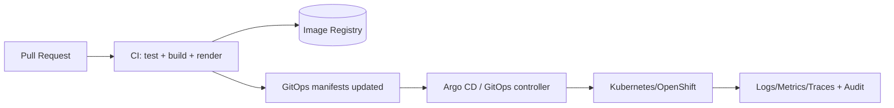

<!--
GOVERNED ARTIFACT NOTICE
This README documents KFM’s runtime trust boundary and deployment invariants.
If you change meaning (not just phrasing), route through governance review.
-->

<div align="center">

# infra/ 🧱
### KFM Infrastructure: local dev → CI → GitOps → cluster runtime (Kubernetes/OpenShift)

**This directory is the *runtime truth* of KFM.**  
If it isn’t reproducible, policy-enforced, auditable, and fail-closed — it doesn’t ship.

<br/>


</div>

---

## Contents

- [Why infra exists](#why-infra-exists)
- [Non-negotiables](#non-negotiables)
- [Professional directory layout](#professional-directory-layout)
- [Golden paths](#golden-paths)
  - [Local dev](#local-dev)
  - [GitOps deploy](#gitops-deploy)
  - [Policy bundles](#policy-bundles)
  - [Secrets](#secrets)
  - [Observability](#observability)
- [CI gates](#ci-gates)
- [Runbooks](#runbooks)
- [Infra PR checklist](#infra-pr-checklist)

---

## Why infra exists

Infrastructure is the layer that turns architecture into *enforced behavior*:

- **Reproducible environments** (local, CI, dev/stage/prod)
- **Policy-as-code** at the trust membrane (default deny)
- **Governed deployment** (GitOps convergence; minimal imperative drift)
- **Operational visibility** (audit IDs, logs/metrics/traces, SLOs)
- **Security posture** (least privilege, secret hygiene, supply-chain checks)

> [!TIP]
> Think of `infra/` as: **the contract between “what we built” and “what actually runs.”**

---

## Non-negotiables

> [!IMPORTANT]
> ### Trust membrane invariant (fail-closed)
> - **Frontend and external clients never access databases directly.**
> - All requests go through the **governed API gateway** and **policy decision point (OPA)**.
> - **Default deny**: missing/invalid policy input → **deny**.
> - Focus Mode must **cite or abstain** and emit an **audit reference**.

> [!CAUTION]
> ### Data-zone invariant
> Runtime services (API/search/tiles/UI) serve from the **processed** zone only.  
> `raw/` and `work/` are pipeline-only concerns and must not be reachable from public APIs.

> [!NOTE]
> These invariants are enforced through:
> - deployment topology (no DB exposure)
> - network policy / ingress rules
> - OPA policy bundles + regression tests
> - CI gates (render/validate/test) and protected branches

---

## Professional directory layout

> [!NOTE]
> Layout below is the **recommended** `infra/` structure. If your repo differs, treat it as **drift** and either:
> 1) align the repo to this structure, or  
> 2) update this README as a governed change.  
> *(Some paths may not exist yet.)*

```text
infra/
├─ README.md

├─ _meta/
│  ├─ OWNERS.md                      # infra reviewers/approvers (optional)
│  ├─ ADR/                           # infra-only ADRs (networking, GitOps, secrets)
│  └─ diagrams/                      # mermaid sources + exported SVGs (optional)

├─ local/
│  ├─ compose/                       # local dev stack (Docker/Podman)
│  │  ├─ docker-compose.yml
│  │  ├─ docker-compose.override.yml
│  │  └─ README.md
│  ├─ env/
│  │  ├─ .env.example                # never secrets
│  │  └─ README.md
│  └─ scripts/
│     ├─ up.sh                       # bring-up helpers
│     ├─ down.sh
│     └─ smoke.sh                    # local smoke checks

├─ gitops/
│  ├─ argocd/                        # Argo CD app-of-apps (or equivalent)
│  │  ├─ bootstrap/                  # initial Argo apps
│  │  └─ projects/                   # Argo Projects / RBAC scoping
│  ├─ kustomize/
│  │  ├─ base/
│  │  │  ├─ platform/                # namespaces, ingress, operators, storage classes
│  │  │  ├─ security/                # network policies, PSP/PSS, RBAC, admission
│  │  │  ├─ observability/           # collectors, dashboards, alerts
│  │  │  └─ apps/                    # api, ui, pipeline, policy, search, tiles
│  │  └─ overlays/
│  │     ├─ dev/
│  │     ├─ stage/
│  │     └─ prod/
│  └─ helm/                          # optional: Helm charts or wrappers (use sparingly)

├─ policy/
│  ├─ opa/
│  │  ├─ bundles/
│  │  │  └─ kfm/                     # rego + data packaged for PDP deployment
│  │  ├─ tests/                      # opa test suites (unit + regression)
│  │  └─ README.md
│  └─ conftest/
│     ├─ policies/                   # conftest policies for YAML/manifests (optional)
│     └─ README.md

├─ ci/
│  ├─ workflows/                     # CI workflows (GitHub Actions / Tekton / etc.)
│  ├─ checks/
│  │  ├─ render-kustomize.sh
│  │  ├─ validate-yaml.sh
│  │  ├─ opa-test.sh
│  │  ├─ secret-scan.sh
│  │  └─ sbom-attest.sh              # optional
│  └─ README.md

├─ security/
│  ├─ secret-management.md           # patterns (External Secrets / Sealed Secrets)
│  ├─ rbac-model.md
│  └─ threat-model.md                # infra threat model (optional)

├─ observability/
│  ├─ dashboards/
│  ├─ alerts/
│  ├─ logging/
│  ├─ tracing/
│  └─ README.md

└─ runbooks/
   ├─ incident-response.md
   ├─ restore.md
   ├─ rotate-secrets.md
   ├─ policy-deny-debugging.md
   └─ dr-gitops.md
```

---

## Golden paths

### Local dev

> [!IMPORTANT]
> Local dev must preserve production boundaries: **UI → API Gateway → Policy → Data**.  
> No shortcuts (no UI→DB direct connects, even “just locally”).

<details>
<summary><strong>Local bring-up (Docker or Podman)</strong></summary>

**Prereqs**
- Docker *or* Podman
- Compose runner (`docker compose` / `podman-compose`)
- Optional: `kubectl`, `oc`, `kustomize`, `helm` (for cluster parity)

**Start**
```bash
# example (paths may vary)
docker compose -f infra/local/compose/docker-compose.yml up -d --build
```

**Check**
```bash
docker compose -f infra/local/compose/docker-compose.yml ps
docker compose -f infra/local/compose/docker-compose.yml logs -f --tail=200
```

**Stop**
```bash
docker compose -f infra/local/compose/docker-compose.yml down
```

**Reset (destructive)**
```bash
docker compose -f infra/local/compose/docker-compose.yml down -v
```

</details>

<details>
<summary><strong>Default ports (update to match your compose)</strong></summary>

| Component | Default port(s) | Notes |
|---|---:|---|
| API Gateway (FastAPI) | 8000 | Governed REST (optional GraphQL) |
| Web UI (React) | 3000 | Always calls API gateway |
| PostGIS | 5432 | Not exposed publicly |
| Neo4j | 7474 / 7687 | Not exposed publicly |
| OPA PDP | 8181 | Policy decisions (deny by default) |

</details>

---

### GitOps deploy

GitOps means: **Git declares desired state** and a controller converges the cluster.



> [!TIP]
> If you “kubectl apply” changes directly to prod, you’re creating **configuration drift**.  
> Drift is a governance bug.

---

### Policy bundles

OPA is a first-class dependency: it must be deployed, tested, and versioned.

**Recommended contract**
- API calls PDP with a structured input (actor, action, resource, sensitivity, purpose)
- PDP returns allow/deny + optional obligations (redaction rules, max precision, etc.)
- Missing inputs → **deny** (fail-closed)

<details>
<summary><strong>OPA policy testing (example)</strong></summary>

```bash
opa test infra/policy/opa/tests -v
```

</details>

---

### Secrets

**Rules**
- No secrets in Git history
- No secrets in CI logs
- Minimize token scopes + rotate regularly
- Prefer managed secret sources (Vault/provider) or sealed/encrypted secrets

> [!WARNING]
> “Temporary secrets” are still secrets. Never commit them.

---

### Observability

KFM infra should emit four signals:

1) **Logs** (structured JSON, request IDs, audit IDs)  
2) **Metrics** (latency, error rates, saturation, queue depth)  
3) **Traces** (cross-service correlation: UI → gateway → policy → storage)  
4) **Audit ledger hooks** (append-only references for governed outputs)

> [!NOTE]
> Observability is part of governance: “why did the system answer this way” must be inspectable.

---

## CI gates

Infra changes must be **renderable, valid, policy-tested, and secure**.

Minimum gates for any PR touching `infra/`:

- YAML/JSON linting
- Kustomize/Helm render for all overlays (`dev`, `stage`, `prod`)
- OPA tests pass (unit + regression)
- Secret scanning (push protection where possible)
- Supply chain checks (SBOM / signing) if enabled
- “Trust membrane checks” (no DB service publicly exposed)

---

## Runbooks

Runbooks should be written as if the on-call is tired and under pressure.

At minimum:
- incident-response
- restore / backup verification
- secret rotation
- policy deny debugging
- GitOps drift + recovery

---

## Infra PR checklist

Copy/paste into PR descriptions:

- [ ] I did **not** introduce UI → DB direct access.
- [ ] Policy remains **fail-closed** (default deny).
- [ ] Rendered manifests are attached or CI-rendered for all overlays.
- [ ] OPA policy tests pass (unit + regression).
- [ ] Secret scanning is clean (no secrets added).
- [ ] Network exposure reviewed (ingress/routes/services).
- [ ] Observability updated (dashboards/alerts) if behavior changed.
- [ ] Runbook updated if operational procedure changed.
- [ ] Any governed invariant changes were routed to governance review.

---

<div align="center">

**If it can’t be audited, it can’t be trusted.**  
**If it can’t be reproduced, it can’t be operated.**

</div>
