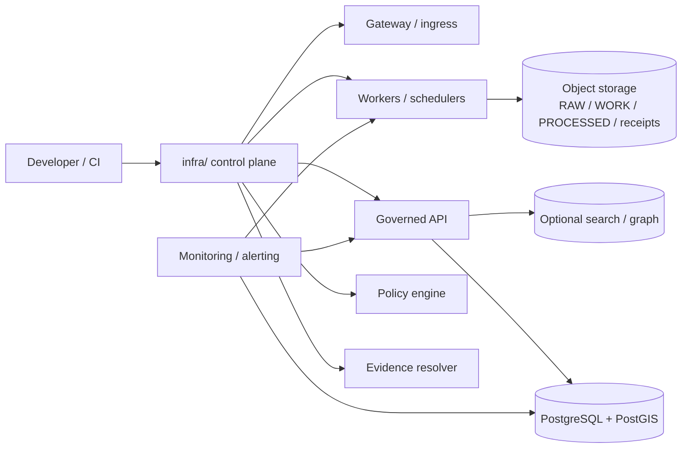

<!-- [KFM_META_BLOCK_V2]
doc_id: kfm://doc/4df40d18-1ed7-4dfd-9c91-8a93115c93c8
title: infra/README.md
type: standard
version: v1
status: draft
owners: @bartytime4life
created: 2026-03-07
updated: 2026-03-07
policy_label: public
related: ["../README.md", "../docs/", "../policy/", "../contracts/", "../data/", "../tests/"]
tags: [kfm, infra, deployment, operations, platform]
notes: ["Replaces placeholder infra README", "Separates current branch facts from proposed target layout"]
[/KFM_META_BLOCK_V2] -->

# infra
Deployment, runtime, and operations definitions for Kansas Frontier Matrix.

> **Status:** experimental  
> **Owners:** @bartytime4life (repo-default owner until `/infra/*` is explicitly assigned)  
>       
> **Quick links:** [Scope](#scope) · [Repo fit](#repo-fit) · [Accepted inputs](#accepted-inputs) · [Exclusions](#exclusions) · [Current branch snapshot](#current-branch-snapshot) · [Target layout](#target-layout-proposed) · [Quickstart](#quickstart) · [Usage](#usage) · [Architecture](#architecture) · [PR gates](#infra-change-requirements) · [Definition of done](#task-list--definition-of-done) · [FAQ](#faq) · [Appendix](#appendix)

## Scope

| Status | Statement |
|---|---|
| **CONFIRMED** | `infra/` is the repo area for deployment and operations. |
| **CONFIRMED** | KFM infrastructure must preserve the truth path, trust membrane, governed API boundary, and fail-closed promotion behavior. |
| **PROPOSED** | This directory should grow into the executable control plane for local bring-up, cloud infrastructure, orchestration, observability, and rollback. |
| **UNKNOWN** | The current public branch does not yet prove which `infra/` subdirectories, environment overlays, or automation assets exist beyond this README. |

KFM infrastructure is not “just deployment.” It is the part of the repo that turns governance into runtime behavior: policy must stay in the request path, storage must stay behind the trust membrane, and publication must remain a governed state transition rather than a file copy.

## Repo fit

**Path:** `/infra/README.md`

**Purpose:** define what belongs in `infra/`, what must stay out, and how infrastructure changes should preserve KFM’s evidence-first operating model.

**Upstream**
- [`../README.md`](../README.md) for repo-wide posture and trust model
- [`../docs/`](../docs/) for architecture notes, runbooks, and ADRs
- [`../policy/`](../policy/) for policy-as-code and fixtures
- [`../contracts/`](../contracts/) for public contract surfaces
- [`../data/`](../data/) for lifecycle zones and publishable artifacts

**Downstream**
- [`../apps/`](../apps/) runtime services that consume infra definitions
- [`../tests/`](../tests/) validation, smoke, and operational checks
- [`../.github/`](../.github/) workflow automation and merge discipline
- any future executable assets created under `infra/`

**Use this directory for**
- infrastructure-as-code
- runtime orchestration
- environment overlays
- monitoring and alerting definitions
- rollout and rollback helpers
- secret *references* and configuration templates without secret values

**Do not use this directory for**
- application business logic
- dataset manifests or publishable data artifacts
- long-form runbooks and ADR narratives
- policy semantics that belong in `../policy/`
- secrets, credentials, tokens, or `.env` files with real values

## Accepted inputs

| Input type | Examples | Why it belongs here |
|---|---|---|
| Local orchestration | Docker Compose, dev stack wiring, preview environment definitions | Supports repeatable local-first bring-up. |
| Infrastructure-as-code | Terraform, bootstrap modules, environment provisioning, bucket/database/network definitions | Makes infra reviewable, reproducible, and reversible. |
| Cluster/runtime manifests | Kubernetes manifests, Kustomize overlays, ingress, service wiring, workers, scheduled jobs | Keeps deployment topology under version control. |
| Monitoring assets | dashboards, alerts, SLO configs, telemetry rules | Makes operations observable and reviewable. |
| Rollout helpers | smoke checks, release hooks, promotion helpers, restore helpers | Supports governed delivery and rollback. |
| Config templates | non-secret environment templates, service defaults, port maps, feature toggles | Allows safe configuration without leaking secrets. |

## Exclusions

| Exclusion | Why it stays out | Where it goes instead |
|---|---|---|
| Secrets, tokens, credentials | Never commit secrets into the repo. | Secret manager, vault, CI secret store, or environment injection. |
| App/domain business logic | Infra should wire services, not implement their behavior. | `../apps/` and `../packages/` |
| Dataset registries and catalog artifacts | Those are governed data surfaces, not deployment definitions. | `../data/` |
| Policy bundles and fixture logic | Infra enforces policy paths but does not own policy semantics. | `../policy/` |
| Long-form runbooks, ADRs, and incident narratives | Human-facing operational prose belongs with docs. | `../docs/` |
| Generated receipts, bundles, and publishable outputs | Build outputs are not hand-maintained infra source. | truth-path zones under `../data/` |

## Current branch snapshot

This README replaces the placeholder and turns `infra/` into a documented production surface.

### Current tree

```text
infra/
└── README.md
```

### Current-state rule

Treat everything below as a **target contract** until the corresponding files and directories actually exist on the branch you are working on.

## Target layout (PROPOSED)

```text
infra/
├── README.md
├── compose/
│   ├── local/
│   └── preview/
├── kubernetes/
│   ├── base/
│   └── overlays/
├── terraform/
│   ├── bootstrap/
│   ├── shared/
│   └── envs/
├── gitops/
│   ├── apps/
│   └── environments/
├── monitoring/
│   ├── dashboards/
│   ├── alerts/
│   └── slo/
└── scripts/
```

### Target layout notes

| Path | Purpose |
|---|---|
| `compose/` | Local-first and preview stack wiring for development and smoke verification. |
| `kubernetes/` | Runtime workload definitions and environment overlays. |
| `terraform/` | Cloud primitives, stateful service wiring, object storage, networking, and identity plumbing. |
| `gitops/` | Promotion-aware environment state, sync targets, and deploy intent. |
| `monitoring/` | Dashboards, alerts, SLO definitions, and operational telemetry assets. |
| `scripts/` | Small infra-only helpers that stay reviewable and reversible. |

[Back to top](#infra)

## Quickstart

### 1) Verify before you modify

```bash
git rev-parse HEAD
find infra -maxdepth 3 -print | sort
sed -n '1,120p' .github/CODEOWNERS
find .github -maxdepth 3 -type f | sort
```

### 2) Start a small, reversible change

```bash
git checkout -b docs/infra-readme
git status
```

### 3) Review the repo-wide trust boundary before adding infra

```bash
grep -RIn "EvidenceRef\|EvidenceBundle\|policy\|rego\|PostGIS\|trust membrane" README.md docs policy contracts 2>/dev/null || true
```

### 4) Keep claims honest

Document **only** what exists on the current branch as **CONFIRMED**.  
Document intended structure or future deployment shape as **PROPOSED**.  
Leave anything branch-uncertain as **UNKNOWN** until verified.

## Usage

### Local-first development
Use `infra/` to define a repeatable developer stack that mirrors the production layering without pretending the local environment is production. Local bring-up should keep storage, API, policy, and observability boundaries visible.

### Production deployment
Use `infra/` to define environment provisioning, runtime placement, rollout sequencing, and restoration paths. Production wiring must preserve the governed API boundary and never expose storage directly to clients.

### Monitoring and operations
Use `infra/` to keep operational definitions versioned alongside code: dashboards, alerts, SLOs, smoke checks, and infra-side rollback helpers.

### What “done” looks like here
Infra work is not done when services merely start. It is done when the deployment path is reviewable, rollback is credible, monitoring is updated, and the trust model still holds.

## Architecture

Infrastructure must uphold the same KFM runtime rules documented elsewhere in the repo:

- clients do **not** access storage or databases directly
- policy stays in the runtime path
- evidence resolution remains reachable from governed surfaces
- promoted artifacts remain distinct from rebuildable runtime indexes and caches

### Infra view of the runtime


```mermaid
flowchart LR
  Dev[Developer / CI] --> Infra[infra/ control plane]
  Infra --> Edge[Gateway / ingress]
  Infra --> API[Governed API]
  Infra --> Jobs[Workers / schedulers]
  Infra --> Policy[Policy engine]
  Infra --> Resolver[Evidence resolver]
  API --> PG[(PostgreSQL + PostGIS)]
  Jobs --> OBJ[(Object storage\nRAW / WORK / PROCESSED / receipts)]
  API --> IDX[(Optional search / graph)]
  Mon[Monitoring / alerting] --> API
  Mon --> Jobs
  Mon --> PG
```

### Layer responsibilities

| Layer | Infra responsibility | Must never happen |
|---|---|---|
| Edge / ingress | route traffic to governed services, terminate TLS, carry identity context | direct public access to storage or DB ports |
| Governed API | stay as the public contract surface for reads/writes | bypass policy or hand out raw store pointers |
| Policy / evidence | remain in-request or pre-validated in the execution path | become optional “best effort” checks |
| Storage / databases | stay private, durable, and recoverable | become de facto public interfaces |
| Monitoring | expose latency, failures, freshness, policy denials, and restore health | rely on informal logs only |

## Deployment profiles

### Local-first profile (PROPOSED)
A practical local stack should default to:
- local or emulated object storage for canonical artifacts
- PostgreSQL with PostGIS
- optional graph/search services only when they add value
- FastAPI or equivalent governed API
- policy checks that remain exercisable locally
- repeatable bring-up through Compose or an equivalent thin orchestration layer

### Cloud-ready profile (PROPOSED)
A practical production stack should default to:
- versioned object storage for canonical artifacts
- PostgreSQL + PostGIS as the primary operational store
- managed identity using OAuth2/OIDC or equivalent
- orchestration for API, workers, UI, and scheduled jobs
- centralized logs, metrics, traces, and artifact attestation/signing

### Canonical vs rebuildable
Infra should treat the following as **canonical** unless explicitly reclassified:
- raw and processed object storage
- catalog/triplet artifacts
- release manifests and run receipts
- policy decisions and approval records that matter for release history

Infra should treat the following as **rebuildable** unless explicitly promoted:
- caches
- tile layers
- denormalized summary tables
- search indexes
- derived graph projections

[Back to top](#infra)

## Infra change requirements

Every non-trivial infra change should be small, reversible, and documented.

| Change type | Minimum artifacts |
|---|---|
| Infra definition change | IaC diff, rollback path, monitoring update note, docs update |
| New environment or overlay | environment definition, secret reference model, smoke checklist |
| Storage or stateful service change | migration note, backup impact note, restore plan |
| Network or identity change | ingress/auth change note, policy-impact review, test note |
| Observability change | dashboard/alert diff, SLO impact note, validation evidence |

### PR checklist for this directory

- [ ] Scope is small and reversible
- [ ] Real secrets remain out of the repo
- [ ] Any new public pathway still crosses the governed boundary
- [ ] Monitoring changes are included or explicitly not needed
- [ ] Rollback is described in plain language
- [ ] Docs changed with behavior, or rationale for no doc change is explicit

## Task list / Definition of done

### For any serious infra PR

- [ ] The branch reality is described honestly as **CONFIRMED / PROPOSED / UNKNOWN**
- [ ] Ownership and review routing are clear
- [ ] Runtime boundaries still block direct UI/client access to stores
- [ ] Policy checks remain present in all public-serving paths
- [ ] Backup and restore implications are documented
- [ ] Rollback restores a previous known-good state rather than mutating canonical artifacts in place
- [ ] Smoke verification steps are attached
- [ ] Monitoring and alerting updates are included
- [ ] Related docs in `../docs/` or `../README.md` are updated if needed

### Before any environment is treated as release-ready

- [ ] object storage is versioned or otherwise immutable where required
- [ ] PostGIS backup and restore path is tested
- [ ] environment recreation is possible from reviewed definitions
- [ ] API, worker, and scheduled job health checks are present
- [ ] logs, metrics, and traces are correlated enough to debug a bad release
- [ ] rollback has been rehearsed, not merely described

## FAQ

### Why keep infra separate from docs?
Because `infra/` should hold executable operational definitions. Long-form human guidance belongs in `../docs/`, but the artifacts that actually provision, deploy, and observe environments belong here.

### Can infra expose PostGIS or object storage directly to clients?
No. KFM’s trust membrane requires clients to cross governed interfaces, not storage endpoints.

### Where do secrets go?
Outside the repo. Store only templates, variable names, and secret references here.

### Can this directory document a target layout before files exist?
Yes, but only as **PROPOSED**. Never present a target tree as current branch fact.

### When should `/infra/*` get its own explicit CODEOWNERS rule?
As soon as platform ownership splits from the repo-default owner or infra changes require different review routing than the rest of the repo.

## Appendix

<details>
<summary>Target command shapes (placeholders until assets exist)</summary>

Use these only after the corresponding files actually land on the branch.

```bash
# local-first compose
docker compose -f infra/compose/local/compose.yml up --build

# cluster overlay
kubectl apply -k infra/kubernetes/overlays/dev

# cloud plan
terraform -chdir=infra/terraform/envs/dev plan

# smoke
bash infra/scripts/smoke.sh

# rollback
bash infra/scripts/rollback.sh
```

</details>

<details>
<summary>Questions to answer before marking infra as active</summary>

1. Which subdirectories under `infra/` actually exist on the branch?  
2. Which workflow checks block merges for infra changes?  
3. Which environments are real, and which are only proposed?  
4. How are secrets injected for local, preview, and production?  
5. What is the current restore drill for PostGIS and object storage?  
6. Which dashboards and alerts are required before release?  
7. Is there an explicit `/infra/*` ownership rule yet?  

</details>

[Back to top](#infra)