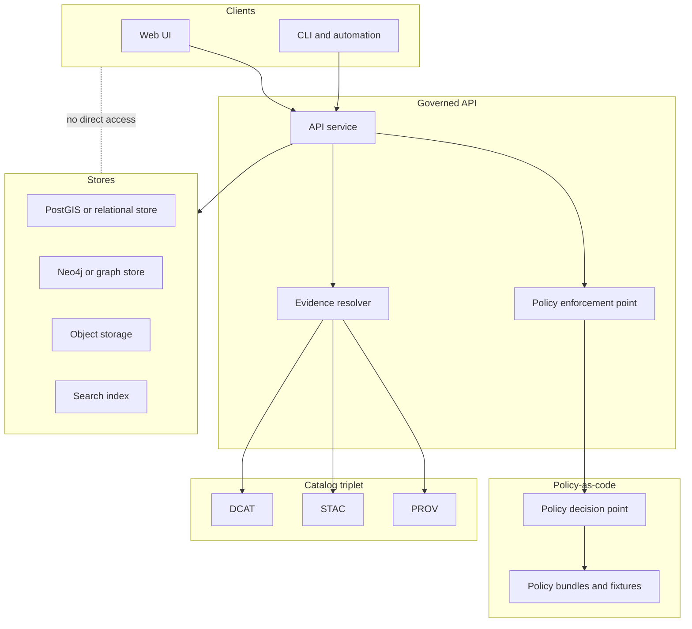

<!-- [KFM_META_BLOCK_V2]
doc_id: kfm://doc/4c1f3ce4-5f33-4b1a-9d6a-0d5d8e5f3f7a
title: infra — Infrastructure & Deployment
type: standard
version: v1
status: draft
owners: KFM Platform Team (UNKNOWN — verify CODEOWNERS)
created: 2026-03-03
updated: 2026-03-03
policy_label: restricted
related:
  - ../README.md
  - ../docs/ (UNKNOWN — verify paths)
  - ../policy/ (CONFIRMED concept; verify path)
  - ../contracts/ (CONFIRMED concept; verify path)
tags: [kfm, infra, iac, deployment, governance]
notes:
  - Evidence-first: every meaningful claim is tagged CONFIRMED / PROPOSED / UNKNOWN.
  - Treat UNKNOWN as “do not rely on” until verified in-repo.
  - Infra is a policy surface: network, identity, secrets, and exposure controls must fail-closed.
[/KFM_META_BLOCK_V2] -->

# `infra/` — Infrastructure & Deployment
One home for **Infrastructure-as-Code**, **deployment plumbing**, and **ops guardrails** that make KFM reproducible, governed, and fail-closed.

> **IMPACT**
> - **Status:** experimental (doc: draft)
> - **Owners:** KFM Platform Team *(UNKNOWN — verify `CODEOWNERS`)*
> - **Policy label:** `restricted`
> - **Non-negotiables:** trust membrane, truth path lifecycle zones, promotion gates, policy parity in CI + runtime
> - **Quick links:** [Scope](#scope) • [Where it fits](#where-it-fits-in-kfm) • [Hard invariants](#hard-invariants-test-enforced) • [Directory contract](#directory-contract) • [Quickstart](#quickstart) • [Topology](#reference-topology-trust-membrane) • [PR gates](#how-infra-changes-ship) • [Ops](#ops--reliability)


<!-- TODO: replace with real workflow badge paths once known -->
<!--  -->

---

## Quick navigation

- [Conventions](#conventions)
- [Scope](#scope)
- [Where it fits in KFM](#where-it-fits-in-kfm)
- [Hard invariants](#hard-invariants-test-enforced)
- [Directory contract](#directory-contract)
- [Quickstart](#quickstart)
- [Reference topology](#reference-topology-trust-membrane)
- [How infra changes ship](#how-infra-changes-ship)
- [Environment matrix](#environment-matrix)
- [Secrets and configuration](#secrets-and-configuration)
- [Supply chain and artifact trust](#supply-chain-and-artifact-trust)
- [Ops and reliability](#ops--reliability)
- [FAQ](#faq)
- [Appendix](#appendix)

---

## Conventions

### Evidence tags (required)

- **CONFIRMED** — stated as a requirement in KFM design/governance docs *or* verified in-repo.
- **PROPOSED** — recommended pattern; may not be implemented yet.
- **UNKNOWN** — not validated; includes smallest verification steps.

> **Rule (CONFIRMED):** When policy/rights/citations are unclear, **block promotion/publishing** (fail-closed posture).  
> Implementation details can vary, but the posture does not.  

### Terms (KFM-specific)

- **Truth path** (CONFIRMED): lifecycle zones that make datasets reproducible and auditable:  
  `Upstream → RAW → WORK/Quarantine → PROCESSED → CATALOG/TRIPLET → PUBLISHED`
- **Trust membrane** (CONFIRMED): clients never reach storage directly; all access is policy-evaluated at enforcement points.
- **Catalog triplet** (CONFIRMED concept): **DCAT + STAC + PROV** used as contract surfaces between pipelines and runtime.
- **Promotion Contract** (CONFIRMED concept): minimum gates required to move data between zones.

---

## Scope

### What belongs here (in-scope)

- **Infrastructure-as-Code** (PROPOSED): Terraform/Pulumi/Crossplane, cloud primitives, identity/IAM bindings.
- **Runtime orchestration** (PROPOSED): Kubernetes manifests, Helm charts, Kustomize overlays, GitOps config.
- **Policy plumbing** (PROPOSED): admission controls, network policies, ingress exposure rules, OPA wiring.
- **Observability plumbing** (PROPOSED): dashboards, alert rules, scrape configs, trace exporters.
- **Operations docs** (PROPOSED): bring-up, rollback, backup/restore, incident runbooks.
- **Deployment automation** (PROPOSED): scripts or Make targets that render/validate/apply infra safely.

### What must NOT be here (explicit exclusions)

- **Secrets** (CONFIRMED): no private keys, tokens, kubeconfigs, `.tfvars` with credentials, or real `.env` files.
- **Application/domain logic** (CONFIRMED): no API/UI business logic; keep it in `apps/` and `packages/`.
- **Raw datasets or publishable artifacts** (CONFIRMED): data belongs in lifecycle zones, not in `infra/`.
- **Direct client-to-store wiring** (CONFIRMED): UI/clients must never talk directly to PostGIS/Neo4j/object storage/search indexes.

---

## Where it fits in KFM

### Repo-level context (CONFIRMED concept; implementation may vary)

KFM is organized into modular layers; `infra/` is the **deployment + operations** layer, alongside:
- `apps/` (services), `packages/` (shared libraries), `contracts/` (schemas/OpenAPI), `policy/` (Rego + fixtures), `data/` (registry + zones + catalogs). (CONFIRMED concept)

> **Implementation state (UNKNOWN):** the exact contents under `infra/` vary by stack. Verify current tree before relying on any layout.

### Upstream / downstream connections (PROPOSED)

- **Upstream:** `.github/workflows/` for CI gates; `policy/` for Rego bundles; `contracts/` for schemas; `data/` for promotion inputs.
- **Downstream:** clusters, registries, secret stores, and monitoring backends.

---

## Hard invariants (test-enforced)

These are infra-enforced constraints. If infra can’t enforce them automatically, it must fail-closed until it can.

1) **Truth path lifecycle zones exist (CONFIRMED)**  
`Upstream → RAW → WORK/Quarantine → PROCESSED → CATALOG/TRIPLET → PUBLISHED`.  
Infra must ensure transitions happen only via gated jobs and auditable events.

2) **Promotion Contract gates exist (CONFIRMED concept)**  
Promotion gates include at least: identity/versioning, licensing/rights, sensitivity/redaction plan, and catalog triplet validation.  
Infra must make “missing gate evidence” block merges/promotions.

3) **Trust membrane is mandatory (CONFIRMED)**  
Network + code rules must prevent direct client → store access; all reads/writes go through governed interfaces.

4) **Policy parity across CI and runtime (CONFIRMED)**  
The same policy semantics (or at minimum the same fixtures/outcomes) must be enforced in CI and at runtime.

5) **Catalog triplet is a contract surface (CONFIRMED concept)**  
Catalogs (DCAT/STAC/PROV) are not “nice metadata”; they are the canonical interface between pipeline outputs and runtime, enabling deterministic evidence resolution.

> **Implementation note (PROPOSED):** encode invariants as CI checks + policy tests + network policies. Do not rely on tribal memory.

---

## Directory contract

### What we can say confidently

- `infra/` is reserved for **deployment and operations** work (Kubernetes/Terraform/GitOps, dashboards). (CONFIRMED concept)

### What is UNKNOWN (and must be verified)

- Which IaC tools are in use (Terraform vs Pulumi vs Crossplane).
- Whether GitOps is Argo CD, Flux, or something else.
- Whether Kubernetes is used in all environments or only cloud.
- Current runbooks / disaster recovery maturity.

**Smallest verification steps (to convert UNKNOWN → CONFIRMED):**
1. Capture tree: `tree -L 3 infra/`
2. Identify toolchains: search for `*.tf`, `Chart.yaml`, `kustomization.yaml`, `argocd*`, `flux*`
3. Inspect CI: search `.github/workflows/` for `infra/` jobs and required checks
4. Confirm owners: read `CODEOWNERS` and `.github/`

### Recommended baseline layout (PROPOSED)

```text
infra/
  README.md

  terraform/
    modules/
    envs/

  helm/
    charts/
    values/

  k8s/
    base/
    overlays/

  gitops/
    apps/
    clusters/

  policy-runtime/
    admission/
    network/

  monitoring/
    dashboards/
    alerts/

  runbooks/
    bringup.md
    rollback.md
    backup_restore.md

  scripts/
    validate.sh
    render.sh
```

---

## Quickstart

> These commands are **PROPOSED** until you wire them to real tooling in this repo.

### Local validation (safe, read-only)

```bash
# From repo root
# 1) static checks
terraform fmt -recursive -check 2>/dev/null || true
helm lint infra/helm/charts/* 2>/dev/null || true

# 2) render manifests (no apply)
helm template kfm infra/helm/charts/kfm 2>/dev/null || true
kustomize build infra/k8s/overlays/dev 2>/dev/null || true

# 3) schema & policy checks (examples)
kubeconform -strict -summary <(kustomize build infra/k8s/overlays/dev) 2>/dev/null || true
conftest test receipts/run_receipt.json -p policy/opa 2>/dev/null || true
```

### “Show me what will change” (PROPOSED)

```bash
# Terraform plan (never apply from an unreviewed local state)
terraform -chdir=infra/terraform/envs/dev init
terraform -chdir=infra/terraform/envs/dev plan -out tfplan
```

---

## Reference topology (trust membrane)

This is a **reference** architecture: requirements are CONFIRMED, concrete components are PROPOSED.


```mermaid
flowchart TB
  subgraph Clients["Clients"]
    UI["Web UI"]
    CLI["CLI and automation"]
  end

  subgraph API["Governed API"]
    APISVC["API service"]
    PEP["Policy enforcement point"]
    EVID["Evidence resolver"]
  end

  subgraph Policy["Policy-as-code"]
    PDP["Policy decision point"]
    BUNDLE["Policy bundles and fixtures"]
  end

  subgraph Catalogs["Catalog triplet"]
    DCAT["DCAT"]
    STAC["STAC"]
    PROV["PROV"]
  end

  subgraph Stores["Stores"]
    DB["PostGIS or relational store"]
    GRAPH["Neo4j or graph store"]
    OBJ["Object storage"]
    IDX["Search index"]
  end

  UI --> APISVC
  CLI --> APISVC

  APISVC --> PEP
  APISVC --> EVID
  PEP --> PDP
  PDP --> BUNDLE

  EVID --> DCAT
  EVID --> STAC
  EVID --> PROV

  APISVC --> Stores

  %% Trust membrane statement as edges
  Clients -. no direct access .- Stores
```

---

## How infra changes ship

### Branch + PR workflow (PROPOSED)

- All infra changes ship via PRs.
- Infra PRs include machine-readable evidence:
  - Terraform plan output
  - Rendered manifests (Helm template / Kustomize build)
  - Policy test outputs (Conftest/OPA)
- Protected branches require required checks (policy + contracts).

### Definition of Done (infra PR) — fail-closed checklist (PROPOSED)

- [ ] **No secrets added** (secret scan passes; no kubeconfig, no real `.env`, no credential `.tfvars`)
- [ ] **Deterministic toolchain** (pinned provider/chart versions; lockfiles committed where applicable)
- [ ] **Plan artifacts attached** (terraform plan, helm template, kustomize output)
- [ ] **Policy checks pass** (OPA/Rego fixtures and Conftest gate)
- [ ] **Exposure reviewed** (no new public ingress without approval trail)
- [ ] **Rollback documented** (explicit revert path and restore notes)
- [ ] **Runbooks updated** if behavior changed

---

## Environment matrix

> This matrix is **PROPOSED** until confirmed against repo + deployed state.

| Environment | Goal | Allowed data | Exposure | Notes |
|---|---|---|---|---|
| local | dev iteration | synthetic or public only | localhost | PROPOSED |
| dev | integration | least-sensitive subsets | private | PROPOSED |
| staging | rehearsal | prod-like masked | private | PROPOSED |
| prod | governed runtime | per policy label | controlled | PROPOSED |

---

## Secrets and configuration

### Non-negotiables

- **No secrets in git** (CONFIRMED).
- **Least privilege** for CI/CD identities (PROPOSED, become CONFIRMED once enforced).
- **Short-lived credentials** preferred (PROPOSED).

### Recommended patterns (pick one; enforce it) (PROPOSED)

- Cloud secret manager (AWS/GCP/Azure)
- External Secrets operator (Kubernetes)
- SOPS + KMS (GitOps-friendly)
- Sealed secrets *(only with explicit governance acceptance)*

---

## Supply chain and artifact trust

> Goal (CONFIRMED concept): what runs and what gets published must be **verifiable by digest**, not trusted by convention.

### Required artifacts (PROPOSED baseline)

- **SBOM** for built images and runnable components
- **Provenance attestation** (SLSA-style or equivalent)
- **Policy decision record** (what policy version decided allow/deny, with reasons)
- **Receipts** for promotion/publishing events (run receipt, manifests, digests)

### Policy gate (PROPOSED)

In CI:
1. Build artifact → compute digest
2. Attach SBOM + attest provenance
3. Verify signatures/attestations
4. Run Conftest policy checks over SBOM + provenance
5. Block merge/promotion on any deny

> **Fail-closed rule (PROPOSED):** if verification can’t run (tooling missing), the check fails.

---

## Ops & reliability

### Required operational surfaces (PROPOSED)

- **Structured logs** centralized
- **Metrics** aligned to SLOs (API + pipeline + policy)
- **Traces** across API → evidence resolver → stores
- **Backups** (PostGIS/Neo4j/object storage) with restore drills
- **Runbooks** for bring-up, rollback, incident response

### Rollback posture (PROPOSED)

- Infra changes must have an explicit rollback path (pin + revert).
- Publishing/promotion events must be auditable and reversible via superseding versions (never “erase history”).

---

## FAQ

**Why is this doc so strict about “UNKNOWN”?**  
Because statements about concrete deployed infra are unsafe unless evidenced; KFM’s posture is to fail closed.

**Can the UI ever connect directly to PostGIS/Neo4j/object storage?**  
No. That violates the trust membrane.

**Where do policy rules live?**  
In `policy/` (expected) and enforced both in CI and runtime (policy parity requirement).

---

## Appendix

<details>
<summary><strong>A. Suggested infra validation jobs (PROPOSED)</strong></summary>

- `infra:terraform`  
  - `terraform fmt -check`
  - `terraform validate`
  - `terraform plan` (attach artifact)

- `infra:k8s-render`  
  - `helm lint`
  - `helm template`
  - `kustomize build`
  - `kubeconform` or similar schema checks

- `infra:policy`  
  - `conftest test ... -p policy/opa`
  - fixture-driven allow/deny tests

- `infra:exposure`  
  - deny public ingress by default unless explicitly approved (policy-based)

</details>

<details>
<summary><strong>B. Verification checklist (convert UNKNOWN → CONFIRMED)</strong></summary>

- [ ] Capture repo commit hash and root tree (attach to next doc revision)
- [ ] Identify which infra tools are in use (Terraform/Helm/Kustomize/GitOps)
- [ ] Extract required checks list from `.github/workflows/`
- [ ] Confirm network policy posture prevents policy bypass
- [ ] Confirm backups + restore drill exist for stores used by your deployment

</details>

_Back to top:_ [↑](#infra--infrastructure--deployment)
