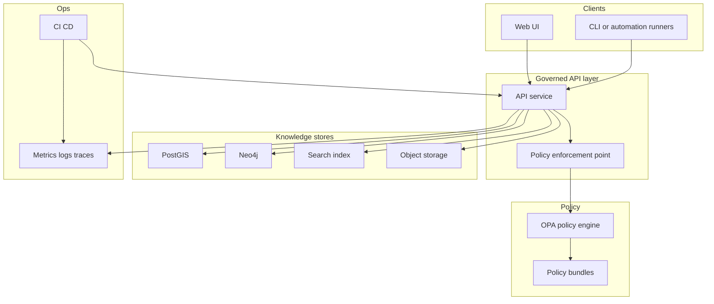

<!-- [KFM_META_BLOCK_V2]
doc_id: kfm://doc/4c1f3ce4-5f33-4b1a-9d6a-0d5d8e5f3f7a
title: infra — Infrastructure & Deployment
type: standard
version: v1
status: draft
owners: KFM Platform Team (UNKNOWN — verify CODEOWNERS)
created: 2026-03-03
updated: 2026-03-03
policy_label: restricted
related:
  - ../README.md
  - ../docs/ (UNKNOWN — verify paths)
tags: [kfm, infra, iac, deployment, governance]
notes:
  - This README is written evidence-first: every meaningful claim is tagged CONFIRMED, PROPOSED, or UNKNOWN.
  - Treat UNKNOWN as “do not rely on” until verified in-repo.
[/KFM_META_BLOCK_V2] -->

# `infra/` — Infrastructure & Deployment

**Purpose (CONFIRMED):** This directory is the home for deployment infrastructure (e.g., Kubernetes / Terraform / GitOps artifacts), including items like Helm charts, Terraform modules, and operational dashboards.  
**Status:** draft • **Policy posture (CONFIRMED):** default-deny / fail-closed • **Owners:** see MetaBlock


---

## Quick navigation

- [Evidence tags](#evidence-tags)
- [What belongs in `infra/`](#what-belongs-in-infra)
- [Hard invariants](#hard-invariants)
- [Reference deployment topology](#reference-deployment-topology)
- [Directory contract](#directory-contract)
- [How infra changes ship](#how-infra-changes-ship)
- [Environment matrix](#environment-matrix)
- [Secrets and configuration](#secrets-and-configuration)
- [Ops and reliability](#ops-and-reliability)
- [Appendix](#appendix)

---

## Evidence tags

This repo uses three tags for every meaningful claim:

- **CONFIRMED** — anchored in KFM source docs (or verified in-repo).
- **PROPOSED** — recommended contract/pattern; may not be implemented yet.
- **UNKNOWN** — not validated here; includes smallest verification steps.

> **Rule (CONFIRMED):** When in doubt, fail closed: do not assume infra exists, is configured, or is safe until verified.

---

## What belongs in `infra/`

### In-scope inputs

- **Infrastructure-as-Code** (PROPOSED): Terraform, Pulumi, Crossplane, etc.
- **Cluster manifests** (PROPOSED): Kubernetes YAML, Kustomize overlays, Helm charts.
- **GitOps configuration** (PROPOSED): Argo CD / Flux / similar.
- **Runtime platform config** (PROPOSED): ingress, cert-manager, DNS, IAM bindings, network policies.
- **Observability plumbing** (PROPOSED): dashboards, alerts-as-code, scrape configs.
- **Deployment/runbooks** (PROPOSED): environment bring-up, rollback, backup/restore, incident response.

### Explicitly out of scope

- **Secrets** (CONFIRMED): no private keys, tokens, kubeconfigs, `.tfvars` with credentials, or `.env` with secrets.
- **Application logic** (CONFIRMED): no API/UI domain code here (keep in `apps/` / `packages/`).
- **Raw datasets / governed artifacts** (CONFIRMED): data belongs in lifecycle zones (`RAW → WORK → PROCESSED → CATALOG → PUBLISHED`), not in infra.
- **Direct client-to-database wiring** (CONFIRMED): UI/clients must never talk to stores directly (see invariants).

---

## Hard invariants

These are non-negotiable constraints that infra must enforce.

1) **Policy boundary is mandatory (CONFIRMED)**  
All access to data crosses a governed API layer and policy enforcement; clients do not connect to storage/databases directly.

2) **Truth path lifecycle exists (CONFIRMED)**  
Data promotion is gated and auditable across: `RAW → WORK → PROCESSED → CATALOG → PUBLISHED`.

3) **Default-deny / fail-closed (CONFIRMED)**  
If policy checks, validation, or provenance checks fail, infra should block promotion and/or block exposure.

4) **No secrets in repo (CONFIRMED)**  
Infrastructure must assume secrets live in an external secret manager or sealed mechanism.

> **Implementation note (PROPOSED):** encode these invariants as CI checks and policy tests (do not rely on tribal knowledge).

---

## Reference deployment topology

This is a conceptual map of the system boundary and trust membrane.  
It is a **reference** topology (CONFIRMED concept; PROPOSED specifics).


```mermaid
flowchart TB
  subgraph Client["Clients"]
    UI["Web UI"]
    CLI["CLI or automation runners"]
  end

  subgraph API["Governed API layer"]
    APISVC["API service"]
    PEP["Policy enforcement point"]
  end

  subgraph Policy["Policy"]
    OPA["OPA policy engine"]
    REGO["Policy bundles"]
  end

  subgraph Stores["Knowledge stores"]
    PG["PostGIS"]
    N4J["Neo4j"]
    IDX["Search index"]
    OBJ["Object storage"]
  end

  subgraph Ops["Ops"]
    OBS["Metrics logs traces"]
    CI["CI CD"]
  end

  UI --> APISVC
  CLI --> APISVC

  APISVC --> PEP
  PEP --> OPA
  OPA --> REGO

  APISVC --> PG
  APISVC --> N4J
  APISVC --> IDX
  APISVC --> OBJ

  APISVC --> OBS
  CI --> OBS
  CI --> APISVC
```

---

## Directory contract

### What we know

- `infra/` is intended for deployment infrastructure (K8s, Terraform, GitOps) and artifacts like Helm charts, Terraform modules, and dashboards. (CONFIRMED)

### What we don’t know (yet)

Because this README is being created without a live directory listing, **the exact layout under `infra/` is UNKNOWN**.

**Smallest verification steps (for UNKNOWN items):**
1. List current contents: `ls -la infra/`
2. Identify tooling: look for `*.tf`, `Chart.yaml`, `kustomization.yaml`, `argocd*`, `flux*`
3. Check CI paths: search workflows for `infra/` references
4. Confirm owners: inspect `CODEOWNERS` and `.github/`

### Recommended baseline layout

> This layout is a **PROPOSED** contract. Adopt it if it matches your stack; otherwise keep the section but update statuses to CONFIRMED/UNKNOWN.

```text
infra/
  README.md                    # This file

  terraform/                   # PROPOSED: IaC modules, env roots, remote state wiring
    modules/
    envs/

  helm/                        # PROPOSED: service charts + shared chart library
    charts/
    values/

  k8s/                         # PROPOSED: raw manifests or Kustomize overlays
    base/
    overlays/

  gitops/                      # PROPOSED: Argo/Flux apps, app-of-apps, sync policies
    apps/
    clusters/

  monitoring/                  # PROPOSED: dashboards + alerts-as-code
    dashboards/
    alerts/

  scripts/                     # PROPOSED: thin wrappers (lint/plan/apply/validate)
```

---

## How infra changes ship

### Branch + PR workflow

- All infra changes go through PRs. (PROPOSED; set to CONFIRMED once enforced)
- The PR must attach machine-readable evidence (plans, diffs, rendered manifests). (PROPOSED)
- Protected branches must require passing checks (policy + contracts). (PROPOSED)

### Minimum “Definition of Done” for infra PRs

Checklist (PROPOSED):

- [ ] **No secrets added** (scan passes; no `.env`, no kubeconfig, no private keys)
- [ ] **Deterministic outputs** where applicable (e.g., pinned provider/chart versions)
- [ ] **Plan artifacts attached** (Terraform plan, Helm template render, Kustomize build output)
- [ ] **Policy tests pass** (OPA/Rego, admission policies, governance rules)
- [ ] **Rollback documented** (what to revert, how to restore previous state)
- [ ] **Runbook updated** if behavior changed

---

## Environment matrix

This is a **PROPOSED** view until you confirm actual supported envs.

| Environment | Goal | Allowed data | Exposure | Status |
|---|---|---|---|---|
| local | developer iteration | synthetic or public only | localhost | PROPOSED |
| dev | integration testing | least-sensitive subsets | private | PROPOSED |
| staging | pre-prod rehearsal | prod-like (masked) | private | PROPOSED |
| prod | governed runtime | per policy label | controlled | PROPOSED |

> **Reminder (CONFIRMED):** “latest/current” infra behavior must be verified per environment and date; do not assume parity.

---

## Secrets and configuration

### Non-negotiables

- **No secrets in git** (CONFIRMED).
- **Least privilege** for any credentials used by CI/CD (PROPOSED; make CONFIRMED once implemented).
- **Short-lived tokens** preferred (PROPOSED).

### Recommended patterns

Pick one, document it, and enforce it (PROPOSED):

- Cloud secret manager (AWS Secrets Manager, GCP Secret Manager, Azure Key Vault)
- Kubernetes External Secrets operator
- Sealed secrets (only if your governance model accepts it)
- SOPS + KMS (GitOps-friendly)

---

## Ops and reliability

### Required operational surfaces (PROPOSED)

- **Logs**: structured, centralized
- **Metrics**: SLO-aligned dashboards for API + pipelines
- **Traces**: end-to-end tracing across API → stores
- **Backups**: PostGIS/Neo4j backups + object store lifecycle rules
- **Runbooks**: restore procedures tested periodically

### Rollback posture (PROPOSED)

- IaC changes must have a rollback path (previous state / chart version / manifest revert).
- Data promotions must be reversible or superseded with an auditable corrective version.

---

## Appendix

### A. Common pitfalls

- (CONFIRMED) If clients can reach PostGIS/Neo4j directly, you have violated the trust membrane.
- (PROPOSED) If a chart upgrades without pinned versions, you will eventually break reproducibility.
- (PROPOSED) If policy bundles are not tested in CI, “default deny” becomes “default surprise.”

### B. TODOs for maintainers

- [ ] Replace UNKNOWN owner placeholder with real CODEOWNERS mapping.
- [ ] Confirm actual subdirectories under `infra/` and update the directory tree table.
- [ ] Add CI jobs for infra validation (terraform fmt/validate/plan, helm lint/template, kustomize build).
- [ ] Add policy checks for exposure boundaries (no public ingress without approval).
- [ ] Add a disaster recovery runbook link.

_Back to top:_ [↑](#infra--infrastructure--deployment)
