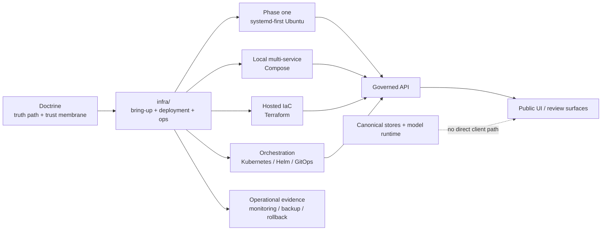

<!-- [KFM_META_BLOCK_V2]
doc_id: kfm://doc/NEEDS_VERIFICATION
title: infra
type: standard
version: v1
status: draft
owners: NEEDS_VERIFICATION
created: NEEDS_VERIFICATION
updated: 2026-03-18
policy_label: NEEDS_VERIFICATION
related: [NEEDS_VERIFICATION: ../README.md, NEEDS_VERIFICATION: ../docs/, NEEDS_VERIFICATION: ../contracts/, NEEDS_VERIFICATION: ../policy/, NEEDS_VERIFICATION: ../tests/, NEEDS_VERIFICATION: ../apps/api/README.md or ../apps/api/src/api/README.md]
tags: [kfm, infra, deployment, runtime, operations]
notes: [Drafted from the March 2026 KFM corpus plus direct current-session workspace inspection; no mounted repo checkout or live infra subtree was directly verified in this session.]
[/KFM_META_BLOCK_V2] -->

# infra

Bring-up, deployment, runtime control, observability, and rollback surface for Kansas Frontier Matrix.

> **Status:** experimental  
> **Owners:** NEEDS VERIFICATION  
> 
> 
> 
>   
> **Quick jump:** [Scope](#scope) · [Repo fit](#repo-fit) · [Accepted inputs](#accepted-inputs) · [Exclusions](#exclusions) · [Directory tree](#directory-tree) · [Quickstart](#quickstart) · [Usage](#usage) · [Diagram](#diagram) · [Operating tables](#operating-tables) · [Task list](#task-list--definition-of-done) · [FAQ](#faq) · [Appendix](#appendix)

> [!IMPORTANT]
> This README is **evidence-bounded**. The March 2026 KFM corpus is strong on the doctrinal role of `infra/`, deployment progression, trust boundaries, observability, and rollback requirements. The current session did **not** expose a mounted repository checkout, live `infra/` subtree, workflow directory, deployment manifests, or runtime logs. Treat exact subpaths, owners, manifests, and current deployment choices as **NEEDS VERIFICATION** until confirmed in the actual checkout.

> [!NOTE]
> The corpus supports two compatible infra emphases that should be read together, not as a contradiction:
>
> 1. `infra/` as the umbrella deployment-and-operations surface for Kubernetes, Terraform, GitOps, dashboards, backups, and rollout controls.
> 2. A **systemd-first, single-host Ubuntu** phase-one runtime as the thinnest credible first governed slice.
>
> This README keeps both: **phase one first, broader hosted/orchestrated lanes after that**.

---

## Scope

`infra/` is the repository surface for **bring-up, deployment, runtime control, exposure management, observability, restore, rollback, and operational correction**.

In KFM, that makes `infra/` more than a generic “ops” folder. Infrastructure choices can either preserve or weaken the trust membrane. A public client path that bypasses the governed API, a model server exposed for convenience, a restore plan that was never rehearsed, or a release with no retained rollback lineage are all infrastructure failures in the KFM sense.

**Repo-fit rule:** `infra/` should version **how KFM runs**. It should not become the canonical home of policy law, API contracts, source data, or domain logic.

[Back to top](#infra)

## Repo fit

**Path:** `infra/README.md`  
**Role:** directory README for runtime, deployment, and operational-control material.

| Direction | Surface | Why it matters |
|---|---|---|
| Upstream | [`../README.md`](../README.md) | Root doctrine, repo orientation, and trust posture *(path not re-verified in this session)* |
| Upstream | [`../docs/`](../docs/) | Architecture docs, ADRs, runbooks, and long-form reference material |
| Adjacent | [`../contracts/`](../contracts/), [`../policy/`](../policy/), [`../tests/`](../tests/) | Machine-checkable boundaries that infra must preserve rather than redefine |
| Adjacent | `../apps/api/README.md` **or** `../apps/api/src/api/README.md` | Governed API boundary docs named across the corpus *(exact path needs checkout verification)* |
| Downstream | `infra/` lanes for local runtime, orchestration, reconciliation, backups, and operational verification | The deployment/control-plane surfaces that turn doctrine into a running system |

### Repo fit notes

- The March 2026 corpus repeatedly treats `infra/` as a top-level peer of major repo surfaces.
- An older March 2026 compendium also documents `infra/` as the deployment-and-operations surface for **Kubernetes, Terraform, GitOps, and dashboards**, but that repo inventory was **not re-verified in the mounted checkout** during this session.
- Some March passes separate `observability/` from `infra/`; this README therefore treats telemetry assets as either:
  - kept inside `infra/` by local convention, or
  - intentionally placed in a neighboring `observability/` surface.

## Accepted inputs

Content that belongs here includes:

| Category | Typical contents | Why it belongs here |
|---|---|---|
| Local runtime bring-up | `systemd` units, timers, overrides, host bootstrap notes, bind rules, loopback-only profiles | Phase-one KFM runtime is explicitly systemd-first and single-host friendly |
| Infrastructure as code | Terraform modules, host/network/storage provisioning, edge and ingress descriptors | Infra changes should be reviewable, reproducible, and diffable |
| Orchestration and reconciliation | Kubernetes manifests, Helm/Kustomize overlays, GitOps declarations, rollout profiles | Later hosted/orchestrated lanes still have to preserve KFM doctrine |
| Exposure and security control | Reverse-proxy rules, VPN/private-remote notes, firewall posture, service-account boundaries | Public and operator access must not bypass the trust membrane |
| Observability and operational evidence | Dashboard provisioning, alert rules, telemetry joins, canary wiring, release-context joins | KFM treats logs, traces, metrics, and audit objects as one evidence system |
| Backup / restore / rollback | Backup descriptors, restore procedures, rollback bundles, stale-projection handling | Restore rehearsal and correction lineage are required operational behaviors |
| Runtime-impacting ops prose | Deployment notes, environment profiles, incident/runbook references, maintenance steps | Runtime-affecting changes should travel with their operating instructions |

## Exclusions

The following do **not** belong here as the authoritative source of truth:

| Keep out of `infra/` | Put it here instead |
|---|---|
| Service code, UI code, worker business logic | `../apps/`, `../packages/` |
| Canonical API contracts and schemas | `../contracts/` |
| Policy rule bodies and policy-test truth | `../policy/` |
| Dataset descriptors, catalog objects, EvidenceBundles, release content themselves | the project’s data / catalog / evidence / release surfaces |
| Ad hoc committed secrets, private keys, or ambient credentials | the project’s secret-management path, not repo plaintext |
| Detached long-form doctrine or general runbooks that already live under docs | `../docs/` and `../docs/runbooks/` where that repo pattern already exists |
| Silent promotion logic disguised as “just deployment” | release / policy / review surfaces with proof objects and verification gates |

## Evidence labels used in this README

| Label | Meaning in this file |
|---|---|
| **CONFIRMED** | Supported by the attached March 2026 KFM corpus or direct current-session inspection |
| **PROPOSED** | A recommended lane, subtree shape, or operating pattern that fits the corpus but was not verified in the mounted checkout |
| **NEEDS VERIFICATION** | Exact path, owner, file presence, or implementation detail not directly confirmed in this session |

## Directory tree

### Documented top-level placement

The corpus repeatedly treats `infra/` as a top-level repo surface:

```text
<repo-root>/
├── apps/
├── contracts/
├── docs/
├── policy/
├── tests/
└── infra/
```

### Documented lane sketch inside `infra/` *(PROPOSED until checkout confirms)*

```text
infra/
├── README.md
├── systemd/        # phase-one host units, timers, overrides
├── compose/        # local multi-service manifests, if used
├── terraform/      # IaC for hosts, network, storage, edge
├── kubernetes/     # manifests, overlays, charts, admission-facing config
├── gitops/         # reconciler and environment declarations
├── monitoring/     # or adjacent observability/, depending on repo convention
├── backup/         # backup / restore assets if kept under infra
└── runbooks/       # or docs/runbooks/ if prose lives under docs/
```

> [!WARNING]
> Do **not** read this tree as a claim that every subdirectory already exists in the mounted checkout. It is the cleanest repo-native synthesis of the March 2026 corpus, not a substitute for direct repo inspection.

### Placement drift to watch for

Several March passes imply slightly different local packaging choices:

- one family keeps **dashboards and rollout descriptors under `infra/`**
- another separates **`observability/`** from `infra/`
- another keeps **runbooks** primarily under `docs/runbooks/`

Follow the **existing checkout convention first**. Do not “normalize” the tree by moving material unless the repo and neighboring docs justify that change.

[Back to top](#infra)

## Quickstart

Start with **verification before editing**.

```bash
# 1) Confirm you are in the real repo checkout
git rev-parse --show-toplevel

# 2) Inspect the actual infra tree before changing docs or manifests
find infra -maxdepth 3 -print | sort

# 3) Re-read the adjacent trust surfaces this directory must preserve
sed -n '1,220p' README.md
sed -n '1,220p' docs/README.md 2>/dev/null || true
sed -n '1,220p' apps/api/README.md 2>/dev/null || \
  sed -n '1,220p' apps/api/src/api/README.md 2>/dev/null || true

# 4) Surface nearby contracts, policy, tests, and workflows
find contracts policy tests .github/workflows -maxdepth 3 -type f 2>/dev/null | sort

# 5) Check for existing infra assets before inventing new paths
find infra -maxdepth 4 -type f 2>/dev/null | sort

# 6) Inventory deployment-shaped files if they already exist
find infra -type f \
  \( -name '*.tf' -o -name '*.yaml' -o -name '*.yml' -o -name '*.service' -o -name 'compose*.yml' \) \
  2>/dev/null | sort
```

### Minimal review order

1. Confirm the actual `infra/` subtree in the live checkout.
2. Confirm which runtime lane you are touching: local-only, private-remote, hosted split-edge, or more separated production runtime.
3. Confirm whether the repo keeps telemetry under `infra/`, a separate `observability/` surface, or both.
4. Check whether the change affects exposure, bind addresses, service accounts, rollback, restore, or correction propagation.
5. Update docs, runbooks, and verification material in the same change stream.

## Usage

### Phase-one local lane

The freshest runtime doctrine favors a **small, legible Ubuntu host** as the first governed slice.

That phase-one profile assumes:

- PostgreSQL + PostGIS for canonical truth
- a content-addressed artifact tree for `RAW`, `WORK / QUARANTINE`, `PROCESSED`, `CATALOG`, and `PUBLISHED`
- one governed API process on loopback
- one-shot jobs for ingest, build, publish, and projection work
- a local-only Ollama service behind an inference adapter
- **no public edge**

That is why a `systemd/`-first lane is not a downgrade. It is the thinnest credible runtime that still keeps canonical stores and model serving private by construction.

### Deployment progression

KFM’s deployment ladder is intentionally conservative:

1. **Local-only phase** — one host, loopback-only services, no public reverse proxy.
2. **Private-remote phase** — VPN or overlay access for trusted operators/testers; still no public edge.
3. **Small hosted split-edge phase** — public UI plus governed API at a hosted edge, with stronger separation.
4. **Production-grade separation** — edge gateway, identity, policy decision point, governed API, workers, data stores, model serving, centralized logs, backups, and controlled rollouts.

The rule is not “stay small forever.” It is “add operational layers only when they earn their complexity.”

### Deployment is not promotion

`infra/` may hold the manifests and reconciler descriptors that move approved intent into runtime. It should **not** collapse these distinct KFM control functions into one vague “deploy” step:

- **CI** proves something about a candidate
- **delivery** assembles a releasable artifact
- **promotion** changes trust state
- **deployment** reconciles approved intent into runtime
- **rollback / correction** restore safety without erasing evidence

Infra work is correct only when it preserves that separation.

### Observability, rollback, and correction

Infra work is not done when a service starts. It is done when the service can be:

- observed
- explained
- rolled back
- restored
- corrected without narrative confusion

KFM repeatedly treats logs, traces, metrics, and audit objects as one joined evidence system. Stable IDs such as `release_id`, `dataset_version_id`, `decision_id`, `review_id`, `bundle_id`, `projection_id`, `request_id`, and `audit_ref` should survive the path from ingest and promotion into runtime and correction.

[Back to top](#infra)

## Diagram


```mermaid
flowchart LR
    A[Doctrine<br/>truth path + trust membrane] --> B[infra/<br/>bring-up + deployment + ops]

    B --> C1[Phase one<br/>systemd-first Ubuntu]
    B --> C2[Local multi-service<br/>Compose]
    B --> C3[Hosted IaC<br/>Terraform]
    B --> C4[Orchestration<br/>Kubernetes / Helm / GitOps]
    B --> C5[Operational evidence<br/>monitoring / backup / rollback]

    C1 --> D[Governed API]
    C2 --> D
    C3 --> D
    C4 --> D

    D --> E[Public UI / review surfaces]
    X[Canonical stores + model runtime] -. no direct client path .-> E
```

The point of `infra/` is to make runtime reality preserve KFM law: **governed API in front, canonical truth and model runtime behind, operational evidence joined, and rollback/correction visible**.

## Operating tables

### Infra lanes and when they earn their keep

| Lane | Typical contents | When it earns its keep | Status in this README |
|---|---|---|---|
| `systemd/` | host units, timers, overrides, bind rules | first governed slice on one Ubuntu host | **PROPOSED starting lane** |
| `compose/` | local multi-service manifests | local parity or narrow service coordination | documented family; mounted presence **NEEDS VERIFICATION** |
| `terraform/` | IaC for hosts, network, storage, edge | repeatable provisioning or hosted split-edge growth | documented family; mounted presence **NEEDS VERIFICATION** |
| `kubernetes/` | manifests, overlays, charts | only when orchestration and rollout complexity justify it | documented family; mounted presence **NEEDS VERIFICATION** |
| `gitops/` | reconciler declarations, env intent, rollout controls | once declarative reconciliation becomes worth the overhead | documented family; mounted presence **NEEDS VERIFICATION** |
| `monitoring/` or adjacent `observability/` | dashboards, alerting, telemetry joins | as soon as runtime evidence needs durable operator surfaces | documented family; exact placement **NEEDS VERIFICATION** |
| `backup/` / restore assets | backup descriptors, restore scripts, recovery notes | whenever the system begins to matter | strongly implied; exact placement **NEEDS VERIFICATION** |

### Non-negotiable infra rules

| Rule | Infra consequence |
|---|---|
| Trust membrane | Public and role-limited clients reach KFM through the governed API, not DB/storage/model endpoints |
| Local-only model runtime by default | Ollama or equivalent stays loopback-only or equally private until a stronger hosted model-runtime posture is deliberately justified |
| Published-scope answers only | Runtime surfaces answer from released scope, not from raw/work/quarantine convenience paths |
| Request-path policy and evidence | Policy, evidence resolution, and citation checks must happen in the request path, not only in docs or meetings |
| Observability is operational evidence | Logs, traces, metrics, alerts, and audit joins need stable IDs that survive deploy, runtime, and correction |
| Restore before confidence | Backup claims stay weak until restore drills and rollback lineage are real |
| Docs stay in band | Runtime-impacting infra changes should ship with docs/runbooks, not after-the-fact tribal memory |

### Change-class minimums

| Change type | Minimum review payload |
|---|---|
| Infra shape change | IaC diff or manifest diff, rollback path, docs update |
| Exposure/bind change | bind-address note, auth path, firewall/reverse-proxy consequence, smoke/canary plan |
| Monitoring or alerting change | signal owner, alert consequence, join-key impact, dashboard/update note |
| Restore/rollback change | restore drill or rollback test consequence, correction propagation note, runbook update |
| Phase-profile change | why the next rung is justified, what trust invariant remains unchanged, what gets harder to reverse |

[Back to top](#infra)

## Task list / definition of done

An `infra/` change is not done until the following are true:

- [ ] The actual `infra/` subtree was inspected in the live checkout before adding paths or claims.
- [ ] The change clearly belongs to bring-up, deployment, runtime control, observability, restore, rollback, or exposure management.
- [ ] No direct client path to canonical stores or model runtime was introduced.
- [ ] Exposure choices are explicit: loopback, private bridge, VPN, hosted edge, or public edge.
- [ ] CI vs delivery vs promotion vs deployment vs rollback/correction were not collapsed into one undocumented “deploy” step.
- [ ] Health, readiness, smoke, or canary implications were reviewed.
- [ ] Rollback and restore consequences were documented.
- [ ] Monitoring / telemetry updates were included when runtime behavior or exposure changed.
- [ ] Material infra changes include the KFM-style minimum: manifest or IaC diff, rollback path, monitoring update, and docs or runbook update.
- [ ] If the change is still target-state architecture rather than mounted reality, it remains visibly labeled **PROPOSED**.
- [ ] At least one correction, stale-state, or rollback consequence remains explainable at the surface layer—not only in operator notes.

## FAQ

### Is `infra/` only for Kubernetes and Terraform?

No. Those are documented lanes, but the freshest runtime guidance also recommends a **systemd-first single-host Ubuntu** phase as the thinnest credible first governed slice.

### Does this README claim the full `infra/` subtree already exists?

No. This README distinguishes **documented role** from **mounted-checkout fact**.

### Should monitoring always live inside `infra/`?

Not necessarily. Some March 2026 passes imply dashboards under `infra/`; others separate `observability/`. Follow the local repo convention once the checkout is verified.

### Where should policy, contracts, and API behavior live?

Not here as the authoritative source of truth.

- Policy belongs under [`../policy/`](../policy/)
- Contracts and schemas belong under [`../contracts/`](../contracts/)
- Governed API behavior belongs with the API boundary docs and contract surfaces
- `infra/` should preserve those boundaries at runtime, not absorb them

### What is the smallest credible infra slice?

A hardened Ubuntu host with loopback-only governed API, PostgreSQL/PostGIS, artifact tree, one-shot jobs, and local-only model runtime behind an adapter—**with no public edge**.

## Appendix

<details>
<summary><strong>Verification backlog before commit</strong></summary>

Before treating this README as checkout-faithful, verify:

1. the actual `infra/` subtree in the live repo
2. the correct governed API README path
3. `CODEOWNERS` or other ownership markers for infra changes
4. whether telemetry lives under `infra/`, `observability/`, or both
5. whether `systemd/`, `compose/`, `terraform/`, `kubernetes/`, `gitops/`, `backup/`, or equivalent lanes already exist
6. which health checks, dashboards, restore drills, rollback bundles, and correction artifacts are already implemented
7. which manifests are authoritative in each environment: systemd, Compose, Helm, Kustomize, raw Kubernetes, GitOps, or another reconciler
8. which environment approvals, required checks, and promotion gates protect infra-changing PRs

</details>

<details>
<summary><strong>Documented repo cues this README aligns to</strong></summary>

The March 2026 corpus repeatedly treats the repo as having top-level surfaces comparable to:

```text
.github/
apps/
contracts/
docs/
policy/
tests/
infra/
```

It also documents `infra`-adjacent expectations such as:

- deployment infrastructure
- local or hosted bring-up lanes
- GitOps or environment reconciliation
- monitoring / dashboard surfaces
- backup and restore discipline
- infra changes carrying an IaC or manifest diff, rollback path, monitoring updates, and docs
- deployment descriptors remaining **PROPOSED** until direct checkout inspection confirms them

</details>

[Back to top](#infra)
