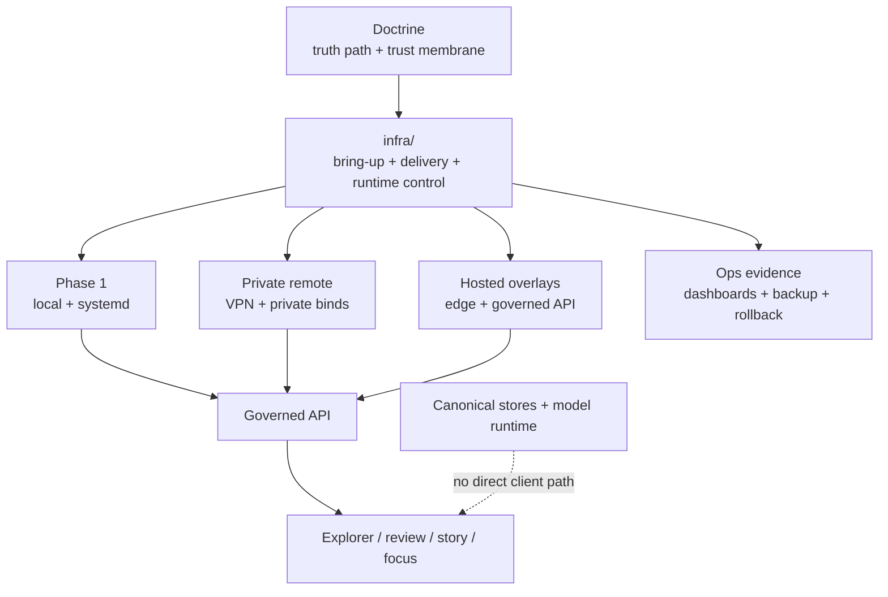

<!-- [KFM_META_BLOCK_V2]
doc_id: kfm://doc/NEEDS_VERIFICATION
title: infra
type: standard
version: v1
status: draft
owners: NEEDS_VERIFICATION
created: NEEDS_VERIFICATION
updated: 2026-03-20
policy_label: NEEDS_VERIFICATION
related: [NEEDS_VERIFICATION: ../README.md, NEEDS_VERIFICATION: ../docs/, NEEDS_VERIFICATION: ../contracts/, NEEDS_VERIFICATION: ../policy/, NEEDS_VERIFICATION: ../tests/, NEEDS_VERIFICATION: ../apps/api/README.md, NEEDS_VERIFICATION: ../apps/api/src/api/README.md]
tags: [kfm, infra, deployment, runtime, operations]
notes: [Grounded in the March 2026 KFM corpus and direct current-session workspace inspection; no mounted repo checkout or live infra subtree was directly verified in this session.]
[/KFM_META_BLOCK_V2] -->

# infra

Bring-up, deployment, runtime control, exposure management, observability wiring, restore, and rollback surface for Kansas Frontier Matrix.

> **Status:** experimental  
> **Owners:** NEEDS VERIFICATION  
>      
> **Repo fit:** `infra/README.md` is the directory guide for runtime-facing infrastructure material that must preserve KFM’s truth path, trust membrane, and governed API boundary.  
> **Quick jump:** [Scope](#scope) · [Repo fit](#repo-fit) · [Accepted inputs](#accepted-inputs) · [Exclusions](#exclusions) · [Directory tree](#directory-tree) · [Quickstart](#quickstart) · [Usage](#usage) · [Diagram](#diagram) · [Operating tables](#operating-tables) · [Task list](#task-list--definition-of-done) · [FAQ](#faq) · [Appendix](#appendix)

> [!IMPORTANT]
> This README is evidence-bounded. In this session, the strongest direct authority was the March 20–21 2026 KFM manual layer plus the March 20 Ubuntu runtime guide. Those documents are strong on doctrine, repo shape, and target operating lanes, but **no mounted KFM checkout, live `infra/` subtree, workflow YAML, deployment manifests, dashboards, or runtime logs were directly visible here**. Treat exact owners, subpaths, manifests, and active deployment choices as **NEEDS VERIFICATION** until the live checkout is inspected.

> [!NOTE]
> The corpus points to two compatible infra readings that should be kept together rather than forced into one overconfident tree:
>
> 1. `infra/` as the repo-root deployment-and-operations surface for **Kubernetes, Terraform, GitOps, dashboards, and related rollout wiring**.
> 2. A **phase-one systemd-first Ubuntu lane** as the thinnest credible first governed runtime.
>
> This README keeps both: **prove the local governed slice first, then grow into hosted and orchestrated overlays only when complexity earns itself**.

---

## Scope

`infra/` is the repository surface for **bring-up, deployment, runtime control, exposure management, observability wiring, restore, rollback, and operational correction**.

In KFM, that makes `infra/` more than a generic “ops” folder. Infrastructure can either preserve the trust membrane or quietly dissolve it. A public client path that bypasses the governed API, a model server exposed for convenience, a restore story that was never rehearsed, or a release with no visible rollback lineage are all infrastructure failures in the KFM sense.

**Repo-fit rule:** `infra/` should version **how KFM runs**. It should not become the canonical home of policy law, business rules, API semantics, or dataset truth.

[Back to top](#infra)

## Repo fit

**Path:** `infra/README.md`  
**Role:** directory README for runtime, delivery, and operational-control material.

| Direction | Surface | Why it matters |
|---|---|---|
| Upstream | [`../README.md`](../README.md) | Root doctrine, repo orientation, and global trust posture *(exact mounted path still needs checkout verification)* |
| Upstream | [`../docs/`](../docs/) | Architecture manuals, ADRs, runbooks, and longer-form operating references |
| Adjacent | [`../contracts/`](../contracts/), [`../policy/`](../policy/), [`../tests/`](../tests/) | Shared boundaries that infra must preserve rather than redefine |
| Adjacent | [`../apps/api/README.md`](../apps/api/README.md), [`../apps/api/src/api/README.md`](../apps/api/src/api/README.md) | Governed API boundary docs named in repo-shaped evidence *(exact live location needs checkout verification)* |
| Downstream | `infra/` lanes for local runtime, hosted overlays, orchestration, dashboards, backup, and rollback | The operational surfaces that reconcile approved intent into running environments |

### Repo fit notes

- Documentary repo inventories and replacement-grade manuals both treat `infra/` as a top-level peer of major repo surfaces.
- The same corpus also warns that internal subtree shape remains **PROPOSED** until the live checkout is exported and inspected.
- Some documents keep telemetry under `infra/`; others separate a neighboring `observability/` surface. Follow the existing checkout convention first.

## Accepted inputs

Content that belongs here includes:

| Category | Typical contents | Why it belongs here |
|---|---|---|
| Local runtime bring-up | `systemd` units, timers, overrides, bind rules, host bootstrap notes, loopback-only profiles | The strongest phase-one runtime doctrine is explicitly systemd-first and single-host friendly |
| Delivery overlays | Compose descriptors, hosted config overlays, reverse-proxy wiring, ingress notes | These turn approved release intent into reachable runtime surfaces |
| Infrastructure as code | Terraform modules, network/storage provisioning, environment descriptors | Infra changes should be reviewable, reproducible, and diffable |
| Orchestration and reconciliation | Kubernetes manifests, Helm/Kustomize overlays, GitOps declarations | Later hosted lanes still have to preserve KFM doctrine |
| Observability and operational evidence | Dashboard provisioning, alert rules, telemetry joins, rollout markers, health probes | KFM treats logs, metrics, traces, and audit joins as one evidence system |
| Backup / restore / rollback | Backup descriptors, restore procedures, rollback bundles, stale-state handling | Restore rehearsal and correction lineage are required operational behaviors |
| Runtime-impacting ops prose | Bring-up notes, maintenance steps, environment profiles, incident/runbook references | Runtime-affecting changes should ship with their instructions |

## Exclusions

The following do **not** belong here as the authoritative source of truth:

| Keep out of `infra/` | Put it here instead |
|---|---|
| Service code, UI code, worker business logic | `../apps/`, `../packages/` |
| Canonical API contracts and schemas | `../contracts/` |
| Policy rule bodies and policy-test truth | `../policy/` |
| Dataset descriptors, catalog objects, EvidenceBundles, or release content themselves | the project’s data, catalog, evidence, and release surfaces |
| Shared trust vocabulary, header grammar, or contract fixtures | `../contracts/` and `../tests/` |
| Ad hoc committed secrets, private keys, or ambient credentials | secret-management paths, not repo plaintext |
| Detached long-form doctrine already kept under docs | `../docs/` and `../docs/runbooks/` where that pattern exists |
| Silent promotion logic disguised as “just deployment” | release, policy, review, and proof-pack surfaces |

## Evidence labels used in this README

| Label | Meaning in this file |
|---|---|
| **CONFIRMED** | Supported by the attached March 2026 corpus or direct current-session inspection |
| **INFERRED** | A careful conclusion drawn from multiple project documents, but not directly proven in a live checkout |
| **PROPOSED** | A recommended lane, subtree shape, or operating pattern that fits the corpus |
| **NEEDS VERIFICATION** | Exact path, owner, file presence, or implementation detail not directly confirmed in this session |

## Directory tree

### Confirmed repo-root placement

The attached repo-shaped sources repeatedly treat `infra/` as a top-level repository surface:

```text
<repo-root>/
├── apps/
├── contracts/
├── docs/
├── policy/
├── tests/
└── infra/
```

### Documented subtree variants

The corpus does **not** support one single overconfident internal `infra/` tree. It supports a small set of compatible variants that need live-checkout reconciliation.

| Documentary source family | Infra-shaped lanes it names | How to read it |
|---|---|---|
| Replacement-grade master design manual | `local/`, `systemd-or-compose/`, `hosted/`, `dashboards/` | Cleanest replacement-grade skeleton for a repo that wants explicit environment lanes |
| Repo-inventory / tooling compendium | Kubernetes, Terraform, GitOps, Helm charts, Terraform modules, dashboards | Strong evidence that `infra/` is the deployment-and-operations surface at repo root |
| Identity/contract realization pass | `infra/compose/`, `infra/backup/` plus sibling/paired observability and dashboards | Useful reminder that backup and telemetry may be modeled beside or beneath `infra/` |
| Ubuntu phase-one runtime guide | `systemd/`, environment files, runbooks, loopback/private bind posture | Strongest guide for the smallest credible first runtime |

### Replacement-grade starter sketch *(PROPOSED until checkout confirms)*

```text
infra/
├── local/                # local bring-up, loopback binds, single-host wiring
├── systemd-or-compose/   # phase-one service orchestration lane
├── hosted/               # hosted split-edge or later environment overlays
└── dashboards/           # operator-facing dashboards when kept under infra
```

### Operational family sketch *(INFERRED from multiple documents; still needs checkout verification)*

```text
infra/
├── systemd/              # native units, timers, overrides
├── compose/              # local multi-service manifests
├── kubernetes/ or k8s/   # orchestrated deployment overlays
├── terraform/            # infrastructure-as-code for hosts/network/storage
├── gitops/               # reconciler/environment intent, if adopted
├── backup/               # restore and rollback assets, if kept here
└── dashboards/           # Grafana or equivalent dashboards, if not separated
```

> [!WARNING]
> Do **not** read either sketch as a claim that every directory already exists in the live repo. They are the cleanest synthesis of the attached KFM sources, not a substitute for direct repo inspection.

### Placement drift to watch for

Several March 2026 passes imply slightly different local packaging choices:

- one family keeps **dashboards under `infra/`**
- another separates **`observability/`** from `infra/`
- another keeps **runbooks** primarily under `docs/runbooks/`

Follow the **existing checkout convention first**. Do not normalize the tree for aesthetic neatness unless the mounted repo and adjacent docs justify it.

[Back to top](#infra)

## Quickstart

Start with **verification before editing**.

```bash
# 1) Confirm you are in the real repo checkout
git rev-parse --show-toplevel

# 2) Inspect the actual infra tree before changing docs or manifests
test -d infra && find infra -maxdepth 4 -print | sort || echo "infra/ not present in this checkout"

# 3) Re-read the adjacent trust surfaces this directory must preserve
[ -f README.md ] && sed -n '1,220p' README.md
[ -f docs/README.md ] && sed -n '1,220p' docs/README.md
[ -f apps/api/README.md ] && sed -n '1,220p' apps/api/README.md
[ -f apps/api/src/api/README.md ] && sed -n '1,220p' apps/api/src/api/README.md

# 4) Surface nearby contracts, policy, tests, and workflows
find contracts policy tests .github/workflows -maxdepth 3 -type f 2>/dev/null | sort

# 5) Inventory infrastructure-shaped files if they already exist
find infra -type f \
  \( -name '*.tf' -o -name '*.yaml' -o -name '*.yml' -o -name '*.service' -o -name '*.timer' -o -name 'compose*.yml' \) \
  2>/dev/null | sort

# 6) Check whether dashboards, backup assets, or runbooks already live elsewhere
find docs observability infra -maxdepth 3 -type f 2>/dev/null | sort | grep -E 'runbook|dashboard|grafana|backup|restore|rollback|correction' || true
```

### Minimal review order

1. Confirm the actual `infra/` subtree in the live checkout.
2. Confirm which runtime lane you are touching: local-only, private-remote, hosted split-edge, or more separated production runtime.
3. Confirm whether the repo keeps telemetry under `infra/`, a separate `observability/` surface, or both.
4. Check whether the change affects exposure, bind addresses, service accounts, rollback, restore, or correction propagation.
5. Update docs, runbooks, and verification material in the same change stream.

## Usage

### Profiles, not dogma

The corpus does not say “always use Kubernetes,” and it does not say “never grow past one host.” It says: **prove the governed path with the smallest credible runtime, then add layers only when they earn their operational cost**.

### Phase-one local lane

The strongest runtime guidance favors a **small, legible Ubuntu host** as the first governed slice. That profile assumes:

- PostgreSQL + PostGIS for canonical structured truth
- a content-addressed or explicitly zoned artifact tree for `RAW`, `WORK / QUARANTINE`, `PROCESSED`, `CATALOG`, and `PUBLISHED`
- one governed API process on loopback
- one-shot jobs for ingest, build, publish, and projection work
- a local-only Ollama service behind an inference adapter
- **no public reverse proxy in phase one**

That is why a `systemd`-first lane is not a downgrade. It is the thinnest credible runtime that still keeps canonical stores and model serving private by construction.

### Deployment progression

KFM’s deployment ladder is intentionally conservative:

1. **Local-only** — one host, loopback-only services, no public edge.
2. **Private-remote** — VPN or overlay access for trusted operators/testers; canonical data and model runtime stay private.
3. **Small hosted split-edge** — public UI plus governed API at the edge, with private canonical/data/model layers behind it.
4. **More separated production runtime** — edge gateway, identity, policy decision point, governed API, workers, canonical DB, object/artifact store, rebuildable projections, centralized telemetry, and controlled rollouts.

The rule is not “stay small forever.” It is “add operational layers only when they preserve KFM’s invariants better than the simpler shape.”

### Deployment is not promotion

`infra/` may contain the manifests, overlays, and reconcilers that move approved intent into runtime. It should **not** collapse these distinct KFM control functions into one vague “deploy” step:

- **CI** proves something about a candidate
- **build** proves artifact identity
- **deployment** changes runtime placement
- **promotion** changes trust state
- **projection rebuild** refreshes derived delivery artifacts
- **rollback / correction** restore safety without erasing lineage

Infra work is correct only when it preserves that separation.

### Observability, rollback, and correction

Infra work is not done when a service starts. It is done when the service can be:

- observed
- explained
- rolled back
- restored
- corrected without lineage collapse

KFM’s operations layer is explicitly trust-bearing. Stable IDs such as `source_id`, `dataset_version_id`, `artifact_id` or digest, `bundle_id`, `release_id`, `decision_id`, `request_id`, and `audit_ref` should survive the path from ingest and promotion into runtime, telemetry, restore, and correction.

[Back to top](#infra)

## Diagram


```mermaid
flowchart TB
    A[Doctrine<br/>truth path + trust membrane] --> B[infra/<br/>bring-up + delivery + runtime control]

    B --> C1[Phase 1<br/>local + systemd]
    B --> C2[Private remote<br/>VPN + private binds]
    B --> C3[Hosted overlays<br/>edge + governed API]
    B --> C4[Ops evidence<br/>dashboards + backup + rollback]

    C1 --> D[Governed API]
    C2 --> D
    C3 --> D

    D --> E[Explorer / review / story / focus]
    X[Canonical stores + model runtime] -. no direct client path .-> E
```

The point of `infra/` is to make runtime reality preserve KFM law: **governed API in front, canonical truth and model runtime behind, operational evidence joined, and rollback/correction visible**.

## Operating tables

### Infra lanes and when they earn their keep

| Lane / family | Typical contents | When it earns its keep | Status in this README |
|---|---|---|---|
| `local/` | host-local environment wiring, bind posture, bootstrap notes | first governed slice on one host | **PROPOSED replacement-grade lane** |
| `systemd-or-compose/` | native units or simple multi-service descriptors | small service graph, explicit loopback/private control | **PROPOSED replacement-grade lane** |
| `systemd/` | units, timers, overrides, sandboxing, env files | phase-one Ubuntu runtime | **PROPOSED, strongly supported** |
| `compose/` | local multi-service manifests | local parity or narrow service coordination | documented family; mounted presence **NEEDS VERIFICATION** |
| `hosted/` | split-edge overlays, ingress, remote env wiring | once UI/API separate from local-only runtime | **PROPOSED replacement-grade lane** |
| `kubernetes/` or `k8s/` | manifests, overlays, charts | only when orchestration complexity is justified | documented family; mounted presence **NEEDS VERIFICATION** |
| `terraform/` | host, network, storage, edge provisioning | repeatable provisioning or hosted growth | documented family; mounted presence **NEEDS VERIFICATION** |
| `gitops/` | reconciler declarations, environment intent, rollout controls | once declarative reconciliation is worth the overhead | documented family; mounted presence **NEEDS VERIFICATION** |
| `dashboards/` | Grafana or equivalent dashboard provisioning | as soon as runtime evidence needs operator surfaces | named in multiple docs; exact placement **NEEDS VERIFICATION** |
| `backup/` | backup specs, restore scripts, recovery notes | whenever the system begins to matter | documented in some variants; exact placement **NEEDS VERIFICATION** |

### Exposure ladder

| Profile | Public reachability | Primary controls | Why it exists |
|---|---|---|---|
| Local-only | none | loopback binds, local sockets, systemd isolation, host firewall | proves the governed path with minimum moving parts |
| Private-remote | VPN / overlay only | WireGuard or equivalent, private addresses, narrow operator access | introduces reviewer/operator access before public edge pressure |
| Hosted split-edge | public proxy and governed API only | TLS, reverse proxy, audit IDs, private backend binds | supports public-safe surfaces without exposing canonical or model layers |
| More separated production | public edge plus private control/data planes | identity, policy decision point, centralized telemetry, backups, controlled rollouts | earns its cost when scale, blast radius, and governance depth require it |

### Non-negotiable infra rules

| Rule | Infra consequence |
|---|---|
| Trust membrane | Public and role-limited clients reach KFM through the governed API, not DB, storage, or model endpoints |
| Loopback/private model runtime by default | Ollama or equivalent stays local or equally private until a stronger hosted posture is deliberately justified |
| Published-scope answers only | Runtime surfaces answer from released scope, not from raw/work/quarantine convenience paths |
| Fail-closed behavior | Stale, denied, abstaining, generalized, and error states must remain visible and inspectable |
| Observability is operational evidence | Logs, traces, metrics, alerts, and audit joins need stable IDs that survive deploy, runtime, restore, and correction |
| Restore before confidence | Backup claims stay weak until restore drills and rollback lineage are real |
| Docs stay in band | Runtime-impacting infra changes should ship with docs/runbooks, not after-the-fact tribal memory |

### Change-class minimums

| Change type | Minimum review payload |
|---|---|
| Infra shape change | manifest or IaC diff, rollback path, docs update |
| Exposure / bind change | bind-address note, auth path, firewall/reverse-proxy consequence, smoke or canary plan |
| Monitoring or alerting change | signal owner, alert consequence, join-key impact, dashboard/update note |
| Restore / rollback change | restore drill or rollback-test consequence, correction propagation note, runbook update |
| Phase-profile change | why the next rung is justified, which invariant remains unchanged, what gets harder to reverse |

[Back to top](#infra)

## Task list / definition of done

An `infra/` change is not done until the following are true:

- [ ] The actual `infra/` subtree was inspected in the live checkout before adding new paths or claims.
- [ ] The change clearly belongs to bring-up, deployment, runtime control, exposure management, observability, restore, rollback, or operational correction.
- [ ] No direct client path to canonical stores or model runtime was introduced.
- [ ] Exposure choices are explicit: loopback, private address, VPN, hosted edge, or public edge.
- [ ] Build, deploy, promote, projection rebuild, rollback, and correction were not collapsed into one undocumented “deploy” step.
- [ ] Health, readiness, smoke, or canary implications were reviewed.
- [ ] Rollback and restore consequences were documented.
- [ ] Monitoring / telemetry updates were included when runtime behavior or exposure changed.
- [ ] Material infra changes include the KFM minimum: manifest or IaC diff, rollback path, monitoring update, and docs or runbook update.
- [ ] If the change is still target-state architecture rather than mounted reality, it remains visibly labeled **PROPOSED** or **NEEDS VERIFICATION**.
- [ ] At least one correction, stale-state, or rollback consequence remains explainable at the surface layer—not only in operator notes.

## FAQ

### Is `infra/` only for Kubernetes and Terraform?

No. The corpus documents those as important infra families, but the strongest phase-one runtime guidance is a **systemd-first Ubuntu host** with loopback/private exposure and no public edge.

### Why does this README show more than one possible subtree shape?

Because the attached sources do not justify pretending one unverified internal tree is settled fact. They agree on the **role** of `infra/` much more strongly than they agree on one mounted local directory layout.

### Does this README claim the live `infra/` subtree was inspected?

No. It explicitly does not. This is a repo-ready, evidence-bounded README draft anchored to the March 2026 KFM manuals and documentary repo cues.

### Should observability always live under `infra/`?

Not necessarily. Some replacement-grade sketches keep `dashboards/` under `infra/`; another realization pass models `observability/` beside `infra/`. Follow the mounted checkout.

### What is the smallest credible infra slice?

A hardened Ubuntu host with loopback-only governed API, local-only Ollama, PostgreSQL/PostGIS on local socket or localhost, explicit lifecycle zones, one-shot jobs, and **no public reverse proxy**.

### What makes an infra change “governed” instead of merely “deployed”?

The ability to show its proof objects and consequences: the diff or manifest, the bind/exposure choice, the release or rollback posture, the monitoring change, and the runbook update.

## Appendix

<details>
<summary><strong>Observed session constraint</strong></summary>

Direct current-session workspace inspection exposed a PDF corpus under `/mnt/data`, but **did not expose a mounted KFM repository checkout, a visible `infra/` subtree, workflow YAML, deployment manifests, dashboards, or runtime logs**. This README is therefore a repo-ready draft anchored to doctrine and documentary repo cues, not a claim of live file presence.

</details>

<details>
<summary><strong>Verification backlog before commit</strong></summary>

Before treating this README as checkout-faithful, verify:

1. the actual `infra/` subtree in the live repo
2. the correct governed API README path
3. `CODEOWNERS` or other ownership markers for infra changes
4. whether telemetry lives under `infra/`, `observability/`, or both
5. whether `local/`, `systemd-or-compose/`, `hosted/`, `dashboards/`, `systemd/`, `compose/`, `kubernetes/`, `terraform/`, `gitops/`, or `backup/` already exist
6. which health checks, dashboards, restore drills, rollback bundles, and correction artifacts are already implemented
7. which manifests are authoritative in each environment: systemd, Compose, Helm, Kustomize, raw Kubernetes, GitOps, or another reconciler
8. which environment approvals, required checks, and promotion gates protect infra-changing PRs

</details>

<details>
<summary><strong>Documented repo cues this README aligns to</strong></summary>

The March 2026 corpus repeatedly treats the repo as having top-level surfaces comparable to:

```text
.github/
apps/
contracts/
docs/
policy/
tests/
infra/
```

It also documents `infra`-adjacent expectations such as:

- deployment infrastructure
- local or hosted bring-up lanes
- Kubernetes, Terraform, or GitOps overlays in some repo inventories
- dashboards and telemetry surfaces
- backup / restore / correction discipline
- infra changes carrying an IaC or manifest diff, rollback path, monitoring updates, and docs
- deployment descriptors remaining **PROPOSED** until direct checkout inspection confirms them

</details>

[Back to top](#infra)
