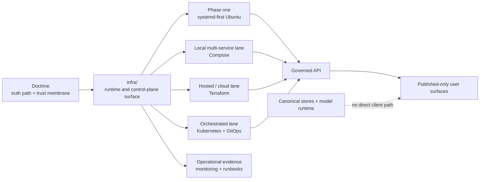

<!-- [KFM_META_BLOCK_V2]
doc_id: kfm://doc/NEEDS_VERIFICATION
title: infra
type: standard
version: v1
status: draft
owners: NEEDS_VERIFICATION
created: NEEDS_VERIFICATION
updated: NEEDS_VERIFICATION
policy_label: NEEDS_VERIFICATION
related: [NEEDS_VERIFICATION: ../README.md, NEEDS_VERIFICATION: ../docs/, NEEDS_VERIFICATION: ../contracts/, NEEDS_VERIFICATION: ../policy/, NEEDS_VERIFICATION: ../tests/, NEEDS_VERIFICATION: ../apps/api/README.md or ../apps/api/src/api/README.md]
tags: [kfm, infra, deployment, runtime, operations]
notes: [Drafted from the March 2026 KFM corpus plus current-session workspace inspection; no repo tree, CODEOWNERS, or mounted infra subtree were directly verified in this session.]
[/KFM_META_BLOCK_V2] -->

# infra

Bring-up, deployment, runtime, observability, and rollback surface for Kansas Frontier Matrix.

> **Status:** experimental  
> **Owners:** NEEDS_VERIFICATION  
> 
> 
> 
>   
> **Quick jump:** [Scope](#scope) · [Repo fit](#repo-fit) · [Accepted inputs](#accepted-inputs) · [Exclusions](#exclusions) · [Directory tree](#directory-tree) · [Quickstart](#quickstart) · [Usage](#usage) · [Diagram](#diagram) · [Operating tables](#operating-tables) · [Task list](#task-list--definition-of-done) · [FAQ](#faq) · [Appendix](#appendix)

> [!IMPORTANT]
> This README is **evidence-bounded**. The March 2026 KFM corpus clearly defines what `infra/` is for, but this review session did **not** expose a mounted repository tree. Treat exact subpaths, neighboring README locations, owners, dates, and current infra contents as **NEEDS VERIFICATION** until confirmed in the actual checkout.

> [!NOTE]
> The corpus documents two valid infra emphases that need to be read together, not as a contradiction:
> 1. `infra/` as the broader deployment/control-plane surface for Compose, Terraform, Kubernetes overlays, GitOps, and monitoring.
> 2. A **systemd-first, single-host Ubuntu** phase-one runtime as the thinnest credible first governed slice.
>
> This README reconciles them by treating `infra/` as the umbrella control-plane surface, with a local phase-one lane first and broader hosted/orchestrated lanes after that.

---

## Scope

`infra/` is the repository surface for **bring-up, deployment, runtime control, observability, rollback, and operational migration**.

In KFM, that makes `infra/` more than a generic “ops” folder. Deployment choices can either preserve or weaken the trust membrane. A public client path that bypasses the governed API, a model server exposed for convenience, a restore plan that was never rehearsed, or a release with no clear rollback lineage are all infrastructure failures in the KFM sense.

This directory should therefore capture the parts of the system that answer questions like:

- how the governed runtime starts
- how environments are wired and constrained
- how promotion and deployment stay reviewable
- how observability joins to audit and release evidence
- how rollback, restore, correction, and exposure controls are documented

[Back to top](#infra)

## Repo fit

**Path:** `infra/README.md`  
**Role:** directory README for runtime, deployment, and operational-control material.

| Direction | Surface | Why it matters |
|---|---|---|
| Upstream | [`../README.md`](../README.md) | Root project contract, doctrine, and trust posture *(path needs checkout verification)* |
| Upstream | [`../docs/`](../docs/) | Architecture docs, ADRs, runbooks, doctrine, and long-form reference material |
| Adjacent | [`../contracts/`](../contracts/), [`../policy/`](../policy/), [`../tests/`](../tests/) | Machine-checkable boundaries that infra must preserve rather than redefine |
| Adjacent | `../apps/api/README.md` **or** `../apps/api/src/api/README.md` | Governed API boundary docs mentioned across the corpus *(exact path needs checkout verification)* |
| Downstream | `infra/` subtrees for local bring-up, orchestration, GitOps, monitoring, and runbooks | The operational surfaces that turn doctrine into a runnable and recoverable system |

**Repo fit rule:** `infra/` should version **how KFM runs**. It should not become the canonical home of contracts, policy bodies, service code, or domain data.

## Accepted inputs

Content that belongs here includes:

- local bring-up assets such as `systemd` units, timers, overrides, environment templates, and loopback-only profiles
- optional local multi-service wiring such as Compose files
- infrastructure-as-code for networking, hosts, storage, identity, and cloud provisioning
- Kubernetes base manifests and overlays when orchestration is justified
- GitOps or promotion/reconciliation declarations
- monitoring, logging, metrics, trace, and audit-routing configuration
- backup, restore, rollback, correction, and incident runbooks
- deployment smoke tests, readiness checks, and restore drills
- operational hardening notes that materially affect runtime boundaries

## Exclusions

The following do **not** belong here as the authoritative source of truth:

- runtime service code or UI code  
  → keep under code surfaces such as `../apps/` and `../packages/`
- canonical API contracts and schemas  
  → keep under `../contracts/` and related schema surfaces
- policy rule bodies and their canonical tests  
  → keep under `../policy/`
- dataset descriptors, catalog entries, evidence bundles, or release content themselves  
  → keep under the project’s data/catalog/evidence paths
- ad hoc committed secrets, tokens, or private keys  
  → use the project’s secret-management path, not repo plaintext
- generated release receipts, proof packs, or export clutter as loose operational debris  
  → keep in designated release/evidence locations

## Evidence labels used in this README

| Label | Meaning in this file |
|---|---|
| **CONFIRMED** | Supported by the March 2026 KFM corpus or direct current-session inspection |
| **PROPOSED** | A target-state shape or practice that fits the corpus but was not verified in the mounted checkout |
| **NEEDS VERIFICATION** | Exact path, owner, file presence, or implementation detail that was not directly confirmed here |

## Directory tree

### Documented top-level placement

The corpus repeatedly treats `infra/` as a top-level peer of the main repo surfaces.

```text
<repo-root>/
├── apps/
├── contracts/
├── docs/
├── policy/
├── tests/
└── infra/
```

### Realization lanes named across the corpus

The exact mounted subtree was **not** verified in this session. The shape below is the **documented / proposed** operating surface implied by the corpus.

```text
infra/
├── README.md
├── systemd/        # PROPOSED phase-one local Ubuntu units, timers, overrides
├── compose/        # documented local multi-service wiring lane
├── terraform/      # documented cloud / hosted provisioning lane
├── kubernetes/     # documented orchestration base + overlays
├── gitops/         # documented promotion / reconciliation lane
├── monitoring/     # documented dashboards, alerts, OTel / audit joins
└── runbooks/       # restore, rollback, correction, incident, exposure procedures
```

> [!WARNING]
> Do **not** read this tree as a claim that every subdirectory already exists in the current checkout. It is the cleanest repo-native synthesis of the March 2026 corpus, not a substitute for direct repo inspection.

[Back to top](#infra)

## Quickstart

Start with **verification before editing**.

```bash
# 1) Confirm you are in the real repo checkout
git rev-parse --show-toplevel

# 2) Inspect the actual infra tree before changing docs or manifests
find infra -maxdepth 3 -print | sort

# 3) Re-read the adjacent trust surfaces this directory must preserve
sed -n '1,220p' README.md
sed -n '1,220p' docs/README.md 2>/dev/null || true
sed -n '1,220p' apps/api/README.md 2>/dev/null || \
  sed -n '1,220p' apps/api/src/api/README.md 2>/dev/null || true

# 4) Surface nearby contracts, policy, tests, and workflows
find contracts policy tests .github/workflows -maxdepth 3 -type f 2>/dev/null | sort

# 5) Check for existing infra assets before inventing new paths
find infra -maxdepth 4 -type f | sort
```

### Minimal review order

1. Confirm the actual `infra/` subtree in the checkout.
2. Confirm the governed API boundary docs and any existing deployment/readiness docs.
3. Identify which lane the change belongs to: local-only, hosted, orchestrated, monitoring, or runbooks.
4. Check whether the change affects exposure, rollback, restore, or observability.
5. Update docs and validation material in the same change stream.

## Usage

### Local-only phase

The freshest runtime guidance favors a **small, loopback-first Ubuntu host** as the first governed slice.

That means:

- keep client-visible access at the governed API
- keep canonical stores non-client-visible
- keep model serving loopback-only or equally private
- keep the runtime explainable enough that receipts, audit joins, and rollback remain inspectable

A systemd-first lane fits that goal especially well because it keeps the first runtime small and reviewable.

### Hosted and orchestrated phases

`infra/` must also leave room for later hosted or clustered growth.

That includes:

- cloud provisioning and networking
- orchestration overlays
- promotion/reconciliation surfaces
- monitoring and rollback assets
- stricter blast-radius separation between edge, API, workers, canonical stores, rebuildable projections, and model runtime

The KFM rule is not “stay simple forever.” It is “move only when the next layer is justified by coordination pain, rollback risk, or operational need.”

### Observability, rollback, and correction

Infra work is not done when a service starts. It is done when the service can be:

- observed
- explained
- rolled back
- restored
- corrected without narrative confusion

KFM repeatedly treats logs, metrics, traces, audit objects, release manifests, and correction notices as one evidence system. `infra/` should reflect that by keeping monitoring, restore drills, and rollback notes close to the deployment surfaces they protect.

## Diagram


```mermaid
flowchart LR
    A[Doctrine<br/>truth path + trust membrane] --> B[infra/<br/>runtime and control-plane surface]

    B --> C1[Phase one<br/>systemd-first Ubuntu]
    B --> C2[Local multi-service lane<br/>Compose]
    B --> C3[Hosted / cloud lane<br/>Terraform]
    B --> C4[Orchestrated lane<br/>Kubernetes + GitOps]
    B --> C5[Operational evidence<br/>monitoring + runbooks]

    C1 --> D[Governed API]
    C2 --> D
    C3 --> D
    C4 --> D

    D --> E[Published-only user surfaces]
    X[Canonical stores + model runtime] -. no direct client path .-> E
```

The point of `infra/` is to keep operational reality aligned with KFM law: the governed API stays public-facing, canonical stores stay non-client-visible, and derived/runtime convenience never quietly becomes sovereign truth.

## Operating tables

### Infra lanes by phase

| Lane | What it is for | Status in this README |
|---|---|---|
| **systemd/** | Thinnest credible phase-one local runtime on one Ubuntu host | **PROPOSED starting lane** |
| **compose/** | Optional local multi-service coordination or parity wiring | **Documented in corpus; current presence NEEDS VERIFICATION** |
| **terraform/** | Hosted/cloud provisioning and networking | **Documented in corpus; current presence NEEDS VERIFICATION** |
| **kubernetes/** | Orchestrated runtime base + overlays | **Documented in corpus; current presence NEEDS VERIFICATION** |
| **gitops/** | Promotion/reconciliation declarations | **Documented in corpus; current presence NEEDS VERIFICATION** |
| **monitoring/** | Dashboards, alerts, trace/log routing, audit joins | **Documented in corpus; current presence NEEDS VERIFICATION** |
| **runbooks/** | Restore, rollback, correction, and incident procedures | **Strongly implied by doctrine; current presence NEEDS VERIFICATION** |

### Non-negotiable infra rules

| Rule | Infra consequence |
|---|---|
| Trust membrane | Public and role-limited clients reach KFM through the governed API, not directly through DB, storage, or model endpoints |
| Published-only reads | Public-facing delivery must serve promoted release scope, not raw/work/quarantine convenience paths |
| Least-privilege model runtime | Ollama or any equivalent runtime stays private and replaceable behind the API boundary |
| Verification is cross-cutting | Infra changes must preserve proof objects, validation points, and request-time negative outcomes such as answer / abstain / deny / error |
| Restore before confidence | Backup claims are weak until restore drills and rollback lineage are real |
| Docs stay in band | Runtime-impacting infra changes should ship with runbook, monitoring, and documentation updates |

[Back to top](#infra)

## Task list / definition of done

An `infra/` change is not done until the following are true:

- [ ] The actual `infra/` subtree was inspected in the live checkout before adding paths or claims.
- [ ] The change clearly belongs to bring-up, deployment, runtime control, observability, or rollback.
- [ ] No direct client path to canonical stores or model runtime was introduced.
- [ ] Exposure choices are explicit: loopback, private bridge, VPN, hosted edge, or public edge.
- [ ] Health, readiness, smoke, or failure-drill implications were reviewed.
- [ ] Rollback and restore consequences were documented.
- [ ] Monitoring updates were included when runtime behavior or exposure changed.
- [ ] Docs were updated, or the PR explains why no doc change was needed.
- [ ] If the change is still target-state architecture rather than mounted reality, it remains visibly labeled **PROPOSED**.
- [ ] For material infra changes, the change set includes the repo-native artifacts KFM expects: rollback notes, monitoring updates, and docs.

## FAQ

### Is `infra/` only for Kubernetes and Terraform?

No. The corpus documents those lanes, but the freshest runtime guidance also recommends a **systemd-first single-host Ubuntu** phase for the first governed slice.

### Does this README claim the full `infra/` subtree already exists?

No. The current session did not mount a repo tree. This README distinguishes **documented role** from **mounted-checkout fact**.

### Why keep both `systemd/` and `compose/` in view?

Because the corpus points to two different but compatible needs: a very small first local runtime, and a broader infra progression that can later include multi-service local wiring, hosted provisioning, orchestration, GitOps, and monitoring.

### Where should policy, contracts, and API behavior live?

Not here as the authoritative source of truth.

- Policy belongs under [`../policy/`](../policy/)
- Contracts and schemas belong under [`../contracts/`](../contracts/)
- API behavior belongs with the governed API docs and contract surfaces
- `infra/` should preserve those boundaries at runtime

## Appendix

<details>
<summary><strong>Verification backlog before commit</strong></summary>

Before treating this README as fully checkout-faithful, verify:

1. the actual `infra/` subtree in the live repo
2. the correct governed API README path
3. `CODEOWNERS` or other ownership markers for infra changes
4. whether phase one is API-only, API + local UI, or another local profile
5. whether systemd units, Compose files, Terraform, Kubernetes overlays, GitOps declarations, monitoring assets, or runbooks already exist elsewhere
6. which health checks, restore drills, rollback artifacts, or monitoring dashboards are already implemented
7. which paths are protected by required checks, policy gates, or review rules

</details>

<details>
<summary><strong>Documented repo cues this README was aligned to</strong></summary>

The March 2026 corpus repeatedly treats the repo as having top-level surfaces comparable to:

```text
.github/
apps/
contracts/
docs/
policy/
tests/
infra/
```

It also documents `infra`-related expectations such as:

- deployment infrastructure
- local or hosted bring-up lanes
- promotion and reconciliation surfaces
- monitoring assets
- rollback and restore documentation
- infra changes carrying an IaC diff, rollback plan, monitoring updates, and docs
```

</details>

[Back to top](#infra)
