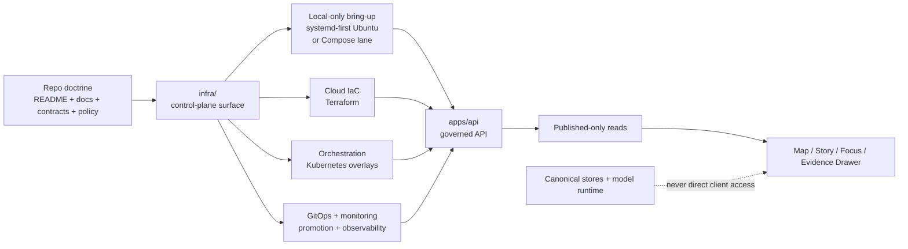

<!-- [KFM_META_BLOCK_V2]
doc_id: kfm://doc/NEEDS_VERIFICATION
title: infra
type: standard
version: v1
status: draft
owners: NEEDS_VERIFICATION
created: NEEDS_VERIFICATION
updated: NEEDS_VERIFICATION
policy_label: NEEDS_VERIFICATION
related: [../README.md, ../.github/README.md, ../apps/api/README.md, ../docs/, ../contracts/, ../policy/, ../tests/]
tags: [kfm, infra, deployment, runtime, operations]
notes: [Current repo-visible infra tree is README-only; exact owners, dates, policy label, and downstream subpaths need repo verification before commit.]
[/KFM_META_BLOCK_V2] -->

# infra

Bring-up, deployment, runtime, and operations surface for Kansas Frontier Matrix.

> **Status:** experimental  
> **Owners:** verify in [`../.github/CODEOWNERS`](../.github/CODEOWNERS) *(NEEDS VERIFICATION)*  
> 
> 
> 
> 
>   
> **Quick jump:** [Scope](#scope) · [Repo fit](#repo-fit) · [Accepted inputs](#accepted-inputs) · [Exclusions](#exclusions) · [Directory tree](#directory-tree) · [Quickstart](#quickstart) · [Usage](#usage) · [Diagram](#diagram) · [Operating tables](#operating-tables) · [Task list](#task-list--definition-of-done) · [FAQ](#faq) · [Appendix](#appendix)

> [!IMPORTANT]
> This README is **evidence-bounded**. On the current repo-visible `main` branch, `infra/` is present but minimal. Read every repo-shaped statement here as one of:
> - **CONFIRMED** — repo-visible now or directly anchored in current KFM doctrine
> - **PROPOSED** — fits KFM doctrine but is not yet proven as current repo state
> - **UNKNOWN** — not verified strongly enough to present as current implementation fact
> - **NEEDS VERIFICATION** — placeholder path, owner, or operating detail that must be checked in the actual checkout

> [!NOTE]
> `infra/` is intentionally kept in the repository even when thin. In the current repo-visible state, it contains only this README. That minimal presence still matters: it reserves the control-plane surface and makes future runtime and deployment work reviewable instead of ad hoc.

---

## Scope

`infra/` is the repo’s **bring-up, deployment, runtime, and operations surface** for KFM.

In practical terms, this directory is where KFM should express how a governed runtime is started, how environments are provisioned, how deployment truth is versioned, how observability and rollback remain inspectable, and how infrastructure changes preserve — rather than bypass — the trust membrane.

For KFM, that makes `infra/` more than a “DevOps folder.” It is a control-plane surface. Weak infra structure invites the same failure modes as weak policy or weak contracts: direct client-to-store shortcuts, undocumented environment drift, silent exposure widening, rollback without lineage, and operational folklore that never becomes reviewable repo truth.

> [!WARNING]
> Fresh KFM runtime material recommends a **systemd-first, single-host Ubuntu** start for the first governed slice. Other KFM infrastructure material describes a broader progression that includes **local bring-up, Terraform, Kubernetes overlays, GitOps promotion, and monitoring**. This README treats `infra/` as the umbrella directory for both the thinnest local start and later hosted/orchestrated layers; exact subpaths remain **PROPOSED** until the repo actually contains them.

[Back to top](#infra)

## Repo fit

**Path:** `infra/README.md`  
**Role in repo:** directory README for bring-up, deployment, runtime, and operations controls.

| Direction | Surface | Why it matters |
|---|---|---|
| Upstream | [`../README.md`](../README.md) | Root repo contract and verification-first orientation |
| Upstream | [`../.github/README.md`](../.github/README.md) | Current style benchmark for directory README structure and governance posture |
| Upstream | [`../apps/api/README.md`](../apps/api/README.md) | Governed API boundary that infra must preserve |
| Upstream | [`../docs/`](../docs/) | Long-form architecture, governance, standards, ADRs, and runbooks |
| Adjacent | [`../contracts/`](../contracts/), [`../schemas/`](../schemas/), [`../policy/`](../policy/) | Machine-enforced boundaries infra should deploy, not redefine |
| Adjacent | [`../tests/`](../tests/) | Validation, smoke tests, restore drills, policy/runtime checks |
| Downstream | `./systemd/`, `./compose/`, `./terraform/`, `./kubernetes/`, `./gitops/`, `./monitoring/`, `./runbooks/` | Expected infra-native surfaces once the repo grows beyond README-only state *(PROPOSED / NEEDS VERIFICATION)* |

**Repo fit rule:** `infra/` should describe and version **how** KFM runs, starts, publishes, rolls back, and stays observable — not replace the canonical homes of contracts, policy bodies, or service code.

## Accepted inputs

Content that belongs in or under `infra/` for KFM includes:

- host-local bring-up assets such as `systemd` units, timers, overrides, and runtime environment templates
- local multi-service bring-up assets such as Compose files, if that lane is actually adopted
- infrastructure-as-code for networking, hosts, storage, IAM, and cloud provisioning
- Kubernetes base manifests and overlays when orchestration is justified
- GitOps environment declarations, promotion descriptors, or deployment-sync surfaces
- observability assets such as OpenTelemetry collector config, dashboards, alerts, and service-health definitions
- backup, restore, rollback, and correction runbooks
- deployment smoke tests, readiness checks, restore drills, and other operational verification helpers
- host/network hardening notes that materially affect the governed runtime boundary

## Exclusions

The following do **not** belong here as the authoritative source of truth:

- runtime application code, UI code, ingestion logic, or evidence resolver code  
  → keep under repo code surfaces such as `../apps/` or `../packages/`
- canonical API contracts, validation schemas, or vocabulary definitions  
  → keep under `../contracts/` and `../schemas/`
- policy rule bodies and their canonical tests  
  → keep under `../policy/`
- dataset-specific source descriptors, catalog entries, or evidence bundles  
  → keep under domain-appropriate data/docs surfaces
- database or structure migrations as the authoritative execution surface  
  → keep under `../migrations/`
- committed cleartext secrets, tokens, credentials, or private keys  
  → use the project’s secret-management path, not repo plaintext
- generated release artifacts, proof packs, receipts, SBOMs, or attestation payloads as ad hoc checked-in clutter  
  → keep in designated release/evidence paths

## Status markers used in this README

| Marker | Meaning here |
|---|---|
| **CONFIRMED** | Repo-visible now or directly anchored in current KFM doctrine |
| **PROPOSED** | Repo-native implementation direction that fits that doctrine |
| **UNKNOWN** | Not verified in the current session |
| **NEEDS VERIFICATION** | Placeholder value, path, owner, or workflow detail that must be checked before commit |

## Directory tree

### Current repo-visible state

```text
infra/
└── README.md
```

### Proposed target shape

The exact `infra/` subtree below is a **PROPOSED directory contract**, not a statement of current repo fact.

```text
infra/                          # PROPOSED target shape; NEEDS VERIFICATION
├── README.md                   # this document
├── local/                      # local-only bring-up helpers, if adopted
├── systemd/                    # phase-one Ubuntu units, timers, overrides
├── compose/                    # local multi-service wiring, if adopted
├── terraform/                  # cloud infrastructure + networking IaC
├── kubernetes/
│   ├── base/                   # common manifests
│   └── overlays/               # environment-specific overlays
├── gitops/                     # promotion/environment declarations
├── monitoring/                 # dashboards, alerts, OTel collector config
└── runbooks/                   # backup, restore, rollback, correction drills
```

[Back to top](#infra)

## Quickstart

Use a **verification-first** sequence before adding or editing infra state.

```bash
# 1) Inspect the directory as it exists on this branch
ls -la infra
find infra -maxdepth 3 -type f | sort

# 2) Read adjacent repo contracts before writing infra truth
sed -n '1,200p' README.md
sed -n '1,220p' .github/README.md 2>/dev/null || true
sed -n '1,220p' apps/api/README.md 2>/dev/null || true

# 3) Check whether any infra subtrees already exist
find infra -maxdepth 2 -type d | sort

# 4) Inspect likely deployment, runtime, and observability references
grep -RIn "systemd\|compose\|terraform\|kubernetes\|gitops\|observability" . 2>/dev/null || true

# 5) Inspect contract / policy / test surfaces that infra must not contradict
find contracts schemas policy tests -maxdepth 3 -type f 2>/dev/null | sort
```

### Minimal review order

1. Read this file, the root README, and the governed API README.
2. Confirm the current branch-local `infra/` tree instead of assuming the proposed one exists.
3. Verify whether the intended change affects only local bring-up, hosted provisioning, orchestration, observability, or rollback.
4. Re-check that no change creates a direct client path to canonical stores or model runtime.
5. Update the smallest possible infra surface.
6. Pair infra changes with docs, tests, and rollback notes in the same change stream.

## Usage

### Changing local bring-up

Treat packaging choice as a **phase decision**, not a style preference.

- For the thinnest first governed slice, prefer a small, inspectable, loopback-first runtime.
- If a host-local `systemd/` lane is adopted, keep binds explicit, keep services reviewable, and preserve the governed API as the client-visible boundary.
- If a `compose/` lane is adopted, use it to coordinate local services — **not** to normalize direct browser-to-store or browser-to-model shortcuts.

### Changing hosted or cluster delivery

Infrastructure changes are governance changes.

When adding or editing `terraform/`, `kubernetes/`, or `gitops/` surfaces:

- keep environment truth in reviewed files, not operator folklore
- prefer overlays and explicit descriptors over hidden branch divergence
- pair deployment changes with policy, readiness, rollback, and observability consequences
- do not widen exposure without documenting why the trust membrane still holds

### Changing observability, rollback, or recovery surfaces

Infra work is not finished when a service starts. It is finished when behavior is **observable**, **recoverable**, and **auditable**.

That means `monitoring/` and `runbooks/` should evolve alongside deployment surfaces whenever the change affects:

- health or readiness expectations
- traces, metrics, logs, or audit joins
- backup cadence or restore shape
- rollback or correction procedure
- any exposure or privilege boundary

> [!IMPORTANT]
> “Working” is not enough for KFM infra. The directory should help prove that runtime behavior, release evidence, and correction readiness stay aligned.

## Diagram


```mermaid
flowchart LR
    A[Repo doctrine<br/>README + docs + contracts + policy] --> B[infra/<br/>control-plane surface]

    B --> C1[Local-only bring-up<br/>systemd-first Ubuntu<br/>or Compose lane]
    B --> C2[Cloud IaC<br/>Terraform]
    B --> C3[Orchestration<br/>Kubernetes overlays]
    B --> C4[GitOps + monitoring<br/>promotion + observability]

    C1 --> D[apps/api<br/>governed API]
    C2 --> D
    C3 --> D
    C4 --> D

    D --> E[Published-only reads]
    E --> F[Map / Story / Focus / Evidence Drawer]

    X[Canonical stores + model runtime] -. never direct client access .-> F
```

The point of `infra/` is not simply to “deploy things.” It is to make sure runtime shape still obeys KFM’s evidence, policy, and boundary laws.

## Operating tables

### Infra lanes by phase

| Phase | Likely infra surface | Why it exists | Status |
|---|---|---|---|
| Local-only thin slice | `systemd/` + `runbooks/` | Thinnest credible first runtime for proving one governed slice | **PROPOSED current starting point** |
| Local multi-service dev / parity | `compose/` | Optional grouped local wiring when multiple services need coordinated bring-up | **PROPOSED optional lane** |
| Hosted split-edge | `terraform/` + `monitoring/` | Repeatable public-edge provisioning while preserving governed boundaries | **PROPOSED** |
| Orchestrated multi-service runtime | `kubernetes/` + `gitops/` + `monitoring/` | Only once scale, team concurrency, and rollback burden justify it | **PROPOSED** |

### Non-negotiable infra rules

| Rule | What it means in practice | What must never happen |
|---|---|---|
| Trust membrane | Public and role-limited clients reach KFM through the governed API boundary | Direct browser or public-client access to DB, object storage, or model runtime |
| Published-only reads | Infra should expose promoted surfaces, not candidate or quarantined state | Preview, candidate, or quarantine data on public routes |
| Fail-closed exposure | Ambiguous authz, policy, evidence, or rights should hold, deny, or abstain | Convenience exposure because something is “just internal” |
| Replaceable internal model runtime | Model serving is an internal dependency, not the product’s truth source | Direct public LLM endpoints or raw-model pass-through |
| Restore before confidence | Backup claims are weak unless restore is rehearsed | Declaring ops-ready without restore, rollback, or correction drills |
| Docs stay in-band | Behavior-significant infra changes update docs and runbooks together | Silent drift between deployment reality and written procedure |

[Back to top](#infra)

## Task list / definition of done

A change under `infra/` is not done until the following are true:

- [ ] The current `infra/` tree was inspected before adding new paths or claims.
- [ ] Any new file or subdirectory added here clearly belongs to bring-up, deployment, runtime, observability, or rollback.
- [ ] No change creates a direct client path to canonical stores or model runtime.
- [ ] Loopback, private-network, or public-edge exposure choices are explicit and reviewable.
- [ ] Contracts, policy, docs, and tests were checked for drift against the infra change.
- [ ] Rollback and restore consequences were documented.
- [ ] Observability changes were paired with service or exposure changes where relevant.
- [ ] Secrets remain out of committed plaintext.
- [ ] Proposed paths and placeholders remain visibly marked until the repo actually proves them.

## FAQ

### Is `infra/` currently populated?

Current repo-visible state shows `infra/` with **README.md only**. This document is therefore intentionally split between **current fact** and **proposed target shape**.

### Does this README claim that `systemd/`, `compose/`, `terraform/`, or `kubernetes/` already exist?

No. Those are presented as a **PROPOSED** directory contract for future infra growth, not as current repo fact.

### Why mention both `systemd` and Compose?

Because the freshest KFM runtime note recommends a **systemd-first** local Ubuntu start for the first governed slice, while broader KFM infrastructure material describes a longer control-plane progression that includes **local bring-up, Terraform, Kubernetes overlays, GitOps, and monitoring**. This README preserves both, but does not pretend the repo has already ratified one exact subtree.

### Where should secrets, policy bodies, and contracts live?

Not here as authoritative plaintext.

- Secrets belong in the project’s secret-management path.
- Canonical policy rule bodies belong under [`../policy/`](../policy/).
- Canonical contracts and schemas belong under [`../contracts/`](../contracts/) and [`../schemas/`](../schemas/).

### Should release artifacts or proof packs be checked into `infra/`?

No. `infra/` may define how they are produced or verified, but canonical receipts, manifests, proof packs, and similar release evidence belong in designated release/evidence paths, not as ad hoc infra clutter.

## Appendix

<details>
<summary><strong>Verification backlog for this directory</strong></summary>

Before treating this README as fully repo-confirmed, verify at least the following:

1. whether `../.github/CODEOWNERS` exists and names stable owners for infra changes
2. whether the working branch already contains any `infra/` subtrees beyond `README.md`
3. whether the project currently uses a host-local `systemd` lane, a Compose lane, hosted IaC, Kubernetes overlays, GitOps, monitoring assets, or some mixture
4. whether health/readiness, restore drills, and rollback procedures already exist elsewhere in the repo
5. whether any existing deployment truth lives outside `infra/` and should be linked here rather than duplicated
6. which infra paths, if any, are merge-blocking or review-protected
7. which observability identifiers, audit joins, or release-evidence rules are already implemented versus still doctrinal

### Proposed starter matrix for future `infra/` growth

| Path | Why it may belong here | Commit only after... |
|---|---|---|
| `infra/systemd/` | host-local phase-one service units, timers, overrides | local runtime shape is ratified and reviewed |
| `infra/compose/` | optional local multi-service bring-up | service grouping and exposure rules are explicit |
| `infra/terraform/` | repeatable cloud/network/storage provisioning | environment ownership and state handling are defined |
| `infra/kubernetes/` | orchestrated runtime base + overlays | a multi-service runtime truly exists and justifies orchestration |
| `infra/gitops/` | environment declarations and promotion truth | deployment reconciliation and rollback rules are stable |
| `infra/monitoring/` | dashboards, alerts, collectors, SLO/SLI helpers | operational signals and alert ownership are defined |
| `infra/runbooks/` | restore, rollback, correction, exposure, incident procedures | the corresponding runtime behaviors are real enough to drill |

</details>

[Back to top](#infra)