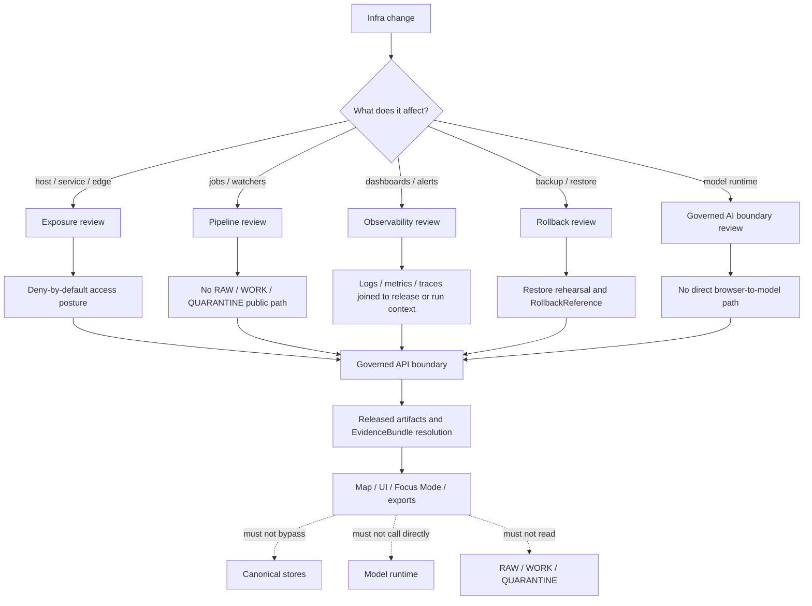
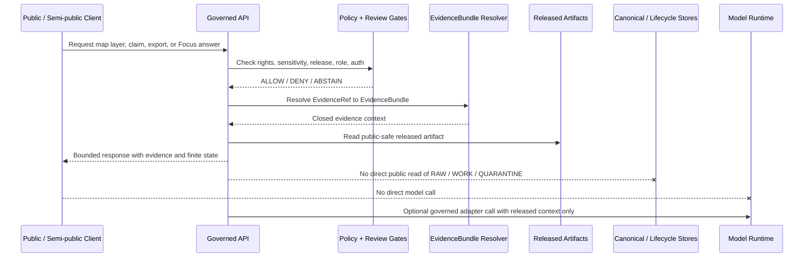

<!-- [KFM_META_BLOCK_V2]
doc_id: kfm://doc/NEEDS-VERIFICATION
title: infra
type: standard
version: v1.1
status: draft
owners: @bartytime4life (NEEDS VERIFICATION against path-specific CODEOWNERS coverage)
created: NEEDS-VERIFICATION
updated: 2026-04-26
policy_label: NEEDS-VERIFICATION
related: [../README.md, ../docs/README.md, ../docs/runbooks/README.md, ../contracts/README.md, ../schemas/README.md, ../policy/README.md, ../tests/README.md, ../tools/README.md, ../pipelines/README.md, ../apps/README.md, ../packages/README.md, ../release/README.md, ../data/README.md, ../.github/README.md]
tags: [kfm, infra, runtime, deployment, security, exposure, observability, rollback, restore, evidence, governance]
notes: [doc_id, created date, policy label, active infra lane inventory, branch protections, platform settings, deployment posture, runtime status, dashboard status, and path-specific ownership need verification; this README is a directory guide and operational contract, not proof that manifests, services, dashboards, alerts, reverse proxies, VPNs, clusters, backups, or deployments are active.]
[/KFM_META_BLOCK_V2] -->

<a id="top"></a>

# `infra/`

Bring-up, deployment, runtime-control, exposure, observability, restore, and rollback guidance for Kansas Frontier Matrix infrastructure **without creating a second truth path**.


> [!IMPORTANT]
> **Status:** `draft` / `experimental`  
> **Owners:** `@bartytime4life` — **NEEDS VERIFICATION** against current `CODEOWNERS`  
> **Target path:** `infra/README.md`  
> **Authority class:** operational infrastructure guide; not canonical data, not policy law, not schema authority, and not release proof  
> **Truth posture:** `PROPOSED` directory contract · `UNKNOWN` active runtime/deployment maturity · `NEEDS VERIFICATION` for platform and ownership claims

> [!NOTE]
> This file defines what belongs in `infra/`, what must stay elsewhere, and what evidence is required before runtime, exposure, backup, dashboard, or deployment claims can be treated as real. It does **not** prove that a service, manifest, dashboard, reverse proxy, VPN, cluster, backup, alert rule, branch protection, or deployment is active.

## Quick jumps

[Scope](#scope) · [Operating invariant](#operating-invariant) · [Repo fit](#repo-fit) · [Accepted inputs](#accepted-inputs) · [Exclusions](#exclusions) · [Directory tree](#directory-tree) · [Quickstart](#quickstart) · [Usage](#usage) · [Diagrams](#diagrams) · [Operating tables](#operating-tables) · [PR checklist](#pr-checklist) · [FAQ](#faq) · [Appendix](#appendix)

---

## Scope

`infra/` is the repository surface for **how KFM runs**.

It may describe or hold deployment-adjacent material such as local bring-up notes, service manager units, compose overlays, hosted environment plans, monitoring wiring, dashboard provisioning, restore notes, rollback procedures, and environment-control documentation.

In KFM terms, infrastructure is trust-bearing. A convenient exposed port, a model server reachable from the wrong network, a public client that bypasses the governed API, a restore process with no rehearsal, or a release path with no rollback reference is not merely an operations mistake. It can break the trust membrane.

### Scope boundaries

| Label | Meaning in this README |
| --- | --- |
| **CONFIRMED** | Directly verified from the current checkout, command output, platform setting, runtime status, emitted artifact, or cited project source. |
| **PROPOSED** | A recommended lane, control, file family, or operating pattern not yet verified as present. |
| **UNKNOWN** | Not inspectable from this README alone. Requires checkout, platform, runtime, workflow, dashboard, or artifact evidence. |
| **NEEDS VERIFICATION** | A specific check must be completed before the claim can be promoted. |
| **DENY / ABSTAIN** | Finite safety outcomes for blocked or under-evidenced actions. Use them explicitly rather than guessing. |

### What this README is

- A directory contract for infrastructure-facing material.
- A guardrail for local, private-remote, hosted, and orchestrated runtime work.
- A checklist for preserving KFM lifecycle, evidence, policy, release, and rollback boundaries.
- A review aid for contributors making exposure, service, observability, backup, restore, or deployment changes.

### What this README is not

- Not evidence that any lane is implemented.
- Not evidence that any service is running.
- Not an inventory of live hosts, secrets, dashboards, GitHub rulesets, reverse proxies, DNS, VPNs, or cloud resources.
- Not a policy source of truth, schema registry, canonical data store, source registry, proof pack, or release manifest.

[Back to top](#top)

---

## Operating invariant

KFM infrastructure must preserve the governed lifecycle:

```text
RAW → WORK / QUARANTINE → PROCESSED → CATALOG / TRIPLET → PUBLISHED
```

Public and semi-public surfaces must use governed APIs, released artifacts, and EvidenceBundle-backed payloads. They must not read canonical stores, RAW, WORK, QUARANTINE, unpublished candidates, direct model runtimes, or internal proof-generation paths as their ordinary route.

> [!CAUTION]
> A deployment that makes a layer, API, dashboard, model endpoint, file path, graph projection, or tile source reachable before source roles, rights, sensitivity, EvidenceBundle closure, review state, release state, and rollback are resolved is a KFM trust failure.

### Infra trust rules

| Rule | Practical meaning |
| --- | --- |
| **Deny by default** | New exposed ports, routes, dashboards, model endpoints, storage paths, and admin panels are private until explicitly reviewed. |
| **Governed API first** | Public clients and normal UI surfaces use governed APIs and released artifacts, not canonical stores or raw filesystem paths. |
| **Evidence before claim** | A path, manifest, or badge is not proof of live runtime behavior. Use runtime, workflow, dashboard, or emitted-artifact evidence. |
| **Rollback is part of release** | Deployment plans must identify rollback target, restore behavior, stale-state risk, and correction implications. |
| **Observability is trust evidence** | Metrics, logs, traces, dashboards, and alerts should join to run/release context where possible and avoid sensitive leakage. |
| **AI stays subordinate** | Model runtimes stay private and behind governed adapters; generated language never outranks EvidenceBundle, policy, review, or release state. |

[Back to top](#top)

---

## Repo fit

`infra/README.md` is the landing page for runtime-facing infrastructure material.

| Direction | Surface | Why it matters |
| --- | --- | --- |
| Upstream | [`../README.md`](../README.md) | Root project identity, global truth posture, and repo orientation. |
| Upstream | [`../docs/`](../docs/) | Architecture, ADRs, runbooks, operating doctrine, and longer-form decisions. |
| Adjacent | [`../docs/runbooks/`](../docs/runbooks/) | Operator steps, incident response, restore rehearsals, and maintenance notes. |
| Adjacent | [`../contracts/`](../contracts/), [`../schemas/`](../schemas/) | Infra may enforce or invoke these boundaries; it must not redefine them. |
| Adjacent | [`../policy/`](../policy/) | Policy checks may be invoked by infra, but policy semantics remain outside `infra/`. |
| Adjacent | [`../tests/`](../tests/), [`../tools/`](../tools/) | Runtime claims should become executable checks where possible. |
| Adjacent | [`../pipelines/`](../pipelines/), [`../.github/`](../.github/) | Scheduled jobs, CI orchestration, receipts, and release dry-runs intersect with infrastructure. |
| Adjacent | [`../apps/`](../apps/), [`../packages/`](../packages/) | Service code, model adapters, business logic, and shared packages live outside `infra/`. |
| Adjacent | [`../release/`](../release/), [`../data/`](../data/) | Release manifests, receipts, proof packs, catalogs, lifecycle objects, and rollback evidence must remain distinct. |
| Downstream | `infra/*` | Host, service, network, monitoring, restore, rollback, and environment-specific material after lane verification. |

### Fit rule

`infra/` should version **runtime intent and operational controls**. It should not become the canonical home for KFM doctrine, policy semantics, schema definitions, data truth, source authority, AI behavior, review decisions, or release evidence.

### File-home decision tree

```text
Is it canonical data, source evidence, or lifecycle content?
  → Put it under repo-native data lifecycle homes, not infra/.

Is it a schema, DTO, API contract, or policy rule body?
  → Put it under schemas/, contracts/, or policy/ after repo convention verification.

Is it app, worker, UI, adapter, pipeline, or validation code?
  → Put it under apps/, packages/, pipelines/, tools/, or tests/.

Is it a runtime manifest, service unit, monitoring definition, edge overlay, backup plan,
restore runbook pointer, environment descriptor, or deployment-control note?
  → infra/ may be appropriate.
```

[Back to top](#top)

---

## Accepted inputs

Content belongs in `infra/` when it changes or explains runtime infrastructure without replacing a more authoritative KFM surface.

| Input family | Belongs here when… | Must stay linked to… |
| --- | --- | --- |
| Local bring-up notes | They explain single-host or local-only runtime setup. | `docs/runbooks/`, `apps/`, `pipelines/`, `policy/`. |
| Service manager material | It defines or documents `systemd` units, timers, sockets, overrides, or service isolation. | Runtime contracts, least-privilege notes, rollback notes. |
| Compose overlays | They coordinate local or narrowly scoped services without becoming business logic. | App/package READMEs and test fixtures. |
| Hosted overlays | They describe reverse proxy, ingress, TLS, VPN, allowlisting, or environment-specific deployment intent. | Security posture, policy gates, and platform verification notes. |
| Kubernetes / GitOps / Terraform material | It expresses deployable infrastructure state or reconciliation intent. | ADRs, release gates, environment ownership records, and rollback records. |
| Monitoring and dashboards | They define metrics, scrape targets, alerts, panels, or operator views. | Logs, receipts, proofs, release IDs, incident/correction runbooks. |
| Backup / restore / rollback material | It makes recovery rehearsable, auditable, and correction-ready. | `release/`, `data/receipts/`, `data/proofs/`, and runbooks. |
| Runtime-impacting ops prose | It documents a maintenance step, exposure change, or operator procedure. | PR evidence, rollback path, and review burden. |
| Environment descriptors | They document non-secret environment expectations, host assumptions, or exposure mode. | Secret-management policy, runbooks, and deployment verification. |

### Admission test

A file belongs in `infra/` only when all of the following are true:

- It is about runtime, deployment, exposure, monitoring, recovery, or environment control.
- It does not define canonical KFM truth, policy semantics, schema semantics, or source authority.
- It can be reviewed without accessing secrets.
- It has a rollback or removal path.
- It does not make public or semi-public access possible without a governed API and release-aware path.

[Back to top](#top)

---

## Exclusions

`infra/` must not become a convenient hiding place for truth, policy, data, or runtime shortcuts.

| Keep out of `infra/` | Use instead | Reason |
| --- | --- | --- |
| Canonical schemas or contract definitions | [`../schemas/`](../schemas/) and/or [`../contracts/`](../contracts/) after schema-home ADR resolution | Prevents machine-contract drift. |
| Policy rule bodies and sensitivity logic | [`../policy/`](../policy/) | Infra may run policy checks; it must not define policy truth. |
| Service, UI, worker, or model-adapter code | [`../apps/`](../apps/) and [`../packages/`](../packages/) | Keeps runtime implementation separate from deployment wiring. |
| Pipeline business logic | [`../pipelines/`](../pipelines/) and [`../tools/`](../tools/) | Infra may schedule or host jobs; it must not hide transformation logic. |
| RAW, WORK, QUARANTINE, or unpublished candidate data | Governed data lifecycle homes under `../data/` | Preserves KFM lifecycle boundaries. |
| EvidenceBundles, proofs, receipts, catalogs, release bundles | `../data/`, `../release/`, and repo-native proof/catalog homes | Emitted evidence objects are not infra configuration. |
| Plaintext secrets, private keys, tokens, service passwords, model endpoints | Secret manager / environment settings / private deployment docs | Prevents accidental public exposure. |
| Branch protection or required-check claims without platform evidence | Verification backlog or platform-state record | Checked-in files alone do not prove repository settings. |
| Silent promotion logic disguised as deployment | Policy, release, review, proof-pack, and rollback surfaces | Promotion is a governed state transition, not a file move. |
| Direct browser-to-model or browser-to-canonical-store wiring | Governed API and provider-neutral adapter layer | Keeps AI and UI downstream of evidence, policy, and release state. |

[Back to top](#top)

---

## Directory tree

Current lane depth is **NEEDS VERIFICATION** in the active checkout. Use the commands in [Quickstart](#quickstart) to replace this section with direct inventory evidence before claiming lane maturity.

### Minimal placeholder shape

```text
infra/
├── README.md
└── .gitkeep                  # optional placeholder; remove only when real lane files land
```

### Proposed lane map

These lanes are **PROPOSED** until the actual repository confirms them.

```text
infra/
├── README.md
├── backup/                   # restore rehearsal, rollback references, stale-state handling
├── compose/                  # local or narrow multi-service descriptors
├── dashboards/               # operator dashboards and provisioning
├── gitops/                   # declarative environment reconciliation
├── hosted/                   # reverse proxy, VPN, TLS, ingress, remote edge notes
├── kubernetes/               # cluster-facing manifests and overlays
├── local/                    # local bring-up and single-host profiles
├── monitoring/               # metrics, alerts, scrape targets, health probes
├── systemd/                  # units, timers, sockets, overrides
├── systemd-or-compose/       # phase-one orchestration comparison / bridge lane
└── terraform/                # host, network, storage, and environment provisioning
```

### Lane reading guide

| Lane | Expected role | Status |
| --- | --- | --- |
| `backup/` | Restore rehearsal, rollback artifacts, stale-state handling. | PROPOSED / NEEDS VERIFICATION |
| `compose/` | Local service coordination where compose is justified. | PROPOSED / NEEDS VERIFICATION |
| `dashboards/` | Operator-facing dashboard definitions. | PROPOSED / NEEDS VERIFICATION |
| `gitops/` | Declarative reconciliation for later maturity stages. | PROPOSED / NEEDS VERIFICATION |
| `hosted/` | Remote exposure, ingress, VPN, reverse proxy, and environment overlays. | PROPOSED / NEEDS VERIFICATION |
| `kubernetes/` | Cluster manifests, Helm/Kustomize overlays, and orchestration notes. | PROPOSED / NEEDS VERIFICATION |
| `local/` | Single-host and local-only bring-up profile. | PROPOSED / NEEDS VERIFICATION |
| `monitoring/` | Metrics, alerts, health checks, telemetry join keys. | PROPOSED / NEEDS VERIFICATION |
| `systemd/` | Units, timers, sockets, service isolation, hardening notes. | PROPOSED / NEEDS VERIFICATION |
| `systemd-or-compose/` | Decision bridge for phase-one runtime orchestration. | PROPOSED / NEEDS VERIFICATION |
| `terraform/` | Provisioning modules and environment descriptors. | PROPOSED / NEEDS VERIFICATION |

### Subtree README expectation

When a lane grows beyond one file, add a lane README with:

```markdown
# infra/<lane>/

- Status:
- Owner:
- Runtime profile:
- Public exposure posture:
- Source of truth for related policy/contracts:
- Secrets posture:
- Rollback path:
- Verification commands:
- Remaining UNKNOWN / NEEDS VERIFICATION:
```

[Back to top](#top)

---

## Quickstart

Use read-only checks first. Do not infer runtime maturity from path names.

```bash
# 1) Confirm you are in the real repository checkout.
git rev-parse --show-toplevel
git status --short
git branch --show-current

# 2) Inventory the infra surface.
find infra -maxdepth 3 -type f | sort
find infra -maxdepth 2 -type d | sort

# 3) Inventory runtime-shaped files without executing them.
find infra -type f \
  \( -name '*.service' -o -name '*.timer' -o -name '*.socket' \
     -o -name '*.tf' -o -name '*.yaml' -o -name '*.yml' \
     -o -name 'compose*.yml' -o -name '*.json' \) \
  | sort

# 4) Inspect adjacent trust surfaces before editing infra.
find docs contracts schemas policy tests tools pipelines release data .github \
  -maxdepth 2 -type f 2>/dev/null | sort | sed -n '1,240p'

# 5) Search for KFM trust-boundary vocabulary.
grep -RInE \
  'EvidenceBundle|DecisionEnvelope|ReleaseManifest|CatalogMatrix|run_receipt|ai_receipt|proof pack|ABSTAIN|DENY|ERROR|ANSWER|RAW|WORK|QUARANTINE|PUBLISHED|trust membrane|cite-or-abstain|rollback|reverse proxy|VPN|systemd|compose|kubernetes|terraform' \
  infra docs contracts schemas policy tests tools pipelines apps packages release data .github 2>/dev/null || true
```

> [!WARNING]
> These commands prove only the current checkout content. They do **not** prove branch protection, required checks, GitHub Actions permissions, environment approvals, secrets, runtime service state, DNS, firewall rules, reverse proxy configuration, VPN policy, dashboard health, deployed behavior, or operator practice.

### Runtime status checks

Run these only against an environment you are authorized to inspect.

```bash
# systemd profile: status without dumping secrets.
systemctl list-units 'kfm*' --type=service --no-pager
systemctl status '<service-name>' --no-pager
journalctl -u '<service-name>' --since '1 hour ago' --no-pager

# compose profile: configuration and reachability review.
docker compose config
docker compose ps

# network posture: bind and listener review.
ss -tulpn
```

Do not paste secrets, tokens, private endpoints, private IP inventories, or sensitive logs into public issues, prompts, dashboards, or receipts.

[Back to top](#top)

---

## Usage

### Operating posture

Use the smallest runtime that can preserve KFM’s governed path.

A phase-one runtime may be local-only and simple. That is acceptable when it keeps canonical stores private, forces public access through governed APIs, preserves receipts/proofs/release objects, and makes rollback visible. More elaborate hosted, GitOps, or Kubernetes surfaces should arrive only when they add verifiable operational value.

### Runtime profiles

| Profile | Fit | Required guardrails |
| --- | --- | --- |
| Local-only | Single trusted host, private development, fixture-first proof lane. | Loopback binds, no public reverse proxy, no direct browser model calls, no raw store public path. |
| Private remote | Trusted third-party access through VPN or tightly allowlisted edge. | TLS, authentication, rate limits, audit logs, least privilege, deny-by-default routes. |
| Hosted split-edge | Public or semi-public surfaces after proof gates mature. | Governed API only, release-aware artifacts, explicit rollback, monitoring, incident runbook. |
| Orchestrated environment | Multi-service or cluster maturity. | Declarative state, environment approvals, reproducible secrets handling, policy gates, observed rollback. |

### Change routing

| Change type | Before merge, verify… | Review emphasis |
| --- | --- | --- |
| New service unit or timer | Bind address, user, permissions, restart behavior, logs, and rollback. | Least privilege, failure mode, no secret leakage. |
| Compose or orchestration change | Which services become reachable and which volumes carry lifecycle data. | No public RAW/WORK/QUARANTINE path, no direct model endpoint. |
| Reverse proxy / ingress / VPN change | Auth, TLS, allowlist, rate limits, audit logs, and denied paths. | Deny-by-default edge behavior. |
| Monitoring / dashboard change | Metrics are meaningful, non-sensitive, and joined to release/run IDs where appropriate. | Observability as trust evidence, not decoration. |
| Backup / restore change | Restore path is rehearsable and does not publish stale or unreviewed state. | Rollback target, correction path, artifact integrity. |
| Terraform / GitOps change | Environment, state storage, secret references, and drift behavior are explicit. | Reversible, reviewable, no hidden production mutation. |
| Model runtime change | Adapter boundary, bind address, auth, logs, and direct-client prevention are explicit. | Model runtime stays private and evidence-subordinate. |

### Runtime claim rule

Do not write “the system runs X” unless the claim is backed by current evidence such as a checked-in manifest, runtime log, service status, dashboard, release artifact, workflow run, or operator record. Otherwise use `PROPOSED`, `UNKNOWN`, or `NEEDS VERIFICATION`.

### Exposure rule

Any change that makes KFM reachable beyond a local trusted host must answer:

1. Who can reach it?
2. What can they reach?
3. What cannot they reach?
4. How is access authenticated, authorized, logged, and rate limited?
5. What evidence proves the above?
6. What is the rollback path?

[Back to top](#top)

---

## Diagrams

### Trust-preserving infra review flow


```mermaid
flowchart TD
    A[Infra change] --> B{What does it affect?}

    B -->|host / service / edge| C[Exposure review]
    B -->|jobs / watchers| D[Pipeline review]
    B -->|dashboards / alerts| E[Observability review]
    B -->|backup / restore| F[Rollback review]
    B -->|model runtime| Q[Governed AI boundary review]

    C --> G[Deny-by-default access posture]
    D --> H[No RAW / WORK / QUARANTINE public path]
    E --> I[Logs / metrics / traces joined to release or run context]
    F --> J[Restore rehearsal and RollbackReference]
    Q --> R[No direct browser-to-model path]

    G --> K[Governed API boundary]
    H --> K
    I --> K
    J --> K
    R --> K

    K --> L[Released artifacts and EvidenceBundle resolution]
    L --> M[Map / UI / Focus Mode / exports]

    M -. must not bypass .-> N[Canonical stores]
    M -. must not call directly .-> O[Model runtime]
    M -. must not read .-> P[RAW / WORK / QUARANTINE]
```

### Publication-safe runtime path


```mermaid
sequenceDiagram
    participant Client as Public / Semi-public Client
    participant API as Governed API
    participant Policy as Policy + Review Gates
    participant Evidence as EvidenceBundle Resolver
    participant Release as Released Artifacts
    participant Canon as Canonical / Lifecycle Stores
    participant Model as Model Runtime

    Client->>API: Request map layer, claim, export, or Focus answer
    API->>Policy: Check rights, sensitivity, release, role, auth
    Policy-->>API: ALLOW / DENY / ABSTAIN
    API->>Evidence: Resolve EvidenceRef to EvidenceBundle
    Evidence-->>API: Closed evidence context
    API->>Release: Read public-safe released artifact
    API-->>Client: Bounded response with evidence and finite state

    API--xCanon: No direct public read of RAW / WORK / QUARANTINE
    Client--xModel: No direct model call
    API->>Model: Optional governed adapter call with released context only
```

The boundary is intentionally conservative: infrastructure may make KFM reachable, observable, and recoverable, but it must not create a second truth path.

[Back to top](#top)

---

## Operating tables

### Authority boundary

| Surface | `infra/` may do | `infra/` must not do |
| --- | --- | --- |
| Data lifecycle | Mount, isolate, back up, monitor, and restore approved lifecycle paths. | Publish RAW, WORK, QUARANTINE, or unpublished candidate data. |
| Contracts / schemas | Run or host validators that check deployed payloads. | Define canonical object semantics or duplicate schemas. |
| Policy | Invoke deny/allow/abstain checks and document required gates. | Become the policy source of truth. |
| Apps / API | Configure runtime process, bind address, TLS edge, health checks. | Implement business logic or bypass governed APIs. |
| MapLibre / UI | Host static assets or configure released layer delivery where approved. | Treat rendered maps as sovereign truth. |
| Governed AI | Keep model runtime private and route through adapters. | Expose a LAN-wide unauthenticated model API or direct browser model calls. |
| Release | Support release dry-runs, rollback, and observability joins. | Promote by file move or hide correction lineage. |
| Observability | Surface health, freshness, failures, release/run IDs, and operator status. | Leak secrets, sensitive exact locations, private data, or unpublished evidence. |

### Minimum evidence before stronger claims

| Claim | Minimum evidence |
| --- | --- |
| “A lane exists” | Checked-in path inventory from the active checkout. |
| “A service is configured” | Checked-in unit/manifest plus owner and review notes. |
| “A service is running” | Runtime status/log evidence from the target environment. |
| “A path is public” | Edge, DNS, firewall, reverse proxy, auth, and allowlist evidence. |
| “A check is enforced” | Workflow file plus branch/ruleset/platform evidence. |
| “Backups work” | Restore rehearsal output and rollback/correction notes. |
| “Dashboards are operational” | Dashboard definitions plus data source and current panel evidence. |
| “Model runtime is private” | Bind, firewall, reverse proxy, auth, route, and no-direct-client evidence. |
| “A release is reversible” | ReleaseManifest, RollbackReference, proof/correction linkage, and tested recovery step. |

### Failure-mode vocabulary

| Outcome | Use when… | Infra consequence |
| --- | --- | --- |
| `ALLOW` | Evidence, policy, release, rights, and sensitivity checks pass. | Proceed with bounded deployment or access. |
| `ABSTAIN` | Evidence is insufficient, unresolved, stale, or ambiguous. | Do not publish stronger claim; route to verification backlog. |
| `DENY` | Policy, rights, sensitivity, safety, auth, or release state blocks action. | Keep private, quarantine, redact, generalize, or disable route. |
| `ERROR` | Tooling, runtime, network, or validation fails unexpectedly. | Fail closed; record diagnostic evidence without leaking secrets. |
| `ROLLBACK` | A release/runtime change must be reverted. | Use documented rollback target and correction lineage. |

### Exposure gate

| Question | Required answer before exposure |
| --- | --- |
| Who is the audience? | Local operator, trusted collaborator, steward, public user, or admin. |
| What is exposed? | Exact route, port, host, dashboard, API, asset path, or model endpoint. |
| What is blocked? | RAW, WORK, QUARANTINE, canonical DB, internal admin, direct model runtime, unpublished artifacts. |
| How is access controlled? | Auth, authorization, VPN, allowlist, TLS, rate limits, audit logs. |
| What is logged? | Non-sensitive events with run/release/context join keys. |
| What is the rollback? | Route removal, service stop, config revert, release rollback, or DNS/edge rollback. |

[Back to top](#top)

---

## PR checklist

Use this checklist for any `infra/` PR.

- [ ] Path inventory was generated from the active checkout.
- [ ] Affected runtime profile is labeled: local-only, private remote, hosted, or orchestrated.
- [ ] Bind addresses, ingress, firewall, VPN, and reverse proxy implications are reviewed.
- [ ] No public client path reaches RAW, WORK, QUARANTINE, canonical DB, direct model runtime, or unpublished candidate artifacts.
- [ ] Secrets are not committed, logged, rendered in dashboards, copied into receipts, or embedded in prompts.
- [ ] Backup, restore, and rollback impact is stated.
- [ ] Monitoring, dashboards, and logs avoid sensitive data and preserve useful join keys.
- [ ] Adjacent docs, runbooks, tests, policy notes, release surfaces, and app/package READMEs are updated or explicitly marked not affected.
- [ ] Failure mode is explicit: fail closed, deny, abstain, rollback, quarantine, or correction.
- [ ] Remaining `UNKNOWN` / `NEEDS VERIFICATION` items are listed before merge.
- [ ] The PR does not treat a manifest, badge, path name, or diagram as proof of live behavior.

### Definition of done

A finished infra change is not just a working manifest. It has a reviewable scope, a rollback path, evidence of what was inspected, bounded claims, and no shortcut around governed evidence, policy, release, review, or correction surfaces.

### Suggested PR evidence block

```markdown
## Infra evidence block

- Runtime profile:
- Affected paths:
- Exposure delta:
- Denied paths verified:
- Secrets handling:
- Policy / contract surfaces touched:
- Release / rollback impact:
- Observability impact:
- Commands run:
- Remaining UNKNOWN / NEEDS VERIFICATION:
```

[Back to top](#top)

---

## FAQ

<details>
<summary>Can `infra/` hold deployment manifests?</summary>

Yes, when they express runtime or environment intent and stay linked to policy, app, pipeline, release, and rollback surfaces. A manifest is not evidence that the environment is live unless runtime evidence is attached.

</details>

<details>
<summary>Can `infra/` define policy?</summary>

No. It may invoke policy checks or document that a deployment must pass them, but policy semantics belong in `../policy/` and related contract/schema/test surfaces.

</details>

<details>
<summary>Can public clients read files served by `infra/`?</summary>

Only released, public-safe artifacts through governed delivery paths. Public clients must not read RAW, WORK, QUARANTINE, canonical stores, unpublished candidates, or direct model endpoints.

</details>

<details>
<summary>Is Kubernetes required?</summary>

No. KFM favors the smallest credible runtime that preserves evidence, policy, review, release, and rollback. Kubernetes, GitOps, or Terraform may be appropriate later, but they do not strengthen trust by themselves.

</details>

<details>
<summary>What belongs in dashboards?</summary>

Operational status, health, freshness, release/run context, and failure visibility. Dashboards must not leak secrets, sensitive locations, private personal data, unpublished source material, or policy-restricted details.

</details>

<details>
<summary>Can `infra/` expose a local model runtime?</summary>

Not as a public or browser-direct endpoint. Model runtimes should stay private and behind governed adapters. Context must be policy-safe and released; answers must remain bounded by EvidenceBundle, citation validation, and finite outcomes.

</details>

<details>
<summary>Can an admin shortcut exist?</summary>

Only when justified, documented, constrained, and prevented from becoming the ordinary public path. Admin shortcuts should have explicit auth, audit, failure mode, and rollback notes.

</details>

[Back to top](#top)

---

## Appendix

<details>
<summary>Verification backlog</summary>

| Item | Why it matters | Status |
| --- | --- | --- |
| Current `infra/` subtree inventory | Prevents stale or invented directory claims. | NEEDS VERIFICATION |
| Path-specific `CODEOWNERS` | Confirms review routing. | NEEDS VERIFICATION |
| Branch protections and required checks | Checked-in workflow files do not prove enforcement. | NEEDS VERIFICATION |
| Runtime environment inventory | Distinguishes config from live service behavior. | UNKNOWN |
| Reverse proxy / VPN / firewall posture | Determines public or semi-public exposure risk. | UNKNOWN |
| Secret-management path | Prevents plaintext or log leakage. | UNKNOWN |
| Backup restore rehearsal | Converts backup intent into recoverability evidence. | UNKNOWN |
| Monitoring and dashboard data sources | Confirms observed status is real and non-sensitive. | UNKNOWN |
| Release and rollback object locations | Keeps publication reversible and auditable. | UNKNOWN |
| Model runtime exposure | Prevents direct browser or LAN-wide unauthenticated model calls. | UNKNOWN |
| Platform approvals / environment rules | Checked-in manifests do not prove protected deployment behavior. | UNKNOWN |
| Incident and correction runbooks | Ensures runtime failures can be handled without hiding lineage. | NEEDS VERIFICATION |

</details>

<details>
<summary>Glossary</summary>

| Term | Meaning |
| --- | --- |
| **Trust membrane** | Boundary preventing public clients, UI, model runtimes, and exports from bypassing governed APIs and released artifacts. |
| **EvidenceBundle** | Closed evidence set that backs consequential claims. |
| **EvidenceRef** | Stable reference that must resolve to the backing EvidenceBundle before consequential claims are emitted. |
| **RunReceipt** | Process-memory record for a run; useful for audit but not the same as release proof. |
| **ProofPack** | Release-significant evidence package containing validation, policy, promotion, and integrity evidence. |
| **ReleaseManifest** | Release object describing what is published, under what identifiers, with rollback and integrity context. |
| **RollbackReference** | Pointer and procedure for reverting a release or runtime state safely. |
| **ABSTAIN** | Finite outcome when evidence is insufficient or unresolved. |
| **DENY** | Finite outcome when policy, rights, sensitivity, safety, auth, or release-state constraints block action. |
| **Fail closed** | Default behavior that blocks publication, exposure, or stronger claims when verification is missing or controls fail. |

</details>

<details>
<summary>Copy-ready runtime claim disclaimer</summary>

```markdown
> [!NOTE]
> This section records intended runtime configuration. It does not prove that the service is deployed, running, reachable, protected by branch rules, covered by required checks, or safe for public access. Promote these claims only with current checkout, platform, runtime, dashboard, release, and rollback evidence.
```

</details>

[Back to top](#top)
