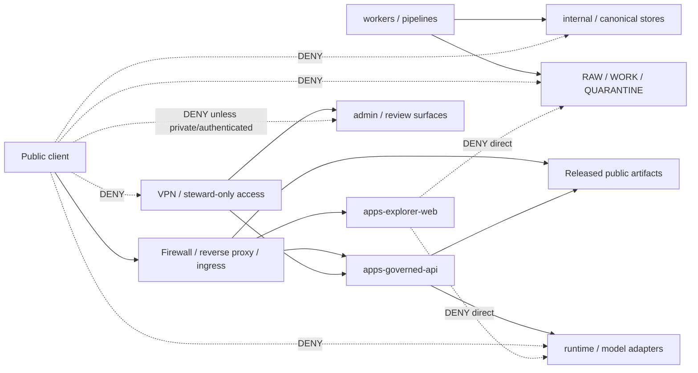

<!-- [KFM_META_BLOCK_V2]
doc_id: kfm://doc/infra-readme
title: infra/ — Deployment, Host, Network, and Exposure Posture Root
type: responsibility-root-readme
version: v1
status: draft
owners:
  - <infra-steward>
  - <security-owner>
  - <ops-steward>
created: 2026-07-03
updated: 2026-07-03
policy_label: public
related:
  - docs/doctrine/directory-rules.md
  - docs/security/README.md
  - docs/security/EXPOSURE_PLAN.md
  - docs/security/INCIDENT_RESPONSE.md
  - docs/security/KEY_ROTATION.md
  - docs/architecture/deployment-topology.md
  - docs/architecture/governed-api.md
  - docs/runbooks/
  - apps/governed-api/
  - apps/explorer-web/
  - apps/review-console/
  - apps/workers/
  - runtime/
  - configs/
  - policy/
  - release/
  - data/published/
  - infra/docker/
  - infra/compose/
  - infra/reverse_proxy/
  - infra/vpn/
  - infra/firewall/
  - infra/systemd/
  - infra/kubernetes/
  - infra/terraform/
  - infra/hardening/
tags:
  - kfm
  - infra
  - deployment
  - host
  - network
  - exposure
  - deny-by-default
  - least-privilege
  - governed-api
  - trust-membrane
  - auditability
notes:
  - "This README defines the infra/ responsibility root. It governs deployment mechanics and exposure posture; it is not policy authority, release authority, schema authority, source authority, or runtime implementation."
  - "Public clients and normal UI surfaces must use governed APIs and released artifacts. Infrastructure must deny direct access to RAW, WORK, QUARANTINE, internal stores, direct model endpoints, source credentials, unpublished candidates, and normal-public-path admin shortcuts."
[/KFM_META_BLOCK_V2] -->

<a id="top"></a>

# `infra/` — Deployment, Host, Network, and Exposure Posture Root

> **One-line purpose.** Keep KFM deployment surfaces deny-by-default, least-privilege, auditable, reversible, and subordinate to governed APIs, policy checks, evidence checks, release state, and rollback paths.


---

## Quick jump

[Purpose](#purpose) · [Status & authority](#status--authority) · [Root contract](#root-contract) · [Directory map](#directory-map) · [What belongs here](#what-belongs-here) · [What does not belong here](#what-does-not-belong-here) · [Trust membrane](#trust-membrane) · [Lane contracts](#lane-contracts) · [Inputs and outputs](#inputs-and-outputs) · [Validation](#validation) · [Review burden](#review-burden) · [Open verification](#open-verification)

---

## Purpose

`infra/` is the KFM responsibility root for deployment mechanics, host posture, network posture, service exposure, private access, infrastructure-as-code, and operational hardening.

It exists to keep the surrounding deployment environment aligned with the KFM lifecycle invariant:

```text
RAW -> WORK / QUARANTINE -> PROCESSED -> CATALOG / TRIPLET -> PUBLISHED
```

Infrastructure must preserve that boundary. A firewall rule, reverse proxy route, VPN route, systemd unit, container mapping, Kubernetes ingress, Terraform resource, or local runtime shortcut must not expose anything that KFM has not governed.

Public and normal UI traffic should follow this pattern:

```text
public client -> edge / proxy / ingress -> apps/governed-api/ or released public artifacts
```

Public and normal UI traffic must not reach RAW stores, WORK stores, QUARANTINE stores, unpublished candidates, source credentials, direct model runtimes, internal/canonical stores, admin surfaces, review consoles, debug routes, or operator-only shortcuts.

[Back to top](#top)

---

## Status & authority

| Field | Value |
|---|---|
| **Document type** | Responsibility-root README |
| **Owning responsibility root** | `infra/` |
| **Root role** | Deployment, host, network, private access, edge exposure, service management, infrastructure-as-code, and hardening posture |
| **Authority level** | Draft operational guidance. Directory Rules, accepted ADRs, `policy/`, security runbooks, release gates, and implementation contracts outrank this README. |
| **Lifecycle phase** | n/a — infrastructure guidance, not lifecycle data |
| **Default posture** | Deny-by-default exposure; least privilege; no direct raw/model/internal public path; audit-relevant operations; reversible changes |
| **Owners** | `<infra-steward>`, `<security-owner>`, `<ops-steward>` — fill from CODEOWNERS when assigned |
| **Reviewers required** | Infra steward + security owner for exposure, secrets, credentials, service identity, public edge, admin/review access, model-runtime, raw/internal-store, or production changes |
| **Directory Rules basis** | `infra/` is the named root for deployment, host, network, and exposure posture. |

[Back to top](#top)

---

## Root contract

`infra/` owns deployment mechanics and exposure posture. It does **not** own KFM truth, policy, evidence semantics, release decisions, or application behavior.

### This root must preserve

- **Deny-by-default exposure.** Nothing is public unless explicitly routed, reviewed, and governed.
- **Governed API path.** Trust-bearing public interactions go through `apps/governed-api/`.
- **Released artifact path.** Static public assets and exports must be released, rollback-addressable, and policy-safe.
- **No direct model exposure.** Model runtimes and adapters stay behind governed APIs and private maintenance boundaries.
- **No raw public exposure.** RAW, WORK, QUARANTINE, unpublished candidates, source credentials, and internal/canonical stores are not public paths.
- **Least privilege.** Services, identities, peers, roles, mounts, ports, and routes receive only the access they need.
- **Auditability.** Security-relevant changes and operations should produce reviewable evidence without leaking secrets.
- **Rollback.** Exposure and deployment changes should have rollback or documented forward-fix paths.
- **No secrets in Git.** Real credentials, private keys, tokens, state, and production access bundles never belong in this root.

### This root must not decide

- Whether a KFM claim is true.
- Whether evidence is sufficient.
- Whether a sensitive object may be published.
- Whether a release is approved.
- Whether policy allows or denies a domain action.
- Whether generated AI output is authoritative.

Those decisions live in the governed policy, evidence, review, release, and application layers. Infrastructure enforces the boundary; it does not replace it.

[Back to top](#top)

---

## Directory map

```text
infra/
├── README.md
├── docker/
├── compose/
├── reverse_proxy/
├── vpn/
├── firewall/
├── systemd/
├── kubernetes/
├── terraform/
└── hardening/
```

### Lane summary

| Lane | Primary responsibility | Public exposure posture |
|---|---|---|
| `infra/docker/` | Container build/runtime templates and container boundary notes | No direct raw/model/internal public path |
| `infra/compose/` | Local or small-host multi-service orchestration | Private/local by default; explicit public routes only |
| `infra/reverse_proxy/` | Public edge routing, TLS/header/CORS posture, route denials | Public routes only to governed API or released assets |
| `infra/vpn/` | Private/steward-only access governance | Not a public path; not a governance bypass |
| `infra/firewall/` | Host/network ingress and egress rules | Deny-by-default; explicit allow rules only |
| `infra/systemd/` | Host service units, timers, sockets, restart/log posture | Services least-privilege; public listeners reviewed |
| `infra/kubernetes/` | Kubernetes manifests, namespaces, NetworkPolicy, RBAC, ingress | Cluster public ingress governed and explicit |
| `infra/terraform/` | Infrastructure-as-code provisioning, state safety, resource ownership | No public default resources; state protected |
| `infra/hardening/` | Cross-infra hardening baselines, review checklists, validation notes | Deny-by-default and least-privilege proof lane |

[Back to top](#top)

---

## What belongs here

Use `infra/` for deployment and exposure materials such as:

- Host, local, staging, production, and private deployment guidance.
- Container and compose deployment templates.
- Reverse-proxy, ingress, firewall, VPN/private access, systemd, Kubernetes, and Terraform materials.
- Infrastructure hardening checklists and validation notes.
- Non-secret environment templates and secret-reference patterns.
- Sanitized examples that help maintainers deploy KFM without leaking sensitive information.
- Route inventories and exposure posture notes.
- Service boundary diagrams.
- Infrastructure rollback and recovery notes.
- Audit/logging expectations for deployment and exposure changes.
- Validation checklists for route denial, model isolation, raw-data denial, and public asset release boundaries.

Accepted file types depend on lane: Markdown, YAML, `.tf`, `.service.example`, `.timer.example`, `.conf.example`, `.env.example`, templates, diagrams, sanitized reports, and validation notes are acceptable when they match the lane and contain no secrets.

[Back to top](#top)

---

## What does not belong here

Do **not** use `infra/` as a parallel authority root.

The following must not live here:

- Real secrets, tokens, private keys, certificates, passwords, live `.env` files, production VPN/access bundles, provider credentials, SSH keys, kubeconfigs, or service-account credentials.
- Terraform state, unredacted plan files, crash logs containing secrets, or live deployment inventories containing sensitive private topology.
- RAW data, WORK data, QUARANTINE data, catalog records, triplets, proofs, receipts, release manifests, published data artifacts, or source datasets.
- KFM policy bundles, allow/deny rules, Rego policy, or sensitivity-policy authority that belongs in `policy/`.
- JSON Schemas or machine contracts that belong under `schemas/contracts/v1/...`.
- Application source code that belongs under `apps/`, reusable code under `packages/`, or runtime/model adapters under `runtime/`.
- Release decisions, rollback cards, correction notices, publication approvals, or promotion receipts that belong under `release/`.
- Direct public routes to model runtimes, RAW / WORK / QUARANTINE stores, source credentials, internal/canonical stores, admin panels, review consoles, debug endpoints, or unpublished candidates.
- Unredacted incident details, exploit payloads, private host inventories, or sensitive vulnerability working notes.

If any secret or sensitive operational artifact lands under `infra/`, treat it as a security incident: rotate or revoke affected access, audit exposure, remove the material, and record the response through the incident/runbook process.

[Back to top](#top)

---

## Trust membrane

Infrastructure should make KFM's trust membrane observable and enforceable.


```mermaid
flowchart LR
    Public[Public client]
    Edge[Firewall / reverse proxy / ingress]
    Explorer[apps-explorer-web]
    GovAPI[apps-governed-api]
    Published[Released public artifacts]
    Runtime[runtime / model adapters]
    Workers[workers / pipelines]
    Raw[RAW / WORK / QUARANTINE]
    Internal[internal / canonical stores]
    Admin[admin / review surfaces]
    Private[VPN / steward-only access]

    Public --> Edge
    Edge --> Explorer
    Edge --> GovAPI
    Edge --> Published
    GovAPI --> Published
    GovAPI --> Runtime
    Workers --> Raw
    Workers --> Internal
    Private --> Admin
    Private --> GovAPI

    Public -. DENY .-> Runtime
    Public -. DENY .-> Raw
    Public -. DENY .-> Internal
    Public -. DENY unless private/authenticated .-> Admin
    Public -. DENY .-> Private
    Explorer -. DENY direct .-> Runtime
    Explorer -. DENY direct .-> Raw
```

### Required negative states

Every public or semi-public deployment must prove these are denied:

1. Public client -> direct model/runtime endpoint.
2. Public client -> RAW store.
3. Public client -> WORK store.
4. Public client -> QUARANTINE store.
5. Public client -> unpublished release candidate.
6. Public client -> internal/canonical store.
7. Public client -> source credentials.
8. Public client -> admin/review surface without steward-private access and application auth.
9. Public client -> debug endpoint.
10. Infrastructure shortcut -> publication without release gate.

[Back to top](#top)

---

## Lane contracts

### `docker/`

Container materials must keep runtime boundaries clear: no secret values, no broad host mounts, no direct public model path, no direct raw-data public path, and no hidden publication shortcut.

### `compose/`

Compose materials should default to local/private use. Any public port mapping must be explicit, reviewed, and paired with hardening and route-denial evidence.

### `reverse_proxy/`

Reverse proxy materials own public-edge routing behavior. Public paths must route only to `apps/governed-api/`, `apps/explorer-web/`, or released public assets. Direct raw/model/internal/admin routes are denied.

### `vpn/`

VPN/private-access materials document steward-only access governance. VPN is not a publication authority and not a substitute for policy, evidence, review, release, or application authentication.

### `firewall/`

Firewall materials own host/network allow and deny posture. Rules should be explicit, narrow, deny-by-default, reviewable, and rollback-safe.

### `systemd/`

systemd materials own service units, timers, sockets, restart behavior, journal posture, and service hardening. Services should run least-privilege and expose only reviewed listeners.

### `kubernetes/`

Kubernetes materials own cluster manifests, namespace boundaries, service accounts, NetworkPolicy, ingress, and workload hardening. Cluster public ingress must preserve governed API and release boundaries.

### `terraform/`

Terraform materials own infrastructure provisioning. State is sensitive; live credentials and state do not belong in Git. Terraform may provision infrastructure but cannot decide KFM truth, policy, or release state.

### `hardening/`

Hardening materials provide cross-infra baselines, checklists, negative-state tests, and review gates. This lane helps prove the other lanes do not weaken the trust membrane.

[Back to top](#top)

---

## Inputs and outputs

### Inputs

`infra/` may consume:

- Directory Rules and accepted ADRs.
- Security exposure plan, incident response, and key rotation guidance.
- Non-secret configuration templates from `configs/`.
- Deployment topology decisions.
- Application service contracts from `apps/`.
- Runtime isolation requirements from `runtime/`.
- Policy and release requirements from `policy/` and `release/`.
- Validation expectations from `tests/`, `tools/validators/`, or runbooks when present.

### Outputs

`infra/` may produce:

- Deployment templates.
- Route maps.
- Firewall, proxy, systemd, Kubernetes, Terraform, Docker, and Compose materials.
- Hardening checklists.
- Sanitized validation reports.
- Rollback notes.
- Operational diagrams.
- Review evidence for deny-by-default, least privilege, no direct model exposure, no raw-data exposure, and auditability.

`infra/` outputs do not publish KFM data by themselves. Publication remains a governed release transition.

[Back to top](#top)

---

## Validation

Infrastructure changes should include evidence appropriate to the lane changed.

| Check | Expected result | Evidence |
|---|---|---|
| Directory placement | File belongs under the correct `infra/` lane | PR review |
| Secret scan | No secrets, credentials, private keys, tokens, state, or live access bundles committed | Secret scan result |
| Public route review | Public paths are explicit and governed | Route inventory / edge diff |
| Raw-data denial | Public path cannot reach RAW/WORK/QUARANTINE | Negative test or proof note |
| Model isolation | Direct model/runtime public path denied | Negative test or proof note |
| Admin isolation | Admin/review surfaces private, authenticated, and audited | Access review |
| Least privilege | Services, roles, mounts, peers, and identities are scoped | Config review |
| Audit/logging | Security-relevant events observable without leaking secrets | Redacted sample |
| Release boundary | Public assets are released and rollback-addressable | Release reference |
| Rollback | Change can be reverted or forward-fixed safely | Rollback note |

Use `infra/hardening/CHECKLIST.md` for exposure-significant changes.

[Back to top](#top)

---

## Review burden

| Change type | Required review |
|---|---|
| README-only wording with no posture change | Infra steward or docs steward |
| Public exposure, edge route, firewall, ingress, or DNS behavior | Infra steward + security owner + governed API owner |
| VPN/private-access or admin/review access | Infra steward + security owner + ops steward |
| systemd service, container, compose, Kubernetes, or Terraform change touching exposure | Infra steward + security owner |
| Model-runtime service, route, mount, or network path | Runtime owner + security owner |
| RAW / WORK / QUARANTINE / internal-store access | Data steward + security owner |
| Public artifact hosting or export serving | Release steward + infra steward + security owner |
| Secret-reference, credential, state, or key-rotation language | Security owner + infra steward |
| Production deployment posture | Infra steward + security owner + release steward |
| Exception to deny-by-default or least privilege | ADR or documented risk acceptance with rollback path |

[Back to top](#top)

---

## Open verification

- [ ] Confirm CODEOWNERS for `infra/` and each infra lane.
- [ ] Confirm deployment topology: local-only, homelab, staging, production, public-facing, VPN-only, or mixed.
- [ ] Confirm which lanes are active now versus reserved for future use.
- [ ] Confirm reverse-proxy / edge stack.
- [ ] Confirm firewall stack.
- [ ] Confirm VPN/private-access stack and governance-only documentation boundary.
- [ ] Confirm Docker/Compose service layout.
- [ ] Confirm systemd service strategy.
- [ ] Confirm Kubernetes adoption status.
- [ ] Confirm Terraform adoption status and state backend posture.
- [ ] Confirm public artifact hosting pattern.
- [ ] Confirm model-runtime network binding and maintenance boundary.
- [ ] Confirm raw/internal-store mount and service-account boundaries.
- [ ] Confirm CI validation commands for infra linting, secret scanning, route-denial checks, and hardening review.
- [ ] Confirm rollback process for each infrastructure lane.

[Back to top](#top)

---

## Last reviewed

| Field | Value |
|---|---|
| Last reviewed | 2026-07-03 |
| Review status | Draft root README replacing short proposed placeholder |
| Next review trigger | Any concrete public exposure, private-access, system service, orchestration, IaC, model-runtime, raw-data-boundary, release-hosting, or production deployment PR |
