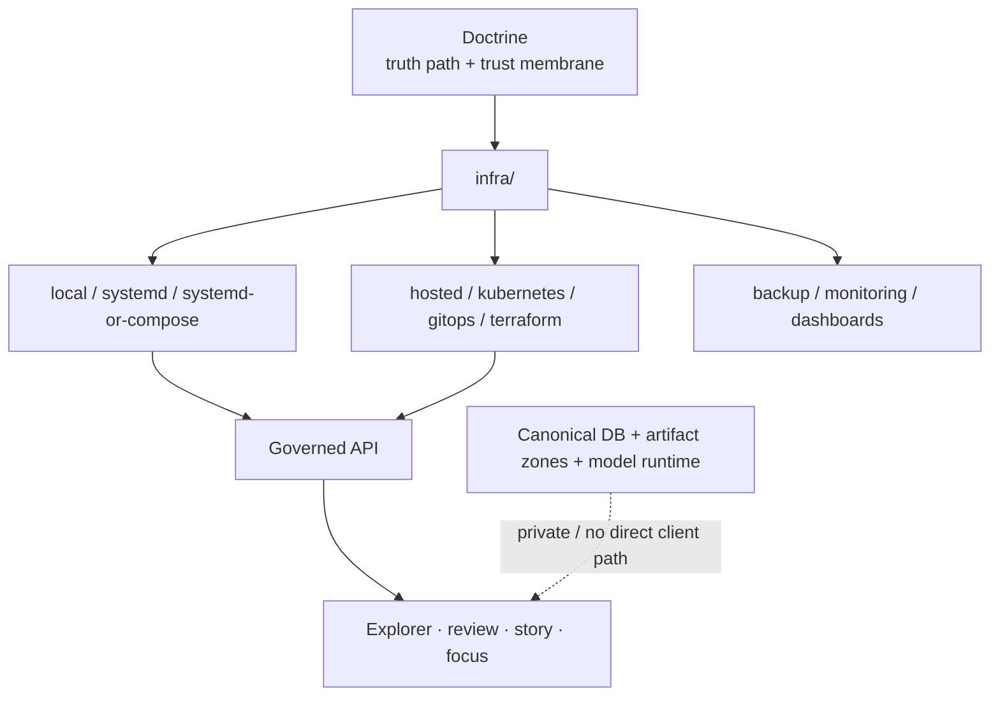

<!-- [KFM_META_BLOCK_V2]
doc_id: kfm://doc/NEEDS_VERIFICATION
title: infra
type: standard
version: v1
status: draft
owners: @bartytime4life
created: NEEDS_VERIFICATION
updated: 2026-04-05
policy_label: NEEDS_VERIFICATION
related: [../README.md, ../docs/, ../contracts/, ../policy/, ../schemas/, ../tests/, ../apps/, ../packages/, ../pipelines/, ../.github/]
tags: [kfm, infra, deployment, runtime, operations]
notes: [Current-session revision preserves the existing public infra README shape, confirms public-main CODEOWNERS coverage for /infra/, and keeps non-public settings, mounted checkout details, manifests, dashboards, alerts, and runtime logs explicitly unverified.]
[/KFM_META_BLOCK_V2] -->

# infra

Bring-up, deployment, runtime control, exposure management, observability, restore, and rollback surface for Kansas Frontier Matrix.

> **Status:** experimental  
> **Owners:** `@bartytime4life`  
>       
> **Repo fit:** `infra/README.md` is the directory guide for runtime-facing infrastructure material that must preserve KFM’s truth path, trust membrane, and governed API boundary.  
> **Quick jump:** [Scope](#scope) · [Repo fit](#repo-fit) · [Accepted inputs](#accepted-inputs) · [Exclusions](#exclusions) · [Directory tree](#directory-tree) · [Quickstart](#quickstart) · [Usage](#usage) · [Diagram](#diagram) · [Operating tables](#operating-tables) · [Task list](#task-list--definition-of-done) · [FAQ](#faq) · [Appendix](#appendix)

> [!IMPORTANT]
> This README is evidence-bounded. In this session, the March–April 2026 KFM corpus **and** the current public GitHub repo tree were inspected. That means the public `infra/` subtree is **CONFIRMED as a checked-in directory surface on public `main`**, but a local mounted checkout, active deployment manifests, workflow runs, dashboard contents, alert rules, and runtime logs were **not** directly verified here. Treat lane-level runtime behavior and non-public platform settings as **NEEDS VERIFICATION** until the working checkout and runtime evidence are inspected.

> [!NOTE]
> Current public `main` confirms both the infra lane structure and broad owner coverage for `/infra/`: `backup/`, `compose/`, `dashboards/`, `gitops/`, `hosted/`, `kubernetes/`, `local/`, `monitoring/`, `systemd-or-compose/`, `systemd/`, and `terraform/` are present, and public `CODEOWNERS` assigns `/infra/` to `@bartytime4life`. That still does **not** prove lane-by-lane operational ownership, manifest quality, or active environment use.

---

## Scope

`infra/` is the repository surface for **bring-up, deployment, runtime control, exposure management, observability wiring, restore, rollback, and operational correction**.

In KFM, that makes `infra/` more than a generic “ops” folder. Infrastructure can either preserve the trust membrane or quietly dissolve it. A public client path that bypasses the governed API, a model server exposed for convenience, a restore story that was never rehearsed, or a release with no visible rollback lineage are all infrastructure failures in the KFM sense.

**Repo-fit rule:** `infra/` should version **how KFM runs**. It should not become the canonical home of policy law, business rules, API semantics, or dataset truth.

[Back to top](#infra)

## Repo fit

**Path:** `infra/README.md`  
**Role:** directory README for runtime, delivery, and operational-control material.

| Direction | Surface | Why it matters |
|---|---|---|
| Upstream | [`../README.md`](../README.md) | Root doctrine, repo orientation, and global trust posture |
| Upstream | [`../docs/`](../docs/) | Architecture manuals, ADRs, runbooks, and longer-form operating references |
| Adjacent | [`../contracts/`](../contracts/), [`../policy/`](../policy/), [`../schemas/`](../schemas/), [`../tests/`](../tests/) | Shared boundaries that infra must preserve rather than redefine |
| Adjacent | [`../apps/`](../apps/), [`../packages/`](../packages/), [`../pipelines/`](../pipelines/), [`../.github/`](../.github/) | Service, shared-library, pipeline, and repository-level delivery/governance surfaces that infra changes often intersect with |
| Downstream | [`./local/`](./local/), [`./systemd/`](./systemd/), [`./compose/`](./compose/), [`./kubernetes/`](./kubernetes/), [`./terraform/`](./terraform/) | Runtime lanes that reconcile approved intent into actual environments |

### Repo fit notes

- `infra/` is a top-level peer of the repo’s other major surfaces, not an afterthought directory.
- The current public tree confirms the lane names; it does **not** by itself prove active deployment usage, manifest quality, or environment maturity.
- The corpus treats observability, rollback, and correction as trust-bearing concerns, so `infra/` should remain closely coupled to runbooks and proof objects rather than drifting into undocumented operator folklore.
- Infra changes that alter scheduler, watcher, or job-adjacent behavior should be reviewed with `../pipelines/` and `../.github/`, not in isolation.

## Accepted inputs

Content that belongs here includes:

| Category | Typical contents | Why it belongs here |
|---|---|---|
| Local runtime bring-up | `systemd` units, timers, overrides, bind rules, host bootstrap notes, loopback-only profiles | The strongest phase-one runtime doctrine is explicitly systemd-first and single-host friendly |
| Delivery overlays | Compose descriptors, hosted config overlays, reverse-proxy wiring, ingress notes | These turn approved release intent into reachable runtime surfaces |
| Infrastructure as code | Terraform modules, network/storage provisioning, environment descriptors | Infra changes should be reviewable, reproducible, and diffable |
| Orchestration and reconciliation | Kubernetes manifests, Helm/Kustomize overlays, GitOps declarations | Later hosted lanes still have to preserve KFM doctrine |
| Monitoring and alerts | Metrics collection, scrape configs, alert rules, health probes, join-key notes | KFM treats logs, metrics, traces, policy decisions, and audit joins as one evidence system |
| Dashboards and operator views | Dashboard provisioning, panel definitions, operational status boards | Operator-facing visibility belongs near the runtime surfaces it explains |
| Backup / restore / rollback | Backup descriptors, restore procedures, rollback bundles, stale-state handling | Restore rehearsal and correction lineage are required operational behaviors |
| Runtime-impacting ops prose | Bring-up notes, maintenance steps, environment profiles, incident/runbook references | Runtime-affecting changes should ship with their instructions |

## Exclusions

The following do **not** belong here as the authoritative source of truth:

| Keep out of `infra/` | Put it here instead |
|---|---|
| Service code, UI code, worker business logic, or pipeline implementation logic | `../apps/`, `../packages/`, `../pipelines/` |
| Canonical API contracts and schemas | `../contracts/` and `../schemas/` |
| Policy rule bodies and policy-test truth | `../policy/` |
| Dataset descriptors, catalog objects, EvidenceBundles, or release content themselves | the project’s data, catalog, evidence, and release surfaces |
| Shared trust vocabulary, decision grammar, or contract fixtures | `../contracts/`, `../schemas/`, and `../tests/` |
| Ad hoc committed secrets, private keys, or ambient credentials | secret-management paths, not repo plaintext |
| Detached long-form doctrine already kept under docs | `../docs/` and `../docs/runbooks/` where that pattern exists |
| Silent promotion logic disguised as “just deployment” | release, policy, review, and proof-pack surfaces |

## Evidence labels used in this README

| Label | Meaning in this file |
|---|---|
| **CONFIRMED** | Supported by the attached March–April 2026 corpus, direct public-tree inspection, or both |
| **INFERRED** | A careful conclusion drawn from multiple project documents, but not directly proven in local runtime evidence |
| **PROPOSED** | A recommended lane behavior, operating pattern, or sequencing move that fits the corpus |
| **NEEDS VERIFICATION** | Exact contents, active environment usage, or implementation detail not directly confirmed here |

## Directory tree

### Current public tree *(CONFIRMED on public `main`)*

```text
infra/
├── backup/
├── compose/
├── dashboards/
├── gitops/
├── hosted/
├── kubernetes/
├── local/
├── monitoring/
├── systemd-or-compose/
├── systemd/
├── terraform/
└── README.md
```

### How to read the current lanes

| Path | Reading in this README | Status |
|---|---|---|
| [`./backup/`](./backup/) | Restore, rollback, recovery, and related operator artifacts | Path **CONFIRMED**; contents **NEEDS VERIFICATION** |
| [`./compose/`](./compose/) | Local or narrow multi-service descriptors | Path **CONFIRMED**; active use **NEEDS VERIFICATION** |
| [`./dashboards/`](./dashboards/) | Operator-facing dashboard definitions or provisioning | Path **CONFIRMED**; contents **NEEDS VERIFICATION** |
| [`./gitops/`](./gitops/) | Declarative reconciliation and environment intent | Path **CONFIRMED**; active reconciler use **NEEDS VERIFICATION** |
| [`./hosted/`](./hosted/) | Remote or split-edge overlays beyond local-only bring-up | Path **CONFIRMED**; environment scope **NEEDS VERIFICATION** |
| [`./kubernetes/`](./kubernetes/) | Orchestrated deployment overlays and cluster-facing manifests | Path **CONFIRMED**; live cluster role **NEEDS VERIFICATION** |
| [`./local/`](./local/) | Local bring-up, host-local wiring, and single-machine profiles | Path **CONFIRMED**; exact contents **NEEDS VERIFICATION** |
| [`./monitoring/`](./monitoring/) | Metrics, alerts, scrape rules, telemetry joins, and related operational wiring | Path **CONFIRMED**; contents **NEEDS VERIFICATION** |
| [`./systemd-or-compose/`](./systemd-or-compose/) | Replacement-grade phase-one service orchestration lane | Path **CONFIRMED**; exact contents **NEEDS VERIFICATION** |
| [`./systemd/`](./systemd/) | Native units, timers, overrides, and service isolation | Path **CONFIRMED**; exact service inventory **NEEDS VERIFICATION** |
| [`./terraform/`](./terraform/) | Host, network, storage, and environment provisioning | Path **CONFIRMED**; applied environments **NEEDS VERIFICATION** |

### Documentary consequences

The current tree is not random. It is consistent with three repeated corpus pressures:

- **phase-one local runtime** should stay small, legible, loopback-first, and systemd-centered
- **hosted and orchestrated growth** should arrive later through clearly separated overlays, not through public shortcuts
- **observability and rollback** are trust-bearing operational surfaces, not “nice-to-have” aftercare

> [!WARNING]
> Path presence is not the same thing as runtime proof. This README treats the checked-in public lane names as **CONFIRMED**, while keeping lane contents, active manifests, deployment maturity, and environment use explicitly **NEEDS VERIFICATION** until the working checkout and runtime evidence are inspected.

[Back to top](#infra)

## Quickstart

Start with verification before editing.

```bash
# 1) Confirm you are in the real repo checkout
git rev-parse --show-toplevel

# 2) Inspect the checked-in infra lanes
find infra -maxdepth 2 -mindepth 1 -type d | sort

# 3) Inventory runtime-shaped files
find infra -type f \
  \( -name '*.service' -o -name '*.timer' -o -name '*.socket' \
     -o -name '*.tf' -o -name '*.yaml' -o -name '*.yml' \
     -o -name 'compose*.yml' -o -name '*.json' \) \
  | sort

# 4) Re-read the adjacent trust surfaces this directory must preserve
sed -n '1,220p' README.md
sed -n '1,220p' docs/README.md 2>/dev/null || true
find contracts policy schemas tests -maxdepth 2 -type f | sort | sed -n '1,220p'

# 5) Check repository delivery/governance entrypoints
find .github -maxdepth 2 -type f | sort

# 6) When runtime changes affect jobs, watchers, or scheduled execution,
#    inspect the adjacent pipeline surface too
find pipelines -maxdepth 2 -mindepth 1 -type d 2>/dev/null | sort | sed -n '1,120p'

# 7) Confirm whether monitoring and dashboards are split or coupled in this checkout
find infra/dashboards infra/monitoring -maxdepth 3 -type f 2>/dev/null | sort
```

### Minimal review order

1. Confirm the actual `infra/` subtree in the working checkout.
2. Confirm which runtime lane you are touching: local-only, VPN-mediated private remote, hosted split-edge, or more separated production runtime.
3. Check whether the change affects bind addresses, exposure, service identities, rollback, restore, or correction propagation.
4. Confirm whether monitoring, dashboards, runbooks, and any job-adjacent pipeline surfaces are already split across existing paths.
5. Update docs, runbooks, and verification material in the same change stream.

## Usage

### Profiles, not dogma

The corpus does not say “always use Kubernetes,” and it does not say “never grow past one host.” It says: **prove the governed path with the smallest credible runtime, then add layers only when they earn their operational cost**.

### Phase-one local lane

The strongest runtime guidance favors a **small, legible Ubuntu host** as the first governed slice. That profile assumes:

- PostgreSQL + PostGIS for canonical structured truth
- a content-addressed or explicitly zoned artifact tree for `RAW`, `WORK / QUARANTINE`, `PROCESSED`, `CATALOG`, and `PUBLISHED`
- one governed API process on loopback
- one-shot jobs for ingest, build, publish, and projection work
- a local-only Ollama service behind an inference adapter
- **no public reverse proxy in phase one**

That is why a `systemd`-first lane is not a downgrade. It is the thinnest credible runtime that still keeps canonical stores and model serving private by construction.

### The current tree already supports staged growth

The checked-in public lane names show that the repo is already shaped to accommodate more than one maturity level:

- `local/`, `systemd/`, and `systemd-or-compose/` support the smallest governed slice
- `hosted/`, `kubernetes/`, `terraform/`, and `gitops/` support later environment growth
- `backup/`, `dashboards/`, and `monitoring/` make restore and observability first-class rather than implicit

The governing rule is still conservative: **use the existing lane structure, but do not assume a lane is active, complete, or authoritative until the local checkout and runtime evidence prove it**.

### Deployment progression

KFM’s deployment ladder is intentionally conservative:

1. **Local-only** — one host, loopback-only services, no public edge.
2. **VPN-mediated private remote** — trusted operator or reviewer access over an overlay network; canonical data and model runtime stay private.
3. **Hosted split-edge** — public UI plus governed API at the edge, with private canonical/data/model layers behind it.
4. **More separated production runtime** — edge gateway, identity, policy decision point, governed API, workers, canonical DB, object/artifact store, rebuildable projections, centralized telemetry, and controlled rollouts.

The rule is not “stay small forever.” It is “add operational layers only when they preserve KFM’s invariants better than the simpler shape.”

### Deployment is not promotion

`infra/` may contain the manifests, overlays, and reconcilers that move approved intent into runtime. It should **not** collapse these distinct KFM control functions into one vague “deploy” step:

- **CI** proves something about a candidate
- **build** proves artifact identity
- **deployment** changes runtime placement
- **promotion** changes trust state
- **projection rebuild** refreshes derived delivery artifacts
- **rollback / correction** restore safety without erasing lineage

Infra work is correct only when it preserves that separation.

### Monitoring, dashboards, rollback, and correction

Infra work is not done when a service starts. It is done when the service can be:

- observed
- explained
- rolled back
- restored
- corrected without lineage collapse

That is also why the current public split between `monitoring/` and `dashboards/` matters. Monitoring handles **signals and conditions**; dashboards handle **operator-facing views**. Keep that separation if the checked-in tree already uses it.

[Back to top](#infra)

## Diagram


```mermaid
flowchart TB
    A[Doctrine<br/>truth path + trust membrane] --> B[infra/]

    B --> C1[local / systemd / systemd-or-compose]
    B --> C2[hosted / kubernetes / gitops / terraform]
    B --> C3[backup / monitoring / dashboards]

    C1 --> D[Governed API]
    C2 --> D

    D --> E[Explorer · review · story · focus]
    X[Canonical DB + artifact zones + model runtime] -. private / no direct client path .-> E
```

The point of `infra/` is to make runtime reality preserve KFM law: **governed API in front, canonical truth and model runtime behind, operational evidence joined, and rollback/correction visible**.

## Operating tables

### Exposure ladder

| Profile | Public reachability | Primary controls | Why it exists |
|---|---|---|---|
| Local-only | none | loopback binds, local sockets, systemd isolation, host firewall | proves the governed path with minimum moving parts |
| LAN-only small-trust | private RFC1918 only | strict segmentation, no direct Ollama or DB exposure, deny-by-default firewall | transitional at most; not a substitute for stronger boundary design |
| VPN-mediated private remote | overlay/VPN only | WireGuard or equivalent, private addresses, narrow operator access | preferred remote-before-public step |
| Hosted split-edge | public proxy and governed API only | TLS, reverse proxy, private backend binds, structured request IDs | supports public-safe surfaces without exposing canonical or model layers |
| More separated production | public edge plus private control/data planes | identity, policy decision point, centralized telemetry, backups, controlled rollouts | earns its cost when scale, blast radius, and governance depth require it |

### Non-negotiable infra rules

| Rule | Infra consequence |
|---|---|
| Trust membrane | Public and role-limited clients reach KFM through the governed API, not DB, storage, or model endpoints |
| Loopback/private model runtime by default | Ollama or equivalent stays local or equally private until a stronger hosted posture is deliberately justified |
| Published-scope answers only | Runtime surfaces answer from released scope, not from raw/work/quarantine convenience paths |
| Fail-closed behavior | Stale, denied, abstaining, generalized, and error states must remain visible and inspectable |
| Observability is operational evidence | Logs, traces, metrics, alerts, policy decisions, and audit joins need stable IDs that survive deploy, runtime, restore, and correction |
| Restore before confidence | Backup claims stay weak until restore drills and rollback lineage are real |
| Docs stay in band | Runtime-impacting infra changes should ship with docs/runbooks, not after-the-fact tribal memory |

### Change-class minimums

| Change type | Minimum review payload |
|---|---|
| Infra lane change | path diff, rationale, rollback path, docs update |
| Exposure / bind change | bind-address note, auth path, firewall or reverse-proxy consequence, smoke or canary plan |
| Monitoring / dashboard change | signal owner, alert or panel consequence, join-key impact, update note |
| Restore / rollback change | restore drill or rollback-test consequence, correction propagation note, runbook update |
| Phase-profile change | why the next rung is justified, which invariant remains unchanged, what becomes harder to reverse |

[Back to top](#infra)

## Task list / definition of done

An `infra/` change is not done until the following are true:

- [ ] The actual `infra/` subtree was inspected in the working checkout before adding new paths or claims.
- [ ] The change clearly belongs to bring-up, deployment, runtime control, exposure management, observability, restore, rollback, or operational correction.
- [ ] No direct client path to canonical stores or model runtime was introduced.
- [ ] Exposure choices are explicit: loopback, private address, VPN, hosted edge, or public edge.
- [ ] Build, deploy, promote, projection rebuild, rollback, and correction were not collapsed into one undocumented “deploy” step.
- [ ] Monitoring and dashboard consequences were reviewed when runtime behavior, alerts, or exposure changed.
- [ ] Rollback and restore consequences were documented.
- [ ] If the change affects job scheduling, watcher behavior, or pipeline execution, adjacent `../pipelines/` and `../.github/` surfaces were reviewed together.
- [ ] Material infra changes include the KFM minimum: manifest or IaC diff, rollback path, monitoring update, and docs or runbook update.
- [ ] If the change is still target-state architecture rather than mounted reality, it remains visibly labeled **PROPOSED** or **NEEDS VERIFICATION**.
- [ ] At least one stale-state, rollback, or correction consequence remains explainable at the surface layer—not only in operator notes.

## FAQ

### Is `infra/` only for Kubernetes and Terraform?

No. The current public tree includes those lanes, but the strongest phase-one runtime guidance is still a **systemd-first Ubuntu host** with loopback/private exposure and no public edge.

### Why does this README distinguish between a confirmed tree and unverified runtime behavior?

Because path presence proves the directory surface, not the active environment, manifest quality, deployment maturity, or operational health.

### Why are both `monitoring/` and `dashboards/` present?

Because the public tree currently separates them. Treat that as an intentional split unless the working checkout and adjacent docs justify consolidating them.

### Does this README claim the active manifests, dashboards, or logs were inspected?

No. It claims the current public tree and public `infra/README.md` were inspected. Runtime artifacts and private platform settings remain **NEEDS VERIFICATION**.

### What is the smallest credible infra slice?

A hardened Ubuntu host with loopback-only governed API, local-only Ollama, PostgreSQL/PostGIS on local socket or localhost, explicit lifecycle zones, one-shot jobs, and **no public reverse proxy**.

## Appendix

<details>
<summary><strong>Current-session evidence boundary</strong></summary>

This revision is stronger than a corpus-only draft because it also inspected the current public GitHub repo tree, the current public `infra/` subtree, and the current public `CODEOWNERS` signal for `/infra/`. It is still weaker than a full checkout audit because no local mounted repository tree, private GitHub settings, deployment manifests, dashboard contents, alert rules, or runtime logs were directly verified in-container.

</details>

<details>
<summary><strong>Current public ownership signal</strong></summary>

Current public `CODEOWNERS` assigns `/infra/` to `@bartytime4life`.

Treat that as **CONFIRMED public-main path coverage**, not as proof that every infra lane already has narrower operational owners, reviewer rotations, or environment-specific stewards on the working branch under review.

</details>

<details>
<summary><strong>Current public subtree checklist</strong></summary>

The current public `infra/` tree shows these checked-in lanes:

```text
backup/
compose/
dashboards/
gitops/
hosted/
kubernetes/
local/
monitoring/
systemd-or-compose/
systemd/
terraform/
README.md
```

Before changing this shape, confirm whether the working checkout adds hidden files, different lane contents, or environment-specific overlays not visible in the public browser view.

</details>

<details>
<summary><strong>Verification backlog before merge</strong></summary>

Before treating this README as fully checkout-faithful, verify:

1. whether the working-branch `CODEOWNERS` still assigns `/infra/` to `@bartytime4life` or narrows ownership more specifically
2. whether `.github/workflows/` in the working checkout still contains only documentation or now includes active workflow YAML
3. the actual contents and intended roles of `backup/`, `gitops/`, `monitoring/`, and `dashboards/`
4. which manifests are authoritative in each environment: systemd, Compose, Helm, Kustomize, raw Kubernetes, GitOps, or another reconciler
5. which restore drills, rollback bundles, dashboards, and alert rules are already implemented
6. whether any active runtime uses paths or names not visible in the public tree
7. which approvals, checks, and promotion gates protect infra-changing PRs

</details>

[Back to top](#infra)
