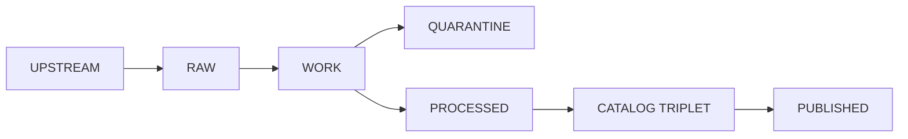
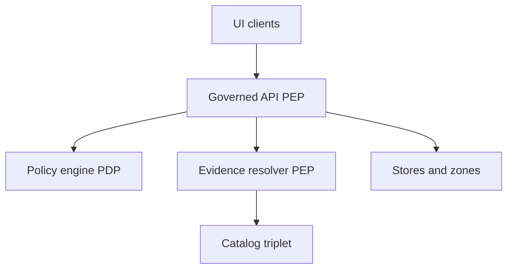
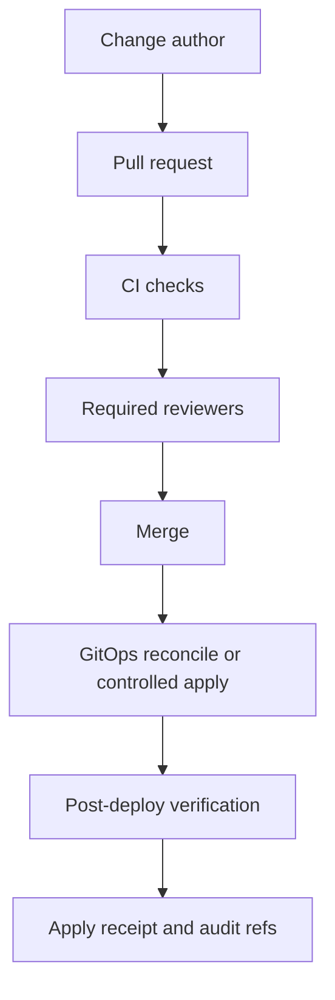

<!-- [KFM_META_BLOCK_V2]
doc_id: kfm://doc/5d0d8d5a-6b3a-4a6e-bde4-7b8d7b8f9d0a
title: infra/README
type: standard
version: v3
status: draft
owners: platform-infra
created: 2026-02-25
updated: 2026-03-02
policy_label: restricted
related:
  - ../README.md
  - ../.github/README.md
  - ../SECURITY.md
  - ../docs/
  - ../configs/
  - ../contracts/
  - ../data/
tags: [kfm, infra, iac, ops, gitops, kubernetes, terraform, security, observability, trust-membrane, truth-path, promotion-contract, audit-ledger, receipts, parity]
notes:
  - KFM-aligned infra contract: trust membrane + truth path zone controls + fail-closed promotion + auditability.
  - Aligned to Promotion Contract v1 + refined zone definitions (RAW / WORK+QUARANTINE / PROCESSED / CATALOG-TRIPLET / PUBLISHED).
  - TODO (repo): add cross-links to `../policy/` and `../tools/` once confirmed on this branch.
  - Intentionally stack-agnostic until repo reality is confirmed (Terraform/Pulumi, Helm/Kustomize, Argo/Flux).
  - Never commit secrets. Store only references to secret managers.
[/KFM_META_BLOCK_V2] -->

<a id="top"></a>

# infra/

Infrastructure-as-Code (IaC), deployment assets, and operational controls for Kansas Frontier Matrix (KFM) environments.

**Core posture:** default-deny • fail-closed promotion • audit-by-design • least privilege  
**Owners:** `platform-infra` (source of truth: `CODEOWNERS`)  
**Policy label:** `restricted` (may include environment topology and operational details)


---

## Quick navigation

- [Truth status legend](#truth-status-legend)
- [Purpose](#purpose)
- [Infra contract surfaces](#infra-contract-surfaces)
- [Directory contract](#directory-contract)
- [Where this fits in the repo](#where-this-fits-in-the-repo)
- [Truth path zones](#truth-path-zones)
- [Promotion Contract v1](#promotion-contract-v1)
- [Policy parity architecture](#policy-parity-architecture)
- [Receipts, attestations, and audit](#receipts-attestations-and-audit)
- [Non-negotiable invariants](#non-negotiable-invariants)
- [Environments and promotion lanes](#environments-and-promotion-lanes)
- [Change workflow and gates](#change-workflow-and-gates)
- [Security and secrets](#security-and-secrets)
- [Observability](#observability)
- [Disaster recovery](#disaster-recovery)
- [Directory layout](#directory-layout)
- [Runbooks](#runbooks)
- [Definition of Done](#definition-of-done)

---

## Truth status legend

### Evidence tags (truth discipline)

- **CONFIRMED (design):** required KFM invariants (non-negotiable)
- **CONFIRMED (docs):** explicitly stated in KFM governance/design documents (but still verify repo implementation)
- **UNKNOWN (repo):** toolchain/details not verified on this branch yet
- **PROPOSED:** recommended patterns to adopt once verified

### Normative language (how to read requirements)

- **MUST** = required for KFM (non-negotiable; enforce by tests/gates)
- **SHOULD** = strongly recommended; justify deviations in the PR
- **MAY** = optional; use when it reduces risk or complexity

> [!IMPORTANT]
> If this README contradicts repo reality (paths, tools, CI check names), treat the repo as the source of truth and update this README in the same PR.

[↑ Back to top](#top)

---

## Purpose

`infra/` exists to store **buildable, reviewable, reversible** infrastructure and deployment artifacts that support KFM while preserving the **trust membrane** and **fail-closed promotion**.

Design goals:

- **Reproducible:** infra derives from git + deterministic tooling (no click-ops as the source of truth)
- **Governed:** changes cross a policy boundary (PR review + required checks)
- **Auditable:** plan/apply receipts trace environment mutations to commit SHAs + actor principals
- **Safe by default:** no secrets committed; least privilege; controlled rollout; policy parity (CI == runtime)

> [!NOTE]
> The goal is governed operations that preserve KFM’s credibility, not “move fast and hope.”

[↑ Back to top](#top)

---

## Infra contract surfaces

Infra is not “just deployment.” In KFM, infra is part of the **evidence chain** and must make it mechanically hard to violate governance.

### Contract surfaces owned or enabled by infra

- **Storage zones + IAM** for truth path artifacts (RAW/WORK/PROCESSED/CATALOG/PUBLISHED)
- **Policy engine deployment** (PDP) and enforcement wiring (PEPs)
- **Catalog + evidence services availability** (catalog reader, evidence resolver, policy gate service)
- **Receipt and audit sinks** (apply receipts, drift reports, run receipts and attestations storage)
- **Runtime perimeter** (network policies, private endpoints, ingress rules, egress allowlists)
- **Supply chain hooks** (image pinning, provenance attestations, signature verification, SBOM wiring)

### What infra must not do

Infra MUST NOT introduce a bypass around governance (examples):

- public buckets as a “shortcut CDN” for restricted artifacts
- UI directly reading PostGIS, object storage, indexes, or graph stores
- tile/export hosting that bypasses policy and obligations
- embedding admin/service credentials in clients

[↑ Back to top](#top)

---

## Directory contract

### What belongs here

✅ IaC modules/stacks (Terraform/Pulumi/etc.) for:
- network, IAM/RBAC, compute, storage, identity plumbing (**no secret values**)
- managed services provisioning (DBs, queues, object stores)

✅ Kubernetes manifests / Helm charts / Kustomize overlays (if applicable)

✅ GitOps controller configuration (Argo CD/Flux/etc.), environment overlays, reconciliation policy

✅ Platform guardrails:
- admission policies (OPA Gatekeeper/Kyverno/etc.)
- baseline security configs (Pod Security Admission posture, network policies)

✅ Observability wiring:
- dashboards-as-code, alert rules (policy-safe)

✅ Deterministic helper scripts:
- `fmt`, `validate`, `plan`, `apply`, `drift`, `smoke` (documented, no hidden mutations)

✅ Receipt *schemas/templates* and validation configs (optional):
- JSON Schemas for infra apply receipts and drift reports
- policy fixtures for “no-public-access” invariants

### What must not go here (fail closed)

- ❌ plaintext secrets, tokens, kubeconfigs, `.env` with real values  
- ❌ private keys/certificates, database dumps  
- ❌ dataset artifacts from truth-path zones (those belong under `data/` or canonical stores)  
- ❌ one-off “fix prod” scripts without PR trail + audit receipts  
- ❌ anything that creates a bypass around governed APIs

> [!WARNING]
> If it would be unsafe to paste into a public issue, it should not be committed here unless strictly necessary and access-controlled—and even then, prefer references.

[↑ Back to top](#top)

---

## Where this fits in the repo

`infra/` is the **operational perimeter** around the governed system.

> [!NOTE]
> **UNKNOWN (repo):** exact module names/paths.  
> Treat the list below as a documented target topology; verify on this branch and update.

- `contracts/` — OpenAPI + JSON Schemas + controlled vocabularies
- `policy/` — policy-as-code bundle(s) + fixtures/tests
- `data/` — truth path zones (RAW/WORK/PROCESSED/CATALOG/PUBLISHED) and registries
- `tools/` — validators + linkcheckers + gate runners
- `apps/` — UI + API + workers (runnable services)
- `docs/` — runbooks + ADRs + architecture docs

> [!IMPORTANT]
> Infra must never become a governance bypass:
> - no direct public access to storage zones
> - no public catalog hosting for restricted content
> - no unmanaged exports/tiles that avoid policy evaluation

[↑ Back to top](#top)

---

## Truth path zones

KFM’s lifecycle is not a metaphor — infra must make it mechanically enforceable.


```mermaid
flowchart LR
  upstream["UPSTREAM"] --> raw["RAW"]
  raw --> work["WORK"]
  work --> quarantine["QUARANTINE"]
  work --> processed["PROCESSED"]
  processed --> catalog["CATALOG TRIPLET"]
  catalog --> published["PUBLISHED"]
```

### Zone meanings (CONFIRMED docs)

- **RAW**: immutable acquisition copies + checksums (append-only; supersede with new acquisition)
- **WORK**: intermediate transforms, QA reports, candidate redactions/generalizations; may be rewritten
- **QUARANTINE**: failed validation, unclear licensing, sensitivity concerns; **not promoted**
- **PROCESSED**: publishable artifacts in approved formats + checksums + derived metadata for runtime
- **CATALOG TRIPLET**: cross-linked **DCAT + STAC + PROV** describing metadata, assets, and lineage
- **PUBLISHED**: governed runtime surfaces; may only serve promoted dataset versions

### Canonical vs rebuildable (CONFIRMED docs)

Infra MUST protect canonical stores (harder to mutate) and allow safe rebuild of projections.

- **Canonical** (protect strongly):
  - object storage artifacts (raw/work/processed)
  - catalogs (DCAT/STAC/PROV profiles)
  - audit ledger (append-only log)
- **Rebuildable** (may be recreated from canonical + receipts):
  - PostGIS tables derived from processed GeoParquet
  - search index derived from processed texts/metadata
  - graph edges derived from catalogs + entity resolution
  - tile bundles derived from processed features

[↑ Back to top](#top)

---

## Promotion Contract v1

Promotion is the act of moving a dataset version into the runtime surfaces. KFM requires promotion to **fail closed**: if a gate cannot be evaluated or fails, the dataset version must not be served.

### Minimum gates (CONFIRMED docs)

| Gate | What must be true (minimum credible set) | Infra support (what we enforce/provide) |
|---|---|---|
| **A — Identity and versioning** | stable `dataset_id`; immutable `dataset_version_id` derived from deterministic `spec_hash` | immutable-by-version object paths; prevent “mutable latest” references on public surfaces |
| **B — Licensing and rights metadata** | license is explicit; rights holder + attribution captured; unclear license stays in QUARANTINE | block distribution of “unknown license” artifacts; ensure license text/attribution can be delivered at runtime |
| **C — Sensitivity classification and redaction plan** | `policy_label` assigned; redaction/generalization plan exists and is recorded in PROV for sensitive/restricted | default-deny routing; prevent leaks via 403/404; require separate `public_generalized` derivatives when needed |
| **D — Catalog triplet validation** | DCAT exists; STAC exists where applicable; PROV exists; cross-links resolvable | validators + linkcheck in CI; runtime catalog read surfaces are policy-aware |
| **E — Run receipt and checksums** | `run_receipt` exists for each producing run; inputs/outputs enumerated with checksums; environment recorded | durable receipt store; integrity verification tools; time sync; retention rules |
| **F — Policy tests and contract tests** | OPA policy tests pass; evidence resolver resolves at least one EvidenceRef in CI; API schemas/contracts validate | policy bundle pinning by digest; CI parity gate; service contract tests; block promotion if “cannot evaluate” |
| **G — Optional but recommended** | SBOM + build provenance; performance smoke checks; accessibility smoke checks | supply chain attestation hooks; perf smoke environment; e2e UI smoke checks (policy-safe) |

> [!IMPORTANT]
> Gate evaluation MUST be monotonic and fail-closed:
> - “unknown” is treated as “deny”
> - missing artifacts are treated as “deny”
> - unverifiable signatures/digests are treated as “deny”

[↑ Back to top](#top)

---

## Policy parity architecture

KFM requires the same policy semantics in CI and runtime (or at minimum identical fixtures and outcomes). Otherwise, CI guarantees are meaningless.

### Shared policy semantics (PDP/PEP model)

- **PDP (Policy Decision Point):** evaluates policy and returns allow or deny plus obligations
- **PEPs (Policy Enforcement Points):**
  - **CI**: schema validation + policy tests block merges
  - **Runtime API**: policy checks before serving data
  - **Evidence resolver**: policy checks before resolving evidence and rendering bundles
  - **UI**: shows policy badges/notices; **UI never decides policy**


```mermaid
flowchart TB
  ui["UI clients"] --> api["Governed API PEP"]
  api --> pdp["Policy engine PDP"]
  api --> resolver["Evidence resolver PEP"]
  resolver --> catalogs["Catalog triplet"]
  api --> stores["Stores and zones"]
```

### Sensitivity defaults (PROPOSED baseline; align to KFM posture)

- default deny for sensitive-location and restricted datasets
- if any public representation is allowed, produce `public_generalized` derivatives
- never leak restricted metadata in 403/404 responses
- do not embed precise coordinates in Story Nodes or Focus Mode outputs unless policy explicitly allows
- treat redaction/generalization as a first-class transform recorded in PROV

[↑ Back to top](#top)

---

## Receipts, attestations, and audit

Infra changes are part of KFM’s evidence chain. Treat them like governed runs.

### Receipt types (baseline)

| Receipt | When | Minimum content | Storage |
|---|---|---|---|
| **Plan diff** | every PR touching infra | commit SHA; tool versions; rendered diff/plan output; target env(s) | PR artifacts; optional durable store |
| **Apply receipt** | every stage/prod mutation | commit SHA; actor principal; timestamps; tool versions; change summary; output digests | restricted audit sink; retention enforced |
| **Drift report** | scheduled | drift summary; impacted resources; timestamp; last known good commit | restricted store + alert channel |
| **Policy bundle digest** | every deploy | policy bundle digest pinned; fixture suite version | deployment metadata + logs |

### Receipt fail-closed rules

- If apply receipts are missing or not durable, treat as a **release blocker** for any environment that serves users.
- If signatures are used, unverifiable signatures MUST be treated as **untrusted** and MUST NOT be promoted as “green”.
- Receipts/logs MUST be classified and sanitized (no secrets; no restricted coordinates).

### Suggested typed receipt shape (PROPOSED)

```json
{
  "kind": "kfm.infra.ApplyReceipt",
  "env": "prod",
  "repo": { "commit": "SHA", "branch": "main" },
  "actor": { "principal": "…", "method": "gitops|ci|manual" },
  "tooling": [{ "name": "terraform|pulumi|kubectl|argocd", "version": "…" }],
  "inputs": [{ "ref": "plan-artifact", "digest": "sha256:…" }],
  "outputs": [{ "ref": "resource-state-summary", "digest": "sha256:…" }],
  "timestamps": { "started": "RFC3339", "finished": "RFC3339" }
}
```

[↑ Back to top](#top)

---

## Non-negotiable invariants

These are **CONFIRMED (design)**. Infra changes MUST preserve them.

### 1) Trust membrane

- Public clients MUST NOT read from object storage, databases, or internal indexes directly.
- Static hosting MUST NOT become an exfiltration path (tiles, exports, documents).
- All reads/writes MUST flow through governed services that apply:
  - policy decisions (deny/allow + obligations)
  - redaction/generalization where required
  - audit logging and receipts

### 2) Fail-closed promotion

Promotion gates MUST block any RAW or WORK to served jump.

If a required gate cannot be evaluated (missing catalogs, unclear license, missing policy label), the correct behavior is to **block promotion** and **deny serving**.

### 3) Canonical vs rebuildable

- Canonical: object storage zones + catalog triplet + audit ledger
- Rebuildable: PostGIS, search, graph, tiles, caches

Infra MUST protect canonical stores and MUST enable projections to be rebuilt safely.

### 4) Policy parity

Policy semantics MUST match between:
- CI gates (merge-time validation)
- runtime enforcement (API, evidence resolver, exports, tile serving)

### 5) Auditability and rollback

Every production mutation MUST have:
- PR trail
- plan/diff artifact
- apply receipt (who, what, when, tool versions)
- rollback path (git revert + reconcile, or documented alternative)

[↑ Back to top](#top)

---

## Environments and promotion lanes

> [!NOTE]
> **UNKNOWN (repo):** exact environment names and promotion rules.  
> The table below is a **PROPOSED** baseline until verified.

| Environment | Purpose | Change velocity | Promotion in | Promotion out |
|---|---|---:|---|---|
| `dev` | iteration + feature work | high | merge to `main` (or `dev`) | manual promote to `stage` |
| `stage` | release rehearsal | medium | release candidate/tag | manual promote to `prod` |
| `prod` | user-facing | low | controlled window + approvals | rollback only |

### Promotion artifacts (minimum expectation)

For any `stage` or `prod` promotion, capture:

- commit SHA (and tag if used)
- plan/diff artifact
- promotion gate results (Promotion Contract v1)
- apply receipt (tool versions, actor principal, timestamps)
- post-deploy verification (health + key policy flows)

[↑ Back to top](#top)

---

## Change workflow and gates

### Standard workflow (PROPOSED)


```mermaid
flowchart TB
  author["Change author"] --> pr["Pull request"]
  pr --> ci["CI checks"]
  ci --> review["Required reviewers"]
  review --> merge["Merge"]
  merge --> reconcile["GitOps reconcile or controlled apply"]
  reconcile --> verify["Post-deploy verification"]
  verify --> receipt["Apply receipt and audit refs"]
```

### Minimum required gates (CI-enforced)

- Formatting/lint (IaC + YAML)
- Static validation (terraform validate / helm template / kustomize build)
- Secrets scan (block credential patterns)
- “No-public-access” guardrails (deny public buckets, deny public DB endpoints)
- Policy pack tests (default-deny; fixtures for allow/deny + obligations)
- Plan/render diff attached to PR
- Drift detection (scheduled; alerts on drift) — recommended
- **Anti-skip:** required gates MUST NOT be bypassable via path filters or conditional `if:` logic

> [!IMPORTANT]
> Prefer a single always-runs **gate-summary** job as the required status check for branch protection.

[↑ Back to top](#top)

---

## Security and secrets

### Secrets handling rules

- Never commit secrets.
- Store secret values in a secret manager.
- Store only references in git (names/paths/IDs).

### Identity and access

- least privilege per workload and environment
- separate plan permissions from apply permissions
- prefer short-lived credentials for CI runners (OIDC where possible)
- define explicit break-glass procedures (documented; access-controlled)

### Runtime hygiene (if applicable)

- image provenance/scanning before deploy (or documented substitute)
- baseline pod security posture (restricted by default)
- network policies (deny by default, explicit egress)
- audit logging enabled and routed to a controlled sink

> [!NOTE]
> A default-deny network posture helps ensure new workloads cannot “accidentally work” without explicit allow rules, which supports the trust membrane.

[↑ Back to top](#top)

---

## Observability

Infra changes must be observable across:

1) **Change visibility** — what changed, where, and why (plan/diff + apply receipt)  
2) **Runtime health** — latency, errors, capacity, SLOs, pod churn, pipeline throughput  
3) **Governance signals (policy-safe)** — allow/deny counts by class, resolver success rates, export denials, promotion gate summaries

> [!WARNING]
> Observability MUST be policy-safe: do not log restricted coordinates, PII, or sensitive dataset identifiers into public dashboards.

[↑ Back to top](#top)

---

## Disaster recovery

DR follows canonical vs rebuildable:

1) Restore canonical stores (object storage zones + catalogs + audit ledger).  
2) Rebuild projections (PostGIS/search/graph/tiles) from canonical artifacts and receipts.  
3) Verify policy parity and evidence resolution before reopening public surfaces.

Minimum DR documentation (PROPOSED):
- RPO/RTO targets per environment
- backup schedule and restore steps
- restore order + verification checklist
- incident escalation contacts

[↑ Back to top](#top)

---

## Directory layout

> [!NOTE]
> **UNKNOWN (repo):** the exact infra tree may differ.  
> The structure below is a **PROPOSED** pattern intended to keep apply paths boring, centralized, and governable.

<details>
<summary><strong>Proposed infra tree (expand)</strong></summary>

```text
infra/
├─ README.md
│
├─ k8s/                                          # K8s manifests (base + overlays) or rendered outputs
│  ├─ README.md                                  # K8s conventions + verify steps
│  ├─ base/                                      # Shared primitives (default-deny by design)
│  └─ overlays/                                  # Environment deltas (dev/stage/prod)
│
├─ terraform/                                    # IaC stacks/modules (optional)
├─ helm/                                         # Helm charts (optional)
├─ gitops/                                       # GitOps controller configs (optional)
├─ dashboards/                                   # dashboards-as-code + alert rules (policy-safe)
│
└─ scripts/                                      # deterministic helpers (plan/validate/drift/smoke)
```

</details>

> [!TIP]
> Keep apply paths boring and centralized. The fewer ways there are to mutate prod, the more governable the system is.

[↑ Back to top](#top)

---

## Runbooks

Runbooks may live under `docs/runbooks/` or under `infra/` depending on repo convention.

Minimum runbooks expected (create/link as appropriate):
- Apply
- Rollback
- Drift
- Incident
- Restore/DR

> [!NOTE]
> If a runbook is operationally sensitive, keep it restricted and link to it from a public-safe index.

[↑ Back to top](#top)

---

## Definition of Done

Use this checklist for PRs that touch `infra/`.

### Safety + governance
- [ ] No secrets committed (scan passes)
- [ ] Default-deny posture preserved (no accidental public access paths)
- [ ] Trust membrane preserved (no direct storage/DB access from public clients)
- [ ] Policy parity preserved (CI fixtures/outcomes match runtime policy bundle)
- [ ] Change is reversible (rollback steps documented)

### Validation + evidence
- [ ] Formatting/lint passes
- [ ] Static validation passes
- [ ] Policy pack tests pass (fixtures cover allow/deny + obligations)
- [ ] Plan/diff artifact attached to PR (or render diff for manifests)
- [ ] Required reviewers satisfied (CODEOWNERS)
- [ ] Apply receipt/audit record produced for stage/prod changes (where applicable)
- [ ] Post-deploy verification steps documented (and run for stage/prod)

### Operability
- [ ] Observability impact assessed (dashboards/alerts updated if needed)
- [ ] Runbooks updated if operational behavior changes
- [ ] DR implications assessed if storage/identity/network changes

[↑ Back to top](#top)
