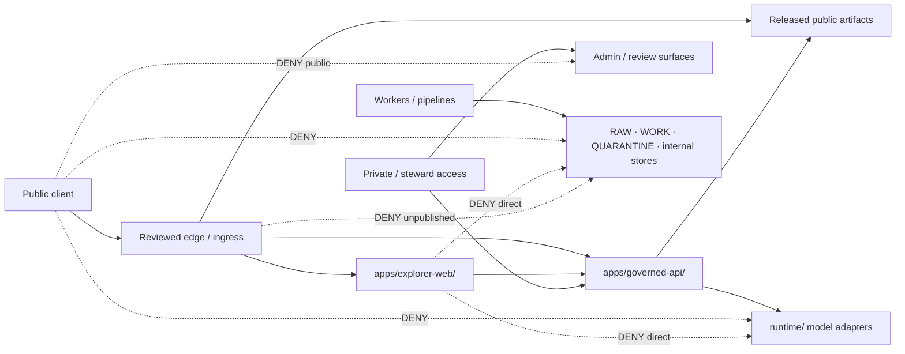

<!-- [KFM_META_BLOCK_V2]
doc_id: kfm://doc/infra-readme
title: infra/ — Deployment, Host, Network, and Exposure Posture Root
type: README; directory-readme; canonical-infrastructure-root; deployment-boundary-index
version: v1.1
status: draft; repository-grounded; canonical-root; documentation-heavy; hardening-checklist-confirmed; deployment-payloads-unestablished; infra-validation-unestablished; deny-by-default; non-release; non-publication
owner: NEEDS VERIFICATION — CODEOWNERS routes /infra/ to @bartytime4life; accepted infrastructure, security, and operations stewardship, required-review enforcement, and independent approval controls were not established
created: 2026-07-03
updated: 2026-07-23
supersedes: v1 documentation at the same path; no deployment, host, network, exposure, application, runtime, policy, lifecycle, release, or publication behavior is superseded
prepared_under_prompt: KFM Markdown Modernization & GitHub Documentation Implementation Agent v4.0.0
policy_label: repository-facing; infra; deployment; host; network; exposure; deny-by-default; least-privilege; no-public-raw-path; no-public-model-path; auditability; rollback-aware
current_path: infra/README.md
owning_root: infra/
responsibility: own deployment mechanics, host and network posture, service exposure, private-access boundaries, infrastructure-as-code, and operational hardening without becoming policy, evidence, lifecycle, runtime, release, or publication authority
truth_posture: >
  CONFIRMED same-path target; Directory Rules designation of infra/ as the canonical deployment, host, network,
  and exposure root; the nine doctrine-listed infrastructure lane READMEs; infra/flora/README.md; the hardening
  review checklist; CODEOWNERS routing; current Makefile targets; implemented app/static boundary tests; and
  the current policy-boundary workflow definition / PROPOSED infrastructure maturity model, deployment-change
  packet, lane-specific executable checks, topology convergence, and future infra validation orchestration /
  CONFLICTED infra/flora/ as a domain-named direct child not listed in the Directory Rules infra topology or
  domain-lane examples / UNKNOWN exhaustive recursive infra inventory, live environments, hosts, routes, ports,
  service identities, secret stores, data mounts, deployment payloads, actual orchestration, and operational
  rollback / NEEDS VERIFICATION accountable stewards, branch/ruleset enforcement, active secret-scanning
  coverage, public route inventory, deployment topology, and release-integrated infrastructure evidence
evidence_snapshot:
  repository: bartytime4life/Kansas-Frontier-Matrix
  base_ref: main
  base_commit: f4f48a7edbc4080267d50943223ab56d4f1ef154
  target_prior_blob: 7464b149f74f26c87cdd5574ab23a9628de25ed0
  directory_rules_blob: 2affb080e6f0043867c64c7f06c1ca52030fbd55
  codeowners_blob: dd2a84aa514d8ecd9208bc347f90f9a2ed37dd61
  makefile_blob: 51537af34ee065c2de571134688415042b83b22a
  hardening_checklist_blob: e1dffb88106ca22f82aff6fe8c67df0e34d2709f
  boundary_workflow_blob: 6d442a6cdd0b146cd4003cbf1d7c619a455a16ae
  deployment_topology_blob: 73ece039f0da4acf68843cb2dd6d20c6152df9e5
  exposure_plan_blob: 0ade933f4b4f1a03641f70ca3b2ef792340a8101
  inspection_method: exact GitHub file reads, exact-path probes, bounded repository search, and workflow/Makefile inspection; no recursive Git tree, deployed environment, branch ruleset, secret store, host, container, cluster, network, or runtime was inspected
related:
  - ../docs/doctrine/directory-rules.md
  - ../docs/security/README.md
  - ../docs/security/EXPOSURE_PLAN.md
  - ../docs/security/INCIDENT_RESPONSE.md
  - ../docs/security/KEY_ROTATION.md
  - ../docs/architecture/deployment-topology.md
  - ../docs/architecture/governed-api.md
  - ../docs/runbooks/
  - ../apps/governed-api/
  - ../apps/explorer-web/
  - ../apps/review-console/
  - ../apps/workers/
  - ../runtime/
  - ../configs/
  - ../policy/
  - ../release/
  - ../data/published/
  - ./docker/README.md
  - ./compose/README.md
  - ./reverse_proxy/README.md
  - ./vpn/README.md
  - ./firewall/README.md
  - ./systemd/README.md
  - ./kubernetes/README.md
  - ./terraform/README.md
  - ./hardening/README.md
  - ./hardening/CHECKLIST.md
  - ./flora/README.md
  - ../.github/CODEOWNERS
  - ../.github/workflows/policy-boundary-guards.yml
  - ../.github/workflows/dependency-scan.yml
  - ../.github/workflows/codeql.yml
  - ../Makefile
notes:
  - "v1.1 is a same-path, documentation-only modernization grounded in the current repository."
  - "The first twelve H2 sections follow the Directory Rules folder-README contract exactly."
  - "The repository has substantial infrastructure guidance, but no live deployment or complete infra-specific executable validation surface was established in the bounded inspection."
  - "Static badges summarize inspected repository state only; they are not deployment, review, security, release, or publication proof."
[/KFM_META_BLOCK_V2] -->

<a id="top"></a>

# `infra/` — Deployment, Host, Network, and Exposure Posture Root

> **One-line purpose.** `infra/` owns KFM deployment mechanics and exposure boundaries so hosts, networks, service managers, orchestrators, and infrastructure-as-code remain deny-by-default, least-privilege, auditable, reversible, and subordinate to governed APIs and released artifacts.

[](#status)
[](#authority-level)
[](#trust-membrane-and-exposure-model)
[](./hardening/CHECKLIST.md)
[](#validation)
[](#status)
[](#authority-level)

> [!IMPORTANT]
> **Safe current conclusion:** `infra/` is the confirmed deployment/exposure responsibility root, nine doctrine-listed child lane READMEs are present, and a detailed hardening review checklist exists. Current evidence does **not** establish a running environment, selected production topology, concrete Docker/Compose/proxy/firewall/VPN/systemd/Kubernetes/Terraform payload set, infra-specific CI gate, or public exposure approval.

> [!CAUTION]
> Infrastructure prose and checklists express required posture; they are not firewall rules, proxy configuration, service units, cluster policy, Terraform plans, secret scans, route-denial tests, release records, or observed runtime behavior. A deployment claim requires the relevant payload plus validation and environment evidence.

> [!WARNING]
> [`infra/flora/`](./flora/) is a confirmed domain-named direct child, but it is absent from the Directory Rules `infra/` topology and from the doctrine's domain-lane examples. Treat it as **CONFLICTED / NEEDS VERIFICATION**, not as a pattern for new domain-specific infrastructure folders, until placement is resolved through review, a migration note, or an ADR.

**Quick navigation:** [Purpose](#purpose) · [Authority](#authority-level) · [Status](#status) · [Belongs](#what-belongs-here) · [Exclusions](#what-does-not-belong-here) · [Inputs](#inputs) · [Outputs](#outputs) · [Validation](#validation) · [Review](#review-burden) · [Related](#related-folders) · [ADRs](#adrs) · [Last reviewed](#last-reviewed) · [Topology](#current-bounded-topology) · [Trust membrane](#trust-membrane-and-exposure-model) · [Lanes](#lane-contract-index) · [Maturity](#infrastructure-maturity-model) · [Change packet](#infrastructure-change-packet) · [Correction](#correction-and-rollback) · [Done](#definition-of-done) · [Open verification](#open-verification-register)

---

## Purpose

`infra/` is KFM's canonical responsibility root for deployment, host, network, service-exposure, private-access, infrastructure-as-code, and operational-hardening material.

It exists to preserve the same trust boundary that governs KFM data and claims:

```text
RAW -> WORK / QUARANTINE -> PROCESSED -> CATALOG / TRIPLET -> PUBLISHED
```

Infrastructure may package, route, host, isolate, provision, or observe KFM services. It does not decide what is true, whether evidence is sufficient, whether policy allows disclosure, or whether an artifact is released.

A governed public path has this general shape:

```text
public client
  -> reviewed edge / ingress
  -> apps/explorer-web/ and/or apps/governed-api/
  -> released artifacts or governed runtime responses
```

A normal public path must not terminate at RAW, WORK, QUARANTINE, unpublished candidates, direct model runtimes, source credentials, internal/canonical stores, admin/review surfaces, debug endpoints, or unreviewed static assets.

**Primary audience**

- infrastructure, security, and operations maintainers;
- application, runtime, data, policy, and release reviewers;
- contributors adding deployment templates or exposure-affecting documentation;
- reviewers checking whether a change preserves the trust membrane and rollback path.

[Back to top](#top)

---

<a id="status--authority"></a>
<a id="root-contract"></a>

## Authority level

**Canonical responsibility root for deployment mechanics and exposure posture; non-policy, non-evidence, non-lifecycle, non-runtime, non-release, and non-publication authority.**

Directory Rules assign deployment, host, network, and exposure posture to `infra/`. This README refines that placement rule for the current repository, but it does not override accepted ADRs, policy, security doctrine, application contracts, or release decisions.

| Concern | Owning authority | `infra/` role |
|---|---|---|
| Deployment packaging and orchestration | `infra/` | Owns reviewed templates and deployment mechanics. |
| Host and network posture | `infra/` | Owns service binding, firewall, proxy, VPN, ingress, and hardening mechanics. |
| Non-secret deployment defaults | [`configs/`](../configs/) | `infra/` may consume them; it must not turn `configs/` into a secret store. |
| Application behavior | [`apps/`](../apps/) | Hosts and routes applications; does not redefine their behavior. |
| Runtime adapters and model clients | [`runtime/`](../runtime/) | Keeps them private and behind governed interfaces; does not own runtime code. |
| Semantic meaning | [`contracts/`](../contracts/) | May reference contracts; does not define object meaning. |
| Machine shape | [`schemas/`](../schemas/) | May validate manifests against schemas; does not own schema authority. |
| Admissibility, rights, sensitivity, access obligations | [`policy/`](../policy/) | Enforces deployment consequences of reviewed policy; does not author policy here. |
| Lifecycle material | [`data/`](../data/) | Mounts or serves only the phases and artifacts a reviewed service requires. |
| Release, correction, withdrawal, rollback decisions | [`release/`](../release/) | Applies or hosts reviewed decisions; cannot create release authority. |
| Human-facing security doctrine | [`docs/security/`](../docs/security/) | Implements deployment constraints consistent with the doctrine. |
| Public trust membrane | [`apps/governed-api/`](../apps/governed-api/) | Routes public trust-bearing requests to it; does not bypass it. |

### Anti-collapse rules

`infra/` must never collapse:

- a reachable port into authorization;
- a successful deployment into release approval;
- a proxy route into policy permission;
- a firewall allow rule into evidence closure;
- a VPN connection into unrestricted data authority;
- a container image into a published artifact;
- a Kubernetes manifest into runtime proof;
- a Terraform plan into applied state;
- an example secret reference into a real credential;
- a checklist into observed validation;
- a GitHub merge into a production deployment.

[Back to top](#top)

---

## Status

### Repository-grounded status matrix

| Surface | Current evidence at `main@f4f48a7edbc4…` | Safe conclusion |
|---|---:|---|
| `infra/README.md` | **CONFIRMED v1 baseline**, blob `7464b14…` | Same-path v1.1 documentation modernization. |
| Directory Rules | **CONFIRMED** `infra/` responsibility and nine-lane topology | Placement and default posture are established doctrine. |
| Standard child lanes | **CONFIRMED** READMEs for `docker`, `compose`, `reverse_proxy`, `vpn`, `firewall`, `systemd`, `kubernetes`, `terraform`, and `hardening` | Guidance exists; lane payload maturity remains separate. |
| Hardening checklist | **CONFIRMED** [`infra/hardening/CHECKLIST.md`](./hardening/CHECKLIST.md) | Repeatable review questions exist; the checklist is not an executable validator or completed review record. |
| Docker lane | README states no Dockerfile or `.dockerignore` payload was verified in its update | Docker deployment payload is **NOT ESTABLISHED** by current evidence. |
| Compose lane | README states no Compose YAML payload was verified in its update | Compose deployment payload is **NOT ESTABLISHED** by current evidence. |
| Firewall lane | README states no firewall-rule payload was verified in its update | Firewall enforcement is **NOT ESTABLISHED** by current evidence. |
| Proxy, VPN, systemd, Kubernetes, Terraform | Their READMEs describe proposed structures and future verification triggers | Selected products, concrete payloads, and deployed behavior remain **NEEDS VERIFICATION**. |
| `infra/flora/` | **CONFIRMED** README path | Placement is **CONFLICTED / NEEDS VERIFICATION**; do not treat as canonical precedent. |
| `Makefile` | **CONFIRMED** no infrastructure validation target | There is no repository-native `make infra-*` validation entrypoint. |
| `policy-boundary-guards` | **CONFIRMED** 15 structural/static/API tests; workflow paths omit `infra/**` | Useful adjacent trust-boundary evidence, not infrastructure configuration or environment validation. |
| CodeQL | **CONFIRMED** Python and JavaScript/TypeScript analysis workflow | Source analysis exists; it does not inspect firewall, proxy, VPN, systemd, Kubernetes, Terraform, hosts, or running routes. |
| Dependency scan | **CONFIRMED** Python audit plus an explicit Node-lockfile hold | Dependency findings are point-in-time and not deployment approval. |
| Active secret-scanning workflow | Expected current workflow path was not found in bounded inspection | Current active secret-scan coverage is **NOT ESTABLISHED** here. |
| Deployment and exposure docs | **CONFIRMED** draft `deployment-topology.md` and `EXPOSURE_PLAN.md` | Doctrine is available; actual environments and routes remain unverified. |
| Running environments | No host, cluster, proxy, firewall, VPN, Terraform backend, route inventory, logs, or runtime was inspected | Operational deployment state is **UNKNOWN**. |
| CODEOWNERS | **CONFIRMED** `/infra/ @bartytime4life` | Review routing exists; stewardship, required approval, and separation of duties remain **NEEDS VERIFICATION**. |

### Truth labels used here

| Label | Meaning |
|---|---|
| `CONFIRMED` | Verified from pinned repository files, workflow definitions, or exact-path reads in this update. |
| `PROPOSED` | Recommended future design or check not established as current implementation. |
| `UNKNOWN` | Evidence is insufficient to support a stronger conclusion. |
| `NEEDS VERIFICATION` | A concrete check exists but was not closed strongly enough to act as fact. |
| `CONFLICTED` | Repository structure and governing placement evidence do not align cleanly. |

[Back to top](#top)

---

## What belongs here

Use `infra/` for material whose **primary responsibility** is deployment, host, network, exposure, private access, infrastructure-as-code, or operational hardening.

Accepted content includes:

- Docker image-build and container-boundary templates;
- Compose and other local/small-host orchestration templates;
- reverse-proxy, ingress, TLS-reference, header, CORS, and route-denial configuration;
- firewall ingress/egress and port-exposure rules;
- private-access governance and safe VPN-adjacent documentation;
- systemd unit, timer, socket, service-hardening, and logging templates;
- Kubernetes manifests, overlays, NetworkPolicy, RBAC, ingress, service-account, and storage templates;
- Terraform modules, environment stacks, backend/provider templates, plan-review notes, and state-safety guidance;
- cross-infrastructure hardening baselines and review checklists;
- sanitized route inventories, service-boundary diagrams, validation summaries, and rollback notes;
- `.env.example`, `.tfvars.example`, `.tfbackend.example`, `.service.example`, `.timer.example`, and equivalent placeholder-only templates;
- non-secret references to environment-specific secret stores;
- operational evidence that proves denied paths without disclosing private topology or restricted data.

### File admission questions

Before adding a file under `infra/`, verify:

1. Is deployment, host, network, exposure, private access, IaC, or hardening its primary responsibility?
2. Does the chosen child lane already own that responsibility?
3. Does the file contain only sanitized, non-secret, reviewable material?
4. Does it preserve public access through governed interfaces and released artifacts?
5. Does it name validation and rollback expectations?
6. Does it avoid creating a parallel policy, schema, contract, data, proof, receipt, or release home?

[Back to top](#top)

---

## What does NOT belong here

Do not place the following in `infra/`:

- real secrets, tokens, passwords, private keys, live certificates, production `.env` files, kubeconfigs, provider credentials, SSH keys, VPN peer bundles, or service-account credentials;
- Terraform state, state backups, sensitive plan files, crash logs with secret-adjacent values, or unredacted deployment inventories;
- RAW, WORK, QUARANTINE, PROCESSED, CATALOG/TRIPLET, or PUBLISHED payloads;
- source records, `SourceDescriptor` instances, source credentials, or connector payloads;
- materialized `EvidenceBundle`s, proofs, receipts, promotion records, release manifests, rollback cards, or correction notices;
- executable KFM policy, rights, sensitivity, access, or release rules;
- JSON Schema or semantic contract authority;
- application, package, connector, pipeline, or runtime implementation code;
- direct public routes to model runtimes, source systems, internal stores, admin/review surfaces, debug endpoints, or unpublished candidates;
- unredacted vulnerability work, exploit payloads, internal IP/host inventories, or active incident material;
- domain truth or domain lifecycle data merely because a deployment serves that domain;
- generated build or QA output presented as source-of-truth configuration.

### Security-incident rule

If secret, credential, state, or sensitive operational material is committed here:

1. treat the event as a security incident;
2. revoke or rotate affected access;
3. audit repository and downstream exposure;
4. remove or redact the material through a reviewed correction;
5. record the response through the appropriate security/runbook path;
6. preserve enough non-sensitive evidence for review and rollback without retaining the exposed secret.

[Back to top](#top)

---

<a id="inputs-and-outputs"></a>

## Inputs

`infra/` consumes reviewed inputs from:

| Source | Input | Boundary |
|---|---|---|
| [`docs/doctrine/`](../docs/doctrine/) | Lifecycle, trust-membrane, truth-posture, and placement invariants | Doctrine guides deployment; it is not an environment fact. |
| [`docs/security/`](../docs/security/) | Threat model, exposure posture, incident response, key rotation | Security docs explain; concrete controls still require infra payloads and tests. |
| [`docs/architecture/deployment-topology.md`](../docs/architecture/deployment-topology.md) | Proposed planes, service relationships, environment questions | Topology remains draft until environment evidence closes it. |
| [`apps/`](../apps/) | Service entrypoints, public/private classification, health and route contracts | Infrastructure hosts apps; it does not invent routes. |
| [`runtime/`](../runtime/) | Adapter isolation and private model-runtime requirements | Runtime must remain behind governed interfaces. |
| [`configs/`](../configs/) | Non-secret defaults and templates | Real secret values are prohibited. |
| [`policy/`](../policy/) | Reviewed access, rights, sensitivity, and release obligations | Policy authority remains outside `infra/`. |
| [`release/`](../release/) and [`data/published/`](../data/published/) | Release state, rollback target, and public artifacts eligible for hosting | Infrastructure must not infer release from file presence. |
| [`tests/`](../tests/) and [`tools/validators/`](../tools/validators/) | Reusable validation behavior and negative-state tests | Validation logic should not be hidden in deployment prose. |
| CODEOWNERS and repository rules | Review routing and branch controls | Routing does not prove review or approval. |

[Back to top](#top)

---

## Outputs

`infra/` may emit or support:

- reviewed deployment templates and infrastructure-as-code;
- service, route, port, identity, mount, and exposure maps;
- private-access and admin-boundary documentation;
- firewall, proxy, service-manager, orchestration, and provisioning configuration;
- hardening checklists and redacted validation summaries;
- public-artifact hosting configuration tied to release state;
- backup, restore, rollback, and emergency-isolation procedures;
- audit and logging expectations that avoid secret or restricted-data leakage;
- proposed environment changes for later review and application.

`infra/` outputs do **not** by themselves:

- admit a source;
- validate an evidence claim;
- allow a sensitive disclosure;
- promote lifecycle material;
- approve a release;
- deploy an environment;
- prove a service is running;
- publish KFM data.

[Back to top](#top)

---

## Validation

### Current verified validation surface

| Surface | Current state | What it proves—and does not prove |
|---|---|---|
| [`infra/hardening/CHECKLIST.md`](./hardening/CHECKLIST.md) | **CONFIRMED** review checklist | Provides review questions; does not execute checks or show a completed review. |
| `make boundary-guards-ci` | **CONFIRMED** command-bearing suite | Exercises 15 control-plane/app/connector/pipeline structural tests; does not target `infra/**`. |
| `apps/governed-api/tests/test_boundary_guards.py` | **CONFIRMED** static/API boundary tests | Proves selected route/import/path-literal boundaries for the tested revision; not network or host enforcement. |
| `tests/policy/test_explorer_web_adapter_boundary.py` | **CONFIRMED** client static boundary tests | Proves selected adapter and internal-store literal constraints; not browser network behavior. |
| `.github/workflows/codeql.yml` | **CONFIRMED** source analysis | Does not validate deployment payloads, secret stores, network paths, or applied state. |
| `.github/workflows/dependency-scan.yml` | **CONFIRMED** Python audit; Node audit hold | Does not validate images, clusters, Terraform state, firewall rules, or running services. |
| Infra-specific Make target | **NOT ESTABLISHED** | No unified repository-native infrastructure validation command was found. |
| Infra-specific workflow | **NOT ESTABLISHED** | No workflow was verified that parses and tests all applicable infra lanes. |
| Active secret scanning | **NOT ESTABLISHED in bounded inspection** | A historical workflow existed, but the expected current workflow path was absent. |
| Environment smoke / negative route tests | **UNKNOWN** | No host, cluster, proxy, firewall, VPN, or applied environment was inspected. |

> [!IMPORTANT]
> A green general-purpose check must be interpreted according to its real scope. CodeQL, dependency scanning, app-boundary tests, documentation checks, or a completed Markdown review cannot substitute for parsing the changed infrastructure payload and proving the relevant negative exposure states.

### Applicability-aware checks

Use the checks that match the changed lane. These commands are **PROPOSED examples** until the repository establishes supported versions and an accepted orchestration entrypoint.

| Lane | Minimum useful checks | Required negative evidence |
|---|---|---|
| Docker | Dockerfile parse/build in a safe context; image user, ports, mounts, and content review; SBOM/scan when adopted | No embedded secrets, RAW/WORK/QUARANTINE, proof/receipt/release data, or direct public model path |
| Compose | `docker compose config`; service, port, network, volume, profile, and secret-reference review | No broad host mounts or direct public internal/model/data services |
| Reverse proxy | Engine config validation; positive route inventory; header/CORS/TLS-reference review | RAW/WORK/QUARANTINE, candidates, model, admin, debug, internal, `.env`, and secret paths denied |
| Firewall | Syntax/plan review; explicit port/service inventory; ingress and egress review | Default deny; no public database, object store, model runtime, raw store, admin, or debug listener |
| VPN/private access | Access owner/purpose/expiry/revocation review; sanitized route-intent validation | Public users denied; private access does not grant publication or unrestricted raw/internal access |
| systemd | `systemd-analyze verify` or equivalent; user/group, filesystem, binding, restart, and journal review | Public units cannot read non-public lifecycle stores or expose direct model/admin services |
| Kubernetes | YAML/render/dry-run; NetworkPolicy, RBAC, ingress, volume, secret-reference, and probe review | Public ingress cannot reach model, raw/internal stores, admin, or unpublished artifacts |
| Terraform | `fmt`, safe `init`, `validate`, redacted plan, IAM/network/storage/state review | No committed state/secrets; no public denied surfaces or broad wildcard permissions |
| Hardening | Completed checklist with links to lane-specific evidence | All applicable deny states explicitly demonstrated |
| Documentation-only | UTF-8/GFM source checks, links/anchors, evidence labels, no-secret scan | No new operational claim without implementation evidence |

### Validation record requirements

For an exposure-significant change, record:

- exact files and environment scope;
- supported tool versions;
- commands run and exit status;
- sanitized output or artifact references;
- positive routes or services expected to work;
- negative routes, mounts, identities, and data paths proved unavailable;
- residual risk and unverified items;
- rollback or emergency-isolation procedure;
- reviewer identities and decision references where governance requires them.

[Back to top](#top)

---

## Review burden

### Verified review routing

[`/.github/CODEOWNERS`](../.github/CODEOWNERS) routes `/infra/` to `@bartytime4life`. The CODEOWNERS file explicitly states that this route is not a stewardship assignment, review record, policy decision, release approval, or proof of independent review.

### Recommended role review

The following burden is **PROPOSED governance guidance** until approved stewardship identities and repository rules are established.

| Change type | Review needed |
|---|---|
| README-only wording with no posture or path change | Infra or docs maintainer |
| Docker/Compose packaging with no exposure change | Infra maintainer plus affected application/runtime owner |
| Public route, firewall, ingress, DNS, TLS, headers, or CORS | Infrastructure + security + governed API/web owner |
| VPN, admin, review-console, or emergency access | Infrastructure + security + operations owner |
| systemd, Kubernetes, or Terraform affecting public exposure or identity | Infrastructure + security; affected app/runtime/data owner |
| Model-runtime service, route, mount, or network path | Runtime + security owner |
| RAW/WORK/QUARANTINE/internal-store access | Data + security owner |
| Public artifact hosting or export serving | Release + infrastructure + security owner |
| Secret-reference, credential, state, or key-rotation handling | Security + infrastructure owner |
| Production deployment or rollback posture | Infrastructure + security + release owner |
| Exception to deny-by-default or least privilege | Accepted ADR or documented, time-bounded risk acceptance with rollback |
| `infra/flora/` placement resolution | Docs/architecture + infrastructure + Flora/domain owner; migration or ADR as required |

### Separation-of-duties boundary

For policy-significant or production exposure changes, the author should not be treated as the sole independent approver. Whether GitHub rulesets enforce this remains **NEEDS VERIFICATION**.

[Back to top](#top)

---

## Related folders

| Folder | Relationship |
|---|---|
| [`docs/doctrine/`](../docs/doctrine/) | Core invariants and Directory Rules. |
| [`docs/security/`](../docs/security/) | Human-facing threat, exposure, incident, and key-rotation doctrine. |
| [`docs/runbooks/`](../docs/runbooks/) | Operational procedures, recovery, drills, and incident response. |
| [`docs/architecture/`](../docs/architecture/) | Deployment topology and governed API design. |
| [`apps/governed-api/`](../apps/governed-api/) | Executable public trust membrane. |
| [`apps/explorer-web/`](../apps/explorer-web/) | Public map shell, downstream of governed API and released artifacts. |
| [`apps/review-console/`](../apps/review-console/) | Restricted reviewer surface; not the normal public path. |
| [`runtime/`](../runtime/) | Private adapters and model runtime implementation. |
| [`configs/`](../configs/) | Non-secret configuration defaults and templates. |
| [`policy/`](../policy/) | Admissibility, rights, sensitivity, access, and release rules. |
| [`data/`](../data/) | Lifecycle material and public/non-public phase boundaries. |
| [`release/`](../release/) | Release decisions, correction, withdrawal, and rollback authority. |
| [`tests/`](../tests/) | Executable enforceability proof. |
| [`tools/validators/`](../tools/validators/) | Reusable validation implementation. |
| [`.github/workflows/`](../.github/workflows/) | CI definitions; each workflow has bounded authority. |
| [`artifacts/`](../artifacts/) | Non-authoritative build/docs/QA/temporary outputs only. |

[Back to top](#top)

---

## ADRs

No accepted infrastructure-topology ADR was established in the bounded inspection. The draft deployment and exposure documents are evidence inputs, not accepted decision records.

An ADR or equivalent adopted architecture decision is required or strongly indicated before:

- adding, removing, or renaming a canonical root or recognized infrastructure lane;
- creating a parallel infrastructure authority;
- selecting a production orchestration standard when the choice changes shared contracts or migration burden;
- selecting or replacing the public edge/reverse-proxy architecture;
- adopting a production Kubernetes or Terraform control plane;
- granting an exception to deny-by-default, least privilege, model isolation, raw-data denial, or admin-path separation;
- turning a domain-named infrastructure folder such as `infra/flora/` into an accepted general placement pattern;
- making an irreversible or high-risk production exposure decision.

Routine, reversible templates inside an accepted lane may use normal review when they do not alter these decisions.

[Back to top](#top)

---

## Last reviewed

| Field | Value |
|---|---|
| Last reviewed | 2026-07-23 |
| Review type | Same-path repository-grounded README modernization |
| Repository snapshot | `main@f4f48a7edbc4080267d50943223ab56d4f1ef154` |
| Current maturity | Documentation-heavy; hardening checklist confirmed; deployment payloads and infra-specific validation not established |
| Next review trigger | First concrete deployment payload, infra validation workflow, public route, secret-store integration, applied environment, production change, or `infra/flora/` placement decision |

[Back to top](#top)

---

<a id="directory-map"></a>

## Current bounded topology

The following paths were directly inspected. This is a bounded index, not a complete recursive tree claim.

```text
infra/
├── README.md
├── docker/README.md
├── compose/README.md
├── reverse_proxy/README.md
├── vpn/README.md
├── firewall/README.md
├── systemd/README.md
├── kubernetes/README.md
├── terraform/README.md
├── hardening/README.md
├── hardening/CHECKLIST.md
└── flora/README.md              # CONFLICTED / NEEDS VERIFICATION
```

### Directly inspected lane posture

| Lane | Intended responsibility | Evidence-bounded maturity |
|---|---|---|
| [`docker/`](./docker/) | Image construction and container boundary | README confirmed; Docker payload not established |
| [`compose/`](./compose/) | Local/small-host orchestration | README confirmed; Compose payload not established |
| [`reverse_proxy/`](./reverse_proxy/) | Edge routing, TLS/header/CORS posture, route denials | README confirmed; engine and config payload not established |
| [`vpn/`](./vpn/) | Private-access governance | README confirmed; live config intentionally excluded; implementation unestablished |
| [`firewall/`](./firewall/) | Host/network allow and deny posture | README confirmed; rule payload not established |
| [`systemd/`](./systemd/) | Host service units, timers, sockets, hardening | README confirmed; service set and units unestablished |
| [`kubernetes/`](./kubernetes/) | Cluster manifests, NetworkPolicy, RBAC, ingress | README confirmed; convention and manifests unestablished |
| [`terraform/`](./terraform/) | IaC, providers, state/backend safety, provisioning | README confirmed; adoption, providers, and modules unestablished |
| [`hardening/`](./hardening/) | Cross-infra hardening baseline and review discipline | README and checklist confirmed; executable validation unestablished |
| [`flora/`](./flora/) | Flora-specific deployment/exposure guidance | README confirmed; placement conflicted; payload not established |

### `infra/flora/` conflict

Directory Rules list the expected infrastructure lanes without domain children and illustrate domain placement under domain-aware responsibility roots such as `docs/domains/`, `contracts/domains/`, `schemas/.../domains/`, `policy/domains/`, `pipelines/domains/`, and lifecycle/release lanes. `infra/flora/` may reflect an earlier interpretation that domains can segment every root, but the current doctrine does not establish that pattern.

Until resolved:

- do not add another `infra/<domain>/` lane by analogy;
- do not call `infra/flora/` canonical;
- keep any existing file visibly documentation-only;
- inspect whether its content belongs in a standard infra lane plus Flora docs/runbooks;
- use a reviewed migration note or ADR before moving or legitimizing the path;
- preserve rollback and inbound links if the path changes.

[Back to top](#top)

---

<a id="trust-membrane"></a>

## Trust membrane and exposure model

Infrastructure must make KFM's public/non-public boundary observable and enforceable.


```mermaid
flowchart LR
    Public["Public client"]
    Edge["Reviewed edge / ingress"]
    Explorer["apps/explorer-web/"]
    GovAPI["apps/governed-api/"]
    Released["Released public artifacts"]
    Private["Private / steward access"]
    Review["Admin / review surfaces"]
    Runtime["runtime/ model adapters"]
    Workers["Workers / pipelines"]
    NonPublic["RAW · WORK · QUARANTINE · internal stores"]

    Public --> Edge
    Edge --> Explorer
    Edge --> GovAPI
    Edge --> Released
    Explorer --> GovAPI
    GovAPI --> Released
    GovAPI --> Runtime
    Private --> Review
    Private --> GovAPI
    Workers --> NonPublic

    Public -. "DENY" .-> Runtime
    Public -. "DENY" .-> NonPublic
    Public -. "DENY public" .-> Review
    Explorer -. "DENY direct" .-> Runtime
    Explorer -. "DENY direct" .-> NonPublic
    Edge -. "DENY unpublished" .-> NonPublic
```

### Required negative states

An exposure-significant deployment is incomplete until evidence shows:

1. public client -> direct model/runtime endpoint is denied;
2. public client -> RAW, WORK, or QUARANTINE is denied;
3. public client -> unpublished candidate or internal/canonical store is denied;
4. public client -> source credentials or secret material is denied;
5. public client -> admin/review/debug surface is denied unless separately private, authenticated, authorized, and audited;
6. public edge -> unreviewed static artifact is denied;
7. browser UI -> model runtime or internal store is denied;
8. service identities cannot read or write broader paths than their reviewed role;
9. missing policy, evidence, or release closure cannot be bypassed by infrastructure;
10. rollback or emergency isolation can disable a bad exposure without deleting audit history.

### Public route classes

| Route class | Default |
|---|---:|
| Public web shell | `ALLOW` only when reviewed and downstream of governed APIs |
| Governed API | `ALLOW` only with application policy/evidence/release controls |
| Released static artifacts | `ALLOW` only with release identity and rollback target |
| Health endpoint | `RESTRICT`; no internal detail leakage |
| Metrics and audit endpoints | `RESTRICT`; steward/internal only |
| Admin/review console | `DENY public` |
| Direct model runtime | `DENY public` |
| RAW/WORK/QUARANTINE/internal stores | `DENY public` |
| Source credentials and secret stores | `DENY` |
| Debug or temporary routes | `DENY public` unless time-bounded, reviewed, and reversible |

These route labels describe the desired exposure posture. They are not proof that any route currently exists or is enforced.

[Back to top](#top)

---

<a id="lane-contracts"></a>

## Lane contract index

Each standard lane inherits the root rules and adds its own payload and validation contract.

| Lane | Must preserve | Must prove before operational reliance |
|---|---|---|
| `docker/` | No secret/data bake-in; non-root and minimal image posture where practical | Build/scan result, image contents, user, ports, health, provenance |
| `compose/` | Private/local defaults; explicit ports, networks, volumes, profiles | Rendered config and route/mount denial checks |
| `reverse_proxy/` | Explicit public routes; TLS/header/CORS posture; no wildcard bypass | Config parse/reload, route inventory, positive and negative requests |
| `vpn/` | Steward-only access with owner, purpose, expiry, revocation, audit | Access lifecycle and public-denial evidence |
| `firewall/` | Default deny; explicit ingress/egress; narrow service exposure | Rule parse/plan, port inventory, denied surfaces |
| `systemd/` | Least privilege, private model binding, narrow filesystem access, safe timers | Unit verify, user/group/mount/binding/log review |
| `kubernetes/` | Namespace/service-account isolation, NetworkPolicy, RBAC, explicit ingress | Render/dry-run, policy/RBAC/volume/route evidence |
| `terraform/` | Protected state, no secrets, plan review, explicit public/private resources | Format/init/validate/plan and IAM/network/storage review |
| `hardening/` | Cross-lane checklist and fail-closed negative states | Completed evidence-backed checklist |
| `flora/` | Documentation-only while conflicted; no sensitive Flora exposure | Placement decision plus any applicable standard-lane checks |

[Back to top](#top)

---

## Infrastructure maturity model

The following model is **PROPOSED** for consistent status reporting. It is not a current repository enum or release state.

| Level | Meaning | Minimum evidence |
|---|---|---|
| `DOCUMENTED` | README or architecture guidance exists | Current, linked, evidence-labeled documentation |
| `TEMPLATE_PRESENT` | A concrete non-secret payload exists | File inventory, owner, intended environment |
| `PARSES` | Tool-specific syntax/render/plan checks succeed | Supported tool version and observed command result |
| `BOUNDARY_TESTED` | Positive service behavior and required denials are tested | Deterministic or environment-scoped negative evidence |
| `ENVIRONMENT_VERIFIED` | Applied environment matches reviewed design | Host/cluster/edge evidence tied to a known revision |
| `RELEASE_INTEGRATED` | Public hosting and deployment changes are tied to release, correction, and rollback | Release identity, review record, rollback drill |
| `RETIRED` | Path or environment is no longer active | Deprecation/migration record and removal verification |

Current safe classification:

- standard lane READMEs: `DOCUMENTED`;
- `hardening/CHECKLIST.md`: review aid under `DOCUMENTED`, not `BOUNDARY_TESTED`;
- concrete deployment payloads: **UNKNOWN / NOT ESTABLISHED**;
- applied environments and release integration: **UNKNOWN**;
- `infra/flora/`: `DOCUMENTED` plus `CONFLICTED`.

[Back to top](#top)

---

## Infrastructure change packet

A material infrastructure PR should make the deployment effect inspectable without disclosing secrets or private topology.

| Field | Required content |
|---|---|
| Scope | Exact files, lane, environment class, and intended consumer |
| Authority | Directory Rules basis and any governing ADR/architecture decision |
| Current state | What is verified before the change |
| Desired state | What will change and what will remain denied |
| Exposure delta | Routes, ports, listeners, origins, DNS, ingress, egress, or static-hosting changes |
| Identity delta | Service accounts, roles, users, groups, permissions, and least-privilege rationale |
| Data/mount delta | Read/write paths and lifecycle phase; public-service denials |
| Secret posture | Secret reference names only; storage and rotation owner outside Git |
| Validation | Tool versions, commands, sanitized results, positive and negative tests |
| Release impact | Released artifacts or public aliases affected, if any |
| Rollback | Disable/revert/restore procedure and emergency-isolation step |
| Residual risk | `UNKNOWN` and `NEEDS VERIFICATION` items left open |
| Review | Required maintainers/stewards and decision record |

A packet may be carried in the PR body, a reviewed runbook, or a dedicated lane document. It must not be hidden in commit messages alone.

[Back to top](#top)

---

## Correction and rollback

### Documentation rollback

Before merge, close the review branch or PR. After merge, revert the documentation commit without rewriting shared history. Restore the prior v1 blob `7464b149f74f26c87cdd5574ab23a9628de25ed0` for byte-level recovery.

### Operational correction

If infrastructure exposes a denied surface or secret:

1. **contain** — disable the route, listener, credential, identity, or environment;
2. **preserve safe evidence** — retain sanitized logs and revision identity;
3. **rotate/revoke** — replace exposed credentials or access;
4. **assess scope** — identify data, users, services, and releases affected;
5. **correct** — land the smallest reviewed configuration fix;
6. **invalidate/repoint** — update routes, caches, aliases, or release references;
7. **document** — create the appropriate incident, correction, rollback, or risk record;
8. **verify** — rerun positive and negative checks;
9. **review recurrence controls** — add tests, validators, or rules so the failure cannot silently return.

Infrastructure rollback must not erase audit history or silently restore an unsafe prior configuration.

[Back to top](#top)

---

## Definition of done

### For this root README

- [x] Same path and `doc_id` preserved.
- [x] Directory Rules placement and first-twelve-H2 contract applied.
- [x] Current child READMEs and hardening checklist grounded in pinned repository evidence.
- [x] Current CODEOWNERS, Makefile, boundary tests, and workflow scopes reconciled.
- [x] Doctrine, configuration, validation, environment, release, and publication states kept separate.
- [x] `infra/flora/` conflict surfaced without unilateral move or deletion.
- [x] Trust membrane, lane contracts, maturity, validation gaps, review burden, and rollback made explicit.
- [ ] Human review and GitHub host-render inspection.
- [ ] Any separately required generated provenance or review record.

### For an operational infrastructure lane

A lane is not operationally complete until:

- a concrete payload and owner exist;
- secrets and state are outside Git;
- supported tool versions are pinned or documented;
- syntax/render/plan checks pass;
- positive behavior and required deny states are tested;
- service identities, data mounts, and public/private routes are reviewed;
- logging is useful and redacted;
- release impact is explicit;
- rollback/emergency isolation is demonstrated;
- review and decision evidence are retained.

[Back to top](#top)

---

<a id="open-verification"></a>

## Open verification register

| ID | Verification question | Status |
|---|---|---|
| INF-OV-001 | What is the complete recursive `infra/` inventory at the reviewed revision? | **NEEDS VERIFICATION** |
| INF-OV-002 | Which child lanes contain concrete payloads rather than README-only guidance? | **UNKNOWN** |
| INF-OV-003 | What deployment classes exist: local-only, homelab, VPN-only, staging, public, production, or mixed? | **UNKNOWN** |
| INF-OV-004 | Which orchestration paths are adopted: direct host, systemd, Compose, Kubernetes, Terraform, or another platform? | **NEEDS VERIFICATION** |
| INF-OV-005 | What public edge/reverse-proxy stack and route inventory are active? | **UNKNOWN** |
| INF-OV-006 | What firewall, ingress, egress, and network-segmentation controls are applied? | **UNKNOWN** |
| INF-OV-007 | Where are real secrets stored, how are they rotated, and what CI secret-scanning coverage is active? | **NEEDS VERIFICATION** |
| INF-OV-008 | Which service users, accounts, roles, mounts, and writable paths exist? | **UNKNOWN** |
| INF-OV-009 | How is direct model-runtime access prevented in each environment? | **UNKNOWN** |
| INF-OV-010 | How are RAW, WORK, QUARANTINE, candidates, internal stores, and source credentials denied to public services? | **UNKNOWN** |
| INF-OV-011 | Which public artifact hosts serve released PMTiles, COGs, styles, exports, or reports, and how are release/rollback identities enforced? | **UNKNOWN** |
| INF-OV-012 | What infrastructure-native validation command and CI workflow should be adopted? | **PROPOSED / NEEDS VERIFICATION** |
| INF-OV-013 | Do branch rules require CODEOWNER review and independent approval for exposure-significant changes? | **NEEDS VERIFICATION** |
| INF-OV-014 | What log retention, redaction, audit access, backup, and restore requirements apply? | **UNKNOWN** |
| INF-OV-015 | What rollback drill proves a bad route, identity, mount, manifest, or Terraform change can be contained safely? | **UNKNOWN** |
| INF-OV-016 | Should `infra/flora/` be retained, moved into standard infra lanes plus Flora docs, or governed by an ADR? | **CONFLICTED / NEEDS VERIFICATION** |
| INF-OV-017 | Are other domain-named or historical infra lanes present outside the bounded direct reads? | **UNKNOWN** |
| INF-OV-018 | Who holds accountable infrastructure, security, operations, and production release stewardship? | **NEEDS VERIFICATION** |

[Back to top](#top)

---

<details>
<summary><strong>No-loss and evidence ledger</strong></summary>

| Baseline v1 element | Disposition in v1.1 |
|---|---|
| Same path, `doc_id`, title, creation date | **KEEP** |
| Deny-by-default, least privilege, auditability, rollback | **KEEP / ENRICH** |
| No direct public RAW/WORK/QUARANTINE/internal/model path | **KEEP / ENRICH** with evidence boundaries and required negative states |
| Governed API and released artifact public path | **KEEP / ENRICH** |
| No secrets in Git and incident response on exposure | **KEEP / ENRICH** |
| Nine-lane Directory map | **KEEP / VERIFY** against nine directly inspected READMEs |
| Lane summaries and lane contracts | **KEEP / ENRICH** with maturity and validation burden |
| Mermaid trust-membrane diagram | **KEEP / REPAIR** for explicit public, private, runtime, worker, and non-public paths |
| Inputs and outputs | **KEEP / SPLIT** into Directory Rules sections |
| Validation matrix | **KEEP / REPAIR** by separating confirmed checks from proposed infra checks |
| Review matrix | **KEEP / REPAIR** with verified CODEOWNERS route and unverified stewardship |
| Open verification list | **KEEP / ENRICH** as stable IDs |
| Last-reviewed block | **KEEP / UPDATE** |
| Directory Rules §15 missing headings | **ADD** Authority level, Status, Related folders, ADRs in required order |
| Repository-grounded status | **ADD** pinned evidence snapshot and current maturity matrix |
| `infra/flora/` path | **ADD / SURFACE CONFLICT**; no move or deletion |
| Changelog and byte-level rollback | **ADD** |
| Claim that guidance equals enforcement | **DENY** |

**Evidence used:** target blob `7464b14…`; Directory Rules `2affb08…`; CODEOWNERS `dd2a84a…`; Makefile `51537af…`; hardening checklist `e1dffb8…`; boundary workflow `6d442a6…`; deployment topology `73ece03…`; exposure plan `0ade933…`; and directly inspected child READMEs.

</details>

## Changelog

| Version | Date | Change | Rollback |
|---|---|---|---|
| v1 | 2026-07-03 | Expanded the infrastructure root posture, nine standard lanes, trust membrane, validation, review, and open questions. | Restore blob `7464b149f74f26c87cdd5574ab23a9628de25ed0`. |
| v1.1 | 2026-07-23 | Same-path repository-grounded modernization: Directory Rules order, evidence snapshot, bounded topology, `infra/flora/` conflict, validation reality, ownership, maturity model, change packet, correction, rollback, and no-loss ledger. | Before merge, close the draft PR; after merge, revert the documentation commit. |

## Status summary

`infra/` is KFM's canonical deployment, host, network, and exposure responsibility root. Its current repository surface is documentation-heavy: the standard lane READMEs and hardening checklist are confirmed, while concrete deployment payloads, environment behavior, infra-specific CI, route denials, active secret-scanning coverage, and release-integrated rollback remain unestablished or unknown.

Until those gaps close, the safe posture is:

```text
repository-grounded
canonical infrastructure root
documentation-heavy
deny-by-default
least-privilege
hardening checklist confirmed
deployment payloads not established
infra-specific validation not established
non-release
non-publication
```

<p align="right"><a href="#top">Back to top</a></p>
