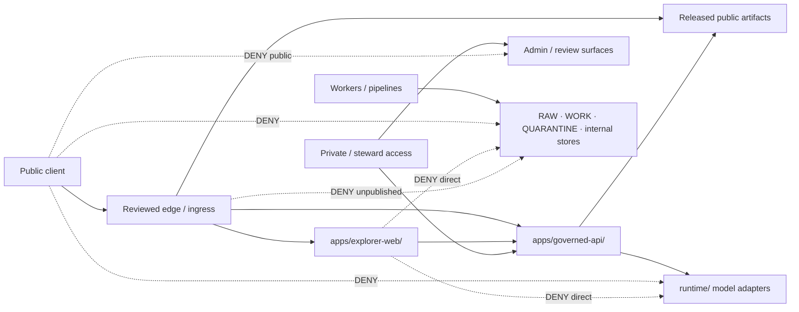

<!-- [KFM_META_BLOCK_V2]
doc_id: kfm://doc/infra-readme
title: infra/ — Deployment, Host, Network, and Exposure Posture Root
type: README; directory-readme; canonical-infrastructure-root; deployment-boundary-index
version: v1.2.0
status: draft; repository-grounded; canonical-root; documentation-heavy; hardening-checklist-confirmed; placeholder-docker-compose-payloads-confirmed; bounded-compose-static-render-build-validation-confirmed; infra-wide-validation-unestablished; deployability-unestablished; deny-by-default; non-release; non-publication
owner: NEEDS VERIFICATION — CODEOWNERS routes /infra/ to @bartytime4life; accountable infrastructure, security, and operations stewardship, required-review enforcement, and independent approval controls remain unverified
created: 2026-07-03
updated: 2026-08-08
supersedes: v1.1.2 documentation at the same path; no deployment, host, network, exposure, application, runtime, policy, lifecycle, release, or publication behavior is superseded
prepared_under_prompt: KFM Repository Build-Out & Markdown Modernization Implementation Agent v6.0.0
policy_label: repository-facing; infra; deployment; host; network; exposure; deny-by-default; least-privilege; no-public-raw-path; no-public-model-path; auditability; rollback-aware
current_path: infra/README.md
owning_root: infra/
responsibility: own deployment mechanics, host and network posture, service exposure, private-access boundaries, infrastructure-as-code, and operational hardening without becoming policy, evidence, lifecycle, runtime, release, or publication authority
truth_posture: >
  CONFIRMED same-path target; accepted Directory Rules v2 through ADR-0029; infra/ as the canonical
  deployment, host, network, and exposure responsibility root; nine standard infrastructure child-lane
  READMEs; infra/flora/README.md; the hardening checklist; CODEOWNERS routing; current Makefile state;
  bounded no-network Compose static tests; the read-only infra-compose-smoke workflow; and successful
  hosted Compose render/build evidence without starting services / PROPOSED the infrastructure maturity
  vocabulary, aggregate infra validation entrypoint, lane-specific executable checks, topology convergence,
  and future release-integrated validation / CONFLICTED infra/flora/ as a domain-named direct child not
  established as a canonical pattern by accepted Directory Rules / UNKNOWN live environments, hosts,
  routes, ports, external infrastructure, service identities, secret stores, data mounts, non-placeholder
  deployment payloads, actual orchestration, applied state, and operational rollback / NEEDS VERIFICATION
  accountable stewards, ruleset enforcement, active secret-scanning coverage, public route inventory,
  deployment topology, and release-integrated infrastructure evidence
evidence_snapshot:
  repository: bartytime4life/Kansas-Frontier-Matrix
  base_ref: main
  base_commit: 49db0ceeaf05e762035f2835ff2a7a2f4cede201
  target_prior_blob: b8189deda0de476a967fc9ff832ae97011a3252d
  directory_rules_blob: fd49a0b83e55cef52c1124281f093e263526898d
  directory_rules_adoption: docs/adr/ADR-0029-adopt-directory-governance-standard-v2.md; accepted
  codeowners_blob: dd2a84aa514d8ecd9208bc347f90f9a2ed37dd61
  makefile_blob: 4abc7f941ce25d7d14703e87e387cef6e96d1592
  hardening_checklist_blob: e1dffb88106ca22f82aff6fe8c67df0e34d2709f
  compose_blob: 8e17439562e42a992bdd93f821c8b5b0ce69896b
  compose_readme_blob: 20e3993016bf7f99bdf45c4fc37508005637b91a
  governed_api_dockerfile_blob: ea10e9a12737e4e9369b80b6ea3e9b84f2241abb
  explorer_web_dockerfile_blob: 77e7a862d1cb01c8c818188e8b3101610fdcf415
  infra_static_test_blob: 71fbf676f9cade9f4c97a7cb02634892a71e5953
  infra_test_readme_blob: 5dbf6ac7125ae0a043bc511e3526b0ee94662e27
  compose_workflow_blob: a9b51526bbcf9bf80295cc8fd3a9188bcca97da2
  pinned_workflow_commit: 204b66ccbc2f27e4abc42deca442865acc0fb929
  confirmed_workflow_run: 30725908187; conclusion success
  inspection_method: current target and direct-child inventory; exact Compose, Dockerfile, test, workflow, Makefile, CODEOWNERS, Directory Rules, and ADR reads; hosted workflow/job inspection; no deployed environment, secret store, host, container startup, cluster, network, Terraform state, or runtime inspected
related:
  - ../docs/doctrine/directory-rules.md
  - ../docs/adr/ADR-0029-adopt-directory-governance-standard-v2.md
  - ../docs/security/README.md
  - ../docs/security/EXPOSURE_PLAN.md
  - ../docs/security/INCIDENT_RESPONSE.md
  - ../docs/security/KEY_ROTATION.md
  - ../docs/architecture/deployment-topology.md
  - ../docs/architecture/governed-api.md
  - ../docs/runbooks/
  - ../apps/governed-api/
  - ../apps/explorer-web/
  - ../apps/review-console/
  - ../apps/workers/
  - ../runtime/
  - ../configs/
  - ../policy/
  - ../release/
  - ../data/published/
  - ./docker/README.md
  - ./compose/README.md
  - ./reverse_proxy/README.md
  - ./vpn/README.md
  - ./firewall/README.md
  - ./systemd/README.md
  - ./kubernetes/README.md
  - ./terraform/README.md
  - ./hardening/README.md
  - ./hardening/CHECKLIST.md
  - ./flora/README.md
  - ../tests/infra/README.md
  - ../tests/infra/test_compose_static.py
  - ../.github/CODEOWNERS
  - ../.github/workflows/infra-compose-smoke.yml
  - ../.github/workflows/policy-boundary-guards.yml
  - ../.github/workflows/dependency-scan.yml
  - ../.github/workflows/codeql.yml
  - ../Makefile
notes:
  - "v1.2.0 refreshes the root README against current main and records the bounded Compose static, render, and image-build validation that landed after v1.1.2."
  - "The Compose workflow does not start services; its successful run is path, render, and placeholder-image-build evidence only."
  - "Infra-wide executable validation, environment verification, release integration, deployment, and publication remain unestablished."
  - "Static badges summarize inspected repository state only; they are not deployment, review, security, release, or publication proof."
[/KFM_META_BLOCK_V2] -->

<a id="top"></a>

# `infra/` — Deployment, Host, Network, and Exposure Posture Root

> **One-line purpose.** `infra/` owns KFM deployment mechanics and exposure boundaries so hosts, networks, service managers, orchestrators, and infrastructure-as-code remain deny-by-default, least-privilege, auditable, reversible, and subordinate to governed APIs and released artifacts.

[](#status)
[](#authority-level)
[](#trust-membrane-and-exposure-model)
[](#validation)
[](#validation)
[](#authority-level)

> [!IMPORTANT]
> **Safe current conclusion:** `infra/` is the confirmed deployment and exposure responsibility root. Repository evidence now confirms a bounded Compose validation slice: deterministic static tests, Compose rendering, and placeholder image builds in a read-only hosted workflow that does not start services. The same evidence does **not** establish application startup, health, governed API behavior, browser behavior, a running environment, a selected production topology, an infra-wide validation gate, public exposure approval, release, deployment, or publication.

> [!CAUTION]
> Infrastructure prose, templates, tests, workflows, and checklists have bounded meanings. A passing render/build smoke test is not a firewall rule, proxy route denial, service unit, cluster policy, Terraform apply, secret scan, runtime observation, release record, deployment approval, or publication decision.

> [!WARNING]
> Accepted Directory Rules assign deployment and exposure configuration to `infra/` but do not establish domain-named infrastructure lanes as a general pattern. [`infra/flora/`](./flora/) remains a confirmed domain-named direct child with **CONFLICTED / NEEDS VERIFICATION** placement. Do not use it as precedent or expand it until a reviewed placement decision, migration note, or ADR resolves the boundary.

**Quick navigation:** [Purpose](#purpose) · [Authority](#authority-level) · [Status](#status) · [Belongs](#what-belongs-here) · [Exclusions](#what-does-not-belong-here) · [Inputs](#inputs) · [Outputs](#outputs) · [Validation](#validation) · [Review](#review-burden) · [Related](#related-folders) · [ADRs](#adrs) · [Last reviewed](#last-reviewed) · [Topology](#current-bounded-topology) · [Trust membrane](#trust-membrane-and-exposure-model) · [Lanes](#lane-contract-index) · [Maturity](#infrastructure-maturity-model) · [Change packet](#infrastructure-change-packet) · [Correction](#correction-and-rollback) · [Done](#definition-of-done) · [Open verification](#open-verification-register)

---

## Purpose

`infra/` is KFM's canonical responsibility root for deployment, host, network, service-exposure, private-access, infrastructure-as-code, and operational-hardening material.

It exists to preserve the same trust boundary that governs KFM data and claims:

```text
RAW -> WORK / QUARANTINE -> PROCESSED -> CATALOG / TRIPLET -> PUBLISHED
```

Infrastructure may package, route, host, isolate, provision, or observe KFM services. It does not decide what is true, whether evidence is sufficient, whether policy allows disclosure, or whether an artifact is released.

A governed public path has this general shape:

```text
public client
  -> reviewed edge / ingress
  -> apps/explorer-web/ and/or apps/governed-api/
  -> released artifacts or governed runtime responses
```

A normal public path must not terminate at RAW, WORK, QUARANTINE, unpublished candidates, direct model runtimes, source credentials, internal/canonical stores, admin/review surfaces, debug endpoints, or unreviewed static assets.

**Primary audience**

- infrastructure, security, and operations maintainers;
- application, runtime, data, policy, and release reviewers;
- contributors adding deployment templates or exposure-affecting documentation;
- reviewers checking whether a change preserves the trust membrane and rollback path.

[Back to top](#top)

---

<a id="status--authority"></a>
<a id="root-contract"></a>

## Authority level

**Canonical responsibility root for deployment mechanics and exposure posture; non-policy, non-evidence, non-lifecycle, non-runtime, non-release, and non-publication authority.**

Accepted Directory Rules v2, adopted through [`ADR-0029`](../docs/adr/ADR-0029-adopt-directory-governance-standard-v2.md), place deployment, host, network, and exposure configuration under `infra/`. This README refines that root contract for current repository evidence. It does not override accepted ADRs, policy, security doctrine, application contracts, source/evidence authority, or release decisions.

| Concern | Owning authority | `infra/` role |
|---|---|---|
| Deployment packaging and orchestration | `infra/` | Own reviewed templates and deployment mechanics. |
| Host and network posture | `infra/` | Own service binding, firewall, proxy, VPN, ingress, and hardening mechanics. |
| Non-secret deployment defaults | [`configs/`](../configs/) | Consume reviewed defaults; never turn `configs/` into a secret store. |
| Application behavior | [`apps/`](../apps/) | Host and route applications; do not redefine their behavior. |
| Runtime adapters and model clients | [`runtime/`](../runtime/) | Keep private and behind governed interfaces; do not own runtime code here. |
| Semantic meaning | [`contracts/`](../contracts/) | Reference contracts; do not define object meaning in `infra/`. |
| Machine shape | [`schemas/`](../schemas/) | Validate manifests when applicable; do not create schema authority here. |
| Rights, sensitivity, access, admissibility | [`policy/`](../policy/) | Enforce deployment consequences of reviewed policy; do not author policy here. |
| Lifecycle material | [`data/`](../data/) | Mount or serve only reviewed phases and released artifacts. |
| Release, correction, withdrawal, rollback decisions | [`release/`](../release/) | Apply or host reviewed decisions; never create release authority. |
| Human-facing security doctrine | [`docs/security/`](../docs/security/) | Implement deployment constraints consistent with the doctrine. |
| Public trust membrane | [`apps/governed-api/`](../apps/governed-api/) | Route public trust-bearing requests to it; never bypass it. |

### Anti-collapse rules

`infra/` must never collapse:

- a reachable port into authorization;
- a successful build into a working service;
- a successful deployment into release approval;
- a proxy route into policy permission;
- a firewall allow rule into evidence closure;
- a VPN connection into unrestricted data authority;
- a container image into a published artifact;
- a Kubernetes manifest into runtime proof;
- a Terraform plan into applied state;
- an example secret reference into a real credential;
- a checklist into observed validation;
- a passing workflow into environment verification;
- a GitHub merge into production deployment or KFM publication.

[Back to top](#top)

---

## Status

### Repository-grounded status matrix

| Surface | Current evidence at `main@49db0ceeaf05…` | Safe conclusion |
|---|---|---|
| `infra/README.md` | **CONFIRMED v1.1.2**, blob `b8189de…` | Same-path v1.2.0 evidence refresh; no runtime or authority expansion. |
| Directory Rules | **CONFIRMED accepted** through ADR-0029; canonical source blob `fd49a0b…` | `infra/` root responsibility is established; child-lane maturity remains separate. |
| Standard child lanes | **CONFIRMED** READMEs under `docker`, `compose`, `reverse_proxy`, `vpn`, `firewall`, `systemd`, `kubernetes`, `terraform`, and `hardening` | Guidance exists; implementation and environment adoption vary by lane. |
| Hardening checklist | **CONFIRMED** [`infra/hardening/CHECKLIST.md`](./hardening/CHECKLIST.md) | Repeatable review questions exist; no completed review or executable aggregate validator is implied. |
| Docker lane | **CONFIRMED** two tiny greenfield Dockerfile placeholders | Both build in the bounded Compose smoke; application commands, health, contents, scan posture, and deployability remain unestablished. |
| Compose lane | **CONFIRMED** placeholder `docker-compose.yml` with `infra/`-bounded build contexts and loopback-only published ports | Static constraints, Compose rendering, and placeholder image builds are confirmed; service startup and runtime behavior are not. |
| Compose static tests | **CONFIRMED** [`tests/infra/test_compose_static.py`](../tests/infra/test_compose_static.py) | Deterministically checks context/Dockerfile resolution, loopback ports, and selected forbidden mounts/escape settings. |
| Compose hosted workflow | **CONFIRMED** [`.github/workflows/infra-compose-smoke.yml`](../.github/workflows/infra-compose-smoke.yml), read-only, no service start | Pinned-workflow run `30725908187` succeeded for both static and render/build jobs; scope remains bounded to the checked-in placeholder. |
| Firewall lane | **CONFIRMED** README plus documentation-only `deny_by_default.md` | No executable firewall-rule payload or applied enforcement is established. |
| Reverse-proxy lane | **CONFIRMED** README plus one-line greenfield Caddy placeholder | Product adoption, config validation, route-denial proof, reload, and runtime remain unestablished. |
| VPN, systemd, Kubernetes, Terraform | READMEs document responsibilities, exclusions, and future checks | Selected products, implementation-bearing payloads, applied state, and deployed behavior remain **NEEDS VERIFICATION**. |
| `infra/flora/` | **CONFIRMED** README path | Placement remains **CONFLICTED / NEEDS VERIFICATION**; do not treat it as canonical precedent. |
| `Makefile` | **CONFIRMED** no `infra-*` validation target | A bounded hosted Compose workflow exists, but no aggregate repository-native local infra entrypoint exists. |
| Adjacent boundary tests | **CONFIRMED** app/control-plane static suites and policy-boundary workflow | Useful adjacent evidence; not firewall, proxy, cluster, state, or environment validation. |
| CodeQL and dependency scanning | **CONFIRMED repository workflows** | Source/dependency findings have bounded scopes and are not infrastructure or deployment approval. |
| Active secret scanning | Not established in the bounded current read | Coverage and current enforcement remain **NEEDS VERIFICATION**. |
| Deployment and exposure docs | **CONFIRMED** draft topology and exposure guidance | Doctrine/design inputs exist; actual environments and routes remain unverified. |
| Running environments | No host, cluster, proxy, firewall, VPN, Terraform backend, route inventory, logs, or runtime inspected | Operational deployment state is **UNKNOWN**. |
| CODEOWNERS | **CONFIRMED** `/infra/ @bartytime4life` | Review routing exists; stewardship, required approval, and separation of duties remain **NEEDS VERIFICATION**. |

### Truth labels used here

| Label | Meaning |
|---|---|
| `CONFIRMED` | Verified from pinned repository bytes, workflows, tests, hosted checks, or exact-path reads in this update. |
| `PROPOSED` | Recommended future design or check not established as current implementation. |
| `UNKNOWN` | Evidence is insufficient to support a stronger conclusion. |
| `NEEDS VERIFICATION` | A concrete check exists but was not closed strongly enough to act as fact. |
| `CONFLICTED` | Repository structure and governing placement evidence do not align cleanly. |

[Back to top](#top)

---

## What belongs here

Use `infra/` when the artifact's **primary responsibility** is deployment, host, network, exposure, private access, infrastructure-as-code, or operational hardening.

Accepted content includes:

- Docker image-build and container-boundary templates;
- Compose and other local/small-host orchestration templates;
- reverse-proxy, ingress, TLS-reference, header, CORS, and route-denial configuration;
- firewall ingress/egress and port-exposure rules;
- private-access governance and safe VPN-adjacent documentation;
- systemd unit, timer, socket, service-hardening, and logging templates;
- Kubernetes manifests, overlays, NetworkPolicy, RBAC, ingress, service-account, and storage templates;
- Terraform modules, environment stacks, backend/provider templates, plan-review notes, and state-safety guidance;
- cross-infrastructure hardening baselines and review checklists;
- sanitized route inventories, service-boundary diagrams, validation summaries, and rollback notes;
- placeholder-only `.env.example`, `.tfvars.example`, `.tfbackend.example`, `.service.example`, `.timer.example`, and equivalent templates;
- non-secret references to environment-specific secret stores;
- operational evidence that proves denied paths without disclosing private topology or restricted data.

### File admission questions

Before adding a file under `infra/`, verify:

1. Is deployment, host, network, exposure, private access, IaC, or hardening its primary responsibility?
2. Does one existing child lane uniquely own that responsibility?
3. Does the file contain only sanitized, non-secret, reviewable material?
4. Does it preserve public access through governed interfaces and released artifacts?
5. Does it name validation and rollback expectations?
6. Does it avoid creating a parallel policy, schema, contract, data, proof, receipt, registry, or release home?
7. Does the change preserve least privilege and prove the required negative exposure states?

[Back to top](#top)

---

## What does NOT belong here

Do not place the following in `infra/`:

- real secrets, tokens, passwords, private keys, live certificates, production `.env` files, kubeconfigs, provider credentials, SSH keys, VPN peer bundles, or service-account credentials;
- Terraform state, state backups, sensitive plan files, crash logs with secret-adjacent values, or unredacted deployment inventories;
- RAW, WORK, QUARANTINE, PROCESSED, CATALOG/TRIPLET, or PUBLISHED payloads;
- source records, `SourceDescriptor` instances, source credentials, or connector payloads;
- materialized `EvidenceBundle`s, proofs, receipts, promotion records, release manifests, rollback cards, or correction notices;
- executable KFM policy, rights, sensitivity, access, or release rules;
- JSON Schema or semantic contract authority;
- application, package, connector, pipeline, or runtime implementation code;
- direct public routes to model runtimes, source systems, internal stores, admin/review surfaces, debug endpoints, or unpublished candidates;
- unredacted vulnerability work, exploit payloads, internal IP/host inventories, or active incident material;
- domain truth or domain lifecycle data merely because a deployment serves that domain;
- generated build or QA output presented as source-of-truth configuration.

### Security-incident rule

If secret, credential, state, or sensitive operational material is committed here:

1. contain the exposure and stop further use;
2. revoke or rotate affected access;
3. audit repository and downstream exposure;
4. remove or redact through a reviewed correction;
5. record the response through the appropriate security/runbook path;
6. preserve non-sensitive evidence for review and rollback;
7. add a prevention check when feasible.

[Back to top](#top)

---

<a id="inputs-and-outputs"></a>

## Inputs

`infra/` consumes reviewed inputs from:

| Source | Input | Boundary |
|---|---|---|
| [`docs/doctrine/`](../docs/doctrine/) | Lifecycle, trust-membrane, truth-posture, and placement invariants | Doctrine guides deployment; it is not an environment fact. |
| [`docs/security/`](../docs/security/) | Threat model, exposure posture, incident response, key rotation | Concrete controls still require payloads and tests. |
| [`docs/architecture/deployment-topology.md`](../docs/architecture/deployment-topology.md) | Proposed planes, service relationships, environment questions | Topology remains draft until environment evidence closes it. |
| [`apps/`](../apps/) | Service entrypoints, public/private classification, health and route contracts | Infrastructure hosts apps; it does not invent routes. |
| [`runtime/`](../runtime/) | Adapter isolation and private model-runtime requirements | Runtime stays behind governed interfaces. |
| [`configs/`](../configs/) | Non-secret defaults and templates | Real secret values are prohibited. |
| [`policy/`](../policy/) | Reviewed access, rights, sensitivity, and release obligations | Policy authority remains outside `infra/`. |
| [`release/`](../release/) and [`data/published/`](../data/published/) | Release state, rollback target, public artifacts eligible for hosting | Infrastructure must not infer release from file presence. |
| [`tests/`](../tests/) and [`tools/validators/`](../tools/validators/) | Reusable validation behavior and negative-state tests | Validation logic must not be hidden in deployment prose. |
| CODEOWNERS and repository controls | Review routing and branch controls | Routing does not prove review or approval. |

[Back to top](#top)

---

## Outputs

`infra/` may emit or support:

- reviewed deployment templates and infrastructure-as-code;
- service, route, port, identity, mount, and exposure maps;
- private-access and admin-boundary documentation;
- firewall, proxy, service-manager, orchestration, and provisioning configuration;
- hardening checklists and redacted validation summaries;
- public-artifact hosting configuration tied to release state;
- backup, restore, rollback, and emergency-isolation procedures;
- audit and logging expectations that avoid secret or restricted-data leakage;
- proposed environment changes for later review and application.

`infra/` outputs do **not** by themselves:

- admit a source;
- validate an evidence claim;
- allow a sensitive disclosure;
- promote lifecycle material;
- approve a release;
- deploy an environment;
- prove a service is running;
- publish KFM data.

[Back to top](#top)

---

## Validation

### Current verified validation surface

| Surface | Current state | What it proves—and does not prove |
|---|---|---|
| [`infra/hardening/CHECKLIST.md`](./hardening/CHECKLIST.md) | **CONFIRMED** review checklist | Provides review questions; does not execute checks or show a completed review. |
| [`tests/infra/test_compose_static.py`](../tests/infra/test_compose_static.py) | **CONFIRMED** deterministic no-network test | Verifies the two relative contexts and Dockerfiles resolve, ports are loopback-bound, and selected sensitive mounts/privileged escapes are absent. It is not runtime or environment proof. |
| [`.github/workflows/infra-compose-smoke.yml`](../.github/workflows/infra-compose-smoke.yml) | **CONFIRMED** read-only workflow with immutable action pins | Runs static tests, `docker compose ... config --quiet`, and `docker compose ... build`; never starts services. |
| Hosted run `30725908187` | **CONFIRMED success** at pinned workflow commit `204b66c…` | Both static and render/build jobs passed. The result is historical evidence for those bytes, not continuous environment proof. |
| `make boundary-guards-ci` | **CONFIRMED** command-bearing adjacent suite | Exercises selected control-plane/app/connector/pipeline boundaries; does not target infrastructure payloads or hosts. |
| App/browser boundary tests | **CONFIRMED** source/static constraints | Prove tested source/import/path-literal boundaries only; not browser network or host enforcement. |
| CodeQL and dependency scanning | **CONFIRMED** repository workflows | Do not validate images, clusters, Terraform state, firewall rules, running services, or deployment readiness. |
| Infra-specific Make target | **NOT ESTABLISHED** | No aggregate local `make infra-*` entrypoint was found. |
| Infra-wide workflow | **NOT ESTABLISHED** | Compose has bounded coverage; proxy, firewall, VPN, systemd, Kubernetes, Terraform, and applied environments do not share one verified gate. |
| Active secret scanning | **NOT ESTABLISHED in bounded inspection** | Current coverage and required-check coupling remain open. |
| Environment smoke and negative route tests | **UNKNOWN** | No host, cluster, proxy, firewall, VPN, applied environment, or live route was inspected. |

> [!IMPORTANT]
> A green general-purpose check must be interpreted according to its declared scope. The Compose smoke proves that the checked-in placeholder renders and its two placeholder images build on the runner. It does not prove application code, commands, health checks, governed API behavior, Explorer behavior, service startup, host controls, release, deployment, or publication.

### Current bounded Compose commands

Static no-network tests:

```bash
python -m unittest discover \
  --start-directory tests/infra \
  --pattern 'test_compose_static.py' \
  --verbose
```

Supported hosted Docker/Compose checks:

```bash
docker compose -f infra/compose/docker-compose.yml config --quiet
docker compose -f infra/compose/docker-compose.yml build
```

Do **not** add `up`, service startup, live probes, secret injection, production mounts, or external side effects to this bounded smoke without a separately reviewed change.

### Applicability-aware checks

Use checks that match the changed lane. The commands below are requirements or **PROPOSED examples** until the repository pins supported products and a common orchestration entrypoint.

| Lane | Minimum useful checks | Required negative evidence |
|---|---|---|
| Docker | Parse/build in a safe context; image user, ports, mounts, contents, SBOM/scan when adopted | No embedded secrets, non-public lifecycle data, proof/receipt/release data, or direct public model path |
| Compose | Static boundary test; `docker compose config`; bounded build; service/network/volume/profile review | No broad host mounts, privileged escape, or direct public internal/model/data services |
| Reverse proxy | Engine config validation; route inventory; header/CORS/TLS-reference review | RAW/WORK/QUARANTINE, candidates, model, admin, debug, internal, `.env`, and secret paths denied |
| Firewall | Syntax/plan review; explicit port/service inventory; ingress and egress review | Default deny; no public database, object store, model runtime, raw store, admin, or debug listener |
| VPN/private access | Access owner/purpose/expiry/revocation review; sanitized route-intent validation | Public users denied; private access does not grant publication or unrestricted internal access |
| systemd | `systemd-analyze verify` or equivalent; user/group, filesystem, binding, restart, and journal review | Public units cannot read non-public lifecycle stores or expose direct model/admin services |
| Kubernetes | Render/dry-run; NetworkPolicy, RBAC, ingress, volume, secret-reference, and probe review | Public ingress cannot reach model, raw/internal stores, admin, or unpublished artifacts |
| Terraform | `fmt`, safe `init`, `validate`, redacted plan, IAM/network/storage/state review | No committed state/secrets; no public denied surfaces or broad wildcard permissions |
| Hardening | Completed checklist with links to lane-specific evidence | All applicable deny states explicitly demonstrated |
| Documentation-only | UTF-8/GFM source checks, links/anchors, evidence labels, no-secret scan | No operational claim without implementation evidence |

### Validation record requirements

For an exposure-significant change, record:

- exact files and environment scope;
- supported tool versions;
- commands run and exit status;
- sanitized output or artifact references;
- positive routes or services expected to work;
- negative routes, mounts, identities, and data paths proved unavailable;
- residual risk and unverified items;
- rollback or emergency-isolation procedure;
- reviewer identities and decision references where governance requires them.

[Back to top](#top)

---

## Review burden

### Verified review routing

[`/.github/CODEOWNERS`](../.github/CODEOWNERS) routes `/infra/` to `@bartytime4life`. The file explicitly states that routing is not a stewardship assignment, review record, policy decision, release approval, publication authority, or proof that review occurred.

### Recommended role review

The following burden is **PROPOSED governance guidance** until approved stewardship identities and repository rules are established.

| Change type | Review needed |
|---|---|
| README-only wording with no posture or path change | Infrastructure or documentation maintainer |
| Docker/Compose packaging with no exposure change | Infrastructure maintainer plus affected application/runtime owner |
| Public route, firewall, ingress, DNS, TLS, headers, or CORS | Infrastructure + security + governed API/web owner |
| VPN, admin, review-console, or emergency access | Infrastructure + security + operations owner |
| systemd, Kubernetes, or Terraform affecting exposure or identity | Infrastructure + security + affected app/runtime/data owner |
| Model-runtime service, route, mount, or network path | Runtime + security owner |
| RAW/WORK/QUARANTINE/internal-store access | Data + security owner |
| Public artifact hosting or export serving | Release + infrastructure + security owner |
| Secret-reference, credential, state, or key-rotation handling | Security + infrastructure owner |
| Production deployment or rollback posture | Infrastructure + security + release owner |
| Exception to deny-by-default or least privilege | Accepted ADR or documented, time-bounded risk acceptance with rollback |
| `infra/flora/` placement resolution | Documentation/architecture + infrastructure + Flora/domain owner; migration or ADR as required |

### Separation-of-duties boundary

For policy-significant or production-exposure changes, the author should not be treated as the sole independent approver. Whether rulesets enforce this remains **NEEDS VERIFICATION**.

[Back to top](#top)

---

## Related folders

| Folder | Relationship |
|---|---|
| [`docs/doctrine/`](../docs/doctrine/) | Core invariants and accepted Directory Rules source. |
| [`docs/adr/`](../docs/adr/) | Accepted and proposed decision records, including ADR-0029. |
| [`docs/security/`](../docs/security/) | Human-facing threat, exposure, incident, and key-rotation doctrine. |
| [`docs/runbooks/`](../docs/runbooks/) | Operational procedures, recovery, drills, and incident response. |
| [`docs/architecture/`](../docs/architecture/) | Deployment topology and governed API design. |
| [`apps/governed-api/`](../apps/governed-api/) | Executable public trust membrane. |
| [`apps/explorer-web/`](../apps/explorer-web/) | Public map shell downstream of governed APIs and released artifacts. |
| [`apps/review-console/`](../apps/review-console/) | Restricted reviewer surface; not the normal public path. |
| [`runtime/`](../runtime/) | Private adapters and model-runtime implementation. |
| [`configs/`](../configs/) | Non-secret configuration defaults and templates. |
| [`policy/`](../policy/) | Admissibility, rights, sensitivity, access, and release rules. |
| [`data/`](../data/) | Lifecycle material and public/non-public phase boundaries. |
| [`release/`](../release/) | Release decisions, correction, withdrawal, and rollback authority. |
| [`tests/infra/`](../tests/infra/) | Bounded infrastructure static test lane. |
| [`tools/validators/`](../tools/validators/) | Reusable validation implementation. |
| [`.github/workflows/`](../.github/workflows/) | CI definitions; each workflow has bounded authority. |
| [`artifacts/`](../artifacts/) | Non-authoritative build/docs/QA/temporary outputs only. |

[Back to top](#top)

---

## ADRs

[`ADR-0029`](../docs/adr/ADR-0029-adopt-directory-governance-standard-v2.md) is the accepted placement authority that adopts the exact Directory Rules v2 bytes. No accepted production infrastructure-topology decision was established in this bounded review.

An ADR or equivalent adopted architecture decision is required or strongly indicated before:

- adding, removing, renaming, or changing the authority of a root or recognized infrastructure lane;
- creating a parallel infrastructure authority;
- selecting a production orchestration standard when the choice changes shared contracts or migration burden;
- selecting or replacing the public edge/reverse-proxy architecture;
- adopting a production Kubernetes or Terraform control plane;
- granting an exception to deny-by-default, least privilege, model isolation, raw-data denial, or admin-path separation;
- turning a domain-named infrastructure folder such as `infra/flora/` into an accepted general placement pattern;
- making an irreversible or high-risk production exposure decision.

Routine, reversible templates inside an accepted lane may use normal review when they do not alter those decisions.

[Back to top](#top)

---

## Last reviewed

| Field | Value |
|---|---|
| Last reviewed | 2026-08-08 |
| Review type | Same-path repository-grounded evidence refresh after bounded Compose static/render/build validation and immutable action pinning |
| Repository snapshot | `main@49db0ceeaf05e762035f2835ff2a7a2f4cede201` |
| Current maturity | Documentation-heavy; hardening checklist and placeholder payloads confirmed; bounded Compose static/render/build validation confirmed; service startup, infra-wide validation, deployability, and environment state unestablished |
| Next review trigger | First non-placeholder payload, service-start smoke, aggregate infra validator, public route, secret-store integration, applied environment, production change, or `infra/flora/` placement decision |

[Back to top](#top)

---

<a id="directory-map"></a>

## Current bounded topology

The direct tracked topology remains ten child directories: nine standard infrastructure lanes plus the unresolved domain-named `flora/` lane. This review rechecked direct children and the Compose/Docker/test/workflow closure; it did not claim a fresh exhaustive inventory of ignored, generated, externally managed, or deployed infrastructure.

```text
infra/
├── README.md
├── compose/
├── docker/
├── firewall/
├── flora/                  # placement CONFLICTED / NEEDS VERIFICATION
├── hardening/
├── kubernetes/
├── reverse_proxy/
├── systemd/
├── terraform/
└── vpn/
```

### Directly inspected lane posture

| Lane | Intended responsibility | Evidence-bounded maturity |
|---|---|---|
| [`docker/`](./docker/) | Image construction and container boundary | README plus two greenfield Dockerfile placeholders; bounded builds pass; commands, health, content review, runtime, and deployment remain unestablished |
| [`compose/`](./compose/) | Local/small-host orchestration | README plus placeholder Compose file; static boundary, render, and build checks pass; service start and runtime remain unestablished |
| [`reverse_proxy/`](./reverse_proxy/) | Edge routing, TLS/header/CORS posture, route denials | README plus one-line greenfield Caddy placeholder; adoption, parse/reload, denials, and runtime unestablished |
| [`vpn/`](./vpn/) | Private-access governance | README confirmed; live config intentionally excluded; implementation unestablished |
| [`firewall/`](./firewall/) | Host/network allow and deny posture | README plus documentation-only deny-by-default file; executable rule payload unestablished |
| [`systemd/`](./systemd/) | Host service units, timers, sockets, hardening | README confirmed; service set and units unestablished |
| [`kubernetes/`](./kubernetes/) | Cluster manifests, NetworkPolicy, RBAC, ingress | README confirmed; convention and manifests unestablished |
| [`terraform/`](./terraform/) | IaC, providers, state/backend safety, provisioning | README confirmed; adoption, providers, modules, and state unestablished |
| [`hardening/`](./hardening/) | Cross-infra hardening baseline and review discipline | README and checklist confirmed; aggregate executable validation unestablished |
| [`flora/`](./flora/) | Flora-specific deployment/exposure guidance | README confirmed; placement conflicted; implementation-bearing payload unestablished |

### `infra/flora/` conflict

Accepted Directory Rules place scope inside the owning responsibility root only after the root is fixed, but current evidence does not establish `infra/<domain>/` as a reusable child-lane pattern. `infra/flora/` may represent earlier design lineage; it is not authority for creating siblings.

Until resolved:

- do not add another `infra/<domain>/` lane by analogy;
- do not call `infra/flora/` canonical;
- keep existing content visibly documentation-only;
- inspect whether its material belongs in a standard infra lane plus Flora docs/runbooks;
- use a reviewed migration note or ADR before moving or legitimizing the path;
- preserve history, rollback, and inbound links if the path changes.

[Back to top](#top)

---

<a id="trust-membrane"></a>

## Trust membrane and exposure model

Infrastructure must make KFM's public/non-public boundary observable and enforceable.


```mermaid
flowchart LR
    Public["Public client"]
    Edge["Reviewed edge / ingress"]
    Explorer["apps/explorer-web/"]
    GovAPI["apps/governed-api/"]
    Released["Released public artifacts"]
    Private["Private / steward access"]
    Review["Admin / review surfaces"]
    Runtime["runtime/ model adapters"]
    Workers["Workers / pipelines"]
    NonPublic["RAW · WORK · QUARANTINE · internal stores"]

    Public --> Edge
    Edge --> Explorer
    Edge --> GovAPI
    Edge --> Released
    Explorer --> GovAPI
    GovAPI --> Released
    GovAPI --> Runtime
    Private --> Review
    Private --> GovAPI
    Workers --> NonPublic

    Public -. "DENY" .-> Runtime
    Public -. "DENY" .-> NonPublic
    Public -. "DENY public" .-> Review
    Explorer -. "DENY direct" .-> Runtime
    Explorer -. "DENY direct" .-> NonPublic
    Edge -. "DENY unpublished" .-> NonPublic
```

### Required negative states

An exposure-significant deployment is incomplete until evidence shows:

1. public client -> direct model/runtime endpoint is denied;
2. public client -> RAW, WORK, or QUARANTINE is denied;
3. public client -> unpublished candidate or internal/canonical store is denied;
4. public client -> source credentials or secret material is denied;
5. public client -> admin/review/debug surface is denied unless separately private, authenticated, authorized, and audited;
6. public edge -> unreviewed static artifact is denied;
7. browser UI -> model runtime or internal store is denied;
8. service identities cannot read or write broader paths than their reviewed role;
9. missing policy, evidence, or release closure cannot be bypassed by infrastructure;
10. rollback or emergency isolation can disable a bad exposure without deleting audit history.

### Public route classes

| Route class | Default |
|---|---|
| Public web shell | `ALLOW` only when reviewed and downstream of governed APIs |
| Governed API | `ALLOW` only with application policy/evidence/release controls |
| Released static artifacts | `ALLOW` only with release identity and rollback target |
| Health endpoint | `RESTRICT`; no internal detail leakage |
| Metrics and audit endpoints | `RESTRICT`; steward/internal only |
| Admin/review console | `DENY public` |
| Direct model runtime | `DENY public` |
| RAW/WORK/QUARANTINE/internal stores | `DENY public` |
| Source credentials and secret stores | `DENY` |
| Debug or temporary routes | `DENY public` unless time-bounded, reviewed, and reversible |

These route labels express required posture. They do not prove any route currently exists or is enforced.

[Back to top](#top)

---

<a id="lane-contracts"></a>

## Lane contract index

Each standard lane inherits the root rules and adds a payload and validation contract.

| Lane | Must preserve | Must prove before operational reliance |
|---|---|---|
| `docker/` | No secret/data bake-in; non-root and minimal image posture where practical | Build/scan result, image contents, user, ports, health, provenance |
| `compose/` | Private/local defaults; explicit ports, networks, volumes, profiles | Rendered config, bounded build, service start when admitted, and route/mount denials |
| `reverse_proxy/` | Explicit public routes; TLS/header/CORS posture; no wildcard bypass | Config parse/reload, route inventory, positive and negative requests |
| `vpn/` | Steward-only access with owner, purpose, expiry, revocation, audit | Access lifecycle and public-denial evidence |
| `firewall/` | Default deny; explicit ingress/egress; narrow service exposure | Rule parse/plan, port inventory, denied surfaces |
| `systemd/` | Least privilege, private model binding, narrow filesystem access, safe timers | Unit verification, identity, mount, binding, and log review |
| `kubernetes/` | Namespace/service-account isolation, NetworkPolicy, RBAC, explicit ingress | Render/dry-run, policy/RBAC/volume/route evidence |
| `terraform/` | Protected state, no secrets, plan review, explicit public/private resources | Format/init/validate/plan and IAM/network/storage review |
| `hardening/` | Cross-lane checklist and fail-closed negative states | Completed evidence-backed checklist |
| `flora/` | Documentation-only while conflicted; no sensitive Flora exposure | Placement decision plus applicable standard-lane checks |

[Back to top](#top)

---

## Infrastructure maturity model

The following labels are **PROPOSED** for consistent status reporting. They are not release states and do not override lane-specific evidence.

| Level | Meaning | Minimum evidence |
|---|---|---|
| `DOCUMENTED` | README or architecture guidance exists | Current, linked, evidence-labeled documentation |
| `TEMPLATE_PRESENT` | A concrete non-secret payload exists | File inventory, owner, intended environment |
| `PARSES_OR_BUILDS` | Tool-specific syntax/render/build checks succeed | Supported tool version and observed command result |
| `BOUNDARY_TESTED` | Positive behavior and required denials are tested | Deterministic or environment-scoped negative evidence |
| `ENVIRONMENT_VERIFIED` | Applied environment matches reviewed design | Host/cluster/edge evidence tied to a known revision |
| `RELEASE_INTEGRATED` | Hosting/deployment changes bind to release, correction, and rollback | Release identity, review record, rollback drill |
| `RETIRED` | Path or environment is no longer active | Deprecation/migration record and removal verification |

Current safe classification:

- standard lane READMEs: `DOCUMENTED`;
- `hardening/CHECKLIST.md`: review aid under `DOCUMENTED`, not `BOUNDARY_TESTED`;
- Docker placeholders: concrete files with bounded successful builds, but ownership, intended environment, commands, health, contents, and operational fitness remain incomplete;
- Compose placeholder: `PARSES_OR_BUILDS` for the exact checked-in placeholder plus selected static boundary assertions; not service-start or full network `BOUNDARY_TESTED`;
- applied environments and release integration: `UNKNOWN`;
- `infra/flora/`: `DOCUMENTED` plus `CONFLICTED`.

[Back to top](#top)

---

## Infrastructure change packet

A material infrastructure PR should make the deployment effect inspectable without disclosing secrets or private topology.

| Field | Required content |
|---|---|
| Scope | Exact files, lane, environment class, and intended consumer |
| Authority | Directory Rules basis and any governing ADR/architecture decision |
| Current state | What is verified before the change |
| Desired state | What changes and what remains denied |
| Exposure delta | Routes, ports, listeners, origins, DNS, ingress, egress, or static-hosting changes |
| Identity delta | Service accounts, roles, users, groups, permissions, and least-privilege rationale |
| Data/mount delta | Read/write paths and lifecycle phase; public-service denials |
| Secret posture | Secret reference names only; storage and rotation owner outside Git |
| Validation | Tool versions, commands, sanitized results, positive and negative tests |
| Release impact | Released artifacts or public aliases affected, if any |
| Rollback | Disable/revert/restore procedure and emergency-isolation step |
| Residual risk | `UNKNOWN` and `NEEDS VERIFICATION` items left open |
| Review | Required maintainers/stewards and decision record |

The packet may live in the PR body, a reviewed runbook, or a dedicated lane document. It must not be hidden in commit messages alone.

[Back to top](#top)

---

## Correction and rollback

### Documentation rollback

Before merge, close or abandon the review branch/PR. After merge, revert the scoped documentation commit without rewriting shared history. For byte-level recovery of the pre-v1.2 README, restore blob `b8189deda0de476a967fc9ff832ae97011a3252d`.

### Operational correction

If infrastructure exposes a denied surface or secret:

1. **contain** — disable the route, listener, credential, identity, or environment;
2. **preserve safe evidence** — retain sanitized logs and revision identity;
3. **rotate or revoke** — replace exposed credentials or access;
4. **assess scope** — identify data, users, services, and releases affected;
5. **correct** — land the smallest reviewed configuration fix;
6. **invalidate or repoint** — update routes, caches, aliases, or release references;
7. **document** — create the appropriate incident, correction, rollback, or risk record;
8. **verify** — rerun positive and negative checks;
9. **prevent recurrence** — add a test, validator, policy, or rule where feasible.

Infrastructure rollback must not erase audit history or silently restore an unsafe prior configuration.

[Back to top](#top)

---

## Definition of done

### For this root README

- [x] Same path, H1, `doc_id`, and creation date preserved.
- [x] Accepted Directory Rules v2 and ADR-0029 adoption state reconciled.
- [x] Current child-lane and `infra/flora/` placement posture retained.
- [x] Bounded Compose static tests, workflow, immutable pins, and successful hosted run incorporated.
- [x] Compose evidence kept separate from service startup, environment, deployment, release, and publication proof.
- [x] No local aggregate infra target or infra-wide gate invented.
- [x] Trust membrane, lane contracts, maturity, validation gaps, review burden, and rollback remain explicit.
- [ ] Human review and GitHub host-render inspection.
- [ ] Any separately required generated provenance or review record.

### For an operational infrastructure lane

A lane is not operationally complete until:

- a concrete payload and accountable owner exist;
- secrets and state are outside Git;
- supported tool versions are pinned or documented;
- syntax/render/plan/build checks pass;
- positive behavior and required deny states are tested;
- service identities, data mounts, and public/private routes are reviewed;
- logging is useful and redacted;
- release impact is explicit;
- rollback/emergency isolation is demonstrated;
- review and decision evidence are retained.

[Back to top](#top)

---

<a id="open-verification"></a>

## Open verification register

| ID | Verification question | Status |
|---|---|---|
| INF-OV-001 | Is operational, generated, ignored, or externally managed infrastructure omitted from the tracked repository inventory? | Tracked direct topology **CONFIRMED**; external/operational state **UNKNOWN** |
| INF-OV-002 | Which placeholders are adopted, owned, and implementation-bearing rather than documentation or greenfield scaffolding? | Files and bounded Compose build **CONFIRMED**; ownership and operational maturity **NEEDS VERIFICATION** |
| INF-OV-003 | What deployment classes exist: local-only, homelab, VPN-only, staging, public, production, or mixed? | **UNKNOWN** |
| INF-OV-004 | Which orchestration paths are adopted: direct host, systemd, Compose, Kubernetes, Terraform, or another platform? | **NEEDS VERIFICATION** |
| INF-OV-005 | What public edge/reverse-proxy stack and route inventory are active? | **UNKNOWN** |
| INF-OV-006 | What firewall, ingress, egress, and network-segmentation controls are applied? | **UNKNOWN** |
| INF-OV-007 | Where are real secrets stored, how are they rotated, and what CI secret-scanning coverage is active? | **NEEDS VERIFICATION** |
| INF-OV-008 | Which service users, accounts, roles, mounts, and writable paths exist? | **UNKNOWN** |
| INF-OV-009 | How is direct model-runtime access prevented in each environment? | **UNKNOWN** |
| INF-OV-010 | How are RAW, WORK, QUARANTINE, candidates, internal stores, and source credentials denied to public services? | **UNKNOWN** |
| INF-OV-011 | Which hosts serve released PMTiles, COGs, styles, exports, or reports, and how are release/rollback identities enforced? | **UNKNOWN** |
| INF-OV-012 | What lane validators and aggregate local/CI entrypoint should complement the confirmed bounded Compose smoke? | **PROPOSED / NEEDS VERIFICATION** |
| INF-OV-013 | Do rulesets require CODEOWNER review and independent approval for exposure-significant changes? | **NEEDS VERIFICATION** |
| INF-OV-014 | What log retention, redaction, audit access, backup, and restore requirements apply? | **UNKNOWN** |
| INF-OV-015 | What rollback drill proves a bad route, identity, mount, manifest, or Terraform change can be contained safely? | **UNKNOWN** |
| INF-OV-016 | Should `infra/flora/` be retained, moved into standard infra lanes plus Flora docs, or governed by an ADR? | **CONFLICTED / NEEDS VERIFICATION** |
| INF-OV-017 | Are other domain-named or historical infra lanes present outside the direct topology? | **UNKNOWN** |
| INF-OV-018 | Who holds accountable infrastructure, security, operations, and production release stewardship? | **NEEDS VERIFICATION** |
| INF-OV-019 | What service-start and health-check fixture can be added without introducing secrets, external network, or false deployment claims? | **PROPOSED / NEEDS VERIFICATION** |

[Back to top](#top)

---

<details>
<summary><strong>No-loss and evidence ledger</strong></summary>

| Baseline v1.1.2 element | Disposition in v1.2.0 |
|---|---|
| Same path, `doc_id`, title, creation date | **KEEP** |
| Deny-by-default, least privilege, auditability, rollback | **KEEP / CLARIFY** |
| No direct public RAW/WORK/QUARANTINE/internal/model path | **KEEP / CLARIFY** |
| Governed API and released-artifact public path | **KEEP** |
| No secrets in Git and incident response on exposure | **KEEP / CLARIFY** |
| Nine standard lane summaries | **KEEP** |
| `infra/flora/` placement conflict | **KEEP / SURFACE CONFLICT** |
| Mermaid trust-membrane diagram | **KEEP / CLARIFY** |
| Inputs and outputs | **KEEP** |
| Validation matrix | **REPAIR** with current Compose tests, workflow, and passing run |
| Review matrix | **KEEP / CLARIFY** with verified CODEOWNERS route and unverified stewardship |
| Open verification register | **KEEP / UPDATE** with aggregate-validation and service-start residue |
| Last-reviewed block | **UPDATE** |
| Maturity vocabulary | **KEEP / REPAIR** so bounded Compose parsing/build evidence is visible |
| Infrastructure change packet | **KEEP** |
| Correction and rollback | **KEEP / UPDATE** with current prior blob |
| Claim that bounded Compose CI equals deployment proof | **DENY** |
| Accepted Directory Rules adoption state | **REPAIR** through ADR-0029 evidence |
| v1.1.2 changelog gap | **REPAIR** |

**Current evidence used:** main `49db0ce…`; target blob `b8189de…`; Directory Rules blob `fd49a0b…`; accepted ADR-0029; CODEOWNERS `dd2a84a…`; Makefile `4abc7f9…`; Compose `8e17439…`; Compose README `20e3993…`; static test `71fbf67…`; test README `5dbf6ac…`; workflow `a9b5152…`; Dockerfiles `ea10e9a…` and `77e7a86…`; successful pinned-workflow run `30725908187`.

</details>

## Changelog

| Version | Date | Change | Rollback |
|---|---|---|---|
| v1 | 2026-07-03 | Expanded the infrastructure root posture, standard lanes, trust membrane, validation, review, and open questions. | Restore the corresponding Git-history version. |
| v1.1 | 2026-07-23 | Same-path repository-grounded modernization: evidence snapshot, bounded topology, `infra/flora/` conflict, validation reality, ownership, maturity, change packet, correction, rollback, and no-loss ledger. | Revert the scoped documentation commit. |
| v1.1.1 | 2026-07-29 | Corrected the tracked payload inventory, bounded Compose builds to `infra/`, and repaired Dockerfile references without establishing deployability. | Restore prior blob `c791f22f4163603bab2aa2579bff8786e1d21c37`. |
| v1.1.2 | 2026-07-29 | Reconciled the dependency-scan description while preserving its non-infrastructure-validation boundary. | Restore the prior same-path blob recorded in Git history. |
| v1.2.0 | 2026-08-08 | Refreshed against current main; recorded accepted Directory Rules through ADR-0029; added bounded Compose static/render/build workflow evidence; preserved infra-wide, runtime, deployment, release, and publication holds. | Before merge, close the draft PR; after merge, revert the scoped commit or restore blob `b8189deda0de476a967fc9ff832ae97011a3252d`. |

## Status summary

`infra/` is KFM's canonical deployment, host, network, and exposure responsibility root. Its repository surface remains documentation-heavy, but it now has one bounded executable proof lane: deterministic Compose static checks and hosted Compose render/build validation for the checked-in placeholders, without service startup.

The evidence does not establish application/runtime behavior, public routes, host or cluster controls, secret-store integration, applied state, deployment, release integration, or publication. The safe posture is:

```text
repository-grounded
canonical infrastructure root
documentation-heavy
deny-by-default
least-privilege
hardening checklist confirmed
placeholder Docker/Compose payloads confirmed
bounded Compose static/render/build validation confirmed
service startup not established
infra-wide validation not established
deployability not established
non-release
non-publication
```

<p align="right"><a href="#top">Back to top</a></p>
