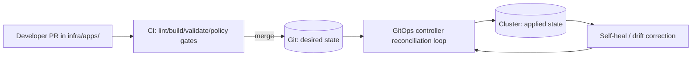

# `infra/apps/` — Application Workloads (GitOps)

> 🧭 **Governed GitOps directory**
>
> Changes under `infra/apps/` are treated as **deployment changes** (not “just YAML”).
> Use PRs + review + CI policy gates.  
> **Trust membrane rule:** frontend/external clients never access databases/object stores directly; all access through the governed API boundary.  
> *(See “Governance & Safety” below.)*

---

## Purpose

`infra/apps/` contains the **desired state** (Kubernetes/OpenShift manifests) for **KFM application workloads** that run *on* a cluster.

**Design intent:** it should be easy to add or update an app by committing a directory of manifests (often a Kustomize base + environment overlays), while the GitOps controller continuously reconciles cluster state to what’s in Git.

---

## Reference repository model (how `infra/apps/` fits in)

This folder usually sits inside a GitOps “ops” repo that separates concerns by boundary (platform vs app teams).

```
infra/
├─ bootstrap/          # GitOps bootstrap / initial controller wiring (verify in this repo)
├─ components/         # Shared GitOps components: projects/RBAC/AppSets (verify in this repo)
├─ core/               # Cluster “core” workloads + cluster config (verify in this repo)
└─ apps/               # ✅ You are here: tenant/application workloads
```

<details>
<summary><strong>Assumptions to verify (do this once, then delete this block)</strong></summary>

- [ ] `infra/apps/**` is discovered by a GitOps controller (e.g., Argo CD ApplicationSet “tenants” pattern).
- [ ] `infra/components/` contains the controller-level objects that select/sync `infra/apps/**`.
- [ ] Environments exist as overlays (e.g., `dev`, `stage`, `prod`) or per-cluster overlays.

If any of these differ in your repo, **update the “Folder conventions” and “How deploy happens” sections** to match reality.
</details>

---

## What belongs in `infra/apps/` vs elsewhere

| Area | Put it here? | Examples | Notes |
|---|---:|---|---|
| **Application workloads** | ✅ Yes | API service, UI service, worker, tile service | One folder per app. |
| **Per-env configuration** | ✅ Yes | image tag, replica count, ingress/route hostnames | Prefer overlays, not branches. |
| **Cluster “core” services** | ❌ No | GitOps controller itself, ingress controller, cluster-wide operators | Put in `infra/core/` (or equivalent). |
| **Shared GitOps components** | ❌ No | Argo CD Projects, RBAC, ApplicationSets | Put in `infra/components/` (or equivalent). |
| **Data ingestion catalogs / dataset promotion manifests** | ⚠️ Maybe | dataset “desired state” manifests | Only if your governance model treats data promotion as GitOps; keep separate from app runtime YAML. |

---

## How deployment happens



**Key property:** GitOps is asynchronous reconciliation; CI is typically synchronous build/test. Keep the boundary clean: CI produces artifacts (images, signed bundles, manifests), GitOps applies manifests.  

---

## Folder conventions

### 1 app = 1 directory

```
infra/apps/
└─ myapp/
   ├─ README.md                 # app-specific runbook: owner, SLOs, rollback, data sensitivity
   ├─ base/
   │  ├─ kustomization.yaml
   │  ├─ deployment.yaml
   │  ├─ service.yaml
   │  └─ ... (configmaps, routes/ingress, etc.)
   └─ overlays/
      ├─ dev/
      │  ├─ kustomization.yaml
      │  └─ patches/            # (optional) environment-specific patches
      ├─ stage/
      │  └─ ...
      └─ prod/
         └─ ...
```

### Kustomize expectations

- **`base/`** is reusable and environment-agnostic.
- **`overlays/<env>/`** composes a base + environment deltas (image tags, replicas, hostnames, resources, etc.).
- If you reference remote sources (another Git repo, submodule, etc.), document it in the app’s `README.md`.

---

## Adding a new app

### Checklist

- [ ] Create `infra/apps/<app-name>/base/` with a `kustomization.yaml` and core manifests.
- [ ] Create `infra/apps/<app-name>/overlays/<env>/kustomization.yaml` for each environment you support.
- [ ] Add an **app-level** `infra/apps/<app-name>/README.md` (owner, contacts, rollback, data classification).
- [ ] Ensure **no plaintext secrets** are committed (see “Secrets”).
- [ ] Open a PR and pass required CI/policy gates.

### Minimal `kustomization.yaml` (base)

```yaml
apiVersion: kustomize.config.k8s.io/v1beta1
kind: Kustomization

resources:
  - deployment.yaml
  - service.yaml

commonLabels:
  app.kubernetes.io/name: myapp
  app.kubernetes.io/part-of: kfm
```

### Minimal `kustomization.yaml` (overlay)

```yaml
apiVersion: kustomize.config.k8s.io/v1beta1
kind: Kustomization

resources:
  - ../../base

patches:
  - path: patches/deployment-replicas.yaml
```

---

## Promotion model

> 🧠 **Mindset shift:** you promote **manifests** (desired state) across environments, not “code” directly.

Practical expectations for KFM:

- Image references should be **immutable** (pin digest or immutable tag) and promoted via PR updates to overlays.
- Rollbacks should be “git revert” of desired state (plus any required data rollback procedures documented per app).

---

## Secrets handling (non-negotiable)

✅ **Never commit plaintext secrets** — even in private repos.

Choose one standard pattern (or formally allow both):

1. **Encrypted secrets in Git** (e.g., “sealed secrets” approach)  
2. **External secret manager + references in Git** (e.g., external secrets controller)

Document the chosen pattern in:
- `infra/components/` (platform-wide setup)
- each app `infra/apps/<app>/README.md` (what secrets it needs + where they live)

---

## Governance & safety gates

Before enabling or changing production patterns, run a **governance review** (minimum):

- [ ] **Policy / CARE review**: consent/CARE fields + sovereignty flags reviewed by governance owners.
- [ ] **Trust membrane**: no direct client access to DB/object store; only via governed API boundary.
- [ ] **Security**: artifact verification implemented server-side; browser only sees verified/sanitized links.
- [ ] **Licensing**: SPDX signals present for code + data; catalog license fields filled where applicable.
- [ ] **Immutability**: promoted artifacts are content-addressed; updates create new versions/digests.
- [ ] **Audit**: discovery/promotion actions logged (JSONL/PROV) and retained.

> 🔒 If an app exposes **sensitive locations** or culturally restricted information, treat it as a governance-sensitive change:
> generalize/redact outputs and require explicit governance sign-off before production exposure.

---

## CI expectations for `infra/apps/` changes

Your CI should be “fail-closed” for production-impacting YAML. Common gates (adapt to what your repo actually runs):

- **Build/Render**: `kustomize build` (or `kubectl kustomize`) for each overlay.
- **Schema validation**: Kubernetes/OpenShift schema checks for manifests.
- **Policy-as-code**: Conftest/OPA checks for security + governance constraints.
- **Drift safety**: forbid mutable image tags in prod overlays; require pinned digests (policy rule).
- **Docs**: app-level README exists + includes owner + rollback steps.

---

## Troubleshooting quick hits

- **App not deploying after merge**
  - Confirm the GitOps controller is watching the right path and has permissions.
  - Confirm the overlay builds/render successfully in CI and locally.
- **Drift / self-heal loops**
  - Check for controllers mutating resources (admissions, operators) vs your desired manifests.
  - Prefer explicit “ignore differences” configuration only when governed and documented.
- **Secret errors**
  - Verify your chosen secret pattern (sealed vs external references) is installed and scoped correctly.
  - Confirm namespace scoping matches your multi-tenancy rules.

---

## Glossary

- **Desired state**: what Git declares should exist.
- **Reconciliation**: controller loop that continuously applies desired state to actual state.
- **Kustomize base**: reusable set of manifests.
- **Kustomize overlay**: environment-specific composition/patching on top of base.
- **Trust membrane**: strict separation preventing direct DB/object-store access from clients.

---
