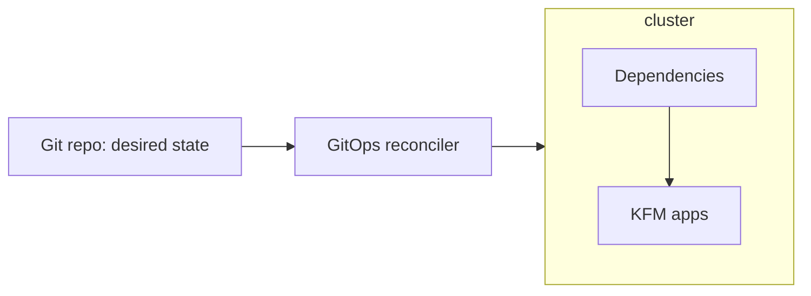

# infra/apps/dependencies


Platform/runtime dependencies for KFM workloads (datastores, controllers, operators, policy enforcement, observability, etc.) managed as **declarative** infrastructure.

> [!IMPORTANT]
> **Governed directory.** Treat changes here as “production changes.”  
> If you can’t prove what you changed (version, source, digest, policy outcome), **don’t merge it**.

---

## Table of contents

- [What belongs here](#what-belongs-here)
- [What does *not* belong here](#what-does-not-belong-here)
- [Conventions](#conventions)
  - [Directory layout](#directory-layout)
  - [Environments and overlays](#environments-and-overlays)
  - [Dependency registry](#dependency-registry)
- [How dependencies are applied](#how-dependencies-are-applied)
- [Adding or upgrading a dependency](#adding-or-upgrading-a-dependency)
  - [Ordering and prerequisites](#ordering-and-prerequisites)
  - [Supply-chain requirements](#supply-chain-requirements)
  - [Policy gates](#policy-gates)
- [Review checklist](#review-checklist)
- [Troubleshooting](#troubleshooting)
- [Glossary](#glossary)

---

## What belongs here

Use this directory for **shared runtime dependencies** that other KFM applications rely on, such as:

- **Queryable stores** (e.g., PostGIS, graph DB, search/vector, object store)
- **Policy enforcement** components (OPA/Rego policy distribution, admission controls)
- **Ingress / routing / certificates** controllers
- **Observability** foundations (metrics/logging/telemetry backends, collectors)
- **Secrets plumbing** (sealed secrets / external secrets operators, *not* plaintext secrets)
- **Cluster add-ons** that must exist before app workloads can start

> [!NOTE]
> “Dependency” here means *cluster/runtime dependency*, **not** a code dependency (npm/pip/etc.).

---

## What does *not* belong here

- Application source code, Dockerfiles, or app-specific deployment manifests  
  → those belong under the app’s own GitOps directory (e.g., `infra/apps/<app-name>/...`).
- Plaintext secrets (tokens, passwords, keys)  
  → use an approved secrets mechanism (sealed/encrypted or external secret references).
- Data artifacts, catalogs, receipts, or dataset payloads  
  → those belong in governed data stores + catalogs, not in a cluster dependency folder.

---

## Conventions

### Directory layout

This folder is designed to be compatible with the common **GitOps “apps directory”** pattern: each workload (here: each dependency) gets its own directory and is deployed via declarative manifests.

```text
infra/
└── apps/
    └── dependencies/
        ├── README.md
        ├── _registry/                     # optional but recommended
        │   └── dependencies.yaml          # optional: single source of truth for dependency inventory
        ├── <dependency-name-1>/
        │   ├── base/
        │   │   ├── kustomization.yaml
        │   │   └── *.yaml
        │   └── overlays/
        │       ├── dev/
        │       │   └── kustomization.yaml
        │       ├── stage/
        │       │   └── kustomization.yaml
        │       └── prod/
        │           └── kustomization.yaml
        └── <dependency-name-2>/
            └── ...
```

**Naming rules**
- Use **kebab-case**: `external-secrets`, `cert-manager`, `postgis`, `neo4j`, `opa`, etc.
- Keep directories **stable** once published. Renames are risky because GitOps tools interpret rename as delete+create.

---

### Environments and overlays

If you support multiple environments, keep environment differences in `overlays/`:

- `base/` = vendor defaults + KFM-safe baseline
- `overlays/dev` = faster iteration, lower quotas, debug-friendly settings
- `overlays/stage` = prod-like, includes migration rehearsal
- `overlays/prod` = restrictive, least privilege, scale settings

> [!TIP]
> If you don’t have `stage` yet, keep the directory anyway and leave a TODO file. It prevents “surprise” later.

---

### Dependency registry

Maintain a human-readable inventory so reviewers can answer: *What is this? Why do we need it? What risk does it add?*

A simple table works even without `_registry/`:

| Dependency | Type | Scope | Version/Digest | Owner | Notes |
|---|---|---:|---|---|---|
| `<name>` | operator/controller/store | cluster/ns | pinned | `@team` | justification + risk |

<details>
<summary>Optional: <code>_registry/dependencies.yaml</code> template</summary>

```yaml
# Optional registry file to keep dependency metadata centralized.
# Keep this file lightweight and reviewable; no secrets.

dependencies:
  - name: cert-manager
    type: controller
    scope: cluster
    version: "vX.Y.Z"          # pin versions; avoid floating "latest"
    source: "upstream/helm|manifests|oci-digest"
    owner: "@platform"
    environments:
      - dev
      - stage
      - prod
    risk_notes: "Cluster-scoped CRDs; requires ordering before dependent CRs."
    rollback: "Revert Git commit; ensure CRD downgrade policy documented."
```

</details>

---

## How dependencies are applied

This directory assumes a **GitOps reconciler** (commonly Argo CD / Flux / equivalent) is watching the repository and applying changes to the cluster.



Key expectation:
- Dependencies are deployed **before** the workloads that depend on them.
- Drift is corrected by reconciliation, not by manual “hot fixes.”

---

## Adding or upgrading a dependency

### 1) Decide scope + blast radius

- **Cluster-scoped** (CRDs/operators/admission controllers): higher governance bar
- **Namespace-scoped** (namespaced services): lower blast radius, still governed

Document that decision in the dependency’s folder (or registry entry).

---

### 2) Create the dependency folder

Minimum:
- `base/kustomization.yaml`
- at least one overlay (even if it’s identical to base initially)

If vendor manifests are used, prefer:
- pinned chart versions, pinned Git refs, or **OCI digests**
- a vendor lock file (where applicable)

---

### 3) Ordering and prerequisites

Common ordering constraints:
- CRDs/operators must exist before CR instances are applied
- namespaces + RBAC must exist before controllers can run
- storage classes / PVC prerequisites before stateful services

If you use Argo CD, prefer explicit ordering (sync phases/waves) for multi-dependency sequencing.  
*(If your GitOps tool differs, document the equivalent ordering mechanism.)*

---

### 4) Supply-chain requirements

Treat dependency artifacts like production software:

- **No floating tags** (`:latest`, `:stable`) for cluster dependencies.
- Prefer **digest pins** (`@sha256:...`) where feasible.
- Treat images as **immutable artifacts**: build once, tag deterministically, and promote through environments (do not rebuild the same tag).  
- If you publish internal images, generate SBOMs and attestations.

---

### 5) Policy gates

This directory is expected to participate in “fail-closed” validation:

- schema checks (Kubernetes manifests, kustomize build)
- policy-as-code checks (OPA/Rego via Conftest or equivalent)
- supply-chain checks (signatures/attestations where required)

> [!WARNING]
> If a dependency cannot pass the policy gates, treat that as a **design bug**, not a “temporary exception.”

---

## Review checklist

Use this as the PR definition-of-done for changes under `infra/apps/dependencies/`:

### Governance / provenance
- [ ] Dependency purpose documented (what it enables, why it’s needed)
- [ ] Ownership is explicit (team or maintainer)
- [ ] Scope is explicit (cluster vs namespace)

### Versioning / supply chain
- [ ] Versions are pinned (chart/app/operator versions; avoid floating)
- [ ] Image references are pinned (prefer digests where practical)
- [ ] Upgrade notes include rollback plan (what happens on revert?)

### GitOps correctness
- [ ] `kustomize build` (or equivalent render) succeeds for all targeted overlays
- [ ] Ordering is addressed (CRDs/operators first; sync waves if needed)
- [ ] No manual steps required to reach desired state (Git is the source of truth)

### Security
- [ ] No plaintext secrets committed
- [ ] Least privilege RBAC (cluster-wide permissions justified)
- [ ] Network exposure documented (ingress/routes, ports)

---

## Troubleshooting

<details>
<summary>Dependency applies but downstream apps fail</summary>

- Confirm the dependency’s pods are **Ready** and not crashlooping.
- Confirm CRDs exist (if applicable) before applying CR instances.
- Confirm namespaces/RBAC exist for downstream workloads.
- Check GitOps reconciliation status for sync errors and ordering issues.
</details>

<details>
<summary>Upgrade introduced breaking changes</summary>

- Revert the Git commit (fast rollback).
- If CRDs changed, confirm downgrade compatibility.
- Record a short post-mortem note in the dependency folder (what broke, what to watch next time).
</details>

---

## Glossary

- **GitOps**: managing desired system state in Git; an agent reconciles live state to match.
- **Overlay**: environment-specific customization layer (dev/stage/prod).
- **Fail-closed**: if validation/policy checks can’t prove safety/compliance, the change is blocked.
- **SBOM**: Software Bill of Materials (what’s in the artifact).
- **Attestation**: signed statement about how/where an artifact was built and what it contains.
