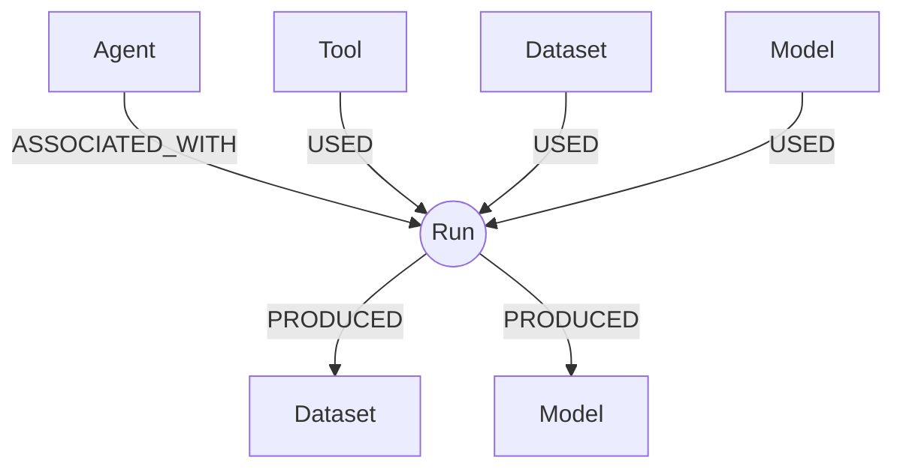

# Neo4j (Dependency) 🧠🕸️


This directory is the **GitOps-managed** deployment for **Neo4j** as a shared KFM infrastructure dependency.

In KFM, Neo4j is **not** a “primary catalog store.” It is a **thin graph hub** optimized for:
- **Lineage queries** (run-centered provenance graphs: *what used what, produced what, by whom, when*).
- A **mirror** of minimal PROV-ish provenance embedded in **STAC Items** (so Focus Mode / Story Mode can answer “How do we know?” quickly).

---

## Architecture position

```mermaid
flowchart LR
  A[Raw Sources] --> B[ETL / Normalization]
  B --> C[STAC Items + Collections]
  C --> D[DCAT Dataset Views]
  C --> E[Minimal PROV fields embedded in STAC]
  E --> F[Neo4j Graph\n(references back to catalogs)]
  F --> G[Governed API Layer\n(contracts + policy boundary)]
  G --> H[Map UI / Story Nodes / Focus Mode]
```

---

## Trust membrane and governance rules

> [!IMPORTANT]
> **Trust membrane rule (non-negotiable):** Frontend and external clients must **never** connect directly to Neo4j (Bolt/HTTP).  
> All access goes through the **governed API boundary** (service layer + policy + redaction).

> [!WARNING]
> **Do not store “heavy” artifacts in Neo4j** (large manifests, full STAC JSON bodies, blobs, tiles).  
> Store **references** (URIs + checksums + stable IDs) and keep the graph “thin.”

---

## Directory layout

This folder follows a GitOps-friendly structure (base + overlays).

```text
infra/apps/dependencies/neo4j/
└── README.md

# Suggested (typical) additions for GitOps deployments:
# ├── base/                  # tool-agnostic base (Helm/Kustomize/etc.)
# └── overlays/              # environment deltas (dev/stage/prod)
#     ├── dev/
#     └── prod/
```

> [!NOTE]
> If your repo uses **Argo CD**, this directory is typically referenced by an `Application` or `ApplicationSet`
> that points at `base/` or an environment overlay.

---

## What belongs in Neo4j

✅ Good fits:
- Lineage entities: **Dataset / Model / Tool / Agent / Run**
- Relationships: **USED / PRODUCED** with relationship properties
- Provenance facts: timestamps, roles, checksums, URIs, run IDs
- Pointers back to catalog records (STAC IDs / dataset IDs)

🚫 Not a fit:
- Full STAC JSON (store in STAC/object storage; index pointers here)
- Large manifests (store in object storage; reference by URI + checksum)
- Secrets, credentials, tokens
- PII or sensitive location details beyond what is needed for governed outputs

---

## Data contract: “minimal PROV” embedded in STAC

KFM expects each STAC Item to carry a **minimal provenance profile** (so it can be mirrored 1:1 into Neo4j).

**Minimum required fields (illustrative):**

| Field | Required | Purpose |
|---|---:|---|
| `prov.activity` | ✅ | Identifies the *run/activity* that generated the item |
| `prov.used[]` | ✅ | Inputs used (each includes at least `uri` + `checksum`) |
| `prov.wasAssociatedWith` | ✅ | Agent/tool attribution for the run |
| `prov.generatedAtTime` | ✅ | Time of generation |
| `prov.evidence[]` | ⭕ | Optional citations/trace links used by Focus Mode |

> [!TIP]
> Treat `prov.used[].checksum` as a **merge-blocking requirement**: if the checksum is missing, lineage is not trusted.

---

## Graph model: the “thin hub” (Run-centered)

Neo4j stays small and queryable by organizing around a **Run** hub:



### Recommended node labels
- `:Dataset`
- `:Model`
- `:Tool`
- `:Agent`
- `:Run`

### Recommended relationship types + properties
- `(:Run)-[:USED { role, checksum, uri }]->(:Dataset|:Model|:Tool)`
- `(:Run)-[:PRODUCED { checksum, uri, generatedAt }]->(:Dataset|:Model)`
- `(:Run)-[:ASSOCIATED_WITH]->(:Agent)`

### Constraints and indexes (suggested baseline)
- `Dataset(name, version)` **unique**
- `Model(name, version)` **unique**
- `Tool(name, version)` **unique**
- Indexes for `Run(runId)`, `Run(timestamp)`, and common query keys

---

## Deployment modes

| Mode | When to use | Notes |
|---|---|---|
| Local dev (Docker/Podman) | laptop dev, integration tests | Fast; use volumes for persistence |
| Kubernetes/OpenShift (Helm) | shared dev/stage/prod clusters | Recommended self-managed path |
| Neo4j AuraDB (managed) | when ops overhead must be minimized | Managed backups/encryption; watch retention/tier limits |

> [!WARNING]
> Neo4j is stateful. Ensure persistence (mount **`/data`**) or you will lose the database on restart.

---

## Local development (Podman or Docker)

> [!NOTE]
> Podman is commonly used as a Docker-compatible CLI, and can run containers without a long-lived daemon.

Example (adjust version/tag to match your repo policy):

```bash
# Use a named volume so /data persists across restarts
podman volume create neo4j_data

podman run -d \
  --name kfm-neo4j \
  -p 7474:7474 \
  -p 7687:7687 \
  -v neo4j_data:/data \
  -e NEO4J_AUTH="neo4j/<CHANGE_ME>" \
  neo4j:<PINNED_VERSION>
```

---

## Security baseline

> [!IMPORTANT]
> Configure security in layers:
> 1) **Authentication** (who are you)  
> 2) **Authorization** (what can you do)  
> 3) **Transport security** (TLS/SSL for Bolt/HTTP)  
> 4) **Logging** (security and audit logs)

Minimum expectations:
- Use **role-based privileges** (GRANT/DENY/REVOKE), not shared admin credentials
- Restrict **procedure/UDF execution** privileges (least privilege)
- Enable TLS for production traffic (Bolt + HTTP endpoints)
- Prefer internal-only Services + NetworkPolicy (cluster-internal access only)

---

## GitOps and secrets handling

> [!WARNING]
> Do **not** commit plaintext Kubernetes Secrets or Neo4j passwords to Git.

Common GitOps-compatible patterns:
- Store **encrypted secrets** in Git (e.g., Sealed Secrets)
- Store only **secret references** in Git and fetch from a secret manager (e.g., External Secrets / Vault / cloud secret managers)

---

## Smoke tests

Use these after deploy (adjust to your schema conventions).

### 1) Connectivity
```cypher
RETURN 1 AS ok;
```

### 2) Constraints present (sample check)
```cypher
SHOW CONSTRAINTS;
```

### 3) Minimal lineage hop (example)
```cypher
MATCH (r:Run)-[u:USED]->(d:Dataset)
RETURN r.runId, d.name, u.checksum, u.uri
LIMIT 25;
```

---

## Definition of Done ✅

- [ ] Neo4j deployed via GitOps under `infra/apps/dependencies/neo4j/`
- [ ] **Persistent storage** configured (`/data` mounted)
- [ ] Secrets handled via **Sealed Secrets** or **External Secrets** (no plaintext in Git)
- [ ] TLS/SSL enabled for production endpoints
- [ ] Network access restricted to **backend services** only (no frontend direct DB access)
- [ ] Constraints + indexes applied (baseline schema)
- [ ] STAC→Neo4j mirror job is idempotent and validates checksums
- [ ] CI gate blocks merges when `prov.used[]` lacks checksums or mirror completeness fails

---

## References

- Neo4j docs (operations, privileges, SSL): see official Neo4j documentation
- GitOps patterns (base/overlays, secret handling): see GitOps guidance referenced in repo docs
- KFM lineage/provenance design notes: see KFM blueprint/idea cards
