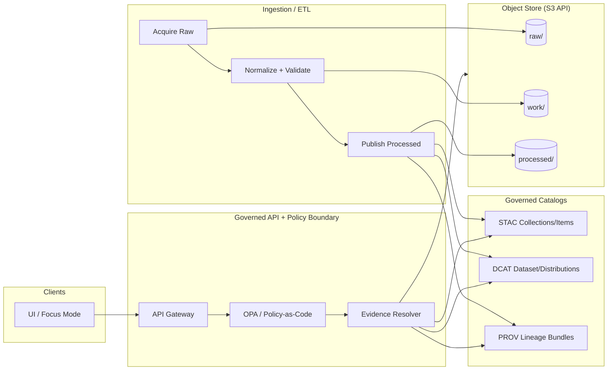

# Object Store (S3-Compatible) — KFM Dependency


KFM uses an object store for **large, unstructured/binary artifacts** (high‑resolution imagery, LIDAR point clouds, bulky PDFs, large TIFFs, 3D models, etc.). In KFM’s architecture, **catalog metadata** (STAC/DCAT) stores **references/URLs** to objects, and the governed API serves them on demand—keeping relational stores lean and query‑focused. In development, KFM can use **MinIO** to emulate S3; in production, this maps to cloud buckets (e.g., AWS S3 / GCS). [oai_citation:0‡KFM-Bluprint-&-Ideas.pdf](sediment://file_000000004e9c71f598d3d784f6a13c46)

> [!IMPORTANT]
> **Trust membrane rule (KFM non‑negotiable):** external clients and the frontend **do not** access storage directly. Access must flow through the governed API + policy boundary (OPA / policy-as-code), including redaction and sensitivity rules.

---

## What lives in the object store (and what does not)

### ✅ Store here
- **Raw acquisitions** and **binary-heavy source artifacts** (zips, PDFs, images, rasters, point clouds).
- **Processed derivatives** (COGs, Parquet/GeoParquet, derived indices, thumbnails, manifests).
- **Evidence payloads** referenced by STAC/DCAT (so Focus Mode can cite reproducible artifacts). [oai_citation:1‡KFM-Bluprint-&-Ideas.pdf](sediment://file_000000004e9c71f598d3d784f6a13c46)

### ❌ Do not store here
- Primary queryable metadata intended for search/filter/joins (belongs in catalogs + DB/indexes).
- Secrets (keys/tokens). These must be managed via secrets tooling (vault / external secrets), and never committed. (See “secrets stored in vault and never committed”.) [oai_citation:2‡KFM_Comprehensive_Data_Source_Integration_Blueprint_v1_massive.pdf](sediment://file_000000000bbc722f8debeb7985ab63ea)

---

## How KFM uses object storage

KFM’s integration workflow treats each source as a governed dataset and each run produces:
- a **DatasetVersion** (checksums + run metadata),
- a **DCAT dataset record**, and
- a **PROV activity** linking raw assets → processed derivatives; spatial assets are registered in **STAC** for map/timeline rendering and reproducible evidence citations. [oai_citation:3‡KFM_Comprehensive_Data_Source_Integration_Blueprint_v1_massive.pdf](sediment://file_000000000bbc722f8debeb7985ab63ea)

The system deliberately avoids bloating Git and databases with very large blobs; large assets live in object storage while the repo/catalog stores **references + hashes** (content-addressable thinking). [oai_citation:4‡Kansas Frontier Matrix (KFM) – Comprehensive Technical Blueprint.pdf](sediment://file_000000006dbc71f89a5094ce310a452d)

---

## Reference architecture



---

## Bucket + key conventions

KFM examples show STAC assets referencing `s3://kfm/processed/...`, implying a canonical bucket (example: `kfm`) and a `processed/` prefix for published derivatives. [oai_citation:5‡KFM-Bluprint-&-Ideas.pdf](sediment://file_000000004e9c71f598d3d784f6a13c46)

> [!NOTE]
> The exact bucket names and prefix taxonomy used in *this repo* are **(not confirmed in repo)**. The conventions below are a governed default aligned to the “raw → work → processed” workflow. [oai_citation:6‡KFM_Comprehensive_Data_Source_Integration_Blueprint_v1_massive.pdf](sediment://file_000000000bbc722f8debeb7985ab63ea)

### Recommended zone layout

| Zone | Prefix | Purpose | Governance stance |
|---|---|---|---|
| Raw | `raw/` | Immutable acquisitions + source artifacts | Restricted by default |
| Work | `work/` | Intermediate/normalized, not yet promoted | Restricted by default |
| Processed | `processed/` | Published derivatives referenced by catalogs | Policy-dependent (public/restricted) |
| Artifacts | `artifacts/` | Logs, receipts, run manifests, QA outputs | Restricted by default |

### Recommended key patterns

- Raw acquisition  
  `s3://kfm/raw/<source_id>/<run_id>/<original_filename>`

- Normalized work outputs  
  `s3://kfm/work/<source_id>/<run_id>/<canonical_asset_name>`

- Published processed derivative (versioned)  
  `s3://kfm/processed/<dataset_id>/v<semver>/<asset>`  
  Example from KFM-shaped STAC:  
  `s3://kfm/processed/land_patents/v1/index.parquet` [oai_citation:7‡KFM-Bluprint-&-Ideas.pdf](sediment://file_000000004e9c71f598d3d784f6a13c46)

---

## Configuration contract (apps talking to the object store)

All application components that require object storage should use a **single S3-compatible configuration contract**.

| Variable | Example | Notes |
|---|---:|---|
| `KFM_OBJECT_STORE_ENDPOINT` | `https://s3.example` | S3-compatible endpoint (MinIO/S3/etc.) |
| `KFM_OBJECT_STORE_REGION` | `us-east-1` | Optional for some providers |
| `KFM_OBJECT_STORE_BUCKET` | `kfm` | Bucket for KFM assets (example used in STAC) [oai_citation:8‡KFM-Bluprint-&-Ideas.pdf](sediment://file_000000004e9c71f598d3d784f6a13c46) |
| `KFM_OBJECT_STORE_ACCESS_KEY_ID` | `…` | Secret (never committed) [oai_citation:9‡KFM_Comprehensive_Data_Source_Integration_Blueprint_v1_massive.pdf](sediment://file_000000000bbc722f8debeb7985ab63ea) |
| `KFM_OBJECT_STORE_SECRET_ACCESS_KEY` | `…` | Secret (never committed) [oai_citation:10‡KFM_Comprehensive_Data_Source_Integration_Blueprint_v1_massive.pdf](sediment://file_000000000bbc722f8debeb7985ab63ea) |

> [!IMPORTANT]
> Store secrets in a secret manager (vault / external secrets). Do **not** commit credentials to Git. [oai_citation:11‡KFM_Comprehensive_Data_Source_Integration_Blueprint_v1_massive.pdf](sediment://file_000000000bbc722f8debeb7985ab63ea)

---

## Provenance and governed interchange

### Sidecar provenance files (recommended default)

To ensure provenance travels with data, store provenance as **sidecar files** next to published outputs (e.g., `dataset_provenance.jsonld`). This is explicitly recommended as a practical publishing strategy. [oai_citation:12‡KFM-Software Support.pdf](sediment://file_00000000ab28722fa3482ac03433a8e1)

Suggested conventions:

- For a dataset version folder:
  - `.../v1/`  
    - `index.parquet`  
    - `images_manifest.json`  
    - `dataset_provenance.jsonld`  ✅  
    - `checksums.json` ✅ (deterministic)

### Provenance completeness as a promotion gate

Promotion to `processed/` should be **fail-closed** unless provenance is complete and checksums are deterministic (i.e., every promoted artifact has a PROV chain + checksum). [oai_citation:13‡KFM_Comprehensive_Data_Source_Integration_Blueprint_v1_massive.pdf](sediment://file_000000000bbc722f8debeb7985ab63ea)

---

## Sensitivity handling and access model

KFM’s default stance is **least privilege**: only cleared, non-sensitive content is visible to public users; draft or sensitive/high-resolution variants are restricted. [oai_citation:14‡KFM-Bluprint-&-Ideas.pdf](sediment://file_000000004e9c71f598d3d784f6a13c46)

Additionally, governance is enforced continuously via CI and policy-as-code: dataset promotions can require DCAT + PROV to accompany changes; missing metadata/policy requirements should block merges/promotions. [oai_citation:15‡KFM-Bluprint-&-Ideas.pdf](sediment://file_000000004e9c71f598d3d784f6a13c46)

> [!WARNING]
> Some domains (e.g., archaeology / protected sites) may require generalized or suppressed location precision and additional controls. Ensure restricted material is segregated and policy-labeled before publishing.

---

## Event-driven ingestion triggers (optional but aligned)

When available, use **object-store notifications** to trigger ingestion; otherwise fall back to polite polling (e.g., HTTP HEAD with ETag/Last-Modified). KFM proposes an idempotent discovery envelope with provenance stub fields for auditability. [oai_citation:16‡KFM-Bluprint-&-Ideas.pdf](sediment://file_000000004e9c71f598d3d784f6a13c46)

<details>
<summary><strong>Discovery envelope (reference pattern)</strong></summary>

```json
{
  "schema": "io.kfm.discovery.v1",
  "idempotency_key": "sha256:…",
  "occurred_at": "2026-01-05T12:34:56Z",
  "kind": "object|feed_entry",
  "source": { "provider": "cloudflare:r2|aws:s3|http", "bucket": "...", "key": "...", "url": "..." },
  "provenance": { "uri": "r2://bucket/key", "etag": "...", "size_bytes": 12345, "last_modified": "..." },
  "hints": { "expected_followup": "GET", "format": "application/json" },
  "governance": { "license_hint": "...", "sensitivity_hint": "public|restricted" }
}
```

</details>

---

## Local development

KFM’s dev stack commonly includes MinIO for object storage emulation (alongside other services). [oai_citation:17‡KFM-Bluprint-&-Ideas.pdf](sediment://file_000000004e9c71f598d3d784f6a13c46)

> [!NOTE]
> The exact local dev commands and compose file path are **(not confirmed in repo)**. Look for `docker-compose.yml` / `compose.yaml` in the repo and enable the `minio` service if present. [oai_citation:18‡KFM-Bluprint-&-Ideas.pdf](sediment://file_000000004e9c71f598d3d784f6a13c46)

---

## Ops checklist

### Setup
- [ ] Bucket(s) exist (e.g., `kfm`) and are scoped to the environment (dev/stage/prod).
- [ ] Prefix taxonomy is documented and enforced (`raw/`, `work/`, `processed/`).
- [ ] Credentials are provisioned via secret manager (no Git commits). [oai_citation:19‡KFM_Comprehensive_Data_Source_Integration_Blueprint_v1_massive.pdf](sediment://file_000000000bbc722f8debeb7985ab63ea)

### Governance gates
- [ ] Promotion to `processed/` requires deterministic checksums + PROV completeness. [oai_citation:20‡KFM_Comprehensive_Data_Source_Integration_Blueprint_v1_massive.pdf](sediment://file_000000000bbc722f8debeb7985ab63ea)
- [ ] Catalogs emitted/updated (DCAT always; STAC/PROV as applicable). [oai_citation:21‡KFM_Comprehensive_Data_Source_Integration_Blueprint_v1_massive.pdf](sediment://file_000000000bbc722f8debeb7985ab63ea)
- [ ] CI blocks missing license/attribution/policy labels (fail closed). [oai_citation:22‡KFM-Bluprint-&-Ideas.pdf](sediment://file_000000004e9c71f598d3d784f6a13c46)

### Security & safety
- [ ] Least-privilege access paths; sensitive/high-res variants restricted. [oai_citation:23‡KFM-Bluprint-&-Ideas.pdf](sediment://file_000000004e9c71f598d3d784f6a13c46)
- [ ] Public distribution (if any) is mediated by the governed API (not direct bucket access).

---

## References and provenance

These KFM docs motivate the object-store design and conventions in this README:

- Object storage purpose + MinIO dev / cloud bucket production mapping + catalogs referencing objects. [oai_citation:24‡KFM-Bluprint-&-Ideas.pdf](sediment://file_000000004e9c71f598d3d784f6a13c46)
- Example STAC asset URIs referencing `s3://kfm/processed/...` (bucket/prefix illustration). [oai_citation:25‡KFM-Bluprint-&-Ideas.pdf](sediment://file_000000004e9c71f598d3d784f6a13c46)
- Governed ingestion workflow + catalogs/provenance expectations + raw→work→processed framing. [oai_citation:26‡KFM_Comprehensive_Data_Source_Integration_Blueprint_v1_massive.pdf](sediment://file_000000000bbc722f8debeb7985ab63ea) [oai_citation:27‡KFM_Comprehensive_Data_Source_Integration_Blueprint_v1_massive.pdf](sediment://file_000000000bbc722f8debeb7985ab63ea)
- Promotion gate: provenance completeness + deterministic checksums. [oai_citation:28‡KFM_Comprehensive_Data_Source_Integration_Blueprint_v1_massive.pdf](sediment://file_000000000bbc722f8debeb7985ab63ea)
- Secret handling guidance (“secrets stored in vault and never committed”). [oai_citation:29‡KFM_Comprehensive_Data_Source_Integration_Blueprint_v1_massive.pdf](sediment://file_000000000bbc722f8debeb7985ab63ea)
- Sidecar provenance publishing pattern (`dataset_provenance.jsonld`). [oai_citation:30‡KFM-Software Support.pdf](sediment://file_00000000ab28722fa3482ac03433a8e1)
- Least-privilege governance stance + CI enforcement patterns. [oai_citation:31‡KFM-Bluprint-&-Ideas.pdf](sediment://file_000000004e9c71f598d3d784f6a13c46) [oai_citation:32‡KFM-Bluprint-&-Ideas.pdf](sediment://file_000000004e9c71f598d3d784f6a13c46)
- Event-driven discovery envelope concept (object store notifications). [oai_citation:33‡KFM-Bluprint-&-Ideas.pdf](sediment://file_000000004e9c71f598d3d784f6a13c46)
