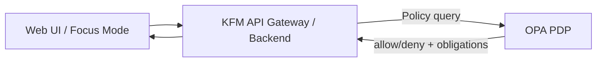

# OPA (Open Policy Agent) — KFM Policy Plane Dependency


> [!IMPORTANT]
> This directory deploys the **OPA runtime** (Policy Decision Point / PDP).  
> **Do not** treat this folder as the source-of-truth for policy logic. The canonical Rego policy pack belongs in `policy/opa/` (or equivalent), then gets *loaded* into OPA as a bundle/ConfigMap.

---

## What lives here

This folder is the **GitOps / infra app** for deploying **Open Policy Agent (OPA)** as a KFM dependency.

KFM uses OPA/Rego in two primary ways (design intent):
1. **CI policy gates** (Conftest → OPA policies) that **fail closed** to block merges when provenance/metadata/rights invariants are missing or invalid.
2. **Runtime policy enforcement**: the API (or an API gateway) queries OPA before serving sensitive datasets or returning AI answers; OPA can **deny** or require a **sanitized** response.

---

## Where it fits in KFM architecture

OPA is an **infrastructure dependency** that is invoked through a **policy engine interface/port** in the backend (trust membrane preserved).

### Trust membrane (non-negotiable)

- Frontend and external clients **never** access databases directly.
- The API / services evaluate “should this be allowed?” by querying OPA.
- OPA evaluates policies; it does **not** fetch data from storage systems.



---

## Directory layout

> [!NOTE]
> Recommended GitOps layout using **Kustomize base + overlays** (adapt to your repo conventions).

```text
infra/
└─ apps/
   └─ dependencies/
      └─ opa/                                      # OPA policy PDP (runtime decisions/redaction; fail-closed stance)
         ├─ README.md                               # How OPA is deployed, updated, and validated (policy bundle wiring)
         │
         ├─ base/                                   # Common OPA deployment (environment-agnostic defaults)
         │  ├─ kustomization.yaml                    # Base kustomize entry (resources + common labels/patches)
         │  ├─ deployment.yaml                       # OPA Deployment (resources, args, probes, volumes/bundles)
         │  ├─ service.yaml                          # Cluster Service for OPA (internal-only; no public ingress)
         │  ├─ networkpolicy.yaml                    # (Optional hardening) restrict who can call OPA (trust membrane)
         │  ├─ poddisruptionbudget.yaml              # (Optional hardening) availability during node drain/rollouts
         │  └─ servicemonitor.yaml                   # (Optional hardening) Prometheus scraping (if used)
         │
         └─ overlays/                                # Per-environment deltas (keep small and explicit)
            ├─ dev/
            │  └─ kustomization.yaml                 # Dev patches (replicas/resources/logging; relaxed only if justified)
            ├─ stage/
            │  └─ kustomization.yaml                 # Stage patches (closer to prod; smoke/perf parity)
            └─ prod/
               └─ kustomization.yaml                 # Prod patches (HA, strict egress, tight resources, audit-friendly)
```

---

## Policy sources and how they get into OPA

### Canonical policy location

Policies should live outside this folder (example):
- `policy/opa/` — the source-of-truth Rego pack
- `policy/opa/**/_test.rego` — Rego unit tests for drift detection

This infra app should *load* that policy pack into OPA in a reproducible way.

### Loading patterns

Pick one (and keep it consistent):

#### Option A — Mount policy pack via ConfigMap (simple + common)
- Kustomize `configMapGenerator` builds a ConfigMap from the repo policy files.
- The OPA container mounts it into `/policy` (read-only).
- OPA runs in server mode: evaluates data requests against loaded policy files.

Pros: simple, GitOps-friendly  
Cons: ConfigMap size limits; rollout required on policy change

#### Option B — Use OPA bundles (recommended for larger packs)
- Policies are packaged as a bundle and delivered to OPA (e.g., from an internal bundle server / artifact store).
- OPA periodically pulls bundles and can report bundle status.

Pros: scalable; decouples policy distribution from deployment  
Cons: requires bundle distribution and auth model

---

## Deployment model options

### Mode 1 — Shared OPA service (central PDP)
Deploy one OPA instance per environment/namespace, and have KFM services query it.

**Use when**: you want a single governed policy plane that multiple services can query.

### Mode 2 — Sidecar OPA (per workload)
Run OPA as a sidecar container next to a service.

**Use when**: you need isolation, service-specific policies, or very low latency.

> [!TIP]
> The KFM design docs explicitly allow either sidecar or embedded approaches. Pick one per environment and document it clearly.

---

## Configuration

> [!WARNING]
> Avoid `openpolicyagent/opa:latest` outside local dev. Pin versions to reduce toolchain drift.

Suggested configuration “shape” (examples; align to your manifests):

| Concern | Recommendation |
|---|---|
| Image | `openpolicyagent/opa:<PINNED_VERSION>` |
| Port | `8181/TCP` |
| Policy mount | `/policy` (read-only) |
| Default stance | deny-by-default (`default allow = false`) |
| Networking | Cluster-internal only; restrict by NetworkPolicy |
| Change control | policy pack changes require review + tests |

---

## Local development

### Run OPA as a container (docker compose style)

This is the minimal local-dev pattern (mount repo policies into `/policy`):

```yaml
services:
  opa:
    image: openpolicyagent/opa:<PINNED_VERSION_FOR_LOCAL>
    command: ["run", "--server", "/policy"]
    volumes:
      - ./policy:/policy:ro
    ports:
      - "8181:8181"
```

### Smoke test (example)

```bash
# Replace <package>/<rule> with your policy entrypoint.
curl -s \
  -X POST "http://localhost:8181/v1/data/kfm/receipts/allow" \
  -H "Content-Type: application/json" \
  -d '{"input":{"run_manifest":{"signatures":["x"],"attestations":["y"],"rights":{"license":"CC-BY"}, "rekor_uuid":"u","spec_hash":"h"}}}' \
| jq .
```

---

## CI policy gates (Conftest / OPA)

OPA is also used as a **merge-blocking policy gate** in CI.

### Typical invocations

```bash
# Evaluate a JSON artifact against the policy pack
conftest test run_receipt.json --policy policy/opa

# Run Rego unit tests (recommended to prevent policy drift)
opa test policy/opa -v
```

### Fail-closed kill-switch (CI)

If your repo uses a “kill switch”, CI should **fail closed** when enabled.

```bash
# Example concept (adapt to your CI):
if [ -f .github/KILL_SWITCH ] || [ "${DEPLOY_KILL_SWITCH}" = "1" ]; then
  echo "KILL_SWITCH_ACTIVE"
  exit 1
fi
```

---

## Governance and auditability requirements

Treat policy as governed production logic:

- **Default deny / fail closed** is the baseline.
- Keep policies **small and composable** (one file per concern).
- Require **unit tests** (`_test.rego`) and **fixtures** (golden allow/deny cases).
- **Version policy packs** and record which policy version made decisions:
  - CI outputs and runtime audit logs should include a policy bundle digest/hash or commit ref.
- For exceptions (temporary allow rules), require an explicit **governance trail** (ticket/decision record).

> [!IMPORTANT]
> When a runtime decision is questioned later, you must be able to reconstruct the exact policy version in effect.

---

## Troubleshooting runbook (quick)

1. **OPA pod unhealthy**
   - Check pod logs.
   - Verify the policy mount exists and is readable.
2. **All decisions deny unexpectedly**
   - Confirm you loaded the expected policy files/bundle.
   - Confirm the query path matches the policy package/rule entrypoint.
3. **Policy change not taking effect**
   - ConfigMap-based loading requires a rollout.
   - Bundle-based loading requires verifying bundle fetch status.

---

## Definition of Done

### Security + reliability
- [ ] OPA image is pinned (no `:latest` in non-dev).
- [ ] OPA runs as non-root; filesystem is read-only where feasible.
- [ ] No public ingress; NetworkPolicy restricts access to in-namespace callers.
- [ ] Resource requests/limits set; PDB (if needed) set.

### Governance + CI
- [ ] CI includes Conftest/OPA checks as required status checks.
- [ ] Policy pack has `_test.rego` coverage + fixtures for critical invariants.
- [ ] Decision outputs (CI + runtime) include a policy version reference (commit/digest).
