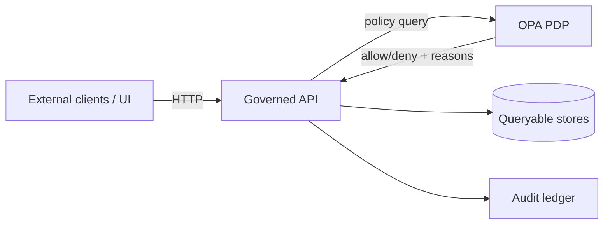

# OPA — Base (Kustomize)


> [!IMPORTANT]
> This directory is the **environment-agnostic Kustomize base** for deploying **Open Policy Agent (OPA)** as KFM’s
> **policy decision point (PDP)**.  
> Apply **overlays** (e.g., `../overlays/dev`, `../overlays/prod`) for cluster/environment specifics.

---

## Why OPA exists in KFM

OPA is the standardized **policy-as-code** runtime for KFM governance decisions:

- **Request-time policy decisions** for the **Governed API** (authorization + response shaping)
- **Fail-closed “promotion gates”** (e.g., deny publish unless required evidence/metadata is present)
- **Cite-or-abstain validation** patterns (deny/abstain when required citations/evidence are missing)

> [!NOTE]
> OPA makes **decisions**. Enforcement remains the responsibility of the calling component
> (API gateway, backend service, CI job, promotion controller).

---

## Where this component fits



**Trust membrane reminder:** external clients should only interact with governed APIs; internal services consult OPA to apply governed policy before accessing stores.

---

## Scope

### ✅ In scope (base)
- OPA runtime deployment (Deployment/Service or equivalent)
- ServiceAccount + minimal RBAC (only what OPA needs)
- Health/readiness wiring suitable for GitOps reconciliation
- **No environment coupling** (no cluster-specific names, hostnames, secrets, or external endpoints)

### ❌ Out of scope (handled elsewhere)
- Rego policy authoring and test suites (the “policy pack”)
- CI wiring (Conftest jobs, status checks, branch protection)
- Secrets management (external secrets/sealed secrets/etc.)
- API gateway integration details (that belongs with the gateway/service)

---

## Directory layout

> The canonical GitOps pattern is **bases + overlays**: base = reusable foundation; overlays = environment deltas.  
> (If you’re using Helm instead, treat this directory as the “raw-manifests” equivalent and keep overrides out of base.)

```text
infra/
└─ apps/
   └─ dependencies/
      └─ opa/
         ├─ base/
         │  ├─ README.md
         │  ├─ kustomization.yaml
         │  └─ (manifests: deployment/service/rbac/config as needed)
         └─ overlays/
            ├─ dev/
            └─ prod/
```

---

## Deploy

### kubectl (manual / dev)
```sh
kubectl apply -k infra/apps/dependencies/opa/overlays/dev
```

### GitOps controller (recommended)
Point your GitOps `Application`/`Kustomization` to the desired overlay:
- `infra/apps/dependencies/opa/overlays/dev`
- `infra/apps/dependencies/opa/overlays/prod`

> [!TIP]
> Avoid applying `base/` directly in production; overlays should set:
> image pinning, resources, namespaces, network policy, bundle sources, and any integration config.

---

## Policy bundle & data wiring

OPA needs policy code (Rego) and sometimes data inputs (JSON). This base does **not** assume a single delivery mechanism.
Use overlays to choose one:

| Delivery mode | Best for | Typical overlay action | Operational notes |
|---|---|---|---|
| **ConfigMap-mounted bundle** | dev / small policy packs | generate `ConfigMap` from policy directory and mount | simplest; ConfigMap size limits apply |
| **HTTP bundle** | prod | configure `bundles` + `services` in OPA config | requires reachable bundle server |
| **OCI bundle (digest-pinned)** | prod + supply-chain friendly | fetch bundle by digest (initContainer or sidecar) | aligns with “immutable-by-digest” governance patterns |

> [!IMPORTANT]
> Treat policy bundles as **versioned, reviewed artifacts**. Pin by **digest** where possible.  
> Policy changes are governance changes.

---

## Decision endpoints

OPA’s REST API lets callers request decisions. Recommended conventions (names may vary by implementation):

| Decision family | Example decision path | Returns |
|---|---|---|
| Request authz | `kfm.authz.allow` | `allow`, `deny_reasons[]` |
| Promotion gate | `kfm.promotion.allow` | `allow`, `deny_reasons[]`, `requires_review` |
| Sensitivity / CARE | `kfm.sensitivity.classify` | `classification`, `requires_consent` |
| Citation gate | `kfm.citations.ok` | `ok`, `missing[]` |

<details>
<summary>Example: request-time authz input/output (illustrative)</summary>

```json
{
  "input": {
    "subject": {"sub": "user:123", "roles": ["analyst"]},
    "action": "read",
    "resource": {"type": "dataset", "id": "kfm:dataset:abc"},
    "context": {"lane": "public", "ip": "10.0.0.10"}
  }
}
```

```json
{
  "result": {
    "allow": false,
    "deny_reasons": ["missing_required_provenance"],
    "policy_version": "git:abcdef0"
  }
}
```
</details>

> [!WARNING]
> Design policies **deny-by-default**. Your “green path” must be explicit and explainable.

---

## CI usage (Conftest)

OPA/Rego policy packs can be reused in CI via **Conftest** for merge-blocking checks (schemas, provenance, licensing, CARE/sensitivity, Story Node validations, etc.).

```sh
# Example (adjust paths for your repo):
conftest test <artifact.json> -p <path-to-policy-pack>
```

Policy authoring guidelines:
- Prefer **clear deny messages** that identify:
  1) the missing/invalid field, 2) the violated constraint, 3) the remediation step  
- Unit-test policies (`*_test.rego`) with sample inputs (valid + invalid)
- Keep policy packs small, composable, and versioned

---

## Security hardening checklist

> [!IMPORTANT]
> OPA is part of the Trust Membrane. Secure-by-default configuration matters.

- [ ] Run as **non-root**
- [ ] Drop Linux capabilities; set `readOnlyRootFilesystem: true`
- [ ] Resource requests/limits set in overlays
- [ ] Restrict ingress to OPA via **NetworkPolicy** (only API/gateway + CI runners if applicable)
- [ ] Do **not** expose OPA outside the cluster unless explicitly governed
- [ ] Pin the OPA image by **digest** in overlays
- [ ] Log policy version/bundle digest for auditability (label/annotation + log fields)
- [ ] Enable metrics only for internal scraping (if used)

---

## Operations

### Health checks
Typical endpoints (implementation dependent):
- `/health` (liveness)
- `/health?bundle=true` (ready only after bundle load) — if using bundles

### Observability (recommended)
Track:
- decision counts (allow/deny)
- top deny reasons
- bundle load status and current bundle digest/version
- p95 decision latency

---

## Change governance

Changes under this directory are **infra changes** that can alter enforcement behavior.

**Require review + gates** for:
- service exposure (Ingress/Route/LoadBalancer)
- bundle source changes
- policy version/digest pin updates
- NetworkPolicy/RBAC modifications

> [!NOTE]
> If the repo includes a “kill-switch” pattern for fail-closed enforcement, wire it in overlays so it can block promotion/merges quickly.

---

## Troubleshooting

```sh
# Pods
kubectl get pods -n <namespace> -l app=opa

# Logs
kubectl logs -n <namespace> deploy/<opa-deployment-name>

# Port-forward (debug only)
kubectl port-forward -n <namespace> svc/<opa-service-name> 8181:8181

# Health
curl -sS http://localhost:8181/health | jq
```

<details>
<summary>Common failure modes</summary>

- **Pods crashloop:** check config/env flags; validate mounted config files are present.
- **Always denying:** confirm bundle loaded; confirm decision path matches caller; review default deny rules.
- **Intermittent timeouts:** check CPU/memory limits; inspect decision latency; reduce heavy data loads in policy.
- **GitOps drift:** ensure overlays pin image and config; avoid mutable tags.

</details>