# OPA overlays


Kustomize overlays for deploying **Open Policy Agent** as a **cluster dependency** for Kansas Frontier Matrix.

OPA is a core part of KFM’s “governance-by-construction” loop:
- **CI gates**: deny-by-default policy packs are evaluated (commonly via Conftest) to block unsafe promotion.
- **Runtime enforcement**: the governed API boundary queries policy to allow, deny, or sanitize responses.

> [!IMPORTANT]
> This folder is for **deploying the OPA runtime**.  
> Rego source policies, policy bundles, and CI policy tests typically live elsewhere in the repo (not confirmed in repo).

---

## Contents

- [What overlays are for](#what-overlays-are-for)
- [Directory layout](#directory-layout)
- [How to build and apply](#how-to-build-and-apply)
- [Overlay conventions](#overlay-conventions)
- [Governance and safety invariants](#governance-and-safety-invariants)
- [Change checklist](#change-checklist)
- [Troubleshooting](#troubleshooting)

---

## What overlays are for

Kustomize overlays let us apply **small, environment-specific deltas** on top of a shared base. A **base** is reusable and does not “know” about environments; an **overlay** composes one or more bases and applies environment-specific patches. [oai_citation:3‡Docker-GitOps-OpenShift.pdf](sediment://file_00000000004c71f8a55fb8ae2e980ace)

Typical overlay responsibilities:
- Cluster/environment specific **namespace**, labels/annotations, sync ordering metadata
- **Replicas**, resource requests/limits, affinity, topology spread
- **Network exposure** choices (ClusterIP vs internal Ingress, etc.)
- **Policy bundle wiring**: how OPA gets the policy bundle for that environment
- **Decision log routing**: where OPA sends decision logs for auditability

---

## Directory layout

> [!NOTE]
> The overlay names below are examples. Use the actual subdirectories in this repo.

```text
infra/
└─ apps/
   └─ dependencies/
      └─ opa/
         ├─ base/                         # shared OPA manifests (not in this folder)
         └─ overlays/
            ├─ <env>/                     # environment overlay, e.g. dev, stage, prod
            │  ├─ kustomization.yaml
            │  ├─ patches/                # strategic-merge or JSON6902 patches
            │  └─ README.md               # env-specific notes (optional)
            └─ README.md                  # you are here
```

Recommended overlay file pattern:
- `kustomization.yaml` references the base and lists patches.
- `patches/` is where *only* deltas live.

---

## How to build and apply

> [!WARNING]
> In shared environments, prefer GitOps reconciliation (Argo CD / Flux / ACM).  
> Manual `kubectl apply -k` is best reserved for local/dev clusters and debugging.

### Render manifests

```bash
kustomize build infra/apps/dependencies/opa/overlays/<env>
# or, if using kubectl’s built-in kustomize support:
kubectl kustomize infra/apps/dependencies/opa/overlays/<env>
```

### Apply to a cluster

```bash
kubectl apply -k infra/apps/dependencies/opa/overlays/<env>
```

### Validate the rendered output

```bash
kustomize build infra/apps/dependencies/opa/overlays/<env> \
  | kubectl apply --dry-run=server -f -
```

---

## Overlay conventions

### What belongs in overlays

| Category | Examples of overlay changes | Why it is an overlay concern |
|---|---|---|
| Environment identity | namespace, labels, cluster tags | isolates environments cleanly |
| Scale | replicas, HPA thresholds | depends on cluster size and SLOs |
| Resources | requests/limits, node selectors | depends on node pools |
| Connectivity | Service type, Ingress/Gateway wiring | varies by environment |
| Bundle wiring | bundle URL/digest, configmap refs, polling interval | environments may use different bundle channels |
| Audit plumbing | decision log sinks, log level | audit requirements differ |

### What does not belong in overlays

| Do not put this in overlays | Why |
|---|---|
| Secrets in plain YAML | violates “secrets never committed” norms; use external secret store |
| Unpinned “latest” policy bundle references | makes policy non-reproducible; breaks auditability |
| One-off edits to the base YAML | overlays should patch; the base should remain reusable |
| Any mechanism that bypasses the governed policy boundary | violates KFM trust membrane expectations |

---

## Governance and safety invariants

> [!IMPORTANT]
> KFM governance aims to **fail closed**: promotion and exposure are blocked unless required evidence, licenses, and policy constraints are satisfied. [oai_citation:4‡KFM-Bluprint-&-Ideas.pdf](sediment://file_000000004e9c71f598d3d784f6a13c46)

### Trust membrane alignment

- **Frontend and external clients never access storage directly.** All access flows through a governed API boundary that can query policy, apply redaction, and emit audit/provenance signals. [oai_citation:5‡KFM-Bluprint-&-Ideas.pdf](sediment://file_000000004e9c71f598d3d784f6a13c46)
- Runtime policy enforcement may be implemented via an **OPA sidecar** or a **separate OPA service** called by the backend; in either case, policy is treated as the source of truth and should be versioned for accountability. [oai_citation:6‡Kansas Frontier Matrix (KFM) – Comprehensive Technical Blueprint.pdf](sediment://file_000000006dbc71f89a5094ce310a452d)

### Sensitivity and redaction expectations

KFM’s integration blueprint recommends explicit policy labels such as:
- `public`
- `restricted`
- `sensitive-location` [oai_citation:7‡KFM_Comprehensive_Data_Source_Integration_Blueprint_v1_massive.pdf](sediment://file_000000000bbc722f8debeb7985ab63ea)

Overlays must not undermine these expectations. If an overlay changes exposure (Ingress, routing, logging), verify:
- restricted/sensitive-location responses remain governed and redacted as required
- audit signals remain available for review

### CARE and consent enforcement

Some KFM governance patterns require fail-closed gates around sovereignty/consent, such as blocking public exposure of data intersecting authoritative Tribal boundaries unless required labels and consent facets exist. [oai_citation:8‡KFM-Bluprint-&-Ideas.pdf](sediment://file_000000004e9c71f598d3d784f6a13c46)

Even if those specific gates are enforced in CI, overlays should preserve the runtime enforcement and audit hooks needed to honor these decisions.

---

## Change checklist

Use this list for any overlay change PR.

### Build and correctness

- [ ] `kustomize build infra/apps/dependencies/opa/overlays/<env>` renders successfully
- [ ] `kubectl apply --dry-run=server` succeeds against the target cluster
- [ ] Resource names, namespaces, and labels match environment conventions
- [ ] Replica and resource changes are justified in PR description

### Governance and security

- [ ] No secrets committed; secret references use approved mechanisms
- [ ] Policy bundle reference is reproducible (pin by digest or pinned version)
- [ ] Decision logging remains enabled and routed appropriately for audit
- [ ] Exposure changes were reviewed for trust membrane impact

### Operational readiness

- [ ] Readiness and liveness checks are configured for the OPA workload
- [ ] Pod disruption / rollout behavior is safe for the target environment
- [ ] Alerts and dashboards are updated if your org requires them

---

## Troubleshooting

<details>
<summary><strong>OPA is deployed but policies do not seem to apply</strong></summary>

Check the overlay wiring for how the policy bundle is delivered:
- Is the bundle source reachable from the cluster network?
- Are bundle references pinned and correct for the intended environment?
- Are config maps and volume mounts aligned with the base?

If the backend uses OPA as a service, confirm:
- the service DNS/name matches what the backend calls
- network policies permit backend → OPA traffic
</details>

<details>
<summary><strong>Unexpected denies in staging</strong></summary>

Start from “deny-by-default” assumptions:
- inspect decision logs for the deny reason codes
- confirm staging is using the intended policy bundle version
- verify policy labels and sensitivity signals are present in request context

Remember: KFM aims to fail closed when evidence or required governance fields are missing.
</details>

---

## Diagram

```mermaid
flowchart LR
  Dev[Engineer edits overlay] --> Git[Git commit and PR]
  Git --> CI[CI gates]
  CI -->|fail closed| Merge[Merge to main]
  Merge --> GitOps[GitOps controller reconcile]
  GitOps --> Cluster[Kubernetes cluster]
  Cluster --> OPA[OPA runtime]
  Client[Client or UI] --> API[Governed API boundary]
  API -->|policy query| OPA
  OPA -->|allow deny sanitize| API
  API --> Client
```


