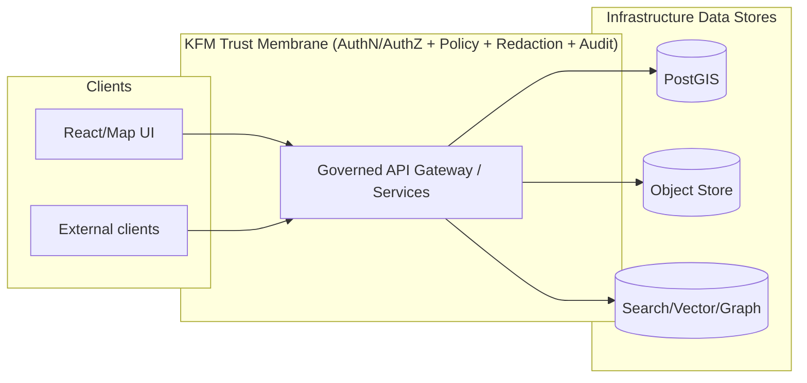

<!--
File: infra/apps/dependencies/postgis/base/README.md
Purpose: Kustomize base documentation for the PostGIS dependency used by KFM.
-->

# PostGIS (PostgreSQL + PostGIS) — Kustomize Base 🗺️🗄️


This directory is the **Kustomize _base_** for deploying **PostGIS** (PostgreSQL + PostGIS extensions) as an internal dependency of the **Kansas Frontier Matrix (KFM)** platform.

It is designed to be:
- ✅ **Environment-agnostic** (base only; environment specifics belong in overlays)
- ✅ **Governed by default** (trust membrane assumptions and access boundaries are explicit)
- ✅ **OpenShift/Kubernetes friendly** (stateful storage + probes + least privilege posture)

> [!IMPORTANT]
> **Trust membrane invariant (KFM):** Clients (including the frontend) must *never* access PostGIS directly.  
> All reads/writes must traverse the governed API + policy boundary.

---

## What lives here

This **base** should contain:
- Core Kubernetes resources needed to run PostGIS (typically `StatefulSet`, `Service`, `PVC`, `ConfigMap`, `NetworkPolicy`, etc.)
- Defaults that are safe to share across environments
- No environment secrets or cluster-specific settings

This **base should not** contain:
- Environment-specific storage classes, resource limits, node selectors, routes/ingresses
- Plaintext credentials (use Secrets in overlays; prefer sealed/SOPS-managed workflows if used in this repo)

---

## Repository layout expectations

> This is the expected GitOps/Kustomize layout used across infra/apps. Adjust names to match the repo conventions if they differ.

```text
infra/
└── apps/
    └── dependencies/
        └── postgis/
            ├── base/
            │   ├── README.md
            │   ├── kustomization.yaml
            │   ├── statefulset.yaml
            │   ├── service.yaml
            │   ├── configmap.yaml                # postgres/postgis config (non-secret)
            │   ├── networkpolicy.yaml            # internal-only access
            │   └── initdb/
            │       └── 00-enable-postgis.sql     # CREATE EXTENSION ...
            └── overlays/
                ├── dev/
                ├── staging/
                └── prod/
```

---

## Architecture fit

KFM uses PostGIS as part of the **infrastructure layer** for query-ready spatial storage (e.g., Places, Observations, Events, derived map/tile/feature tables). Access is mediated through the governed API (authz/policy/audit), not by direct DB access from clients or ad-hoc tools.



---

## Deployment model

There are two common patterns:

1) **Simple StatefulSet** (most common for a “dependency” deployment)
- single instance (or manual HA)
- PVC-backed storage
- `pg_isready` probes
- optional sidecar metrics

2) **Operator-managed PostgreSQL** (recommended for production HA where available)
- automated failover/replication
- integrated backup/restore workflows
- policy-based maintenance

> [!NOTE]
> This directory is a **base**; whichever pattern the repo uses, overlays should specialize it (replicas, storage class, backups, TLS, etc.).

---

## Access boundaries (non-negotiable)

### ✅ Required boundaries
- PostGIS must be reachable only from **internal namespaces/workloads** that implement the governed API/services.
- Use **ClusterIP** service (no Route/Ingress).
- Prefer **NetworkPolicy** to restrict ingress to known app selectors / namespaces.

### ❌ Anti-patterns
- Exposing PostGIS with a public LoadBalancer
- Giving frontend pods DB credentials
- Running ETL jobs that bypass governance (unless explicitly approved and audited)

> [!WARNING]
> If you need analyst access (psql/QGIS), implement it via a controlled bastion / break-glass workflow and log it.
> Don’t “temporarily” punch a hole through the trust membrane.

---

## Configuration contract

The base should support standard Postgres/PostGIS configuration via:
- Kubernetes **Secret** for credentials (defined in overlays)
- **ConfigMap** for non-secret settings
- Optional init SQL scripts mounted into a Postgres init directory (first boot only)

### Required environment values (provided by overlays)

| Config | Where | Notes |
|---|---|---|
| `POSTGRES_DB` | Secret or env | Primary DB (may be `kfm` or similar) |
| `POSTGRES_USER` | Secret or env | App owner role (not a superuser in steady-state) |
| `POSTGRES_PASSWORD` | Secret | Never commit plaintext |
| `PGDATA` | env | Ensure matches container image expectations |
| `POSTGRES_INITDB_ARGS` | env (optional) | For locale/encoding/bootstrap tuning |

> [!TIP]
> Keep the base **portable**: don’t hardcode cluster-specific values (storageClassName, node selectors, etc.).

---

## PostGIS extensions

PostGIS is enabled per database via extensions. A common init script pattern:

```sql
-- initdb/00-enable-postgis.sql
CREATE EXTENSION IF NOT EXISTS plpgsql;
CREATE EXTENSION IF NOT EXISTS postgis;

-- Optional modules (enable only if required by KFM workloads)
CREATE EXTENSION IF NOT EXISTS postgis_raster;
CREATE EXTENSION IF NOT EXISTS postgis_topology;

-- Verify installation
SELECT PostGIS_Full_Version();
```

> [!IMPORTANT]
> Enable only the extensions you need. Keep the surface area small unless there is a concrete use case.

---

## Health checks

Recommended probe strategy:
- **Readiness:** `pg_isready -U $(POSTGRES_USER) -d $(POSTGRES_DB)`
- **Liveness:** `pg_isready` plus a lightweight query (optional)

Also consider validating PostGIS at startup in integration tests:
- `SELECT PostGIS_Full_Version();`

---

## Storage, backups, and recovery

### Persistence
- Use a **PVC** for the Postgres data directory.
- For OpenShift/restricted SCC environments, ensure filesystem permissions work for arbitrary UIDs (image + securityContext must be compatible).

### Backups (minimum)
- Logical backups: `pg_dump` (per DB) for portability
- Physical backups: `pg_basebackup` / WAL archiving for PITR (typically operator-managed)

> [!WARNING]
> Treat backups as **governed artifacts** if they contain restricted/sensitive-location data. Apply encryption + access control.

---

## Upgrade notes (Postgres + PostGIS)

### PostGIS in-db upgrade (extension-managed)
For PostGIS 3+ the recommended in-db upgrade helper is:

```sql
SELECT postgis_extensions_upgrade();
```

Suggested runbook checklist:
1. Take a backup (logical and/or physical depending on strategy)
2. Confirm versions: `SELECT PostGIS_Full_Version();`
3. Upgrade extensions: `SELECT postgis_extensions_upgrade();`
4. Validate again: `SELECT PostGIS_Full_Version();` (ensure no “need upgrade” flags)
5. Reindex/ANALYZE if release notes require it

> [!IMPORTANT]
> Postgres major upgrades are not the same as PostGIS extension upgrades.
> Treat major upgrades as a planned migration (pg_upgrade, dump/restore, or logical replication depending on your operational constraints).

---

## Security posture (baseline)

Minimum expectations for this dependency:

- ✅ Run as non-root (and preferably tolerate arbitrary UID)
- ✅ Credentials only via Secret
- ✅ No public exposure; internal service only
- ✅ NetworkPolicy restricts ingress
- ✅ Least privilege DB roles for app access
- ✅ Audit access at the API boundary (and DB logs as defense-in-depth)

Optional defense-in-depth:
- Row-level security (RLS) on sensitive tables
- TLS for in-cluster Postgres connections
- Restrict extension creation in steady-state (superuser only for controlled migrations)

---

## How to deploy

### Kustomize
From repo root:

```bash
# Dry run render
kustomize build infra/apps/dependencies/postgis/base

# Apply an overlay (recommended)
kubectl apply -k infra/apps/dependencies/postgis/overlays/dev
```

### OpenShift
```bash
oc apply -k infra/apps/dependencies/postgis/overlays/dev
```

---

## Testing & validation gates

> Treat infra changes as production changes.

### Smoke checks (per environment)
- [ ] Pod is Running/Ready
- [ ] PVC bound and mounted
- [ ] Service reachable from allowed workloads only
- [ ] `SELECT PostGIS_Full_Version();` succeeds
- [ ] Extension list matches expected (no surprise extensions)

### CI expectations (repo-level)
- [ ] `kustomize build` succeeds (base + overlays)
- [ ] Policy checks pass (no public exposure)
- [ ] Integration test can spin up PostGIS and run schema/init checks

---

## Definition of Done (DoD) for changes in this directory ✅

- [ ] Change is small and reviewable (thin slice)
- [ ] Base remains environment-agnostic (no env-specific config leakage)
- [ ] No secrets committed
- [ ] Network access remains internal-only
- [ ] Upgrade/runbook impact documented (if image/version changed)
- [ ] Validation steps included (how to confirm success quickly)

---

## References (kept in code blocks for link-format hygiene)

Internal (KFM):
```text
- KFM_Comprehensive_Data_Source_Integration_Blueprint_v1_massive.pdf (v1.0, 2026-02-12)
- KFM-Software Support.pdf (PostGIS ops notes: extensions, upgrades, deployment patterns)
```

Primary docs:
```text
- https://www.postgresql.org/docs/current/
- https://postgis.net/docs/
```

