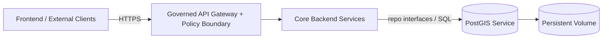

# PostGIS Overlays (Kustomize)


Environment-specific **Kustomize overlays** for deploying the **PostGIS** dependency (PostgreSQL + PostGIS)
as part of the Kansas Frontier Matrix (KFM) platform.

> **Trust membrane reminder:** PostGIS is an internal dependency.
> External clients and the frontend must not connect directly to PostGIS—access must be mediated by the governed API boundary.

---

## What lives here

This folder contains one subfolder per deploy environment (overlay). Each overlay:

- References the shared manifests in `../base/`
- Applies environment-specific patches:
  - storage class / PVC size
  - resource requests & limits
  - node selectors / tolerations (if used)
  - backup/restore configuration (if present)
  - network policy (if present)
  - image tags/digests (if pinned per env)

---

## Directory layout

```text
infra/
└─ apps/
   └─ dependencies/
      └─ postgis/
         ├─ base/
         │  ├─ kustomization.yaml
         │  └─ (statefulset|deployment, service, pvc, config, etc.)
         └─ overlays/
            ├─ dev/
            │  ├─ kustomization.yaml
            │  └─ patches/
            ├─ stage/
            │  ├─ kustomization.yaml
            │  └─ patches/
            ├─ prod/
            │  ├─ kustomization.yaml
            │  └─ patches/
            └─ README.md  ← you are here
```

> **Note:** The exact resources under `base/` (StatefulSet vs Operator CRs, PVC layout, etc.) are repo-defined.

---

## Quick start

### Render an overlay (no apply)

```bash
# from repo root
kubectl kustomize infra/apps/dependencies/postgis/overlays/dev
```

### Apply an overlay (kubectl)

```bash
kubectl apply -k infra/apps/dependencies/postgis/overlays/dev
```

### Validate what would change

```bash
kubectl diff -k infra/apps/dependencies/postgis/overlays/dev
```

---

## Overlay expectations

### Minimum per overlay

Each overlay directory should include:

- `kustomization.yaml` pointing to `../../base`
- Patches for:
  - PVC size (or StorageClass parameters)
  - CPU/memory requests and limits
  - Secret references (NO plaintext credentials committed)
- A namespace decision:
  - either `namespace:` in `kustomization.yaml`, or
  - the namespace is applied upstream (e.g., Argo CD Application / OpenShift GitOps)

### Environment matrix

| Overlay | Primary intent | Data persistence | Backup posture |
|---|---|---:|---|
| `dev/` | rapid iteration, low-risk | persistent (small) | optional / best-effort |
| `stage/` | pre-prod validation | persistent (medium) | recommended |
| `prod/` | production | persistent (large) | required |

---

## Secrets & credentials

**Never** commit database passwords or connection strings in Git.

Recommended patterns (choose one consistent pattern for the repo):

- External Secrets Operator (ESO) / cloud secret manager
- SealedSecrets (Bitnami)
- SOPS-encrypted secrets (age/pgp)

Minimum requirement:

- overlays reference **Secret names/keys** (e.g., `POSTGRES_PASSWORD` via `envFrom.secretRef` or `valueFrom.secretKeyRef`)
- secret material is provided out-of-band via approved tooling and audited processes

---

## Network & access model

PostGIS should normally be exposed as **ClusterIP only** (internal service). Avoid:

- Ingress / Routes to the database
- NodePort / LoadBalancer access for PostGIS

Prefer a controlled dependency graph:



If your cluster supports NetworkPolicy, constrain ingress to PostGIS to only the namespaces/pods that need it.

---

## PostGIS enablement & upgrades

### Extension enablement

PostGIS is an extension that must be enabled per database. In Kubernetes deployments this is usually handled by:

- an init SQL script (e.g., mounted into `docker-entrypoint-initdb.d/`), **or**
- operator-supported bootstrap SQL

⚠️ **Important operational gotcha:** init scripts only run on first initialization of an empty data directory. If a PVC already
contains a database, updating init scripts will not re-run them.

### Upgrades

Treat upgrades as governed change events (ticket + PR + runbook + rollback plan). At minimum:

- take a backup/snapshot
- test the target version in `stage/`
- validate extension versions and application compatibility
- document the upgrade path and any required migration SQL

---

## Governance notes (KFM)

- **Trust membrane:** PostGIS is a backend dependency; access is mediated via governed services/APIs.
- **Sensitive locations:** if data contains sensitive coordinates, store generalized geometry and a sensitivity flag according to KFM policy.
- **Auditability:** changes to overlays are production changes—require PR review and CI checks.

---

## Definition of Done (overlay change)

- [ ] `kubectl kustomize overlays/<env>` renders without errors
- [ ] `kubectl apply -k overlays/<env> --dry-run=server` succeeds (where supported)
- [ ] No plaintext secrets committed
- [ ] Storage changes reviewed (size/class/retention implications)
- [ ] Network exposure reviewed (no external DB exposure)
- [ ] Rollback plan documented for any version/storage change

---

## See also

- `../base/` – shared PostGIS manifests (source of truth)
- `../../../../docs/` – governance, runbooks, and architecture docs (repo-defined)