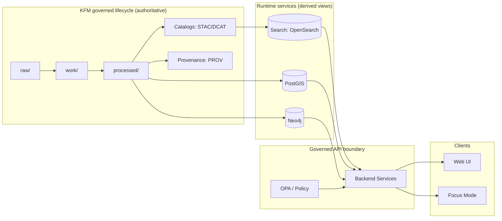

<!--
File: infra/apps/dependencies/search/README.md
Purpose: Governed, CI-friendly ops + integration notes for KFM Search dependency.
-->

# 🔎 Search (Dependency)


KFM’s **Search** dependency provides **full-text + hybrid retrieval** (keyword + vector) for:
- Unified search experiences (datasets, documents, story content)
- Focus Mode / RAG evidence retrieval (grounded context assembly)

> [!IMPORTANT]
> **Trust membrane rule:** The browser (and any external client) **must not** access Search directly.  
> Access is **only** via the governed API boundary (policy + auditing + redaction).  
> Search is a **derived index**, not a system-of-record.

---

## ✨ What lives here

This directory is the infrastructure “home” for the Search service implementation and its ops artifacts, typically:
- local dev runtime (Compose)
- k8s manifests / Helm values (prod/stage)
- configuration templates
- index bootstrap scripts (mappings/templates/aliases)
- backup/snapshot procedures

> [!NOTE]
> The exact set of files may evolve. This README documents the **expected contract** for this dependency so other layers can integrate safely.

---

## 🧭 Where Search fits in KFM



### ✅ System-of-record vs derived store
| Store | Role | Authoritative? | Mutation path |
|---|---|---:|---|
| PostGIS | spatial + tabular serving | ✅ | pipelines only |
| Neo4j | relationships / graph traversal | ✅ (for graph facts) | pipelines only |
| Search | text + hybrid retrieval acceleration | ❌ (derived) | **index rebuild** jobs only |

---

## 📁 Directory layout

> [!TIP]
> Keep this directory **self-contained**: an operator should be able to run Search locally and understand its production posture from *this* folder alone.

```text
infra/apps/dependencies/search/
├─ README.md                       # (this file)
├─ compose.yaml                    # (recommended) local single-node Search
├─ config/                         # OpenSearch config, templates, security (optional)
│  ├─ opensearch.yml
│  ├─ security/                    # certs/users/roles (optional)
│  └─ templates/                   # index templates + mappings (JSON)
├─ scripts/                        # bootstrap + ops helpers
│  ├─ init-indexes.sh
│  ├─ snapshot.sh
│  └─ restore.sh
└─ k8s/                            # prod/stage manifests or Helm/Kustomize
   ├─ base/
   └─ overlays/
```

If your repo uses a different infra structure (Helm-only, Kustomize-only, etc.), keep the *intent* the same and adjust the tree.

---

## 🚀 Local dev quickstart

### Option A — run from the root KFM Compose stack
If the repo’s root Compose file defines an `opensearch` service, you can start only that dependency:

```bash
docker compose up -d opensearch
```

### Option B — run Search standalone from this folder
If `compose.yaml` exists here:

```bash
docker compose -f infra/apps/dependencies/search/compose.yaml up -d
```

### Health check

```bash
curl -s http://localhost:9200/_cluster/health?pretty
```

Expected: `"status" : "green"` or `"yellow"` (yellow is common for single-node with replicas > 0).

---

## 🔌 Network + ports

| Component | Default port(s) | Notes |
|---|---:|---|
| OpenSearch REST | `9200` | API + health + indexing |
| OpenSearch Dashboards (optional) | `5601` | Only for operators (never public by default) |

> [!WARNING]
> Do **not** expose OpenSearch publicly. In production, it should be reachable only from the API/indexer network.

---

## ⚙️ Configuration contract

### Service name contract (internal networking)
Use a consistent service DNS name so app config stays stable across environments:

- **Service name:** `opensearch`
- **Base URL (internal):** `http://opensearch:9200`

### Environment variables expected by the API (recommended contract)
> These are the stable knobs other layers should depend on. If you already have a different naming scheme, document it here and provide a compatibility shim.

| Variable | Meaning | Example |
|---|---|---|
| `KFM_SEARCH_URL` | Search base URL | `http://opensearch:9200` |
| `KFM_SEARCH_USER` | Username (if auth enabled) | `admin` |
| `KFM_SEARCH_PASSWORD` | Password (if auth enabled) | `…` |
| `KFM_SEARCH_INDEX_PREFIX` | Namespacing for indexes | `kfm` |
| `KFM_SEARCH_MODE` | `dev` \| `prod` toggles | `dev` |

> [!NOTE]
> Auth/TLS may be disabled in local dev, enabled in prod. Keep the **API contract** stable.

---

## 🧱 Index model

Search must support:
- **keyword search** (documents + catalog metadata + story content)
- **filters** (theme, dataset, time range, bbox, sensitivity class)
- **semantic retrieval** via embeddings (vector similarity), for Focus Mode

### Document “envelope” fields (minimum)
All indexed documents SHOULD carry these governance and traceability fields:

| Field | Type | Why it exists |
|---|---|---|
| `kfm_id` | keyword | stable KFM ID for dedupe |
| `kind` | keyword | `dataset` / `document` / `story_node` / `entity` |
| `title` | text | display + ranking |
| `body` | text | full-text match |
| `keywords` | keyword[] | facets + boosting |
| `time_start`, `time_end` | date | temporal filter |
| `bbox` | float[4] | spatial filter (coarse) |
| `geom` | geo_shape (optional) | spatial filter (precise) |
| `sensitivity` | keyword | policy filtering |
| `license` | keyword | reuse constraints |
| `provenance_ref` | keyword | pointer to PROV bundle/receipt |
| `artifact_ref` | keyword | pointer to processed artifact |

> [!IMPORTANT]
> **No “mystery documents.”** If a record cannot be tied back to a catalog/provenance reference, it should not be indexed (or should be indexed into a quarantine index that is never served).

### Vector fields (optional but recommended)
If you unify text + vectors in OpenSearch, use one or more fields like:
- `embedding_title`
- `embedding_body`

> [!NOTE]
> Exact vector field types and kNN settings are implementation-specific. The contract requirement is: **Focus Mode can retrieve semantically related snippets** and return provenance pointers for each snippet.

---

## 🔁 Index lifecycle & rebuilds

### Rebuild-only posture
Search indexes are **rebuildable derived products**:
- Built from **processed artifacts** + **catalogs** + **provenance**
- Rebuilt on ingestion promotion events (raw→work→processed→serve)

### Recommended approach: versioned indexes + aliases
- Write into a new versioned index: `kfm-docs-vYYYYMMDDHHMMSS`
- Validate mapping + sample queries
- Atomically swap alias: `kfm-docs-current` → new index
- Retain N previous versions for rollback

> [!TIP]
> Alias swaps are the simplest way to do “zero downtime” index rollouts.

---

## 🛡️ Governance and sensitivity handling

Search is an accelerator, not an authority.

### Policy enforcement location
- Policy decisions (RBAC, sensitivity redaction, cite-or-abstain) belong in the **API boundary** (OPA + service logic).
- Search should be treated as **untrusted input**: results must be filtered/validated before returning to clients.

### Sensitive content
If content is sensitive:
- Prefer **not indexing** raw sensitive text at all.
- If indexing is necessary for internal workflows, store only:
  - redacted text, and/or
  - coarse-grained metadata, and/or
  - hashed tokens, and/or
  - pointers to secure evidence stores

> [!WARNING]
> Indexing sensitive full text makes it easy to accidentally leak through “highlighting”, snippets, or logs.

---

## 🧰 Ops runbook

<details>
<summary><strong>Snapshot / backup strategy (recommended)</strong></summary>

Even though Search is derived, snapshots are useful for:
- faster restore after cluster loss
- forensic debugging of retrieval drift
- rollback safety

Recommended:
- nightly snapshots to object storage
- retention policy aligned with audit requirements
- periodic restore test in non-prod

</details>

<details>
<summary><strong>Scaling guidance (high-level)</strong></summary>

- Start single-node for dev.
- For prod: multi-node with dedicated storage + resource limits.
- Keep Search on a private network; expose only via internal services.

</details>

---

## 🧪 Troubleshooting

### Port already in use
If `9200` is occupied:
- stop the conflicting process, or
- remap host port in Compose (`"19200:9200"`), keeping **container port** `9200`.

### Cluster status is yellow
Often means replicas cannot be allocated on a single node.
- Either accept yellow in dev, or
- set replicas to 0 for dev templates.

### “No results” but docs exist
Common causes:
- index rebuild not triggered after ingestion promotion
- alias points at an old index
- API is filtering results (policy/sensitivity) — check audit logs

---

## ✅ Definition of Done

- [ ] Search starts locally and passes `_cluster/health`
- [ ] API can query Search via internal service name (`opensearch:9200`)
- [ ] Index templates/mappings are versioned and reproducible
- [ ] Rebuild process produces a receipt (index name, commit, artifact refs)
- [ ] Alias-based rollout documented and tested
- [ ] No direct Search access from UI (enforced by network policy / routing)
- [ ] Sensitivity + provenance fields exist for all served documents
- [ ] Basic ops notes exist (backup/restore, troubleshooting)

---

## 📎 Notes for maintainers

- This README is a governed artifact: changes that affect runtime behavior should be treated like production changes.
- If implementation drifts from this contract, update either:
  1) the implementation to match, or  
  2) this README + relevant API contracts to match reality.
