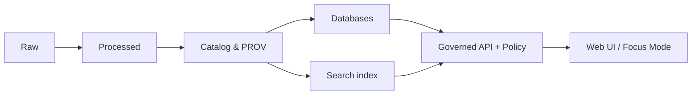

# Search dependency config


This folder documents and contains the **deployment-time configuration** for the KFM **Search** dependency (full‑text retrieval and, where supported, vector retrieval).

It is intentionally **infra-scoped**: it describes *how the search service is deployed and configured* — not the higher-level “Search & DRIFT” product semantics.

---

## Non-negotiables

> [!IMPORTANT]
> **Trust membrane:** the Web UI, external clients, and analysts must **not** connect to the search service directly.  
> All reads flow through the governed API + policy boundary, which enforces access rules, redaction, and citation binding.

> [!WARNING]
> **Search is not a source of truth.** Search indexes are derived, rebuildable views.  
> Canonical truth lives in KFM’s governed datasets, catalogs, and databases.

> [!TIP]
> Treat this folder like production code. Config changes can silently alter what the public sees.

---

## Folder context

```text
repo-root/
└─ infra/
   └─ apps/
      └─ dependencies/
         └─ search/
            └─ config/
               ├─ README.md        ← you are here
               └─ …               ← engine config, templates, policies, overlays
```

---

## What belongs here

| Category | Typical contents | Why it exists |
|---|---|---|
| Engine configuration | ConfigMaps / YAML for the search engine runtime | Cluster settings, analyzers, plugins |
| Deployment overlays | Environment-specific values (dev/stage/prod) | Reproducible deploys per environment |
| Index templates | JSON templates and mappings | Deterministic schema + versioning |
| Ingest pipelines | Normalizers, processors, analyzers | Consistent indexing behavior |
| Security hardening | TLS settings, role bindings, network policy snippets | Reduce blast radius; lock down access |
| Ops configuration | snapshots/backup, disk watermarks, JVM options, resources | Stability and predictability |

---

## What does not belong here

| Category | Put it here instead |
|---|---|
| Search UX / query grammar | UI repo area (not infra) |
| DRIFT templates, HyDE, retrieval episode rules | `docs/search/drift/*` (governed docs) |
| Domain entity models | Domain layer packages (pure, no infra dependencies) |
| Policy-as-code source of truth | `policy/` packages (OPA/Rego), referenced by API |

---

## Expected config layout

This repo may evolve, but the intent is to keep a stable mental model:

```text
config/
├─ engine/
│  ├─ <engine>.yml                 # e.g., opensearch.yml or elasticsearch.yml
│  └─ jvm.options                  # if applicable
├─ values/
│  ├─ dev.yaml                     # dev overrides
│  ├─ stage.yaml                   # staging overrides
│  └─ prod.yaml                    # prod overrides
├─ index-templates/
│  ├─ kfm-docs.template.json       # unstructured docs / narratives
│  ├─ kfm-metadata.template.json   # catalog-ish search facets
│  └─ kfm-entities.template.json   # entity-like projections (optional)
├─ ingest-pipelines/
│  ├─ normalize-text.json
│  └─ extract-geo.json
└─ security/
   ├─ roles.yml
   └─ role-mappings.yml
```

> [!NOTE]
> If the concrete engine or deployment mechanism differs, keep the **sections** and replace the filenames — the governance intent stays the same.

---

## Engine selection

KFM architecture documents describe a **full‑text search index** and a **vector index** used for semantic similarity. The full‑text engine is typically Lucene-based (Elasticsearch/OpenSearch class), and vector search may be implemented in the same engine or a separate store depending on ops constraints.

Practical implications for config:

- **Text analyzers matter** (tokenization, stemming, stopwords) because they change recall/precision.
- **Vector configuration matters** (dimension, similarity, index type, refresh) because it changes retrieval quality and cost.
- **Schema versioning must be explicit** to avoid “silent breaking changes”.

---

## Required invariants for KFM governance

These invariants keep the platform evidence-first and policy-safe.

### Provenance pointers must survive indexing

Index templates should preserve identifiers that allow the API to bind results back to governed evidence, such as:

- dataset identifiers and dataset version identifiers
- source record identifiers or asset identifiers
- policy labels used for allow/deny + redaction
- stable document IDs used by citations

> [!IMPORTANT]
> If a field is required for citations or redaction, it must be present in the index (or derivable by deterministic join).

### Sensitivity and redaction must be enforced

Indexing must respect KFM sensitivity labels. In practice:

- Do **not** index restricted fields into public-facing indices.
- For sensitive-location content, index generalized representations (coarse geometry, bounding boxes, or redacted text as appropriate).
- Avoid leaking sensitive details through vector embeddings or analyzer artifacts.

---

## Deployment model

This folder is meant to support **GitOps-style deploys**:

1. Change config in a PR.
2. CI validates the manifests and policy constraints.
3. GitOps sync applies changes.
4. A controlled reindex occurs if a schema/template change requires it.

### Local development

A local setup should make it easy to:

- run the search engine
- load index templates
- run a small, deterministic fixture indexing job
- run a few smoke queries

Keep local data disposable: dev indexes are rebuildable and should not contain sensitive artifacts.

---

## Index lifecycle

### When does reindex happen

Reindex (or refresh) is expected when:

- new text artifacts are published
- new catalog records are promoted
- mappings or templates change
- analyzers change

> [!WARNING]
> Changing analyzers or mappings is effectively a schema migration.  
> Plan it like a production change: version it, reindex it, validate it.

### Recommended index versioning

Use an explicit schema version in index names or aliases, for example:

- `kfm-docs-v1` (current), `kfm-docs-v2` (new)
- `kfm-docs` alias points to the current active version

This enables rollback-first upgrades.

---

## Security and operations hardening checklist

> [!CHECKLIST]
> Minimum operational requirements for production.

- [ ] No public ingress to the search service
- [ ] Network policies restrict access to the API namespace only
- [ ] TLS enabled for in-cluster traffic where supported
- [ ] Auth enabled (service account / basic auth / mTLS) and credentials never committed
- [ ] Resource requests and limits set
- [ ] Persistent volumes sized for expected shard growth
- [ ] Snapshot/backup configured if the engine uses persistent data
- [ ] Dashboards and admin tooling are restricted to operators only

---

## Validation gates for config changes

These are the “do not merge” gates recommended for this folder:

- YAML validity + formatting
- Kubernetes schema validation (kubeconform / equivalent)
- Helm lint or Kustomize build success (whichever this repo uses)
- Policy checks (Conftest/OPA) for:
  - no public exposure
  - no privileged pods
  - no plaintext secrets
  - resource constraints present
- Smoke test: create templates + index a small fixture corpus + query

---

## Related governed docs and runbooks

These are the places that define *behavior* beyond infra wiring:

- `docs/search/README.md`
- `docs/search/drift/README.md`
- `docs/search/drift/examples/README.md`
- `docs/security/*` (prompt injection, supply chain, etc.)
- `docs/runbooks/*` (reindex procedures, rollback, incident response)

---

## Appendix: reference flow



> [!NOTE]
> This diagram is conceptual: it reflects the trust membrane pattern and the “truth path” sequencing.


