# Search Dependency — Security Configuration 🔐


This folder contains **security configuration for KFM’s search dependency** (commonly **OpenSearch/Elasticsearch-class** engines). It defines **how the search cluster authenticates callers, authorizes actions, and protects traffic** (TLS), while preserving the **KFM trust membrane**: **the search dependency is never a public API**.

> [!IMPORTANT]
> **Trust membrane rule:** external clients and the Web UI must not talk to search directly. Search is an internal dependency accessed only through the **Governed API Gateway + policy boundary**.

---

## Component metadata

| Field | Value |
|---|---|
| Component | `dependencies/search` |
| Folder | `infra/apps/dependencies/search/config/security/` |
| Layer | Infrastructure (dependency) |
| Posture | Governed • Evidence-first • Fail-closed |
| Secrets in Git | **Forbidden** |
| Change control | PR review + CI policy gates + security owner sign-off |

---

## Where this fits

```mermaid
flowchart LR
  U[User / Partner] --> UI[Web UI / Client]
  UI --> GW[Governed API Gateway<br/>Auth • OPA Policy • Audit]
  GW -->|Repository port / adapter| S[(Search Dependency<br/>OpenSearch/Elasticsearch)]
  GW --> PG[(PostGIS)]
  GW --> N4[(Neo4j)]
  GW --> OBJ[(Object Store)]
  GW --> AUD[(Audit + Provenance)]
```



---

## Directory layout

```text
infra/
└── apps/
    └── dependencies/
        └── search/
            └── config/
                └── security/
                    ├── README.md                  # (this file)
                    ├── action_groups.yml          # action group definitions (recommended)
                    ├── roles.yml                  # least-privilege roles (recommended)
                    ├── roles_mapping.yml          # map users/backend roles -> roles (recommended)
                    ├── tenants.yml                # optional multi-tenancy (if enabled)
                    ├── config.yml                 # security plugin / authc / authz config (recommended)
                    ├── nodes_dn.yml               # node/admin DNs for TLS (if required)
                    └── internal_users.yml.example # example only — real file must be a Secret
```

> [!NOTE]
> File names vary slightly by search engine and plugin version. This layout reflects the **common “security plugin YAML bundle” pattern** for OpenSearch-class deployments. If your engine differs, keep the same intent and document the delta here.

---

## Non-negotiables

### 1) Search is **internal-only**
- Expose **only** the governed API to users/clients.
- Search service should be **ClusterIP-only** (or equivalent) and protected by **NetworkPolicies** allowing only KFM backend pods/namespaces.

### 2) Fail-closed access
- If auth/policy evaluation fails at the trust membrane, **deny**.
- If the search cluster cannot apply a known-good security config, **do not “fall back” to open access**.

### 3) No secrets in Git
- Do not commit:
  - passwords (even “temporary”)
  - TLS private keys
  - keystores
  - internal user hashes used for real environments

> [!WARNING]
> Treat “hashed passwords in YAML” as secrets. They are still credential material.

### 4) Least privilege by role
- Every caller uses a **dedicated identity**.
- Roles are scoped to:
  - index patterns (e.g., `kfm-*`)
  - verbs (read vs write)
  - admin operations (separate, rare)

---

## What belongs in this folder

| Artifact | Purpose | Safe to commit? | Recommended handling |
|---|---|---:|---|
| `roles.yml` | Define named roles w/ least-privilege permissions | ✅ | Keep reviewed + stable |
| `roles_mapping.yml` | Map identities/groups to roles | ✅ (usually) | Don’t map wildcard groups to admin |
| `action_groups.yml` | Reusable bundles of permissions | ✅ | Prefer to keep small + explicit |
| `config.yml` | Global security behavior (authc/authz), audit toggles | ✅ | Ensure defaults are deny/secure |
| `tenants.yml` | Optional multi-tenancy | ✅ | Only if you actually use tenants |
| `nodes_dn.yml` | Node/admin DNs for TLS | ⚠️ | Commit only if it doesn’t leak sensitive internal naming |
| `internal_users.yml` | Internal users + credential hashes | ❌ | Store in a Kubernetes Secret (or external vault) |
| TLS certs/keys | Transport/HTTP encryption | ❌ | Kubernetes Secret (or vault) |

---

## Access model

### Service identities (recommended)

| Caller | Typical responsibility | Search role | Allowed |
|---|---|---|---|
| `kfm-api` | Query shaping + redaction via trust membrane | `kfm_search_read` | read/search only |
| `kfm-ingest` / indexer | Write documents after dataset promotion | `kfm_search_write` | write to specific indices only |
| `kfm-admin` (break-glass) | Emergency ops | `kfm_search_admin` | narrow admin actions, time-bounded |
| `kfm-ci` (optional) | Validate templates/mappings | `kfm_search_ci` | manage templates/mappings only |

> [!IMPORTANT]
> **Humans do not query search directly** in the KFM model; they query via governed APIs that handle policy, audit, and provenance.

---

## Index naming & environment separation

Use **predictable index prefixes** so security rules remain understandable and enforceable:

- `kfm-public-*` — public-safe, redacted fields only
- `kfm-internal-*` — internal-only (still protected)
- `kfm-restricted-*` — restricted/sensitive (requires explicit governance posture)

**Never** place raw-zone content into search indices. Search is for **query-ready / governed derivatives** only.

---

## Deployment pattern (Kubernetes / OpenShift)

This repo assumes a **GitOps-friendly** pattern:

1. **ConfigMap** mounts the committed YAML bundle from this directory.
2. **Secret** holds credentials + TLS materials.
3. A **bootstrap/init Job** (or operator hook) applies the security bundle to the cluster.

### Recommended mounting split

- ConfigMap:
  - `roles.yml`
  - `roles_mapping.yml`
  - `action_groups.yml`
  - `config.yml`
  - `tenants.yml` (if used)
  - `nodes_dn.yml` (if used)

- Secret:
  - `internal_users.yml` (real)
  - TLS `*.key`, `*.pem`, keystores, etc.

---

## Local development

A common local stack includes `opensearch` plus `opa` and KFM services. Prefer:
- keeping security **enabled** even in dev (closest-to-prod),
- but allowing a **temporary** dev-only override if you are debugging.

> [!WARNING]
> If you disable search security locally, do not commit those settings, and do not ship them to shared dev/test/prod.

---

## CI policy gates (recommended)

Security config changes are **production changes**. Add a policy gate that fails the PR if any of the following occur:

- anonymous auth enabled
- demo certificates or demo users configured for non-dev overlays
- “admin” role mapped to broad groups/users
- wildcard index permissions for write roles
- `internal_users.yml` (real) is added to git
- security config references missing secrets

### Minimal Definition of Done ✅

- [ ] Security YAML bundle validates (YAML parse + schema where available)
- [ ] No secrets committed (secret-scan + allowlist where needed)
- [ ] NetworkPolicy present (search is internal-only)
- [ ] Roles are least-privilege and reviewed
- [ ] A rollback plan exists (re-apply last known-good bundle)

---

## Change management & rollback

> [!IMPORTANT]
> A “simple role change” can change what is discoverable and thus what can be narrated. Treat changes here as governance-impacting.

**Rollback strategy:**
- Maintain a “last known-good” bundle (Git revision).
- Applying the prior bundle should be a single, deterministic action in GitOps.

---

## Pointers to related KFM docs

These are the *conceptual* docs that explain search, retrieval, and governance behavior (recommended reading):

- `docs/search/README.md`
- `docs/search/drift/README.md`
- `docs/security/*` (supply-chain, advisories, prompt-injection mitigation, etc.)

> [!NOTE]
> If those paths do not exist in your working tree, treat this list as a documentation TODO and align it with your repo’s current doc map.

---

## Security review checklist (quick)

- [ ] Search has **no public ingress/route**
- [ ] TLS enabled for inter-node + client traffic
- [ ] Dedicated identities for API vs ingest vs admin
- [ ] No raw/sensitive fields indexed
- [ ] Audit logs enabled at least for auth failures (and ideally key actions)
- [ ] CI gate prevents insecure drift

