# 🔎 Search Dependency — Kubernetes Manifests

🏷️ **Status:** Draft (governed artifact)  
🏗️ **Layer:** `infra/apps/dependencies/search/k8s`  
🔐 **Default exposure:** cluster-internal only (no public ingress)  
🧩 **Engine:** Elasticsearch / OpenSearch *(not confirmed in repo — treat as swappable)*

This directory is intended to hold Kubernetes manifests for KFM’s **Search** dependency:
- **Full‑text search** over unstructured artifacts (documents, narrative content, dataset descriptions, transcripts, etc.).
- **Optional semantic retrieval** (vector search) if the chosen engine supports it, or if paired with a separate vector store.

> [!IMPORTANT]
> In KFM, search is a **derived index** — not the “system of record.”  
> PostGIS/graph/object storage + catalogs/provenance remain authoritative; search is rebuilt/refreshed from governed, policy‑checked derivatives.

---

## What “Search” does in KFM

KFM’s design calls for:
- a **keyword (full‑text) index** to support fast lookup across text artifacts, and
- a **vector index** to support semantic similarity retrieval (useful for Focus Mode evidence gathering).

> [!NOTE]
> The exact technology choice is intentionally left open here. KFM design notes reference Elasticsearch/OpenSearch as plausible full‑text engines and mention FAISS/Annoy as possible vector backends; this folder stays **engine‑agnostic** until the repo declares a final selection.

---

## Trust membrane and governance boundary

KFM’s trust membrane rules apply here:

- **Frontend and external clients must never access Search directly.**  
  Search is reachable only from governed backend services (API / pipeline workers) inside the cluster.

- **Policy labels + redaction must be applied before indexing.**  
  The pipeline’s publish step updates catalogs/provenance and triggers index refresh; indexing must not bypass governance.

> [!CAUTION]
> “Sensitive-location” and other restricted data must not be indexed at full precision unless policy explicitly permits it. Prefer “fail‑closed” defaults.

---

## Reference architecture (conceptual)

```mermaid
flowchart LR
  subgraph Sources[Raw Sources]
    A[Files/APIs/Scans]
  end

  subgraph Pipeline[Ingestion & Processing]
    B[Raw → Work → Processed]
    C[Validation + Policy Checks]
    D[Catalogs: DCAT/STAC/PROV]
  end

  subgraph Stores[Authoritative Stores]
    E[(Object Store)]
    F[(PostGIS)]
    G[(Graph DB)]
  end

  subgraph Search[Derived Index]
    H[(Search Index)]
  end

  subgraph API[Governed API Boundary]
    I[API / Services]
  end

  subgraph UI[Clients]
    J[UI / Focus Mode]
  end

  A --> B --> C --> D
  B --> E
  B --> F
  B --> G
  D --> H
  I --> H
  I --> F
  I --> G
  J --> I
```



---

## Directory layout

> [!TIP]
> If you’re using GitOps (Argo CD / Flux) and Kustomize, the following layout is recommended.  
> If you’re using Helm or raw YAML, adapt accordingly — keep the same *governance intent*.

```text
infra/
└─ apps/
   └─ dependencies/
      └─ search/
         └─ k8s/
            ├─ README.md
            ├─ base/                  # Engine-agnostic core (recommended)
            │  ├─ namespace.yaml
            │  ├─ service.yaml
            │  ├─ statefulset.yaml    # or operator CRs if using an operator
            │  ├─ configmap.yaml
            │  ├─ networkpolicy.yaml
            │  ├─ pdb.yaml
            │  └─ kustomization.yaml
            └─ overlays/              # Environment-specific patches (recommended)
               ├─ dev/
               │  ├─ kustomization.yaml
               │  └─ patch-resources.yaml
               └─ prod/
                  ├─ kustomization.yaml
                  ├─ patch-ha.yaml
                  └─ patch-storage.yaml
```

---

## Deployment

### Option A — Kustomize (recommended for GitOps-friendly repos)

```bash
# dev
kubectl apply -k infra/apps/dependencies/search/k8s/overlays/dev

# prod
kubectl apply -k infra/apps/dependencies/search/k8s/overlays/prod
```

### Option B — Plain YAML (if not using Kustomize)

```bash
kubectl apply -f infra/apps/dependencies/search/k8s/base
```

> [!IMPORTANT]
> If you add/rename overlays, update this README and ensure link-check/lint rules still pass.

---

## Required configuration inputs

| Concern | What to decide | Why it matters |
|---|---|---|
| Namespace | `kfm-deps` / `kfm-search` *(your choice)* | Isolates dependency RBAC + policies |
| Persistence | StorageClass + PVC sizing | Search indices need durable storage |
| Auth | Admin/user creds via Secret | Prevents anonymous writes/reads |
| Exposure | ClusterIP + NetworkPolicy | Enforces trust membrane |
| Resources | CPU/mem requests/limits | Prevent noisy-neighbor failures |
| Backups | Snapshot strategy | Faster recovery vs. full rebuild |
| Indexing policy | Fields allowed in index | Avoids leaking restricted info |

---

## Security baseline

### Secrets handling
- **Do not commit plaintext Secrets.** Use a sealed/encrypted mechanism or external secret manager reference.
- Rotate credentials on a schedule; treat admin creds as break-glass only.

### NetworkPolicy baseline
- Default deny ingress to Search.
- Allow ingress only from:
  - KFM backend API pods (governed access)
  - pipeline/indexer workers (publish/index refresh)
- Deny egress to the internet unless explicitly required (usually not).

### Pod security baseline
- Prefer `runAsNonRoot`, drop Linux capabilities, read-only root FS where feasible.
- Avoid privileged pods; Search should not require host networking.

---

## Indexing and governance rules

> [!IMPORTANT]
> Index refresh is triggered from the **Publish** step of the ingestion workflow (after validation + catalog/provenance updates).  
> Search should index only what has passed: schema validation, license checks, and policy/redaction gates.

**Recommended practice:**
- Index only **policy-approved derivatives**.
- Keep index documents “evidence-addressable”:
  - stable IDs for artifacts/records
  - pointers to dataset versions + provenance bundle hash
- Treat search as *rebuildable cache*:
  - rebuild from processed artifacts + catalogs if corruption occurs.

---

## Operations runbook (minimal)

### Health & status
```bash
kubectl get pods -n <namespace>
kubectl get svc  -n <namespace>
kubectl describe pod <pod> -n <namespace>
kubectl logs <pod> -n <namespace> --tail=200
```

### Safe restart (rollout)
```bash
kubectl rollout restart statefulset/<name> -n <namespace>
kubectl rollout status  statefulset/<name> -n <namespace>
```

### Storage checks
```bash
kubectl get pvc -n <namespace>
kubectl describe pvc <pvc> -n <namespace>
```

### Reindex / rebuild (conceptual)
1. Confirm authoritative data is intact (Processed + catalogs/prov).
2. Quiesce indexer jobs (pause publish-triggered indexing).
3. Rebuild indices from governed derivatives.
4. Re-enable index refresh triggers.

> [!CAUTION]
> Never “fix” policy leaks by hot-editing the index alone.  
> Fix the pipeline/redaction + reindex so provenance remains truthful.

---

## Validation gates for this dependency

Use this as the Definition of Done checklist for adding/updating manifests here:

- [ ] Search is **not publicly exposed** (no Ingress/Route by default).
- [ ] NetworkPolicy restricts access to **only** approved namespaces/pods.
- [ ] Persistent storage is configured; PVCs bind successfully.
- [ ] Secrets are not committed in plaintext; rotation plan documented.
- [ ] Resource requests/limits set; pod disruption budget defined (where applicable).
- [ ] Indexing path consumes **policy-checked derivatives** only.
- [ ] A “rebuild from source-of-truth” path is documented and tested in at least one environment.
- [ ] README updated; CI markdown lint + link-check pass.

---

## Open questions (needs repo decision)

- [ ] Which engine is the official KFM standard here: **OpenSearch** or **Elasticsearch**?
- [ ] Is vector search handled inside the same engine, or via a separate dependency?
- [ ] Operator vs. raw StatefulSet: do we adopt an operator for lifecycle management?
- [ ] Snapshot/restore approach: storage snapshots, repository-based snapshots, or rebuild-only?
- [ ] Namespace conventions for dependencies (`kfm-deps` vs per-service namespaces)?

---

## Provenance and design references

- KFM concept: Search + vector index supports retrieval across documents/narratives and semantic similarity for evidence gathering (design notes).
- KFM governance: publish step triggers index refresh only after validation and catalog/provenance updates; policy labels include `public | restricted | sensitive-location`.
- KFM trust membrane: UI never touches data stores (including search) directly; access is mediated through governed APIs/adapters.

