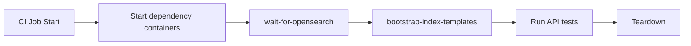

# Search Dependency Scripts (OpenSearch)


> [!NOTE]
> This folder contains operational scripts for managing KFM’s *search dependency* (OpenSearch) in **local dev**, **CI**, and **admin-only maintenance**.
> The search index is a *derived* store; KFM’s source-of-truth remains in governed datasets, catalogs (DCAT/STAC/PROV), and primary databases (PostGIS/Neo4j).

## What this supports

KFM maintains:
- **Full-text search** for unstructured text (documents, narrative content, transcripts, dataset descriptions).
- **Vector/semantic search** (either in OpenSearch itself or in a separate vector store — depending on the deployment).

These indices back:
- the API’s unified search endpoints (e.g., `/api/v1/search?...`)
- Focus Mode retrieval (documents + semantic similarity)
- internal indexing workflows triggered after “Publish / Promote” steps in the pipeline.

## Trust membrane & governance (non-negotiable)

> [!IMPORTANT]
> External clients and the web UI **must not** query OpenSearch directly.
> All search access goes through the governed API boundary (authz + policy + redaction + provenance).

Operational scripts are allowed to touch OpenSearch directly **only** when:
- bootstrapping dev/CI infrastructure (creating templates, indices)
- controlled maintenance work by maintainers
- and the operation is logged/audited (see “Audit & provenance”).

## Directory layout

```text
infra/apps/dependencies/search/
└── scripts/
    ├── README.md                 # you are here
    ├── <script_1>                # e.g., health check / wait-for
    ├── <script_2>                # e.g., bootstrap templates/mappings
    └── ...                       # keep script inventory updated below
```

> [!TIP]
> Keep scripts small, composable, and idempotent. Prefer “create-or-update” semantics over “delete-and-recreate”.

## Prerequisites

### Local dev dependency (Docker Compose)

The KFM dev compose baseline includes an `opensearch` service similar to:

- Image: `opensearchproject/opensearch:2`
- Mode: `discovery.type: single-node`
- Port: `9200:9200`

If your repo uses a different engine (Elasticsearch, Solr) or port, update the defaults below.

### Tools

- `bash` (or POSIX shell)
- `curl`
- `jq` (recommended)
- `docker` / `docker compose` (or Podman equivalents)

## Configuration

Scripts should read configuration from environment variables (12‑factor style).

| Variable | Default | Meaning |
|---|---:|---|
| `OPENSEARCH_URL` | `http://localhost:9200` | Base URL for OpenSearch (set `https://...` if secured) |
| `OPENSEARCH_USER` | *(empty)* | Optional basic auth username |
| `OPENSEARCH_PASSWORD` | *(empty)* | Optional basic auth password |
| `OPENSEARCH_INSECURE_TLS` | `0` | If `1`, pass `-k` to curl for dev-only self-signed certs |
| `KFM_ENV` | `dev` | Environment name (`dev`/`ci`/`staging`/`prod`) |
| `KFM_SEARCH_INDEX_PREFIX` | `kfm-${KFM_ENV}-` | Index naming prefix |
| `KFM_ALLOW_DESTRUCTIVE` | `0` | Must be set to `1` for delete/overwrite operations |

> [!WARNING]
> Never run destructive scripts against shared or production clusters unless the org’s governance process explicitly approves it.

## Script inventory

> [!NOTE]
> Add a row for every script in this folder. Scripts should support `--help` and should clearly declare whether they are *read-only* or *destructive*.

| Script | Safety | Purpose | Typical usage |
|---|---|---|---|
| `wait-for-opensearch.sh` | ✅ read-only | Block until OpenSearch is reachable and “ready” | `./wait-for-opensearch.sh` |
| `healthcheck.sh` | ✅ read-only | Print cluster health summary and exit non‑zero on unhealthy | `./healthcheck.sh` |
| `bootstrap-index-templates.sh` | ⚠️ writes | Create/update index templates, analyzers, mappings | `./bootstrap-index-templates.sh` |
| `create-aliases.sh` | ⚠️ writes | Ensure standard aliases (e.g., “active” indices) exist | `./create-aliases.sh` |
| `reindex-all.sh` | ⚠️ writes / heavy | Rebuild indices from governed sources via API or export snapshots | `./reindex-all.sh` |
| `delete-indices.sh` | 🧨 destructive | Delete indices matching prefix (requires `KFM_ALLOW_DESTRUCTIVE=1`) | `KFM_ALLOW_DESTRUCTIVE=1 ./delete-indices.sh` |

## Recommended workflows

### 1) Bootstrapping local dev

```bash
# from repo root
docker compose up -d opensearch

# wait until ready
./infra/apps/dependencies/search/scripts/wait-for-opensearch.sh

# bootstrap templates/mappings (idempotent)
./infra/apps/dependencies/search/scripts/bootstrap-index-templates.sh

# quick smoke test
./infra/apps/dependencies/search/scripts/healthcheck.sh
```

### 2) CI pre-test step

Typical CI flow:

1. Bring up dependency services (OpenSearch, PostGIS, Neo4j, OPA)
2. Wait for readiness
3. Bootstrap indices/templates
4. Run API + integration tests



### 3) Reindex after publishing new governed content

The KFM pipeline’s “Publish” step updates catalogs (DCAT/STAC/PROV) and triggers refresh of downstream indices (search/graph). For production, prefer running reindex via a governed job (CronJob/Workflow) rather than ad-hoc from a laptop.

> [!IMPORTANT]
> Indexing should only ingest *published* / *promoted* artifacts that have passed validation gates and have complete provenance chains.

## Audit & provenance

Because the search index is a derived store, every script that writes to OpenSearch should emit an audit record.

Minimum fields (recommended):

```json
{
  "run_id": "uuid",
  "ts_start": "ISO-8601",
  "ts_end": "ISO-8601",
  "actor": "user/service",
  "kfm_env": "dev|ci|staging|prod",
  "opensearch_url": "…",
  "operation": "bootstrap|reindex|delete|…",
  "index_prefix": "kfm-dev-",
  "inputs": {
    "dataset_version_ids": [],
    "catalog_versions": []
  },
  "outputs": {
    "indices_touched": [],
    "documents_indexed": 0
  },
  "status": "success|failure",
  "error": null
}
```

Store audit logs where your governance program expects them (e.g., append-only table or object storage ledger).

## Troubleshooting

<details>
<summary><strong>OpenSearch won’t start / keeps crashing</strong></summary>

- Ensure Docker has enough memory (OpenSearch is memory-hungry).
- Check port conflicts on `9200`.
- Review container logs:

```bash
docker compose logs -f opensearch
```

</details>

<details>
<summary><strong>401/403 errors from curl</strong></summary>

- Your cluster likely has security enabled.
- Set `OPENSEARCH_USER` / `OPENSEARCH_PASSWORD` (and possibly `OPENSEARCH_INSECURE_TLS=1` if using dev certs).

</details>

<details>
<summary><strong>Search results missing newly published content</strong></summary>

- Verify the dataset was promoted/published (catalog updated).
- Run your reindex workflow (preferably via the governed job runner).
- Confirm the API is querying the correct alias/index prefix for the environment.

</details>

## Contributing / changing scripts

### Guardrails

- ✅ Idempotent by default
- ✅ Support `--help`
- ✅ “Read-only” scripts must never mutate state
- ✅ “Destructive” scripts must require `KFM_ALLOW_DESTRUCTIVE=1`
- ✅ Log every write operation (audit record)
- ✅ Never embed secrets (use `.env`, vault, or CI secrets)

### Definition of Done

- [ ] Script has unit-style shell checks (ShellCheck or equivalent)
- [ ] Script documented in the inventory table
- [ ] Script logs an audit record for write operations
- [ ] CI job uses `wait-for-opensearch` before calling write scripts
- [ ] Any new index fields include provenance/sensitivity metadata as required by policy

## References

- KFM Data Source Integration Blueprint (Publish → catalogs + index refresh)
- KFM Comprehensive Technical Blueprint (trust membrane; API search endpoints)
- KFM Blueprint & Ideas (OpenSearch dependency; full-text + vector index context)