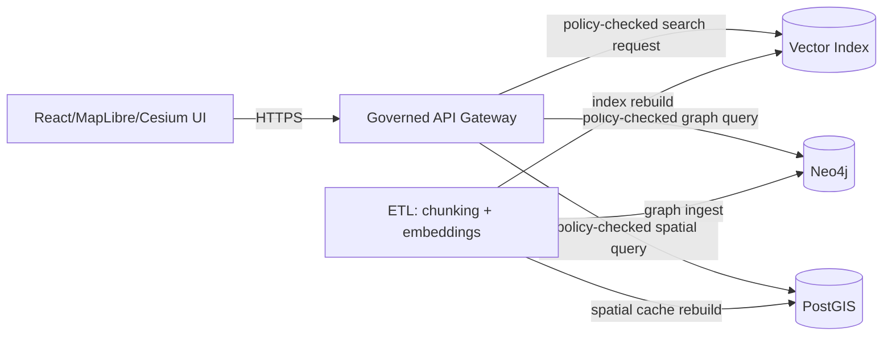

# 🧠 Vector Dependency (Semantic Retrieval Index)


> [!IMPORTANT]
> This folder documents the **semantic “vector index” dependency** used for **embeddings-based retrieval** (Focus Mode / search evidence).
> It is **not** about geospatial **vector data formats** (GeoJSON) or **vector tiles** (MVT/PMTiles).  
> If you intended “vector tiles,” create a separate dependency folder (e.g., `infra/apps/dependencies/tiles/`) and rename this one.

---

## Why this exists

KFM’s Focus Mode retrieval flow includes a **document/text query step** that performs **semantic search** using **vector similarity** (often alongside keyword search) to fetch *evidence snippets* used to ground answers with citations.  [oai_citation:3‡KFM-Bluprint-&-Ideas.pdf](sediment://file_000000004e9c71f598d3d784f6a13c46)

KFM documentation describes the platform maintaining:

- a **full-text index** (technology like **Elasticsearch/OpenSearch**) for keyword retrieval, and
- a **vector index** (embeddings) for semantic similarity retrieval, underpinning Focus Mode’s ability to fetch contextually relevant passages.  [oai_citation:4‡KFM-Bluprint-&-Ideas.pdf](sediment://file_000000004e9c71f598d3d784f6a13c46)

KFM also treats query stores as **rebuildable accelerators** rather than the source of truth; e.g., PostGIS is described as a *query accelerator* while authoritative data remains in `data/processed/`. Apply the same operational posture to the vector index: treat it as **derived** and **rebuildable**.  [oai_citation:5‡KFM-Bluprint-&-Ideas.pdf](sediment://file_000000004e9c71f598d3d784f6a13c46)

---

## Trust membrane and access pattern

KFM’s **trust membrane** is non-negotiable: **UI/external clients never access databases directly**; all access is via the governed API + policy boundary.  [oai_citation:6‡KFM_Comprehensive_Data_Source_Integration_Blueprint_v1_massive.pdf](sediment://file_000000000bbc722f8debeb7985ab63ea)



**Rules:**
- ✅ Only **backend services** (API + pipeline workers) may talk to the vector index.
- ❌ Frontend must never call the vector service directly.
- ✅ Access control is enforced at the **API/policy boundary**, not in the UI.

---

## Implementation options

KFM docs explicitly call out that **OpenSearch/Elasticsearch** aligns well because it can unify **text + vector** search in one engine, while also acknowledging alternatives (separate vector DB, hybrid split).  [oai_citation:7‡KFM-Bluprint-&-Ideas.pdf](sediment://file_000000004e9c71f598d3d784f6a13c46)

| Option | What it means here | When to choose | Notes |
|---|---|---|---|
| **OpenSearch/Elasticsearch: text + vectors** | One service provides keyword + semantic retrieval | You want one operational surface area | “High alignment” with project docs  [oai_citation:8‡KFM-Bluprint-&-Ideas.pdf](sediment://file_000000004e9c71f598d3d784f6a13c46) |
| **Separate vector DB (e.g., pgvector / specialized)** | Dedicated vector store; text search elsewhere | You already run Postgres heavily or want a dedicated ANN engine | “Medium alignment”  [oai_citation:9‡KFM-Bluprint-&-Ideas.pdf](sediment://file_000000004e9c71f598d3d784f6a13c46) |
| **Hybrid split** | Text in OpenSearch + vectors in separate store | Best-of-breed per workload | Higher integration complexity  [oai_citation:10‡KFM-Bluprint-&-Ideas.pdf](sediment://file_000000004e9c71f598d3d784f6a13c46) |

> [!NOTE]
> This README is written to support **either**:
> 1) OpenSearch/Elasticsearch as a unified hybrid engine, **or**
> 2) a dedicated vector store behind the same API “VectorStore port” (adapter pattern).

---

## What “good” looks like

### Functional requirements (KFM-aligned)
- Hybrid retrieval support (keyword + semantic), or semantic-only with metadata filters.
- Store **evidence pointers** (dataset IDs, document IDs, stable chunk IDs) so API can emit “cite-or-abstain” outputs.  [oai_citation:11‡KFM_Comprehensive_Data_Source_Integration_Blueprint_v1_massive.pdf](sediment://file_000000000bbc722f8debeb7985ab63ea)
- Rebuildable index from governed artifacts (pipelines can recreate it deterministically).

### Governance requirements
- Fail-closed posture: if policy labels / required metadata are missing, indexing or access should halt at gates (CI/pipeline/API).  [oai_citation:12‡KFM_Comprehensive_Data_Source_Integration_Blueprint_v1_massive.pdf](sediment://file_000000000bbc722f8debeb7985ab63ea)
- Observability sufficient to support audit references for Focus Mode outputs.  [oai_citation:13‡KFM_Comprehensive_Data_Source_Integration_Blueprint_v1_massive.pdf](sediment://file_000000000bbc722f8debeb7985ab63ea)

---

## Suggested repo layout

> [!TIP]
> This is a **recommended** structure for this dependency folder (create what’s missing).

```text
infra/
└─ apps/
   └─ dependencies/
      └─ vector/
         ├─ README.md
         ├─ base/                       # shared manifests (kustomize/helm release)
         ├─ overlays/
         │  ├─ dev/                     # single-node, low resources
         │  └─ prod/                    # HA, TLS, backups
         ├─ scripts/
         │  ├─ healthcheck.sh
         │  ├─ create-index.sh
         │  └─ snapshot.sh
         └─ policy/                     # optional: conftest rules for manifests + configs
```

---

## Configuration contract (what the API expects)

Even if the underlying engine changes (OpenSearch vs pgvector vs other), keep the API-level config stable.

| Variable | Meaning | Example |
|---|---|---|
| `KFM_VECTOR_ENDPOINT` | Base URL of vector/search service | `https://opensearch.vector.svc:9200` |
| `KFM_VECTOR_INDEX_PREFIX` | Prefix for indices per environment | `kfm-dev` / `kfm-prod` |
| `KFM_VECTOR_AUTH_MODE` | `basic` / `sigv4` / `none` (dev only) | `basic` |
| `KFM_VECTOR_USERNAME` | Username (if basic auth) | `kfm_api` |
| `KFM_VECTOR_PASSWORD` | Password (if basic auth) | **secret** |
| `KFM_VECTOR_TLS_CA_PEM` | CA cert bundle | mounted secret |

> [!IMPORTANT]
> Treat embedding model choice, embedding dimension, and distance metric as **governed decisions**:
> pin them in config, include them in provenance for index build runs, and treat changes as **breaking** (forces index rebuild + migration).

---

## Index strategy

### Naming convention (recommended)
```
{prefix}--{corpus}--v{schema_version}
```

Examples:
- `kfm-dev--docs--v1`
- `kfm-prod--story-nodes--v1`

### Document shape (recommended)
Store each “chunk” as one document with:
- `chunk_id` (stable)
- `dataset_id`, `dataset_version`
- `source_uri` / catalog pointer
- `text` (chunk content)
- `embedding` (vector)
- policy-aware metadata (e.g., access rights / sensitivity labels)

> [!NOTE]
> The vector index should store **only what the API is allowed to retrieve**.
> If content is restricted, either:
> - don’t index the restricted content, **or**
> - index a *metadata stub* and require policy escalation before retrieval.

<details>
<summary>Example OpenSearch mapping (illustrative)</summary>

```json
{
  "settings": {
    "index": {
      "knn": true
    }
  },
  "mappings": {
    "properties": {
      "chunk_id": { "type": "keyword" },
      "dataset_id": { "type": "keyword" },
      "dataset_version": { "type": "keyword" },
      "text": { "type": "text" },
      "embedding": {
        "type": "knn_vector",
        "dimension": 1536
      },
      "access_rights": { "type": "keyword" },
      "sensitivity": { "type": "keyword" }
    }
  }
}
```

</details>

---

## Local development

KFM’s integration materials show a local/dev docker compose baseline that includes **OpenSearch** as a dependency (example image: `opensearchproject/opensearch:2`).  [oai_citation:14‡KFM-Bluprint-&-Ideas.pdf](sediment://file_000000004e9c71f598d3d784f6a13c46)

### Smoke test
```bash
# health
curl -sS http://localhost:9200 | head

# cluster health (engine-specific; adapt as needed)
curl -sS http://localhost:9200/_cluster/health?pretty
```

> [!WARNING]
> Do not expose the vector service publicly in dev environments either.
> Keep it bound to localhost or private bridge networks.

---

## Kubernetes / OpenShift deployment notes

### Minimum production posture
- Stateful storage (PVCs), anti-affinity where applicable
- Internal-only Service + NetworkPolicy (allow only API + pipeline namespaces)
- TLS on transport and HTTP endpoints
- Secrets from sealed secrets / external secret manager
- Snapshot/backup plan (object store-backed snapshots or volume snapshots)

### GitOps expectations
- All manifests/helm values committed
- Version pins are explicit
- “Promote via PR” pattern: changes to vector service config are reviewed and traceable

---

## Operations runbook (starter)

### Backups
- [ ] Automated snapshots (daily) with retention policy
- [ ] Restore tested quarterly
- [ ] Snapshot location is immutable / audited

### Rebuild
- [ ] Index rebuild job exists (idempotent)
- [ ] Rebuild emits provenance + audit reference (index build run receipt)
- [ ] API can switch read alias atomically (blue/green index cutover)

### Monitoring
- [ ] Health endpoint checks
- [ ] Index size + doc count metrics
- [ ] Query latency percentiles
- [ ] Error rate (timeouts, circuit breaker trips)

---

## Definition of Done checklist (infra dependency)

- [ ] Vector service deployed in-cluster and reachable from API namespace only
- [ ] No direct UI access (trust membrane upheld)  [oai_citation:15‡KFM_Comprehensive_Data_Source_Integration_Blueprint_v1_massive.pdf](sediment://file_000000000bbc722f8debeb7985ab63ea)
- [ ] Baseline index mapping committed and versioned
- [ ] Rebuild job exists and is repeatable
- [ ] Backups enabled + restore procedure documented
- [ ] CI checks: manifests lint + policy checks (deny-by-default posture)
- [ ] On-call/troubleshooting notes included

---

## Troubleshooting

<details>
<summary>Common failure modes</summary>

- **High memory usage / OOM**  
  Reduce shard count, tune JVM/heap (engine-specific), ensure resource requests/limits match actual needs.

- **Slow queries**  
  Verify ANN/HNSW configuration, reduce embedding dims only if it’s a governed decision, add metadata filters, use hybrid retrieval.

- **Access leaks / sensitive content returned**  
  This is a policy failure: fix CI gates and API policy enforcement; consider removing restricted content from the index entirely.

</details>

---

## References (governed source anchors)

- *KFM Integration Idea Pack (Generated: 2026-02-15, Doc v1.0)* — includes integration patterns + dependency stack examples.  [oai_citation:16‡KFM-Bluprint-&-Ideas.pdf](sediment://file_000000004e9c71f598d3d784f6a13c46)
- *KFM Comprehensive Data Source Integration Blueprint (v1.0, 2026-02-12)* — defines trust membrane + fail-closed + cite-or-abstain constraints.  [oai_citation:17‡KFM_Comprehensive_Data_Source_Integration_Blueprint_v1_massive.pdf](sediment://file_000000000bbc722f8debeb7985ab63ea)
- *KFM architecture notes on Search & Vector Index* — describes OpenSearch/Elasticsearch + vector index role in retrieval.  [oai_citation:18‡KFM-Bluprint-&-Ideas.pdf](sediment://file_000000004e9c71f598d3d784f6a13c46)
