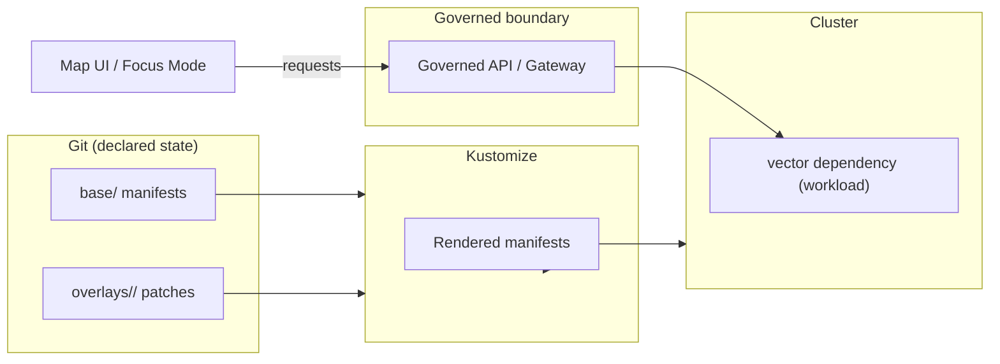

# `infra/apps/dependencies/vector/overlays`

✅ Governed • ✅ Evidence-first • ✅ FAIR+CARE minded • ✅ GitOps-friendly

Environment-specific **Kustomize overlays** for the `vector` dependency.

> [!NOTE]
> In this directory, **“overlays” = Kustomize overlays** (per-environment deltas layered over a shared base).
> This is **not** a registry of “map overlay datasets” (GeoJSON/PMTiles/etc). Those belong in the governed data/artifact pipeline and are served via governed APIs.

---

## What lives here

This folder contains **environment deltas** (patches + config) for deploying the **`vector` dependency** into Kubernetes via `kubectl -k`, Argo CD, Flux, or other GitOps controllers.

Typical per-environment changes include:

- image tags / versions
- replica counts and resource requests/limits
- ingress/route hostnames and TLS settings
- storage class / PVC sizing
- network policy / service exposure
- environment variables and config maps **(non-secret only)**

> [!IMPORTANT]
> **Trust membrane invariant:** the frontend (and any external clients) must **never** access databases or object stores directly. All access must go through the **governed API boundary**. Infra decisions that bypass this (e.g., public bucket exposure) violate KFM’s core safety posture.

---

## Directory contract

Recommended layout (illustrative — adjust to your repo reality):

```text
infra/apps/dependencies/vector/
├─ base/                       # shared manifests (no env-specific assumptions)
│  ├─ kustomization.yaml
│  └─ ... (Deployment/StatefulSet, Service, NetworkPolicy, etc.)
└─ overlays/
   ├─ dev/
   │  ├─ kustomization.yaml
   │  ├─ patch-image.yaml
   │  ├─ patch-resources.yaml
   │  └─ patch-ingress.yaml
   ├─ staging/
   │  └─ ...
   ├─ prod/
   │  └─ ...
   └─ README.md                # <-- you are here
```

### Overlay naming

Use environment names that match your promotion model:

- `dev/` (or `sandbox/`) – fast iteration, lower resources
- `staging/` (or `test/`) – production-like validation gates
- `prod/` – strictest policy + strongest constraints

---

## How overlays are applied

### Local render (no cluster)

```bash
kustomize build infra/apps/dependencies/vector/overlays/dev
# or
kubectl kustomize infra/apps/dependencies/vector/overlays/dev
```

### Apply to a cluster

```bash
kubectl apply -k infra/apps/dependencies/vector/overlays/dev
```

> [!TIP]
> Prefer `kubectl apply -k` in local testing and let your GitOps controller do the real deployments. GitOps works best when the repo stays the “source of truth” and environments are represented by directories rather than long-lived branches.

---

## What should NOT live here

**Do not commit:**

- raw datasets (GeoJSON/PMTiles/etc)
- secrets (API keys, DB passwords, tokens)
- credentials embedded in ConfigMaps
- direct object-store URLs meant for browsers to fetch (bypasses trust membrane)

**Do instead:**

- Reference secrets via an approved mechanism (e.g., External Secrets, SealedSecrets, SOPS, Vault) *(implementation choice: not confirmed in repo)*.
- Ensure any public-facing access is mediated by a governed API/gateway that can enforce policy, audit, and attribution.

---

## “Vector overlays” in the KFM sense

KFM’s mapping stack commonly treats “vector overlays” as **vector features + metadata** rendered on top of the basemap (e.g., boundaries, trails, points of interest, historical extents).

Typical payload formats include:

- **GeoJSON** for vector features/attributes (small-to-medium overlays)
- **Vector tiles / PMTiles** for larger overlays that need tiling and CDN-friendly distribution

This repo location is **infra config** for the dependency; the data itself should travel the KFM “truth path” (acquire → validate → enrich → catalog/provenance → serve → explain) and only then be exposed through governed APIs.

---

## Governance & security gates

Before merging overlay changes (especially anything that affects exposure, routing, or artifact retrieval):

### Required checks (minimum)

- [ ] `kustomize build` succeeds for all overlays
- [ ] manifests validate (`kubeconform`/`kubeval` or equivalent)
- [ ] policy checks pass (Conftest/OPA or equivalent) *(not confirmed in repo, but strongly recommended)*
- [ ] no secrets committed (secret scanning + human review)
- [ ] network exposure reviewed (ingress/route/service type)
- [ ] any new externally reachable endpoints have:
  - [ ] authN/authZ expectations documented
  - [ ] audit logging enabled
  - [ ] rate limiting expectations documented *(not confirmed in repo)*

> [!WARNING]
> Infra changes can silently create “side doors.” If an overlay change makes an object store or database reachable from browsers or public networks, it breaks the KFM governance model.

---

## Change workflow

1. Pick the target overlay: `overlays/dev`, `overlays/staging`, `overlays/prod`
2. Make the smallest possible change (prefer patches over forks)
3. Render + validate locally
4. Open PR with:
   - what changed (diff summary)
   - risk assessment (exposure, data sensitivity, rollback)
   - verification plan (how you proved it works)

### Rollback guidance

GitOps-friendly rollback = revert the commit or restore a known-good tag. Avoid “hot edits” directly in the cluster.

---

## Debugging tips

- Render the final YAML:
  - `kubectl kustomize infra/apps/dependencies/vector/overlays/<env> | less`
- Check what changed:
  - `git diff` (overlay patches are usually small and reviewable)
- Compare desired vs live state (tooling depends on your controller):
  - Argo CD: `argocd app diff ...` *(not confirmed in repo)*

---

## Architecture placement



---

## Assumptions

- `vector/` has a `base/` directory that this overlays folder composes from. *(not confirmed in repo)*
- Deployments are GitOps-managed and should use directory-based environment deltas. *(strongly consistent with the project’s direction; verify in repo)*

---

## Verification steps

If you’re unsure what `vector` refers to in **this repo** (tiles? overlay server? vector search? logging agent?), confirm by:

1. Inspect `infra/apps/dependencies/vector/base/kustomization.yaml` for `kind`, container images, labels
2. Search for references to `infra/apps/dependencies/vector` in your GitOps controller app definitions
3. Identify which KFM service depends on it (UI/API/pipeline), then tighten this README accordingly

