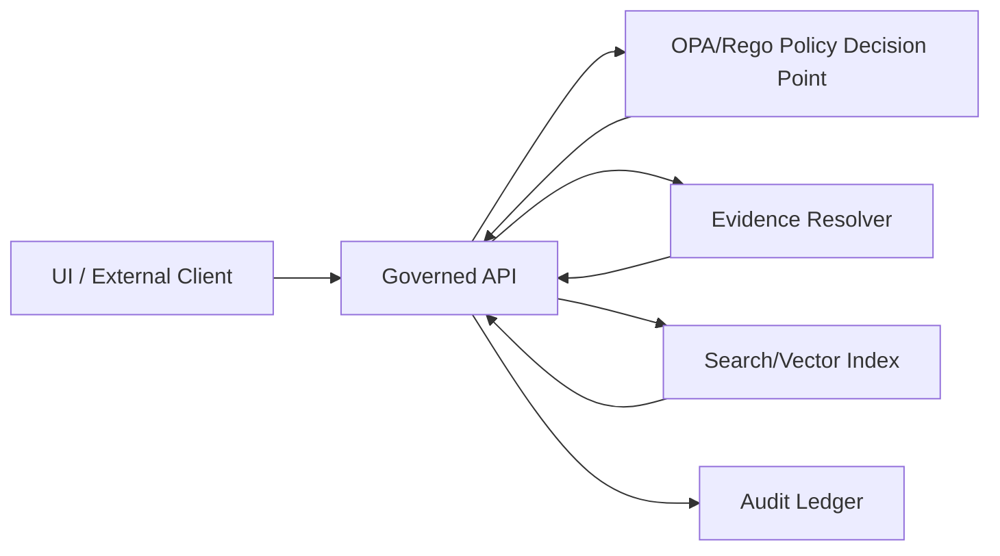

<!--
infra/apps/dependencies/vector/policy/README.md

Governance note:
This directory is a *policy surface* for KFM’s vector (embedding-based) retrieval dependency.
Changes here can materially affect what information is retrievable or exposable.
Default stance: deny-by-default, evidence-first, sensitivity-aware.
-->

# Vector Dependency Policy (OPA/Rego)


**Path:** `infra/apps/dependencies/vector/policy/`  
**Purpose:** Provide a **fail-closed policy bundle** that governs *what can be indexed* and *what can be retrieved/returned* through KFM’s **vector retrieval dependency** (semantic embeddings + hybrid search).

> [!IMPORTANT]
> “Vector” here means **embedding-based semantic retrieval** (Search/Vector index used by Focus Mode and evidence packs).
> It is **not** “vector tiles” for map rendering. If your repo uses `dependencies/vector/` for tile serving, rename or split into `tiles/` vs `search-vector/` (not confirmed in repo).

---

## Why this exists

KFM’s architecture relies on a **trust membrane**: external clients (including the web UI) must not access storage directly; access flows through governed APIs and policy checks. The **Search/Vector** store is explicitly called out as a critical risk surface—without constraints it can cause **hallucination** (retrieval not tied to evidence) and **leakage** (sensitivity bypass).  

This policy bundle exists to ensure:

- **Evidence-only retrieval**: results must point to resolvable evidence objects, not “free text” blobs.
- **Sensitivity-aware filtering**: no result can downgrade sensitivity (role + label gating).
- **Fail-closed behavior**: if required metadata/labels/claims are missing → **deny**.
- **Auditability hooks**: requests/decisions can be logged with stable identifiers (audit ledger integration happens elsewhere).

---

## Scope

### In-scope

| Surface | Decision | Examples |
|---|---|---|
| **Index write policy** | What content is eligible to be embedded and indexed | Only promoted/processed artifacts; block raw, unreviewed, or unlabeled items |
| **Query/read policy** | What results can be returned for a user/context | Role-based access; restrict sensitive-location precision; aggregate-only thresholds |
| **Evidence binding** | Whether a chunk/result is “evidence-addressable” | Must carry `evidence_ref` / `asset_id` / `bundle_digest` (exact fields vary; see contract below) |
| **Regression prevention** | Prevent known leaks from reappearing | Golden queries + negative tests |

### Out-of-scope

- How embeddings are computed (pipeline implementation lives elsewhere).
- Which vector engine is used (OpenSearch/Neo4j/Qdrant/etc.) (not confirmed in repo).
- Frontend rendering, tiles, or Story Node presentation logic.

---

## Non-negotiables

> [!CAUTION]
> These are “system invariants” for KFM-style governance. If you weaken them, you must route a governance review.

- **Default deny**: No request is allowed unless policy returns an explicit `allow: true`.
- **No trust-membrane bypass**: clients never call the vector engine directly.
- **No sensitivity downgrades**: policy must prevent serving a more precise or less restricted view than the dataset/record permits.
- **Evidence-first**: retrieval results must resolve to evidence objects, not untraceable snippets.
- **Regression tests are required**: leaks must remain permanently fixed.

---

## Sensitivity classes

These classes are used by KFM governance guidance and should be treated as first-class policy inputs.

| Class | Meaning | Typical handling |
|---|---|---|
| **Public** | Safe to publish without redaction | Normal retrieval allowed |
| **Restricted** | Requires role-based access (e.g., parcel ownership) | Deny for non-authorized roles |
| **Sensitive-location** | Coordinates must be generalized/suppressed (archaeology/sensitive species) | Return generalized geometry; suppress exact coords; optionally return “area only” |
| **Aggregate-only** | Only publish above thresholds (health/crime small counts) | Enforce aggregation threshold; suppress small-N |

> [!NOTE]
> Redaction is a **first-class transformation**: raw stays immutable; redacted derivatives are separate versions with explicit provenance and policy labels (implementation outside this folder).

---

## Policy contract

This README defines the **expected** inputs/outputs of policy evaluation for the vector dependency.

### Required policy inputs (conceptual)

At minimum, every policy decision should be evaluable from structured inputs like:

- `input.action`: `"index"` | `"query"`
- `input.user`: identity + roles/claims (e.g., `user.role`, `user.org`, `user.clearance`)
- `input.resource`: metadata about the item being indexed or retrieved
  - `dataset_id`, `dataset_version`, `asset_id` (or equivalent stable IDs)
  - `license`, `sensitivity_class`
  - `evidence_bundle_digest` (or pointer)
  - `provenance_ref` (optional but recommended)
- `input.query`: query context (for read-time decisions)
  - requested filters (bbox/time/theme), `top_k`, etc.
  - requested output precision (e.g., “exact coordinates requested?”)

> [!WARNING]
> If a field is required for safe enforcement (e.g., sensitivity labels), and it is missing, the policy must **deny**. Do **not** “best effort” your way into an allow.

### Policy outputs (conceptual)

- `allow`: boolean
- `deny_reasons[]`: stable strings for CI + audit readability
- `obligations[]`: required enforcement steps if `allow == true`
  - e.g., `"must_generalize_geometry"`, `"must_strip_fields:[owner_name]"`, `"must_attach_audit_ref"`

### Example input JSON

```json
{
  "action": "query",
  "user": {
    "role": "read-only",
    "org": "public",
    "clearance": "public"
  },
  "resource": {
    "dataset_id": "kfm.dataset.xyz",
    "dataset_version": "2026-02-01",
    "asset_id": "asset:docchunk:sha256:...",
    "sensitivity_class": "Sensitive-location",
    "license": "CC-BY-4.0",
    "evidence_bundle_digest": "sha256:..."
  },
  "query": {
    "top_k": 20,
    "requested_precision": "exact",
    "purpose": "focus_mode"
  }
}
```

### Typical deny reasons (examples)

- `missing_required_label:sensitivity_class`
- `missing_required_ref:evidence_bundle_digest`
- `action_not_allowed_for_role`
- `sensitive_location_precision_denied`
- `restricted_dataset_role_denied`

---

## Directory layout

> [!NOTE]
> The exact filenames below are a recommended scaffold (some may be **not confirmed in repo**).
> Keep the layout shallow and testable.

```text
infra/
└── apps/
    └── dependencies/
        └── vector/
            └── policy/
                ├── README.md                      # (this file)
                ├── rego/                          # policy modules
                │   ├── vector_access.rego         # allow/deny for index + query
                │   ├── sensitivity.rego           # sensitivity gates (no downgrades)
                │   └── evidence_binding.rego      # enforce evidence-addressable results
                ├── schemas/                       # JSON Schemas for policy inputs
                │   └── vector_policy_input.schema.json
                ├── tests/                         # unit tests + golden fixtures
                │   ├── fixtures/
                │   │   ├── allow_public_query.json
                │   │   ├── deny_missing_labels.json
                │   │   └── deny_sensitive_exact_precision.json
                │   └── vector_policy_test.rego
                └── conftest/                      # optional conftest wiring
                    └── conftest.toml
```

---

## How it fits KFM architecture

### Trust membrane flow



**Key point:** the policy check happens **before** the vector engine is used, and again **after** retrieval if obligations require filtering/field stripping.

---

## CI integration

### What must be enforced in CI

- **Fail-closed gate:** merges must be blocked if policy denies (or cannot evaluate).
- **Golden regression suite:** queries known to leak must remain failing forever.
- **Negative tests:** ensure sensitive-location layers cannot be returned at high precision to unauthorized roles.
- **Field-level redaction checks:** verify restricted fields (names, precise coords, small counts) are blocked.
- **Audit integrity checks:** every API response must include an audit reference and evidence bundle hash (API-layer responsibility, but policy can require as an obligation).

### Suggested commands

> [!TIP]
> Choose *one* test runner for consistency. OPA-native tests (`opa test`) are typically simplest.
> Use `conftest` when integrating with CI checks across multiple repos/components.

```bash
# OPA unit tests (rego)
opa test ./rego ./tests -v

# Conftest example (if used)
conftest test . -p ./rego
```

---

## Operational requirements (vector-specific)

### Index rebuild determinism

Policy should assume the index can be rebuilt from **processed** artifacts and catalogs. To support that, index writes should require:

- stable IDs (dataset/version/asset)
- stable embedding config identifier (e.g., a `spec_hash`) (recommended)
- evidence bundle digests for traceability

### Retention and deletion

- **Do not** delete raw evidence to “fix” a policy issue; create **redacted derivatives** with provenance.
- Index entries should be removable/invalidatable when a dataset version is revoked or reclassified.

---

## Security & governance notes

> [!CAUTION]
> Vector systems can leak information even without returning original text:
> embeddings can enable membership inference, and retrieval can amplify “sensitive-location” leakage.
> Treat vector retrieval as a **high-risk** surface requiring strict labeling + filtering.

Minimum mitigations:

- Never index unlabeled content.
- Do not index raw/private fields by default.
- Enforce sensitivity-aware query filtering.
- Require evidence refs so returned contexts are auditable.

---

## Definition of Done

### Any change to this policy bundle must satisfy:

- [ ] **Default deny** is preserved (no implicit allows)
- [ ] Policy inputs are **schema-validated**
- [ ] Unit tests include:
  - [ ] at least 1 allow case (Public)
  - [ ] at least 1 deny case (missing labels/refs)
  - [ ] at least 1 deny case (Sensitive-location exact precision)
  - [ ] at least 1 deny case (Restricted without role)
- [ ] Golden regression fixtures exist for any historical leak
- [ ] CI runs policy tests and blocks merge on failure
- [ ] Any new sensitivity rule has a documented “why” + test fixture
- [ ] (Recommended) CODEOWNERS requires Governance/Security review for policy changes (not confirmed in repo)

---

## References inside KFM

These are conceptual pointers (paths may vary):

- `docs/search/` — search + retrieval architecture and DRIFT patterns (not confirmed in repo)
- `docs/policy/` — global policy conventions and templates (not confirmed in repo)
- `docs/runbooks/` — incident response + rollback procedures (not confirmed in repo)

---

## Verification steps (minimum work)

1. Pick one pilot dataset with known sensitivity requirements (e.g., sensitive-location).
2. Implement **one** deny case + **one** allow case end-to-end:
   - policy input → OPA decision → query result filtered/redacted
3. Add a golden query that *used to leak* and confirm it **fails forever** in CI.
4. Confirm the API always emits:
   - an `audit_ref`
   - an `evidence_bundle_digest` (or equivalent) on responses
